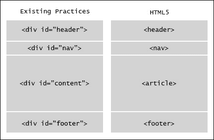
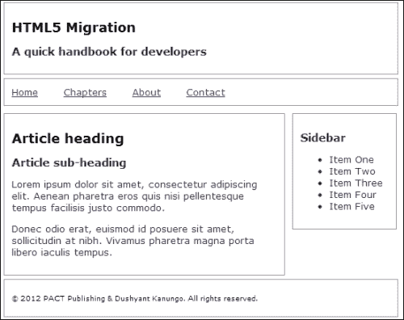
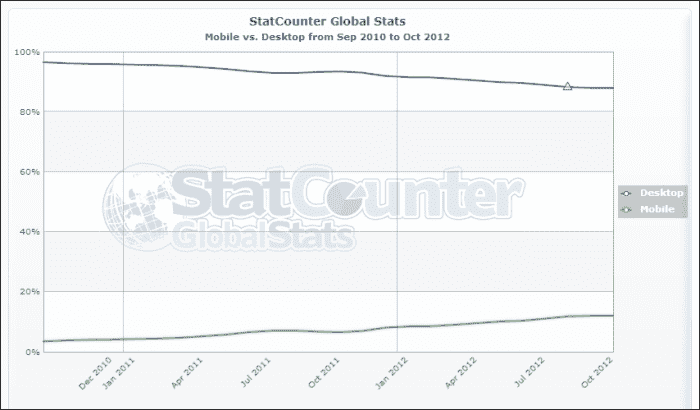

# 第一章。即时迁移到 HTML5 和 CSS3 操作指南

自 1991 年创立以来，HTML 只改变了少数几次。在这个快节奏的数字时代，最受欢迎的技术之一变化如此缓慢是非常不寻常的。从基于表格的布局到基于 div 的架构，从 HTML 的主要规范到向后兼容的 XHTML 网站，从内联样式到外部动态样式表，技术进步的采用进展缓慢。

就在 1999 年 12 月 HTML 4.01 规范发布之后，**万维网联盟** ( **W3C** )和工作组的焦点转移到了 XHTML 和 CSS 上。为了简单的基于标签的文档和与早期版本的后备兼容性，在各种编码实践之间跳跃的举动，使得大部分网页都带有破碎的、不一致的和面向非标准的代码。

在当今时代，当网络存在被认为等同于房地产或商店门面时，为了在搜索结果中获得更高的可见性，网页变得可访问、高效、精简、快速和语义正确变得至关重要。

欢迎来到*即时迁移到 HTML5 和 CSS3 操作手册*。这本书将为您提供在将您当前的网站迁移到 html 5(W3C 的新网络标准)时需要了解的所有信息。

在接下来的食谱中，我们将通过各种例子来帮助您迁移您当前的网站，而不会将任何现有的内容/演示文稿更改为 HTML5。我们还将解决您的网站在此过程中可能面临的任何兼容性问题，并提出适当的解决方案，并进一步讨论升级的一些出色的新功能。

# 当前网站分析(必知)

在迁移任何网站之前，我们都需要分析和检查文档和访问者的当前状态。这个练习将帮助我们获得可以升级的所有资源、库和依赖项的概要。

对访问者的快速分析将有助于我们确定访问者使用的最常见的浏览器，以及是否有任何特定的浏览器(阅读 IE6)我们可以从此次升级中排除。如果很大一部分访问者一直使用过时的浏览器访问您的网站，这些收集的信息将指导我们为这些访问者设置代码规则或后备选项。

## 做好准备

要开始分析，我们只需要访问谷歌分析，或者集成在网站仪表板中的类似跟踪服务。比如我们会看一下我的网站的访客趋势，是[http://www.dushyantkanungo.com](http://www.dushyantkanungo.com)，持续一定的时间。

你可以用你现在的网站和文字处理器(铅笔/纸)来记录我们在路上发现的问题。

## 怎么做…

1.  The website [http://www.dushyantkanungo.com](http://www.dushyantkanungo.com) uses Google Analytics for visitor tracking, which can be accessed from [http://www.google.com/analytics](http://www.google.com/analytics). After navigating to **Audience** | **Technology** | **Browser & OS** from the left-hand side column, here is what we get for a specific period:

    

    根据谷歌分析提供的上述统计数据，我们现在知道，该网站 75%以上的访问者使用谷歌 Chrome 或火狐，约 20%的流量来自 IE 和 Safari。

2.  Moving further in, we can see that the ratio of the older versions of IE, which were used to visit the website, becomes nominal and hence, we can choose coding practices to either support or exclude them.

    

    对操作系统的类似分析可以告诉我们来自移动设备或不同屏幕分辨率的访问者数量。这有助于我们为目标人群中的一系列最终用户设计支持。

3.  Next, we need to check the current validation status of the website with a W3C validator at [http://validator.w3.org](http://validator.w3.org). This will tell us if there are any known issues with the content markup before we head towards the updated version. Just note down or copy the errors in a document for future reference.

    ### 注

    有时，旧网站会链接到可能已经移动或不再存在的外部资源。从网页上断开链接总是不被允许的，不仅仅是访问者，爬虫也是如此。

    为了检查这些链接的当前状态，并在适当的时候纠正它们，我们可以使用一个名为 **Xenu 的链接侦探**(从[http://xenus-link-sleuth.en.softonic.com](http://xenus-link-sleuth.en.softonic.com)下载)的小工具，这是一个便携式的免费软件，来生成关于该网站可能存在的任何断开链接的报告。

4.  Moving ahead, using Firefox or Chrome, you can check the time taken by the page to load by right-clicking anywhere on the page and selecting **Inspect Element** | **Network**. Then we have to refresh the page to see the real-time results of the time taken by all the requests to the server from the page.

    

5.  您可能希望检查外部小部件或任何大型图像文件的脚本是否需要很长时间才能加载，从而影响网站的性能。

## 它是如何工作的...

目标受众、浏览器、已知的基于内容的破损标记信息和链接结构的知识将帮助您提高最终迁移的产品质量。

此外，您可能希望从旧的 DHTML/JavaScript 实用程序转移到改进的 jQuery 库，或者从基于图像的文本转移到 CSS 驱动的样式，以获得良好的性能。

## 还有更多...

HTML5 的相关性远远大于人们对编写网页的一套新规则的预期。简单而强大的标签也伴随着开发者的许多期望。

### 有效代码的影响

**文档类型定义** ( **DTD** )表示为`<!DOCTYPE...>`，允许浏览器正确解释哪些规则(XHTML、HTML 等)被用于编写单个网页，并随后正确呈现它们。

HTML 的通用规范，以及后来的 XHTML 规范，允许浏览器在有效使用或不使用 HTML 标签的情况下，以可能的最佳解决方案呈现网页。这意味着，如果一个文档用一个定义为 XHTML 的 DTD 编写，它仍然会呈现和显示所有没有用 XHTML 规范关闭的元素(例如`<br/>`)。

迁移到更高标准的全部意义在于采用最佳实践来开发代码，以便为未来的技术发展铺平道路。浏览器供应商不支持 W3C 关于 HTML 或 CSS 的所有规范的最大理由仍然是当前标准的受欢迎程度较低，大量网页仍在以错误的编码实践进行开发。

作为一名网络专业人员，确保我们开发的网页符合国际标准，语义正确，并认可互联网作为一个无状态、无主和免费网络的全部目的，以使浏览器供应商处于优势地位，这一点很重要。

### html 5 的重要性

理解关于 HTML5 如此多的喧嚣和噪音背后的原因并不难。为了让事情看得更清楚，以下是 HTML5 的 5 个特点:

*   **文件大小**:使用新语义切片标签的 HTML5 的文件大小差异会比 XHTML 略小。对于需要外部支持或更长语法的任务，有了各种新的标签，我们现在有了一个更干净、更强大的 HTML 规范。
*   **语义**:html 5 的语义规范了现有的编码实践，帮助机器和人类一样，阅读和理解代码。这也为可扩展和易于维护的网站铺平了道路。
*   **简单性**:新的简单标签比以往任何时候都更有助于定义文档的结构。这使得结构简单，易于在维护或移交过程中理解。
*   **支持**:设备种类繁多，支持浏览器，现在创建丰富的基于 web 的应用变得更加容易，不需要依赖访客端的第三方插件。结合 CSS3，HTML5 提供了从漂亮的排版到外部字体、渐变颜色到圆形边缘等一切。
*   **SEO** :对于企业主和营销经理来说，HTML5 迁移证明是一种资产投资，长期来看具有很强的回报潜力。有了更高的内容代码比，语义定位的文章，以及以前可用的(并积极鼓励 HTML5)微格式数据，搜索爬虫更容易区分真实信息和强制搜索引擎优化实践。

### 简单来说就是语义网

根据 W3C 的说法:

> *“语义网提供了一个通用的框架，允许跨应用、企业和社区边界共享和重用数据。”*

简而言之，这意味着网页的不同模块，如页眉、页脚、内容等，可以由特定的应用和爬虫出于各种目的单独识别和提取。HTML5 中的语义赋予了一维`DIV`标签身份，帮助网站变得更智能，并鼓励真正的基于内容的网页。

下面是一个非常基本的结构差异的例子，我们将在后面详细讨论:



目前，开发者可以给出他们自己选择的标识来设计网页中的任何标签。内容**的`DIV`的`ID`可以是`inner-copy`也可以是**头**的`DIV`的`ID`可以是`top`等等，目前 XHTML 和 HTML 的老版本都是这样的做法。这使得外部应用或爬虫无法从网页上的垃圾数据中识别实际内容。**

有了 HTML5，新的标签，如`HEADER`、`FOOTER`、`NAV`、`ARTICLE`、`ASIDE`或`SECTION,`等等，为网页的各个部分提供了一个全球识别系统。

### 最后

有了关于当前网站的所有必要信息和明确的练习目的，我们开始迁移到 HTML5。

我们还将研究优先黑客和替代解决方案，它们可以解决其中一些问题。

# 迁移开始(必须知道)

在本节中，我们将获取一个带有常规功能或部分的示例 XHTML 页面，并将它转换为 HTML5，而不会干扰网站以前的任何内容或结构。

## 做好准备

首先，从文件传输协议中获取一份你网站的本地副本，并在其他文件夹中进行备份，以便以后进行比较。在编辑器中打开一个 HTML 文档。

## 怎么做…

1.  示例文档的代码可能类似于下面的代码:

    ```html
    <!--the doctype declaration and head element-->
    <!DOCTYPE html PUBLIC "-//W3C//DTD XHTML 1.0 Transitional//EN" "http://www.w3.org/TR/xhtml1/DTD/xhtml1-transitional.dtd">
    <html  lang="en" xml:lang="en">
    <head>
    <meta http-equiv="Content-Type" content="text/html; charset="utf-8" />
    <title>Example Document</title>
    <link rel="stylesheet" type="text/css" href="style.css" />
    </head>
    <!--body of the document starts -->
    <body>
    <div id="wrapper">
    <div id="header">
            <h1>HTML5 Migration</h1>
            <h2>A quick handbook for developers</h2>
    </div>
    <!--navigation starts-->
    <div id="nav">
           <ul>
    <li><a href="#">Home</a></li>
    <li><a href="#">Chapters</a></li>
    <li><a href="#">About</a></li>
       <li><a href="#">Contact</a></li>
    </ul>
    </div>
    <!--navigation ends-->
    <!--content starts-->
    <div id="content">
            <h1>Article heading</h1>
            <h2>Article sub-heading</h2>
            <p>Loremipsumdolor sit amet, consecteturadipiscingelit. Aeneanpharetraerosquis nisi pellentesque tempus facilisisjustocommodo.</p>
            <p>Donecodioerat, euismod id posuere sit amet, sollicitudin at nibh. Vivamuspharetra magna portaliberoiaculis tempus.</p>
    </div>
    <!--sidebar starts-->
    <div id="sidebar">
          <h2>Sidebar</h2>
    <ul>
       <li>Item One</li>
       <li>Item Two</li>
       <li>Item Three</li>
       <li>Item Four</li>
       <li>Item Five</li>
       </ul>
    </div>
    <!--sidebar ends-->
    <!--footer starts-->
    <div id="footer">
            <p>&copy; 2012 PACKT Publishing &amp; Dushyant Kanungo. All rights reserved.</p>
    </div>
    <!--footer ends-->
    </div>
    <!--content ends-->
    </body>
    <!--body ends--></html>
    <!--end of document-->
    ```

2.  让我们给前面的 HTML 页面添加一点样式:

    ```html
    //style for the whole document
    body {font-family: Verdana, Geneva, sans-serif;	font-size: 12px; color: #333; font-size:0.8em;}
    //various div properties
    div#wrapper {width:80%; margin: 0 auto;}
    div#header, div#nav, div#footer {clear:both;}
    div#header, div#nav, div#footer, div#content, div#sidebar {margin:5px; border:1px solid #999; padding:10px;}
    div#content {width:72%;float:left;}
    div#sidebar {width:22%;float:left;}

    div#nav ul {margin:0; padding:0;} 
    div#nav ul li {display:inline; margin-right:30px;}
    div#footer {font-size:0.7em; color:#000;}
    ```

3.  This is how the page looks in the browser:

    

    ### 注

    **下载示例代码**

    您可以从您在[http://www.PacktPub.com](http://www.PacktPub.com)的账户中下载您购买的所有 Packt 书籍的示例代码文件。如果您在其他地方购买了这本书，您可以访问[http://www.PacktPub.com/support](http://www.PacktPub.com/support)并注册，以便将文件直接通过电子邮件发送给您。

### 文档类型

浏览器基于文档类型定义(DTD)来识别文档的类型，文档类型定义在前面代码的第一行中通过使用`DOCTYPE`标签来声明。dtd 为标记语言定义了特定的规则。

示例代码中的 DTD 在 XHTML 1.0 中带有过渡规则，定义如下:

```html
<!DOCTYPE html PUBLIC "-//W3C//DTD XHTML 1.0 Transitional//EN" "http://www.w3.org/TR/xhtml1/DTD/xhtml1-transitional.dtd">
```

HTML 和 XHTML 文档的`DOCTYPE`定义因不同版本和不同规则集而异，如`transitional`、`loose`、`strict`或`frameset`。在 HTML5 中，只需使用以下命令，就可以解决为各种文档版本或规则定义记忆多行不同代码的问题:

```html
<!DOCTYPE HTML>
```

简洁明了。

### 根元素

接下来，我们使用以下代码来研究根元素:

```html
<html  lang="en" xml:lang="en">
```

由于我们已经在代码的第一行用`DOCTYPE`建立了文档类型，所以不需要再次声明。这会使用以下语言声明将标记截断为其主要形式:

```html
<html lang="en">
```

### 头部元素

我们在任何 HTML 页面的头部声明的第一件事是字符编码。如果我们在内容中使用了任何特殊字符，这将使浏览器理解并帮助翻译。字符编码在`Meta`标签中定义:

```html
<meta http-equiv="Content-Type" content='text/html; charset="utf-8"'>
```

同样，这需要在一页中第三次声明内容类型。删除不需要的代码和重复声明后，这将截断为以下内容:

```html
<meta charset="utf-8">
```

通过查看到目前为止的迁移代码，我们得到了以下结果:

```html
<!DOCTYPE html>
<html lang="en">
<head>
<meta charset="utf-8" />
<title>Example Document</title>
<link rel="stylesheet" type="text/css" href="style.css" />
</head>
```

### 身体元素

将常见 HTML 文档的`div`元素简化如下:

```html
<div id="header">...</div>
<div id="nav">... </div>
<div id="content">... </div>
<div id="sidebar">... </div>
<div id="footer">... </div>
```

HTML5 为我们提供了这些`DIV`标签的通用标识，用于个人识别:

```html
<header>... </header>
<nav>... </nav>
<article>... </article>
<section>... </section>
<footer>... </section>
```

`DIV`标签`sidebar`可以通过`<aside>`标签识别为唯一的。

让我们将所有新标签放在主代码中，如下所示:

```html
<div id="wrapper">
<header>
      <h1>HTML5 Migration</h1>
      <h2>A quick handbook for developers</h2>
</header>
<nav>
<ul>
<li><a href="#">Home</a>
</li>
</ul>
</nav>
<article>
      <h1>Article heading</h1>
      <h2>Article sub-heading</h2>
      <p>Loremipsumdolor …  tempus. </p>
</article>
<aside>
   <h2>Sidebar</h2>
<ul>
<li>Item O...  Five</li>
</ul>
</aside>
<footer>
      <p>&copy; 2012 PACKT … </p>
</footer>
</div>
```

请注意，HTML5 没有任何`<wrapper>`或`<container>`标签，使用`DIV`标签仍然是 HTML5 有效且可接受的做法。`<div id="wrapper">`或`<div id="container">`标签声明仍然常用于定义页面的实际宽度。

### CSS

随着新截断的 HTML 代码，我们也需要改变 CSS。以 HTML5 为元素的 CSS 有助于减少许多标签元素的 CSS 选择器。因此，样式表中这些元素的分段标签上的`CLASS`或`ID`名称不需要前缀；例如，`p.intro`等等。

```html
header, nav, footer {clear:both;}
header,nav,footer,article,aside {margin:5px; border:1px solid #999; padding:10px;}
article {width:72%;float:left;}
aside {width:22%;float:left;}

nav ul {margin:0; padding:0;}
nav ul li {display:inline; margin-right:30px;}
footer {font-size:0.7em; color:#000;}
```

### 兼容性场景

目前，只有少数不太流行的浏览器支持新标签的所有基于块的显示。为了解决这个问题，我们必须为浏览器创建定义，这些定义*还没有*理解所示的新语义分段标签。某些浏览器(某些版本的 Internet Explorer)需要显式创建这些浏览器。

为了定义这一点，我们只需要在 CSS 文件的顶部添加前面的代码片段:

```html
article,aside,details,figcaption,figure,footer,header,hgroup,menu,nav,section {display:block;}
```

### 进一步的语义部分

如果你仔细观察我们在例子中使用的代码，你会发现有两个`H1`和`H2`标签在持续使用。一个是网页的标题，另一个是内容。这可能会导致爬虫混淆，并可能导致标题在某些页面上多次出现。

要对这个问题进行排序，我们可以定义*头组*或`HGROUP`元素。

这里，第一组标题变成:

```html
<header>
<hgroup>
         <h1>HTML5 Migration</h1>
      <h2>A quick handbook for developers</h2>
   </hgroup>
</header>
```

第二组变成:

```html
<article>
   <hgroup>
         <h1>Article heading</h1>
         <h2>Article sub-heading</h2>
      </hgroup>
         <p>Loremipsumdolor …  tempus. </p>
</article>
```

对于页面上出现的多个标题(作为文章特定部分的登录页面)，可以附加这些标题，以便于特定组的操作:

```html
<article>
   <hgroup>
         <h1>Article heading</h1>
         <h2>Article sub-heading</h2>
      </hgroup>
         <p>Loremipsumdolor …  tempus. </p>

<hr>
   <hgroup>
         <h1>Article heading</h1>
         <h2>Article sub-heading</h2>
      </hgroup>
         <p>Loremipsumdolor …  tempus. </p>
</article>
```

标题的样式可以通过以下选择器完成:

```html
header hgroup {font-weight:bold;}
article hgroup {font-weight:normal;}
aside hgroup {text-decoration:none;}
```

这不仅使操作任何特定的标题集变得容易，而且有助于生成一个整洁的 CSS 文件。

### 图形和说明

如果我们看所有的教科书或报纸，通常的做法是在每个图像或图形中使用图形标题来提供完整的视觉解释。查看带有普通``元素的网页，我们必须使用带有所有附加属性的手动`div`元素来提供标题。

```html

```

HTML5 允许我们用`FIGURE`元素将图形和图像分块，用嵌套的`FIGCAPTION`元素将标题分块:

```html
<figure>

<figcaption>A beautiful sunset in Greece by 
<a href="http://www.flickr.com/photos/byrdiegyrl/"> Karol M</a>
</figcaption>
</figure>
```

这将输出以下内容:


如果需要，对标题的中心对齐使用一个小样式，我们有一个语义正确的图形，它也遵守可访问性和**创作共用**规则。

### 形态元素

HTML 早期版本中的表单元素高度依赖于 JavaScript 对某些基本任务的支持，例如**占位符**和**所需数据**。有了 HTML5，我们获得了几个新的属性来支持`form`和`input`元素。

其中一些属性如下:

<colgroup><col style="text-align: left"> <col style="text-align: left"></colgroup> 
| `autocomplete` | `height and width` |
| `autofocus` | `list` |
| `form` | `min and max` |
| `formaction` | `multiple` |
| `formenctype` | `pattern (regexp)` |
| `formmethod` | `placeholder` |
| `formnovalidate` | `required` |
| `formtarget` | `step` |

浏览器对这些属性的支持仍有一些差距，但有了新的 IE10，微软已经承诺将这一差距缩小到最大容量。

以下是 HTML5 表单元素最常用的一些属性:

*   实践中，自动对焦:

    ```html
    First name: <input type="text" name="fname" autofocus="autofocus">
    ```

*   使用按钮图像:

    ```html
    <input type="image" src="images/submit.png" alt="Submit">
    ```

*   必填字段:

    ```html
    Email: <input type="text" name="email" required>
    ```

*   表单输入中的占位符文本:

    ```html
    <input type="text" name="fname" placeholder="First name">
    ```

### 输入类型

此外，HTML5 中的新输入类型减少了开发人员所需的大量额外脚本。这些新的输入类型是:

<colgroup><col style="text-align: left"> <col style="text-align: left"></colgroup> 
| `color` | `range` |
| `date` | `search` |
| `datetime` | `tel` |
| `datetime-local` | `time` |
| `email` | `url` |
| `month` | `week` |
| `number` |   |

在撰写本书时，所有新的输入类型都得到谷歌 Chrome 和 Opera 的支持，但与其他浏览器仍有一些不一致之处。

让我们来看看这些输入类型的一些应用:

*   拾色器:

    ```html
    Select color: <input type="color" name="color">
    ```

*   日期选择器:

    ```html
    Date of birth: <input type="date" name="dob">
    ```

*   已验证的电子邮件:

    ```html
    E-mail: <input type="email" name="emailadd">
    ```

*   范围选择器:

    ```html
    <input type="range" name="points" min="1" max="10">
    ```

## 它是如何工作的...

HTML5 标准化了常见的编码实践，并创建了一组更面向语义的切片标签(例如，`header`、`nav`、`footer`等)。这促进了内容数据的机器可读性、互操作性和可重用性。

消除`DOCTYPE`声明和主要语法中的所有重复内容，向浏览器和其他应用宣布文档的格式，使开发人员更容易组织和组织内容。

通过引入语义分段标签，如`header`、`footer`、`nav`等，不再需要过度使用带有`ID`或`CLASSES`的`DIV`标签，代码现在看起来更加清晰，语义更加正确。

## 还有更多...

人们可能需要一些关于特定标签的效用的说明，这些标签可以用来代替其他标签。这里解释了**部分对文章**和**菜单对导航**标签。

### 章节与文章

关于`<section>`和`<article>`标签的嵌套在开发者社区中还有一些争论。有些开发人员更喜欢将内容`DIV`称为`<section>`，并在里面放置多个`<article>`标签，有些开发人员更喜欢有一个带有多个`<section>`标签的`<article>`标签。

一个`article`标签被推荐用于一段内容，该内容可以整体整合，并且在不同的上下文中仍然有意义(如在杂志文章中)。

`section`标签通常被推荐用于一页内容中，以表示在主题上不同于页面上另一区域的区域；例如，新闻区和博客区。

### 菜单与导航

就像`section`和`article`一样，我们在`nav`和`menu`还有另外一套类似的发声元素。

根据 W3C 的说法，`nav`元素表示文档中链接到其他文档或文档本身中的部分的部分；也就是说，导航链接的一部分和`menu`元素用于定义上下文菜单和工具栏。

简而言之，主导航使用`nav`，页面应用使用`menu`。

# 微格式——更智能的网络(应该知道)

根据[www.microformats.org](http://www.microformats.org):

> *“微格式首先是为人类设计的，其次才是为机器设计的，它是一组简单、开放的数据格式，建立在现有且被广泛采用的标准之上。”*

虽然**微格式**已经存在，并且在 W3C 发布 HTML5 规范之前就已经在实践中使用了，但是他们共同的格言——语义编码方式——将微格式的地位提高了许多倍。

使用微格式不会影响网页的任何视觉方面，但是如果需要，可以使用这些选择器来设置数据呈现的样式。

## 做好准备

首先，让我们来看看常用的微格式:

### 已发布的微格式

甚至在 HTML5 规范发布之前，发布的微格式就已经被 W3C 标准化了。强烈建议并鼓励使用这些微格式。

*   复合微格式
    *   **hCard** :定义人员和组织的联系方式
    *   **hCalendar** :这定义了基于时间的信息，例如事件
    *   **XOXO** :这定义了轮廓
*   基本(简单)微格式:
    *   **hAtom** :用于在标准 HTML 中标记 Atom 提要
    *   **adr** :这定义了邮政地址
    *   **地理**:定义地理坐标(纬度、经度)
    *   **hMedia** :这定义了音频/视频内容
    *   **hNews** :这定义了新闻内容
    *   **hpproduct**:定义产品的数据
    *   **hRecipe** :这定义了关于食谱和食物的数据
    *   **hressume**:定义简历或简历等数据
    *   **hReview** :这定义了评论
    *   **相对目录**:用于分布式目录的创建和包含
    *   **相关附件**:定义网页的多媒体附件
    *   **相关许可**:这定义了版权许可的规范
    *   **rel-nofollow** :这是为了阻止第三方内容垃圾邮件(例如，博客中的垃圾邮件)
    *   **rel-tag** :用于去中心化标注(folksonomy)
    *   **x 民俗**:这定义了标记链接
    *   **XHTML 朋友圈** ( **XFN** ):这个是用来社交的
    *   **VoteLinks** :表示同意或不同意链接的目的地，或对链接的目的地漠不关心

### 微格式草案

有几个微格式正在开发中，我们可以选择在必要时通过预见未来来实现:

*   **hAudio** :这定义了音频文件和对已发布录音的引用
*   **引用**:这定义引用参考文献
*   **货币**:定义货币的金额明细
*   **图**:用于将字幕与图像关联
*   **地理延伸**:这定义了火星、月球和其他类似天体上的地名。它还存储了关于高度和标记路线或边界的航路点集合的数据
*   **物种**:这定义了生物的名称(已经被维基百科和 BBC 野生动物发现者使用)
*   **测量**:定义物理量和结构化数据值

现在，我们需要列出内容的所有通用属性，这些属性可以与各种设备共享。日期等文档和用途可以用于日历，电子邮件地址可以用于地址簿，街道地址可以由地图应用使用，或者简历可以由简单的机器人搜索(如果它是用`hResume`定义的)。

## 怎么做…

让我们举一个微格式最常见用法的例子。

### hCard

每个网站通常都有一个联系页面，上面有该组织的注册地址。一般来说，地址是由一些常见的属性组成的，例如组织名称、联系人、建筑编号、街道名称、城市、州、邮政编码、国家、电话号码、电子邮件地址等。

例如，本书的出版社 Packt Publishing 的联系方式是:

派克特出版有限公司

利物浦广场二楼

利威街 35 号

伯明翰

B3 2PB

T +44 0121 265 6484

F +44 0121 212 1419

`<[contact@packtpub.com](mailto:contact@packtpub.com)>`

要在没有微格式的情况下用 HTML 格式化这个地址应该很简单。

```html
<p>
Packt Publishing Limited<br />
2nd Floor, Livery Place<br />
35 Livery Street<br />
Birmingham<br />
B3 2PB<br />
T +44 0121 265 6484<br />
F +44 0121 212 1419 <br />
<a href="mailto:contact@packtpub.com">contact@packtpub.com</a><br />
</p>
```

一个简单而又非常常见的编码实践！但是，它对浏览器或爬虫来说，除了只是另一个带有一些链接和换行符的段落标记之外，还有什么意义吗？号码

现在，我们将`hCard`微格式添加到前面的数据中:

```html
<div class="vcard">
<div class="fn org">Packt Publishing Limited</div>
<div class="adr">
<div class="street-address">2nd Floor, Livery Place, 35 Livery Street</div>
<div><span class="locality">Birmingham</span>,
   <span class="postal-code">B3 2PB</span></div>
<div class="country-name">UK</div>
</div>
<div>Phone: <span class="tel">+44 0121 265 6484</span></div>
<span class="tel"><span class="type">Fax</span>: 
<span class="value">+44 0121 212 1419</span></span>
<div>Email: <span class="email"><a href="mailto:contact@packtpub.com">contact@packtpub.com</a></span></div>
<div>
<span class="tel"><span class="type">Fax</span>:
<span class="value">+1-415-882-0495</span></span>
</div>
</div>
```

`hCard`微格式的属性如下:

<colgroup><col style="text-align: left"> <col style="text-align: left"></colgroup> 
| `vcard` | `email` |
| `fn` | `bday` |
| `org` | `honorific-prefix` |
| `adr` | `honorific-suffix` |
| `street-address` | `label` |
| `locality` | `logo` |
| `postal-code` | `nickname` |
| `country-name` | `note` |
| `tel` | `photo` |
| `fax` | `post-office-box` |

### 日期/时间

有了 HTML5，微格式的新进入者是**日期/时间**。通过增强新标签`<time>`，我们可以定义页面的年龄、内容相关性以及对各种设备的日历支持。

```html
<time>2012-11-05</time>
```

HTML5 中的`time`元素为后面的内容给出了时间定义。现在，让我们给它添加一些微格式:

```html
<time datetime="2012-11-05">5<sup>th</sup> November</time>
```

在一个定义中，`datetime`作为一个单一的属性既包括日期也包括时间。如果我们必须只定义时间而不是日期，那么我们可以做以下事情:

```html
<time datetime="20:00">starting at 8pm</time>
```

现在，一起:

```html
<time datetime="2012-11-05T20:00+00:00">5<sup>th</sup> November, 8pm for the party</time>
```

日期可以只通过年数、年-月、年-Wxx(其中 xx 是当年的周数)来定义，正如我们在前面的例子中看到的，日期之后的时间声明为`-T`。值`+00:00`可以用格林尼治标准时间差值来定义当地时间。

前面的声明对于各种浏览器和设备来说已经足够令人满意了，允许访问者添加日历项目或事件提醒。

### 继电器-nofollow

`rel-nofollow`微格式已经被 SEO 驱动的开发者使用了很多年。`rel-nofollow`作为任何`<a>`标签中的属性，告诉爬虫以下链接是外部网站或包含数据，网站不需要在搜索结果中被抓取或列出。

```html
<a href="http://www.example.com" rel="nofollow">Other Website<a>
```

## 它是如何工作的...

微格式使用各种类名和属性来定义它们后面的特定数据类型的属性。浏览器、设备和爬虫都可以识别这些数据。网页中`hCard`的简单实现给爬虫一种信息和组织行为的真实性。

同样，日期/时间也可以用特定页面的发布日期来实现，以确保爬网程序将其识别为最新信息，并保持较高的排名。

## 还有更多...

微格式的应用对于数据在主要应用之外的可扩展性至关重要。

### 扩展数据

在多设备、多平台的互联网时代，信息不再局限于标准的 HTML 可视化。网页内容越智能，它对各种应用就越有用。

许多基于 XML 的应用、爬虫、机器人和算法每天都在开发，以有意义的方式识别和排序内容。当 HTML5 正在重新定义完整的编码方法时，微格式正忙于创造一个新的更智能的网络。

# 在多媒体上播放(必须知道)

自从 HTML 诞生以来，一个问题经常在开发人员社区中引起争论。为什么我们有图像的`img`标签，却没有`video`或`audio`标签来支持视频或音频文件？这个问题的答案是另一个关于音频/视频文件大小和互联网速度的问题。

近年来，互联网已经发生了转变。像 YouTube 和 Vimeo 这样的视频分享网站让访问者在网上上传、分享和观看多媒体成为一种日常习惯。这只有通过第三方软件插件才能实现，例如 Adobe Flash、来自 Quicktime Player、Realplayer 或 Windows Media Player 的集成组件。

在每一种情况下，访问者必须将这些软件和支持插件本地安装在他们的计算机上。此外，对于为了视频目的而访问的网站应该使用哪种插件格式，仍然没有标准化。

在浏览器中加载所有这些扩展和插件需要花费大量时间，导致计算机和连接的响应速度非常慢。

凭借更快的互联网连接、浏览器支持和 HTML5 的标准化方法定义，原生文件格式对浏览器视频和音频的支持解决了这个问题。差不多吧。

## 做好准备

首先，获取我们在本书前面所做的网站分析，以了解访问者最近使用的浏览器的比例。

所有浏览器都支持`<video>`和`<audio>`标签，包括 IE，但只有 IE9 或更高版本。

第二步是将您的媒体文件放在`.ogv`、`.mp4`和`.webm`中用于视频，放在`.ogg`和`.mp3`中用于音频。每个文件的各种文件格式将留给浏览器选择和播放他们支持的最佳格式。

## 怎么做…

HTML5 中的`<video>`和`<audio>`元素与图像的``元素没有太大区别。唯一看得见的区别是文本的完全使用，没有删减到三个字符和一个独立的结束标记。

### 视频

我们就是这样将视频嵌入到 HTML5 文档中的:

```html
<video src="movie.webm"></video>
```

如果访客来自不支持`video`标签的浏览器，我们可以添加消息告知其不便之处。

```html
<video src="movie.webm">
This is fallback content to display if the browser does not support the video element.
</video>
```

为了解决浏览器的单独格式支持，我们可以为浏览器本身提供选项:

```html
<video>
<source src="movie.webm" />
<source src="movie.ogv" />
<source src="movie.mp4" />
<p>This is fallback content</p>
</video>
```

现在，我们为视频添加了一些最佳实践，如视频控制、占位符图像、类型和编解码器信息:

```html
<video poster="movie.jpg" controls>
<source src="movie.webm" type='video/webm; codecs="vp8.0, vorbis"'/>
<source src="movie.ogv" type='video/ogg; codecs="theora, vorbis"'/>
<source src="movie.mp4" type='video/mp4; codecs="avc1.4D401E, mp4a.40.2"'/>
<p>This is fallback content</p>
</video>
```

可以想象，`poster="movie.jpg"`声明指的是将显示在视频位置的图像，直到访问者点击控件播放视频。

包含`type`和`codecs`属性是为了告诉浏览器特定文件中使用的特定压缩版本或格式，从而节省扫描视频和匹配内置编解码器库中的压缩的时间。

### 音频

一旦你理解了`video`元素，`audio`元素也会跟着理解。

```html
<audio controls>
<source src="horse.ogg" type="audio/ogg">
<source src="horse.mp3" type="audio/mpeg">
Your browser does not support the audio element.
</audio>
```

控件可以像前面的例子一样使用，也可以作为`controls="controls"`使用，这取决于开发人员的选择方法。

## 它是如何工作的...

如前所述，由于网络速度和数据大小的实用性，HTML 的原生`video`和`audio`元素的到来被推迟了。

在发达且竞争激烈的浏览器市场中，当涉及到任何基于浏览器的新技术的改编时，浏览器供应商仍在发号施令。这就是为什么我们需要服务器上的音频和视频文件有多种文件格式。浏览器选择文件格式，它们有适当的许可协议来支持，其余的保持原样。如果没有找到合适的，占位符消息将为访问者显示。

## 还有更多...

由于媒体文件的文件大小，使用多种文件格式并不总是可行的。对于开发人员来说，最好的方法是决定他们计划支持的浏览器范围以及通常支持的格式。

### 文件格式

以下是各种浏览器支持的文件格式列表，其中包含这两个元素:

<colgroup><col style="text-align: left"> <col style="text-align: left"> <col style="text-align: left"> <col style="text-align: left"></colgroup> 
| 

视频格式

 |
| --- |
| 

浏览器

 | 

MP4

 | 

WebM

 | 

Ogg

 |
| --- | --- | --- | --- |
| Internet Explorer 9 | 是 | 不 | 不 |
| Firefox 4.0 | 不 | 是 | 是 |
| 谷歌 Chrome 6 | 是 | 是 | 是 |
| 苹果 Safari 5 | 是 | 不 | 不 |
| 歌剧 10.6 | 不 | 是 | 是 |

<colgroup><col style="text-align: left"> <col style="text-align: left"> <col style="text-align: left"> <col style="text-align: left"></colgroup> 
| 

音频格式

 |
| --- |
| 

浏览器

 | 

MP3 文件

 | 

声音资源文件

 | 

Ogg

 |
| --- | --- | --- | --- |
| Internet Explorer 9 | 是 | 不 | 不 |
| Firefox 4.0 | 不 | 是 | 是 |
| 谷歌 Chrome 6 | 是 | 是 | 是 |
| 苹果 Safari 5 | 是 | 是 | 不 |
| 歌剧 10.6 | 不 | 是 | 是 |

总的来说，视频的`.mp4`和`.ogv`，音频的`.mp3`和`.ogg`几乎涵盖了所有的浏览器平台。

# 移动–无缝体验(成为专家)

很长一段时间，标准的桌面分辨率曾经是 800 x 600。网络开发人员和设计人员对于他们选择的容器或包装的宽度没有任何疑问。

所有的网站都有一个临时的 760 像素的宽度定义，并硬编码在代码中。当分辨率普遍跃升至 1024 x 768 时，所有的网络专业人士都将自己选择的任何网页宽度提高到了近 980 像素。

所以现在，当用来浏览网站的设备从高分辨率平板电脑和智能手机，到你的冰箱(不开玩笑！)，我们不能依赖硬编码的固定宽度编码实践。

## 做好准备

媒体查询已经存在很长一段时间了，即使现在对浏览器的友好程度也令人惊讶。

它们出现在 HTML 和 CSS2 的早期版本中。如果您能回忆起一些小语法，例如:

```html
<link rel="stylesheet" type="text/css" media="screen" href="style.css">
<link rel="stylesheet" type="text/css" media="print" href="print.css">
```

`media="screen"`或`media="print"`声明确保当页面显示在设备屏幕上时，它使用`style.css`文件，当它被发送到打印机时，`print.css`文件中的属性由文档继承。

现在，`print.css`文件可能只包含完全不同的字体、宽度、图像大小或全新的布局，或者我们可以只有一个 CSS 文件，其中包含特定媒体的特定 CSS 属性:

```html
@media print {
         * { font-family: serif }
}
```

任何开发人员或设计人员都不可能在现有的每一个设备-浏览器组合上测试他们的网站。这就是我们必须回顾我们在本书开头所做的分析的地方。它在数量上看起来可能微不足道，但考虑到网站在这些设备上可能是如何呈现的，它可能会导致访问者不返回或继续浏览您的网站。

## 怎么做…

媒体类型元素使用`@media`定义，支持以下媒体类型:

<colgroup><col style="text-align: left"> <col style="text-align: left"></colgroup> 
| `print` | `screen` |
| `aural` | `tty` |
| `braille` | `tv` |
| `handheld` | `embossed` |
| `all` | `speech` |
| `projection` | `3d-glasses` |

实践中最常见的媒体类型是`screen`和`print`。

### 媒体规则

对于下面的例子，我们将把移动设备的*小于* 600px，平板电脑的*最小值*为 900px，在一次查询中这两种尺寸的组合用于特定媒体支持，最后用于更高的屏幕分辨率。

```html
@media screen and (max-width: 600px) { … }
@media screen and (min-width: 900px) { … }
@media screen and (min-width: 600px) and (max-width: 900px) { … }
@media screen and (min-width: 900px) { … }
```

常见样式可以定期在`@media`元素之外定义。

来自媒体查询的样式的 HTML 调用是相同的，在任何时候都不需要任何额外的处理。

```html
   @media screen and (max-width: 600px) { 
      #wrapper{
width:480px;
}
}
   @media screen and (min-width: 600px) and (max-width: 900px) { 
      #wrapper{
width:600px;
}
}
   @media screen and (min-width: 900px) { 
      #wrapper{
width:900px;
}
}
```

太多混乱太快？还有一条路！

### 导入规则

`@import`规则允许您向浏览器发送媒体查询，并从外部 CSS 文件导入相应的样式规则:

```html
@import url(one.css) (min-width:400px);
@import url(two.css) (min-width:600px);
@import url(three.css) (min-width:800px);
```

这些常规文件不仅省去了跟踪多个花括号中的嵌套参数的麻烦，而且只在必要时加载所需的代码。

除了`min-width`和`max-width`参数之外，还可以为各种不同的目的设置查询，例如:

*   尺寸:

    ```html
    @media (min-device-width: 640px) { ... }
    @media (max-device-height: 720px) { ... }
    ```

*   设备纵横比:

    ```html
    @media screen and (device-aspect-ratio: 16/9) { ... }
    ```

*   设备方向:

    ```html
    @media screen and (orientation:portrait) { ... }
    ```

*   颜色:

    ```html
    @media screen and (color) { ... }
    @media screen and (monochrome) { ... }
    @media screen and (min-color-index: 256) { ... }
    ```

## 它是如何工作的...

来自 HTML 文档的基于选项的 CSS 调用只加载样式表一次，当方向改变或浏览器窗口调整大小时不响应。它还会导致不必要的服务器连接检查，并根据设备返回不同的 CSS 文件。

通过在 CSS 文件中定义媒体查询，它简化了网页对样式表的反应方式。它允许标识符从样式表继承属性，而不会导致与服务器的多次连接和网页加载的延迟。

## 还有更多...

在快节奏的网络市场中，当开发人员用硬数字知道用户偏好时，它总是有帮助的。

### 当前趋势

如果我们看一下[www.StatusCounter.com](http://www.StatusCounter.com)的全球趋势报告，很明显，随着全球 3G 和 4G 网络的兴起，移动浏览肯定在增加。



另一个相对较短时间内的统计数据可以为我们提供用于移动浏览的设备浏览器的详细信息，以便进行更准确的查询和实现:


# RIA–画布(成为专家)

如果你是在 90 年代末到 2000 年代初开始网页设计或开发的职业生涯，那么很有可能在某个时候，你会被要求使用(当时的)Macromedia Flash 做一个滑稽、酷、有弹性的网站。

在 2005 年被 Adobe 收购后，Flash 从一个基于阶段的、程序脚本运行的、硬编码的嵌入式对象转变为一个**丰富的互联网应用** ( **RIA** )。

随着 Adobe Flex 作为 Flash 动作脚本 3.0 的 SDK 的到来，该公司试图吸引更多的开发人员进入 Flash 开发。后来，Adobe 向 Apache 基金会捐赠了 Flex。所有这些，然而没有一个浏览器供应商发布过与他们的任何产品集成的 Flash 插件。

基于闪存的应用需要时间来开发，从来没有任何开源框架支持最终产品，并且遇到了许多占用内存的安全威胁。对这项技术最大的打击是苹果决定不在任何 iPad、iPhone 或 iPod 设备上支持 Flash。

这个信息响亮而清晰。网络需要一个新的平台来支持丰富的互联网应用，这些应用可以无缝集成到浏览器中，而不需要任何第三方插件。

呈现 HTML5 画布。

## 做好准备

HTML5 `canvas`元素提供了画布(惊喜！)在网页内具有指定的高度和宽度，可以使用 JavaScript 进行操作以生成图形和丰富的互联网应用。

## 怎么做…

就像视频或音频一样。

```html
<canvas id="TestCanvas" width="300" height="300">
Your browser does not support Canvas element from HTML5.
</canvas>
```

前面的语法给了我们一个具有指定高度和宽度的空白块元素，现在可以用一些 JavaScript 通过 ID `TestCanvas`来识别。

```html
<script>
var test=document.getElementById("TestCanvas");
var col1=c.getContext("2d");
col1.fillRect(0,0,20,80);
col1.fillStyle="#808";
</script>
```

使用方法`document.getElementByID()`定义名为`test`的变量，以识别网页上的画布。

`getContext`对象是一个内置的 HTML5 对象，在另一个名为`col1`的变量中定义。值`2d`提供了绘制路径、框、圆、文本、图像等的属性和方法。

`fillRect(x,y,width,height)`方法提供了四个参数在 x 和 y 坐标上绘制矩形。类似地，`fillStyle()`方法定义了绘图的填充颜色。

输出如下:


x 和 y 坐标的原点位于画布的左上角，不像我们大多数人习惯的绘图纸，它位于左下角。

通过额外的`getContext`变量为多列追加图形可以如下进行:

```html
<script>
var test=document.getElementById("TestCanvas");
var col1=test.getContext("2d");
col1.fillStyle="#808";
col1.fillRect(10,0,20,80);
var col2=test.getContext("2d");
col2.fillStyle="#808";
col2.fillRect(40,0,20,100); 
var col3=test.getContext("2d");
col3.fillStyle="#808";
col3.fillRect(70,0,20,120);
</script>
```

我们得到以下输出:


`getContext`变量也可以用不同的方法定义。

为了画线，我们使用`moveTo(x,y)`和`lineTo(x,y)`方法:

```html
line.moveTo(10,10);
line.lineTo(150,250);
line.stroke();
```

`moveTo()`方法定义直线的起点，`lineTo()`方法定义 x 和 y 坐标上的终点。没有任何赋值的`stroke()`方法用线条连接两个赋值点。

`stroke()`和`fill()`是用于定义图形可见性的墨迹方法。


要画一个圆，我们使用`arc(x,y,r,start,stop)`方法:

```html
circle.beginPath();
circle.arc(150,150,80,0,2*Math.PI);
circle.fill();
```

对于`arc()`方法，对于可见区域，我们必须使用`fill()`方法或`stroke()`方法。


为了进一步探索，这里有几个可以尝试的画布方法:

画布文本:

*   `font`:指定文本的字体属性
*   `fillText(text,x,y)`:这将在画布上绘制普通文本
*   `strokeText(text,x,y)`:这将绘制没有任何填充颜色的描边文本

以下是上述属性的语法:

```html
text.font="30px Arial";
text.fillText("HTML5 Canvas",10,50);
text.strokeText("HTML5 Canvas Text",10,100);
```


对于最后一个示例，我们将使用画布中的 ID 绘制光栅图像:

```html
var img=document.getElementById("canvas-bg");
draw.drawImage(img,10,10);
```

类似于 canvas 的 ID，图像 ID 是通过`document.getElementById()`方法选择的，然后我们可以将其作为所选 Canvas 的背景。

与标识`canvas-bg`一起使用的图像可以放置在隐藏的`div`标签中，以后可以用作任何图形或图表或任何其他图形的背景。在画布上绘制文本和图像的最实际的应用之一可能是定制上面有标签图像和文本的产品。

## 它是如何工作的...

对于常规的 web 开发实践，有许多地方可以实现 Canvas。根据需要，它可以用来生成实时图表、产品定制应用或更复杂或简单的应用。

我们知道 Canvas 是一个 HTML5 元素，关键(对于 Canvas)始终保留在其中使用的 JavaScript 中。除了 IE8 或更低版本，我们得到了所有浏览器的支持。

## 还有更多...

当开发人员知道他们可以使用的资源时，它总是有帮助的。

### Canvas 的开源 JS 框架

有许多开源的 JavaScript 框架和库可用于使用画布轻松开发图形。值得注意的有 **KineticJS** 和 **GoJS** 。另一个框架是**三层**，它使用 WebGL 并允许对你的网页图形进行 3D 渲染。

# CSS3——美丽而强大(应该知道)

CSS3，这个版本中涉及的每一个新的规范，在每一步都为 HTML5 提供了动力。正如在 HTML5 中减少代码长度和更少的服务器连接一样，CSS3 将这一趋势推向了更远的地方。

这不是通过对现有编码实践的任何根本改变来实现的，而是通过引入一些最常用的样式作为本机属性来实现的，例如渐变、圆角、阴影和外部字体。

对于前面提到的每种设计样式或属性，设计人员都使用了图像，这导致了多个服务器连接和更大的页面大小。

## 做好准备

作为一名设计师，使用一些基本的设计效果来达到客户或经理要求的效果是一种惯例。查看您的网站，并列出在网页上是否可以看到以下属性:

*   **基于图像的文本**:因为在访客设备中可能找不到字体而使用
*   **方框的圆角**:用于突出显示特定的信息或按钮
*   **来自 Photoshop** 的阴影效果:用于整个页面或标题或内容的特定部分，包括导航
*   **渐变背景**:使用小的(通常 1px 宽)PNG 文件来平铺 CSS
*   **半透明背景平铺**:用于图像背景上整个网页的光泽感效果
*   **背景**:使用大图片文件
*   **悬停动画效果**:用于使用 JS 或 Flash 的动画

现在，准备好列表，让我们看看如何使用 CSS，而不使用外部图像或 JavaScript。我们将在这里尝试的所有东西都得到所有浏览器(有时会有一些黑客攻击)和 IE9 及以上版本的支持。

## 怎么做…

像往常一样，IE8 或更低版本可能不支持其中的一些属性，但其余的都很好。

### 外部字体

使用外部字体的好处是，现在，不用担心网络安全字体，或者换句话说，可以在访问者的计算机上默认找到的字体，设计师可以更有创造力，而不会退回到基于图像的文本。

在 CSS3 中集成外部字体有两种方法。

#### 本地字体

本地存储的字体就像图像或其他脚本文件一样位于服务器上，并在加载时导入到 CSS 文件中，稍后用作字体属性。

```html
@font-face {
font-family: 'Marcellus SC';
src: url('fonts/Marcellus.ttf'),
url('fonts/Marcellus.eot'); /*IE9 and above*/
}
```

一旦定义，它可以在不同的地方使用，如定期定义:

```html
h1{
font-family: 'Marcellus SC';
font-size: 1.5em;
}
```

#### 网络资源

Web 字体是从第三方服务器的存储库中导入的。谷歌网络字体库是这项工作最著名的资源，可以在[http://www.google.com/webfonts](http://www.google.com/webfonts)访问。

字体可以通过不同的方式从外部网站集成。您可以通过执行以下操作将它们集成到网页中:

```html
<linkhref="http://fonts.googleapis.com/css?family=Marcellus+SC" rel="stylesheet" type="text/css">
```

您也可以通过应用以下代码片段在 CSS 文件中导入:

```html
@import url(http://fonts.googleapis.com/css?family=Marcellus+SC);
```

从 CSS 文件对字体的调用与本地字体部分中描述的一样。

### 落影

大多数经理和客户只是喜欢使用阴影。它给了设计一点高度和深度，这是有时需要的。

最常用于导航栏或整个容器，以前使用阴影的唯一方法是使用 Photoshop 编辑的图形。

CSS3 规范中给出了两种类型的阴影选项。

#### 框影

框阴影用于块元素，适用于整个区域，而不适用于其中的特定文本。

```html
#shadow{
box-shadow:1px 1px 5px #333;
}
```

这四个参数是水平阴影、垂直阴影、效果的淡化或模糊距离以及阴影的颜色。如果需要内部阴影来代替投影，可以使用另一个名为`inset`的参数。

当这个属性作为给定 DIV 的 ID 属性被调用时，我们得到如下结果:


还要注意前面例子中外部字体的使用。

#### 文字阴影

另一个影子属性的效用从它的名字就可以看出来。当我们需要为文本添加阴影时，使用文本阴影。

```html
h1{
   text-shadow:2px 2px 2px #C30;
}
```

这会让我们:


从 IE9 开始，任何版本的 IE 都不支持文本阴影属性。

### 圆角

对于任何盒子设计，如果涉及圆角，设计师会花费数小时整理这四个角。如果它们以多种形状或大小，甚至颜色出现，图像目录通常会充满这些微小的图像。

CSS3 说，再也不会了:

```html
border-radius:10px;
-moz-border-radius:10px; /* To support with Firefox 3.6 and earlier */
```

我们得到的是:


多一点冒险:

```html
      border-bottom-right-radius:25px;
      border-top-left-radius:25px;
      -moz-border-bottom-right-radius:25px;
      -moz-border-top-left-radius:25px;
```


### 梯度

下面的例子是另一个由 CSS3 渐变简化的面向图像的任务。下面是如何做到的:

```html
.gradient-bg {
background-image: -webkit-linear-gradient(top, #2F2727, #1a82f7);
background-image: -moz-linear-gradient(top, #2F2727, #1a82f7);
background-image: -ms-linear-gradient(top, #2F2727, #1a82f7);
background-image: -o-linear-gradient(top, #2F2727, #1a82f7);
}
```

看起来俗气，不是吗？请允许我解释一下这是如何工作的。

所有浏览器都支持 CSS3 中的`gradient`属性，但是它们是通过自己的语法来实现的。任何浏览器都不支持这种通用语法，这绝对令人捧腹。以下是 W3C 的建议:

```html
background-image: linear-gradient(top, #2F2727, #1a82f7);
```

以下是浏览器特定的 CSS 声明:

```html
/* Safari 5.1+, Mobile Safari, Chrome 10+ */
background-image: -webkit-linear-gradient(top, #2F2727, #1a82f7);
/* Firefox 3.6+ */
background-image: -moz-linear-gradient(top, #2F2727, #1a82f7);
/* IE 10+ */
background-image: -ms-linear-gradient(top, #2F2727, #1a82f7);
/* Opera 11.10+ */
background-image: -o-linear-gradient(top, #2F2727, #1a82f7);
}
```

在前面代码片段中的三个参数中，第一个告诉我们线性渐变开始的位置，其余两个是颜色。而且`gradient`属性可以通过各种参数控制。这些包括`radial-gradient`、`left top`、`left bottom`等等。

由于`gradient`属性仅在 IE10 中受支持，因此建议在渐变属性之前定义回退背景颜色或图像。

### 不透明度

给一个块元素，通常是一个 DIV，一些半透明的背景，使用 CSS3 的`opacity`属性。常见的实现来自网站，这些网站是用基于图像的背景设计的。

该属性的声明非常简单，使用从`0`到`1`的刻度，其中`0`表示完全透明，`1`表示不透明:

```html
div { opacity: 0.5;}
```

包括 IE9 及以上版本在内的所有浏览器一般都支持不透明度。对于 IE8 及以下版本，声明的变化如下，范围从`0`到`100`:

```html
div {opacity: Alpha(opacity=50);}
```

### 背景尺寸

背景大小属性允许我们在具有缩放属性的背景中使用图像。

```html
body
{
background: url(background.png);
background-size: 100%;
background-repeat: no-repeat;
}
```

这将背景中使用的图像文件大小减少到相当大的大小。

### 列

一个非常有用的属性以`columns`的形式出现。这有助于将报纸格式的文本分解成`DIV`标签。

```html
div.threecols
{
columns:100px3;
-webkit-columns:100px 3; /* Safari and Chrome */
-moz-columns:100px 3; /* Firefox */
}
```

这是我在 CSS3 中个人钟爱的属性之一，但遗憾的是没有附带任何 IE 支持。这不应该阻止你使用它，因为它会让其他好浏览器的访问者对容易阅读的文本非常满意。

### 过渡

来自 CSS3 的翻转效果以过渡属性的形式出现。

```html
div.transform
{
width:100px;
height:30px;
background:red;
transition:height 2s;
-moz-transition:height 2s; /* Firefox 4 */
-webkit-transition:height 2s; /* Safari and Chrome */
-o-transition:width 2s; /* Opera */
}

div.transform:hover
{
height:50px;
}
```

通过在`transition`属性中传递的两个参数可以清楚地看出，`height`和`2s`分别是方向和时间(以秒为单位)。过渡可以应用`width`作为选择参数。

给定`DIV`元素的悬停被定义为触发转换。对给定`DIV`的调用很简单:

```html
<div class="transform"></div>
```

这是另一个非工业工程的财产，但一个很好的尝试。

## 还有更多...

CSS3 规范中还有很多其他新属性，这些属性功能强大，应用多样。

### 多几个属性

以下是 CSS3 中的一些属性供您尝试:

<colgroup><col style="text-align: left"> <col style="text-align: left"></colgroup> 
| `Box-sizing` | `Font-stretch` |
| `Rotation` | `Word-break` |
| `Box-align` | `Word-wrap` |
| `Box-pack` | `Transform` |
| `Content` | `Nav-index` |

# 数据–智能网站(成为专家)

HTML5 最高级的特性是关于数据的。现在，我们可以使用用户计算机上本地存储的文件和数据库开发基于网络的应用。如果两个或两个以上的访问者之间有数据通信，并且您不希望占用大量的服务器流量，则可以在没有任何活动的互联网连接的情况下访问这些文件。

如果我们正在为移动中或可能没有一致互联网覆盖的用户开发繁重的应用，并且我们希望为访问者保持无缝体验，那么离线存储就变得非常重要。

**WebSockets** 允许访问者在网页上拥有自己的交流渠道。

## 做好准备

本地存储通常用于基于移动设备的网站或涉及大块数据的应用。为了让访问者快速访问他们正在寻找的东西，将数据保存在计算机或移动设备的本地存储中直到被请求成为一个聪明的想法。

谷歌文档和离线 Gmail 是我们日常使用的众多网络应用中的两个。在移动平台上，使用 PhoneGap([http://phonegap.com/](http://phonegap.com/))等工具编译的 HTML5 应用强烈使用本地存储。

WebSockets 经常出现在体育直播网站上，访问者可以一起讨论现场活动，或者出现在技术支持网站上，访问者可以与公司代表进行一对一的讨论。

## 怎么做…

让我们先看看本地存储，然后看看网络套接字。

### 本地存储

现在，我们有一个网站或应用，我们希望为访问者预加载并本地存储，以便在以后或浏览时访问，如果互联网连接变得不稳定。

首先要记住的是，对于移动设备，HTML5 本地存储的默认限制是 5 MB。如果缓存的数据大小超过该限制，访问者将收到一条消息，要求他们增加设备上本地存储的大小。

如果用户接受通知，应用将按预期恢复。否则，本地存储根本不会缓存。

要记住的第二件事是，所有要求缓存的文件或数据必须在服务器上可用。缓存是基于*全有或全无*原则进行的。

#### Appcache

见见 **appcache** ，这是一种文档类型，它会告诉浏览器你想在本地存储的所有网页或资源。扩展名为`.appcache`，该文件保存本地存储的清单。以下是如何在网页上调用`.appcache`文件:

```html
<html lang="en" manifest="offline.appcache">
```

很容易理解，语法是用一个名为`manifest`的元素添加到网页的 HTML 属性中的，这里是一个名为`offline.appcache`的文件。`manifest`必须在您希望本地缓存的所有网页中声明。

#### The。htaccess 文件

要将 appcache 声明为服务器的新文件/MIME 类型，我们需要在尝试缓存来自服务器的任何数据之前，在`.htaccess`文件*中声明它。*

以下是我们需要在服务器上的`.htaccess`文件中添加的内容:

```html
AddType text/cache-manifest .appcache
```

#### 缓存清单

有效的`.appcache`文件可以和主要语法声明一样小:

```html
CACHE MANIFEST
```

前面的语法对于每个清单文件都是必不可少的。缓存清单中的注释可以用`#`前缀声明:

```html
# cache manifest for my website v1.0 - Jan-05-2013
```

每个缓存清单都有三个部分，如下所示:

*   `CACHE`:这是一个要在本地请求和存储的确切网址列表
*   `FALLBACK`:这些是脱机用户试图访问未缓存文件时显示的文件
*   `NETWORK`:这些资源只有在用户在线时才可用

以下是缓存清单文件的示例:

```html
CACHE MANIFEST
# cache manifest for my website v1.0 - Jan-05-2013

CACHE:
/css/style.css
/images/logo.png
http://example.com/css/offline.css
http://example.com/index.html 
about.html

FALLBACK:
login.html offline-message.html
/ /offline.html
/images /offline.png

NETWORK:
*
```

`CACHE`是缓存清单文件的默认属性。如果我们不使用其他部分，一个简单的文件列表将确保它属于`CACHE`部分。

根据网站结构的复杂性，文件网址可以是相对的，也可以是绝对的。任何文件类型，包括图像、脚本、样式和 HTML 文档，都可以缓存在本地存储中。

如果调用未缓存的资源，则`FALLBACK`部分定义默认属性。它可以通过不同的方式完成，如前面的示例所示，例如直接文件名回退、常见的站点范围回退，或者针对特定文件类型的基于文件夹或目录的回退。

`NETWORK`部分规定了在线时唯一可用的资源列表。`*`意味着`CACHE`部分未提及的网站其余部分将需要互联网或网络连接。

如前所述，清单中提到的要缓存的所有内容必须在通过互联网连接访问网站时在服务器上可用，并存储在本地。它要么缓存清单中指定的所有内容，要么什么都不缓存。

要查看 Chrome 上的缓存文件，请在地址栏中键入`chrome://appcache-internals`。

### 网页 Socket

WebSocket 用于通过使用 TCP 的单个套接字进行双向通信。目前，W3C 仍在对其进行标准化；但是，最新版本的 Chrome 和 Safari 都支持 WebSocket。

网络套接字不仅仅是一个独立的 HTML5 特性。为了使用套接字，使用了 JavaScript 服务(一般用`Node.js`编写)。套接字的基本声明是:

```html
var Ws = new WebSocket(url, [protocol] );
```

要检查您的浏览器是否支持套接字，请运行以下脚本:

```html
<script type="text/javascript">
function WebSocketTest()
{
if ("WebSocket" in window)
  {
alert("WebSocket is supported by your Browser!");
}
else
  {
alert("WebSocket NOT supported by your Browser!");
  }
}
</script>
```

在支持可用性的情况下，我们可以声明套接字事件。网络插座的事件包括`open`、`close`、`error`和`message`。每个事件的事件处理程序总结了套接字之间的完整通信。

<colgroup><col style="text-align: left"> <col style="text-align: left"> <col style="text-align: left"></colgroup> 
| 

事件

 | 

处理者

 | 

描述

 |
| --- | --- | --- |
| `Open` | `Ws.onopen` | 当建立套接字连接时 |
| `message` | `Ws.onmessage` | 当客户端从服务器接收数据时 |
| `error` | `Ws.onerror` | 当通信中出现错误时 |
| `close` | `Ws.onclose` | 当连接关闭时 |

声明基于`Ws`，这是在示例中选择用来声明 WebSocket 的变量名。网络套接字有两个相关的方法，分别叫做`Ws.send()`和`Ws.close()`。

`send()`方法用于使用连接传输数据。`close()`方法将用于终止任何现有连接。

在前面提到的上下文中，有一个完整的示例:

```html
<script type="text/javascript">
function MyFirstWebSocket()
{
if ("WebSocket" in window)
  {
alert("WebSocket is supported by your Browser! ");
     // Let us open a web socket
var ws = new WebSocket("ws://localhost:9998/echo");
ws.onopen = function()
     {
        // Web Socket is connected, send data using send()
ws.send("Message to send");
alert("Message is sent... ");
     };
ws.onmessage = function (evt) 
     { 
var received_msg = evt.data;
alert("Message is received... ");
     };
ws.onclose = function()
     { 
        // websocket is closed.
alert("Connection is closed... ");
     };
  }
else
  {
     // The browser doesn't support WebSocket
alert("WebSocket NOT supported by your Browser!");
  }
}
</script>
```

现在在正文中调用脚本:

```html
<a href="javascript:MyFirstWebSocket()">Run WebSocket</a>
```

## 它是如何工作的…

网络套接字在基于服务器的配置上工作，这种配置在 TCP 上工作，可以在您的本地主机 WAMP 或 XAMPP 或 Apache 网络服务器上配置。一旦启动，协议在特定的会话时间内将控制权移交给浏览器，这允许访问者建立数据连接。

本地存储复制`.appcache`文件中提到的所有文件，直到更新。注释中的微小编辑足以触发浏览器上缓存数据的重新加载。

## 还有更多...

想象力在新技术的适应中总是起着很大的作用。有很多人支持，也有很多有创造力的开发者愿意展示他们可以用这项新的强大技术做什么！

### 插座在工作

在互联网上可以看到几个网络套接字的例子，但是由于缺乏适当的浏览器支持，它仍然处于起步阶段。最好的 WebSocket 聊天例子可以在[http://html5demos.com/web-socket](http://html5demos.com/web-socket)看到。

# 可转移网络(必须知道)

我们试图将本书主题的重点放在如何在不改变任何视觉外观的情况下，将网站代码从以前的 HTML 或 XHTML 版本迁移到 HTML5。

仔细看，HTML5 中给定网页的主要结构在主要元素方面与其他网页相似。最初没有编写网页的开发人员可以以更好的一致性和质量来维护网页。

## 结果

现在我们知道，使用通用的元素名称，如页眉、页脚、节和文章，使得机器在需要时更容易呈现相关信息。这使得代码的交流和可读性变得更加容易。

在更长的实践中，记录语义正确的元素的属性变得更加容易，以后维护它们也变得更加容易。

渐变、圆角和阴影可以在浏览器中生成，而无需返回服务器并要求它显示图像文件。

外部字体允许设计者考虑将文本用于基于图形的大文本，从而进一步减少浏览器的文件大小和网络时间。

本地存储和 web 套接字允许离线浏览和对等通信通道，而不会给服务器带来任何实际负载。

所有这一切以及更多都是可能的，因为你作为一个开发人员或设计人员希望如此。我们采用 HTML5 的速度越快，互联网和浏览器就会越好。

## 未来的可扩展性

HTML5 规范还在编写中。正式宣布完成的延迟导致两个负责小组**网络超文本应用技术工作组** ( **WHATWG** )和 W3C 以两个不同的版本定义规范。

W3C 的**快照**和 WHATWG 的**生活标准**将是开发者可以使用的两个独立的 HTML5 版本。一方面，Snapshot 作为基准将更受规则的定义和约束，而另一方面，来自 WHATWG 的 live Standard 将遵循我们发现或开发 bug 时修复 bug 和添加功能的方法。

简单来说，WHATWG 已经决定不再有 HTML6，整个 HTML5 将在适当的时候被称为只是 HTML。

新的标签和功能调整将留给开发者社区和浏览器供应商。预计正在进行的更新将使供应商保持优势，并确保良性竞争。

## 还有更多...

### 多几个标签

以下是 HTML5 中的一些新标签，您可能希望在适当的时候探索一下。抛开兼容性问题不谈，这些新标签足以让你的想象力飞起来。

*   `<progress>`:这代表一个任务的进度
*   `<meter>`:这定义了已知范围内的标量测量(一个量规)
*   `<command>`:定义了一个用户可以调用的命令按钮
*   `<mark>`:这定义了标记/突出显示的文本
*   `<wbr>`:这定义了一个可能的换行
*   `<bdi>`:这隔离了一部分可能以不同方向格式化的文本
*   `<details>`:这定义了用户可以查看或隐藏的附加细节
*   `<summary>`:这定义了`<details>`元素的可见标题
*   `<keygen>`:这定义了一个密钥对生成器字段(用于表单)
*   `<datalist>`:指定输入控件的预定义选项列表
*   `<output>`:定义计算结果

除了其他新元素，HTML5 规范中删除了一些过时的元素；它们如下:

<colgroup><col style="text-align: left"> <col style="text-align: left"> <col style="text-align: left"></colgroup> 
| `<acronym>` | `<applet>` | `<basefont>` |
| `<big>` | `<center>` | `<dir>` |
| `<font>` | `<frame>` | `<frameset>` |
| `<noframes>` | `<strike>` | `<tt>` |

### 很酷的东西可以尝试

许多基于 HTML5 的开源社区推出了各种各样的框架和标准脚本。例如，PhoneGap 允许开发人员输入一个 HTML5-CSS3-JS 网站，并将其转换为移动应用。

名为 **jQuery Mobile** 的 jQuery 手机特定版本与 HTML5 和 CSS3 完全同步，这为其核心框架提供了一种语义方法。

许多交互式网络游戏和 Adobe Flash 的 HTML5 导出插件证明了`canvas`标签的未来是光明的。

所有的浏览器厂商，为了展示自己代表性产品的能力，都开发了 HTML5 图库。这些图库(谷歌 Chrome 的[http://www.chromeexperiments.com/](http://www.chromeexperiments.com/)和火狐的[https://developer.mozilla.org/en-US/demos/tag/tech:html5](https://developer.mozilla.org/en-US/demos/tag/tech:html5)为衡量 HTML5 的真实口径和延伸极限提供了极好的指南。

所以，继续前进，进入 websphere 上下一个最好的东西。*移动*到 HTML5。