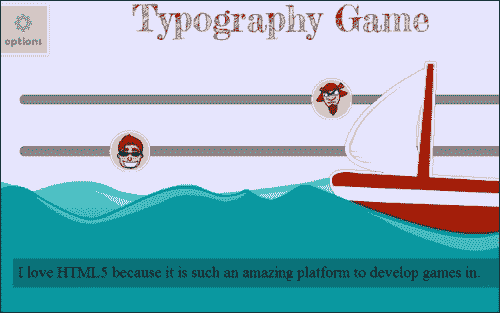
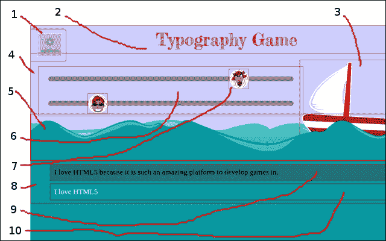
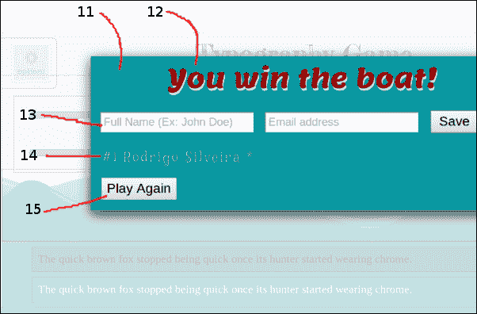
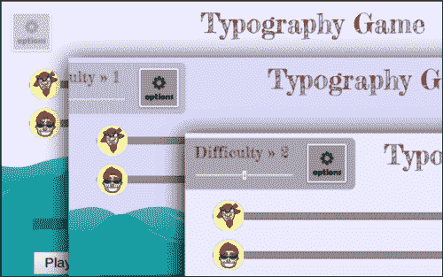
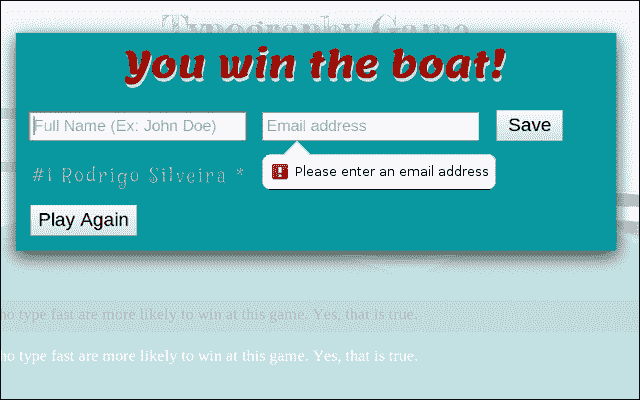
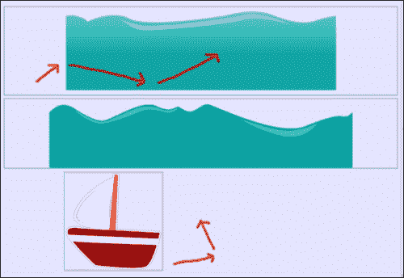
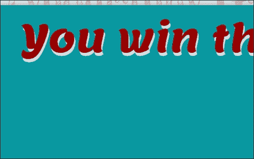

# 第二章。HTML5 排版

现在我们已经设置好了环境，我们准备深入研究 HTML5 背后的实际代码。这就是这本书开始腾飞的地方，因为无论你学习多少理论，如果没有一些键盘时间，掌握一门编程语言是非常困难的。

我们将在这一章中开发的游戏将是一个打字游戏，在排版方面有所侧重。再次提醒大家，这本书的重点不是教游戏开发，而是教大家所有关于 HTML5 的知识。因此，我们编写游戏的一般方法不一定是一般游戏开发的最佳方法，尽管本书涵盖的所有游戏在大多数主要浏览器中都表现相当好。

# 比赛

由于缺乏的创造力，为了避免一家脾气暴躁的游戏公司可能提起的诉讼，我们将这第一款游戏简称为`Typography Game`。我知道，这不是你听说过的最令人印象深刻的游戏，但至少它很好地解释了游戏的基本内容。

游戏的整体故事情节，以及它的一般要点如下:正确地键入一个短语，一个字一个字地显示给你，赢得你的梦想之船。如果你没有正确而快速地输入每个角色，那么**斯诺克·麦克斯诺克顿** 将赢得胜利，而你将失去游戏技能。



很难从一张截图中传达出这个用户界面的所有细节，但那个美丽海洋中的波浪实际上是非常流畅的动画，船也是如此，它自由漂浮，被波浪抛来抛去。另外，虽然整个游戏中正好有六个图像，但这个游戏中使用的所有组件都是 DOM 元素。船、波浪和角色是使用 div、图像和其他语义 HTML5 元素完成的。所有的动画都是使用原生的 CSS3 特性完成的。

一章的其余部分将列出游戏中使用的所有 HTML、CSS 和 JavaScript 特性，展示如何使用它们的示例，以及它们在游戏中的使用方式。所使用的编码风格是面向简单的，所以不要介意全局变量、面向对象原则的不一致使用以及整体的基本图形。有了基本的 HTML5 概念，您可以通过应用任何您认为必要的额外改进来使游戏从开发角度来看更加完善或可扩展，从而将游戏提升到一个新的水平。

我们将把游戏组织成三个独立的文件:一个`index.html`文件，在这里我们将托管所有的 HTML 结构，并将另外两个文件，即一个 CSS 文件和一个 JavaScript 文件放在一起。这应该是一个相当标准的文件结构，但请随意调整，以最适合您的需求和习惯。

遵循我们在构建门户网站时上一章创建的文件结构约定，我们需要在项目的根目录中创建一个目录，并将其称为排版。在这个目录中，我们将创建以下文件和目录:

*   `packt/typography`
*   `packt/typography/index.html`
*   `packt/typography/fonts`
*   `packt/typography/css`
*   `packt/typography/css/style.css`
*   `packt/typography/js`
*   `packt/typography/main.js`
*   `packt/typography/img`

### 注

当我们在本章的后面到达那个部分时，我将引导你完成寻找和下载定制字体的过程。至于图片，可以自己画或者自己买，也可以从`http://www.CHANGE-THIS-FOR-A-REAL-WEBSITE`网站下载我为游戏画的同样的图片。

# 游戏元素

这个游戏使用了 9 个 HTML5 元素。每一个都将在它的主要类别 HTML、CSS 或 JavaScript 中进行解释。游戏本身由大约 15 个元素组成，如下图所示:



游戏主屏幕，其中有一个微妙的选项部件。

游戏结束后，无论玩家是否赢得游戏，都会显示一个计分板，在这里玩家有机会输入自己的名字以及开始新的游戏。



前面的截图显示了一个消息小部件来指示玩家已经赢了或输了，以及一个排行榜小部件。

为了便于我们识别每一个主要的视觉游戏组件，我们将如下列出:

## 选项小部件

这个小部件允许玩家选择预设的难度等级。选择一个更难的难度等级会让敌人更快地穿过他的轨迹向船移动。此外，我们可以让玩家需要输入的短语根据难度设置变得更难或更容易。然而，我们将这个实现细节留给读者作为练习。

## 游戏标题

这个基于文本的小部件只是显示游戏的主标题。请注意，这里使用的字体是纯文本(没有图像)，使用的是自定义网页字体。它的唯一目的是装饰用户界面。

## 船

这个动画小部件通过帮助讲述游戏故事来达到强化用户界面的目的。船是一个简单的 HTML 元素(`div`)，背景图像代表船。船所走的动画路径是在 CSS 中严格完成的，完全由浏览器管理。

## 天空

HTML 的这个部分用于封装位于用户界面上半部分的所有元素，并使天空动画成为可能。随着游戏的进行，天空的颜色会发生微妙的变化，从而模仿太阳的落山和升起。

## 波浪

在那里是 HTML 的一部分，被归类为*海洋*，这是一个封装了海浪存储区域的部分。每个波(本例中有两个)是一个宽度为 100%的`div`元素，以及一个代表该波的背景图像。这个背景图像在`div`元素的整个宽度上重复，并通过 CSS 进行动画制作，以给出运动的错觉，遵循海洋中的波浪模式。

## 轨迹

这个小部件是 HTML 的一部分，它封装了各个音轨小部件，以及使用该音轨的播放器。

## 玩家

每一个图标都代表这个游戏中的单个玩家。为了让事情尽可能简单，游戏中只有两个玩家:你(英雄)和斯诺克蒂·麦克斯诺克顿先生(敌人)。此外，我们可以非常容易地向选项小部件添加功能，以允许玩家为英雄和敌人选择特定的图标，因为控制使用哪些图标的代码是一个简单的 CSS 类，可以添加到图标对象或从图标对象中移除。

## 主集装箱

HTML 的这个部分保存了控制游戏的元素，也就是天空小部件下面的一切。

## 要写的字

这里是我们显示游戏开始时用户必须输入的单词。在幕后，这是一个简单的块级 HTML 元素，它的唯一目的只是显示几个单词。

## 文字书写

虽然，这个小部件和写小部件的词是一样的(当然，样式略有不同)，但是这个小部件有点更动态，因为它会响应用户的动作。当用户按下键盘上的某个键时，该输入将显示在那里。如果根据“要编写的单词”小部件中显示的内容，键入的字符与预期的字符匹配，则该字符显示为白色。如果字符不正确，它将显示为红色，有一条线穿过它，非常强烈地表明出现了错误。用户可以使用*退格*键删除该小部件中显示的任何或所有字符。每输入一个正确的字符，英雄将根据输入字符的百分比，相对于要输入的字符总数，成比例地向右移动。

## 消息容器

HTML 的这个部分显示在一个半透明的元素上，给人一种叠加框的感觉。这个小部件主要是一个通用的通信工具，通过它我们可以通知玩家事件，比如让他们知道游戏结束了，或者他或她赢得或输掉了游戏。此外，我们还添加了其他四个元素，以使游戏更吸引人。

## 消息标题

非常在样式和目的上与主游戏标题小部件相似，这个元素只是通知用户消息容器小部件的其余内容。

## 新的冠军形态

这种形式背后的想法是模拟那些老式街机游戏中使用的老派排行榜。一旦您赢得了与斯诺克蒂·麦克斯诺克顿先生的比赛，您将有机会输入您的姓名和电子邮件地址，以显示在排行榜上，如下图所示。当然，这些信息是象征性的，只是为了说明我们如何使用 HTML5 的网络表单。表单生成的信息不会保存在任何地方，因此，在每次页面刷新后(或者当游戏关闭或导航离开时)，它就会消失。同样，通过我们将在本书后面的[第 4 章](4.html "Chapter 4. Using HTML5 to Catch a Snake")、*中讨论的许多持久性或存储 API 中的任何一个，通过电子邮件发送该表单的内容，将其保存到后端服务器，或者甚至将其本地存储在浏览器中，都是一项微不足道的任务。*

## 排行榜

在新冠军表格中输入的任何数据(前提是输入的数据有效)都会显示在这里。每个名字旁边的数字只是显示每个名字的输入顺序。名字右边的星号表示游戏的难度等级(1 级——容易；在这种特殊情况下)。为了获得更吸引人的体验，我们可以记录玩家完成游戏花了多长时间，犯了多少错误，或者以某种方式计算一个总分数并在这里显示出来。我们选择全名和电子邮件地址的原因是为了展示如何在 HTML5 中执行表单验证。光是这一点，可能就是这个游戏中使用的 HTML5 最强大、最令人兴奋的特性了。过去开发人员需要数百行代码，而且经常需要大量重复的代码，现在只需要浏览器强制执行的几个 HTML 属性。

## 游戏控制

最后，消息容器小部件包括允许玩家开始新游戏的控件。

### 注

为了使代码更简洁、更容易解释，我们将瞄准可移植性较低的代码，其中唯一的要求是代码至少在一个浏览器中正常运行。

所使用的大多数 API 确实是非常可移植的(这意味着代码在大多数主要浏览器中执行相同)，但肯定不是全部，尤其是任何需要供应商前缀的实验性 CSS APIs。为了最大限度地兼容以下示例，我建议您使用最新版本的谷歌 **Chrome** 或谷歌**Chrome**，或者至少是任何基于 webkit 的浏览器，如苹果 Safari。

采用这种方法的原因首先是为了简化教学过程。没有必要解释给定的特性，然后显示 99%相同的代码示例，但是不同之处仅在于特性名称的第一部分，即供应商名称。选择 webkit 作为选择的浏览器引擎背后的理由也很简单；我们必须选择一些东西，那为什么不选 webkit 呢？除此之外，谷歌 Chrome 和苹果 Safari 都有很大的市场渗透力，还有一套不可思议的工具在开发过程中帮助我们(比如谷歌 Chrome 的开发者工具)。

最后，游戏中使用的 9 个 HTML5 元素，以及它们对应的类别:

## HTML

这款游戏中使用的和两个 HTML 功能都可以在 JavaScript 中使用，也可以直接通过浏览器使用。web 表单元素和属性为浏览器添加了开箱即用的强大功能，而数据属性在与 JavaScript 绑定时更有意义。在我们的`Typography Game`游戏中，我们已经在有意义的上下文中构建了这些元素，但是我们当然可以使用其他技术(例如将数据属性表示的数据严格存储在代码中)，或者以不同的方式使用我们确实使用过的元素和属性。

### 网页表单

HTML5 中添加的新的表单 API 是该语言最明显的新增内容之一。有了它，您可以访问 13 种新的输入类型，以及无数新的属性，这些属性使表单开发变得快速、有趣和迷人。大多数添加的内容在视觉上可能会让你觉得很熟悉，因为它们在浏览器中本地添加的效果已经存在很长时间了。这些效果包括占位符文本、表单验证、自动聚焦字段等。

游戏中使用了 13 种新输入类型中的两种，以及每种类型的一些属性，包括表单验证和字段占位符。以下是游戏中如何使用这些元素的简要说明。下一节将深入讨论它们的工作原理和使用方法。

#### 范围输入

新的范围输入类型是一个滑块，允许用户通过水平移动滑块来选择一个值。在游戏中，我们使用范围输入作为选择难度等级的手段。这个游戏指定的范围是 1 到 3，1 是最容易的难度等级，3 是最难的。



保存输入类型范围的容器使用 CSS 来切换选项菜单，并在不使用时将其淡出。

#### 邮件输入

电子邮件输入类型看起来与旧的文本输入类型完全相同，但有一些好处。首先，当在移动设备中使用时，输入类型向操作系统提示它期望什么样的信息，在这种情况下，操作系统可以向用户显示特殊的键盘。例如，如果用户试图将数据输入到只允许输入数字的数字输入类型中，移动操作系统可以显示只有数字的键盘。在电子邮件类型的情况下，显示的键盘通常包括 **@** 符号，这使得用户更容易和更方便地将信息输入网络表单。

使用电子邮件输入类型的第二个好处是浏览器本身可以验证用户输入的数据，这对桌面用户来说也是一个好处。如果字段设置为已验证，并且字段中的数据与电子邮件地址的基本格式不匹配，浏览器将告诉用户有问题，并且不会提交表单。

在游戏中，每当玩家获胜时，我们都会使用这个功能，要求用户输入他或她的全名和电子邮件地址。这些信息被用在排行榜中，就像你可能在旧游戏中看到的那样。虽然用户不会被迫输入表单中要求的任何信息，但如果用户选择输入任何信息，浏览器将自动验证数据。

自动表单验证令人兴奋的是，您可以通过包含的 HTML 属性自定义表单，只验证必填字段、错误消息内容等。此外，即使用户在浏览器中禁用了 JavaScript 功能，表单仍将由浏览器进行验证和处理。当然，如您所知，从用户那里获取输入的主要规则之一是，您永远不要信任用户，并且始终验证和净化服务器中的任何以及所有用户输入。



如果没有输入数据或数据格式错误，浏览器会告诉您，并阻止表单提交。

### 数据属性

作为努力的一部分，为了获得更多的语义文档结构，HTML5 允许我们创建自己的定制元素属性。在 HTML5 之前，大多数浏览器只是忽略了它不理解的元素属性(例如，专门为应用程序制作的自定义属性)，但这种做法的缺点包括文档无法验证，行为有些不可预测，并且该语言的新版本有可能引入同名的属性，从而使您的旧自定义属性无效。现在，我们可以安全地为元素创建自定义属性，而刚才提到的缺点都不适用。

在我们的游戏中，我们使用数据属性来做两件事，即指定玩家可以在赛道上移动的最小速度，以及指定一个通用按钮应该触发一个新的游戏(因此任何具有该数据属性的按钮都不需要在 JavaScript 中有任何额外的逻辑来像一个特殊按钮一样工作)。

## CSS

由于这款游戏旨在展示 HTML5 更多的视觉方面，我们将大部分精力集中在让游戏的界面成为真正的视觉糖果上。因为 CSS 是关于视觉呈现的，大部分被使用的特性都属于这一类。

### 网络资源

在 HTML5 处理自定义字体的能力之前，网页设计师和开发人员仅限于少数可以在网站或网页应用程序中使用的字体。随着时间的推移，出现了一些解决这个问题的解决方案，但没有一个特别令人印象深刻，大多数(如果不是全部的话)破坏了浏览器的一些功能。例如，显示自定义文本的一种常见技术包括使用 JavaScript，使用自定义字体将字符串中的每个字符动态替换为该字符的实际图像。这种方法的问题包括需要创建和管理所有这些图像。用户必须下载所有这些图像，最糟糕的是，生成的文本不能被选择、复制、调整大小，颜色也不能改变。

现在，我们可以简单地指定一种字体的名称，以及实际的字体文件，如果用户的操作系统没有安装该字体，浏览器可以下载该字体，并像使用任何其他字体一样使用。

在游戏中，我们使用三种不同的自定义字体，打造恰到好处的视觉效果，让游戏中的文字与想要的视觉主题相匹配。使用的三种字体都是开源字体，可以从网上下载，免费使用。使用的字体有柠檬、神秘探索和弗雷德里克卡大帝。惊人的名字，你不同意吗？


在为游戏寻找一些字体之前，我不知道这些字体的存在。最棒的是，我只花了几分钟就浏览了一大堆开源字体(来自谷歌的网络字体工具)，找到了我想要的。

因为字体文件是一个外部资产，就像从服务器下载的任何其他东西一样，所以在浏览器开始下载字体文件和页面准备好呈现之间有一段时间。不同的浏览器处理这种情况的方式不同。例如，webkit 会隐藏文本，直到字体资源准备就绪。其他浏览器可能会使用后退或默认字体呈现文本，直到 web 字体文件准备好，然后交换字体并重新呈现文本。

### 过渡

一个 CSS 过渡 属性告诉浏览器它适用于哪些属性，以及过渡应该持续多长时间。一旦这些属性改变，浏览器将插入开始和结束状态，并在指定的持续时间内生成非常平滑的过渡。当然，这只能应用于由一些数值表示的属性，如字体大小、背景颜色(由 RGB 或 HSL 值或十六进制数表示，所有这些都可以转换为百分比)、元素位置等。在 CSS 过渡中不能平滑插值的值包括字体系列、背景图像或任何其他没有中间值的属性，例如“显示块”和“不显示”。

在游戏中，转换的唯一用途是选项菜单，消息容器，以及在赛道上移动玩家。选项菜单被设置为离开屏幕左侧，代表它的主图标的透明度为 75%。一旦用户将鼠标悬停在该图标上，它就会转换到 0%的透明度(完全可见)，并且菜单的其余部分会转换到其左侧以向右移动，直到其左边缘与浏览器的左边缘对齐。

消息容器使用类似的效果，它总是位于屏幕顶部，其宽度是窗口视口的 100%，其高度默认设置为零(当容器为`closed`)。当我们想要向用户显示消息时，将 CSS 类`open`添加到容器小部件中，该小部件将容器的高度设置为 100%，从而触发模拟滑入效果的平滑过渡。

最后，我们使用过渡将玩家在他们各自绑定的轨迹内从右向左移动。这是一个非常容易完成的任务，尽管英雄和敌人的控制略有不同。敌人移动的方式很简单:在游戏计时器的每一次滴答声中，我们都会将敌人的水平位置(通过改变其左风格属性)增加其数据速度数据属性中设置的任何值。这两点之间的平滑过渡由浏览器处理。英雄移动的方式是相似的，除了数据速度总是被设置为零(否则它会自动移动，而用户不必键入任何东西)，并且在每次按键时，我们检查键入的字符是否是预期的，在这种情况下，我们将英雄前进一个百分比到轨迹的末尾，这是相对于正确键入的字符的百分比和相对于字符总数的百分比。例如，如果用户正确地输入了一个有 100 个字符的短语的第十个字符，那么我们将英雄移动 10%的距离穿过它的轨迹。英雄和敌人都有适当的检查，这样他们就不能被移动到各自轨道的宽度之外。

### 动画

可能CSS3最强大的特性，动画属性，允许命名的关键帧动画非常类似于以前流行的 Adobe Flash 。它的工作方式非常简单:您创建一个动画序列，给它一个名称，并指定一个或多个要应用于每个关键帧的 CSS 属性。每个关键帧代表一个时刻，此时这些属性应该被添加到与该动画序列相关联的任何元素中。然后，浏览器对两个关键帧之间的每一时刻进行平滑插值，实现动画的错觉。

在游戏中，我们用动画赋予海浪生命，让船在它的路径上移动，让天空随着时间的流逝而变暗变亮，从而模拟太阳的升起和落下。虽然这看起来是一项复杂的任务，但制作元素动画是如此容易，以至于你可能会遇到的主要限制可能是创造力。如果您对 CSS 以及如何使用它将各种样式应用于元素有些熟悉，那么学习和使用动画应用编程接口应该是自然的下一步。



每个动画对象只不过是一个设置了背景图像的`div`元素。波浪的背景图像被设置为围绕 x 轴重复，而船的背景图像被设置为不重复。船的宽度和高度被设置为与它所代表的图像相匹配，而波浪对它们中的每一个都有不同的高度设置(位于所有事物后面的波浪稍微高一点，这样就可以在另一个波浪后面看到它)，但是宽度是 100%，因此它总是填充查看应用程序的监视器的宽度，不管那个监视器有多宽。在动画周期结束时，对象遵循相同的路径，但方向相反，使动画看起来连续且始终平滑。

最容易制作动画的元素是天空，因为它只有两个关键帧。在第一个关键帧中，表示天空的`div`元素被设置为背景为浅蓝色。最后一个关键帧将背景颜色更改为略暗的蓝色。为了获得更戏剧性的效果，我们可以让最后一个关键帧为背景定义一个非常暗的颜色。为了更强烈地表现这个秋天的夜晚，我们还可以在这个天空元素上添加另一个`div`，它的背景图像是一个透明的图像，周围散布着白点。每个点代表一颗星。然后，以天空变暗的相同速度，我们将这个元素的不透明度设置为变得更可见(不太透明)，以便它从完全透明动画到完全不透明。最后的效果是，随着天空变暗，星星就会出现。

该船由三个关键帧制作动画:第一个关键帧将其放置在略高于波浪的某个位置，第二个关键帧将其向右上方移动，第三个关键帧将其移动得明显更高，并向左移动一点。让这些点之间的动画看起来有些自然，更像现实生活中在海洋上移动的东西的技巧是使对象在两个不同关键帧之间移动的距离不同。例如，船在第一个关键帧和第二个关键帧之间移动的水平距离不同于在第二个关键帧和第三个关键帧之间使用的水平位移。这些关键帧之间的垂直位移甚至更剧烈。如果距离都一样，我们的眼睛就会习惯同样熟悉的运动模式，动画很快就会显得过于重复和无趣。

制作波浪动画同样容易。虽然有两组波浪，但它们都使用相同的动画集。唯一不同的是，位于另一个后面的那组波(后面的波)被设置为移动得更慢，所以它看起来更远，动画似乎不一样。

这些波浪元素中的所有动画(记住，波浪元素只是一个重复背景图像的`div`)都是背景图像的位置。`div`元素本身总是静态的，绝对位于彼此之上。因为元素在背景图像透明的地方都是透明的，所以我们能够将背景颜色应用到包含所有这三个元素(波浪和船)的元素上，我们将它设置为天空元素，这使得背景颜色具有动画效果。

虽然最终的结果看起来很有趣，也有点复杂，但是把这种东西放在一起所需要的工作真的不比使用普通 CSS 设置任何其他设计更复杂或困难，尤其是因为这只不过是普通的旧 CSS。

### 注

在撰写本文时，有一些工具旨在帮助开发人员创建和管理关键帧动画。虽然这些工具中有许多是免费的，而且许多是完全基于云的(使用 HTML5 技术编写的)，但是如果您正在寻找一种企业级工具来帮助您构建真正类似于我们在 Adobe Flash 中看到的专业动画，您将需要投资一些现金来购买更高级和更精细的工具。尽管这些工具中的一些可能不是预算有限的开发人员(或者完全没有预算的开发人员)的最佳选择，但是它们的质量和功能通常是超出任何免费工具所能提供的数量级的。

如果你只是为了好玩，或者为了学习体验而开发，那么网上提供的大量免费工具应该足以让你使用 CSS3 关键帧动画。但是，如果您的目标是构建高端应用程序，并且您需要对动画的高精度和控制，那么专业的工具可能非常值得您投资。

一个特别受欢迎的免费网络 CSS 动画生成器可以在[http://www.css3maker.com/](http://www.css3maker.com/)找到。另一方面，Adobe 制作了一款名为 Adobe Edge Animate 的非常棒的产品，可以在[http://html.adobe.com/edge/animate/](http://html.adobe.com/edge/animate/)购买。

### 文字阴影

CSS 中的这个新文本属性允许你在文本周围模拟一个阴影效果。在幕后，浏览器真正要做的是创建一个应用阴影的文本副本，然后根据您指定的垂直和水平偏移值将其替换到原始文本后面。您还可以通过指定一个介于 0 和您想要的任何整数值之间的值来告诉浏览器模糊文本的这个“阴影”版本的程度。过了一会儿，根据原始文本的大小，模糊度很高，文本几乎看不见，因此提供非常大的数字可能会适得其反。

游戏中唯一使用文本阴影的实例是消息容器的标题。由于游戏的用户界面的其余部分使用了非常平坦的图形，具有非常微妙的渐变或完全没有渐变，我想我应该使用文本阴影来添加一个坚实的、更亮的阴影，以延续平坦的、一维图形的主题。



CSS3 文本阴影应用编程接口允许您指定任意数量的文本字符串的位移和模糊副本。

### 盒子阴影

类似于文本阴影，框阴影在特定元素后面放置一个或多个框，垂直和水平偏移被指定为参数，第三个参数是要应用于阴影的模糊量。您可以指定纯色或使用可选的 alpha 通道，以便为其添加不同的不透明度。或者，可以将阴影应用到它所绑定的容器内部。请注意，应用于元素的任何框阴影，如果它们被放置在框的后面，则被放置在边框之外(如果有的话)，忽略元素可能具有的任何边距。放置在元素内部的阴影仅放置在边框内部(如果有)，忽略添加到元素的任何填充。

在游戏中，有两个 CSS 框影的实例。一个展示了元素后面的传统阴影，并应用于消息容器。游戏中盒子阴影的另一个实例被应用于容纳每个玩家的轨迹。在这种情况下，阴影旨在传达轨道被压入页面的效果，这是通过使用将阴影放置在框内的属性来实现的。如果阴影被放置在框外，给出的效果是框被堆叠在页面上。


每个轨道底部的白线只是一个底部边框，但是通过添加第二个方框阴影也可以达到同样的效果。

### 边界半径

在边界半径属性可用之前，它提供的相同效果可以通过将圆角图像定位到元素的角来实现。这是一个乏味的任务，最终的效果很少像预期的那样令人印象深刻。使用 CSS3 边框半径属性，我们可以对`container`元素的一个或多个角应用任意数量的圆度。

### 注

请记住，尽管可以通过为所有四个角指定一个足够大的边界半径值来使`container`元素看起来完全是圆形的，但对于浏览器来说，该元素仍然是一个矩形。换句话说，如果你浮动两个或更多的元素，这些元素在 CSS 中被做成圆形，它们将表现得像矩形，而不是圆形。

HTML5 中的元素和文本的流动仍然是基于矩形的，尽管有实验性的 API 允许我们指定文本流过的任意形状。有关这些特殊 CSS API(称为**区域**和 **例外**的更多信息，请参见[第 6 章](6.html "Chapter 6. Adding Features to Your Game")、*为您的游戏添加功能*。

游戏中只有一次使用 CSS 边框半径，在导航选项小部件的右侧。API 允许我们指定将边界半径应用到哪个特定的边，为了演示这个特性，容器的四条边中只有两条是圆的。

玩家图标可以更像 HTML5，而不仅仅是应用于元素背景的透明图像。一种可能是让每个图标是一个矩形图像，我们可以将它应用到代表每个玩家的容器的背景中，然后我们可以使用边框半径使元素看起来完全是圆形的。还可以添加一个可选的方框阴影，以创建与照片编辑软件用于创建图像时相同的阴影效果。使用这种技术的一个好处是，原生效果会缩放得更好，这意味着如果您放大或缩小页面，图像最终会看起来扭曲和像素化，而添加到元素中的任何边框半径、框阴影或边框看起来总是平滑和新鲜的。

## JavaScript

虽然驱动这个游戏的逻辑是相当简单，而且相当有限，但是为了让游戏运行起来，还是有相当多的 JavaScript 代码。由于我们试图将重点放在 HTML5 特性上，我们将只关注代码中使用的一个特定的 API，它或多或少可以被认为是 HTML5。这是**选择器 API** ，由 W3C 于 2006 年 5 月首次起草。

### 查询选择器

如果你在过去的几年里一直在做任何网络开发，你肯定已经听说过或者使用过，并且爱上了流行的 JavaScript 库 jQuery。在众多强大的特性中，jQuery 最有用的工具之一是其惊人的 DOM 选择器 API，它允许您通过简单地使用 CSS 选择器和伪选择器来检索 DOM 元素，而不是使用有限的`document.getElementById()`、`document.getElementsByClassName()`和`document.getElementsByName()`方法以及其他同样有限的方法。

好消息是，这个强大的节点选择器 API 现在都是现代浏览器的原生版本。由于该功能是浏览器的原生功能，因此速度更快、更稳定。此外，由于该特性是浏览器的原生特性，因此不需要导入库来处理该任务。

这个游戏，以及本书中描述的所有其他游戏，都使用了新的选择器 API 级。由于没有可以从查询选择器中看到的可视元素，我们将在下一节中深入讨论它的用法，我们还将看一些代码示例。

# API 用法

既然我们已经讨论了所有的游戏元素是什么，以及每个 HTML5 特性是如何被用来完成这个角色的，让我们更深入地看看如何最大限度地利用这些 API。对于下面的每一个 API，我们将提供特性的更具体的定义，它的预期用途是什么，下面将给出一个代码示例。您也可以参考本章末尾的完整源代码，以填补代码示例与该功能如何与游戏代码库的其余部分相匹配之间的空白。还建议您编写代码并使用各种设置和值，以便试验和更全面地理解每个应用编程接口。

## 网页表单

新的 HTML5 网络表单应用编程接口增加了 13 种新的输入类型，提供了更加灵活和强大的体验。更重要的是，web 表单也能够验证自己，而不需要 JavaScript 的干预。

### 新的输入类型

以下是在 HTML5 规范的新网页表单章节中定义的新输入类型:

#### 日期

日期输入类型允许用户从浏览器提供的日历中选择特定日期。此日历的特定格式和样式对于所使用的浏览器和平台是唯一的。日期选择产生的数据为`YYYY-MM-DD`形式。

```html
<input type="date"
  min="1935-12-16"
  max="2013-08-19"
/>
```

可选属性`min`和`max`可用于强制验证用户选择的日期是否在给定范围内。`date`输入类型的其他有效属性包括:

*   `name`(值必须是字符串):通过与属性关联的字符串值来标识特定字段
*   `disabled`(可接受的值包括`disabled`、`""`或空):指定元素被禁用并且不能接收控制
*   `autocomplete`(可接受的值包括`on`或`off`):指定浏览器是否应该存储用户输入的值，以便将来在用户提示下，浏览器可以自动完成存储值的输入
*   `autofocus`(可接受的值包括`autofocus`、“”、或空):向浏览器指定元素必须在文档加载完成后立即获得焦点
*   `min`(值必须是“yyyy-mm-dd”形式的有效日期):指定用户允许选择的最低日期
*   `max`(值必须是“yyyy-mm-dd”形式的有效日期):指定用户允许选择的最高日期
*   `readonly`(可接受的值包括`readonly`、`""`或空):指定用户不能更改该元素的值
*   `step`(可接受的值包括`any`或任意正整数):指定元素的值属性如何改变
*   `required`(可接受值包括`required`、`""`或空):指定该元素必须具有有效值，表单才能提交
*   `value`(值必须是“yyyy-mm-dd”形式的有效日期):指定此元素表示的实际日期

#### 月

月份输入类型允许用户从浏览器提供的日历中选择特定的月份和年份。此日历的特定格式和样式对于所使用的浏览器和平台是唯一的。日期选择产生的数据为`YYYY-MM`形式。

```html
<input type="month"
  min="1935-12"
  max="2013-08"
/>
```

日期输入类型的其他有效属性包括:

*   `name`(值必须是字符串):通过与属性关联的字符串值来标识特定字段
*   `disabled`(可接受的值包括`disabled`、`""`或空):指定元素被禁用并且不能接收控制。
*   `autocomplete`(可接受的值包括`on`或`off`):指定浏览器是否应该存储用户输入的值，以便将来在用户提示时，浏览器可以自动完成存储值的输入
*   `autofocus`(可接受的值包括`autofocus`、`""`或空):向浏览器指定元素必须在文档加载完成后立即获得焦点
*   `min`(值必须是“yyyy-mm”形式的有效日期):指定允许用户选择的最低日期
*   `max`(值必须是“yyyy-mm”形式的有效日期):指定允许用户选择的最高日期
*   `readonly`(可接受的值包括`readonly`、`""`或空):指定用户不能更改该元素的值
*   `step`(可接受的值包括`any`或任意正整数):指定元素的值属性如何改变
*   `required`(可接受值包括`required`、`""`或空):指定该元素必须具有有效值，表单才能提交
*   `value`(值必须是“yyyy-mm”形式的有效日期):指定此元素表示的实际日期

#### 周

周输入类型允许用户从浏览器提供的日历中选择一年中特定的一周。此日历的特定格式和样式对于所使用的浏览器和平台是唯一的。日期选择产生的数据为`YYYY-Www`形式(例如，2013-W05)。

```html
<input type="week"
  min="1935-W51"
  max="2013-W34"
/>
```

日期输入类型的其他有效属性包括:

*   `name`(值必须是字符串):通过与属性关联的字符串值来标识特定字段
*   `disabled`(可接受的值包括`disabled`、`""`或空):指定元素被禁用并且不能接收控制
*   `autocomplete`(可接受的值包括`on`或`off`):指定浏览器是否应该存储用户输入的值，以便将来在用户提示时，浏览器可以自动完成存储值的输入
*   `autofocus`(可接受的值包括`autofocus`、`""`或空):向浏览器指定元素必须在文档加载完成后立即获得焦点
*   `min`(值必须是“yyyy-Www”形式的有效日期，其中“ww”必须是周数的两位数表示):指定允许用户选择的最低日期
*   `max`(值必须是“yyyy-Www”形式的有效日期，其中“ww”必须是周数的两位数表示):指定用户允许选择的最高日期
*   `readonly`(可接受的值包括`readonly`、`""`或空):指定用户不能更改该元素的值
*   `step`(可接受的值包括`any`或任意正整数):指定元素的值属性如何改变
*   `required`(可接受值包括`required`、`""`或空):指定该元素必须具有有效值，表单才能提交
*   `value`(值必须是“yyyy-Www”形式的有效日期，其中“ww”必须是周数的两位数表示):指定此元素表示的实际日期

#### 时间

时间输入类型允许用户选择一天中的特定时间。该元素中的数据为`HH:MM:SS.Ms`形式。

```html
<input type="time"
  min="16:23:42.108"
  max="23:59:59.999"
/>
```

日期输入类型的其他有效属性包括:

*   `name`(值必须是字符串):通过与属性关联的字符串值来标识特定字段
*   `disabled`(可接受的值包括`disabled`、`""`或空):指定元素被禁用并且不能接收控制
*   `autocomplete`(可接受的值包括`on`或`off`):指定浏览器是否应该存储用户输入的值，以便将来在用户提示时，浏览器可以自动完成存储值的输入
*   `autofocus`(可接受的值包括`autofocus`、`""`或空):向浏览器指定元素必须在文档加载完成后立即获得焦点
*   `min`(值必须是“HH:MM:SS”形式的有效部分时间。Mss”、“HH:MM:SS”或“HH:MM”):指定允许用户选择的最低日期
*   `max`(值必须是“HH:MM:SS”形式的有效部分时间。Mss”、“HH:MM:SS”或“HH:MM”):指定允许用户选择的最高日期
*   `readonly`(可接受的值包括`readonly`、`""`或空):指定用户不能更改该元素的值
*   `step`(可接受的值包括`any`或任意正整数):指定元素的值属性如何改变
*   `required`(可接受值包括`required`、`""`或空):指定该元素必须具有有效值，表单才能提交
*   `value`(值必须是“HH:MM:SS”形式的有效部分时间。Mss”、“HH:MM:SS”或“HH:MM”):指定此元素表示的实际日期

#### 日期时间

日期时间输入类型允许用户从浏览器提供的日历中选择特定的日期和时间(包括时区)。此日历的特定格式和样式对于所使用的浏览器和平台是唯一的。日期选择产生的数据为`YYYY-MM-DDTHH:MM:SS-UTC`形式。

```html
<input type="datetime"
  min="1935-12-16T16:23:42-08:00"
  max="2013-08-19T23:59:59-09:00"
/>
```

日期输入类型的其他有效属性包括:

*   `name`(值必须是字符串):通过与属性关联的字符串值来标识特定字段
*   `disabled`(可接受的值包括`disabled`、`""`或空):指定元素被禁用并且不能接收控制
*   `autocomplete`(可接受的值包括`on`或`off`):指定浏览器是否应该存储用户输入的值，以便将来在用户提示时，浏览器可以自动完成存储值的输入
*   `autofocus`(可接受的值包括`autofocus`、`""`或空):向浏览器指定元素必须在文档加载完成后立即获得焦点
*   `min`(值必须是 RFC 3339 中定义的有效日期时间):指定允许用户选择的最低日期
*   `max`(值必须是有效的日期时间，如 RFC 3339 中所定义):指定允许用户选择的最高日期
*   `readonly`(可接受的值包括`readonly`、`""`或空):指定用户不能更改该元素的值
*   `step`(可接受的值包括`any`或任意正整数):指定元素的值属性如何改变
*   `required`(可接受值包括`required`、`""`或空):指定该元素必须具有有效值，表单才能提交
*   `value`(值必须是 RFC 3339 中定义的有效日期时间):指定此元素表示的实际日期

#### Datetime-本地

日期时间本地输入类型允许用户从浏览器提供的日历中选择特定的日期和时间(不包括时区)。此日历的特定格式和样式对于所使用的浏览器和平台是唯一的。日期选择产生的数据为`YYYY-MM-DDTHH:MM:SS`形式。

```html
<input type="datetime-local"
  min="1935-12-16T16:23:42"
  max="2013-08-19T23:59:59"
/>
```

日期输入类型的其他有效属性包括:

*   `name`(值必须是字符串):通过与属性关联的字符串值来标识特定字段
*   `disabled`(可接受的值包括`disabled`、`""`或空):指定元素被禁用并且不能接收控制
*   `autocomplete`(可接受的值包括`on`或`off`):指定浏览器是否应该存储用户输入的值，以便将来在用户提示时，浏览器可以自动完成存储值的输入
*   `autofocus`(可接受的值包括`autofocus`、`""`或空):向浏览器指定元素必须在文档加载完成后立即获得焦点
*   `min`(值必须是“YYYY-MM-DDTHH:MM:SS”形式的有效部分时间。Mss”、“YYYY-MM-DDTHH:MM:SS”或“YYYY-MM-DDTHH:MM”):指定允许用户选择的最低日期
*   `max`(值必须是“YYYY-MM-DDTHH:MM:SS”形式的有效部分时间。Mss”、“YYYY-MM-DDTHH:MM:SS”或“YYYY-MM-DDTHH:MM”):指定允许用户选择的最高日期
*   `readonly`(可接受的值包括`readonly`、`""`或空):指定用户不能更改该元素的值
*   `step`(可接受的值包括`any`或任意正整数):指定元素的值属性如何改变
*   `required`(可接受值包括`required`、`""`或空):指定该元素必须具有有效值，表单才能提交
*   `value`(值必须是“YYYY-MM-DDTHH:MM:SS”形式的有效部分时间。Mss”、“YYYY-MM-DDTHH:MM:SS”或“YYYY-MM-DDTHH:MM”):指定此元素表示的实际日期

#### 颜色

颜色输入类型允许用户从浏览器提供的颜色选择器中选择特定颜色。这个颜色选择器小部件的特定格式和样式对于所使用的浏览器和平台是唯一的。虽然小部件的一些实现可以提供不同格式(RGB 或 HSL)的值，但是颜色选择产生的数据是形式为`#RRGGBB`的颜色的十六进制表示。

```html
<input type="color"
  value="#900CC1"
/>
```

日期输入类型的其他有效属性包括:

*   `name`(值必须是字符串):通过与属性关联的字符串值来标识特定字段。
*   `disabled`(可接受的值包括`disabled`、`""`或空):指定元素被禁用并且不能接收控制。
*   `autocomplete`(可接受的值包括`on`或`off`):指定浏览器是否应该存储用户输入的值，以便将来在用户提示时，浏览器可以自动完成存储值的输入。
*   `autofocus`(可接受的值包括`autofocus`、`""`或空):向浏览器指定元素必须在文档加载完成后立即获得焦点。
*   `value`(值必须是长度正好为 7 个字符的有效十六进制颜色，格式为“#rrggbb”或“#RRGGBB”):指定此元素表示的实际颜色。不允许使用关键字，如颜色。

#### 邮件

电子邮件输入类型允许用户输入电子邮件地址。在为数据输入提供数字键盘的移动设备中，该输入类型提示系统，要提供的键盘应该最适合输入电子邮件地址。

```html
<input type="email"
  placeholder="Enter an email address"
  pattern="\w{3,}@packtpub\.com"
  maxlength="23"
/>
```

日期输入类型的其他有效属性包括:

*   `name`(值必须是字符串):通过与属性关联的字符串值来标识特定字段。
*   `disabled`(可接受的值包括`disabled`、`""`或空):指定元素被禁用并且不能接收控制。
*   `autocomplete`(可接受的值包括`on`或`off`):指定浏览器是否应该存储用户输入的值，以便将来在用户提示时，浏览器可以自动完成存储值的输入。
*   `autofocus`(可接受的值包括`autofocus`、`""`或空):向浏览器指定元素必须在文档加载完成后立即获得焦点。
*   `maxlength`(值必须为非负整数):指定元素可以包含的最大字符长度。
*   `pattern`(值必须是 ECMA 262 定义的有效正则表达式模式):指定浏览器必须验证指定输入的模式。
*   `size`(值必须是正整数):指定元素显示的最大字符数，尽管可能允许输入更多字符。
*   `placeholder`(值必须是字符串):指定要向用户显示的字符串，作为该字段需要什么信息的提示。当数据输入到字段中时，该字符串消失，当字段为空时显示。
*   `multiple`(可接受值包括`multiple`、`""`或空):指定此元素中允许多个值。
*   `readonly`(可接受值包括`readonly`、`""`或空):指定用户不能更改该元素的值。
*   `required`(可接受值包括`required`、`""`或空):指定该元素必须具有有效值，表单才能提交。
*   `value`(值必须是有效的电子邮件地址，并且必须遵守模式属性(如果有)指定的任何进一步限制):指定由该元素表示的实际电子邮件地址，或者当多重属性存在时，以逗号分隔的有效电子邮件地址列表。

### 注

对于那些不熟悉 JavaScript 正则表达式语言的人，或者需要复习的人，下面是语法摘要:

`[rodig]`(括号):用于匹配括号内的任何内容。例如:匹配括号内的任何一个字母。

`[^rodig]`(负括号):用于匹配括号内未找到的内容。例如，匹配除括号内某个字母以外的任何字符。

`[D-M]`(范围):用于匹配字符或数字的范围。例如，匹配大写字母 D 和 m 之间的任何字符。

`(me|you|us)`(管道):用于匹配备选选项。例如，匹配括号内的任一单词。

`.`(句号):匹配任何字符，除了一个新的行字符或行结束符。

`\w`(单词字符):匹配任何字母、数字或下划线。

`\W`(非单词字符):匹配任何不是单词字符的字符。

`\d`(数字):匹配任意单个数字。

`\D`(非数字):匹配任意非数字字符。

`\s`(空格):匹配一个空格。

`\S`(非空格):匹配任何非空格字符。

`\b`(单词边界):在一个单词的开头或结尾找到匹配项。

`\B`(非字界):找到不是字界的匹配。

`\0`(空字符):匹配字符串中的空字符。

`\n`(新行字符):匹配新行字符。

`\f`(表单输入字符):匹配表单输入字符。

`\r`(回车符):匹配表单回车符。

`\t`(制表符):匹配制表符。

`\v`(垂直制表符):匹配垂直制表符。

`+`(加量词):一次或多次匹配前一个表达式或字符。

`*`(星量词):零次或多次匹配前一个表达式或字符。

`?`(问号量词):匹配前一个表达式或字符零次或一次。

`{3,5}`(括号量词):分别匹配前一个表达式的最小次数和最大次数。如果缺少最大数字，匹配将继续，直到发现不匹配。例如:\d{1，}匹配一个或多个数字。

`^` (hat 修饰符):匹配字符串开头的表达式。

`$`(美元修饰符):匹配字符串末尾的表达式。

#### 数字

数字输入类型允许用户从浏览器提供的任何机制中选择数字，或者如果浏览器仅提供标准输入字段，则简单地输入数值。浏览器会验证该值，以确保用户确实输入了一个数字。在为数据输入提供数字键盘的移动设备中，这种输入类型向系统提示要提供的键盘应该最适合输入数字。

```html
<input type="number"
  min="42"
  max="108"
  step="2"
/>
```

日期输入类型的其他有效属性包括:

*   `name`(值必须是字符串):通过与属性关联的字符串值来标识特定字段。
*   `disabled`(可接受的值包括`disabled`、`""`或空):指定元素被禁用并且不能接收控制。
*   `autocomplete`(可接受的值包括`on`或`off`):指定浏览器是否应该存储用户输入的值，以便将来在用户提示时，浏览器可以自动完成存储值的输入。
*   `autofocus`(可接受的值包括`autofocus`、`""`或空):向浏览器指定元素必须在文档加载完成后立即获得焦点。
*   `min`(值必须是浮点数):指定用户允许选择的最低数字。
*   `max`(值必须是浮点数):指定用户允许选择的最高数值。
*   `readonly`(可接受值包括`readonly`、`""`或空):指定用户不能更改该元素的值。
*   `placeholder`(值必须是字符串):指定要向用户显示的字符串，作为该字段需要什么信息的提示。当数据输入到字段中时，该字符串消失，当字段为空时显示。
*   `step`(可接受的值包括`any`或任意正整数):指定元素的值属性如何变化。
*   `required`(可接受值包括`required`、`""`或空):指定该元素必须具有有效值，表单才能提交。
*   `value`(值必须是浮点数):指定此元素表示的实际浮点数。

#### 范围

范围输入类型允许用户使用浏览器提供的滑块部件从指定范围中选择一个数字。此滑块小部件的特定格式和样式对于所使用的浏览器和平台是唯一的。范围选择产生的数据是一个浮点数。

```html
<input type="range"
  min="42"
  max="108"
  step="0.5"
/>
```

日期输入类型的其他有效属性包括:

*   `name`(值必须是字符串):通过与属性关联的字符串值来标识特定字段。
*   `disabled`(可接受的值包括`disabled`、`""`或空):指定元素被禁用并且不能接收控制。
*   `autocomplete`(可接受的值包括`on`或`off`):指定浏览器是否应该存储用户输入的值，以便将来在用户提示时，浏览器可以自动完成存储值的输入。
*   `autofocus`(可接受的值包括`autofocus`、`""`或空):向浏览器指定元素必须在文档加载完成后立即获得焦点。
*   `min`(值必须是浮点数):指定用户允许选择的最低数字。
*   `max`(值必须是浮点数):指定用户允许选择的最高数值。
*   `readonly`(可接受值包括`readonly`、`""`或空):指定用户不能更改该元素的值。
*   `placeholder`(值必须是字符串):指定要向用户显示的字符串，作为该字段需要什么信息的提示。当数据输入字段时，该字符串消失，当字段为空时显示。
*   `step`(可接受的值包括`any`或任意正整数):指定元素的值属性如何变化。
*   `required`(可接受值包括`required`、`""`或空):指定该元素必须具有有效值，表单才能提交。
*   `value`(值必须是浮点数):指定此元素表示的实际浮点数。

#### 搜索

搜索输入类型允许用户输入用于搜索的字符串。总的来说，搜索输入类型的外观和行为非常像常规的文本输入类型。一些浏览器可能会在这个字段中添加各种行为，例如内置图标或小部件来立即清除字段，但是这些都不是规范的正式部分。

```html
<input type="search"
  placeholder="Search"
  pattern="[^!\?]"
/>
```

日期输入类型的其他有效属性包括:

*   `name`(值必须是字符串):通过与属性关联的字符串值来标识特定字段。
*   `disabled`(可接受的值包括`disabled`、`""`或空):指定元素被禁用，不能接收控制。
*   `autocomplete`(可接受的值包括`on`或`off`):指定浏览器是否应该存储用户输入的值，以便将来在用户提示时，浏览器可以自动完成存储值的输入。
*   `autofocus`(可接受的值包括`autofocus`、`""`或空):向浏览器指定元素必须在文档加载完成后立即获得焦点。
*   `maxlength`(值必须为非负整数):指定元素可以包含的最大字符长度。
*   `pattern`(值必须是 ECMA 262 定义的有效正则表达式模式):指定浏览器必须验证指定输入的模式。
*   `size`(值必须是正整数):指定元素显示的最大字符数，尽管可能允许输入更多字符。
*   `placeholder`(值必须是字符串):指定要向用户显示的字符串，作为该字段需要什么信息的提示。当数据输入到字段中时，该字符串消失，当字段为空时显示。
*   `multiple`(可接受值包括`multiple`、`""`或空):指定此元素中允许多个值。
*   `readonly`(可接受值包括`readonly`、`""`或空):指定用户不能更改该元素的值。
*   `required`(可接受值包括`required`、`""`或空):指定该元素必须具有有效值，表单才能提交。
*   `value`(值必须是无换行符或回车符的字符串):指定此元素表示的实际搜索查询。

#### 电话

电话输入类型允许用户输入电话号码。

```html
<input type="tel"
  placeholder="Enter your phone number"
  required
/>
```

日期输入类型的其他有效属性包括:

*   `name`(值必须是字符串):通过与属性关联的字符串值来标识特定字段。
*   `disabled`(可接受的值包括`disabled`、`""`或空):指定元素被禁用并且不能接收控制。
*   `autocomplete`(可接受的值包括`on`或`off`):指定浏览器是否应该存储用户输入的值，以便将来在用户提示时，浏览器可以自动完成存储值的输入。
*   `autofocus`(可接受的值包括`autofocus`、`""`或空):向浏览器指定元素必须在文档加载完成后立即获得焦点。
*   `maxlength`(值必须为非负整数):指定元素可以包含的最大字符长度。
*   `pattern`(值必须是 ECMA 262 定义的有效正则表达式模式):指定浏览器必须验证指定输入的模式。
*   `size`(值必须是正整数):指定元素显示的最大字符数，尽管可能允许输入更多字符。
*   `placeholder`(值必须是字符串):指定要向用户显示的字符串，作为该字段需要什么信息的提示。当数据输入到字段中时，该字符串消失，当字段为空时显示。
*   `multiple`(可接受值包括`multiple`、`""`或空):指定此元素中允许多个值。
*   `readonly`(可接受值包括`readonly`、`""`或空):指定用户不能更改该元素的值。
*   `required`(可接受的值包括`required`、`""`或空):指定该元素必须具有有效值，表单才能被允许提交。
*   `value`(值必须是无换行符或回车符的字符串):指定此元素表示的实际电话号码。

#### Url

网址输入类型允许用户输入网站网址。

```html
<input type="url"
  placeholder="Enter your website address"
  required
/>
```

日期输入类型的其他有效属性包括:

*   `name`(值必须是字符串):通过与属性关联的字符串值来标识特定字段。
*   `disabled`(可接受的值包括`disabled`、`""`或空):指定元素被禁用，不能接收控制。
*   `autocomplete`(可接受的值包括`on`或`off`):指定浏览器是否应该存储用户输入的值，以便将来在用户提示时，浏览器可以自动完成存储值的输入。
*   `autofocus`(可接受的值包括`autofocus`、`""`或空):向浏览器指定元素必须在文档加载完成后立即获得焦点。
*   `maxlength`(值必须为非负整数):指定元素可以包含的最大字符长度。
*   `pattern`(值必须是 ECMA 262 定义的有效正则表达式模式):指定浏览器必须验证指定输入的模式。
*   `size`(值必须是正整数):指定元素显示的最大字符数，尽管可能允许输入更多字符。
*   `placeholder`(值必须是字符串):指定要向用户显示的字符串，作为该字段需要什么信息的提示。当数据输入到字段中时，该字符串消失，当字段为空时显示。
*   `multiple`(可接受值包括`multiple`、`""`或空):指定此元素中允许多个值。
*   `readonly`(可接受值包括`readonly`、`""`或空):指定用户不能更改该元素的值。
*   `required`(可接受值包括`required`、`""`或空):指定该元素必须具有有效值，表单才能提交。
*   `value`(值必须是没有换行符或回车符的字符串):指定此元素表示的实际 url。

### 表单验证

虽然表单提交会自动验证插入到表单中的数据，并提醒用户任何可能的错误，但是有一个定义良好的应用编程接口，它让我们对验证过程和报告有更多的控制，而不仅仅是默认的。

#### 有效性状态对象

每个`form` 元素都有一个类型为 **ValidityState** 的对象，该对象包含一个与该节点的验证状态相关的属性列表。您可以直接从`form`元素访问该对象，并手动检查其属性:

```html
var firstName = document.querySelector("#myForm input[name='firstName']");
//firstName.validity == ValidityState {
  valid : false,
  customError : false,
  badInput : false,
  stepMismatch : false,
  rangeOverflow : false,
  rangeUnderflow : false,
  tooLong : false,
  patternMismatch : false,
  typeMismatch : false,
  valueMissing : false
}
```

有了这些属性，我们能够检查每个`form`元素，并真正定制表单的验证例程。然而，看到自动验证是一个如此吸引人的旨在节省时间和精力的特性，我们将重点关注在自动验证方面最能帮助我们的功能。

#### 自定义验证

**有效状态** 的属性之一是布尔值`customError`，它指定是否已经为字段元素设置了自定义错误消息，或者如果表单不有效，浏览器是否将为此元素显示通用错误消息。要设置自定义错误消息，我们可以调用`form`元素本身的`setCustomValidity()`方法，并在需要时为浏览器分配一条消息，如下所示:

```html
var email = document.querySelector("#myForm input[type='email']");
email.pattern = "\\w{3,}@packtpub\\.com";
email.setCustomValidity("Please enter a valid Packt email address...");
```


刚刚看到的表单中的第一个条目无效，因为它不包含字符串`packtpub.com`。第二种形式是有效的，因为它符合指定的模式。请注意第一个表单上的自定义错误消息，这在支持该功能的任何浏览器中都保证是相同的，而不是有一个通用的错误消息，该消息可能因浏览器而异。

### 游戏中使用

游戏中有两个使用网络表单应用编程接口的独立实例。第一个是在游戏选项小部件中，其中一个范围输入类型用于允许用户选择游戏的难度，另一个用于新的冠军表单，允许用户输入他或她的全名以及电子邮件地址。

```html
<nav id="navOptions">
  <div>
    <p>Difficulty &raquo; <span>1</span></p>
    <input type="range" step="1" min="1" max="3" value="1" />
  </div>
  
</nav>
```

这里我们设置一个基本范围输入，指定最大值为`3`。默认情况下，大多数浏览器会将`step`、`min`和`value`属性的值全部设置为`1`，但为了安全起见，我们将指定这些值，以防浏览器在未指定属性的情况下以不同方式处理这些值。

```html
<form>
  <input type="text" name="fullName"
    pattern="\w{2,16}\s\w{2,16}"
    placeholder="Full Name (Ex: John Doe)"
    autofocus
  />
  <input type="email" name="email"
    placeholder="Email address"
  />
  <input type="submit" value="Save" />
</form>
```

通常情况下，在要求名字和姓氏时，您需要在表单中有两个单独的字段。但是，在单个字段中要求全名会使该字段成为自定义模式属性的最佳候选字段。

在这种情况下，用于验证全名的模式非常简单；我们将输入视为 2 到 16 个单词字符(字母，在这种情况下可能是偶数)之间的单词，后跟一个空格，然后是另一个长度大于 2 但小于 16 个字符的单词。

两个`input field`元素都添加了占位符字符串，以避免表单中需要额外的标签。这样，表单就可以简洁明了，而且描述性很强，用户永远不会对表单的要求感到困惑。

## 数据属性

当你需要在一个 HTML 元素中存储数据，并且没有其他属性更适合保存该数据时，HTML5 规范为这种情况提供了一个特殊的属性。虽然规范专门将该属性称为`custom data`属性，但大多数人只是将其称为`data`属性。

这些`custom data`属性的工作方式非常简单。只需创建您选择的属性名称，从前缀为`data-`的名称关键字开始，然后使用长度至少为一个字符的您选择的任何关键字。唯一的限制是关键字不能包含任何大写字母，尽管默认情况下所有的 HTML 元素属性都会自动降低。您可以向单个元素添加任意数量的这种自定义属性。最后，任何`custom data`属性都可以具有您选择的任何值，可以将空字符串作为其值，也可以为空，在这两种情况下，该属性都被认为具有值 true(如果没有值 false)。

```html
<!-- Indicates an element that display some sort of score -->
<input type="text" id="scoreDisplay"
  <!-- Indicates that this score is not yet a new high score -->
  data-is-high-score="false"
  <!-- Indicates the current high score -->
  data-score-to-beat="891,958"
  <!-- Not a good use of data attributes, since the disabledattribute is a better choice -->
  data-enabled="false"
/>
```

在刚刚看到的示例代码中，我们有一些恰好是`input`标签的 DOM 节点，它代表了某个游戏的分数。前两个样本数据属性`data-is-high-score`和`data-score-to-beat`就是很好的例子。只需查看为每个属性选择的名称，我们就可以推断出它们的使用环境。

第一个属性意味着保存一个布尔值，该值表示标题元素显示的分数是否是新的高分。既然它目前持有的值为假，那么显然目前的分数还不是一个新的高分。

第二个属性存储当前的高分，这意味着如果玩家获得的分数高于该值，他或她的分数将成为新的高分，属性`data-is-high-score`应该更新以保持该值为真。请记住，这些属性是静态的，没有意义，应用程序的逻辑负责根据它们的上下文为它们添加意义，并处理对它们的任何更新，如前面描述的示例。

最后注意第三个`data`属性示例。这不是数据属性的一个非常实际的用途，因为存在另一个 HTML 元素属性，它是为了这个目的而存在的，即指定一个元素被禁用。

要以编程方式添加、移除和检查元素的属性及其值，可以使用以下 JavaScript APIs:

```html
var myInput = document.getElementById("scoreDisplay");

// Check for the presence of an attribute
if (myInput.getAttribute("data-is-high-score") == null) {

  // If attribute is not present, add it to the element with somedefault value
  myInput.setAttribute("data-is-high-score", false);
}

// If attribute is present, check its value
else {

  var isHighScore = myInput.getAttribute("data-is-high-score");

  if (isHighScore) {
    // Do something with this new high score
  } else {
    // The current score is not yet a new high score
  }
}
```

### 游戏中使用

游戏中有几个习惯`data attributes`的用法，目的不同，原因也不同。如前所述，一个用途是指定玩家的当前速度。该属性的另外两个实例用于识别和区分玩家，并对行为相同的单独按钮进行分组。

### 注

虽然官方规范规定您应该始终使用最合适的属性来将数据存储在 DOM 元素中，但是您也应该记住，分隔可能的`custom data`属性和其他一些现有属性的线有时会变成灰色。当这种情况发生时，你应该优先考虑你的具体需求和目标。

例如，如果您试图使用一个`custom data`属性来命名一组相关的元素，那么可能会出现一个问题，一个简单的 CSS 类可以达到同样的结果。有些人可能会说，因为 CSS 类已经存在，并且它们的目的是将相关的元素分组，其他人也可能会说，如果这些元素之间没有共享特定的样式，那么使用这样的自定义数据属性是合理的。但是，否决因素应该是具体的应用程序目标和需求，因此，如果例如添加一个符号 CSS 类来对这些元素进行分组会使它变得混乱，因为不存在真正对应的 CSS 类，那么使用自定义数据属性确实是合理的。

```html
<section class="tracks">
  <div class="track">
    <span data-name="badGuy" data-speed="0"></span>
  </div>

  <div class="track">
    <span data-name="goodGuy" data-speed="0"></span>
  </div>
</section>
```

请注意，`div.track`元素中的每个 span 元素都有两个属性，一个是名称的数据属性，用来区分英雄玩家和敌人玩家，另一个是速度的数据属性，它指定了每个元素在游戏计时器的每个刻度上移动了多少。这个数字是代表像素、百分比还是任何其他单位都无关紧要，因为两个玩家的值都设置为零，这意味着他们在每个计时器周期都不移动任何东西。

数据属性名是否可以用一个 CSS 类来更好地表示，这两个问题都有争议。在这种情况下，我选择使用数据属性，因为这样样式就可以独立于任何东西，并且可以毫不犹豫地将这种关注委托给应用程序的另一部分。

```html
<button data-intent="play">Play Again</button>
<section id="mainContainer">
  <div id="wordsToWrite"></div>
  <div id="wordsWritten"></div>
  <button data-intent="play">Play</button>
</section>
```

这里我们有两个共享相同数据属性`intent = "play"`的独立按钮。有了这个属性，并分配了这个值，我们就可以使用一些 JavaScript 逻辑来处理这些按钮和任何其他按钮，使它们的行为可预测且通用。

```html
// Select all buttons with a custom data attribute of intent anda value of play
var playBtns = document.querySelectorAll("button[data-intent='play']");
// Assign the same click handler to all of these buttons
for (var i = 0, len = playBtns.length; i < len; i++) {
  playBtns[i].addEventListener("click", doOnPlayClicked);
}

// Now every button with data-intent="play" executes thisfunction when clicked
function  doOnPlayClicked(event) {
  event.preventDefault();

  // Play button click behavior goes here
}
```

## 查询选择器

作为新选择器界面的一部分，有两个不同但非常相似的应用编程接口。一个选择与所用查询匹配的元素集合，另一个只匹配一个。如果单个选择器版本中使用的查询匹配多个节点，则只返回第一个匹配项。

要使用这个接口，您需要在文档对象上调用适当的函数，并提供一个表示 CSS 查询的字符串。现在，您可以停止通过元素的标识来选择元素，然后导航到奇怪的子路径，以便最终以编程方式到达您想要定位的元素。

### 注

在此功能可用之前，开发人员通常会用标识和类属性来打乱他们的文档结构，只是为了让以编程方式定位这些元素变得更容易一些。虽然使用 CSS 表达式来定位特定的节点可能很容易，以至于您可能会觉得不再需要向元素添加唯一的 ID 或类，这样通过代码定位该元素就更容易了，但是请记住，长的 CSS 表达式可能非常复杂，以至于您的应用程序的性能可能会因为导航到这些元素所需的时间而受到影响。请记住，CSS 查询越短，浏览器就越容易匹配所涉及的元素。

考虑游戏中的以下代码片段，其中我们尝试将点击事件监听器注册到包含游戏选项的导航菜单中的图像元素:

```html
<nav id="navOptions">
  <div>
    <p>Difficulty &raquo; <span>1</span></p>
    <input type="range" step="1" min="1" max="3" value="1" />
  </div>
  
</nav>

<script>
// 1\. Capture the image element inside that nav structurewith id="navOptions"

// ----------------------------------
// Without query selectors:
// ----------------------------------
var nav = document.getElementById("navOptions");
var img = null;

// Iterate through every child node of nav instead ofdirectly targeting the current
// position of that image element in case the structureof #navOptions change,
// in which case this code wouldn't need to be updated.
for (var i = 0, len = nav.children.length; i < len; i++) {
  if (nav.children[i].tagName == "IMG") {
    img = nav.children[i];
    break;
  }
}

// -----------------------------------
// With the query selectors:
// -----------------------------------
var img = document.querySelector("#navOptions img");

// 2\. Set the click handler
if (img) {
  img.addEventListener("click", doOnOptionsClicked);
}
</script>
```

您会注意到，旧的元素选择方式的演示使用了非常防御性的编程风格。虽然琐碎的选择可能不需要这种偏旁措施，但如果在 DOM 中找不到特定元素，并且试图将事件侦听器添加到包含空引用的变量中，大型应用程序肯定会受益于这种方法。无论哪种方式，您都可以看到新的选择器应用编程接口如何在这种特殊情况下解决这个问题，因为无论有什么其他元素可能被添加到或从`#navOptions`子树中移除，在`querySelector("#navOptions img")`语句中使用的 CSS 查询仍然适用，而`nav.children[1]`可能不会引用相同的元素，如果`#navOptions`的结构发生变化。

此外，您将注意到，如果没有元素与提供的 CSS 查询匹配，对`querySelector`的调用将返回 null。使用`querySelectorAll`界面时，请记住，无论是否选择了一个或多个元素，只要找到匹配项，就会返回列表。因此，如果只有一个元素匹配，您仍然需要索引到结果集中，以便匹配返回的唯一元素。

```html
<div id="wordsWritten">
  <span class="correct">I</span>
  <span class="correct">love</span>
  <span class="correct">HTML5</span>
  <span class="wrong">?</span>
</div>

<script>
var correctWords = document.querySelectorAll("#wordsWritten .correct");
// correctWords == [
//  <span class="correct">I</span>,
//  <span class="correct">love</span>,
//  <span class="correct">HTML5</span>]

var wrongWords = document.querySelectorAll("#wordsWritten .wrong");
//  wrongWords == [
//    <span class="wrong">?</span>]
</script>
```

### 游戏中使用

如前所述，每个节点选择都是使用游戏中的查询选择器完成的。值得一提的是，不可能一次向节点集合注册一个事件侦听器。您将需要遍历整个列表(或至少一部分列表)，以便接触列表中的一个或多个单个节点。

```html
// Select a collection of zero, one, or more buttons
var playBtns = document.querySelectorAll("button[data-intent='play']");

// Assign the same click handler to all of these buttons
for (var i = 0, len = playBtns.length; i < len; i++) {
  playBtns[i].addEventListener("click", doOnPlayClicked);
}

// This does not work >> TypeError: Object [object Array] hasno method 'addEventListener'
  playBtns.addEventListener("click", doOnPlayClicked);
```

如果您试图从一个`querySelectorAll`调用中调用任何通常会直接在结果集上的单个节点上调用的函数，您将得到一个`TypeError`，因为所调用的函数应用于数组元素，而不是它的所有元素。

## 网络资源

新的网页字体应用编程接口对于那些到目前为止为了让网页变得真正美丽而不得不依赖图像的网页开发人员来说尤其令人兴奋和解放。

要使用自定义字体，我们使用 CSS 属性`@font-face`并指定一些属性，如字体的名称和字体文件，浏览器将遵循这些属性并将其下载到客户端，就像它对客户端调用的图像、视频和声音文件等资产所做的那样。

```html
@font-face {
  font-family: "Lemon",
  src: url("/fonts/lemon.woff") format("woff");
}

h1 {
  font-family: "Lemon", Arial, sans-serif;
}
```

web 字体的唯一警告是，并非所有浏览器都支持相同的字体类型。这个解决方案虽然简单，但可能有点麻烦，因为它涉及到将不同的文件格式上传到服务器，然后在字体声明中指定它们中的每一个。当浏览器遇到您的自定义字体声明时，它可以下载它可以处理的文件格式，并将其提供给客户端。

```html
@font-face {
  font-family: "Lemon",
  src:url("/fonts/lemon.woff") format("woff"),
      url("/fonts/lemon.eot") format("eot"),
      url("/fonts/lemon.ttf") format("truetype"),
      url("/fonts/lemon.svg#font") format("svg");
}
```

截至本文撰写之时，谷歌 Chrome、火狐 3.6 和微软 Internet Explorer 9 接受`.woff`字体文件，而 Safari、Opera 和 Android 支持`.ttf`文件。苹果的 iOS 只支持`.svg`字体文件。

或者，您可以将整个字体文件编码成`Data-URI`字符串，并将其嵌入到您的 CSS 中。

```html
@font-face {
  font-family: "Lemon";
  src: url("data:font/opentype;base64,d09GRgABAAAAA...");
}
```

### 注

免费、开源网络字体的一个很好的资源是谷歌的网络字体项目。在那里你可以直接找到一个有几百种不同字体的文件，你可以从中搜索并直接导入到你的项目中。每个文件都托管在谷歌服务器上，这意味着这些字体的可用性非常高，交付速度也很快。更重要的是，通过他们的服务，一旦你找到了想要导入到你的项目中的字体，谷歌为你提供了三个选项来导入它:一个标准链接`rel="stylesheet"`标签，一个 CSS `@import`语句，或者一个 JavaScript 替代。无论您做出哪种选择，最终提供给最终用户的字体文件都是请求浏览器支持的确切格式。这样你就不需要在你的 CSS 文件中指定多个`src: url`属性。

## 过渡

CSS 过渡是一个伟大而简单的方式来添加任何现有网站的特殊效果。很可能您现有的项目已经基于不同的事件对元素使用了某种状态更改，例如悬停效果，这可能会导致元素改变大小、颜色或位置。

通过给这些元素添加一个 CSS 过渡属性，您可以更紧密地控制`original`状态和`final`状态之间的各种状态。例如，如果链接默认设置为蓝色，并且当用户将鼠标光标移动到该文本上时，字体颜色变为紫色，则 CSS 过渡会使文本平滑地逐渐将蓝色变为目标颜色，而不是简单地在一眨眼之间更改颜色属性。

请记住，只有可能具有中间状态的属性才能在状态之间转换。通常，您可以通过查看分配给属性的值来确定特定属性是否是这种情况。如果该值是一个数字，例如 10px、2.5em 或 50%，那么您可以确定一个转换属性将导致进入`final`状态的增量变化。由于颜色最终由数字表示，无论它们是十六进制值还是其他什么，我们也能够将过渡属性应用于颜色。

```html
#navOptions {
  position: relative;
  top: 10px;
  left: -230px;
  width: 325px;
  overflow: auto;
  padding: 10px;
  border-radius: 0 10px 10px 0;
  -webkit-transition: all 0.3s;
}

#navOptions.open {
  left: 0;
  background: rgba(100, 100, 100, 0.5);
  padding-right: 15px;
}
```

在本例中，属性为`navOptions`的`ID`元素被赋予了一个过渡属性。默认情况下，该元素的左边位置为`-230px`，拍下位置为`10px`，没有背景色。然后我们定义一个名为`open`的类，并将其与名称`#navOptions`元素相关联。此类为左侧、填充和背景属性指定不同的值。因此，每当`#navOptions`元素被分配给类`.open`时，这三个属性将从默认值逐渐变为新值。

请注意，过渡属性是用浏览器特定的前缀指定的。这样做是为了简单，但是在您的生产代码中，您可能希望检查每个浏览器关于该特定属性的状态，并指定所有可能需要的值，以及当前缀从浏览器中移除时的一个普通的、无前缀的版本:

```html
#navOptions {
  position: relative;
  top: 10px;
  left: -230px;
  width: 325px;
  overflow: auto;
  padding: 10px;
  border-radius: 0 10px 10px 0;

  -webkit-transition: all 0.3s; /* Webkit-based browsers */
  -moz-transition: all 0.3s;     /* Mozilla Firefox */
  -o-transition: all 0.3s;          /* Opera */
  transition: all 0.3s;              /* One day, every browser. Today, any browser not in experimental */
}
```

刚刚看到的示例使用 short hand 来定义所有四个可能的属性，但是它们也可以单独声明:

```html
#navOptions {
  position: relative;
  top: 10px;
  left: -230px;
  width: 325px;
  overflow: auto;
  padding: 10px;
  border-radius: 0 10px 10px 0;

  transition-property: padding;
  transition-duration: 0.3s;
  transition-timing-function: linear;
  transition-delay: 1s;
}
```

简而言之，这些参数的顺序是:`property`、`duration`、`timing function`和`delay`。您也可以通过使用逗号分隔的属性列表在同一个声明中指定多个属性:

```html
#navOptions {
  position: relative;
  top: 10px;
  left: -230px;
  width: 325px;
  overflow: auto;
  padding: 10px;
  border-radius: 0 10px 10px 0;

  transition: padding 0.3s ease-out 0.1s, left 0.5s linear,background ease-in 1s 1s;
}
```

请注意，您可以指定任意数量的属性，或者只需使用关键字`all`。同样，如前例所示，并非所有值都需要相同(每个属性可以有不同的持续时间、定时功能或延迟)。默认延迟为`0`(意味着一旦触发属性更改，转换就会立即开始)，定时功能的默认值为 ease。

## 动画

动画应用编程接口与过渡应用编程接口有些相似，但主要区别在于我们可以指定两个或多个关键帧以及浏览器在这些关键帧之间的过渡。关键帧只是一个时间点，具有为该特定点指定的一系列属性。

要使用 CSS 动画，首先需要创建一个命名的关键帧序列，指定每个关键帧的所有属性，然后将该关键帧序列分配给某个元素。与转场类似，当您为元素指定关键帧序列时，您也可以为该序列指定配置，例如动画名称、持续时间、定时功能、延迟、迭代计数(播放整个关键帧序列的次数)、方向(动画是从第一个关键帧播放到最后一个还是从最后一个播放到第一个)和播放状态(指示动画是正在运行还是暂停)。

要设置关键帧序列，只需使用`@keyframes`关键字，后跟一个标识该序列的字符串。

```html
@keyframes myAnimation {
}
```

然后，以与其他 CSS 属性略有不同的方式，我们将其他表达式嵌套在这个声明中，其中每个子表达式都是一个单独的关键帧声明。由于每个关键帧都是一个时间点(其中总时间指定动画序列应用于元素的时间，我们将很快看到)，所以我们以两种方式之一指定每个关键帧:我们可以指定关键帧被调用时的时间百分比，或者我们可以使用关键字`from`和`to`，指示总动画时间的 0%和 100%已经过去的时间点。

```html
@keyframes myAnimation {
  from {
    background: #ffffff;
  }

  to {
    background: #000000;
  }
}
```

请注意，`from`关键字的行为与 0%完全相同，`to`关键字的行为与 100%相同。是否使用一个而不是另一个纯粹是偏好的问题。

```html
@keyframes myAnimation {
  0% {
    left: 0px;
    top: 0px;
  }

  25% {
    left: 0px;
    top: 50%;
  }

  50% {
    left: 50px;
    top: 100%;
  }

  75% {
    left: 50px;
    top: 100%;
  }

  100% {
    left: 0px;
    top: 0px;
  }
}
```

不用说，关于厂商前缀的相同问题适用于动画界面。

```html
-webkit-@keyframes myAnimation {
  from {
    background: #ffffff;
  }

  to {
    background: #000000;
  }
}

#sky {
  -webkit-animation-name: myAnimation; 
  /* This is how you link a keyframe sequence to an element */
  -webkit-animation-duration: 3s; 
  /* Can be a value in seconds (s) or milliseconds (m) */
  -webkit-animation-timing-function: ease-out; 
  /* Can be linear, ease, ease-in, or ease-out */
  -webkit-animation-iteration-count: 23; 
  /* Can be any non-negative integer or "infinite" */
  -webkit-animation-direction: alternate; 
  /* Default is "normal" */
  -webkit-animation-play-state: running; 
  /* Can also be "paused" */
}
```

## 文字阴影

文本阴影界面使用起来比过渡或动画 API 简单得多，因为它只有四个基本参数，但在添加漂亮的视觉元素使用户体验变得很棒方面可以同样强大。这些参数是阴影相对于文本位置的水平和垂直偏移，应用于阴影的模糊量，最后是阴影的颜色，它可以有可选的 alpha 通道来增加不透明度。

```html
h1 {
  text-shadow: -5px 5px 0 #000;
}
```

通过在逗号分隔的列表中添加阴影，可以将多个阴影添加到同一元素中:

```html
h1 {
  text-shadow: -5px 5px 0 #000, 5px -5px 0 rgba(50, 50, 50, 0.3);
}
```

此外，文本阴影可以通过 HTML5 的网页字体添加到嵌入页面的自定义字体中:

```html
h1 {
  text-shadow: 1px 1px 5px #000;
  font-family: "Lemon";
}
```

## 盒子的影子

方框阴影与文本阴影相同，除了有一些非常重要的区别。首先，对大多数人来说，它们不应用于文本，而仅应用于框元素。事实上，您可以对文本元素(如`p`标记、h1、h2、h3 等)应用框阴影属性，但效果会大不相同。本质上，文本阴影效果只是呈现应用了阴影的文本的偏移和模糊副本，而框阴影效果只是由元素宽度、高度、边距和边框创建的矩形副本，该矩形使用 CSS 中指定的颜色、偏移和模糊值呈现。

```html
div {
  box-shadow: 5px 5px 3px #aaa;
}
```

同样，就像文本阴影一样，我们可以通过逗号分隔的阴影声明列表将多个框阴影应用于同一个元素。

```html
div {
  box-shadow: 5px 5px 3px #aaa, -10px -10px 30px rgba(255, 255, 255, 0.01);
}
```

如果您应用了多个阴影，就像刚才显示的那样，任何后续的阴影都应该绘制在之前绘制的阴影后面，如果它们碰巧重叠的话。例如，下面的一组阴影将显示为一个单一的红色阴影，因为红色(`#cc0000`)是首先声明的，它们恰好覆盖了同一区域。如果阴影有任何数量的模糊，效果将是阴影的混合。因为在这个特殊的例子中，阴影是完全实心的，没有混合发生，前面的阴影优先(因为它在渲染堆栈中画得更高)。

```html
div {
  box-shadow: 5px 5px 0 #cc0000, 5px 5px 0 #0000cc;
}
```

还有第四个值可以在方框阴影中指定，它指定阴影的范围(或大小)。默认值为零，这意味着模糊将从包含元素创建的容器边缘开始。阴影扩散创建的效果类似于放置在阴影模糊和包含元素创建的容器之间的边框。

最后，可选的`inset`关键字告诉浏览器从容器的边界向内绘制阴影，而不是从水平和垂直偏移方向的边界(或者如果边界宽度大于零，边界将在哪里)向外绘制阴影。

```html
div {
  box-shadow: inset 5px 5px 3px #aaa;
}
```

请注意，在多重阴影声明中，每个阴影可以指定自己的渲染方向。

```html
div {
  box-shadow: inset 5px 5px 3px #aaa, 
  /* This shadow is drawn inside the div */
    5px 5px 3px #aaa; /* And this shadow is drawn outside it */
}
```

## 边界半径

边界半径属性允许我们对由元素尺寸形成的容器的角进行舍入。如果有任何内容的角变圆减少了容器的物理面积，则不会绘制该内容。最后，边界半径声明可以由单个值指定，其中该值应用于所有角(注意，这里我们指的是角，而不是边，如在边界声明中)，通过提供四个不同的值(其中角将按左上角、右上角、右下角和左下角的顺序定位)，或者通过单独定位每个角。

```html
div.one {
  border-radius: 5px; /* Make all four corners round by 5px */
}

div.two {
  border-radius: 5px 10px 
  /* Top left and bottom right = 5px, top right andbottom left = 10px */

div.three {
  border-top-left-radius: 4px;
  border-top-right-radius: 8px;
  border-bottom-left-radius: 15px;
  border-bottom-right-radius: 16px;
}
```

# 代码

既然你已经熟悉了这个好玩的游戏中使用的 HTML5 APIs，那我们就来看看封面下面，看看这个游戏是如何组合在一起的。为了简洁和易于解释，这里只列出或解释这个游戏的主要部分源代码。一定要在书的网站上下载游戏的完整源代码。

## HTML 的结构

这个游戏的第一个组成部分是 HTML 结构。它的主要部分是每个玩家移动的轨迹，以及每个单独的玩家，以及显示用户需要键入的文本的容器。还有第二个容器，显示玩家实际输入的任何文本。对于自定义，有一个输入类型范围，允许玩家改变游戏的难度等级，这对于所有实际用途来说，只是增加了敌方玩家的速度属性。

```html
<section class="tracks">
  <div class="track">
    <span data-name="badGuy" data-speed="0"></span>
  </div>

  <div class="track">
    <span data-name="goodGuy" data-speed="0"></span>
  </div>
</section>

<section id="mainContainer">
  <div id="wordsToWrite"></div>
  <div id="wordsWritten"></div>
  <button data-intent="play">Play</button>
</section>
```

其他元素只会增加体验，要么是视觉上的(通过动画和其他视觉组件)，要么是交互更多的。但这些都是基本的游戏组件，没有它们游戏就无法运行。

## JavaScript 和逻辑

这个游戏的逻辑分为三个非常基本的组件，即封装每个玩家行为的`Player`类、基于游戏计时器定期调用的游戏循环函数，以及封装应用程序整个生命周期中使用的各种逻辑的几个全局函数。

`Player`类保存了对表示玩家的 DOM 节点的引用，玩家运行的轨迹，并定义了一些控制玩家的基本行为。

```html
function Player(query) {
  // Hold a reference to the DOM element that they playerwill control
  var element = document.querySelector(query);
  var trackWidth = parseInt(element.parentElement.offsetWidth);
  var minLeft = 0 - parseInt(element.offsetWidth / 2);
  var maxLeft = trackWidth - parseInt(element.offsetWidth / 2);

  // Move the player based on whatever speed is set inits custom data attribute
  this.move = function() {
    var left = parseInt(element.style.left);
    var speed = parseInt(element.attributes.getNamedItem("data-speed").value);

    element.style.left = (left + speed) + "px";

    if (left > maxLeft) {
      this.moveToFinish();
    } else if (left < minLeft) {
      this.moveToStart();
    }
  };

  // Manually move the player to a certain point along its track,independent of
  // what its speed data attribute is.
  this.moveToPercent = function(percent) {
    element.style.left = parseInt(percent * maxLeft) + "px";

    if (percent >= 100) {
      this.moveToFinish();
    } else if (percent <= 0) {
      this.moveToStart();
    }
  };

  // Determine if the player has reached the end of its track
  this.isFinished = function() {
    return parseInt(element.style.left) >= maxLeft;
  };

  // Place the player at the beginning of its track
  this.moveToStart = function() {
    element.style.left = this.getMinLeft() + "px";
  };

  // Move the player to the very end of its track
  this.moveToFinish = function() {
    element.style.left = this.getMaxLeft() + "px";
  };
}
```

在全局范围内，我们创建这个玩家类的两个实例，一个代表游戏的英雄，另一个代表我们试图击败的敌人。

```html
var hero = new Player("[data-name='goodGuy']");
var enemy = new Player("[data-name='badGuy']");
```

当游戏开始时，我们初始化一些代码，除了其他一些事情之外，这意味着我们确定游戏计时器运行的速度，敌人玩家移动的速度，用户键入的短语，最重要的是，我们在我们的 HTML 结构的主体元素上注册了一个键盘事件。换句话说，我们会监听页面上任何地方的每一次按键，这样我们就可以在游戏开始后检测到用户输入了什么。

这大概是游戏中最复杂的功能了，因为每次按键都要我们自己处理。这意味着我们需要考虑用户是否在按住 *Shift* 键的同时按下了一个键(在这种情况下，他们输入了一个大写字母)，或者是否按下了一个特殊的组合键。例如，如果用户按下*退格键*键，默认情况下，浏览器将通过将网页导航回上次导航的页面来响应此事件。显然，我们不希望浏览器离开我们的游戏。相反，我们希望删除用户键入的最后一个字符。因此，像这样的小细节必须考虑在内。

最后，在用户输入的每封信中，我们必须检查该信是否与我们预期的信相同(正确的信)，或者用户是否输入了错误的信。基于这一决定，我们向屏幕输出刚刚键入的字母，以及一些允许我们根据字母是否是正确的键以不同方式呈现的 HTML。

```html
function handleKeyPress(event) {

  var keyCodes = {
    SHIFT_KEY: 16,
    BACKSPACE_KEY: 8, 
    SPACEBAR_KEY: 32, 
    COMMA_KEY: 188, 
    PERIOD_KEY: 190
  };

  var wordsLen = wordsWritten.children.length;

  // If the Shift key was entered, just ignore it
  if (event.keyCode == keyCodes.SHIFT_KEY)
    return false;

  // If the backspace key was entered, don't let thebrowser navigate away
  if (event.keyCode == keyCodes.BACKSPACE_KEY) {
    event.preventDefault();

    // If we have deleted every letter entered by the user,don't do anything else
      if (wordsLen < 1)
        return false;

      // If the user has pressed the backspace key, andthere is at least one letter
      // that the user had typed in before, delete thatletter from where it was output.
      // Note that some browsers might not supportthe .remove() function on a node,
      // but rather use the removeChild() function onthe node's parent element.
    wordsWritten.children[wordsLen - 1].remove();
    return false;
  }

  // Determine what character the user has typed in
  var letter = String.fromCharCode(event.keyCode);

  // If the charactered enterd by the user is a letter,capitalize it if the Shift key was pressed
  if (!event.shiftKey && event.keyCode >= 65 &&event.keyCode <= 90)   
    letter = String.fromCharCode(event.keyCode + keyCodes.SPACEBAR_KEY);

  // Convert special character codes into their corresponding character
  if (event.keyCode == keyCodes.COMMA_KEY)
    letter = ",";

  if (event.keyCode == keyCodes.PERIOD_KEY)
    letter = ".";

  // Determine if they letter entered is right or wrong,and print special HTML to
  // indicate that. Move the hero if the letterentered was correct.
  if (letter == words[wordsLen]) {
    wordsWritten.innerHTML += "<span class='correct'>"+ letter + "</span>";
    var correct = document.querySelectorAll("#wordsWritten .correct").length;
    var percent = correct / words.length;
    hero.moveToPercent(percent);
  } else {
    wordsWritten.innerHTML += "<span class='wrong'>"+ letter + "</span>";
  }

  // By returning false from a key press event,we further prevent the browser
  // from taking any default action based on thekey combination entered.
  return false;
}
```

在主游戏计时器的每一次滴答声中，我们可以根据玩家选择的难度来加快或减慢计时器的速度，我们称之为我们的主游戏循环，它执行一些基本任务。首先我们移动每个玩家，然后检查他们中是否有任何人已经到达了他们的赛道终点。这是通过调用每个玩家的`isFinished()`函数来完成的，该函数由`Player`类定义。如果是这样，那么我们就知道游戏结束了。如果是这样，我们取消注册绑定到 body 元素的键盘事件，这样我们就不再检查用户的任何键盘输入。在我们确定游戏结束后，我们确定用户实际上是赢了还是输了游戏。如果他们赢了，我们就记录他们的胜利。如果他们输了，我们告诉他们，并允许他们玩一个新游戏。如果游戏还没有结束，我们只需等待游戏循环再次运行。

```html
function tick() {

  hero.move();
  enemy.move();

  if (isGameOver()) {
    document.body.removeEventListener("keydown", handleKeyPress);

    if (hero.isFinished()) {
      gamesWon++;
      showWinPanel();
    } else if (enemy.isFinished()) {
      showLosePanel();
    }
  } else {
    setTimeout(tick, tickPeriod);
  }
}
```

# 总结

在这一章中，我们终于跳下了上一章中设置的跳板，一头扎进了 HTML5 游戏开发的非常深的世界。我们从建立这个游戏的项目结构开始，讨论了游戏的主要目标和目的。接下来，我们看了游戏中使用的每个组件，并讨论了它们是如何以及为什么被使用的。最后，我们深入研究了构成这些组件的每一个 HTML5 APIs，并查看了一些代码示例来使它们工作。

由于游戏的完整源代码相当长，我们只简单地看了一下代码的主要结构，所以当您从 Packt 的网站下载完整源代码时，代码看起来有些熟悉。再次提醒大家，因为这本书的重点不是游戏开发，而是 HTML5，所以制作这款游戏所采用的方法和技巧，可能是也可能不是游戏开发的最佳方法。尽管这款游戏是用纯 HTML5 编码的，但它在任何基于网络工具包的现代浏览器中都能正常工作并表现出色。关于游戏开发以及更复杂技术的讨论超出了本书的范围。