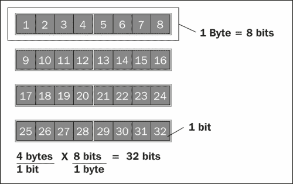
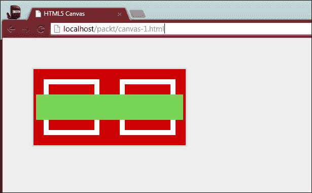
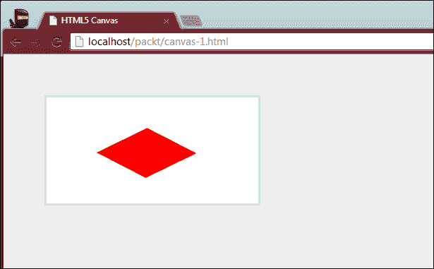
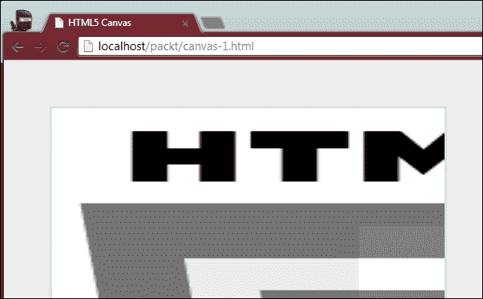
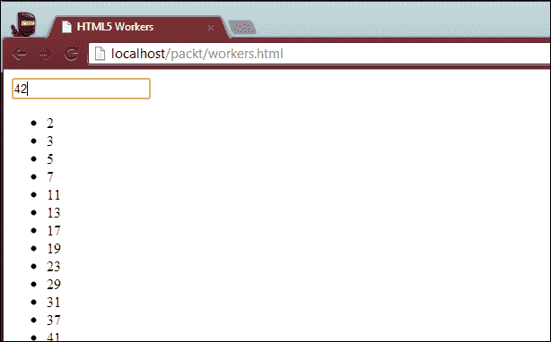

# 四、使用 HTML5 抓蛇

这一章是两部分系列的第一部分，我们将构建游戏的第一个版本，然后在下一章中用更多的 HTML5 APIs 来增加它的趣味。两个版本都将是完整的和可玩的，但是由于在一章中涵盖同一游戏中的所有 API 将构成一个非常大的章节，我们将把事情分成更小的块，并编写两个独立的游戏。

游戏第一版将涵盖 5 个新概念，分别是 **HTML5 的 2D 画布 API** 、**离线应用缓存**、 **web workers** 、**类型化数组**、 **requestAnimationFrame** 。画布元素允许我们绘制 2D 和三维图形，并在非常低的水平上操作图像数据，获得对单个像素信息的访问。离线应用缓存，又称 app cache，允许我们将特定资产从服务器缓存到用户的浏览器中，这样即使无法访问互联网，应用也能正常工作。 Web workers 是一种类似线程的机制，允许我们在独立于主 UI 线程的单独线程中执行 JavaScript 代码。这样，用户界面永远不会被屏蔽，用户不会看到**页面没有响应**警告。 `Typed arrays`是一种新的原生 JavaScript 数据类型，类似于数组，但效率要高得多，并且专门设计用于处理二进制数据。最后，requestAnimationFrame 是浏览器提供的一个 API，用来帮助我们执行基于时间的动画。我们可以让浏览器完成繁重的工作，优化动画，而不是一秒钟多次使用 JavaScript 计时器(`setTimeout`或`setInterval`)来执行动画，这超出了我们单独使用 JavaScript 所能实现的效果。

# 比赛

你肯定以前看过或玩过这个游戏。在 2D 网格中，你只能控制一条蛇向上、向下、向左或向右移动。当你改变蛇头部移动的方向时，蛇身体的每个部分也会随着头部逐渐改变方向。如果你撞上了墙，或者撞上了蛇自己的身体，你就输了。如果你引导蛇的头越过水果，蛇的身体会变大。蛇越大，游戏就越有挑战性。此外，蛇的移动速度可以增加一个额外的挑战。为了保持这款经典游戏的老派本质，我们选择了老派图形和字体，如下图所示:


图像显示了游戏的外观和感觉。游戏刚开始时，蛇的总身长为零——只有头出现。起初，蛇被随机放置在游戏网格的某个地方，没有给它一个开始移动的方向。玩家可以用箭头键控制蛇，一旦蛇开始向特定方向移动，蛇就无法被阻止。例如，如果蛇向右移动，玩家可以上下移动(但不能向后移动)。如果玩家希望将蛇移动到左边(一旦它当前移动到右边)，唯一可能的方法是首先将蛇向上移动，然后向左移动，或者向下移动，然后向左移动。

每当游戏格子上没有水果时，就会随机加一个到格子里。这种水果会一直留在那里，直到玩家吃掉它，这时，一个新的水果会被添加到网格中。为了增加难度，我们可以让一个水果消失，如果蛇不能在这么多秒内到达它。

## API 用法

游戏中使用的每个 API 的一般描述和演示如下。关于每个功能是如何融入最终游戏的解释，请看下面的代码部分。要获得这款游戏的完整源代码，请访问帕克特出版网站的图书页面。

在引入`requestAnimationFrame`之前，开发人员用来在 JavaScript 中创建动画的主要方法是使用计时器来重复调用一个函数，该函数会逐渐更新被动画化的元素的属性。虽然这是一个简单的方法，但是浏览器通过 `requestAnimationFrame`提供的功能有一些额外的好处。首先，浏览器使用单个动画周期来处理页面的渲染，因此我们使用相同周期进行的任何渲染都会产生更平滑的动画，因为浏览器可以为我们优化动画。此外，由于渲染将由浏览器的内部渲染机制完成，因此当运行动画的浏览器选项卡未显示时，我们的动画将不会运行。这样我们就不会浪费电池的时间来制作一些甚至看不见的东西。

## 如何使用

使用 `requestAnimationFrame`很简单，和`setTimeout`差不多。我们在全局窗口对象上调用`requestAnimationFrame`函数，传递一个回调函数，每当浏览器准备运行另一个动画周期时，该函数就会被执行。当回调被调用时，它被传入一个时间戳，通常在我们注册的`requestAnimationFrame`动画函数中使用。

`requestAnimationFrame`常用的方式有两种，两种都达到了同样的效果。在第一种方法中，定义动画函数时不参考`requestAnimationFrame`。然后，第二个函数调用动画函数，接着调用`requestAnimationFrame`。

```html
function myAnimationLoop(time) {
   // 1\. Perform the animation
   myAnimation(time);

   // 2\. Register with request animation frame
   requestAnimationFrame(myAnimationLoop);
}

function myAnimation(time) {
   // Perform animation here
}
```

常用的第二种模式非常相似，只是只包含了主动画功能。该函数本身负责在需要时调用`requestAnimationFrame`。

```html
function myAnimation(time) {
   // 1\. Perform the animation
   myAnimation(time);

   // 2\. Register with request animation frame
   requestAnimationFrame(myAnimationLoop);
}
```

时间参数有用的原因是，因为大多数时候，您希望动画在不同的计算机上以大致相同的速度运行。`requestAnimationFrame`尝试以尽可能接近每秒 60 次的速度运行。但是，根据您在其中执行的代码，该速率可能会显著下降。显然，速度更快的硬件将能够更快地执行您的代码，因此，与一些速度较慢的硬件相比，更经常地将代码显示在屏幕上。为了弥补这种可能性，我们可以用实际时间来控制动画代码运行的频率。通过这种方式，我们可以指定一个上限刷新率，如果一台特定的计算机能够以比这个速度更快的速度运行，就可以简单地降低该计算机的速度，所有用户都会体验到大约相同的动画。

这种技术的一种可能的实现在下面的步骤中显示。虽然看起来步骤很多，但概念真的很简单。它的要点是这样的:我们设置两个变量，一个跟踪动画将运行的上限速度(以每秒**帧** ( **fps** ))，测量)，另一个跟踪一帧渲染的最后时间。然后，每当动画函数执行时，我们取当前时间，减去上一次渲染一帧的时间，并检查它们的差值是否大于或等于我们选择的理想 fps。如果小于我们想要的 fps，我们不动画任何东西，但仍然注册`requestAnimationFrame`在未来给我们回电话。

我们这样做，直到足够的时间过去，这样我们的每秒帧数就可以达到(换句话说，这样我们可以运行的最快帧数就是我们的 fps)。如果系统运行速度比这慢，我们也无能为力。这项技术的作用是控制最大速度。

一旦`requestAnimationFrame` 调用了我们的动画函数，并且距离上一次渲染一帧已经过去了足够的时间，我们就更新所有需要的数据，对于动画，将动画渲染到屏幕上(或者让浏览器来做，如果可以的话)，并更新跟踪上一次更新一帧时间的变量。

```html
// 1\. Create some element
var el = document.createElement("h1");
el.textContent = "I Love HTML5!";
el.style.position = "absolute";

// 2\. Attach it to the document
document.body.appendChild(el);

// 3\. Set some variables to control the animation
var loop = 0;
var lastFrame = 0;
var fps = 1000 / 60;

// 4\. Perform the animation one frame at a time
function slideRight(time) {

   // 5\. Control the animation to a set frames per second
   if (time - lastFrame >= fps) {

      var left = parseInt(el.style.left);

      // 6\. Perform the animation while some condition is true
      if (left + el.offsetWidth < document.body.offsetWidth) {
         el.style.left = (left + loop) + "px";
         loop += 5;

         // 7\. Perform the time control variable
         lastFrame = time;
      } else {

         // 8\. If the animation is done, return from this function
         el.style.left = document.body.offsetWidth - el.offsetWidth;
         return true;
      }
   }

   // 9\. If the animation is not done yet, do it again
   requestAnimationFrame(slideRight);
}

// 10\. Register some event to begin the animation
el.addEventListener("click", function(){
   el.style.left = 0;
   loop = 0;
   slideRight(0);
});
```

这个简单的代码片段创建了一个**文档对象模型** ( **DOM** )元素，为其设置了一些文本，并为其注册了一个 onclick 处理程序。当 click 处理程序被调用时，我们重置元素的一些样式属性(即，将元素放在屏幕的最左侧)，并开始动画例程。动画例程每帧将元素向右移动一点，直到元素到达屏幕的右侧。如果元素还没有到达屏幕右侧，或者换句话说，如果动画还没有完成，我们执行动画(将元素移动几个像素)，然后向`requestAnimationFrame`注册自己，从而继续循环。一旦动画完成，我们就停止调用`requestAnimationFrame`。

要记住的一个关键点是，浏览器对`requestAnimationFrame`所做的主要优化之一是只在有任何东西要渲染时调用它(换句话说，当持有页面的选项卡相对于其他选项卡处于活动状态时)。因此，如果用户在动画进行过程中切换标签，动画将暂停，直到再次选择标签。

换句话说，我们应该做的是让`requestAnimationFrame`调用处理游戏渲染的代码，而不是更新游戏状态的代码。这样，即使浏览器没有渲染，与动画相关的值仍然会获得动画，但我们不会浪费 CPU 和 GPU 的能力，渲染一些不可见的东西。但是一旦浏览器选项卡再次变为活动状态，最新的数据状态将被呈现，就好像它一直在呈现一样。

这项技术对于游戏特别有用，因为我们可能不希望当用户切换浏览器选项卡时整个游戏暂停。话说回来，我们总是可以从节省用户电池中受益，这可以通过在不需要时不将数据渲染到屏幕上来实现。

### 注

请记住`requestAnimationFrame`根据定义，会将动画循环的帧速率限制在显示器的刷新速率。因此，`requestAnimationFrame`并不打算取代本机计时器实现，尤其是在我们希望回调函数以独立于监视器刷新率的速率调用，并且可能高于监视器刷新率的情况下。

# 类型化数组

多年来，JavaScript 引擎变得惊人地快。然而，简单地能够更快地处理数据并不一定等同于能够做更强大的事情。以 WebGL 为例。仅仅因为浏览器现在有能力理解 OpenGL ES，并不一定意味着它拥有我们开发人员利用这一点所需的所有工具。

好消息是，为了满足这一点以及其他已经出现的需求，JavaScript 语言也取得了一些进展。近年来，JavaScript 中增加了一种新的数据类型:类型化数组。一般来说，类型化数组提供的结构类似于 JavaScript 中已经存在的数组类型。然而，这些新阵列的效率要高得多，并且在设计时考虑了二进制数据。

你会问，为什么类型化数组比常规数组更有效，以及如何更有效？好吧，让我们看一个简单的例子，我们所做的就是用老方法遍历一个整数数组。尽管大多数 JavaScript 引擎并不特别努力地快速完成这项任务，但让我们不要忽视引擎为此需要做的所有工作。

```html
var nums = [1, 2, 3, 4, 5];
for (var i = 0, len = nums.length; i < len; i++) {
   // ...
}
```

由于 JavaScript 不是强类型的，数组`nums`不限于保存任何特定类型的数据。此外， `nums`数组可以为其中的每个元素存储不同的数据类型。虽然这有时对程序员来说很方便，但 JavaScript 引擎需要弄清楚每个元素存储在哪里，以及在所述位置存储了什么数据类型。与你所想的相反，`nums`数组中的五个元素可能不会存储在一个连续的内存中，因为，嗯，JavaScript 就是这么做的。

另一方面，对于类型化数组，数组中的每个元素只能是一个`integer`或一个`float`。根据我们选择的数组类型，我们可以有不同类型的`integer`或`float` ( `signed`、`unsigned`、8、16 或 32 位)，但数组中的每个元素总是我们决定使用的相同数据类型(整数或浮点)。通过这种方式，浏览器可以准确、即时地知道内存元素`nums[3]`中的哪个位置位于内存地址`nums + 3`。这个可以实现，因为类型化数组存储在一个连续的内存块中，很像 C 和 C++中的数组结构(顺便说一句，这是用于实现大多数(如果不是所有)JavaScript 引擎的语言)。

如前所述，类型化数组的主要用例是 WebGL(我们将在[第 6 章](6.html "Chapter 6. Adding Features to Your Game")、*为您的游戏添加功能*中介绍)。在 WebGL 中，我们可以直接从 JavaScript 执行 3D 渲染，我们可能需要处理`integer`缓冲区，超过一百万个元素长。这些缓冲区可以用来表示我们希望绘制到屏幕上的 3D 模型。现在，想象一下浏览器迭代一个这样的数组需要多长时间。对于每个元素，它必须跟随一个内存位置，检查该位置的值，确保该值是一个数字，尝试将该值转换为一个数字，然后最终使用该值。听起来工作量很大？那是因为它是。使用类型化数组，它可以尽可能快地遍历该数组，知道每个元素确实是一个数字，并且确切知道每个元素占用多少内存，因此跳转到下一个内存地址是一个一致且可预测的过程。

类型化数组也用于 2D 画布上下文。正如我们将在本章后面的画布应用编程接口部分看到的，有一种方法可以从任何绘制到画布中的内容中获取像素数据。所有这些像素数据都是一个 8 位的长数组。这意味着该数组中的每个元素只能是 0 到 255 之间的`integer`值，这正是像素的可接受值。

## 如何使用

使用类型化数组真的很简单。如果你至少有一些 C 或 C++的经验，可能会更容易理解它们是如何工作的。创建类型化数组最简单的方法是声明我们的数组变量，并为它分配一个特定类型化数组类型的实例。

```html
var typedArr = new Int32Array(10);
```

在示例中，我们创建了一个`integer`数组的实例，其中每个元素可以是正的或负的(`signed`)。每个元素将被存储为 32 位数字。我们传入的`integer` 参数表示数组的大小。一旦创建了这个数组，它的大小就不能改变。分配给它的任何超出边界的值以及任何非法值都会被浏览器忽略。

除了对可以存储在这个特殊数组中的内容的限制之外，对于未受过训练的人来说，这一切似乎只是一个普通的 JavaScript 数组。但是如果我们更深入地研究它，我们会注意到数组和类型化数组之间更多的区别。

```html
typedArr instanceof Int32Array; // True
typedArr.length == 10; // True

typedArr.push(23); // TypeError: <Int32Array> has no method 'push'
typedArr.pop(); // TypeError: <Int32Array> has no method 'pop'
typedArr.sort(); // TypeError; <Int32Array> has no method 'sort'

typedArr.buffer instanceof ArrayBuffer; // True
typedArr.buffer.byteLength == 40; //True

typedArr instanceof Array; // False
```

我们首先注意到的是数组确实是`Int32Array`，而不是数组。接下来，我们很高兴知道长度属性仍然存在。目前为止一切顺利。然后，事情开始分离，因为与常规数组相关联的简单方法不再存在。不仅如此，在类型化数组对象中还有一个新的属性名为`buffer`。该缓冲对象属于类型`ArrayBuffer`，具有`byteLength`属性。在这种情况下，我们可以看到缓冲区的长度是`40`。很容易看出这个`40`是从哪里来的:`buffer`保存 10 个元素(`typedArr.length`)，每个元素 32 位长(4 字节)，总共是`ArrayBuffer`中的`40`字节(因此有了`byteLength`的属性名)。

由于类型化数组没有像常规的 JavaScript 数组那样带有辅助函数，所以我们使用旧的数组表示法向它们读写数据，在这里我们索引数组以便读取或写入一个值。

```html
var typedArr = new Uint32Array(3);

typedArr[] = 0; // SyntaxError

typedArr[0] = 3;
typedArr[1] = 4;
typedArr[2] = 9;

for (var i = 0, len = typedArr.length; i < len; i++) {
   typedArr[i] >= 0; // True
}
```

同样，为了强调这样一个事实，即与普通 JavaScript 数组相关的辅助函数或快捷方式都不能与类型化数组一起工作，请注意，试图在不提供索引的情况下访问元素将会导致浏览器抛出异常。

### ArrayBuffer 和 ArrayBufferView

虽然前面所有的例子都直接使用了一种特定的类型化数组，但是类型化数组的工作方式要稍微复杂一些。实现分为两个独立的部分，即数组缓冲区和视图(或者更具体地说，数组缓冲区视图)。数组缓冲区只是分配的内存块，所以我们可以在那里存储我们的数据。这个缓冲区的问题是它没有关联的类型，所以我们不能访问内存来存储数据或者从内存中读取数据。

为了能够使用数组缓冲区分配的内存空间，我们需要一个视图。虽然这个视图的基本类型是`ArrayBufferView`，但我们实际上需要`ArrayBufferView`的子类，它为存储在数组缓冲区中的数据定义了一个特定的类型。

```html
var buffer = new ArrayBuffer(32);
buffer.byteLengh == 32; // True

var i32View = new Int32Array(buffer);
i32View.length == 8; // True
```

事情可能会变得有些混乱。数组缓冲区以字节为单位工作。作为复习，一个字节由 8 位组成。一个位是一个二进制数字，它的值可以是 0 或 1。这就是数据在计算机中以最基本的格式表示的方式。

现在，如果一个缓冲区在字节方面工作，当我们在示例中创建我们的缓冲区时，我们创建了一个`32`字节的块。我们为保存和使用缓冲区而创建的视图可以是九种可能的类型之一，每种类型指定不同的数据大小(以位为单位，而不是以字节为单位)。因此，类型的视图`Int32`代表一个缓冲区，其中每个元素是一个`integer`，32 位长。换句话说，一个 32 位的视图正好可以容纳 8 个字节(1 字节= 8 位；32 位= 8 字节)，如下图所示:



数组缓冲区以字节为单位工作。在图像中，有 4 个字节，尽管视图类型是以位的形式工作的。因此，如果我们使用 32 位视图，它将产生一个长度正好为一个元素的数组。如果视图使用 16 位数据类型，那么数组将有 2 个元素(4 个字节除以 16 位)。最后，如果视图使用 8 位数据类型，存储在 4 字节缓冲区中的数组将有 4 个元素。

### 类型

要始终记住的一件重要事情是，当您创建一个数组缓冲区时，您选择用来创建缓冲区的长度必须完美地分成数组缓冲区视图的大小。如果缓冲区中没有足够的空间来容纳整个字节，JavaScript 将抛出一个类型为`RangeError`的错误。

在下图中，缓冲区仅够 8 位使用，所有位都必须被整个字节占用。因此，一个视图是一个 8 位的数字，正好适合一个完整的元素，这很好。16 位元素只能容纳元素的一半，这是不可能的。一个 32 位的元素同样只适合它的一部分，这也是不允许的。


正如您所看到的，只要数组缓冲区的位长度是视图中使用的数据类型的位大小的倍数，一切都会好起来。如果视图是 8 位长，那么 8、16、24、32 或 40 的数组缓冲就可以了。如果视图长度为 32 位，那么缓冲区必须至少为 4 字节长(32 位)、8 字节(64 位)、24 字节(96 位)等等。然后，通过将缓冲区中的字节量除以视图所表示的数据类型中的字节量，我们可以计算出我们可以放入所述数组中的元素总数。

```html
// 96 bytes in the buffer
var buffer = new ArrayBuffer(96);

// Each element in the buffer is 32 bits long, or 4 bytes
var view = new Int32Array(buffer);

// 96 / 4 = 24 elements in this typed array
view.length == 24;
```

## 类型化数组视图类型

综上所述，一个普通的旧数组缓冲区没有实际大小。虽然创建一个长度为 5 字节的数组缓冲区是没有意义的，但是我们非常欢迎这样做。只有在创建了数组缓冲区之后，我们才能创建一个视图来保存缓冲区。根据缓冲区的字节大小，我们可以通过选择适当的数据类型来确定数组缓冲区视图可以访问多少元素。目前，对于数组缓冲区视图，有九种数据类型可供我们选择。

*   **Int8Array** :是一个`signed integer`， 8 位长，从 32，768 到 32，767 不等
*   **Uint8Array** :它是一个`unsigned integer`，8 位长，范围从 0 到 65535
*   **Uint8ClampedArray** :它是一个`unsigned integer`，8 位长，范围从 0 到 255
*   **Int16Array** :它是 a `signed integer`，16 位长，从 2，147，483，648 到 2，147，483，647 不等
*   **Uint16Array** :它是一个`unsigned integer`，16 位长，从 0 到 4，294，967，295 不等
*   **Int32Array** :是 a `signed integer`，32 位长，从 9，223，372，036，854，775，808 到 9，223，372，036，854，775，807 不等
*   **Uint32Array** :它是一个`unsigned integer`，32 位长，范围从 0 到 18，446，744，073，709，551，615
*   **Float32Array** :它是 a `signed float`，32 位长，范围 3.4E +/- 38 (7 位)
*   **Float64Array** :它是 a `signed float`，64 位长，范围 1.7E +/- 308 (15 位)

不言而喻，视图类型越大，保存数据所需的缓冲区就越大。很明显，你创建的缓冲区越大，浏览器需要为你留出的内存就越多，不管你最终是否会使用这些内存。因此，我们应该始终注意我们实际上可能需要多少内存，并且尽量不要分配超过这个数量的内存。分配一个由 10，000 个元素组成的数组，每个元素有 64 位长，仅仅是为了在一个游戏中表示一条蛇，就像我们在这一章中构建的蛇，蛇的最大大小可能不超过 50 个左右的元素，并且每个元素不需要保存一个大于 10 的值。

给定这样的约束，我们可以计算一个粗略但乐观的数组大小 50，其中每个元素只需要 8 位(因为我们只需要大约 10 个唯一的值)。因此，50 个元素乘以一个字节，得到的总缓冲区大小为 50 个字节。对于我们的目的来说，这应该足够了，而仅这个缓冲区的内存消耗就应该保持在 0.05 KB 左右。还不错。

最后，您可能已经注意到，本节的第一部分演示了类型化数组的创建，而没有显式使用`ArrayBuffer`构造。

```html
// Create a typed array with 4 elements, each 32 bits long
var i32viewA = new Int32Array(4);

// Create the same typed array, but using an explicit ArrayBuffer first
var buffer = new ArrayBuffer(16)
var i32viewB = new Int32Array(buffer)
```

虽然上面的两个类型化数组引用了两个独立且唯一的内存位置，但是它们在运行时是相同的，并且不能被分开(当然，除非实际数组持有不同的值)；这里的要点是，数组缓冲区视图构造函数可以取一个`ArrayBuffer`，或者简单地取一个`integer`。如果你使用的是`ArrayBuffer`，所有刚才提到的限制都适用，必须小心处理。如果您只提供一个`integer`，浏览器会自动为您创建一个合适大小的数组缓冲区。在实践中，有一些罕见的情况和原因，您可能希望单独手动创建一个数组缓冲区。但是，值得注意的是，为同一个数组缓冲区创建多个数组缓冲区视图是完全合法的，即使每个视图的数据类型不同。请记住，由于缓冲区指的是单个内存位置，因此绑定到同一缓冲区的所有视图都共享该内存空间。

# 画布

在网络平台的游戏开发方面，也许没有其他 HTML5 特性像画布应用编程接口那样强大。虽然我们可能拥有目前规范中的所有其他特性，以及浏览器可能支持的任何即将推出的特性，但使用 HTML 和 JavaScript 制作一款高质量、引人入胜、有趣的游戏几乎是不可能的。画布应用编程接口允许我们创建 2D，以及浏览器上的三维图形。它还允许我们操作存储在画布上下文中的图形数据，一直到单个像素级别。

画布图形和 SVG 图形的一个主要区别，除了 SVG 图形是基于矢量的，画布图形总是光栅图形，是画布是一个单一的 HTML 元素，在它里面绘制的所有东西，实际上，对浏览器来说都是不存在的。因此，在画布上绘制的单个实体上的任何事件处理都必须在应用级别处理。画布上有我们可以观察和响应的通用事件，例如点击、移动事件和键盘事件。除此之外，我们可以随心所欲。

除了我们可以在 HTML5 画布上进行的基于形状的绘制，API 还有三个主要的用例。我们可以创建 2D，基于雪碧的游戏，完整的 3D 游戏(在画布的帮助下使用 WebGL)，以及操纵照片。提到的最后一个用例:照片操作，特别有趣。该应用编程接口有一个非常方便的功能，允许我们不仅将画布中的数据导出为 PNG 或 JPG 图像，而且它还支持各种类型的压缩。这意味着，我们可以在画布上绘图，在画布上加载图形(例如照片)，在像素级操作数据(例如对其应用类似 Photoshop 的滤镜)，旋转、拉伸、缩放，以及以其他方式处理数据。然后，该应用编程接口允许我们将该数据导出为可保存到文件系统的压缩文件。

出于本书的目的，我们将关注画布应用编程接口中最适合游戏开发的方面。虽然 WebGL 是画布元素的一个非常令人兴奋的方面，但是我们将在[第 6 章](6.html "Chapter 6. Adding Features to Your Game")、*为你的游戏*添加特性中对它进行一个非常基本的介绍。对于画布应用编程接口上可用的其他功能，我们将在下一节中用几个例子简要介绍它们。

## 如何使用

关于画布元素，我们首先需要了解的是它有两个部分。一个是物理画布元素，另一个是渲染上下文，通过它我们可以绘制到画布上。截至本文撰写之时，有两个渲染上下文我们可以在现代浏览器中使用，即`CanvasRenderingContext2D`和`WebGLRenderingContext`。

为了获得对画布渲染上下文的引用，我们在画布元素本身上调用 `factory`方法。

```html
var canvasA = document.createElement("canvas");
var ctx2d = canvas.getContext("2d");
ctx2d instanceof CanvasRenderingContext2D; // True

var canvasB = document.createElement("canvas");
var ctx3d = canvas.getContext("webgl") || canvas.getContext("experimental-webgl");
ctx3d instanceof WebGLRenderingContext; // True
```

注意，回退上下文的使用是针对带前缀的`experimentalwebgl`上下文的。截至本文撰写之时，大多数支持 WebGL 的浏览器都将通过实验标签来实现。

本节的其余部分将专门涉及`CanvasRenderingContext2D`原料药。虽然使用 WebGL 的 3D 画布上下文在技术上可以做到 2D 画布上下文所能做到的一切，但这两个 API 唯一的共同点是它们与 HTML5 画布元素的链接。 WebGL 本身就是一种完整的编程语言，仅仅用一章来描述它是不够的。

现在，2D 渲染上下文的一个非常重要的方面是它的坐标空间。与计算机中的大多数坐标系类似，原点位于画布的左上角。横轴向右增加，而纵轴向下增加。内存中用于表示画布的网格大小由生成渲染上下文的画布的物理大小决定，而不是画布的样式大小。这是一个再怎么强调都不过分的关键原则。默认情况下，画布为 300 x 150 像素。即使我们通过**级联样式表** ( **CSS** )来调整画布的大小，它生成的渲染上下文也会是这个大小(当然，除非我们物理地调整画布的大小)。一旦创建了渲染上下文，就不能调整其大小。

```html
<style>
canvas {
   border: 3px solid #ddd;
   width: 500px;
   height: 300px;
}
</style>

<script>
   var canvas = document.createElement("canvas");
   var ctx = canvas.getContext("2d");

   document.body.appendChild(canvas);

   alert(ctx.canvas.width);
</script>
```


添加边框是为了让画布对我们有些可见，因为默认情况下，画布是透明的。

您将观察到 CSS 规则确实应用于画布元素，即使画布的真实大小仍然是默认的 300 x 150 像素。如果我们在画布中间画一个圆，这个圆看起来会扭曲，因为实际画圆的实际坐标空间会被应用于画布的样式拉伸。

### 清直

我们要看的第一个绘图功能是`clearRect`。这个函数所做的就是清除画布上的一个矩形区域。这个函数是在上下文对象上调用的，就像我们将在 2D 画布上进行的所有绘图调用一样。采用的四个参数依次表示从画布原点的 x 和 y 偏移，以及要清除的宽度和高度距离。请记住，与其他编程语言中其他流行的绘图 API 不同，后两个参数不是从原点开始测量的——它们是从前两个参数指定的点开始的位移距离。

```html
var canvas = document.querySelector("canvas");
var ctx = canvas.getContext("2d");

// Clear the entire canvas
ctx.clearRect(0, 0, canvas.width, canvas.height);

// Only clear the half inside area of the canvas
ctx.clearRect(canvas.width * 0.25, canvas.height * 0.25,
   canvas.width * 0.5, canvas.height * 0.5);

// Clear a square 100x100 at the lower right bottom of the canvas
ctx.clearRect(canvas.width - 100, canvas.height - 100, 100, 100);
```

通常，当每秒渲染很多帧时，我们会调用这个函数在绘制下一帧之前清除整个画布。幸运的是，在大多数 JavaScript 引擎中，这个函数表现得相当不错；这样我们就不需要太担心优化精确区域来定期清除。

### 填充和描边

绘制线条、路径、文字等原生对象时，我们会处理笔画和填充的概念；就像在 SVG 中一样，笔画指的是图元的轮廓(如边框或排序)，填充是覆盖形状内部的内容。

我们可以通过为 `fillStyle`或`strokeStyle`属性指定任何颜色来更改用于填充形状的颜色或用于描边形状的颜色。颜色可以是对 CSS 颜色有效的任何字符串。

```html
// Short hand hex colors are fine
ctx.fillStyle = "#c00";
ctx.fillRect(0, 0, canvas.width, canvas.height);

// Keyword colors are fine, though not as precise
ctx.strokeStyle = "white";

ctx.lineWidth = 10;
ctx.strokeRect(25, 25, 100, 100);
ctx.strokeRect(175, 25, 100, 100);

// Alpha transparency is also allowed
ctx.fillStyle = "rgba(100, 255, 100, 0.8)";

ctx.fillRect(5, 50, canvas.width - 10, 50);
```



任何有效的 CSS 颜色字符串都可以分配给 2D 渲染上下文中的颜色属性，包括具有不透明度的颜色。

### 注

请特别注意渲染上下文的行为很像状态机。一旦设置了填充或描边样式以及任何其他属性，该属性将保持该值，直到您更改它。

此外，请注意，您发出的每个后续绘图调用都是在画布上已有的内容之上进行绘制的。因此，我们可以通过以正确的顺序仔细安排绘图调用来对形状和图像进行分层。

### 线

画线就像调用函数`lineTo`一样简单，只需要取两个参数，表示线要去的点。对`lineTo`的后续调用将在函数调用指定的点绘制一条线，从该线的最后一点开始。更具体地说，线条从当前绘图指针所在的位置开始。

默认情况下，指针在任何地方都没有定义，所以画一条线到某个其他点没有什么意义。为了帮助解决这个问题，我们可以使用`moveTo`功能，它可以移动绘图指针，而无需绘制任何东西。

最后，对`lineTo`的任何调用只设置内存中的点。为了最终画线，我们需要快速调用 stroke 函数。一旦进行了这个调用，无论当前设置了什么属性(比如线宽和笔画样式)，都会被绘制出来。因此，在实际绘制线条之前更改线条属性没有什么好处，并且会对性能产生负面影响。

```html
ctx.fillStyle = "#fff";
ctx.fillRect(0, 0, canvas.width, canvas.height);

// This call is completely useless
ctx.strokeStyle = "#c0c";
ctx.lineWidth = 5;

ctx.moveTo(0, 0);
ctx.lineTo(100, 100);
ctx.lineTo(canvas.width, 0);

// This call is also useless because the line hasn't been drawn yet
ctx.strokeStyle = "#ca0";
ctx.moveTo(10, canvas.height - 10);
ctx.lineTo(canvas.width - 10, canvas.height * 0.5);

// This color is applied to every line drawn so far
ctx.strokeStyle = "#f5a";

// The line is finally drawn here
ctx.stroke();
```


形状仅在调用 stroke()后绘制，此时使用当前样式属性。

### 形状

有几个不同的形状我们可以毫不费力地画出来。这些是矩形和圆形。而没有圆形功能，因为有`rect`功能用于绘制矩形。然而，有一个`arc`函数，我们可以从中画圆。

`rect`功能取四个参数，和`fillRect`完全一样。`arc`取一个 x 和一个 y 坐标，后跟一个半径、一个起始角度(以弧度为单位，而不是以度为单位)、一个终止角度和一个布尔值，指定是否顺时针绘制圆弧。画一个圆，我们可以只画一个从 0 到π乘 2 的弧，和 360 度一样。

```html
ctx.fillStyle = "#fff";
ctx.strokeStyle = "#c0c";

ctx.fillRect(0, 0, canvas.width, canvas.height);

ctx.rect(10, 10, 50, 50);
ctx.rect(75, 50, 50, 50);

ctx.moveTo(180, 100);
ctx.arc(180, 100, 30, 1, 3, true);

ctx.moveTo(225, 40);
ctx.arc(225, 40, 20, 0, Math.PI * 2, false);

ctx.stroke();
```


弧(包括圆)是从它们的中心画出的，而不是从它们轮廓上的某个点画出的。

### 文本

在 HTML5 画布上绘制文本也非常简单。函数`fillText`取一个字符串(要绘制的文本)和一个 x 和 y 坐标，文本从这里开始绘制。此外，我们可以像通过 CSS 设置文本样式一样设置文本样式。这可以通过将文本样式属性字符串设置为字体属性来实现。

```html
ctx.fillStyle = "#fff";
ctx.fillRect(0, 0, canvas.width, canvas.height);

ctx.fillStyle = "#f00";
ctx.font = "2.5em 'Times New Roman'";

ctx.fillText("I Love HTML5!", 20, 75);
```

### 转换

画布应用编程接口还定义了一些转换函数，允许我们平移、缩放和旋转上下文的坐标系。在转换坐标系之后，我们可以像平常一样在画布上进行绘制，转换将会适用。

```html
ctx.fillStyle = "#fff";
ctx.fillRect(0, 0, canvas.width, canvas.height);

// Now the origin is at point 50x50
ctx.translate(50, 50);

ctx.fillStyle = "#f00";
ctx.fillRect(0, 0, 50, 50);
```

旋转和缩放也以同样的方式工作。 `scale`函数在每个轴上取一个值来缩放坐标系。 `rotation`函数采用单个参数，即旋转坐标系的角度(弧度)。

```html
ctx.fillStyle = "#fff";
ctx.fillRect(0, 0, canvas.width, canvas.height);

// With transformations, order is very important
ctx.scale(2, 1);
ctx.translate(50, 50);
ctx.rotate(0.80);
ctx.translate(10, -20);

ctx.fillStyle = "#f00";
ctx.fillRect(0, 0, 50, 50);
```



有了转换，秩序就非常重要了。

### 绘制图像

从游戏开发的角度来看，2D 画布应用编程接口最令人兴奋和有用的特性可能是它在其上绘制图像的能力。值得庆幸的是，对我们来说，有几种方法可以在画布上直接绘制常规的 JPG、GIF 或 PNG 图像，包括处理从源到目的地缩放图像的功能。

关于画布元素，我们需要注意的另一点是，它遵循相同的起源策略。这意味着，为了让我们能够在画布上下文中绘制图像，尝试绘制图像的脚本必须从与图像相同的域(以及相同的协议和端口号)提供。任何将来自不同域的图像加载到画布上下文和浏览器中的尝试都会引发异常。

```html
ctx.fillStyle = "#fff";
ctx.fillRect(0, 0, canvas.width, canvas.height);

var img = new Image();
img.onload = function(){
   ctx.drawImage(img, 0, 0, this.width, this.height);
};

img.src = "img/html5-logo.png";
```

绘制图像的最简单的调用只需要五个参数。第一个是对图像的引用。接下来的两个参数是该图像将被绘制到画布上的 x 和 y 位置，最后两个参数是将图像绘制到画布上的宽度和高度。如果最后两个参数不能保持原始图像的纵横比，结果将是失真，而不是剪辑。此外，请注意，如果原始图像比画布大，或者如果图像是从偏移处绘制的，使得图像的一部分离开画布，则不会绘制额外的数据(显然)，画布将忽略可视区域之外的那些像素:


在画布渲染上下文中绘制的 HTML5 徽标。

一个非常重要的观察是，如果在调用`drawImage`时浏览器还没有完成从服务器下载图像资源，画布将不会绘制任何东西，因为传递给它的图像还没有加载。在我们使用某种游戏循环每秒多次在画布上绘制相同图像的情况下，这并不是一个真正的问题，因为每当图像最终加载时，下一次通过游戏循环将成功绘制图像。然而，在绘制图像的调用只完成一次的情况下(如上例)，我们只有一次绘制图像的机会。因此，非常重要的一点是，我们不要进行这样的调用，直到图像实际上被加载到内存中，并准备好被绘制到画布中。

为了确保调用将图像绘制到画布中只发生在图像已经从服务器完全下载之后，我们可以简单地在图像的 load 事件上注册一个回调函数。这样，一旦图像下载完成，浏览器就可以触发回调，最终可以调用来绘制图像。这样，我们就可以确定，当我们想要在画布中渲染图像时，图像确实已经准备好了。

同样的功能还有另一个版本，它考虑了从源到目标的缩放。在上例中，源图像比画布大。我们可以告诉画布将整个图像绘制到画布的较小区域，而不是使用照片编辑软件程序来调整图像的大小。缩放由画布自动完成。我们也可以将图像绘制成比图像本身更大的区域，但是这样做会导致像素化，这取决于我们缩放图像的程度。

这个函数的参数是源图像，源 x 和 y 坐标(换句话说，相对于图像本身，从哪里开始采样源图像)，源宽度和高度(换句话说，采样源图像多少)，目的地 x 和 y，后面是宽度和高度。

```html
ctx.fillStyle = "#fff";
ctx.fillRect(0, 0, canvas.width, canvas.height);

var img = new Image();
img.onload = function(){

   ctx.drawImage(img,
      // Sample part of the upper left corner of the source image
      35, 60, this.width / 2, this.height / 2,

      // And draw it onto the entire canvas, even if it distorts the image
      0, 0, canvas.width, canvas.height);
};

img.src = "img/html5-logo.png";
```


HTML5 标志的一部分绘制在画布渲染上下文中，有一些有意的拉伸。

### 操纵像素

现在我们已经知道如何将图像绘制到画布中，让我们将事情进行到下一步，并处理画布中绘制的单个像素。为了实现这一点，我们可以使用两个功能。一个函数允许我们从画布上下文中检索像素数据，另一个函数允许我们将像素缓冲区放回画布上下文中。此外，还有一个功能允许我们将像素数据检索为数据网址，这意味着我们可以将画布中的图像数据保存到用户的文件系统中，就像我们可以从``标签中检索常规图像一样。

```html
ctx.fillStyle = "#fff";
ctx.fillRect(0, 0, canvas.width, canvas.height);

var img = new Image();
img.onload = function(){
   ctx.drawImage(img, 35, 60, this.width / 2, this.height / 2, 0, 0, canvas.width, canvas.height);

   // Extract pixel data from canvas context
   var pixels = ctx.getImageData(0, 0, canvas.width, canvas.height);

   pixels instanceof ImageData; // True
   pixels.data instanceof Uint8ClampedArray; // True
   pixels.width == canvas.width; // True
   pixels.height == canvas.height; // True

   // Insert pixel data into canvas context
   ctx.putImageData(pixels, 0, 0);
};

img.src = "img/html5-logo.png";
```

要获得表示画布中当前绘制的任何内容的像素数据，我们可以使用函数`getImageData`。这四个参数是源图像上的 x 和 y 偏移量，以及要提取的宽度和高度。请注意，该函数的输出是类型为`ImageData`、的对象，该对象具有三个属性，即宽度、高度和具有实际像素信息的类型化数组。正如本章前面提到的，这个类型化数组是类型`Uint8ClampedArray`，其中每个元素只能是一个值在 0 到 255 之间的`integer`。

像素数据是长度(`canvas.width x canvas.height x 4`)的缓冲区。也就是说，每四个元素代表一个像素，以此顺序代表像素的红色、绿色、蓝色和 alpha 通道。因此，为了通过这个画布应用编程接口操作图像，我们对这个像素缓冲区执行各种计算，然后我们可以使用`putImageData`函数将其放回画布中。

`putImageData`的三个参数是`ImageData`对象，以及目标画布上的 x 和 y 偏移。从那里，画布将尽可能地渲染图像数据，剪切任何原本会在画布之外绘制的额外数据。

作为我们可以对图像做什么的一个例子，我们将把我们绘制到画布中的 HTML5 徽标，并对表示它的像素数据应用灰度函数。如果这听起来像是一项复杂的任务，不要害怕。虽然有几种不同的公式可以将彩色图像转换为灰度，最简单的方法是简单地平均每个像素的红色、绿色和蓝色值。

```html
ctx.fillStyle = "#fff";
ctx.fillRect(0, 0, canvas.width, canvas.height);

var img = new Image();
img.onload = function(){
   ctx.drawImage(img, 35, 60, this.width / 2, this.height / 2, 0, 0, canvas.width, canvas.height);

   // Extract pixel data from canvas context
   var pixels = ctx.getImageData(0, 0, canvas.width, canvas.height);

   // Iterate over every four elements, which together represent a single pixel
   for (var i = 0, len = pixels.data.length; i < len; i += 4) {
      var red = pixels.data[i];
      var green = pixels.data[i + 1];
      var blue = pixels.data[i + 2];
      var gray = (red + green + blue) / 3;

     // PS: Alpha channel can be accessed at pixels.data[i + 3]

      pixels.data[i] = gray;
      pixels.data[i + 1] = gray;
      pixels.data[i + 2] = gray;
   }

   // Insert pixel data into canvas context
   ctx.putImageData(pixels, 0, 0);
};

img.src = "img/html5-logo.png";
```



操纵图像并不比对表示图像的像素缓冲器的每个像素执行各种计算更复杂。

最后，我们可以从画布导出图像的方法就像调用`toDataURL`函数一样简单。特别说明一下这个函数是在画布对象上调用的，而不是在渲染上下文对象上。画布对象的`toDataURL`功能取两个可选参数，即代表输出图像 MIME 类型的字符串，`0.0`和`1.0`之间的`float`，代表输出图像的质量。如果输出图像类型不是`"image/jpeg"`，质量参数将被忽略。

```html
   ctx.putImageData(pixels, 0, 0);

   var imgUrl_LQ = canvas.toDataURL("image/jpeg", 0.0);
   var out = new Image();
   out.src = imgUrl_LQ;
   document.body.appendChild(out);

   var imgUrl_HQ = canvas.toDataURL("image/jpeg", 1.0);
   var out = new Image();
   out.src = imgUrl_HQ;
   document.body.appendChild(out);

   var imgUrl_raw = canvas.toDataURL("image/png");
   var out = new Image();
   out.src = imgUrl_raw;
   document.body.appendChild(out);
```

# 网络工作者

网络工作者带来了在主用户界面线程之外执行代码的能力。这种类似线程的行为允许我们在不阻塞用户界面的情况下执行持久的任务。当一个 JavaScript 任务花费太长时间完成时，浏览器会向用户显示一个警告，让用户知道页面没有响应。使用网络工作者，我们可以解决这个问题。

我们需要记住一些关于网络工作者的限制。首先，工作线程在 DOM 之外运行，因此与此相关的任何功能在工作线程内部都不可用。此外，没有与工作人员共享内存的概念，任何传入和传出工作人员的数据都被复制到自己的内存空间中。最后，除了函数之外，任何传入和传出工作者的对象都可以包含任何数据类型。如果你试图传递一个函数给一个工作者(或者一个持有函数引用的对象)，浏览器会抛出一个**数据克隆错误** (DOM 异常 25)。

另一方面，工人完全有能力触发 XHR 请求(Ajax 调用)，启动其他工人，并停止其他工人，包括他们自己。一旦工作者被终止，它就不能再被启动，类似于其他语言(如 Java)中可用的其他线程构造。

## 如何使用

在本节中，我们将创建一个在工作线程中生成素数的示例迷你应用。用户可以在应用中输入一个数字，应用将返回一个达到该数字的素数列表。这些质数将被传递回主应用，然后主应用将质数列表返回给用户。

要开始使用 web workers，我们必须首先创建一个单独的 JavaScript 文件，该文件将在 worker 线程中运行。这个脚本与其父线程通信的方式是通过消息。为了从父线程接收消息，工作线程需要注册一个回调函数，每当有消息传递给它时就调用这个函数。

```html
self.addEventListener("message", getPrimes);
```

当在工作线程及其父线程中接收到消息时，调用该函数，并将 `MessageEvent`对象传递给该函数。这个对象包含许多属性，包括一个时间戳，最重要的是一个数据属性，它包含传递给工作者的任何数据。

要将消息发送给工作人员或返回给其父对象，我们只需在适当的对象上调用函数`postMessage`(工作人员对象，或者如果在工作人员内部，则在自身对象上)，将数据与函数调用一起传递。只要不包含函数，该数据可以是单个值、数组或任何类型的对象。

最后，为了创建一个`worker`对象，我们简单地创建一个类的实例`Worker`，将工作脚本的路径作为构造函数参数传递。这个`worker`对象需要为它想要观察的任何事件注册回调函数:`onMessage`或`onError`。要杀死工作线程，我们可以直接在工作对象上调用`terminate`函数，或者在工作脚本上调用`close`函数。

```html
// index.html
var worker = new Worker("get-primes.worker.js");

worker.addEventListener("message", function(event){
   var primes = event.data.primes;
   var ul = document.createElement("ul");

   // Parse each prime returned from the worker
   for (var i = 0, len = primes.length; i < len; i++) {
      var li = document.createElement("li");
      li.textContent = primes[i];
      ul.appendChild(li);
   }

   // Clear any existing list items
   var uls = document.querySelectorAll("ul");
   for (var i = 0, len = uls.length; i < len; i++)
      uls[i].remove();

   // Display the results
   document.body.appendChild(ul);
});

var input = document.createElement("input");
input.addEventListener("keyup", function(event){
   var key = event.which;

   // Call the worker when the Enter key is pressed
   if (key == 13 /* Enter */) {
      var input = this.value;

      // Only use input that's a positive number
      if (!isNaN(input) && input > 0) {
         worker.postMessage({max: input});
      } else if (input == -1) {
         worker.terminate();
         this.remove();
      }
   }
});

input.setAttribute("autofocus", true);
document.body.appendChild(input);
```

在上面的代码片段中，我们设置了两件事:一个工作人员和一个输入字段。然后，我们在输入字段上设置一个`keydown`监听器，用户可以输入一个数字发送给工作人员。要将该号码发送给工作人员，用户必须按下**进入**键。当这种情况发生时，输入字段中的数字将是工作人员生成的最大可能素数。如果用户输入数字`-1`，工作人员被终止，输入字段从 DOM 中移除。

为了简单起见，工作线程将使用厄拉多塞的**筛来寻找素数。请记住，这个练习只是一个概念证明来说明网络工作者是如何工作的，而不是一堂高等数学课。**

```html
// get-primes.worker.js

// Register the onMessage callback
self.addEventListener("message", getPrimes);

// This function implements the Sieve of Eratosthenes to generate the primes.
// Don't worry about the algorithm so much – focus on the Worker API
function getPrimes(event) {

   var max = event.data.max;
   var primes = [];
   var d = [];

   for (var q = 2; q < max; q++) {
      if (d[q]) {
         for (var i = 0; i < d[q].length; i++) {
            var p = d[q][i];
            if (d[p + q])
               d[p + q].push(p);
            else
               d[p + q] = [p];
         }
         delete d[q];
      } else {
         primes.push(q);
         if (q * q < max)
            d[q * q] = [q];
      }
   }

   // Return the list of primes to the parent thread
   self.postMessage({primes: primes});
}
```



只要工作进程没有被终止，它就可以被调用无数次。一旦终止，工人可以被删除，因为从那时起，它没有任何有用的目的。

# 离线应用缓存

离线应用缓存是在浏览器上存储资产的一种方式，供用户未连接互联网时使用。这个应用编程接口进一步打破了原生应用和网络应用之间的任何障碍，因为它消除了网络应用与原生应用的主要区别——需要连接到万维网。虽然用户显然仍需要在某个时间点连接到网络，因此应用最初可以下载；之后，应用可以完全从用户的缓存中运行。

离线应用缓存的主要用例可能是当用户的连接不稳定、不一致，或者在每次使用应用时根本不打开。对于游戏来说尤其如此，因为用户可能会在某些时候选择玩某个在线游戏，但稍后会离线。类似地，如果游戏需要连接到后端服务器，以便执行任何任务(例如检索新的游戏数据)，这可以在用户连接时完成，资源可以再次在本地缓存，并且如果用户的连接变得不可用，新数据可以再次使用。

## 如何使用

离线应用缓存 API 的主干是 manifest 文件，它向浏览器指定哪些资源应该缓存以供离线使用，哪些资源永远不能缓存，以及当尝试连接到服务器但没有找到连接时浏览器应该做什么。

在加载应用时，清单文件与用户请求的 HTML 文件一起提供。更具体地说，宿主 HTML 文件指定了清单文件的路径，浏览器随后与主应用的下载和处理并行提取和处理清单文件。这是通过根`html`标签中的`manifest`属性来完成的。

```html
<!doctype html>
<html manifest="manifest.appcache">
```

请注意，上面的代码片段指定了一个名为`manifest.appcache`的清单文件，该文件与指定清单的 HTML 文件位于同一目录中。文件名及其扩展名完全是任意的。按照惯例，许多开发人员简单地将清单命名为`manifest.appcache`、`manifest`(没有扩展名)或`appcache.manifest`。然而，这个文件很可能被命名为`manifest.php?id=2642`、`my-manifest-file.txt`或`the_file.json`。

需要记住的一件重要的事情是清单文件应该使用正确的 MIME 类型。如果浏览器试图获取根 HTML 标记的`manifest`属性中列出的任何文件，并且 MIME 类型不是`text/cache-manifest`，则浏览器将拒绝清单，并且不会发生离线应用缓存。

有许多方法可以将 MIME 类型设置为文件，但通常这是服务器设置。如果使用 Apache 服务器，例如我们在 WAMP、MAMP 或 LAMP 上使用的服务器(参见在线章节，*设置环境*，我们可以通过`.htaccess`文件轻松做到这一点。例如，在我们项目的根目录中，我们可以创建一个名为`.htaccess`的文件，其中包含以下代码:

```html
AddType text/cache-manifest .appcache
```

这将告诉服务器为任何扩展名为`.appcache`的文件添加正确的 MIME 类型。当然，如果您决定调整`htaccess`文件以将`cache-manifest` MIME 类型提供给其他文件扩展名，如果您选择的扩展名已经与其他 MIME 类型相关联(如`.json`)，您可能会遇到问题。

清单文件的第一行必须是以下字符串:

```html
CACHE MANIFEST
```

如果这一行不再出现，整个应用编程接口将不起作用。如果上面列出的字符串前面有足够多的空白，浏览器将抛出以下错误，指示文件清单无效，并且不会缓存任何内容:

```html
Application Cache Error event: Failed to parse manifest
```

### 注

在游戏中使用离线应用缓存时，请确保留意浏览器的 JavaScript 控制台。如果出现任何问题，例如找到清单文件、解析清单或加载清单中描述的任何资源，浏览器会通过引发异常来让您知道出现了问题，但它会继续下去。与大多数致命的 JavaScript 异常不同，致命的离线应用缓存异常不会停止或影响启动缓存过程的脚本的执行。因此，您可能会得到应用缓存异常，但并不知道，所以熟悉浏览器支持的任何开发工具，并好好利用它。

清单的其余部分可以分为三个主要类别，即要缓存的资产、永远不缓存的资产和后备资产。注释可以放在文件中的任何地方，并用井号表示。清单解析器会忽略井号后面的整行。

```html
CACHE MANIFEST

# HTML5 Snake, Version 1.0.0

CACHE:
index.html
js/next-empty.worker.js
js/renderer.class.js
js/snake.class.js
img/block-green.png
img/fruit-01.png
fonts/geo.woff
fonts/vt323.woff
css/style.css

NETWORK:
*

FALLBACK:
fallback.html
```

通过使用网络部分下的通配符，我们表明任何未在缓存下指定的资源都在网络部分下被限定，这意味着这些资源将不被缓存。当网络访问不可用时，任何加载这些资源的尝试都会导致回退文件被加载。这是一个很好的选择，让用户知道需要网络访问，而不需要任何额外的特殊代码。

一旦清单被解析所有资源都被缓存，所有资源都将保持缓存状态，直到用户删除离线应用缓存数据(或者浏览器缓存的所有数据)，或者清单被更改。即使清单文件中只有一个字符发生了变化，浏览器也会认为这是一个更新，因此，所有的资源都会被重新缓存。正因为如此，许多开发人员在清单文件的顶部写了一个注释行，除了其他可选内容之外，它们还包括某种版本号，用于标识清单的唯一版本。这样，如果一个或多个资产发生变化，我们可以通过简单地更改清单文件中列出的版本号来强制浏览器重新缓存这些资产。请记住，浏览器只会检查清单文件中的文本，以确定是否需要下载新资产。如果资产发生了变化(比如，您更新了清单中列出的 JavaScript 代码，或者一些图形，或者任何其他资源)，但是清单文本没有发生变化，这些资源将不会从服务器中被提取出来，用户将继续在他或她的应用中使用过时的资产，因为资产只从缓存中加载。

# 代码

这个游戏的布局方式其实很简单。HTML 只有三个小部件:游戏标题、玩家当前得分的计分板和跨多个游戏的整体高得分的计分板。这最后一个计分板在这个版本的游戏中没有使用，我们将在下一个游戏中更多地进入它(参见[第五章](5.html "Chapter 5. Improving the Snake Game")、*改进贪食蛇游戏*)。

```html
<h1>HTML5 Snake</h1>

<section id="scores">
   <h3>Score: <span>0</span></h3>
   <h3>High Score: <span>0</span></h3>
</section>

<section id="gameMenu" class="hide">
   <h3>Ready!</h3>
   <button>Play</button>
</section>
```

为了从游戏中所有不同的组件中分离出各种职责，我们将整个游戏的所有渲染抽象到一个`Renderer`类中。该类负责将数据绘制到赋予它的`canvas`参考。它绘制的数据，无论是蛇还是任何其他对象，都作为类型化数组传递给它，表示要绘制实体的坐标，以及在类型化数组指定的位置绘制的图像资源。`Renderer`类还包括一些辅助函数，帮助我们轻松清除画布，并将一个`x`和`y`点转换为一个索引，用于遍历表示 2D 点的平面数组。

```html
var Renderer = function(canvas) {

   var canvas = canvas;
   var ctx = canvas.getContext("2d");
   var width = canvas.width;
   var height = canvas.height;

   var getIndex = function(x, y) {
      return width * y + x;
   };

   var getPosition = function(index) {
      return {
         x: index % width,
         y: parseInt(index / width)
      };
   };

   this.clear = function() {
      ctx.clearRect(0, 0, canvas.width, canvas.height);
   };

   this.draw = function(points, img) {
      for (var i = 0, len = points.length; i < len; i += 2) {
         ctx.drawImage(img, points[i] * img.width, points[i + 1] * img.height, img.width, img.height);
      }
   };
};
```

接下来，我们创建一个`Snake` 类，它封装了与蛇相关的所有数据和行为。这个类存储的数据是蛇头部的当前位置，蛇身体的当前长度，将要绘制的代表蛇的图像，以及蛇是否活着。它处理的行为包括蛇的移动和用户输入的处理(为了简单和简洁，它包含在这个类中)。有几个助手函数允许我们将其他行为委托给客户端。例如，通过暴露的 API，客户端可以在每一帧检查蛇是否走出了世界网格，是否吃了水果，或者蛇是否跑进了自己的身体。客户端还可以使用提供的 API，对蛇采取行动，例如设置它的生命属性(死的或活的)，以及重置用于绘制蛇的图像，或它的任何其他属性。

```html
var Snake = function(x, y, width, height, maxSize) {
   var isAlive = true;
   var size = 0;
   var body = new Int8Array(maxSize * 2);
   for (var i = 0, len = body.length; i < len; i++)
      body[i] = -1;
   body[0] = x, body[1] = y;
   var worldWidth = width;
   var worldHeight = height;
   var skin;
   var dir = { 38: false, 40: false, 37: false, 39: false };
   var keys = { UP: 38, DOWN: 40, LEFT: 37, RIGHT: 39 };
   // To move the snake, we first move each body part to where the
   // part before it used to be, starting at the tail and moving
   // towards the head. Lastly, we update the head's position
   var move = function() {
      // Traverse the snake backwards and shift each piece one spot
      for (var i = size * 2 + 1; i > 1; i -= 2) {
         body[i] = body[i - 2];
         body[i - 1] = body[i - 3];
      }
      if (dir[keys.UP]) {
         body[1]--;
      } else if (dir[keys.DOWN]) {
         body[1]++;
      } else if (dir[keys.LEFT]) {
         body[0]--;
      } else if (dir[keys.RIGHT]) {
         body[0]++;
      }
   };
   // Update the snake's position vectors on key presses
   this.doOnKeyDown = function(event) {
      var key = event.which;
      // Don't process a key that's already down
      if (dir[key])
         return;
      dir[keys.UP] = false;
      dir[keys.DOWN] = false;
      dir[keys.LEFT] = false;
      dir[keys.RIGHT] = false;
      if (key == keys.UP && !dir[keys.DOWN]) {
         return dir[keys.UP] = true;
      } else if (key === keys.DOWN && !dir[keys.UP]) {
         return dir[keys.DOWN] = true;
      } else if (key === keys.LEFT && !dir[keys.RIGHT]) {
         return dir[keys.LEFT] = true;
      } else if (key === keys.RIGHT && !dir[keys.LEFT]) {
         return dir[keys.RIGHT] = true;
      }
   };
   // This allows us to use different images to represent the snake
   this.setSkin = function(img) {
      skin = new Image();
      skin.onload = function() {
         skin.width = this.width;
         skin.height = this.height;
      };
      skin.src = img;
   };
      this.move = move;
   this.getSkin = function() { return skin; };
   this.setDead = function(isDead) { isAlive = !isDead; };
   this.isAlive = function() { return isAlive; };
   this.getBody = function() { return body; };
   this.getHead = function() { return {x: body[0], y: body[1]}; };
   this.grow = function() { if (size * 2 < body.length) return size++; };
   // Check if the snake is at a certain position on the grid
   this.isAt = function(x, y, includeHead) {
      var offset = includeHead ? 0 : 2;
      for (var i = 2, len = body.length; i < len; i += 2) {
         if (body[i] == x && body[i + 1] == y)
            return true;
      }
      return false;
   };
   this.reset = function(x, y) {
      for (var i = 0, len = body.length; i < len; i++)
         body[i] = -1;
      body[0] = x;
      body[1] = y;
      size = 0;
      isAlive = true;
      dir[keys.UP] = false;
      dir[keys.DOWN] = false;
      dir[keys.LEFT] = false;
      dir[keys.RIGHT] = false;
   };
};
```

类似于`snake`类，我们还创建了一个类来封装蛇要吃的水果。 `snake`类和`fruit` 类唯一的区别是`fruit`类除了出现在地图上之外不会做任何事情。出于所有实际目的，`fruit`类与`snake`类共享一个公共实体接口，允许它们重置为默认状态，设置它们的位置，并检查碰撞。

```html
var fruit = {
   position: new Int8Array(2),
   reset: function() {
      this.position[0] = -1;
      this.position[1] = -1;
   },
   isAt: function(x, y) {
      return this.position[0] == x && this.position[1] == y;
   },
   img: null
};
```

最后，在主代码中，我们执行以下设置任务:

*   创建一个画布元素，并将其附加到 DOM。
*   实例化`renderer`、`snake`和`fruit`对象。
*   创建一个游戏循环，当一个水果不存在时，在网格上放置一个水果，更新蛇的位置，检查蛇在哪里，并将游戏状态渲染到画布上。

我们还使用游戏循环来钩入计分板小部件，以增加用户体验。游戏的完整源代码可以在 Packt Publishing 网站的图书页面上找到，它还包括额外的菜单，但为了简洁起见，这里显示的代码片段中没有包括这些菜单。

我们在这个游戏循环中利用的另一个东西是`requestAnimationFrame` API。为了保证不同的 CPU 和图形处理器都以相同的速度渲染游戏，我们在游戏循环中增加了一个简单的帧率控制器。帧率由一个变量控制，该变量指定游戏应该尝试运行多少 fps。

```html
function gameLoop() {
   // Only do anything here if the snake is not dead
   if (snake.isAlive()) {

      // Make the frame rate no faster than what we determine (30 fps)
      renderTime.now = Date.now();
      if (renderTime.now - renderTime.last >= renderTime.fps) {
         // If there is no fruit on the grid, place one somewhere. Here we
         // use a web worker to calculate an empty square on the map
         if (fruit.position[0] < 0) {
            cellGen.postMessage({
               points: snake.getBody(),
               width: worldWidth,
               height: worldHeight
            });
         } else {

            snake.move();
            head = snake.getHead();

            // Check if the snake has ran into itself, or gone outside the grid
            if (snake.isAt(head.x, head.y, false) ||
                   head.x < 0 || head.y < 0 ||
                   head.x >= worldWidth || head.y >= worldHeight) {
               snake.setDead(true);
            }

            // Check if the snake has eaten a fruit
            if (fruit.isAt(head.x, head.y)) {
               fruit.reset();
               snake.grow();
               score.up();
            }

            renderTime.last = renderTime.now;
         }
      }

      // Render everything: clear the screen, draw the fruit, draw the snake,
      // and register the callback with rAF
      renderer.clear();
      renderer.draw(fruit.position, fruit.img);
      renderer.draw(snake.getBody(), snake.getSkin());
      requestAnimationFrame(gameLoop);
   }

   // If the snake is dead, stop rendering and disable
   // the key handlers that controlled the snake
   else {
      document.body.removeEventListener("keydown", snake.doOnKeyDown);
   }
}
```

# 总结

在这一章中，我们开始使用期待已久的画布应用编程接口进行 2D 渲染。我们查看了通过画布渲染上下文提供给我们的各种绘图功能，包括绘制简单的线条和形状、从外部图像源绘制图像、像素操作和图像提取，这允许我们将图像从画布保存回用户的文件系统。

我们还查看了通过 web worker 界面提供给我们的新线程系统。这允许我们释放用户界面线程，同时我们执行持久的任务，否则会锁定界面，并导致浏览器显示无响应的页面警报。不幸的是，web 工作人员有一些限制，因为工作人员之间没有共享内存，工作线程中没有关联或允许的 DOM。尽管如此，HTML5 的这一宏伟的新功能仍有许多工作要做。

我们在本章中介绍的另一个特定于 HTML5 的 API 是离线应用缓存。通过这种机制，我们可以从网络服务器中保存特定的资产，将其存储为快速、高可用性的缓存，由用户的浏览器提供动力。浏览器保存的特定资产由清单文件指定，而清单文件是一个简单的基于文本的文件，必须由服务器以`text/cache-manifest` MIME 类型提供服务。

最后，我们看了 JavaScript 语言的两个新的补充，使游戏开发更加高效和令人兴奋。这两个功能中的第一个是`requestAnimationFrame`，它允许我们在一个由浏览器本身管理的同步调用中呈现所有内容。这通常是渲染所有图形的最佳方式，因为浏览器可以高度优化渲染过程。第二个特性是类型化数组数据类型，它允许更高效的数据存储和访问。这对于游戏开发特别有吸引力，因为我们可以通过使用这种新的数据类型来获得额外的性能提升，尽管它的外观和行为几乎与常规数组 100%相同。因此，使用类型化数组编写新代码不应该包含任何学习曲线，因为移植使用数组的现有代码是一种真正的享受。

在下一章中，我们将继续研究 Snake 游戏，使其更加健壮，功能更加丰富。我们将学习另外四个 HTML5 APIs，即 sessionStorage、localStorage、IndexedDB 和 web 消息传递。