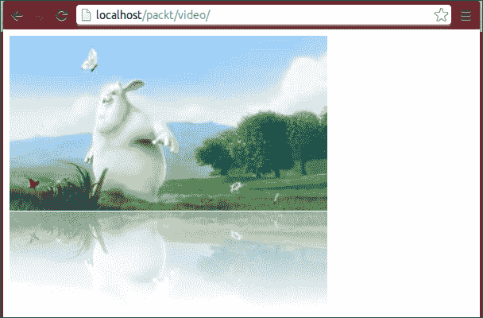
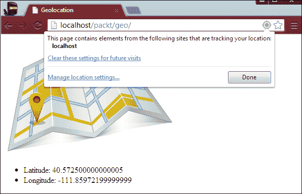
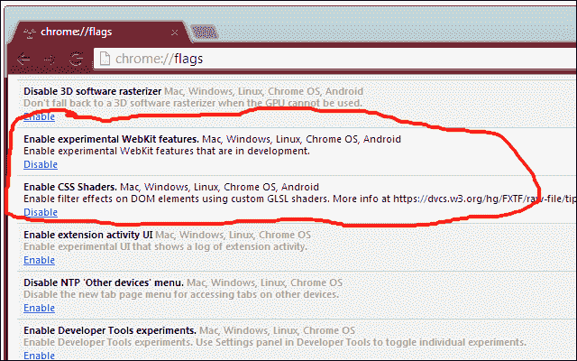
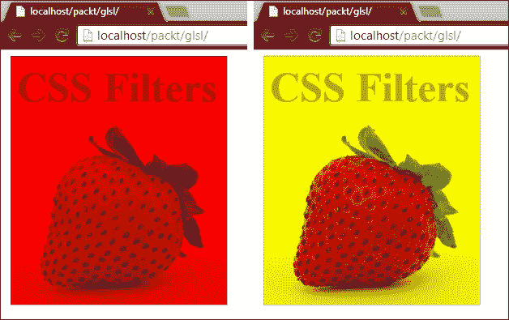

# 第六章。为您的游戏添加功能

这一章与前几章略有不同，因为没有与这一章相关的游戏。我们没有用本章中的概念来构建游戏的原因是，所涵盖的概念对于单个章节来说太复杂了(例如，有整本书专门讨论 WebGL 的主题)，或者它们不太适合在游戏中使用。此外，本章末尾提到的一些功能非常新，浏览器支持仍然很少(如果有的话)，并且 API 的稳定性可能不太可靠。为此，我们将简单解释每个 API，提供有意义的示例，并希望这种深入浅出的介绍足以让您对每个 API 涉及的潜在客户感到兴奋。

本章的第一部分将涵盖*四个*html 5 API，它们是对浏览器平台非常令人兴奋和强大的补充。首先，我们将介绍 **WebGL** ，它将 **OpenGL ES** 的强大功能带到了浏览器中，允许硬件加速的 3D 图形渲染，而不需要任何一个插件。接下来，我们将讨论如何使用 web sockets 获得类似线程的体验，使用视频 API 从 JavaScript 获得原生视频回放和操纵权限，以及地理定位，这允许 JavaScript 确定用户的物理位置(地理位置)。

最后，我们将通过查看 HTML5 演进中绝对最新的特性来结束这一章。这些特性使 CSS 更上一层楼，使它不再仅仅是一个基于矩形的渲染引擎。我们将研究的第一个新特性是 CSS 着色器，它允许我们指定每个像素的渲染方式。这是使用 GLSL 着色器完成的，正如我们将在网络 GL 讨论中看到的，这些着色器是我们编写的独立程序，在 GPU 上运行，在尽可能低的级别上控制如何渲染某些东西。有了自定义着色器，我们可以做的不仅仅是简单的预烘焙 CSS 转换。

本章后半部分介绍的其他新的 CSS 特性是 CSS 列、CSS 区域和排除。CSS 列使得动态调整一个容器显示多少列文本变得非常容易。例如，如果我们希望一个文本块显示在 3 个等宽或等高的列中，我们通常会设置三个不同的容器，然后将每个容器向左浮动。对于列，我们可以简单地将所有文本存储在一个容器中，然后使用 CSS 来生成列。最后，CSS 区域和排除使得在复杂模式内部或周围呈现文本成为可能，而不是传统的矩形。你肯定见过杂志这样做，一段文字包裹着一些形状，比如汽车或其他物体的轮廓。过去，在 HTML 中很少尝试使用纯文本(而不是使用图像)来实现这种效果，因为要做到这一点需要极其复杂。现在只需要几行 CSS 代码。

# 高级 HTML5 APIs

虽然下面的 API和特性在复杂性和学习曲线陡度上有很大的不同，但我们的目标是至少对这些主题中的每一个提供一个全面的介绍。为了加深对每个主题的理解和工作经验，建议您用其他来源补充此处提供的介绍。

由于 HTML5 的部分规格和功能尚未完全成熟，某些 API 可能无法在所有浏览器中完全支持，即使是最新的现代浏览器也是如此。由于本章将涵盖 HTML5 的绝对最新特性(在撰写本文时)，有些浏览器可能不适合本章中涵盖的示例。因此，建议您使用最新版本的最先进的网络浏览器。不仅如此，您还必须确保检查您的浏览器有哪些实验性功能和/或安全标志可用。以下代码片段是专门为谷歌 Chrome 编写的，因为它支持所描述的所有功能。我们将记录一个功能正常工作所需的任何特定配置设置，但是随着新的网络浏览器部署新的更新，这些设置可能需要，也可能不需要。

# WebGL

也许没有其他 HTML5 特性像 WebGL 一样让游戏开发者兴奋。这个新的 JavaScript 应用编程接口允许我们渲染高性能、硬件加速的 2D 和 3D 图形。该应用编程接口是 OpenGL ES 2.0 的一种风格，并利用 HTML5 画布元素来弥合浏览器和用户计算机中图形处理单元之间的差距。

虽然 3D 编程是一个值得自己出书的话题，但以下概述足以让我们开始了解最重要的概念，并将让我们开始为浏览器平台开发 3D 游戏。想为 OpenGL ES 2 寻找一个好的学习资源的人，可以看看*芒市、金斯堡和施雷纳*的 OpenGL ES 2.0 编程指南。

### 注

由于 WebGL 在很大程度上基于 OpenGL ES 2.0，您可能会想从 OpenGL 书籍和其他来源寻找关于它的参考和补充材料。请记住，OpenGL 2.0 版及更早版本与 OpenGL 2.0(以及 OpenGL ES 2.0，后者来自 WebGL)有很大不同，可能不是一个完整的学习来源，尽管它可能是一个不错的起点。

两个版本的主要区别在于渲染流水线。在早期版本中，API 使用固定的管道，在幕后为我们完成繁重的工作。较新的版本公开了一个完全可编程的管道，我们需要提供自己的 **着色器**程序，以便将我们的模型渲染到屏幕上。

## 你好，世界！

在深入探讨 WebGL 和 3D 编程的理论方面之前，让我们快速看一下最简单的 WebGL 应用程序，在那里我们将简单地在绿色背景下渲染一个黄色三角形。您会注意到这需要相当多的代码行。请记住，WebGL 解决的问题不是一个微不足道的问题。WebGL 的目的是渲染最复杂的三维交互场景，而不是简单的静态二维形状，如下例所示。

为了避免一个大的代码片段，我们将把这个例子分成几个独立的块。每个块将按照执行的顺序呈现。

我们需要做的第一件事是设置我们的例子将要运行的页面。这里的两个组件是两个着色器程序(接下来会有更多关于着色器程序的信息)和`WebGLRenderingContext`对象的初始化。

```html
<body>

  <script type="glsl-shader/x-fragment" id="glsl-frag-simple">
    precision mediump float;

    void main(void) {
      gl_FragColor = vec4(1.0, 1.0, 0.3, 1.0);
    }
  </script>

  <script type="glsl-shader/x-vertex" id="glsl-vert-simple">
    attribute vec3 aVertPos;

    uniform mat4 uMVMat;
    uniform mat4 uPMat;

    void main(void) {
      gl_Position = uPMat * uMVMat * vec4(aVertPos, 1.0);
    }
  </script>

  <script>
    (function main() {
      var canvas = document.createElement("canvas");
      canvas.width = 700;
      canvas.height = 400;
      document.body.appendChild(canvas);

      var gl = null;
      try {
        gl = canvas.getContext("experimental-webgl") ||
          canvas.getContext("webgl");
        gl.viewportWidth = canvas.width;
        gl.viewportHeight = canvas.height;
      } catch (e) {}

      if (!gl) {
        document.body.innerHTML =
          "<h1>This browser doesn't support WebGl</h1>";
      }

      var shaderFrag = document.getElementById
        ("glsl-frag-simple").textContent;
      var shaderVert = document.getElementById
      ("glsl-frag-simple").textContent;
    })();
  </script>
</body>
```

类型为`glsl-shader/x-vertex`和`glsl-shader/x-fragment`的`script`标签利用了 HTML 渲染未知标签的方式。当浏览器解析一个带有它不理解的`type`属性的`script`标签时(即一个虚构的类型，如`glsl-shader/x-vertex`，它简单地忽略标签的所有内容。由于我们希望在 HTML 文件中定义着色器程序的内容，但我们不希望该文本出现在 HTML 文件中，因此这种轻微的黑客攻击非常方便。这样，我们就可以定义这些脚本，访问它们，而不用担心浏览器不知道如何处理特定的语言。

如前所述，在 WebGL 中，我们需要为 GPU 提供一个所谓的着色器程序，这是一个用名为**【GLSL】**(OpenGL 着色语言)的语言编写的实际编译程序，它为 GPU 提供了按照我们想要的方式渲染模型所需的指令。变量`shaderFrag`和`shaderVert`包含对这些着色器程序源代码的引用，这些源代码本身包含在我们的自定义`script`标签中。

接下来，我们创建一个常规的 HTML5 画布元素，将其注入到 DOM 中，并创建一个`gl`对象。请注意 WebGL 和 2D 画布之间的相似之处。当然，除此之外，这两个 API 一个来自火星，一个来自金星，但在此之前，它们的初始化是相同的。我们不是从画布对象请求 2D 渲染上下文对象，而是简单地请求一个网络 GL 渲染上下文。由于大多数浏览器(包括谷歌 Chrome)仍处于 WebGL 的实验阶段，我们在请求上下文时必须为`webgl`字符串提供实验前缀。分隔两个`getContext`调用的布尔`OR`运算符表示我们正在从实验前缀请求上下文，或者没有前缀。无论浏览器支持哪个调用，都是成功的调用。

从这一点开始，对 WebGL 的每次 API 调用都是从这个`gl`对象开始的。如果对返回`WebGLRenderingContext`对象的画布的调用失败，我们可以完全不调用 WebGL，我们也可以暂停执行。否则，我们可以继续我们的程序，传递这个对象，以便我们可以与 WebGL 交互。

```html
function getShader(gl, code, type) {
  // Step 1: Create a specific type of shader
  var shader = gl.createShader(type);

  // Step 2: Link source code to program
  gl.shaderSource(shader, code);

  // Step 3: Compile source code
  gl.compileShader(shader);

  return shader;
}

function getShaderProgram(gl, shaderFrag, shaderVert) {

  // Step 1: Create a shader program
  var program = gl.createProgram();

  // Step 2: Attach both shaders into the program
  gl.attachShader(program, shaderFrag);
  gl.attachShader(program, shaderVert);

  // Step 3: Link the program
  gl.linkProgram(program);

  return program;
}

(function main() {
  // ...

  var shaderFrag = getShader(gl,
    document.getElementById("glsl-frag-simple").textContent,
    gl.FRAGMENT_SHADER);

  var shaderVert = getShader(gl,
    document.getElementById("glsl-vert-simple").textContent,
    gl.VERTEX_SHADER);

  var shader = getShaderProgram(gl, shaderFrag, shaderVert);

  // Specify which shader program is to be used
  gl.useProgram(shader);

  // Allocate space in GPU for variables
  shader.attribVertPos = gl.getAttribLocation(shader, "aVertPos");
  gl.enableVertexAttribArray(shader.attribVertPos);

  shader.pMatrixUniform = gl.getUniformLocation
    (shader, "uPMatrix");
  shader.mvMatrixUniform = gl.getUniformLocation
    (shader, "uMVMatrix");
})();
```

这个过程的下一步是创建一个顶点和片段着色器，然后将它们组合成一个着色器程序。顶点着色器的整个工作是指定顶点在最终渲染模型中的位置，片段着色器的工作是指定两个或多个顶点之间每个像素的颜色。由于任何渲染都需要这两个着色器，所以 WebGL 将它们组合成一个着色器程序。

在着色器程序成功编译后，它将被发送到 GPU，在那里进行片段和顶点的处理。我们可以通过在着色器程序中指定的指针位置向着色器发送输入，然后再将其发送到 GPU。这一步是通过在`gl`对象(`WebGLRenderingContext`对象)上调用`get*Location`方法来完成的。一旦我们有了对这些位置的引用，我们就可以稍后为它们赋值。

请注意，我们的着色器脚本声明了类型为`vec4`和`mat4`的变量。在 C 或 C++等强类型语言中，变量的类型可以是`int`(对于整数)、`float`(对于浮点数)、`bool`(对于布尔值)或`char`(对于字符)。在 GLSL，有一些新的数据类型是该语言的原生数据类型，在图形编程中特别有用。这些类型是向量和矩阵。我们可以使用数据类型`vec2`来创建一个具有两个分量的向量，或者使用`vec4`来创建一个具有四个分量的向量。同样的，我们可以通过调用`mat3`来创建一个 3×3 的矩阵，本质上就是创建一个有三个`vec3`元素的类似数组的结构。

```html
function initTriangleBuffer(gl) {
  // Step 1: Create a buffer
  var buffer = gl.createBuffer();

  // Step 2: Bind the buffer with WebGL
  gl.bindBuffer(gl.ARRAY_BUFFER, buffer);

  // Step 3: Specify 3D model vertices
  var vertices = [
    0.0,   0.1, 0.0,
    -1.0, -1.0, 0.0,
    1.0,  -1.0, 0.0
  ];

  // Step 4: Fill the buffer with the data from the model
  gl.bufferData(gl.ARRAY_BUFFER, new Float32Array(vertices),
    gl.STATIC_DRAW);

  // Step 5: Create some variables with information about the
    vertex buffer
  // to simplify calculations later on

  // Each vertex has an X, Y, Z component
  buffer.itemSize = 3;

  // There are 3 unique vertices
  buffer.numItems = parseInt(vertices.length / buffer.itemSize);

  return buffer;
}

(function main() {
  // ...

  var triangleVertBuf = initTriangleBuffer(gl);
})();
```

在我们有一个着色器程序后，它将告诉显卡如何绘制我们给它为我们绘制的任何点，接下来我们现在需要绘制几个点。因此，下一步将创建一个点缓冲区，我们将在其中绘制一点。如果你还记得[第四章](4.html "Chapter 4. Using HTML5 to Catch a Snake")、*用 HTML5 抓蛇*，我们在那里介绍了新的类型化数组，那么这个你会觉得很熟悉。WebGL 存储顶点数据的方式是使用那些类型化数组，但更具体地说，是 32 位浮点数组。

在这个特殊的例子中，我们只画一个三角形，计算和跟踪所有的点是什么是一个琐碎的任务。然而，三维模型通常不是手工绘制的。在我们使用这样或那样的三维建模软件绘制了一个复杂的模型之后，我们将在任何地方导出几百到几千个代表模型的单个顶点。在这种情况下，我们需要计算我们的模型有多少个顶点，最好将这些数据存储在某个地方。由于 JavaScript 允许我们动态地向对象添加属性，我们利用这一点，并将这两个计算存储在缓冲对象本身上。

最后，让我们在屏幕上画出我们的三角形。当然，如果我们还没有写足够多的样板代码，让我们谈谈 3D 编程的一个主要组成部分，并编写一点额外的代码来允许我们最终渲染我们的模型。

在不太深入 3D 坐标空间和变换矩阵这个主题的情况下，将 3D 形状渲染到 2D 屏幕(例如，您的计算机显示器)的一个关键方面，我们需要执行一些线性代数来将代表我们模型的点从 3D 空间转换到简单的 2D 空间(想想 x 和 y 坐标)。这是通过创建几个矩阵结构并执行一些矩阵乘法来完成的。然后，我们只需要将我们的 3D 模型中的每个点(在本例中是我们的三角形缓冲区)乘以一个名为 **MVP 矩阵** 的矩阵(该矩阵由三个单独的矩阵组成，即模型、视图和投影矩阵)。该矩阵由各个矩阵相乘而成，每个矩阵代表从 3D 到 2D 变换过程中的一个步骤。

如果你以前上过线性代数课，你就会知道矩阵相乘并不像两个数相乘那么简单。您还会注意到，在 JavaScript 中表示矩阵并不像定义一个变量来键入整数那么简单。为了简化和解决这个问题，我们可以使用 JavaScript 中可用的许多矩阵实用程序库中的一个。我们将在这个例子中使用的特定库是一个非常强大的库，叫做 **GL-Matrix** ，这是一个由布兰登·琼斯和科林·麦肯齐四世创建的开源库。

```html
<script src="./glmatrix.js"></script>
…

function drawScene(gl, entityBuf, shader) {
  // Step 1: Create the Model, View and Projection matrices
  var mvMat = mat4.create();
  var pMat = mat4.create();

  // Step 2: Initialize matrices
  mat4.perspective(45, gl.viewportWidth / gl.viewportHeight, 0.1,
    100.0, pMat);
  mat4.identity(mvMat);
  mat4.translate(mvMat, [0.0, 0.5, -3.0]);

  // Step 3: Set up the rendering viewport
  gl.viewport(0, 0, gl.viewportWidth, gl.viewportHeight);
  gl.clear(gl.COLOR_BUFFER_BIT | gl.DEPTH_BUFFER_BIT);

  // Step 4: Send buffers to GPU
  gl.bindBuffer(gl.ARRAY_BUFFER, entityBuf);
  gl.vertexAttribPointer(shader.attribVertPos,
    entityBuf.itemSize, gl.FLOAT, false, 0, 0);
  gl.uniformMatrix4fv(shader.pMatrixUniform, false, pMat);
  gl.uniformMatrix4fv(shader.mvMatrixUniform, false, mvMat);

  // Step 5: Get this over with, and render the triangle already!
  gl.drawArrays(gl.TRIANGLES, 0, entityBuf.numItems);
}

(function main() {
  // ...

  // Clear the WebGL canvas context to some background color
  gl.clearColor(0.2, 0.8, 0.2, 1.0);
  gl.enable(gl.DEPTH_TEST);

  // WebGL: Please draw this triangle on the gl object,
    using this shader...
  drawScene(gl, triangleVertBuf, shader);
})();
```

关于前面的代码，有几件事值得注意。首先，你会注意到这是一个只画了一次的单帧。如果我们决定制作场景动画(在真实游戏中我们肯定会这样做)，我们需要在请求动画帧循环中运行`drawScene`函数。这个循环将涉及所有显示的步骤，包括所有的矩阵数学，为我们将在场景中渲染的每个模型生成我们的 MVP 矩阵。是的，这是每秒执行多次的大量计算，尤其是在更复杂的场景中。

其次，观察我们的模型-视图-投影矩阵的用法。我们首先将它们创建为 4 x 4 矩阵，然后实例化它们。投影矩阵的工作就是这样——将三维点投影到 2D 空间(画布渲染上下文)，根据需要拉伸点，以保持画布的指定纵横比。在 WebGL 中，渲染上下文的坐标系在两个轴(垂直轴和水平轴)上从零到一。投影矩阵使得映射超出该有限范围的点成为可能。

模型和视图矩阵允许我们将相对于对象中心(它自己的坐标系)的点建模到世界坐标系中。例如，假设我们正在建模一个机器人。假设机器人的头部位于点(0，0，0)的中心。从这一点来看，机器人的手臂将分别位于(-5，1，0)和(5，1，0)点，两者都相对于机器人的头部。但是机器人相对于世界到底被放置在哪里呢？如果我们在这个场景中有另一个机器人，它们相对于彼此是如何定位的呢？通过模型和视图矩阵，我们可以将它们放在同一个全局坐标系中。在我们的示例中，我们将三角形移动到点(0，0，-0.5，-3.0)，这是一个靠近世界坐标系原点的点。

最后，我们将矩阵绑定到显卡上，之后通过调用`WebGLRenderingContext`对象中定义的绘制函数来渲染场景。如果仔细查看`drawScene`函数的末尾，我们会向`shader`对象发送一些值。查看我们之前编写的两个着色器程序(使用 GLSL)，我们指定了三个变量作为程序的输入。观察力敏锐的学生会问这些变量来自哪里(这些变量在顶点着色器中定义，并被命名为`aVertPos`、`uMVMat`和`uPMat`，它们是在 GLSL 语言中定义的特殊数据类型)。它们来自我们的 JavaScript 代码，并通过调用`gl.vertexAttribPointer`和`gl.uniformMatrix4fv`传递给 GPU 中的着色器程序。

大约 150 行代码之后，我们有一个黄色三角形渲染在绿色背景下，看起来像下面的截图。再次提醒大家，WebGL 绝不是一个微不足道的编程接口，也不是简单绘图的首选工具，简单绘图可以用更简单的工具来完成，比如画布元素 SVG 的 2DRenderingContext，也可能只是一个简单的照片编辑软件。

虽然 WebGL 需要大量的样板代码来渲染一个非常简单的形状，如下面的截图所示，但是渲染和制作复杂场景的动画并不比这个复杂多少。设置渲染上下文、创建着色器程序和加载缓冲区所需的相同基本步骤用于创建极其复杂的场景。


总之，即使 WebGL 对于刚刚进入 HTML5 甚至游戏开发的开发人员来说，可能是一个独一无二的野兽，但基本原理还是相当直接的。对于那些寻求加深对 WebGL(或一般的 3D 图形编程)理解的人来说，建议你学习三维编程和线性代数的主题，以及 WebGL 独有的和部分的原理。另外，继续学习 GLSL 着色语言，因为这是 WebGL 的核心。

# 网络插座

如果你曾经想过在 HTML5 中创建一个高性能的多人游戏，那么新的 web sockets API 就是你一直在寻找的东西。如果您以前没有对套接字编程做很多工作，这就是您一直缺少的:套接字不是在每次需要请求资源时都与服务器建立连接，而是简单地创建一次连接，然后客户端和服务器可以在同一连接上来回通信。换句话说，想象一下给某人打电话，说“你好”，然后在对方回你“你好”后挂断电话。然后，你再次打电话给那个人，等他们拿起电话，一旦你们都准备好了，你就问电话那头的那个人怎么样了。接到回答后，你再次挂断电话。这种情况会持续到谈话期间，你一次只问一个问题(或者一次只说一句话)，大部分时间都是和你们两个一起等待电话打进来并接通电话。

现在，使用 socket 编程，上面的场景就像打一个电话，然后在不挂断电话的情况下进行整个对话。你唯一会挂掉电话的时候，就是谈话终于结束，你和对方说了再见，并同意放下电话的时候。在这种情况下，问答之间实际上没有延迟——只有声音从一部手机传到另一部手机时的固有延迟。

在 HTML5 中，套接字 API 分为两部分，即服务器部分和客户端部分。鉴于所涉及内容的性质，套接字的服务器端是我们在本书中不会过多讨论的内容。客户端接口是我们将花费大部分讨论的地方，尽管您会很高兴知道 web 套接字和 web 工作人员的 JavaScript 接口几乎是相同的。

```html
// Step 1: Open connection
var con = new WebSocket
  ("ws://localhost:8888/packt/sockets/multiplayer-game-server");

// Step 2: Register callbacks
con.addEventListener("open", doOnOpen);
con.addEventListener("error", doOnError);
con.addEventListener("message", doOnMessage);
con.addEventListener("close", doOnClose);

function doOnOpen(event) {
  var msg = document.createElement("p");
  msg.textContent = "Socket connected to " + event.srcElement.URL;
  document.body.appendChild(msg);
}

function doOnError(event) {
  var msg = document.createElement("p");
  msg.textContent = "Error: " + event;
  document.body.appendChild(msg);
}

function doOnMessage(event) {
  var response = JSON.parse(event.data);

  var msg = document.createElement("p");
  msg.textContent = "Message received: " + response.message;
  document.body.appendChild(msg);
}

function doOnClose(event) {
  var msg = document.createElement("p");
  msg.textContent = "Socket connection closed at " +
    event.timeStamp;
  document.body.appendChild(msg);
}

// Step 3: Send a message to the server
con.send("Hello!");
```

从前面的代码片段可以看出，web socket 接口和 web worker 接口之间没有太多的区别。也许最值得注意的是，我们可以通过它向服务器发布消息的实际界面。网络工作者使用`postMessage`功能，而网络套接字使用`send`功能。传统的事件处理功能与工作人员的工作方式完全相同。一个插座有四个事件，分别是`onOpen``onClose``onError`和`onMessage`。当服务器成功验证请求并升级与浏览器的连接时，以及当服务器以某种方式关闭与特定套接字的连接时，分别调用前两个事件`onOpen`和`onClose`。当服务器应用程序出现错误时，触发`onError`事件。最后，当服务器向客户端推送消息时，套接字的 JavaScript 句柄会通过`onMessage`回调函数发出警报。传递给函数的事件对象，类似于 web worker `onMessage`事件对象，有一个带有发送给它的实际数据的`data`属性，以及一个指示消息发送时间的`timestamp`属性。

## 连接

了解网络应用程序通过网络套接字连接到后端服务器的方式是了解套接字 API 如何工作的基础。首先要记住的一点是，将浏览器连接到服务器的协议不同于通常的 HTTP 连接。浏览器保持与服务器连接打开的方式是使用新的`WebSocket`协议，这是通过以下几个步骤完成的。`WebSocket`协议基于传统的 TCP，使用 HTTP 来升级浏览器和后端服务器之间的连接，如下图截图所示:


当我们在 JavaScript 中创建`WebSocket`类的实例时，浏览器试图与服务器建立持久套接字连接。首先发生的是浏览器向`WebSocket`构造函数中指定的 URI 发送一个 HTTP 请求。该请求包含一个升级头，指定它希望将连接升级到使用`WebSocket`协议。然后，服务器和浏览器执行典型的握手，出于本书的目的，将不再详细解释。如果您对实现自己的后端服务器应用程序来处理这种低级握手感兴趣，您可以在线参考官方 web socket 文档。

简而言之，客户端向服务器发送这个 HTTP 请求，包括一个包含密钥的头，密钥是一个简单的文本字符串。然后，服务器对该字符串进行哈希和编码，并发回一个 HTTP 响应，浏览器随后对其进行验证，如果一切正常，则接受协议升级。如果握手成功，浏览器将实例化`WebSocket`对象，然后我们可以使用该对象通过相同的连接与服务器通信。

## 服务器端代码

web sockets 的一个典型用例是一个多人游戏，其中两个或更多的玩家或者相互对战，或者实时共享同一个游戏，但是来自不同的位置。实现这种游戏的一种方法是让两个玩家从不同的计算机连接到服务器，然后服务器将接收来自两个玩家的输入，并将根据他们的动作计算的输出发送给他们。然后，每个玩家的客户端应用程序将简单地呈现从服务器接收的数据。例如，玩家 A 按下键盘上的一个键，使玩家 A 控制的角色跳跃。这些数据被发送到服务器，服务器跟踪角色在哪里，是否可以跳跃，等等。在服务器根据它从玩家 A 接收的输入计算出要做什么之后(在这个例子中，服务器确定玩家 A 的角色现在正在执行跳跃)，它将玩家 A 的角色的更新状态发送给玩家 A 和玩家 b。然后他们的应用程序简单地将玩家 A 的角色呈现在空中。当然，每个玩家的游戏本地实例也呈现它根据本地玩家的动作计算的状态，以便提供即时反馈。然而，如果游戏的服务器端实例被确定为无效，则它能够使由任一玩家的输入产生的任何游戏状态无效。这样，两个玩家都可以体验到非常流畅、反应灵敏的多人游戏体验，同时游戏的完整性仍然受到检查。

现在，根据实现服务器端代码的特定语言，这可能是一个琐碎的任务，也可能是一个真正的噩梦。总的来说，这个服务器端代码需要跟踪的主要事情是连接到它的所有套接字。显然，应用程序的复杂性将与游戏的目标相关。但是，就 web sockets API 而言，主要是使用`send`接口函数将数据传递回客户端，并检查来自`onMessage`函数的输入。

## 客户端代码

正如我们在前面的代码片段中看到的，使用 JavaScript `WebSocket`对象非常简单。然而，需要记住的两件事是，对`WebSocket.send`的每次调用都是异步的，并且填充到`WebSocket.send`的任何数据都必须是(或将被转换成)一个`DOMString`。这意味着，如果我们向服务器发送一个对象、一个函数或任何其他东西，它将作为一个 UTF-16 编码的字符串对服务器可用。如果我们向服务器发送一个 JSON 字符串，那么我们需要做的就是解析数据并访问细节。然而，如果我们简单地发送一个实际的对象，比如一个字面上的 JSON 对象，服务器将会收到一些东西，比如下面的代码片段:

```html
// Client code
var con = new WebSocket
  ("ws://localhost:8888/packt/sockets/multiplayer-game-server");
// …

con.send({name: "Rodrigo"});

// Server code
String input = get_input_from_socket();
input.toString() == "[object Object]";
```

因此，当通过网络套接字发送对象时，JavaScript 不会尝试对对象进行编码，而是简单地调用对象的`toString`函数，并将该函数的输出发送到套接字。

# 视频

能够在浏览器中直接播放视频，而不用担心插件，这是一种相当快乐的体验。不仅如此，由于视频元素实际上是 DOM 的本地部分，这意味着我们也可以像处理所有其他 DOM 元素一样处理它。换句话说，我们可以将 CSS 样式应用于视频元素，浏览器非常乐意让事情为我们服务。例如，假设我们想要创建视频在闪亮表面上播放的效果，其中视频垂直反射，反射淡出，融入背景，如下图所示:



由于浏览器负责渲染视频，以及对其管理的所有元素应用 CSS 样式和效果，因此我们不必担心渲染添加了特效的视频所涉及的逻辑。然而，请记住，我们在视频上抛出的 CSS 越多，浏览器就必须做更多的工作来使视频看起来像我们想要的那样，这可能会很快影响性能。然而，如果我们添加到视频中的只是简单的细节，那么大多数现代网络浏览器都可以全速呈现所有内容。

```html
<style>
video {
  -webkit-box-reflect: below 1px;
  -webkit-transition: all 1.5s;
}

video {
  -webkit-filter: contrast(250%);
}

div {
  position: relative;
}

div img {
  position: absolute;
  left: 0;
  top: 221px;
  width: 400px;
  height: 220px;
}
</style>

<div>
  <video controls width="400" height="220"
    poster="bunny-poster.png">
    <!-- Video courtesy of http://www.bigbuckbunny.org -->
    <source src="bunny.ogg" type="video/ogg" />
    <source src="bunny.mp4" type="video/mp4" />
    <source src="bunny.webm" type="video/webm" />
  </video>
  
</div>
```

类似于新的 HTML5 音频元素，我们或多或少有两种方式可以使用标签。一种方法是简单地创建 HTML 节点，指定与`audio`标签相同的属性，指定一个或多个`source`节点，然后收工。或者，我们可以使用我们可用的 JavaScript API，并以编程方式操纵视频文件的回放。

```html
// Step 1: Create the video object
var video = document.createElement("video");
video.width = 400;
video.height = 220;
video.controls = true;
video.poster = "bunny-poster.png";

// Step 2: Add one or more sources
var sources = [
  {src: "bunny.ogg", type: "video/ogg"},
  {src: "bunny.mp4", type: "video/mp4"},
  {src: "bunny.webm", type: "webm"}
];

for (var i in sources) {
  var source = document.createElement("source");
  source.src = sources[i].src;
  source.type = sources[i].type;

  video.appendChild(source);
}

// Step 3: Make video player visible
document.body.appendChild(video);
```

我们也可以忽略默认控制，通过利用引用视频元素的 JavaScript 对象可用的属性，自行管理播放、暂停、音量调节等。下面是我们可以在视频对象上调用的属性和函数的列表。

## 属性

*   `autoplay` (布尔型)
*   `currentTime` (浮动—以秒为单位)
*   `paused` （布尔值）
*   `controls` （布尔值）
*   `muted` （布尔值）
*   `width`(整数)
*   `height`(整数)
*   `videoWidth`(整数—只读)
*   `videoHeight`(整数—只读)
*   `poster`(字符串—图像 uri)
*   `duration`(int—只读)
*   `loop` （布尔值）
*   `currentSrc`(字符串)
*   `preload` （布尔值）
*   `seeking` （布尔值）
*   `playbackRange`(整数)
*   `ended` （布尔值）
*   `volume`(整数—0 到 100 之间，不包括 0 和 100)

## 事件

<colgroup><col style="text-align: left"> <col style="text-align: left"></colgroup> 
| `loadstart` | 用户代理开始寻找媒体数据，作为资源选择算法的一部分。 |
| `progress` | 用户代理正在获取媒体数据。 |
| `suspend` | 用户代理当前有意不获取媒体数据。 |
| `abort` | 用户代理在完全下载之前停止获取媒体数据，但不是由于错误。 |
| `error` | 获取媒体数据时出现错误。 |
| `emptied` | 网络状态先前不在`NETWORK_EMPTY`状态的媒体元素刚刚切换到该状态(因为即将报告的加载期间的致命错误，或者因为资源选择算法已经在运行时调用了`load()`方法)。 |
| `stalled` | 用户代理正在尝试获取媒体数据，但数据出乎意料地没有到来。 |
| `loadedmetadata` | 用户代理刚刚确定了媒体资源的时长和维度，文本轨道已经准备好。 |
| `loadeddata` | 用户代理可以首次在当前播放位置呈现媒体数据。 |
| `canplay` | 用户代理可以恢复媒体数据的回放，但是估计如果现在开始回放，则媒体资源不能以当前回放速率被渲染到其结束，而不必停止以进一步缓冲内容。 |
| `canplaythrough` | 用户代理估计，如果现在开始回放，则媒体资源可以以当前回放速率一直呈现到其结束，而不必为了进一步缓冲而停止。 |
| `playing` | 由于缺少媒体数据而暂停或延迟后，回放准备开始。 |
| `waiting` | 回放已经停止，因为下一帧不可用，但是用户代理预计该帧将在适当的时候可用。 |
| `seeking` | 搜索 IDL 属性变为真。 |
| `seeked` | 搜索 IDL 属性变为假。 |
| `ended` | 回放已经停止，因为到达了媒体资源的结尾。 |
| `durationchange` | 持续时间属性刚刚更新。 |
| `timeupdate` | 当前回放位置作为正常回放的一部分或以特别有趣的方式(例如，不连续地)改变。 |
| `play` | 元素不再停顿。在`play()`方法返回后或`autoplay`属性导致回放开始时触发。 |
| `pause` | 元素已暂停。`pause()`法回归后被开除。 |
| `ratechange` | 要么是默认`Playback Rate`要么是`playback Rate`属性刚刚更新。 |
| `volumechange` | 要么是的`volume`属性，要么是`muted`属性发生了变化。相关属性的设定者返回后触发。 |

### 注

有关活动的更多信息，请访问[上的 W3C 候选人推荐媒体活动 http://www . w3 . org/TR/html 5/embedded-content-0 . html # Media Events](http://www.w3.org/TR/html5/embedded-content-0.html#mediaevents)

您应该对新的 HTML5 视频元素感到兴奋的最后一个原因是，视频的每一帧都可以直接渲染到画布 2D 渲染上下文中，就像单个帧是独立的图像一样。这样，我们就可以在浏览器上进行视频处理。不幸的是，我们无法导出 JavaScript 应用程序创建的视频。

```html
var ctx = null;
var ctxOff = null;

var poster = new Image();
poster.src = "bunny-poster.jpg";
poster.addEventListener("click", initVideo);
document.body.appendChild(poster);

// Step 1: When the video plays, call our custom drawing function
video.autoplay = false;
video.loop = false;

// Step 2: Add one or more sources
var sources = [
  {src: "bunny.ogg", type: "video/ogg"},
  {src: "bunny.mp4", type: "video/mp4"},
  {src: "bunny.webm", type: "webm"}
];

for (var i in sources) {
  var source = document.createElement("source");
  source.src = sources[i].src;
  source.type = sources[i].type;

  video.appendChild(source);
}

// Step 3: Initialize the video
function initVideo() {
  video.addEventListener("play", initCanvas);
  video.play();
}

// Step 4: Only initialize our canvases once
function initCanvas() {
  // Step 1: Initialize canvas, if needed
  if (ctx == null) {
    var canvas = document.createElement("canvas");
    var canvasOff = document.createElement("canvas");

    canvas.width = canvasOff.width = video.videoWidth;
    canvas.height = canvasOff.height = video.videoHeight;

    ctx = canvas.getContext("2d");
    ctxOff = canvasOff.getContext("2d");

    // Make the canvas - not video player – visible
    poster.parentNode.removeChild(poster);
    document.body.appendChild(canvas);
  }

  renderOnCanvas();
}

function renderOnCanvas() {
  // Draw frame to canvas if video is still playing
  if (!video.paused && !video.ended) {

    // Draw original frame to offscreen canvas
    ctxOff.drawImage(video, 0, 0, canvas.width, canvas.height);

    // Manipulate frames offscreen
    var frame = getVideoFrame();

    // Draw new frame to visible video player
    ctx.putImageData(frame, 0, 0);
    requestAnimationFrame(renderOnCanvas);
  }
}

function getVideoFrame() {
  var img = ctxOff.getImageData
    (0, 0, canvas.width, canvas.height);

  // Invert the color of every pixel in the canvas context
  for (var i = 0, len = img.data.length; i < len; i += 4) {
    img.data[i] = 255 - img.data[i];
    img.data[i + 1] = 255 - img.data[i + 1];
    img.data[i + 2] = 255 - img.data[i + 2];
  }

  return img;
}
```

这个想法是在屏幕外播放视频，这意味着实际的视频播放器永远不会附加到 DOM 上。视频仍会播放，但浏览器永远不需要将每一帧都闪到屏幕上(它只在内存中播放)。播放每一帧时，我们将该帧绘制到画布上下文中(就像我们处理图像一样)，从画布上下文中提取像素，处理像素数据，然后最终将其绘制回画布上。

由于视频只不过是一帧接一帧播放的序列，给人以动画的错觉，因此我们可以从 HTML5 视频中提取每一帧，并与画布 API 一起使用，就像任何其他图像一样。由于没有办法绘制到视频元素，我们只是继续将视频播放器中的每一帧绘制到一个普通的画布对象中，获得了相同的结果——但是使用了精心制作的像素。下面的截图说明了这种技术的结果:


实现这一结果的一种方法是创建两个画布元素。如果我们只绘制到同一个画布上(从视频中绘制帧，然后操作该帧，然后绘制下一帧，依此类推)，定制的帧将只在几分之一秒内可见。它只有在我们快速绘制下一个输入帧时才可见。反过来，下一帧只有在我们遍历该帧的像素数据并再次重新绘制该帧时才可见。你得到的想法，结果会很混乱，根本不是我们想要的。

因此，我们改为使用两个画布上下文。一个上下文将只负责显示我们处理的像素(也称为被操纵的像素)，而另一个上下文将永远不会对用户可见，并且将用于保存直接来自视频的每一帧。这样，我们每次迭代只绘制一次到我们的主可见画布，在这个画布上下文中显示的只是被操纵的像素。原始像素(也称为内存中正在播放的原始视频的像素)将继续以最快的速度流向屏幕外的画布上下文。

# 地理位置

虽然 3D 图形很棒，作为一款基于套接字的多人游戏，这两种技术都不一定是新的。另一方面，地理定位在某种程度上更像是最近的现象。有了它，我们能够使用 JavaScript 来确定用户的物理位置(地理位置)。有这样一个工具供我们使用，为令人敬畏的、高度创新的游戏概念开辟了新的可能性。

现在，每当一个新的特性出现时，它承诺能够准确地追踪用户的物理位置，大多数人(当然除了开发人员)至少会对此感到有点害怕。毕竟，玩一个非常黑暗的生存恐怖游戏，知道其他玩游戏的人能看到你住的确切位置，那该是多么令人毛骨悚然。对我们来说幸运的是，整个地理定位应用编程接口是基于选择加入的，这意味着用户会被提示应用程序试图捕获用户的位置，并且浏览器只允许应用程序在用户接受应用程序的请求时继续捕获用户的全球定位系统位置。

如下图所示，当试图使用地理定位应用编程接口时，浏览器会以某种方式提醒用户，并请求允许继续。如果用户决定不与应用程序共享他或她的位置，浏览器将不会与应用程序共享该位置。


尽管每个浏览器实现该请求步骤的方式略有不同，尤其是在如何以图形方式向用户传达该通知和请求方面，但应用程序无法使用地理定位应用编程接口来强制或秘密收集该信息。

```html
function getGeo(position) {
  var geo = document.createElement("ul");
  var lat = document.createElement("li");
  var lon = document.createElement("li");

  lat.textContent = "Latitude: " + position.coords.latitude;
  lon.textContent = "Longitude: " + position.coords.longitude;

  geo.appendChild(lat);
  geo.appendChild(lon);
  document.body.appendChild(geo);
}

function doOnPermissionDenied(message) {
  var p = document.createElement("p");

  p.textContent = "Permission Denied Error: " + message;
  document.body.appendChild(p);
}

function doOnPositionUnavailable(message) {
  var p = document.createElement("p");

  p.textContent = "Position Unavailable Error: " + message;
  document.body.appendChild(p);
}

function doOnTimeout(message) {
  var p = document.createElement("p");

  p.textContent = "Operation Timeout Error: " + message;
  document.body.appendChild(p);
}

function doNoGeo(positionError) {
  switch (positionError.code) {
    case positionError.PERMISSION_DENIED:
      doOnPermissionDenied(positionError.message);
      break;

    case positionError.POSITION_UNAVAILABLE:
      doOnPositionUnavailable(positionError.message);
      break;

    case positionError.TIMEOUT:
      doOnTimeout(positionError.message);
      break;
  }
}

// Ask the user if you may use Geolocation
navigator.geolocation.getCurrentPosition(getGeo, doNoGeo);
```

应用编程接口的第一部分包括请求用户允许获取他或她的位置。这是通过调用全局导航器对象的`geolocation`属性上的`getCurrentPosition`函数来完成的。该函数有两个参数，即如果用户允许浏览器共享用户位置将调用的回调函数和如果用户拒绝应用程序的请求将调用的回调函数。

如果用户接受来自应用程序的共享地理位置的请求，回调将通过传递给它的`Geoposition`对象来调用。这个物体有*九个*属性，我们可以使用:

*   `timestamp`:回调函数被调用时
*   `coords`:类的一个实例`Coordinates`
*   `accuracy`:GPS 坐标有多精确(米)
*   `altitude`:米
*   `altitudeAccuracy`:高度有多准确(米)
*   `heading`:从北顺时针方向的度数
*   `latitude`:作为替身
*   `longitude`:作为替身
*   `speed`:以米每秒为单位

位置对象中只需要存在三个属性。这些是`latitude`和`longitude`值以及`accuracy`属性。所有其他值都是可选的，如果正在使用的硬件支持，这些值将可用。另外，请记住，该功能在移动设备上同样可用，因此在应用程序的使用过程中，用户的位置可能会发生一些变化。值得庆幸的是，一旦用户同意与应用程序共享他或她的位置，任何后续获取当前位置的调用都会立即成功。当然，用户也可以从浏览器中清除给定域权限的权限，因此任何后续获取该位置的调用都可能失败(如果用户完全禁用了该功能)，或者导致新的权限请求(如果用户只是清除了浏览器上的权限缓存)。

从下面的截图中可以看到，当一个页面使用地理定位让用户知道它时，谷歌 Chrome 会在地址栏上显示一个不同的图标。通过点击这个特殊的图标，用户可以重置权限，或者在更长期的基础上阻止或允许应用程序。



## 谷歌地图的一个例子

如今地理定位最常见的用法可能是将位置绘制到地图上。谢天谢地，谷歌提供了一个非常棒的免费应用编程接口，我们可以利用它来达到这个目的。有了这个地图服务，我们可以捕获用户的地理位置，然后在用户所在的地图上(或者在用户所在的精确距离内)绘制一个标记。虽然谷歌地图应用编程接口相当强大，但我们将简单介绍一个相当简单的例子，说明我们如何获取用户的位置，然后在地图上渲染该坐标点。

地图应用编程接口的基本思想很简单:创建一个要在一些 HTML 容器对象中呈现的地图对象，指定该地图的中心位置(这样我们就可以知道用户可以立即看到的地图中的大致区域)，并向其添加标记。标记对象至少具有两个属性，即对地图对象的引用和全球定位系统坐标点。在我们的例子中，我们将把地图放在用户的全球定位系统坐标的中心，并在同一位置放置一个标记。

```html
// Step 1: Request permission to get the user's location
function initGeo() {
  navigator.geolocation.getCurrentPosition(renderToMap, doNoGeo);
}

// Step 2: Render the user's location on a map
function renderToMap(position) {
  var container = document.createElement("div");
  container.id = "myContaier";
  container.style.width = window.innerWidth + "px";
  container.style.height = window.innerHeight + "px";

  document.body.appendChild(container);

  // Define some point based on a GPS coordinate
  var coords = new google.maps.LatLng(
    position.coords.latitude,
    position.coords.longitude);

  // Specify how we want the map to look
  var options = {
    zoom: 16,
    center: coords,
    mapTypeControl: false,
    mapTypeId: google.maps.MapTypeId.ROADMAP
  };

  // Create a map, and inject it into the DOM element referenced
  var map = new google.maps.Map(container, options);

  // Create a marker and associate it with our map
  var marker = new google.maps.Marker({
    position: coords,
    map: map,
    title: "Where's me?"
  });
}
```

虽然前面的例子可能不是你见过的最令人兴奋的软件，但它很好地说明了两个强有力的观点。首先，地理定位应用编程接口很强大，然而，就它提供的所有功能和使用它所需了解的一切而言，它也可能是所有其他 HTML5 应用编程接口中最简单的。其次，前面的片段展示了网络平台是多么开放，以及我们仅仅通过利用他人的工作就能完成多少工作。

运行前面的代码会得到一个非常好看的覆盖整个屏幕的地图，地图的中心点是用户的当前位置，如下图所示。请记住，谷歌地图只是许多免费应用编程接口的一个例子，我们可以结合地理定位等强大的 HTML5 功能使用这些接口。


# 即将推出的 CSS 功能

关于开放网络，我最喜欢的一点是，它也是一个活生生的网络。随着新想法的出现和新需求的显现，新特性被引入规范是迟早的事。这方面的一个完美例子是 CSS，最近有一些新的特性被添加到规范中。最重要的是，大多数浏览器供应商都非常积极地将这些新的功能引入到他们的浏览器中。

在下一节中，我们将研究 CSS 的三个新特性，即 CSS 着色器、CSS 列以及 CSS 区域和排除。为了让您了解这些功能的开发有多活跃，我们将讨论第一个功能 **CSS 着色器**，它最近被重命名为 CSS 自定义过滤器。谈论快速发展的生命周期。

## 出血边缘编程

虽然这本书的大部分内容都是新的和最先进的，但是到目前为止讨论的大多数 HTML5 特性和 API 都相当稳定。我的意思是，几乎任何主要的浏览器都应该能够毫无问题地处理这些特性。然而，以下 CSS 特性确实是刚出炉的。更具体地说，所有这三个特性都还在烘焙中，配方还在继续工作，直到达到更稳定的细化水平。

也就是说，这一部分可能要求您使用绝对最新的浏览器，使用最新的可能版本，甚至可能要求您深入研究您选择的浏览器的设置部分，以便设置任何高级标志，以便这些新的和实验性的功能能够工作。本章剩余部分的所有代码示例都是为谷歌 Chrome Canary 编写的，并在其中进行了测试(夜间构建)。在撰写本文时，在全新安装谷歌 Chrome Canary 后，必须手动启用以下标志:

*   启用`experimental WebKit features`
*   启用`CSS shaders`

您可能不需要启用`WebGL`标志，因为默认情况下，该标志已经启用了一段时间，但是如果该标志被禁用，您可以以同样的方式使其可用。要查看可以在谷歌浏览器上设置的所有可用标志，只需在浏览器的地址栏中键入以下命令(通常在这里输入网站的网址):`chrome://flags`。

进入标志页面后，您将看到一个标志列表，以及每个标志的功能描述。查找与`experimental WebKit features`和`CSS shaders`相关的两个标志，确保它们被启用。从下面的截图可以看出，小心不小心设置和取消设置标志可能会影响谷歌 Chrome 的行为和执行方式。请务必更改最少数量的标志，以避免做任何导致浏览器工作不佳的事情，并确保跟踪您更改的任何标志，以便在发生任何不好的结果时可以恢复您的更改。



关于使用这些绝对前沿的应用编程接口进行开发的最后一点是，考虑到实验性应用编程接口的性质，不同浏览器之间可能存在特定于浏览器的语法和特性以及显著的性能差异。因为不是所有的浏览器都同时开始采用新的 API，所以在 API 变得足够稳定之前，很大一部分用户无法查看您最新最棒的代码——这有时会比我们希望的时间更长。

## CSS 着色器

目前，这是 CSS 中绝对的最新特性。 CSS 着色器背后的最初想法是允许设计者使用 GLSL 着色器来渲染任意的 HTML 元素。我们现在可以关注元素的每个像素是如何渲染的，而不是简单地指定元素的背景颜色、边框样式、框阴影等等。

最近，这个特性被合并到现有的 CSS 过滤器规范中，它指定了一些我们可以应用于元素的预烘焙过滤器。例如，我们可以对图像元素应用一个模糊过滤器，让浏览器动态处理图像，因为它是从服务器提供给 web 应用程序的。然而，我们现在可以自己制作过滤器，并让 CSS 渲染引擎使用这些过滤器，而不是只依赖于浏览器决定制作的任何过滤器。因此，这个新的 CSS API 的当前名称是(无论如何，现在) **自定义 CSS 过滤器**。

使用 CSS 过滤器非常容易。毕竟他们只不过是一个普通的 CSS 属性。截至本文撰写之时，我们可以应用*九个不同的*滤镜，不仅适用于图像，还适用于任何可以接受 CSS 样式的东西。如果将筛选器添加到包含一个或多个子节点的元素中，就像 CSS 的本质一样，筛选器效果将级联到任何和所有子元素，除非其中一个或多个子元素指定了自己的筛选器，或者故意指定不应对其及其子元素应用任何筛选器。

当前可使用的 CSS 过滤器列表如下:

*   `blur`:应用高斯模糊
*   `brightness`:通过应用或多或少的白色来增加元素的亮度
*   `contrast`:调整元素的对比度
*   `drop-shadow`:对元素应用阴影效果
*   `grayscale`:将元素的颜色转换为灰度
*   `hue-rotate`:基于颜色圆应用色调旋转度
*   `invert`:反转元素的颜色
*   `opacity`:对元素应用透明度
*   `saturate`:增加元素的饱和度
*   `sepia`:将元素的颜色转换成棕褐色

请记住，虽然这些过滤器实际上只是 CSS 属性，但实际上它们都是浏览器对 CSS 查询匹配的元素执行的单独功能。因此，每个过滤器函数接受一个或多个参数，这些参数在幕后是传递给预定义着色器程序的变量。

```html
<style>
div {
  margin: 10px;
  padding: 0;
  border: 1px solid #ddd;
  background: #fafafa;
  width: 400px;

  transition: all 3.3s;
  filter: invert(1);
}

div:hover {
  -webkit-filter: invert(0) blur(3px) contrast(150%);
}

h2 {
  margin: 0;
  padding: 10px;
  font-size: 4.75em;
  color: #aaa;
  text-shadow: 0 -1px 0 #555, 0 1px 0 #fff;
}
</style>

<div>
  <h2>CSS Filters</h2>
  
</div>
```

在下面的截图中，左边的图片是一张普通的 HTML，有一个标题和一张图片。在右边，我们应用了一个颜色反转的 CSS 过滤器。整个效果是通过一行代码实现的。


请注意，我们可以通过简单地将附加过滤器列为 CSS 属性的值，将多个过滤器应用于同一个元素。此外，请记住，即使只需一行代码就可以将这些令人兴奋的过滤器之一添加到我们的应用程序中，所使用的每个过滤器都意味着浏览器需要在它已经在做的工作的基础上再做一些工作。因此，我们使用这些过滤器越多，我们就越能预期性能会相应下降。

### 使用自定义过滤器

为了在渲染我们的应用程序时输入我们自己的过滤函数供浏览器使用，我们需要创建我们想要的着色器程序。谢天谢地，这些着色器程序是用我们在 WebGL 中使用的相同着色语言编写的。如果你认为学习 JavaScript、CSS 和 HTML 已经是一项艰巨的工作，我很抱歉地说，但是为了充分利用 HTML5 革命，请继续将 GLSL 添加到你必须掌握的语言列表中(或者找到已经掌握它的人)。

要指定自定义着色器用于我们的 CSS 过滤器，我们只需调用自定义函数作为过滤器属性值，传入我们的顶点和片段着色器，后跟顶点着色器使用的任何可能变量。片段着色器使用的外部变量是从顶点着色器传入的，所以我们不能直接从 CSS 向其中传递任何东西。

```html
div {
  margin: 10px;
  padding: 0;
  border: 1px solid #ddd;
  background: #fafafa;
  width: 400px;

  filter: custom(url(simple-vert-shader.glsl)
    mix(url(simple-frag-shader.glsl) normal source-atop,
    16 32,
    lightPosition 0.0 0.0 1.0;
}
```

前面的过滤器定义有三个部分。首先，我们调用`custom`来表示我们将使用自己的着色器。我们传递给这个函数的第一个参数是顶点着色器。这个文件的扩展名并不重要，因为文件的内容会被编译并发送到 GPU。很多时候，您会看到其他开发人员对其着色器使用文件扩展名，如`.glsl`或`.vs`和`.fs`(分别用于顶点着色器和片段着色器)。请注意，片段着色器通过`mix()`功能发送，而不是像顶点着色器那样直接通过`url()`功能发送。最后，我们指定将组成元素内容网格的行数和列数。组成该网格的顶点由浏览器自动创建。最后，通过我们的自定义过滤器传递的最后一组参数是供顶点着色器使用的统一值(附有它们的名称)。

由于 GLSL 本身超出了本书的范围，我们将远离这些自定义着色器的完整示例。相反，我们将看一个符号示例，它将使用虚拟着色器。如果没有图形编程、着色器编程和其他 3D 图形主题的适当背景知识和经验，通过自定义着色器程序来解释我们的方法将是相当具有挑战性的。

以下着色器程序从 CSS 获取三个输入，即 0.0 到 1.0 之间的值，表示要应用于图像中每个像素的红色、绿色和蓝色的量。作为 OpenGL 着色语言(GLSL)的一个快速而简短的速成课程，我只想说:制服就像一个全局变量，我们可以传递给顶点着色器。每个顶点调用一次顶点着色器，并确定每个顶点的位置。为了向片段着色器发送值，顶点着色器可以使用可变变量。如果我们在顶点着色器中定义了一个前面有`varying`关键字的任何类型的变量，这意味着片段着色器将可以使用分配给它的任何值，前提是片段着色器还定义了一个相同名称和类型的可变变量。因此，如果我们希望一个值直接从 CSS 传递到片段着色器，我们可以简单地将该值发送到顶点着色器，然后使用`varying`将该值传递到片段着色器。每个像素调用一次片段着色器，并确定应用于该像素的颜色。

```html
// ----------------------------------------------------
// Vertex shader: simple-vert-shader.glsl
// ----------------------------------------------------
precision mediump float;

// Built-in attribute
attribute vec4 a_position;

// Built-in uniform
uniform mat4 u_projectionMatrix;

// Values sent in from CSS
uniform float red;
uniform float green;
uniform float blue;

// Send values to fragment shader
varying float v_r;
varying float v_g;
varying float v_b;

void main() {

  v_r = red;
  v_g = green;
  v_b = blue;

  // Set the position of each vertex
  gl_Position = u_projectionMatrix * a_position;
}
```

前面的顶点着色器唯一做的两件事是将我们的值从 CSS 传递给片段着色器，并设置内容网格上每个顶点的顶点位置。

```html
// ----------------------------------------------------
// Vertex shader: simple-vert-shader.glsl
// ----------------------------------------------------
precision mediump float;

// Input from vertex shader
varying float v_r;
varying float v_g;
varying float v_b;

void main() {

  // Set the color of each fragment
  css_ColorMatrix = mat4(v_r, 0.0, 0.0, 0.0,
    0.0, v_g, 0.0, 0.0,
    0.0, 0.0, v_b, 0.0,
    0.0, 0.0, 0.0, 1.0);
}
```

有了着色器程序，我们所需要做的就是在我们的 HTML 文件中从调用它。我们需要注意的三个参数是红色、绿色和蓝色制服。无论我们为这三个颜色通道发送什么值，它都会反映在我们应用此滤镜的任何元素的渲染上。

```html
<style>
div {
  margin: 10px;
  padding: 0;
  border: 1px solid #ddd;
  background: #fafafa;
  width: 400px;

  /**
   * We can leverage CSS transitions to make our simple
   * shaders seem even more impressive
   */
  transition: filter 1.0s;

  filter: custom(url(simple-vert-shader.glsl)
    mix(url(simple-frag-shader.glsl)
    normal source-atop),
    16 32,
    red 1.0, green 0.0, blue 0.0);
}

div:hover {
  filter: custom(url(simple-vert-shader.glsl)
    mix(url(simple-frag-shader.glsl)
    normal source-atop),
    16 32,
    red 1.0, green 1.0, blue 0.0);
}

h2 {
  margin: 0;
  padding: 10px;
  font-size: 4.75em;
  color: #aaa;
  text-shadow: 0 -1px 0 #555, 0 1px 0 #fff;
}
</style>

<div>
  <h2>CSS Filters</h2>
  
</div>
```

有了这个设置，我们的`div`元素将默认呈现一个特定的方式。在这种情况下，我们只在 DOM 节点内的每个像素上打开红色通道。然而，当我们悬停在元素上时，我们应用相同的着色器，但使用完全不同的颜色。这次我们让每个像素看起来特别黄。在 CSS 转换的帮助下，我们可以平滑地渐变这两种状态，给出一个简单但相当舒适的效果。当然，您对 GLSL 了解得越多，就越能制作出这些自定义着色器。另外，我们不必担心在 WebGL 中使用着色器所涉及的所有设置工作。浏览器提供的默认抽象非常有用，使得自定义着色器非常可重用，因为使用我们的着色器的人只需要跟踪几个 CSS 属性。最重要的是，由于着色器程序至少在这个 CSS 级别上是纯文本文件，我们可以通过检查其他人的源代码来了解他们的着色器是如何工作的。通过使用我们的自定义着色器，我们可以轻松控制在单个像素级别打开或关闭哪些颜色通道，如下图所示。这种逐像素操作不仅仅局限于图像，而是在我们应用过滤器的任何 DOM 元素的每个像素上执行——文本、图像、容器等等。



然而，请注意，由于这项技术非常热门，很少有工具可以帮助我们开发、调试和维护 GLSL 着色器。您会很快注意到，当在着色器中发现错误时，您只会看到一个未过滤的 HTML 文档。例如，如果你的着色器程序编译失败，浏览器就不会费心让你知道发生了什么，在哪里，甚至可能是为什么。因此，编写定制的 CSS 过滤器可能是目前 web 开发中最具挑战性的方面，因为浏览器在这个过程中还不是很有用。

## CSS 列

如果你已经使用互联网至少几周了，或者如果你已经看到了至少几十个不同的网站，你肯定会注意到 HTML 文档的矩形性质。虽然有可能使用 HTML、JavaScript 和 CSS 的组合来创建非常健壮的设计，但是 web 设计人员一直在等待一个简单的解决方案来创建多列设计。

使用新的 CSS 列功能，我们可以创建一个常规的文本块，然后告诉 CSS 引擎在两列或更多列中显示该块。浏览器可以非常高效地处理其他所有事情。例如，假设我们希望一个文本块显示为四个等宽的列，每列之间有 20 个像素。这可以通过两个直观的代码行来实现(可能需要供应商前缀，但在本例中被故意忽略)。

```html
<style>
div {
  column-count: 4;
  column-gap: 20px;
</style>

<div>
  <p>Lorem ipsum dolor sit amet, consectetuer adipiscing elit, sed diam nonummy nibh euismod tincidunt ut laoreet dolore magna aliquam erat volutpat. Ut wisi enim ad minim veniam, quis nostrud exerci tation ullamcorper suscipit lobortis nisl ut aliquip ex ea commodo consequat. Duis autem vel eum iriure dolor in hendrerit in vulputate velit esse molestie consequat, vel illum dolore eu feugiat nulla facilisis at vero eros et accumsan et iusto odio dignissim qui blandit praesent luptatum zzril delenit augue duis dolore te feugait nulla facilisi.</p>

  <p>Nam liber tempor cum soluta nobis eleifend option congue nihil imperdiet doming id quod mazim placerat facer possim assum. Typi non habent claritatem insitam; est usus legentis in iis qui facit eorum claritatem. Investigationes demonstraverunt lectores legere me lius quod ii legunt saepius.</p>

  <p>Claritas est etiam processus dynamicus, qui sequitur mutationem consuetudium lectorum. Mirum est notare quam littera gothica, quam nunc putamus parum claram, anteposuerit litterarum formas humanitatis per seacula quarta decima et quinta decima. Eodem modo typi, qui nunc nobis videntur parum clari, fiant sollemnes in futurum.</p>
</div>
```

通过前面的设置，浏览器知道我们希望将文本呈现为四列，每列两边各有 20 个像素。请注意，没有提到每一栏的宽度。在这种情况下，浏览器计算`div`容器内部的可用空间，减去列间隙所需的总宽度(两列之间的空间，不包括一列和容器之间的空间)，然后将剩余宽度除以列的总数。这样，当我们调整浏览器窗口的大小时，列将自动调整大小，其他所有内容都将保留其尺寸。

在我们指定了列间距宽度之后，浏览器可以根据列的可用空间来确定每个列的宽度(如果我们指定了固定的列数)或要显示的列数(如果我们为每个列指定了宽度)，如下图所示。通常，同时指定列宽和列数是没有意义的。


或者，我们可以简单地告诉浏览器我们想要每个列有多宽，并且可选地两列之间有多大的间隙。浏览器在这种情况下会做相反的事情。它将计算可用于呈现列的剩余空间，然后根据我们指定的宽度约束，在该空间中呈现尽可能多的列。

```html
<style>
div {
  column-width: 200px;
  column-gap: 20px;
</style>
```

### 列规则

类似于框周围边框的概念，如在 border: 1px solid #333 中，CSS 列带有规则的概念。简单地说，列规则是在两列之间垂直绘制的单个边框。规则可以像边框一样设置样式，并在两列之间呈现，利用列间距提供的空间。如果列规则的可用空间大于列间隙提供的空间，则间隙将被正确渲染，规则将被忽略。

```html
<style>
div {
  column-count: 3;
  column-gap: 20px;
  column-rule-width: 1px;
  column-rule-style: dashed;
  column-rule-color: rgb(255, 10, 10);
</style>
```

同样，类似于边框属性，我们可以指定与列规则相关的每个属性，或者按照与边框相同的顺序(宽度、样式和颜色)简化定义。边框样式的有效值包括以下内容:

*   `none`:无边框
*   `dotted`:边框是一系列的点
*   `dashed`:边框是一系列短线段
*   `solid`:边框为单线段
*   `double`:边框是两条实线。两条线的总和以及它们之间的距离等于“边框宽度”的值
*   `groove`:边框看起来像是刻在画布上的
*   `ridge`:“凹槽”的反义词:边框看起来像是从画布中出来的

### 注

有关表格边框样式的更多信息，您可以访问[http://www.w3.org/TR/CSS2/tables.html#table-border-styles](http://www.w3.org/TR/CSS2/tables.html#table-border-styles)

### 分栏符

有时，我们可能需要一点点控制内容进入新栏的确切位置。例如，如果我们有几个文本块，每个文本块前面都有某种标题。如果一个专栏的最后一行是一个孤独的标题，用来介绍下一部分，可能看起来不太好。分栏符属性赋予我们这种能力，我们可以在元素之前或之后指定分栏符。

通过指定一列应该或不应该插入下一列的位置，我们可以更好地控制每列的呈现和填充方式，如下图所示:


用于控制 CSS 中分页符的相同属性也用于控制分栏符的。有三个属性可以用来控制分栏，分别是`break-before`、`break-after`和`break-inside`。前两个是相当不言自明的——我们可以使用 before 或 before 来指示特定元素之前或之后的行为，例如总是断开列，从不断开，或者将列断开插入到它通常应该插入的位置。另一方面，Break inside 指定了多行文本块内部的行为，而不是简单地在其开头或结尾。

```html
<style>
div {
  -webkit-column-count: 3;
  -webkit-column-gap: 20px;
  -webkit-column-rule: 1px solid #fff;
  padding: 20px;
  margin: 10px;
  background: #eee;
}

div p {
  margin: 0 0 10px;
 -webkit-column-break-inside: auto;
}

div h2 {
  margin: 0 0 10px;
  color: #55c;
  text-shadow: 0 1px 0 #fff;
 -webkit-column-break-before: always;
}
</style>

<div>
  <h2>Lorem Ipsum</h2>
  <p>Lorem ipsum dolor sit amet, consectetuer adipiscing elit, sed diam nonummy nibh euismod tincidunt ut laoreet dolore magna aliquam erat volutpat. Ut wisi enim ad minim veniam, quis nostrud exerci tation ullamcorper suscipit lobortis nisl ut aliquip ex ea commodo consequat. Duis autem vel eum iriure dolor in hendrerit in vulputate velit esse molestie consequat, vel illum dolore eu feugiat nulla facilisis at vero eros et accumsan et iusto odio dignissim qui blandit praesent luptatum zzril delenit augue duis dolore te feugait nulla facilisi.</p>

  <h2>Nam Liber Tempor</h2>
  <p>Nam liber tempor cum soluta nobis eleifend option congue nihil imperdiet doming id quod mazim placerat facer possim assum. Typi non habent claritatem insitam; est usus legentis in iis qui facit eorum claritatem. Investigationes demonstraverunt lectores legere me lius quod ii legunt saepius.</p>

  <h2>Claritas est etiam</h2>
  <p>Claritas est etiam processus dynamicus, qui sequitur mutationem consuetudium lectorum. Mirum est notare quam littera gothica, quam nunc putamus parum claram, anteposuerit litterarum formas humanitatis per seacula quarta decima et quinta decima. Eodem modo typi, qui nunc nobis videntur parum clari, fiant sollemnes in futurum.</p>
</div>
```

请注意列 break 属性是如何应用于`h2`标记的，该标记现在成为控制每个列的 break 的元素。当然，如果我们在这个文本块中指定了比标题标签更多的列，那么显然段落标签中的文本最终会分成新的列。这种行为也是可以控制的，尽管在这种特殊情况下，我们只需将`column-break-inside`属性设置为`auto`，明确表示如果需要，我们希望每个段落标记的内容溢出到其他列中。

### CSS 区域和排除

CSS 的两个新的文本相关的特征是区域和排除。区域的行为有点类似于列，因为我们指定了特定文本块的呈现和流动方式。区域和列之间的主要区别在于，列被限制为等宽的隐含矩形，而区域指定单独的内容源并定义内容流向。例如，我们可以告诉 CSS 将来自给定源的文本渲染成三个独立的`div`元素，以及一个任意的 SVG 多边形。这些元素中的每一个都不需要以任何特定的方式相关联——一个可以被绝对定位，一个可以被转换，等等。然后，文本将按照每个元素在 HTML 文件中定义的顺序从一个元素流到下一个元素。另一方面，除外责任则恰恰相反。它们不是定义文本流入的区域，而是描述文本要绕过的区域或形状。

这两个独立但又密切相关的 API 的全部原因是为了突破我们可以进行 web 应用程序视觉设计的极限。到目前为止，实现这种效果的唯一方法是通过外部软件，希望是一个非常具体的插件，允许这样的软件或技术在浏览器中执行。现在浏览器已经变得更加成熟了，我们可以直接从样式表中获取这些类似杂志的效果。

#### 地区

区域的工作方式有点类似于列，但本质上是不同的。一般来说，区域所做的只是指定一个内容源，然后分配一个 CSS 表达式作为该内容的目的地。内容从指定为源的元素移出，流入指定为目标的所有元素。如果一个或多个元素没有接收到任何内容，因为没有足够的内容，这些元素的行为就像普通的*空*元素一样。除了将一个元素标识为目的地的 CSS 属性之外，该元素与任何其他常规 HTML 元素没有什么不同。

```html
<style>
h2, p {
  margin: 0 0 10px;
}

#src {
  flow-into: mydiv;
}

.container {
  flow-from: mydiv;

  border: 1px solid #c00;
  padding: 0.5em;
  margin: 0.5em;
}

.col1, .col2, .col3 {
  float: left;
  width: 50%;
}

#one {
  height: 250px;
}

#two, #three {
  height: 111px;
}

.col3 {
  clear: both;
  width: 100%;
}
</style>

<div id="src">
  <h2>Lorem Ipsum</h2>
  <p>Lorem ipsum dolor sit amet, consectetuer adipiscing elit, sed diam nonummy nibh euismod tincidunt ut laoreet dolore magna aliquam erat volutpat. Ut wisi enim ad minim veniam, quis nostrud exerci tation ullamcorper suscipit lobortis nisl ut aliquip ex ea commodo consequat. Duis autem vel eum iriure dolor in hendrerit in vulputate velit esse molestie consequat, vel illum dolore eu feugiat nulla facilisis at vero eros et accumsan et iusto odio dignissim qui blandit praesent luptatum zzril delenit augue duis dolore te feugait nulla facilisi.</p>

  <h2>Nam Liber Tempor</h2>
  <p>Nam liber tempor cum soluta nobis eleifend option congue nihil imperdiet doming id quod mazim placerat facer possim assum. Typi non habent claritatem insitam; est usus legentis in iis qui facit eorum claritatem. Investigationes demonstraverunt lectores legere me lius quod ii legunt saepius.</p>

  <h2>Claritas est etiam</h2>
  <p>Claritas est etiam processus dynamicus, qui sequitur mutationem consuetudium lectorum. Mirum est notare quam littera gothica, quam nunc putamus parum claram, anteposuerit litterarum formas humanitatis per seacula quarta decima et quinta decima. Eodem modo typi, qui nunc nobis videntur parum clari, fiant sollemnes in futurum.</p>
</div>

<div class="col1">
  <div class="container" id="one"></div>
</div>
<div class="col2">
  <div class="container" id="two"></div>
  <div class="container" id="three"></div>
</div>
<div class="col3">
  <div class="container" id="four"></div>
</div>
```

这里，我们将具有`src`的`id`属性的元素的内容指定为内容提供者。这是通过分配新的 CSS 属性`flow-into`来完成的，它被分配了一个字符串，我们可以用它来识别这个特定的区域内容源。这意味着该元素的内容将不会在 DOM 中的位置呈现，而是分布在所有 CSS 属性为`flow-from`的元素中，其值与具有`flow-into`属性的元素所使用的关键字相匹配。

```html
#src {
  flow-into: description-text;
}

div.description {
  flow-from: description-text;
}
```

一旦定义了区域源，并且创建了区域链，浏览器就会负责将内容分发到所有区域。每个区域都可以有独特的风格，并且可以是一个独特的元素。例如，可以定义一个区域源，并创建两个目标。一个目标可以是标准`div`元素，另一个可以是 SVG 形状。CSS 区域也可以与排除相结合，我们将在下一节中讨论。

如下图所示，四个元素被设计并浮动，而一个区域源负责填充这些区域。在调整区域大小时，由于浏览器窗口本身正在调整大小，用户代理负责刷新内容，流入新调整大小的区域。


### 排除

排除的工作方式与我们通常让文本围绕图像或任何其他内嵌元素流动的方式非常相似。主要区别在于，我们可以更进一步，在 CSS 中指定一些细节，告诉文本如何流动。

```html
<style>
img {
  width: 300px;
  height: 60px;
  display: inline-block;
  float: left;
}
</style>

<div>
  
  <h2>Lorem Ipsum</h2>
  <p>Lorem ipsum dolor sit amet, consectetuer adipiscing elit, sed diam nonummy nibh euismod tincidunt ut laoreet dolore magna aliquam erat volutpat. Ut wisi enim ad minim veniam, quis nostrud exerci tation ullamcorper suscipit lobortis nisl ut aliquip ex ea commodo consequat. Duis autem vel eum iriure dolor in hendrerit in vulputate velit esse molestie consequat, vel illum dolore eu feugiat nulla facilisis at vero eros et accumsan et iusto odio dignissim qui blandit praesent luptatum zzril delenit augue duis dolore te feugait nulla facilisi.</p>
</div>
```

这个琐碎的片段只是告诉这个`div`元素内部的其余内容从它的右侧围绕图像流动。即使我们在那个图像的位置有一个 SVG 对象，并且这个对象是一个多边形，形状像一个指向右边的三角形，文本也会像矩形一样环绕这个对象。

然而，有了 CSS 排除的魔法，我们可以给图像标签或 SVG 对象添加属性，这将改变其外部形状的解释方式。默认情况下，由于任何 HTML 元素都有一个 x 和 y 位置，以及一个`width`和`height`属性，所以每个元素都被视为一个矩形。使用 shape 属性会更改。

```html
<style>
h2, p {
  margin: 0 0 10px;
}

svg {
  float: left;
  width: 300px;
  height: 400px;
 shape-outside: polygon(0 0, 100% 50%, 0 100%);
}

svg polygon {
  fill: #c33;
}
</style>

<div>
  <svg >
<polygon points="0, 0, 300, 200, 0, 400"></polygon></svg>

  <h2>Lorem Ipsum</h2>
  <p>Lorem ipsum dolor sit amet, consectetuer adipiscing elit, sed diam nonummy nibh euismod tincidunt ut laoreet dolore magna aliquam erat volutpat. Ut wisi enim ad minim veniam, quis nostrud exerci tation ullamcorper suscipit lobortis nisl ut aliquip ex ea commodo consequat. Duis autem vel eum iriure dolor in hendrerit in vulputate velit esse molestie consequat, vel illum dolore eu feugiat nulla facilisis at vero eros et accumsan et iusto odio dignissim qui blandit praesent luptatum zzril delenit augue duis dolore te feugait nulla facilisi.</p>
</div>
```

关于 CSS 排除可能有点棘手的一点是，它只是定义了文本流动的形状或路径，而不一定是要渲染的形状或路径。换句话说，前面代码示例中突出显示的两行代码是完全独立的。这两个多边形定义非常相似的唯一原因是为了视觉效果。如果我们在文本块中使用了图像、`div`或任何其他 HTML 元素，CSS `shape-outside`属性仍然会使文本以相同的方式围绕该元素流动，而不管该元素具有什么物理形状。简单地给元素添加一个 CSS `shape`属性不会改变它自己的视觉属性。

运行前面的代码示例会产生类似于下面截图的输出。同样，请记住，文本遵循的路径和显示的元素形状之间的关系(不允许文本进入)纯粹是巧合和有意的。如果我们有一个图像元素，而不是一个 SVG 多边形，那么文本将仍然遵循箭头形状，但是矩形图像将浮动在任何遵循与图像边界相交的路径的文本之上。严格来说，排除只处理给定文本块中文本的流动方式。是否沿着文本所遵循的路径呈现任何内容取决于设计者，这是与排除无关的问题，如下图所示:


如果最终目标只是简单地定义一个文本要遵循的路径，比如在前面的例子中，我们不需要使用 SVG，或者任何特定的 HTML 元素。简单地呈现一个元素并为该元素分配基本的浮动属性就足够排除使用了。请记住，排除的唯一重要部分是形状属性。

```html
<style>
.shape {
  display: inline-block;
  float: left;
  width: 300px;
  height: 400px;
  shape-outside: polygon(0 0, 100% 50%, 0 100%);
}
</style>

<div>
  <span class="shape"> </span>

  <h2>Lorem Ipsum</h2>
  <p>Lorem ipsum dolor sit amet, consectetuer adipiscing elit, sed diam nonummy nibh euismod tincidunt ut laoreet dolore magna aliquam erat volutpat. Ut wisi enim ad minim veniam, quis nostrud exerci tation ullamcorper suscipit lobortis nisl ut aliquip ex ea commodo consequat. Duis autem vel eum iriure dolor in hendrerit in vulputate velit esse molestie consequat, vel illum dolore eu feugiat nulla facilisis at vero eros et accumsan et iusto odio dignissim qui blandit praesent luptatum zzril delenit augue duis dolore te feugait nulla facilisi.</p>
</div>
```

或者，我们可以使用伴随属性来`shape-outside`，即`shape-inside`。直观地说，这个属性将对立面定义为它的对应物。而`shape-outside`属性告诉浏览器文本需要在哪里流动(外部)，而`shape-inside`属性告诉浏览器文本必须停留的区域。两个属性的所有属性值都相同。这两个属性之间唯一的区别是在`shape-outside`中，文本被放置在占位符元素之外。使用`shape-inside`，在定义的形状内被引导的任何文本都被放置为形状元素的后代节点。

```html
<style>
.shape {
  display: block;
  width: 300px;
  height: 400px;
  shape-inside: polygon(0 0, 100% 50%, 0 100%);
}
</style>

<div>
  <h2>Lorem Ipsum</h2>
  <span class="shape">
    <p>Lorem ipsum dolor sit amet, consectetuer adipiscing elit, sed diam nonummy nibh euismod tincidunt ut laoreet dolore magna aliquam erat volutpat. Ut wisi enim ad minim veniam, quis nostrud exerci tation ullamcorper suscipit lobortis nisl ut aliquip ex ea commodo consequat. Duis autem vel eum iriure dolor in hendrerit in vulputate velit esse molestie consequat, vel illum dolore eu feugiat nulla facilisis at vero eros et accumsan et iusto odio dignissim qui blandit praesent luptatum zzril delenit augue duis dolore te feugait nulla facilisi.</p>
  </span>
</div>
```

与`shape-outside`相比，`shape-inside`属性本身包含自己的内容，而`shape-outside`只不过是一个其兄弟元素必须围绕其流动的块，如下图所示:


最后，预期这两个属性会被问到的问题，是的，我们可以很好地组合定义`shape-outside`属性的排除和定义`shape-inside`属性的排除。请注意，一个`shape-inside`排除无非是一个块级别的元素，就像其他元素一样。在没有任何 CSS 指令的情况下查看一个 HTML 文件的源代码将会使`shape-inside`排除在普通文本块之外。因此，我们完全可以使用`shape-inside`排除元素作为`shape-outside`排除。同一个元素可以有两个 CSS 属性，因为它们的效果是互斥的。元素内的任何文本都将绑定到`shape-inside`排除声明，而元素周围的任何内容都将与`shape-outside`属性的效果相关联。

```html
<style>
h2, p {
  margin: 0 0 10px;
}

#wrap {
  width: 50%;
  height: 100%;
  float: left;

  shape-inside: polygon(0 0, 100% 50%, 0 100%);
  shape-outside: polygon(0 0, 100% 50%, 0 100%);
}
</style>

<div>
  <h2>Lorem Ipsum</h2>

  <div id="wrap">
    <p>Lorem ipsum dolor sit amet, consectetuer adipiscing elit, sed diam nonummy nibh euismod tincidunt ut laoreet dolore magna aliquam erat volutpat. Ut wisi enim ad minim veniam, quis nostrud exerci tation ullamcorper suscipit lobortis nisl ut aliquip ex ea commodo consequat. Duis autem vel eum iriure dolor in hendrerit in vulputate velit esse molestie consequat, vel illum dolore eu feugiat nulla facilisis at vero eros et accumsan et iusto odio dignissim qui blandit praesent luptatum zzril delenit augue duis dolore te feugait nulla facilisi.</p>
  </div>

  <h2>Nam Liber Tempor</h2>
  <p>Nam liber tempor cum soluta nobis eleifend option congue nihil imperdiet doming id quod mazim placerat facer possim assum. Typi non habent claritatem insitam; est usus legentis in iis qui facit eorum claritatem. Investigationes demonstraverunt lectores legere me lius quod ii legunt saepius.</p>

  <h2>Claritas est etiam</h2>
  <p>Claritas est etiam processus dynamicus, qui sequitur mutationem consuetudium lectorum. Mirum est notare quam littera gothica, quam nunc putamus parum claram, anteposuerit litterarum formas humanitatis per seacula quarta decima et quinta decima. Eodem modo typi, qui nunc nobis videntur parum clari, fiant sollemnes in futurum.</p>
</div>
```

### 定义形状

方便的是，形状属性的可能值与基本的 SVG 形状相同。四种可用的形状是矩形、椭圆形、圆形和多边形。点值可以表示为长度值或百分比值。这些形状的语法都非常一致，形式为`<shape>([value]{?})`。例如:

*   `rectangle(x, y, width, height)`:定义一个尖锐的矩形，形状的左上角位于 x，y 点
*   `rectangle(x, y, width, height, round-x, round-y)`:定义带有圆角选项的矩形
*   `ellipse(x, y, radius-x, radius-y)`:定义一个以点 x，y 为中心的椭圆
*   `circle(x, y, radius)`:定义一个给定半径的圆，圆心在 x，y 点
*   `polygon(p1-x p1-y, p2-x p2-y, (…))`:定义给定三对或更多对 x，y 位置的多边形

# 总结

本章介绍了一些更复杂和前沿的 HTML5 APIs。最大的亮点是新的 3D 渲染和图形编程接口——WebGL。我们还看了 HTML5 的新视频回放功能，以及操作浏览器上本地播放的视频的每一帧的能力。最后，我们得到了最新和最大的 CSS 改进和添加。这涉及到诸如 CSS 着色器、列、区域和排除等 API。

在下一章中，我们将通过深入研究 HTML5 的移动网络开发来结束我们进入 HTML5 游戏开发迷人世界的旅程。我们将学习是什么使移动游戏开发不同于传统的桌面应用程序开发。我们还将学习两个 HTML5 APIs 来帮助我们。我们将要构建的用来说明这些概念的游戏是一个完全移动友好的 2D 空间射击游戏。