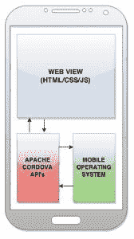
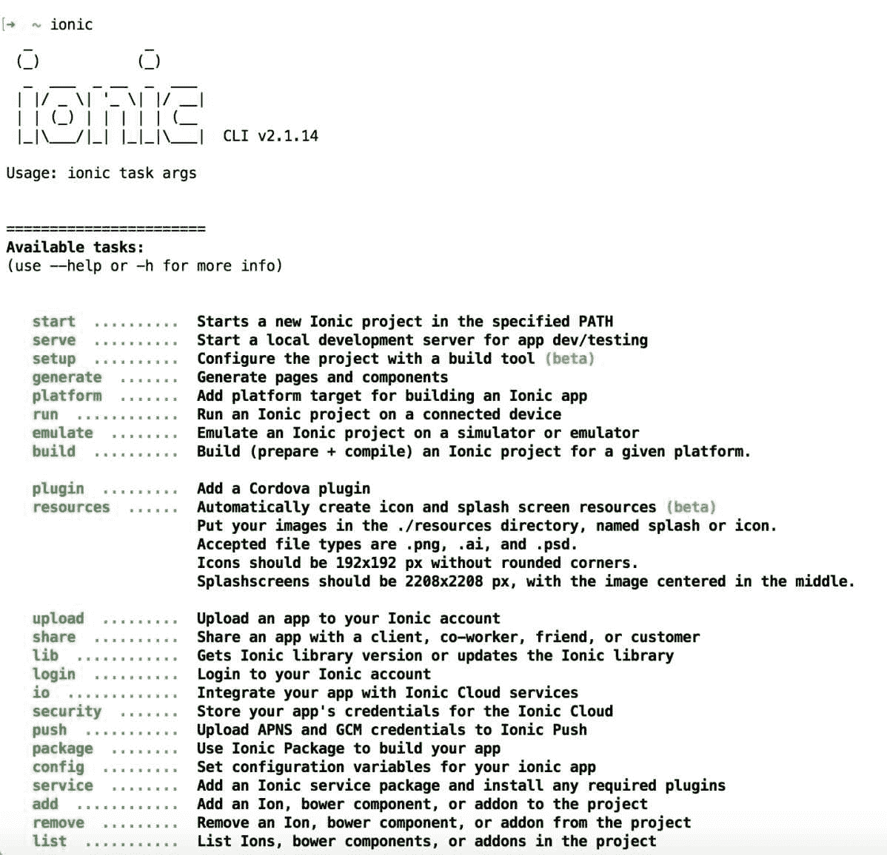
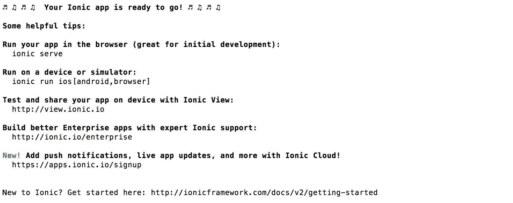
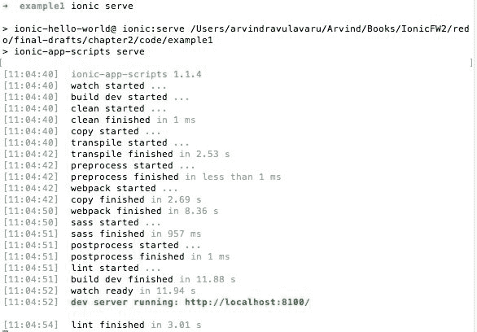
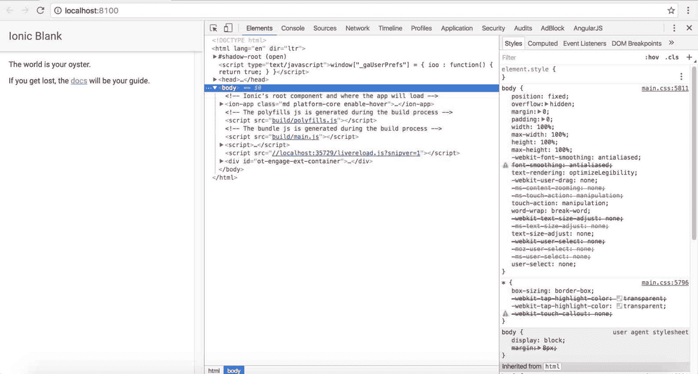
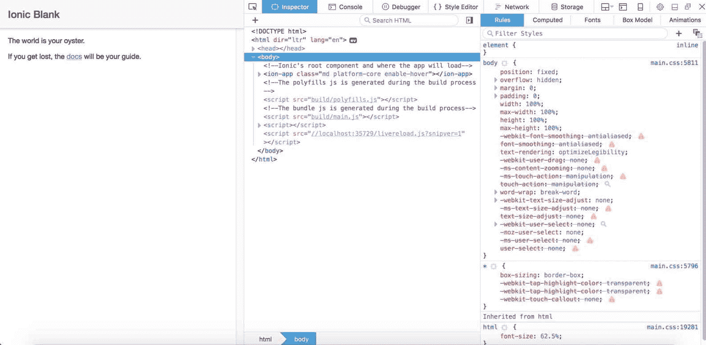

# 欢迎来到离子

在前一章中，我们通过一个例子来介绍 Angular 2。在这一章中，我们将着眼于 Mobile Hybrid 应用的全貌，设置开发 ion 应用所需的软件，最后搭建几个应用并进行探索。

本章涵盖的主题如下:

*   移动混合架构
*   什么是阿帕奇科尔多瓦？
*   什么是离子键？
*   设置开发和运行离子应用程序所需的工具
*   使用离子模板

# 移动混合架构

在我们开始与 ion 合作之前，我们需要了解移动混合开发的更大图景。

这个概念很简单。几乎每一个移动操作系统(当与科尔多瓦一起工作时，也称为平台)都有一个开发应用程序的应用编程接口。这个应用编程接口由一个名为网络视图的组件组成。网络视图通常是在移动应用程序范围内运行的浏览器。这个浏览器运行 HTML、CSS 和 JS 代码。这意味着我们可以使用前面的技术构建网页，然后在我们的应用程序中执行它。

我们可以使用相同的 web 开发知识来构建原生混合移动应用程序(这里，原生是指在设备与资产一起打包后，在设备上安装平台特定的格式文件)，例如:

*   安卓使用安卓应用包(`.apk`)
*   iOS 使用 iPhone 应用存档(`.ipa`)
*   Windows Phone 使用应用程序包(`.xap`)

包/安装程序由一段初始化网页的本机代码和一堆显示网页内容所需的资产组成。

这种在移动应用程序容器中显示由我们的应用程序业务逻辑组成的网页的设置被称为混合应用程序。

# 什么是阿帕奇科尔多瓦？

简单来说，Cordova 是将 web 应用程序和原生应用程序缝合在一起的软件。阿帕奇科尔多瓦网站称:

"Apache Cordova is a platform for building native mobile apps using HTML, CSS and JavaScript."

Apache Cordova 不仅仅是将 web 应用程序与原生应用程序缝合在一起，它还提供了一组用 JavaScript 编写的 API 来与设备的原生特性进行交互。是的，我们可以使用 JavaScript 访问我们的相机，拍一张照片，并通过电子邮件发送。听起来很刺激，对吧？

为了更好地了解正在发生的事情，让我们看一下下面的截图:



正如我们所看到的，我们有一个网页视图，在那里执行 HTML/CSS/JS 代码。这段代码可以是简单的独立用户界面；我们最多是发出一个 AJAX 请求，从远程服务器获取一些数据。或者，这个代码可以做更多的事情，比如与设备的蓝牙通话，获取附近设备的列表。

在后一种情况下，Cordova 有一堆 API，它们使用 JavaScript 与 WebView 接口，然后用其本机语言与设备对话(例如，Java 用于 Android)，因此在这种情况下提供了 Java 和 JavaScript 之间的桥梁。例如，如果我们想更多地了解运行我们应用程序的设备，我们只需要在 JS 文件中编写以下代码并启动应用程序:

```html
var platform = device.platform;

```

安装设备插件后，我们还可以使用 JavaScript 从 WebView 内部访问设备的 UUID、型号、操作系统版本和科尔多瓦版本，如下所示:

```html
var uuid = device.uuid; 
var model = device.model; 
var version = device.version; 
var Cordova = device.Cordova;

```

我们将在[第 6 章](06.html#2SG6I0-9757c8e51afd47e0a7a9ced32db749b8)、*离子原生*中更多的处理科尔多瓦插件。

前面的解释是为了让您了解移动混合应用程序是如何构建的，以及我们如何使用 JavaScript 从网络视图中使用设备功能。

Cordova does not convert the HTML, CSS, and JS code to an OS-specific binary code. All it does is wrap the HTML, CSS, and JS code and execute it inside a WebView.

所以你现在一定已经猜到了，ion 是我们用来构建 HTML/CSS/JS 代码的框架，这些代码在 WebView 中运行，并与 Cordova 对话以访问特定于设备的 API。

# 什么是离子 2？

离子 2 是一个漂亮的开源前端软件开发工具包，用于开发带有 HTML5 的混合移动应用程序。ion 提供移动优化的 HTML、CSS 和 JS 组件，以及用于构建高度交互应用程序的手势和工具。

与联盟中的其他框架相比，ion 2 具有最低的 DOM 操作和硬件加速过渡，因此性能高效。Ionic 使用 Angular 2 作为其 JavaScript 框架。

有了 Angular 在像 ion 2 这样的框架内的强大功能，可能性是无限的(我们可以在 ion 内部使用任何 Angular 组件，只要它在移动应用程序中有意义)。ion 2 与 Cordova 的设备 API 有非常好的集成。这意味着我们可以使用 Ionic Native 访问设备 API，并将其与 ion 漂亮的用户界面组件集成。

爱奥尼亚有自己的命令行界面来搭建、开发和部署爱奥尼亚应用程序。在开始使用离子命令行界面之前，我们需要设置几个软件。

# 离子 3

在本书发行时，最新版本的 ion 是 3。我整理了另一章，叫做《离子 3》(第 11 章)，你可以参考它来了解更多关于离子 3 及其变化的信息。

此外，请注意，本书中的例子在使用离子 3 时仍然有效。可能很少有句法和结构上的变化，但总的主旨应该保持不变。

# 软件设置

现在，我们将设置顺利开发和运行一个离子应用程序所需的所有软件。

# 正在安装 Node.js

由于 Ionic 使用 Node.js 进行命令行界面和构建任务，我们将首先按如下方式安装它:

1.  导航至[https://nodejs.org/](https://nodejs.org/)。

点击主页上的安装按钮，我们的操作系统的安装程序将自动下载。我们还可以导航到[https://nodejs.org/download/](https://nodejs.org/download/)并下载特定的副本。

2.  通过执行下载的安装程序来安装 Node.js。

要验证 Node.js 是否已成功安装，请打开新的终端(`*nix`系统)或命令提示符(Windows 系统)并运行以下命令:

```html
 node -v
 > v6.10.1

```

3.  现在执行以下命令:

```html
 npm -v
 > 3.10.10

```

`npm`是一个**节点包管理器**，我们将使用它来下载我们的离子项目的各种依赖项。

We need Node.js only during the development. The version specified is only for illustration. You may have the same version or the latest version of the software.

# 安装 Git

Git 是一个免费的开源分布式版本控制系统，旨在以速度和效率处理从小型到超大型的所有项目。在我们的例子中，我们将使用一个名为 Bower 的包管理器，它使用 Git 来下载所需的库。此外，离子命令行界面使用 Git 下载项目模板。

要安装 Git，导航至[http://git-scm.com/downloads](http://git-scm.com/downloads)并下载适合您平台的安装程序。成功安装后，我们可以导航到命令提示符/终端并运行以下命令:

```html
git --version

```

我们应该会看到以下输出:

```html
> git version 2.11.0 (Apple Git-81)

```

# 文本编辑器

这是一个完全可选的安装。每个人都有自己喜欢的文本编辑器。在跑了很多文本编辑器之后，我爱上了崇高文本，纯粹是因为它的简单和即插即用包的数量。

If you would like to give this editor a try, you can navigate to [http://www.sublimetext.com/3](http://www.sublimetext.com/3) to download Sublime Text 3.

因为我们将使用 TypeScript 编写 JavaScript 代码，所以微软的 Visual Studio Code 是另一个不错的选择。

If you would like to give this editor a try, you can navigate to [https://code.visualstudio.com/](https://code.visualstudio.com/).

您也可以将 Atom 作为另一种选择。

If you would like to give this editor a try, you can navigate to [https://atom.io/](https://atom.io/).

# 安装类型脚本

接下来，我们将安装 TypeScript 编译器。正如第 1 章 *Angular - A Primer* 中提到的，我们将使用 TypeScript 来编写 JavaScript 代码。要安装 TypeScript 编译器，请运行以下命令:

```html
npm install typescript -g

```

一旦成功安装了 TypeScript，我们可以通过运行以下命令来验证它:

```html
tsc -v
> message TS6029: Version 1.7.5

```

离子 3 发布时的最新版本是 2.2.2。使用 ion 3 时，您可能需要将 TSC 的版本更新到 2.2.2 或更高版本。

# 安装科尔多瓦和离子命令行界面

最后，为了完成离子 2 的设置，我们将安装离子和科尔多瓦命令行界面。离子命令行界面是科尔多瓦命令行界面的包装，具有一些附加功能。

All the code examples in this book use Cordova version 6.4.0, Ionic CLI version 2.1.14, and Ionic version 2.1.17\. But the same should work with latest version of Ionic as well.

要安装离子命令行界面，请运行以下命令:

```html
npm install -g ionic cordova

```

要验证安装，请运行以下命令:

```html
cordova -v
> 6.4.0

```

您也可以运行以下命令:

```html
ionic -v
> 2.1.14

```

您可以运行以下命令来获取有关离子设置的完整信息:

```html
ionic info

Your system information:
Cordova CLI: 6.4.0 
Ionic CLI Version: 2.1.14
Ionic App Lib Version: 2.1.7
ios-deploy version: 1.8.4 
ios-sim version: 5.0.6 
OS: macOS Sierra
Node Version: v6.10.1
Xcode version: Xcode 8.3 Build version 8E162

```

If you see an Ionic CLI version greater than or equal to 2.2.2, you have an Ionic CLI that can work with Ionic 3 apps. Nonetheless, the commands and examples in this book will work the same way.

要了解离子键命令行界面包含的内容，请运行以下命令:

```html
 ionic

```

我们应该会看到任务列表，如下图所示:



There are a few more tasks apart from the ones seen in the preceding screenshot.

我们可以通读任务和解释来了解他们做什么。此外，请注意，截至今天，一些任务仍处于测试阶段。

有了这些，我们已经完成了使用 Ionical 开发应用程序所需的所有软件的安装。

# 站台指南

到本书结束时，我们将构建可以在设备上部署的应用程序。由于 Cordova 将 HTML、CSS 和 JS 代码作为输入，并生成特定于平台的安装程序，因此我们需要在机器上有可用的构建环境。

Android users can follow the instructions in the Android Platform Guide at [http://cordova.apache.org/docs/en/edge/guide_platforms_andr](http://cordova.apache.org/docs/en/edge/guide_platforms_android_index.md.html#Android%2520Platform%2520Guide)[oid_index.md.html#Android%20Platform%20Guide](http://cordova.apache.org/docs/en/edge/guide_platforms_android_index.md.html#Android%2520Platform%2520Guide) to set up SDK on your local machine.
iOS users can follow the instructions in the iOS Platform Guide at [http://cordova.apache.org/docs/en/edge/guide_platforms_ios_index.md.html#iOS%20Platform%20Guide](http://cordova.apache.org/docs/en/edge/guide_platforms_ios_index.md.html#iOS%2520Platform%2520Guide) to set up SDK on your local machine.
You would need an macOS environment to develop iOS apps.

截至目前，Ionic 仅支持安卓 4.0+(虽然也可以在 2.3 上运行)和 iOS 6+移动平台。但是科尔多瓦支持更多。

You can check out the other supported platforms at: [http://cordova.apache.org/docs/en/edge/guide_platforms_index.md.html#Platform%20Guides](http://cordova.apache.org/docs/en/edge/guide_platforms_index.md.html#Platform%2520Guides).

# 你好，爱奥尼亚

现在我们已经完成了软件设置，我们将搭建一些离子应用程序。

ion 有三个主要模板，我们可以使用它们快速开始开发应用程序:

*   空白:这是一个只有一页的空白离子项目
*   选项卡:这是一个使用离子选项卡构建的示例应用程序
*   侧菜单:这是一个示例应用程序，是为使用侧菜单驱动的导航而构建的

为了理解脚手架的基础知识，我们将从空白模板开始。

为了保持我们的学习过程干净，我们将创建一个文件夹结构来处理离子项目。创建名为`chapter2`的文件夹。

接下来，打开一个新的命令提示符/终端，将目录(`cd`)改为`chapter2`文件夹。现在运行以下命令:

```html
ionic start -a "Example 1" -i app.example.one example1 blank --v2

```

上述命令具有以下特征:

*   `-a "Example 1"`:这是人类可读的 app 名称。
*   `-i app.example.one`:这是 app ID/反向域名。
*   `example1`:这是文件夹的名称。
*   `blank`:这是模板的名称。
*   `--v2`:此标志表示项目将采用最新版本的 ion 搭建。这可能会在将来被删除。

参考[附录](12.html#5AMKM0-9757c8e51afd47e0a7a9ced32db749b8)、附加主题和提示，了解更多关于离子启动任务的信息。

说到执行任务，Ionic CLI 非常冗长。从命令提示符/终端可以看到，在创建项目时，打印了大量信息。

首先，从`ionic2-app-base` GitHub 资源库、[https://github.com/driftyco/ionic2-app-base](https://github.com/driftyco/ionic2-app-base)下载`ionic2-app-base`。之后，`ionic2-starter-blank`从[https://github.com/driftyco/ionic2-starter-blank](https://github.com/driftyco/ionic2-starter-blank)的`ionic-starter-blank` GitHub 库中下载。然后安装所有必需的依赖项。

一旦项目成功创建，我们将看到一堆关于如何进一步进行的说明。我们的输出应该如下所示:



为了进一步进行，我们将使用`cd`命令导航到`example1`文件夹。我们不会遵循命令提示符/终端中提供的说明，因为我们还不了解项目设置。一旦我们对 ion 有了一个公平的概念，我们就可以在有了一个新的 ion app——scaffold 之后，开始使用命令提示符/终端输出中的命令。

一旦我们将目录更改为`example1`文件夹，我们将通过给出以下命令来为应用提供服务:

```html
ionic serve

```

这将在端口`8100`上启动一个新的`dev`服务器，然后将在我们的默认浏览器中启动该应用程序。我强烈建议在使用 Ionic 时，将 Google Chrome 或 Mozilla Firefox 设置为默认浏览器。

当浏览器启动时，我们应该会看到空白模板的主页。

如果我们运行`ionic serve`并且端口`8100`已经被占用，爱奥尼亚将在`8101`上启动该应用。

我们还可以使用以下命令在任何其他端口上为离子应用提供服务:

```html
ionic serve -p 8200

```

一旦应用程序成功启动，并且我们已经在浏览器中看到了输出，我们将导航回命令提示符/终端，我们应该会看到类似以下截图的内容:



# 浏览器开发人员工具设置

在我们继续之前，我建议在您的浏览器中按照以下格式设置开发人员工具。

# 谷歌 Chrome

一旦离子应用程序启动，通过在 Mac 上按*命令* + *选项* + *I* 和在 Windows/Linux 上按*Ctrl*+*Shift*+*I*打开开发者工具。然后点击顶部一行中的最后一个图标，靠近关闭按钮，如下图所示:


这将把开发人员工具停靠在当前页面的一侧。拖动浏览器和开发人员工具之间的分界线，直到视图开始类似于手机视图。

如果您单击开发人员工具中的“元素”选项卡，您可以轻松检查页面并一次看到输出，如下图所示:



该视图对于修复错误和调试问题非常有帮助。

# Mozilla Firefox

如果你是 Mozilla Firefox 的粉丝，我们也可以使用 Firefox 实现前面的结果。一旦启动了 Ionic app，在 Mac 上按*命令* + *选项* + *I* ，在 Windows/Linux 上按*Ctrl*+*Shift*+*I*，打开开发者工具(不是 Firebug，火狐的原生开发工具)。然后点击停靠到浏览器窗口一侧的图标，如下图所示:


现在，我们可以拖动分割线来获得与在 Chrome 中看到的相同的结果:



# 离子项目结构

到目前为止，我们已经搭建了一个空白的离子应用程序，并在浏览器中启动了它。现在，我们将走过脚手架工程结构。

如果我们在文本编辑器中打开`chapter2 example1`文件夹，应该会在项目的根目录下看到如下的文件夹结构:

```html
. 
├── config.xml 
├── hooks 
├── ionic.config.json 
├── node_modules 
├── package.json 
├── platforms 
├── plugins 
├── resources 
├── src 
├── tsconfig.json 
├── tslint.json 
├── www

```

以下是每个项目的快速解释:

*   `src`:这是所有开发发生的文件夹。应用程序源代码将放在这里。如果你是从离子 1 到离子 2，这是你会注意到的第一个变化。对我来说，这是对文件夹结构的一个非常好的升级，因为它将开发代码与部署代码分开。
*   `hooks`:该文件夹由执行特定 Cordova 任务时执行的脚本组成。科尔多瓦任务可以是以下任意一种:`after_platform_add`(添加新平台后)`after_plugin_add`(添加新插件后)`before_emulate`(仿真开始前)`after_run`(应用运行前)等等。每个任务都放在一个以科尔多瓦任务命名的文件夹中。
*   `resources`:该文件夹包含基于移动操作系统的各种版本的应用图标和闪屏。
*   `www`:这个文件夹包含构建离子代码，写在`src`文件夹里面。这个文件夹中的所有代码都是为了放在网络视图中。
*   `config.xml`:这个文件包含了 Cordova 在将我们的 Ionic app 转换为平台特定的安装程序时所需的所有元信息。如果打开`config.xml`，会看到一堆描述我们项目的 XML 标签。我们将再次详细查看这个文件。
*   `ionic.config.js`:该文件包含构建任务所需的配置。
*   `package.json`:该文件由项目级节点依赖项组成。
*   `tsconfig.json`:该文件由 TypeScript 配置组成。
*   `tslint.json`:该文件由 TS lint 规则组成。要了解更多关于这些规则的信息，请参考:[https://palantir.github.io/tslint/rules/](https://palantir.github.io/tslint/rules/)。

# config.xml 文件

`config.xml`文件是一个平台无关的配置文件。如前所述，该文件包含了 Cordova 将`www`文件夹中的代码转换为特定平台安装程序所需的所有信息。

`config.xml`文件的设置基于 W3C 打包的网络应用程序(小部件)规范([http://www.w3.org/TR/widgets/](http://www.w3.org/TR/widgets/)，并扩展到指定核心 Cordova API 特性、插件和特定平台设置。我们可以向该文件添加两种类型的配置。一个是全局的，即所有设备通用的，另一个是特定于平台的。

如果打开`config.xml`，我们遇到的第一个标签就是 XML 根标签。接下来，我们可以看到小部件标签:

```html
<widget id="app.example.one" version="0.0.1"  xmlns:cdv="http://cordova.apache.org/ns/1.0">

```

之前指定的`id`是我们 app 的反向域名，我们在搭建的时候提供的。其他规范作为子规范在小部件标签中定义。子标签包括应用程序名称(安装在设备上时显示在应用程序图标下方)、应用程序描述和作者详细信息。

它还包括将`src`文件夹中的代码转换为本机安装程序时需要遵守的配置。

内容标签定义了应用程序的起始页。

访问标签定义了允许在应用程序中加载的网址。默认情况下，它加载所有的网址。

首选项标签将各种选项设置为名称值对。例如，`DisallowOverscroll`描述当用户滚动过文档的开头或结尾时，是否应该有任何视觉反馈。

您可以在以下链接中阅读有关特定平台配置的更多信息:

*   安卓:[http://docs . phone gap . com/en/edge/guide _ platforms _ Android _ config . MD . html #安卓% 20 配置](http://docs.phonegap.com/en/4.0.0edge/guide_platforms_android_config.md.html#Android%2520Configuration)
*   iOS:[http://docs . phone gap . com/en/edge/guide _ platforms _ iOS _ config . MD . html # IOs % 20 配置](http://docs.phonegap.com/en/4.0.0edge/guide_platforms_ios_config.md.html#iOS%2520Configuration)

The importance of platform-specific configurations and global configurations is the same. You can read more about global configuration at [http://docs.phonegap.com/en/edge/config_ref_index.md.html#The%20config.xml%20File](http://docs.phonegap.com/en/4.0.0edge/config_ref_index.md.html#The%2520config.xml%2520File).

# src 文件夹

如前所述，这个文件夹由我们的离子应用程序、HTML、CSS 和 JS 代码组成。如果打开`src`文件夹，会发现如下文件结构:

```html
. . 
├── app 
│   ├── app.component.ts 
│   ├── app.html 
│   ├── app.module.ts 
│   ├── app.scss 
│   ├── main.ts 
├── assets 
│   ├── icon 
├── declarations.d.ts 
├── index.html 
├── manifest.json 
├── pages 
│   ├── home 
├── service-worker.js 
├── theme 
    ├── variables.scss

```

让我们详细看看其中的每一个:

*   `app folder`:app 文件夹由环境特定的初始化文件组成。该文件夹由`@NgModule`模块定义的`app.module.ts`组成。`app.component.ts`由根成分组成。
*   `assets folder`:这个文件夹包含了所有的静态资产。
*   `pages folder:`这个文件夹由我们将要创建的页面组成。在这个例子中，我们已经有了一个名为`home`的示例页面。每个页面都是一个组件，由业务逻辑- `home.ts`、标记- `home.html`和组件相关风格- `home.scss`组成。
*   `theme folder`:该文件夹由`variables.scss`组成，覆盖会改变离子组件的观感。
*   `index.html`:这是一切开始的地方。

我们的空白模板之旅到此结束。在搭建下一个模板之前，让我们快速浏览一下`src/app/app.component.ts`文件。

如您所见，我们正在创建一个新的应用程序/根组件。`@Component`装饰器需要一个`template`或`templateUrl`属性来正确加载离子 2 应用程序。作为模板的一部分，我们添加了`ion-nav`组件。

在类定义里面，我们已经声明了一个`rootPage`并分配给了主页，在构造函数里面，我们有平台就绪回调，当平台就绪的时候会调用。

这是一个非常简单和基本的离子应用。到目前为止，你一定已经完成了与网络相关的 Angular 代码。但是当你在处理离子的时候，你也会处理与设备特性相关的脚本。ion 为我们提供服务，让这些事情以更有组织的方式发生。

# 搭建标签模板

为了对离子命令行界面和项目结构有一个好的感觉，我们还将构建另外两个入门模板。首先，我们将搭建标签模板。

使用`cd`命令，返回`chapter2`文件夹并运行以下命令:

```html
ionic start -a "Example 2" -i app.example.two example2 tabs --v2

```

选项卡项目放置在`example2`文件夹中。使用`cd`命令，转到`example2`文件夹并执行以下命令:

```html
    ionic serve

```

我们应该会看到使用 Ionic 构建的选项卡式界面应用程序，如下图所示:


选项卡位于页面底部。我们将在[第 3 章](03.html#1T1400-9757c8e51afd47e0a7a9ced32db749b8)、*离子组件与导航*、[第 4 章](04.html#2BASE0-9757c8e51afd47e0a7a9ced32db749b8)、*离子装饰与服务*中详细介绍定制。

如果你回到`example2`文件夹，分析项目结构，除了`src` / `pages`文件夹的内容，一切都是一样的。

这次，您将在 pages 文件夹中看到四个文件夹。选项卡文件夹由选项卡定义组成，关于、联系人和个人文件夹由每个选项卡的定义组成。

现在，您可以很好地了解爱奥尼亚如何与 Angular 集成，以及所有组件如何携手并进。当我们处理更多的几个离子，这个结构会更有意义。

# 脚手架侧面菜单模板

现在我们将搭建最终模板。使用`cd`命令，返回`chapter2`文件夹并运行以下命令:

```html
ionic start -a "Example 3" -i app.example.three example3 sidemenu --v2

```

要执行脚手架项目，使用`cd`命令，转到`example3`文件夹并给出以下命令:

```html
ionic serve

```

输出应该类似于下面的截图:


你可以自己分析项目结构，看看有什么不同。

You can run `ionic start -l` or `ionic templates` to view the list of available templates. You can also use the `ionic start task` with the template name from the list to scaffold the app.

# 摘要

在本章中，我们获得了一些关于移动混合架构的知识。我们还了解了混合应用的工作原理。我们看到了科尔多瓦如何将 HTML、CSS 和 JS 代码拼接到一个本地应用程序的 WebView 中执行。然后我们安装了必要的软件，在本地开发离子应用程序。我们使用离子命令行界面搭建了一个空白模板，并分析了项目结构。后来，我们搭建了另外两个模板，并观察了它们的区别。

You can also refer to Ionic slides at [http://ionicframework.com/present-ionic/slides](http://ionicframework.com/present-ionic/slides) for some more information.

在下一章*离子组件和导航*中，我们将了解离子组件以及如何构建一个简单的两页应用程序并在它们之间导航。这将有助于我们使用离子应用编程接口构建有趣的用户界面和多页面应用。