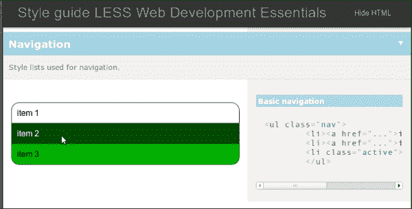
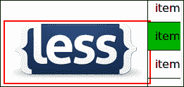
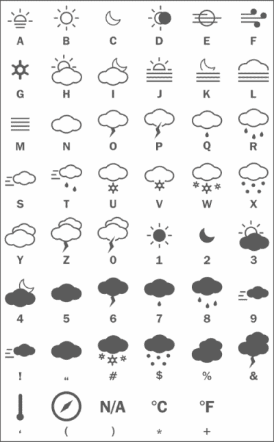

# 四、避免重新发明轮子

在前面的章节中，您学习了如何使用 *Less* 来编译您的 CSS。 *Less* 帮助你创建可重用和可维护的 CSS 代码。您已经学习了如何组织文件，上一章还向您展示了名称空间的作用，以使您的代码可移植。 *Less* 帮助你编写高效的代码来处理浏览器不兼容。 *Less* 本身并不能解决浏览器不兼容的问题，但是可以让你的解决方案可重用，尽管由于这个原因，可重用的 mixins 仍然可能很复杂。在本章中，您将了解到您不必自己编写所有这些复杂的代码。有一些预构建的混合库可以帮助您更快地工作并创建更稳定的代码。

本章将涵盖以下主题:

*   背景渐变
*   防止未使用的代码
*   测试你的代码
*   预建混音的标志性字体
*   视网膜，js

# 重新审视背景梯度

还记得在[第二章](2.html "Chapter 2. Using Variables and Mixins")、*使用变量和混合*中讨论的 CSS3 背景渐变吗？为了在不同的浏览器上显示更好或相同的渐变，您必须使用特定于供应商的规则。不同的规则让你的混音更加复杂。在这种情况下，更复杂也就意味着更难维护。

实际上，一方面，您的 mixin 随着过时的代码或不再受支持的代码而增长，另一方面，您必须为更新的浏览器更新您的 mixin。当然，我们只能希望新的浏览器版本支持 CSS3 规范，而不对代码做任何进一步的修改。

我能使用 T2 吗...网站([http://caniuse.com/](http://caniuse.com/))提供 HTML5、CSS3 和 SVG 支持的兼容表，也提供桌面和移动浏览器的兼容表。它将向您展示大多数当前的浏览器在其当前版本中都支持 CSS 渐变。在写这本书的时候，移动端的安卓浏览器还是依赖`-webkit`厂商规则，Opera Mini 完全不支持。

如果您放弃对旧的浏览器的支持，您的 mixin 可以简化为以下代码片段:

```html
  .verticalgradient(@start-color: black; @end-color: white; @start-percent: 0%; @end-percent: 100%) {
    background-image: -webkit-linear-gradient(top, @start-color @start-percent, @end-color @end-percent);
    background-image: linear-gradient(to bottom, @start-color @start-percent, @end-color @end-percent);
    background-repeat: repeat-x;
 }
```

前面的代码也放弃了对 IE8 和 IE9 的支持。如果你选择支持这些浏览器，你必须添加一个额外的 IE 特定的规则。**我可以用……**网站也给大家展示了最常见浏览器的市场份额。在某些情况下，只为较旧的浏览器提供功能支持，而不期望所有浏览器上的一切看起来都完全相同，这也很有用。例如，没有高级动画的导航结构仍然可以帮助用户在您的站点中导航。使用旧浏览器的人并不总是期待最新的技术。这些技术也不总是有附加值。旧的浏览器大多不运行在最新的硬件上；在这些浏览器上，对渐变等功能的支持只会减慢您的网站速度，而不会增加任何价值。

## 未使用的代码

即使在使用 *Less* 进行长时间运行和成长项目时，也几乎不可能不在代码中发现一些未使用的代码片段。浏览器工具可以帮助您在最终的 CSS 中检测这些未使用的代码。

### Chrome 的开发者工具

谷歌 Chrome 的开发者工具有选项可以找到未使用的 CSS。在谷歌浏览器中，导航至**工具** | **开发者工具**，选择**审核**选项卡，点击**运行**。

现在使用这个工具来测试前面章节中的演示代码。

首先，在浏览器中打开`http://localhost/index.html`并运行测试。您将看到以下截图:


Chrome 开发工具显示的未使用代码

未使用的代码列表从`less/normalize.less`中定义的一长串样式开始，如[第 1 章](1.html "Chapter 1. Improving Web Development with Less")、*用更少的*改进 Web 开发；这些是 **CSS 重置**的样式。

在大多数项目中，相同的 CSS 代码库(相同的文件)用于每个页面。因此，您不能总是保证页面只包含它真正使用的代码。这些代码中的一些不会在每一页上使用，但必须在其他或未来的页面上使用。网页浏览器能够缓存 CSS 文件，因此最好使用相同的 CSS 文件来设置不同网页的样式。有些页面不会使用所有缓存的样式规则，这些规则将在该页面上显示为未使用的代码。缓存代码只加载一次，并在每个页面上使用。CSS 重置似乎对所有页面都很有用，所以您不应该更改或删除它。

你也可以看到，`.centercontent`和`.screen-readeronly`都是不用的。请记住，类是编译到你的 CSS 中的，而 mixins 不是。现在，`.centercontent`和`.screen-readeronly`被定义为类。有一个`.screen-readeronly`类似乎很有用，但是`.centercontent`可以改成混搭。

### Firebug CSS 用法加载项

对于火狐来说， Firebug 有一个插件。这有助于您找到未使用的代码。你可以在[https://addons.mozilla.org/en-US/firefox/addon/css-usage/](https://addons.mozilla.org/en-US/firefox/addon/css-usage/)下载这个插件。

# 测试你的代码

您不必自己编写所有的*减* 代码，因为它是可重用和可移植的。在网上可以找到混合的和片段的*较少的*代码，并在你的项目中使用。搜索*少一些*混合背景渐变，你会得到很多有用的点击。尝试找到支持浏览器并满足您要求的代码。如果你对 mixin 的浏览器支持有任何疑问，可以考虑在 Stackoverflow.com([http://www.stackoverflow.com/](http://www.stackoverflow.com/))上提问。始终显示您的代码和您所做的事情；不要只求解决方案。此外，关于*减去*的其他问题可以在 Stackoverflow.com 询问。

代码片段甚至完整名称空间的集成将使代码测试变得更加重要。

## 了解 TDD

**测试驱动开发** ( **TDD** )是一种行之有效的软件开发方法。在 TDD 中，您为项目中的每一段代码编写测试。在添加或改进功能或重构代码时，所有测试都应该在更改代码后通过。所有测试都应该自动运行。在自动测试 *Less* 和 CSS 代码的同时，需要手动查看页面在不同浏览器和设备中的确切外观，虽然正确性和性能等其他方面可以自动测试。例如，您可以使用诸如**CSS Lint**([http://ccslint.net/](http://ccslint.net/))等工具自动测试您的代码。CSS Lint 验证和测试您的代码，其中包括性能、可维护性和可访问性。这些工具测试的是编译好的 CSS，而不是你的*减*代码。**更少的 Lint Grunt** 插件编译您的*更少的*文件，通过 CSS Lint 运行生成的 CSS，并针对发现的任何 CSS Lint 错误输出违规的*更少的*行。更多信息可以通过访问[https://www.npmjs.org/package/grunt-lesslint](https://www.npmjs.org/package/grunt-lesslint)找到。

## 关于风格指南

一份**风格指南** 给出了你网站元素的监督，比如按钮、导航结构、标题和字体。它以正确的呈现方式和颜色显示元素。为你的项目和网站创建风格指南可以帮助你测试你的 *Less* 代码。样式指南还将帮助您项目的其他开发人员和内容发布者。

你现在可能在想，风格指南确实有用，但也很费时间；因此，下面几节将讨论两种工具。这些工具根据您的*减*(或编译的 CSS)代码自动生成您的样式指南。这两种工具仍然需要一些额外的代码和努力，但不会占用您太多时间。测试你的代码几乎总能得到回报。此外，在这里实现大胜利:你只需要测试你的风格的效果。 *Less* 保证你的 CSS 已经有效，而 *Less* 编译器处理它的优化。正如承诺的那样，它为您的实际设计任务提供了更多的时间。

### 用 StyleDocco 构建风格指南

StyleDocco 从样式表中生成文档和样式指南文档。StyleDocco 也能很好地处理较少的 T2 文件。要使用 StyleDocco 创建样式指南，您必须在您的 *Less* 文件中添加注释。注释应该解释样式的作用，并且包含 HTML 示例代码。评论需要写在**减价**里。Markdown 是一种可以很容易转换成 HTML 的纯文本格式。StackOverflow.com 在帖子和评论中使用了标记。您可以使用其帮助指南了解更多信息；参观[http://www.stackoverflow.com/editing-help/](http://www.stackoverflow.com/editing-help/)就能找到。

StyleDocco 可以使用以下命令安装 **npm** :

```html
npm install -g styledocco

```

您已经在[第 1 章](1.html "Chapter 1. Improving Web Development with Less")*中阅读了关于 npm 的内容，用更少的*来改进网络开发。安装 StyleDocco 后，您必须将标记注释添加到您的 *Less* 文件中。

要查看使用 StyleDocco 生成的样式指南示例，请在文本编辑器中打开`less/nav.less`，并在 Markdown 中添加描述，然后添加 HTML 测试代码，如以下代码片段所示:

```html
/* Construct a navigation structure.

    <ul class="nav">
        <li><a href="#">item 1</a></li>
        <li><a href="#">item 2</a></li>
        <li class="active"><a href="#">item 3</a></li>
    </ul>
*/
```

要构建您的风格指南，请导航到终端中的 *Less* 文件夹(`lessc`)并运行以下命令:

```html
styledocco -n "Less Web Development Essentials Styleguide"  --preprocessor "/usr/local/bin/lessc"  --verbose [file path]

```

在上例中，样式指南的名称用`-n`设置。大多数情况下，如果您的文件路径只包含*较少的*文件，则不必设置`–preprocessor`选项。要为您的 *Less* 文件构建样式指南，命令应该如下所示:

```html
styledocco -n "Less Web Development Essentials Styleguide" less/*

```

`styledocco`命令生成一个名为`docs/`的新文件夹。这个文件夹包含一个`index.html`文件，可以在你的浏览器中打开。最终结果应该如下图所示:


使用 StyleDocco 构建的样式指南示例

### 用 tdcss.js 测试你的代码

`tdcss.js`框架是另一个风格引导工具，与*不太配合*促进了测试驱动开发的使用。`tdcss.js`框架可以在[https://github.com/jakobloekke/tdcss.js](https://github.com/jakobloekke/tdcss.js)从 GitHub 免费下载。另外，更多信息参见[http://jakobloekke.github.io/tdcss.js/](http://jakobloekke.github.io/tdcss.js/)。与 StyleDocco 不同，使用`tdcss.js`不会改变您的*或更少的*文件。您使用项目中的相关源代码片段生成样式指南。您可以使用 HTML 注释风格的编码，例如`<!-- : Navigation -->`，来分离它们。片段被复制并粘贴到一个 HTML 文档中，该文档构成了您的样式指南，并包括来自您的*减*代码和`tdcss.js`的样式。示例导航的 HTML 文档的`head`部分将具有以下结构:

```html
<!-- Your Less code  -->
  <link rel="stylesheet/less" type="text/css" href="less/styles.less" />
  <script type="text/javascript">less = { env: 'development' };</script>
  <script src="less.js" type="text/javascript"></script>

<!-- TDCSS -->
<link rel="stylesheet" href="tdcss/tdcss.css" type="text/css" media="screen">
<script src="http://code.jquery.com/jquery-1.11.0.min.js"></script>
<script src="http://code.jquery.com/jquery-migrate-1.2.1.min.js"></script>

<script type="text/javascript" src="tdcss/tdcss.js"></script>
<script type="text/javascript">
     $(function(){
         $("#tdcss").tdcss();
     })
</script>
```

正文中的标记如下:

```html
<div id="tdcss">
    <!-- # Navigation -->
    <!-- & Style lists used for navigation. -->
    <!-- : Basic navigation -->
       <ul class="nav">
        <li><a href="#">item 1</a></li>
        <li><a href="#">item 2</a></li>
        <li class="active"><a href="#">item 3</a></li>
       </ul>
</div>
```

在浏览器中打开`http://localhost/tdcss.html`查看前面代码的结果。结果应该最后看起来像下面的截图:



用 tdcss.js 构建的样式指南示例

# 预构建的混合蛋白

你已经知道如何在网上搜索和查找混音。然而，使用和重用经过良好测试的 mixins 要容易得多。其他开发人员已经构建了完整的 T2 库和预构建的混搭，你可以在你的项目中使用它们。这些预构建的混搭帮助您编写更少的 T4 代码，而不必考虑使 CSS3 变得复杂的特定于供应商的规则。您将在以下章节中被介绍到五个最常用的库。这些库如下:

*   少元素([http://lesselements.com](http://lesselements.com))
*   less hat([http://leshat . madebyssource . com/](http://lesshat.madebysource.com/)
*   -= =破烂熊乐园倾情奉献= =-本字幕仅供学习交流，严禁用于商业用途
*   无界([http://clearleft.github.com/clearless/](http://clearleft.github.com/clearless/))
*   预引导([http://markodo . com/bootstrap/](http://markdotto.com/bootstrap/)

更全面的 mixin 库列表也可以在[http://lesscss.org/usage/#frameworks-using-less](http://lesscss.org/usage/#frameworks-using-less)找到。

请明白，你不必选择；没有限制您必须只使用这些库中的一个。所有这些库都有优点和缺点；您必须选择最适合您的项目需求的库。

在全球范围内，所有的库都为您提供了一个 *Less* 文件，其中包含了您可以在项目中导入的混音。虽然有些库也有一些设置，但在所有情况下，`@import "{library-name}";`将足以使其 mixins 可用于您的项目。 *Less* 没有包含多个库的限制，但是这样做会给你带来混合名字冲突的问题。所有同名的 mixins 将被编译到 CSS 中(如果它们的参数也匹配的话)。因此，一些库也有这些 mixins 的前缀版本。

如第 3 章、*嵌套规则、操作和内置函数*所述，使用名称空间代替前缀版本，在大多数情况下提供了更稳定的解决方案，如以下代码片段所示:

```html
// create a namespace for {library-name}
#{library-name}{@import "{library-name}";}
```

使用`#{library-name} > mixin()`使混合物可用。

## 对供应商特定的规则使用单行声明，元素较少

少元素也许是本章中讨论的最紧凑的库。紧凑不代表没用。该库的重点是将跨浏览器前缀合并成单一、简洁的声明。

还记得从章节开始的垂直背景渐变吗？您已经看到，当您支持现代浏览器时，您至少需要三个声明，包括特定于供应商的规则。

使用更少的元素，您可以通过带有三个参数的*更少的*代码的单个声明来完成同样的工作，如以下代码片段所示:

```html
element {
.gradient(#F5F5F5, #EEE, #FFF);
      }
```

第一个参数定义了用于不支持渐变的浏览器的回退颜色。渐变从底部到顶部，其中第二个参数设置底部颜色，第三个参数设置顶部颜色。

前面的*减*代码最后会编译成 CSS，如下所示:

```html
  element {
  background: #f5f5f5;
  background: -webkit-gradient(linear, left bottom, left top, color-stop(0, #eeeeee), color-stop(1, #ffffff));
  background: -ms-linear-gradient(bottom, #eeeeee, #ffffff);
  background: -moz-linear-gradient(center bottom, #eeeeee 0%, #ffffff 100%);
  background: -o-linear-gradient(#ffffff, #eeeeee);
  filter: progid:DXImageTransform.Microsoft.gradient(startColorstr='#ffffff', endColorstr='#eeeeee', GradientType=0);
}
```

简单来说，Less Elements 提供了许多有用的混搭来用 **CSS3 技术**构建你的项目。它使用供应商特定的规则为所有 CSS3 属性提供单行声明，并通过布局声明对此进行扩展。

`.columns()`混合将元素分成列，包括边框和列之间的间隙。`.columns()`混合的变量按列宽、列数、列间距、列边框颜色、列边框样式和列边框宽度的顺序排列。

这种混合可以应用于未放置的块级元素(表元素除外)、表单元格和内联块元素，如`body`或`div`元素。

要将一个`div`元素分成三列，宽度为 150 像素，现在可以在 *Less* 中编写以下代码:

```html
div.threecolumns {
 .columns(40px, 3, 20px, #EEE, solid, 1px);
}
```

前面的代码编译成 CSS，如下代码片段所示:

```html
div.threecolumns {
  -moz-column-width: 150px;
  -moz-column-count: 3;
  -moz-column-gap: 20px;
  -moz-column-rule-color: #eeeeee;
  -moz-column-rule-style: solid;
  -moz-column-rule-width: 1px;
  -webkit-column-width: 150px;
  -webkit-column-count: 3;
  -webkit-column-gap: 20px;
  -webkit-column-rule-color: #eeeeee;
  -webkit-column-rule-style: solid;
  -webkit-column-rule-width: 1px;
  column-width: 150px;
  column-count: 3;
  column-gap: 20px;
  column-rule-color: #eeeeee;
  column-rule-style: solid;
  column-rule-width: 1px;
}
```

您也可以通过在浏览器中加载来测试。也请将您的浏览器窗口从小屏幕调整到全屏，以查看默认情况下这些列是否响应。编译后的`.div.threecolumns`类可以与以下 HTML 代码一起使用:

```html
<div class="threecolumns" role="content">Vestibulum at dolor aliquam, viverra ipsum et, faucibus nunc. Nulla hendrerit tellus eu sapien molestie adipiscing. Cras ac tellus sed neque interdum egestas sit amet vel diam. Aenean congue dolor et elit blandit commodo. Pellentesque dapibus tellus eu augue ullamcorper dignissim. Pellentesque pretium a dui a consequat. Curabitur eleifend lectus vel viverra mollis. Sed egestas bibendum tortor mattis fermentum. Suspendisse pellentesque facilisis blandit.</div>
```

前面的代码将导致下面的截图:


使用较少元素的列混合构建的多列布局示例

`.columns()`混合使用 **CSS 多列布局模块**。关于该模块的更多信息可在[http://www.w3.org/TR/css3-multicol/](http://www.w3.org/TR/css3-multicol/)找到。不幸的是，大多数现代浏览器对这个模块的支持还不够好。

少元素不提供任何关于编译好的 CSS 的浏览器支持的信息。在项目中使用较少元素时，您一定已经意识到了这一点。如前所述，您可以在[caniuse.com](http://caniuse.com)网站上查看浏览器支持。要了解哪些浏览器支持这种多列布局模块，您必须访问[http://caniuse.com/multicolumn](http://caniuse.com/multicolumn)。请务必根据项目的要求检查前面的模块。此外，这个例子向您展示了为什么样式指南非常有用。

## Less Hat–一个全面的 mixins 库

不像少元素，**少帽子**是非常全面。在写这本书的时候，Less Hat 包含 86 个预构建的混合。少帽和 CSS 帽也有很强的关系。CSS 帽是一个商业授权工具，可以将 Adobe Photoshop 图层转换为 CSS。

少帽混搭提供了禁用某些特定于浏览器的前缀的可能性。除非你有非常充分的理由，否则你不应该使用它。默认情况下，Less Hat 通过将 *Less* 变量设置为`true`来使用所有浏览器前缀，如下代码所示:

```html
@webkit: true;
@moz: true;
@opera: true;
@ms: true;
@w3c: true;
```

在前面的代码中，`@w3c`是指定义由 **W3C 规范**描述的标准属性名称的非固定规则。Less Hat 宣称自己拥有混合元素，可以创建无限数量的阴影、渐变和动画。**框影** 就是一个例子。少了帽子，盒影混合可以写成`.box-shadow(<offset-x> <offset-y> spread blur-radius color inset, …)`。

要尝试前面的`.box-shadow`混搭，可以用*Less*Less Hat 写如下:

```html
div {
 .box-shadow(30px 30px 5px green inset,-30px -30px 5px blue inset);
}
```

前面的代码编译成下面的代码片段:

```html
div {
  -webkit-box-shadow: 30px 30px 5px #008000 inset, -30px -30px 5px #0000ff inset;
  -moz-box-shadow: 30px 30px 5px #008000 inset, -30px -30px 5px #0000ff inset;
  box-shadow: 30px 30px 5px #008000 inset, -30px -30px 5px #0000ff inset;
}
```

要检查这个，在浏览器中打开`http://localhost/boxshadow.html`，你会看到`.box-shadow`融合的结果，如下图截图所示:


无帽盒子阴影混合效果示例

事实上，少元素的`.box-shadow()`混合不接受多个阴影，但是 3L 的混合，在下一节中讨论，使用逗号分隔的多个阴影工作。

## 使用预先构建的 3L 混合蛋白库

**3L** ( **爱得少的多**)是另一个预建混音的集合。除了标准的单行声明，3L 还提供了一些额外的东西。3L 为 CSS 重置或规范化提供了混搭，正如前面在[第 1 章](1.html "Chapter 1. Improving Web Development with Less")、*中讨论的那样，用更少的*改进网页开发。您可以调用这些 mixins，而无需将它们放在选择器块中，如下所示:

```html
.normalize();

/* OR */
.reset();

/* OR */
.h5bp();
```

在前面的`.h5bp()`重置中，你的 CSS 是基于 **HTML5 模板**的。HTML5 样板文件是一个专业的前端模板，用于构建快速、健壮和适应性强的网络应用或网站。您可以通过访问[http://html5boilerplate.com/](http://html5boilerplate.com/)找到更多关于样板文件的信息。3L 不仅为 HTML5 样板的重置提供了一个混合，而且还包含了 HTML5 样板的助手类的混合。这些 mixin 包含一个 clearfix 和 mixin，用于浏览器或屏幕阅读器的隐藏内容。

例如，`.visuallyhidden()`可以被用来隐藏浏览器的内容，但是让屏幕阅读器可以看到这些内容。

### SEO 和 HTML 调试

**SEO** ( **搜索引擎优化**)在现代网页设计中扮演着的重要角色。正确有效的 HTML5 是 SEO 的要求。此外，设置适当的标题，使用元标签的关键词，以及描述和图像 alt 属性将有助于您的网站排名更高。

3L 的`.seo-helper()`混搭可以让你快速洞察网页缺失的元素和属性。

要使用此混音，在导入 3L 后，您可以在*减*中编写，如下所示:

```html
html {
.seo-helper();
}
```

使用`.seo-helper()`混合后，您的 HTML 页面将包含关于缺少标题或元标签的警告，并在缺少 alt 属性的图像周围显示红色边框，如下图所示:



3L 的助手类使丢失的 alt 属性可见

此外，请访问`http://localhost/indexseo.html`了解更多关于该课程如何运作的信息。在这之后，你可以自己判断这门课是否有用。与您的判断无关，`.seo-helper()` mixin 向您展示了 *Less* 如何应用于网站风格以外的功能。

## ClearLess–另一个预构建混合蛋白库

【ClearLess 也和 HTML5 样板有关系。就像 3L 一样，ClearLess 为 HTML5 样板和助手类提供了混合。除此之外，ClearLess 还利用了 **Modernizr** 。Modernizr 是一个 JavaScript 库，可以检测用户浏览器中的 HTML5 和 CSS3 特性。Modernizr 为您的 HTML 的`html`元素添加了额外的类来检测特征。有了 Modernizr，您的`html`元素看起来将如下面的代码片段所示:

```html
<html id="modernizrcom" class="js no-touch postmessage history multiplebgs boxshadow opacity cssanimations csscolumns cssgradients csstransforms csstransitions fontface localstorage sessionstorage svg inlinesvg no-blobbuilder blob bloburls download formdata wf-proximanova1proximanova2-n4-active wf-proximanova1proximanova2-i4-active wf-proximanova1proximanova2-n7-active wf-proximanova1proximanova2-i7-active wf-proximanovacondensed1proximanovacondensed2-n6-active wf-athelas1athelas2-n4-active wf-active" lang="en" dir="ltr">
```

这个类名列表告诉你一个特性是否可用。因此，用于生成上述代码的浏览器提供了对框阴影、不透明度等的支持。有了 Modernizr，你将有条件类可以在你的 *Less* 代码中使用。而且，ClearLess 利用了这些类。

除了 Modernizr 混搭，ClearLess 还有图标混搭和 **CSS 精灵图像**。

CSS 精灵图像是一种至少可以追溯到七年前的技术。一个网站的图片被添加到一个单一的图片，精灵。如果浏览器请求图像，精灵将被加载为背景图像。**精灵**([http://spriteme.org/](http://spriteme.org/))可以帮助你为你的项目创建精灵。CSS 用于显示请求的包含部分精灵的图像。加载一个可以缓存的大精灵，而不是几个小图像，将减少浏览器显示页面所需的 HTTP 请求数量。HTTP 请求越少，页面加载越快。

要演示这一点，请使用本章代码包(`less-sprite.png`)中 *Less* 图像的简单精灵，如下图所示:


简单精灵图像的示例

要使用精灵图像，您可以将它写在*减去*如下:

```html
#clearless {
@import "clearleft-clearless-63e2363/mixins/all.less";
@sprite-image: "img/less-sprite.png";
@sprite-grid: 80px; //image height
}

.logo {
    #clearless > .sprite-sized(0,0,200px,80px);
    &:hover {
    #clearless > .sprite-sized(0,1,200px,80px);
    }
}
```

该代码也可在`less/sprite.less`中获得。请注意`#clearless`命名空间有自己的范围，所以`@sprite-grid`和`@sprite-grid`应该在命名空间内部定义。变量通过重新声明来设置。

前面代码的编译后的 CSS 如下所示:

```html
.logo {
  background-image: url("img/less-sprite.png");
  background-repeat: no-repeat;
  background-position: 0px 0px;
  width: 200px;
  height: 80px;
}
.logo:hover {
  background-image: url("img/less-sprite.png");
  background-repeat: no-repeat;
  background-position: 0px -80px;
  width: 200px;
  height: 80px;
}
```

加载`http://localhost/index.html`查看前面代码的效果。

最后，应该提到的是，ClearLess 定义了一些混合来构建网格。这些混音将在下一节中向您解释，因为它们是从 **Preboot** 中采用的。

## 为您的项目使用 Preboot 的预构建混合

Preboot 最初由 Mark Otto ( `@mdo`)编写，是一个全面且灵活的 *Less* 实用程序集合。Preboot 是推特**自举**的前身。Bootstrap 是一个前端框架，用于在网络上开发响应迅速、移动优先的项目。您将在[第 6 章](6.html "Chapter 6. Bootstrap 3, WordPress, and Other Applications")、 *Bootstrap 3、WordPress 和其他应用*中了解更多关于 Bootstrap 的信息。Bootstrap 改进了原始的 Preboot 代码。最后，许多来自 Bootstrap 的*减*变量和混合改进在 Preboot 2 中又回来了。

Preboot 自带 mixins 来构建网格系统，因为它与 Bootstrap 有关系。这个网格系统创建了一个包含 12 列的行。在浏览器中打开下载的代码包中的`http://localhost/prebootgrid.html`，看到一个两行的例子。第一个网格行包含三列，第二行包含两列。默认情况下，此网格是响应性的；通过使用示例网格缩小浏览器窗口，您可以看到这一点。如果屏幕宽度小于 768 像素，网格中的列将相互堆叠，而不是水平排列。下面的代码示例只显示了编译后的 CSS，而没有响应类。

使用 Preboot，您可以在 *Less* 中编写以下代码:

```html
.col-a-half { 
.make-column(6); 
}
```

前面的代码编译成 CSS 如下(无响应):

```html
.col-a-half {
  min-height: 1px;
  padding-left: 15px;
  padding-right: 15px;
  -webkit-box-sizing: border-box;
  -moz-box-sizing: border-box;
  box-sizing: border-box;
  float: left;
  width: 50%;
}
```

在[第 5 章](5.html "Chapter 5. Integrate Less in Your Own Projects")、*在你自己的项目中少集成*中，你会发现另一个利用 Preboot 网格的例子，并更详细地讨论它的响应特性。

预引导设置一些变量来定义网格，如下面的代码片段所示:

```html
// Grid
// Used with the grid mixins below
@grid-columns:          12;
@grid-column-padding:   15px; // Left and right inner padding
@grid-float-breakpoint: 768px;
```

此外，基本颜色等其他值的预定义如下:

```html
// Brand colors
@brand-primary:           #428bca;
@brand-success:           #5cb85c;
@brand-warning:           #f0ad4e;
@brand-danger:            #d9534f;
@brand-info:              #5bc0de;
```

事实上，Preboot 并不是一个完整的 CSS 框架；另一方面，它不仅仅是一个预构建的 mixins 库。

# 使用 Less 将其他技术集成到您的项目中

除了预先构建的混搭，还有一些其他的技术可以使用 *Less* 轻松集成到您的项目中。

## 使用图标字体

顾名思义，图标字体是定义为一种字体的一组图标。图标字体可以替换项目中的图像图标。使用图标字体而不是图像的主要原因以及这里讨论它们的原因是图标字体，就像任何普通字体一样，可以用 CSS 完全操纵。在您的项目中，您可以使用*减去*来设置所用图标字体的大小、颜色和阴影。使用图标字体的主要原因是为了缩短网站的加载时间；只需要一个 HTTP 请求就可以加载它们。图标字体在不同分辨率和显示器上也会很好看。

在本书中，图标字体已经在[第 3 章](3.html "Chapter 3. Nested Rules, Operations, and Built-in Functions")、*嵌套规则、操作和内置函数*中使用。在这些例子中，字体 Awesome 是从 CDN 加载的。Font Awesome 还在[https://GitHub . com/FOrtawesome/Font-Awesome/tree/master/Less](https://github.com/FortAwesome/Font-Awesome/tree/master/less)上提供了一包来自 GitHub 的 *Less* 文件。通过执行以下步骤，您可以使用这些文件在项目中集成 Font Awesome:

1.  将`font-awesome/`目录复制到您的项目中。
2.  打开项目的`font-awesome/less/variables.less`文件，编辑`@fa-font-path`变量，指向你的字体目录`@fa-font-path: "../font";`。
3.  在你的主*少*文件`@import "font-awesome-4.0.3/less/font-awesome.less";`中导入字体牛逼*少*文件。

执行上述步骤后，您可以在 HTML 文档中使用以下代码片段:

```html
<ul class="fa-ul">
  <li><i class="fa-li fa fa-check-square"></i>List icons (like these)</li>
  <li><i class="fa-li fa fa-check-square"></i>can be used</li>
  <li><i class="fa-li fa fa-spinner fa-spin"></i>to replace</li>
  <li><i class="fa-li fa fa-square"></i>default bullets in lists</li>
</ul>
```

前面的代码在您的 web 浏览器中打开时，将产生以下屏幕截图:


带有字体超赞项目的 HTML 列表

你会在可下载文件的`less/font-awsome.less`中找到前面 HTML 列表的 *减*代码。请检查这个文件。你会看到设置`@fa-font-path`不需要改变 Font Awesome 的原始文件。`@fa-font-path`变量将通过重新声明进行设置，并使用最后一次声明获胜规则，如之前在[第 2 章](2.html "Chapter 2. Using Variables and Mixins")、*使用变量和混合*中所述。

你可以通过访问[http://fontawesome.io/examples/](http://fontawesome.io/examples/)找到更多字体牛逼用法的例子。

另外，其他标志性字体如 Bootstrap 的 glyphicon 可以搭配 *Less* (参见[https://github . com/twbs/Bootstrap/blob/master/Less/glyphicon . Less](https://github.com/twbs/bootstrap/blob/master/less/glyphicons.less))。但是，如果您发现图标字体没有 *Less* 文件，您现在有足够的知识自己创建所需的 *Less* 代码。

尝试编写所需的 *Less* 代码以将 Meteocons([http://www.alessioatzeni.com/meteocons/](http://www.alessioatzeni.com/meteocons/))作为练习集成到您的项目中，或者执行以下步骤:

1.  首先从[http://www . alessioatzeni . com/meteo con/RES/download/meteo con-font . zip](http://www.alessioatzeni.com/meteocons/res/download/meteocons-font.zip)下载字体。
2.  在这个 zip 文件中，您将找到四个文件:`meteocons-webfont.eot`、`meteocons-webfont.svg`、`meteocons-webfont.ttf`和`meteocons-webfont.woff`。这些是在不同浏览器中显示气象卫星所需的不同格式。
3.  将这些文件复制到项目的`fonts/`文件夹中。您还会发现这些字体文件中包含`stylesheet.css`。该文件包含气象卫星的`@fontface`风格。如果你检查字体牛逼*少*文件，你会发现同样的风格。`@fontface`声明需要使用您项目中的字体。

现在，你应该还记得“少帽”预建混音。少帽有前脸融合，`.font-face(@fontname, @fontfile, @fontweight:normal, @fontstyle:normal)`。

使用此字体混合，您可以将以下代码添加到您的*减*代码中:

```html
#lesshat {@import "lesshat/lesshat.less";}

@font-face {
#lesshat > .font-face("Meteocons", "../fonts/meteocons-webfont");
}

[data-icon]:before {
        font-family: 'Meteocons';
        content: attr(data-icon);
}
```

前面的代码将编译成 CSS，如下所示:

```html
@font-face {
  font-family: "Meteocons";
  src: url("../fonts/meteocons-webfont.eot");
  src: url("../fonts/meteocons-webfont.eot?#iefix") format("embedded-opentype"), url("../fonts/meteocons-webfont.woff") format("woff"), url("../fonts/meteocons-webfont.ttf") format("truetype"), url("../fonts/meteocons-webfont.svg#Meteocons") format("svg");
  font-weight: normal;
  font-style: normal;
}
[data-icon]:before {
  font-family: 'Meteocons';
  content: attr(data-icon);
}
```

前面的 CSS 代码使您能够使用下面的 HTML 代码:

```html
<a href="" data-icon="A">Link</a>
```

前面的 HTML 代码看起来像下面的截图:


与 metrocon 的超链接

之前，您已经看到了如何通过类名添加字体棒极了的图标。要将这一功能添加到 Meteocons 中，您必须编写一些*减*代码。下图显示了该字体每个图标的字母:



字体大图

现在，为每个图标添加一个类声明到您的*减*代码中，如下所示:

```html
. meteocons-sun               { &:before { content: "\2a"; } }
```

在上例中，`.meteocons-sun`是你的类名，`\2a`代表相似字符的十六进制值。2A 十六进制是十进制 42，`*`(星号)的 ASCII 值是 42。除了十六进制值，您还可以使用八进制或十进制(前 128 个可打印字符)。有时候，unicode 的`\u`是前置的，比如前面代码中的`\u002a`。

如果添加了这些类声明，您的列表将看起来像下面的代码片段:

```html
.mc-light-sunrise:before {
  content: "\0041";
}
.mc-light-sunshine:before {
  content: "\0042";
}
.mc-light-moon:before {
  content: "\0043";
}
.mc-light-eclipse:before {
  content: "\0044";
}
and so on
```

现在，您已经具备了图标字体的基本知识，并且可以扩展您的代码。例如，添加以下代码来设置字体的大小:

```html
.mc-2x { font-size: 2em; }
.mc-3x { font-size: 3em; }
.mc-4x { font-size: 4em; }
.mc-5x { font-size: 5em; }
```

在本章的下载部分，你会发现完整的 *Less* 代码可以像`less/meteocons`中的 Font Awesome 一样使用 Meteocons。如您所见，Font Awesome 的大部分代码都可以重用。请访问`http://localhost/indexmeteo.html`了解如何使用该代码。

## 视网膜. js

高密度设备每英寸或厘米的像素比普通显示器多。苹果为其双密度显示器引入了术语**视网膜**T3。如果放大图像(或放大图像)，图像会变得模糊。这是网页设计师在设计高密度设备时必须解决的问题。你可能想知道这和 *Less* 有什么关系。CSS 结合媒体查询(您将在[第 5 章](5.html "Chapter 5. Integrate Less in Your Own Projects")、*在自己的项目中少集成*中了解更多关于媒体查询的内容)，可以防止您的图像在高密度显示器上变得模糊。

要理解发生了什么，你必须意识到 CSS 像素实际上是设备无关的。CSS 像素用于给浏览器中的元素赋予物理尺寸。在普通屏幕上，一个 CSS 像素匹配一个设备像素。高密度显示器的设备像素比 CSS 像素多；以 Retina 为例，它们的像素数量是前者的四倍。越来越小的像素使得人眼无法看到单个像素，应该会带来更好的用户体验。

视网膜显示 300 CSS 像素宽度的图像，需要 600 个设备像素才能保持相同的物理大小。现在，您可以通过使用更高分辨率的位图(CSS 像素)并使用 HTML 或 CSS 缩小它来防止图像模糊。

在正常显示中，您的 HTML 将如下所示:

```html

```

在视网膜显示器上，您将显示与以下代码片段相同的图像:

```html

```

目前有一种惯例是在高密度图像的名称中加入`@2x`，比如`example@2x.png`。

你现在应该明白了，你可以使用 *Less* 来编写高效的代码，给这些不同的图像赋予正确的 CSS 维度。`retina.js`库([https://github.com/imulus/retinajs](https://github.com/imulus/retinajs))帮助你处理高密度图像和显示；它结合了 JavaScript 和 *Less* 来编写你的 Retina 代码。

对于普通图像，您必须使用以下代码片段:

```html

```

前面的代码将由 JavaScript 处理，但是您必须使用 *Less* 来设置您的背景图像。这里的背景不仅指页面背景，还指 CSS 设置的每一个背景。大多数现代设计使用背景图像进行布局；此外，辅助功能规则要求 CSS 设置装饰图像。

有了`retina.js`，可以在*少*写下以下代码:

```html
.logo {
  .at2ximg/my_image.png', 200px, 100px);
}
```

前面的代码将编译成如下的 CSS:

```html
.logo {
  background-image: urlimg/my_image.png');
}

@media all and (-webkit-min-device-pixel-ratio: 1.5) {
  .logo {
    background-image: urlimg/my_image@2x.png');
    background-size: 200px 100px;
  }
}
```

此外，前面提到的其他预构建 mixin 库将使用 mixin 来设置 Retina 背景。

# 总结

在本章中，您已经学习了如何保持代码干净，并使用样式指南进行测试。您已经学习了如何使用带有预构建混合的库，这有助于您更快、更安全地开发您的 *Less* 代码。最后但同样重要的是，您已经学会了如何使用 *Less* 和图标字体，并使您的项目视网膜就绪。

在下一章中，你将学习如何将 *Less* 整合到你的项目中，或者用 *Less* 从头开始一个项目。您还将学习如何组织项目文件和重用旧的 CSS 代码。最后，您将使用媒体查询构建一个响应网格。