# Flexbox，第 2 部分

让我们继续探索 flexbox 及其提供的功能。现在，您应该掌握了一些基本知识，因此在本章中，我们将继续构建一个新的部分，即您在下面看到的产品列表，以获得一些使用 flexbox 构建产品的实际经验:


我们还将讨论使用 flexbox 时需要添加什么前缀，以及如何以最简单的方式添加前缀。

我们将讨论以下主题:

*   使用 flexbox 构建新分区
*   使用弹性换行和对齐内容
*   更改弹性项的显示顺序
*   处理供应商前缀

# 构建产品列表

让我们用 flexbox 构建一个产品列表。我们将通过创建产品列表来看看 flexbox 还能做些什么。我们将探索两个新的 flexbox 属性:`align-items`和`align-self`。

# 使用对齐项目

为了构建产品列表，我们将从页脚正上方的一些新标记开始:

```html
<!-- 
===============
Product Listing
===============
-->
<section class="secondary-section grouping">
    <ul class="wrapper product-list">
        <li class="product-list-item">
            <figure>
                
            </figure>
            <h2>The Octopus</h2>
            <p>Lorem ipsum dolor sit.</p>
            <a href="#" class="button">Tenticals &raquo;</a>
        </li>
        <li class="product-list-item">...</li>
        <li class="product-list-item">...</li>
        <li class="product-list-item">...</li>
        <li class="product-list-item">...</li>
        <li class="product-list-item">...</li>
    </ul><!-- end wrapper -->
</section>
<!-- 
================ 
Footer
================
--> 
```

有相当多的标记，但不是很复杂。有一个无序列表，有六个列表项(`<li>`标签)。每个列表项都有一个 SVG 图像(`<figure></figure>`)、一个标题(`<h2>`)、一个段落(`<p>`)和一个锚点(`<a>`)。在前面的代码片段中，除了第一个，我省略了所有列表项的核心。

我们也从引导这一部分的一些 CSS 开始:

```html
/****************
Product Listing
****************/
.product-list-item {
  border-bottom: 1px solid #766e65;
}
.product-list-item figure {
  width: 50px;
  margin-right: 20px;
}
.product-list-item h2 {
  margin: 0;
}
.product-list-item p {
  margin: 0;
}
.product-list-item .button {
  transform: scale(1);
  width: 130px;
}
```

以下是我们在产品列表中开始的内容:

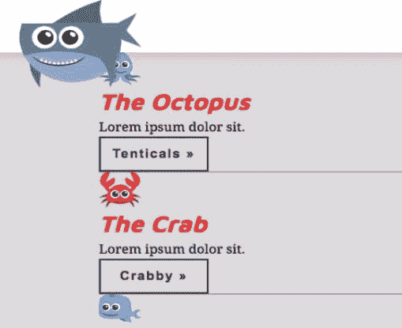

我们希望每个列表项的内容水平排列。我们可以针对类，`product-list-item`，使用`display: flex`:

```html
.product-list-item {
  border-bottom: 1px solid #766e65;
 display: flex;
}
```

该规则集针对 6 个不同的`li`标签，类别为`product-list-item`。这很重要，因为我们有六个不同的 flex 容器。添加`display: flex`应该在每个伸缩容器中横向布局所有不同的伸缩项目。因为 flexbox 就是这么做的。默认情况下`flex-direction`是`row`，所以一切都是按顺序排列的:


好吧，看来情况不妙。我们可以做的一件事是将值为`250px`的`flex-basis`添加到`h2`中:

```html
.product-list-item h2 {
  margin: 0;
  flex-basis: 250px;
}
```

这应该会增加一些组织的外表，确实如此:


现在，让我们使用自动边距将按钮与最右边对齐:

```html
.product-list-item .button {
  transform: scale(1);
  width: 130px;
 margin-left: auto
}
```

回顾我们在上一节学到的内容，`margin-left: auto`将自动计算按钮左侧的边距量，并一直推到最右侧。这样好多了，但是事情还是有点紧张:


让我们用一个名为`align-items`的新属性来解决这个问题。所以这些按钮离得太近了，这一段显得很高。我们希望图像、标题、段落和按钮都垂直居中。`align-items`是一个可以在柔性容器上使用的属性，用于控制柔性项目沿横轴的位置。下面的图表再次提醒我们当`flex-direction`设置为`row`时横轴的走向:


如我们所见，`flex-direction`为行时横轴自上而下。我们将添加值为`center`的`align-items`。除非我们增加一个`80px`的`height`，否则这真的不会有太大的效果。让我们也这样做:

```html
.product-list-item {
  border-bottom: 1px solid #766e65;
  display: flex;
 align-items: center;
 height: 80px;
}
```

所以，使用`align-items: center`将项目排列在横轴的中间:

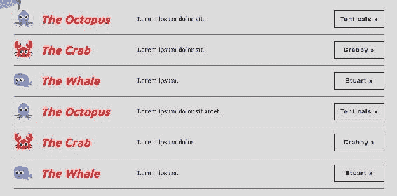

好吧，还不错！我们所有的 flex 项目都垂直居中，只有一个属性，每个项目都有不同的高度。还有，我要注意的是`align-items`的默认值是`stretch`，强制伸缩项从横轴开始拉伸到横轴结束。这就是 flexbox 标配等高度立柱的原因。

我们也可以使用`flex-start`，它将所有的 flex 项与 flex 容器的顶部或横轴的起点对齐:

```html
.product-list-item {
  border-bottom: 1px solid #766e65;
  display: flex;
  align-items: flex-start;
  height: 80px;
}
```

以下是前面代码的输出:


让我们试试`flex-end`，它会将所有的伸缩项——你猜对了——对齐到横轴的底部或末端:

```html
.product-list-item {
  border-bottom: 1px solid #766e65;
  display: flex;
  align-items: flex-end;
  height: 80px;
}
```

我们的伸缩项现在与横轴的末端对齐，即底部:


让我们把这个改回`center`:

```html
.product-list-item {
  border-bottom: 1px solid #766e65;
  display: flex;
 align-items: center;
  height: 80px;
}
```

现在让我们回到我们的三列；我们的图像和标题向左对齐仍有问题，我们希望它们居中:

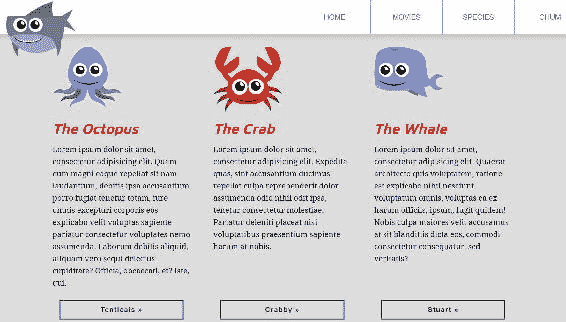

让我们看看当`flex-direction`设置为`column`时，我们如何使用`align-items`来集中我们的海洋生物和头条新闻。在这个用例中，横轴水平运行。


这是个好消息。由于`align-items`用于在横轴上对齐，横轴为`flex-direction: column`，这应该会使我们的海洋生物图像和标题居中。

请记住，每个`.column`都是`.columns`的一个伸缩项，但也有自己的伸缩项的伸缩容器。那些柔性物品是像海洋生物图像、标题、段落和按钮这样的东西。所以每个列都是自己的 flex 容器。我们可以用`align-items: center`:

```html
/****************
3 columns
****************/
.columns {
  display: flex;
  justify-content: space-between;
}
.column {
  flex-basis: 30%;
  display: flex;
  flex-direction: column;
  justify-content: flex-start;
 align-items: center;
}
.column figure {
  max-width: 50%;
  flex-basis: 150px;
}
.column .button {
  margin-top: auto;
}
```

所以我们的结论是:

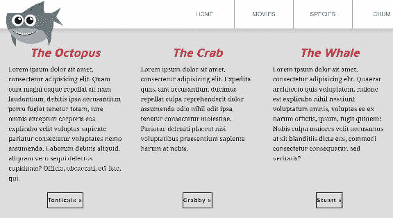

东西是居中的，比如标题和底部的按钮，但是我们的海洋生物图像已经完全消失了，我们的按钮也缩小了。让我们一次解决一个问题，从思考我们的海洋生物为什么会消失开始。让我们检查一下海洋生物的大致位置，找到图像:


在开发工具中检查容纳`img`元素的`figure`元素显示宽度为 0，高度为 150。那么，如果我们有这个 CSS，为什么宽度会是 0 呢？

```html
.column figure {
  max-width: 50%;
  flex-basis: 150px;
}
```

嗯，我们对这些奇异值没有明确的`width`设置。我们有一套`max-width`但是那真的不需要宽度。回想一下`max-width`只是说“永远不要超过 x 个像素”，但并没有强制任何低于该阈值的宽度。而我们`150px`的`flex-basis`是控制高度的，因为`flex-direction`是`column`。我们从来没有设定真正的宽度。当我们设置`align-items: center`时，它会强制元素只占用它们需要的宽度或高度，就像您将`float`块级元素添加到`left`或`right`一样。此外，SVG 在图像世界中是独一无二的。像巴布亚新几内亚和 JPG 这样的传统图像已经设置了尺寸，即使 CSS 中没有指定。SVG 的，因为他们可以扩展到任何大小，没有基线大小。由于`figure`或`img`从来没有设置任何宽度或高度，`align-items`属性会将宽度挤压为 0，这就是为什么它们在我们身上消失了。

这很容易修复；我们只需添加一个`width`。让我们把它做得比以前更小一点，大约 50%的容器:

```html
.column figure {
  max-width: 50%;
  flex-basis: 150px;
 width: 50%;
}
```

我们的海洋生物回来了！


底部的按钮和我们刚刚看到的图片有同样的问题；它们没有任何`padding`或`width`设置，所以`align-items`强制宽度只能和内容一样宽，因此它们看起来都很挤和小。

对此的解决方法是一样的:只要设置一个`width`。在这种情况下，让`width`成为`90%`:

```html
/****************
3 columns
****************/
.columns {
  display: flex;
  justify-content: space-between;
}
.column {
  flex-basis: 30%;
  display: flex;
  flex-direction: column;
  justify-content: flex-start;
  align-items: center;
}
.column figure {
  max-width: 50%;
  width: 50%;
  flex-basis: 150px;
}
.column .button {
  margin-top: auto;
 width: 90%;
}
```

这解决了这个问题:

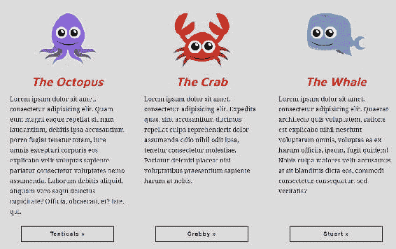

# 使用自对齐弹性框属性

看起来不错，但是如果我不想让所有的 flex 项目都居中呢？我可能更喜欢`h2`和`flex-start`对齐(事实上我喜欢)。`align-items`是在伸缩容器上使用的属性，用于控制所有伸缩项目的横轴对齐。另一个称为`align-self`的 flexbox 属性控制沿横轴的对齐，但它是一个直接用于 flex 项目的属性。这将有助于我们仅将我们的`h2`向左对齐。

让我们为`h2`创建一个新的选择器，并添加`align-self: flex-start`:

```html
/****************
3 columns
****************/
.columns {
  display: flex;
  justify-content: space-between;
}
.column {
  flex-basis: 30%;
  display: flex;
  flex-direction: column;
  justify-content: flex-start;
  align-items: center;
}
.column figure {
  max-width: 50%;
  width: 50%;
  flex-basis: 150px;
}
.column h2 {
 align-self: flex-start;
}
.column .button {
  margin-top: auto;
  width: 90%;
}
```

Note that `align-self` is a property only for flex items; its default value is `auto`, which means tells it to check the value of `align-items` for cross axis alignment. It also accepts `stretch`, `flex-start`, `flex-end`, `center`, and `baseline`. It allows us to override the `align-items` value for a single flex item.

如果我们现在刷新浏览器，我们会看到我们的`h2`标签向左对齐——在它们的`flex-start`处:


我们现在看起来很好。让我们花一分钟时间快速修复我们不久前创建的一个 bug。当我们通过右键单击并选择检查来检查页面时，我们将查看这个错误；我们将在 Chrome 中将开发工具移到右边。我会把它调整到平板电脑大小；我们现在可以看到问题了，我们的海洋生物已经失控了！

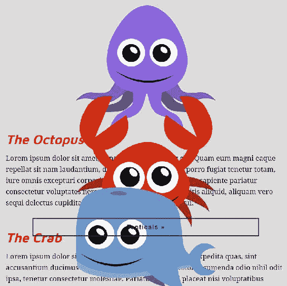

我们的纵队都在彼此的上面乱糟糟的。所以我们必须弄清楚为什么会这样。这是因为我们为每一列都将`flex-basis`设置为`30%`。当`flex-direction`是 row 的时候，它工作得很好，但是你可能还记得*浮动到 Flexbox* 的部分，我们在一个较小设备的媒体查询中把`flex-direction`改成了`column`。当`flex-direction`为`column`时，`flex-basis`控制高度而不是宽度，因为在这种情况下主轴是垂直运行而不是水平运行的。

让我们修正一下我们的媒体查询。让我们创建一个新的选择器并将`flex-basis`设置为`auto`:

```html
@media screen and (max-width: 1023px){
 .column {
 flex-basis: auto;
    margin-bottom: 50px;
 }
}/* end of media query */
```

你会记得将`flex-basis`设置为`auto`意味着:看我的宽度或高度。因为我们没有明确设置高度；高度是由内容决定的，正是我们想要的——只要让高度等于内容的大小。另外，我偷偷放入了一个`50px`的`margin-bottom`，为每个人提供一点喘息的空间:

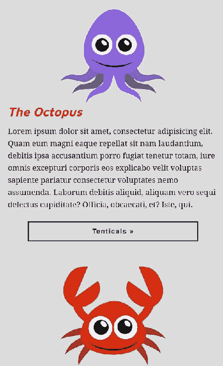

在本节中，我们使用 flexbox 构建了我们的产品列表，并引入了两个新的 flex 属性:`align-items`和`align-self`。在下一节中，我将介绍另外两个属性:`flex-wrap`和`align-content`。

# 使用弹性换行和对齐内容

`flex-wrap`属性允许我们确定是将内容包装到第二行，还是将所有 flex 项压缩到一行中；`align-content`确定一行被换行到多行的对齐方式，从而成为多行。他们基本上是最好的朋友。

# 使用软包

我们将返回并使用 flexbox 示例页面(`flexbox.html`)作为测试这些属性的平台。以下是我们在这一领域的总结:

```html
/***************
Flexbox demo
***************/
.flex-container {
  margin-top: 200px;
  display: flex;
  justify-content: flex-start;
}
.flex-item {
  padding: 20px;
}
.flex-item:last-child {
  margin-left: auto;
}
.flex-item1 { background: deeppink;}
.flex-item2 { background: orange; }
.flex-item3 { background: lightblue; }
.flex-item4 { background: lime; }
.flex-item5 { background: olive; }
```

flex 容器将所有内容对齐到`flex-start`，或者在我们的例子中，对齐到左边。这是因为`flex-direction`没有设置，所以默认为`row`。最后一个伸缩项被`margin-left: auto;`推到最右边。我们的`flexbox.html`页面此刻应该是这样看的:


在`flexbox.html`中，让我们添加更多的 flex 项目并保存它们:

```html
<section class='flex-container'>
    <div class="flex-item flex-item1">item 1</div>
    <div class="flex-item flex-item2">item 2</div>
    <div class="flex-item flex-item3">item 3</div>
    <div class="flex-item flex-item4">item 4</div> 
    <div class="flex-item flex-item5">item 5</div> 
    <div class="flex-item flex-item1">item 6</div>
    <div class="flex-item flex-item1">item 1</div>
    <div class="flex-item flex-item2">item 2</div>
    <div class="flex-item flex-item3">item 3</div>
    <div class="flex-item flex-item4">item 4</div> 
    <div class="flex-item flex-item5">item 5</div> 
    <div class="flex-item flex-item1">item 6</div>
    <div class="flex-item flex-item1">item 1</div>
    <div class="flex-item flex-item2">item 2</div> 
    <div class="flex-item flex-item3">item 3</div> 
    <div class="flex-item flex-item4">item 4</div> 
    <div class="flex-item flex-item5">item 5</div> 
    <div class="flex-item flex-item1">item 6</div>
</section>
```

现在，我们看到 flexbox 是如何挤压 flex 项目以适合 flex 容器中的一行的。


因此，我们要做的是通过向 flex 容器添加值为`wrap`的`flex-wrap`属性来包装多行。另外，让我们去掉最后一个弹性项上的`margin-left: auto`，只需去掉整个规则集:

```html
/***************
Flexbox demo
***************/
.flex-container {
  margin-top: 200px;
  display: flex;
  justify-content: flex-start;
 flex-wrap: wrap;
}
.flex-item {
  padding: 20px;
}
.flex-item1 { background: deeppink;}
.flex-item2 { background: orange; }
.flex-item3 { background: lightblue; }
.flex-item4 { background: lime; }
.flex-item5 { background: olive; }
```

因此，所有的 flex 项目，以前是缩小以适应一行，现在扩大到他们的自然大小；这意味着文本的宽度加上文本两侧的`padding`的`20px`。这会创建两行内容。很好，正是我们想要的！


`flex-wrap`默认为`nowrap;`。这是有道理的，因为在我们将其设置为`wrap`之前，它迫使我们所有的伸缩项目都适合一行。好像我们完全省略了`flex-wrap`。让我们交换一下`nowrap`来测试一下:

```html
.flex-container {
    margin-top: 200px;
    display: flex;
    justify-content: flex-start;
 flex-wrap: nowrap;
}
```

好像我们根本没有指定一个`flex-wrap`:


还有`wrap-reverse;`让我们试试:

```html
.flex-container {
  margin-top: 200px;
  display: flex;
  justify-content: flex-start;
 flex-wrap: wrap-reverse;
}
```

最后一项现在是第一项，第一项是最后一项。从技术上讲，最后一项现在是第一行的第四项:


使用`flex-wrap`很酷的一点是，当涉及到像`flex-grow`、`flex-shrink`和`justify-content`这样的属性时，每一行现在都独立于其他行工作。

我们来测试一下，加上`flex-grow: 1`:

```html
.flex-container {
  margin-top: 200px;
  display: flex;
  justify-content: flex-start;
  flex-wrap: wrap-reverse;
}
.flex-item {
  padding: 20px;
 flex-grow: 1;
}
```

这将重新分配 flex 项目之间的任何额外空间，以确保它们填满所有剩余空间:


每一行都有扩展的 flex 项目来占据额外的空间。如您所见，第一行的 flex 项目比下面一行伸展得更远，以填满额外的空间。在它下面的另外两行中，flex 项目只被拉伸了一点点来填充额外的空间。

让我们通过将`justify-content`更改为`space-between`flex 容器，再来看看这些行是如何相互独立工作的。我们还将去掉弹性项上的`flex-grow`:

```html
.flex-container {
  margin-top: 200px;
  display: flex;
 justify-content: space-between;
  flex-wrap: wrap-reverse;
}
.flex-item {
  padding: 20px;
}
```

因此，在每个 flex 项目之间分配了额外的空间:


第一行有很多额外的空间，而第二行在每个 flex 项目之间只有一点额外的空间。同样，各行在如何处理`flex-grow`、`flex-shrink`和`justify-content`上相互独立。这种东西非常适用于来自**内容管理系统** ( **内容管理系统**)的动态、未知数量的内容。

# 使用对齐内容

好吧，让我们看看另一个名为`align-content`的属性。与`flex-wrap`一样，`align-content`是一个只在 flex 容器上工作的属性；但是`align-content`依赖于`flex-wrap`被设置为`wrap`或`wrap-reverse`，这意味着`align-content`在所有其他场景下被忽略。此外，`align-content`与`align-items`相似，因为它控制沿横轴的排列或对齐。唯一不同的是，它不是沿着横轴重新分配每个*弯曲项*，而是沿着横轴重新分配每个*行*。

让我们设置一个`align-content`到`space-between`。我们还将赋予它高度`300px`和深灰色边框:

```html
.flex-container {
  margin-top: 200px;
  display: flex;
  justify-content: space-between;
  flex-wrap: wrap-reverse;
 align-content: space-between;
 height: 300px;
 border: 1px solid #777; 
}
```

我还将把灵活项目的数量增加一倍，以保持趣味性:

```html
<!--
====================
Flexbox Demo
====================
-->
<section class='flex-container'>
    <div class="flex-item flex-item1">item 1</div>
    <div class="flex-item flex-item2">item 2</div>
    <div class="flex-item flex-item3">item 3</div>
    <div class="flex-item flex-item4">item 4</div> 
    <div class="flex-item flex-item5">item 5</div> 
    <div class="flex-item flex-item1">item 6</div>
    <div class="flex-item flex-item1">item 1</div>
    <div class="flex-item flex-item2">item 2</div>
    <div class="flex-item flex-item3">item 3</div>
    <div class="flex-item flex-item4">item 4</div> 
    <div class="flex-item flex-item5">item 5</div> 
    <div class="flex-item flex-item1">item 6</div>
    <div class="flex-item flex-item1">item 1</div>
    <div class="flex-item flex-item2">item 2</div> 
    <div class="flex-item flex-item3">item 3</div> 
    <div class="flex-item flex-item4">item 4</div> 
    <div class="flex-item flex-item5">item 5</div> 
    <div class="flex-item flex-item1">item 6</div>
    <div class="flex-item flex-item1">item 1</div>
 <div class="flex-item flex-item2">item 2</div>
 <div class="flex-item flex-item3">item 3</div>
 <div class="flex-item flex-item4">item 4</div> 
 <div class="flex-item flex-item5">item 5</div> 
 <div class="flex-item flex-item1">item 6</div>
 <div class="flex-item flex-item1">item 1</div>
 <div class="flex-item flex-item2">item 2</div>
 <div class="flex-item flex-item3">item 3</div>
 <div class="flex-item flex-item4">item 4</div> 
 <div class="flex-item flex-item5">item 5</div> 
 <div class="flex-item flex-item1">item 6</div>
 <div class="flex-item flex-item1">item 1</div>
 <div class="flex-item flex-item2">item 2</div> 
 <div class="flex-item flex-item3">item 3</div> 
 <div class="flex-item flex-item4">item 4</div> 
 <div class="flex-item flex-item5">item 5</div> 
 <div class="flex-item flex-item1">item 6</div>
</section>
```

现在我们有 3 行，由于`align-content`，每行之间都有空间:


`height`属性是相关的，因为如果省略，伸缩容器的高度将只与其伸缩项一样高；因此，`align-content`不会做任何事情，因为不会有任何额外的垂直空间可以玩。除`space-between`外，`align-items`的其他值包括`flex-start`、`flex-end`、`center`和`space-around`。当我们研究`justify-content`属性时，这些值应该是熟悉的。默认值为`stretch`。`space-around`值将所有项目周围的额外空间均匀地重新分配，包括第一个和最后一个项目。

所以我们把它从`space-between`改成`space-around`:

```html
.flex-container {
  margin-top: 200px;
  display: flex;
  justify-content: space-between;
  flex-wrap: wrap-reverse;
 align-content: space-around;
 height: 300px;
 border: 1px solid #777; 
}
```

您可以看到，在 flex 容器的顶部和第一行之间以及容器的底部和最后一行之间有一个空间:


而`space-between`的第一行和最后一行紧紧地拥抱在柔性容器上，这是一个微妙的区别。当我们研究`justify-content`时，我们再次注意到了这个微妙之处。

现在让我们将`align-content`的值更改为`center`:

```html
.flex-container {
  margin-top: 200px;
  display: flex;
  justify-content: space-between;
  flex-wrap: wrap-reverse;
  align-content: center;
  height: 300px;
  border: 1px solid #777; 
}
```

正如我们所料，我们的行位于中心:


现在让我们将`flex-direction`改为列，看看`flex-wrap`和`align-content`在这个用例中是如何协同工作的:

```html
.flex-container {
  margin-top: 200px;
  display: flex;
  justify-content: space-between;
  flex-direction: column;
  flex-wrap: wrap-reverse;
  align-content: center;
  height: 300px;
  border: 1px solid #777; 
}
```

所以这里发生了很多事情，很难说清楚到底是什么，但有一点我们可以说，我们是水平居中的:


让我们稍微简化一下，以理解正在发生的事情。首先，我们把`flex-wrap`从`wrap-reverse`改回刚才的`wrap`:

```html
.flex-container {
    margin-top: 200px;
    display: flex;
    justify-content: space-between;
    flex-direction: column;
 flex-wrap: wrap;
    align-content: center;
    height: 300px;
    border: 1px solid #777; 
}
```

在`flexbox.html`中，我们将大幅减少弹性项目的数量:

```html
<section class='flex-container'>
    <div class="flex-item flex-item1">item 1</div>
    <div class="flex-item flex-item2">item 2</div>
    <div class="flex-item flex-item3">item 3</div>
    <div class="flex-item flex-item4">item 4</div> 
    <div class="flex-item flex-item5">item 5</div> 
    <div class="flex-item flex-item1">item 6</div>
</section>
```

现在，更容易看到的是`flex-direction`是`column`，它强制两个垂直列，因为`flex-wrap`被设置为`wrap`，我们没有所有 6 个伸缩项的可用空间:


我们对`justify-content`的`space-between`设置是在每个伸缩项之间重新分配额外的空间。请注意这两个列是如何独立地重新分配它们的额外空间的，如下图所示。

当沿横轴有多余空间且有多行时，`align-content`用于沿横轴排列行。而我们知道`flex-direction`是行的时候横轴是从上到下的。


并且，`flex-direction`为列时横轴从左向右延伸:


My apologies, if I'm starting to sound like a broken record, but I feel it's important to over-communicate things that are important to how flexbox operates.

# 使用灵活流程速记

之前，我们看了`flex`简写如何将`flex-grow`、`flex-shrink`和`flex-basis`组合在一起。让我们介绍另一种简写方式，`flex-flow`，通过将`flex-direction`和`flex-wrap`结合在一起，这将允许我们稍微减少我们的财产。总之，这稍微简化了我们的 CSS:

```html
.flex-container {
  margin-top: 200px;
  display: flex;
  justify-content: space-between;
  flex-flow: column wrap;
  align-content: center;
  height: 300px;
  border: 1px solid #777; 
}
```

没有什么变化，这正是我们使用速记重构时想要的:


Given how closely dependent `align-content` is on `flex-wrap`, I would expect `align-content` to be part of the `flex-flow` shorthand. However, `align-content` isn't part of the `flex-flow` shorthand with `flex-direction` and `flex-wrap`.

在本节中，您学习了`flex-wrap`如何允许我们创建多个内容流(或行)，而`align-items`则沿着横轴将这些多行放置在其容器中。

# 更改弹性项的显示顺序

在本节中，我们将讨论如何更改 flex 项目的显示顺序，以及这如何有助于响应性网页设计。我们还将讨论这如何影响网页的可访问性。

在较宽的屏幕宽度下，内容水平显示:首先是章鱼，然后是螃蟹，然后是鲸鱼:

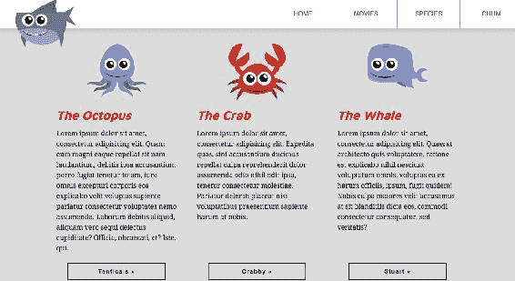

在较窄的设备宽度下，内容以相同的顺序显示，只是垂直显示，如下图所示:


在这两种情况下，显示顺序与源顺序相同，这在这种情况下是有意义的。

让我们在这里做一些不同的事情。假设我们正在与一位设计师合作，他想在本周展示螃蟹，让它在视觉上优先于章鱼和鲸鱼。这就是我们在这里所做的。我在 HTML 和 CSS 中添加了一些额外的东西来实现这种新的特色处理:


在标记中，我在每一列的标题中添加了一个数字，这样我们在浏览器中查看时就可以很容易地记住源代码的顺序。然后，对于螃蟹，我添加了一个名为`featured`的类和一个带有名为`ribbon`的类的`div`标签。

```html
<div class="column">
    <figure>
        
    </figure>
    <h2>The Octopus 1</h2>
    <p>Lorem ipsum dolor...</p>
    <a href="#" class="button">Tenticals &raquo;</a>
</div>
<div class="column featured">
 <div class="ribbon">Featured</div>
    <figure>
        
    </figure>
    <h2>The Crab 2</h2>
    <p>Lorem ipsum dolor...</p>
    <a href="#" class="button">Crabby &raquo;&lt;/a>
</div>
<div class="column">
    <figure>
        
    </figure>
    <h2>The Whale 3</h2>
    <p>Lorem ipsum dolor sit...</p>
    <a href="#" class="button">Stuart &raquo;</a>
 </div>
```

我添加了一些 CSS 来设置功能区的样式:

```html
/*featured column*/
.featured {
  padding: 0 0 20px 0;
  background-color: #d3d3d3;
  overflow: hidden;
}
.featured h2, 
.featured p {
  margin-left: 20px;
  margin-right: 20px;
}
.ribbon {
    background-color: #ffc0cb;
    padding: 10px 50px;
    margin-bottom: 20px;
    align-self: stretch;
    text-align: center;
    font-family: 'Maven Pro', Arial, sans-serif;
    font-weight: bold;
    box-shadow: #b7b7b7 0px 2px 15px 0px;
}
```

你可能已经注意到特色丝带在顶部被拉伸；这是使用`align-self: stretch`完成的。正如我们已经讨论过的，`align- self`沿着横轴对齐伸缩项，在我们的例子中，横轴从左到右，因为`flex-direction`被设置为`column`。`align-self`属性类似于`align-items`，除了它用在弹性项上并覆盖了`align-items`属性。

在桌面或更广阔的视野中，我们的业务合作伙伴和设计师看到这一点时真的很高兴。但是在手机上，他们说:*“嗯，我不知道，螃蟹还在显示第二。”*他们可能是对的，是特色内容，所以不仅要有视觉特色，也要先出现。如果我们的内容来自数据库，我们可以更新它，这样螃蟹就会先出现；或者，我们可以使用一些 JavaScript 来重新排列我们的特色内容，将螃蟹放在第一位。这两种解决方案至少都不理想。

Flexbox 来拯救这里。在我们对较小设备的媒体查询中，我们可以使用称为`order`的弹性项目属性:

```html
@media screen and (max-width: 1023px){
  .intro-content {
    width: auto;
    float: none;
    padding-bottom: 0;
    margin-bottom: 30px;
  }
  .go-premium {
    width: auto;
    float: none;
    margin-top: 0;
  }
  .columns {
    flex-direction: column;
  }
  .column {
    flex-basis: auto;
    margin-bottom: 50px;
  }
  .featured {
 order: -1;
 }
}/* end of media query */
```

好吧，当我刷新浏览器时，它会立即将我们的螃蟹移动到第一个位置，如下图所示:


默认情况下，所有伸缩项目都被赋予`0`的`order`，因此假设`-1`将螃蟹移动到顶部。项目的顺序与主轴线一致；最低排序的弹性项目将出现在主轴的起点，而最高排序的弹性项目将出现在主轴的终点。

同样，在我们的例子中，由于`flex-direction`是`column`，主轴从上到下运行。我们把`order`改成`1`:

```html
@media screen and (max-width: 1023px){
  .intro-content {
    width: auto;
    float: none;
    padding-bottom: 0;
    margin-bottom: 30px;
  }
  .go-premium {
    width: auto;
    float: none;
    margin-top: 0;
  }
  .columns {
    flex-direction: column;
  }
  .column {
    flex-basis: auto;
    margin-bottom: 50px;
  }
 .featured {
 order: 1;
 }
}/* end of media query */
```

这将螃蟹移到了底部，因为默认情况下，章鱼和鲸鱼都是`0` -而且，我们将螃蟹指定为`1`-所以现在它被放在了末尾:

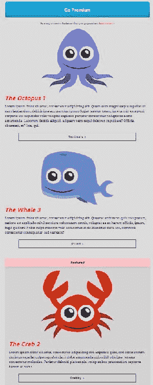

好吧，让我们再添加两个规则集:

```html
.column:nth-child(1) {
 order: 3;
}
.featured {
  order: 1;
}
.column:nth-child(3) {
 order: 2;
}
```

我们使用`nth-child`伪类来稍微混淆一下顺序。当我们现在刷新浏览器时，螃蟹是显示顺序中的第一个(源顺序中的第二个)，鲸鱼是第二个(但源顺序中的第三个)，章鱼是第三个(但源顺序中的第一个)。它应该是这样的:


所以我也可以把它们倒过来放。我已经把第一个作为第三个，我可以把第二个作为第二个，第三个作为第一个:

```html
.column:nth-child(1) {
  order: 3;
}
.featured {
  order: 2;
}
.column:nth-child(3) {
  order: 1;
}
```

这是我们应该看到的:


现在我们有第三个作为第一个，第二个作为第二个，第一个作为第三个。颠倒顺序。但是请记住，我有一个更简单的方法来做到这一点；实际上，我可以去掉这三个规则集，将`flex-direction`指定为`column-reverse`:

```html
@media screen and (max-width: 1023px){
  .intro-content {
    width: auto;
    float: none;
    padding-bottom: 0;
    margin-bottom: 30px;
  }
  .go-premium {
    width: auto;
    float: none;
    margin-top: 0;
  }
  .columns {
 flex-direction: column-reverse;
  }
  .column {
    flex-basis: auto;
    margin-bottom: 50px;
  }
}/* end of media query */
```

现在，当我刷新浏览器时，它们仍然是相反的顺序:


# 可达性影响

我想提到的一件事是，改变显示顺序有一个缺点，你可能想知道:在内容中跳转。选项卡顺序仍然基于源顺序，这成为一个可访问性问题。现在，您可能会想，在我们的示例中，选项卡顺序在桌面上是合乎逻辑的，但只有在较小的设备(如电话)上才变得不合逻辑，这些设备很可能(但不总是)不会在字段中进行选项卡。也许这是事实；但是，更改显示顺序也是屏幕阅读器的一个问题，例如 JAWS，它根据源顺序而不是显示顺序向视力障碍用户读取内容。所以，你的内容仍然会由屏幕阅读器根据来源顺序来宣布，这将与视觉顺序不同步。这可能是一个可访问性问题。所以，如果改变顺序，最好记住这一点。

在本节中，您学习了`order`属性如何更改 flex 容器中 flex 项目的显示顺序，以及这如何影响选项卡顺序和可访问性。

# 供应商前缀

让我们谈谈供应商前缀。在本节中，我们将讨论浏览器对 flexbox 的支持，以及我们应该如何在 flexbox CSS 中添加供应商前缀，以便获得更深入的 flexbox 支持。我们还将讨论名为 **Autoprefixer** 的东西，它可以帮助我们添加这些前缀。

如果我们使用`-ms-`厂商前缀，Flexbox 支持从 IE10 及更高版本开始。但是这可能不是您想要添加的唯一供应商前缀，因为自从 W3C 规范首次在浏览器中实现以来，它实际上已经发生了变化。当它实现时，语法和属性名与现在不同。为了获得深度浏览器支持，我们可以使用旧语法和新语法来支持一些早期采用的浏览器。

让我们更新最初添加 flexbox 的规则集，也就是我们的`.columns`:

```html
.columns {
  display: -webkit-box;
  display: -webkit-flex;
  display: -ms-flexbox;
  display: flex;
  -webkit-box-pack: justify;
  -webkit-justify-content: space-between;
  -moz-box-pack: justify;
  -ms-flex-pack: justify;
  justify-content: space-between;
}
```

哇哦！这里发生了很多事。我们不只是在房产的开头加上`-ms-`、`-moz-`和`-webkit-`。当涉及到`display`属性的值时，我们将供应商前缀添加到值的开头。这些值本身与我们的无前缀版本没有太大区别。还有第二个`-webkit-`价值观！Chrome 和 Safari 确实是 flexbox 的早期采用者，所以 WebKit 浏览器实际上支持两种不同的前缀:`-webkit-box`和`-webkit-flex`。所以，这是很多前缀和大量记忆，它看起来就像疯狂的`justify-content`属性。这是很多。棘手的部分是学习和记住旧的语法，特别是因为不清楚哪些前缀仍然需要。

# 自动贴合

这里有一个工具，如 Autoprefixer CSS online([https://autoprefixer.github.io/](https://autoprefixer.github.io/))可以非常有帮助。它根据浏览器的总市场份额和每个浏览器的版本数量提供我们需要的前缀。让我们将此过滤器更新为`.01%`:


让我们去掉所有这些前缀，只需将这个规则集复制并粘贴到 Autoprefixer 工具的左框中:


在右侧，它提供了我们应该使用的前缀:


让我们把它复制回我们的 CSS:

```html
.columns {
  display: -webkit-box;
  display: -ms-flexbox;
  display: flex;
  -webkit-box-pack: justify;
      -ms-flex-pack: justify;
          justify-content: space-between;
}
```

这比记忆所有 flexbox 属性的不同语法要容易得多。如果有某种方法可以自动为我们添加供应商前缀，而无需我们进行所有这些复制和粘贴，那就太好了。我们可以做的一件事是，我们可以使用一个预处理器，比如 **Sass** ，来编写一个叫做 **mixin** 的东西来为我们添加供应商前缀，这样我们就不用考虑那么多了。我们将在下一章研究萨斯混搭

# 吞咽

现在我想提一件你可能听说过的事情:大口。

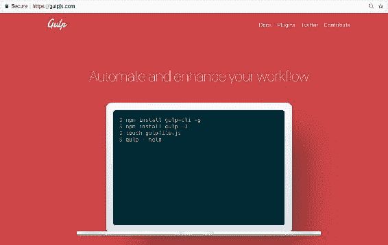

大口([https://gulpjs.com/](https://gulpjs.com/))和它的朋友 Grunt([https://gruntjs.com/](https://gruntjs.com/))允许我们创建构建过程，比如缩小我们的 CSS 和 JavaScript 文件，将 Sass 编译成 CSS，甚至使用 Autoprefixer 自动向 CSS 添加供应商前缀。大口在节点上运行，需要你下载，然后下载大口。然后，您可以下载单个任务，如自动刷新。《学习大口》远远超出了这本书的范围，但是大口真的很有用，我真的很喜欢。为了入门，我强烈建议您阅读*入门大口*、 *Travis Maynard* 、 *Packt Publishing* ，该书出色地解释了如何安装大口、设置大口和使用大口。通过阅读这本书，我学会了如何使用大口。

save 是一个*命令行*工具，可以配置为每次保存 CSS 文件时运行 Autoprefixer。因此，如果我在我的 CSS 中编写一个 flexbox 属性，并执行 *Ctrl* + *S* ，write 将监视我的文件中的任何增量，如果它检测到变化，它将告诉 Autoprefixer 运行并使用必要的供应商前缀更新我的 CSS 文件。我知道这听起来很奇怪——用供应商前缀更新我的 CSS 文件——但从技术上来说，它所做的是创建一个新的 CSS 文件，其中将包含所有供应商前缀。这不仅仅是我在这里解释的内容，请查阅特拉维斯·梅纳德的书来设置它。这样，您就再也不用考虑供应商前缀了，因为 Autoprefixer 和 have 会为您考虑。

# 弹性家庭作业

我们建了一个很棒的网站:


然而，它也不是没有问题。您可能已经注意到一件事，在产品列表部分，当我们缩小浏览器时，它开始看起来有点不稳定，如下图所示:

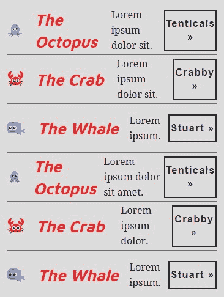

对您来说，最后一个带回家的测试是更新媒体查询中的 CSS，使显示在较小的设备尺寸下看起来很好。

在本节中，我们讨论了如何在 flexbox 属性中添加供应商前缀，以获得更深入的浏览器支持。不过，供应商前缀可能很棘手，最好将前缀留给 Autoprefixer 之类的工具。更好的是，最好自动化 Autoprefixer，这样每次保存 CSS 文件时都会执行它。为此，您可以使用任务运行器，如大口或咕噜。

# 摘要

这就完成了我们通过 flexbox 的旅程。我们现在已经看到了与它相关的每一个属性，并将它们付诸实践，为我们的网站构建了一个新产品列表。在下一章中，我们将在大结局中看看围绕 CSS 推进你的技能和工具的下一步:[第 11 章](11.html#7124O0-a72d261cc09f412988422c8a08f12cd5)、*总结*。