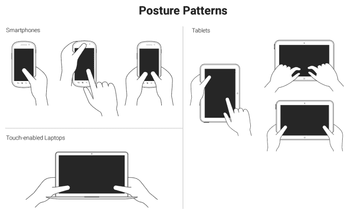
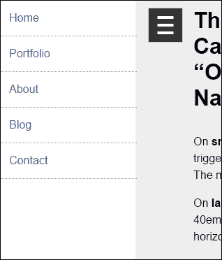
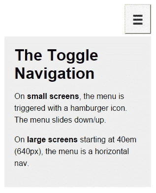
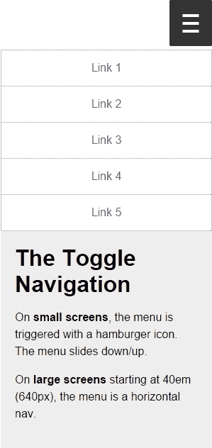

# 五、设计大手指驱动的小型用户界面

触摸屏设备的高度普及对我们网络/移动设计师和开发者来说并不是什么新鲜事。因此，我们不会谈论市场份额、统计数据或分析数据。相反，我们将讨论我们需要考虑的事情来构建可用的接口，例如目标大小、导航模式、导航图标、最佳实践和移动设备人机工程学。

在本章中，我们将介绍以下主题：

*   小型 UI 上的理想目标大小。
*   姿势模式和触摸区域。
*   RWD 应考虑的基本准则。
*   RWD 的导航模式。

# 小型 UI 上的理想目标尺寸

所有供应商对于小屏幕设备上目标的理想尺寸都有不同的规则和指南。其中一些以像素表示这些尺寸，其他以点表示，其他以英寸、毫米或厘米等单位表示。

不管这些供应商使用什么单位，他们都同意一个基本概念：使您的目标尺寸足够大，以避免意外敲击。这与 Fitts 定律是一致的，该定律指出*目标越小，用户到达目标*的时间越长。

显然，作为网页设计师，我们必须注意*大*在我们的设计中意味着什么，因此我们需要平衡目标尺寸建议和良好的设计原则。我们的目标是，消息应该到达用户，他们应该能够舒适地使用我们的界面。

需要记住的一点是，RWD 目标尺寸的指导原则主要基于移动应用设计模式。让我们开始吧。

成人食指的平均宽度约为 16 毫米至 20 毫米。这接近 45px 到 57px。

根据至*苹果的 iOS 人机界面指南*，建议的最小目标尺寸为 44pt x 44pt。

### 提示

一些用户界面指南使用点和毫米作为测量单位的原因是为了提供与设备无关的一致刻度。这是因为一台设备中的 1px 不一定意味着另一台设备中的 1px。尽管如此，一些供应商确实提供了关于像素的指南，但主要是为了让我们了解元素的比例如何相互关联。

在过去，苹果确实推荐了以像素为单位的目标尺寸，44px x 44px，但当视网膜显示器出现时，iPhone3 上的 1 像素变成了 iPhone4 上的 4 像素。不再有 1:1 的比例了。

这意味着非视网膜设备中的 44pt x 44pt 实际上是 44px x 44px，但在视网膜设备上是 88px x 88px。每当苹果发布一款屏幕密度更高的新设备时，这些像素值就会再次改变。

在 RWD 的世界里，对苹果设备或任何相关设备的屏幕密度有一个很好的了解是必须的。这样，我们在设计时就可以考虑这些技术细节，这样我们就不会妨碍用户体验以及网站和应用的可用性。

另一方面，*微软的 Windows8 触摸指南*文档建议理想的目标尺寸为 7 毫米 x7 毫米（40px x 40px）。如果由于关闭或删除等严重后果，准确性至关重要，*Windows 8 触摸指南*指南建议目标尺寸为 9 mm x 9 mm（50px x 50px）。此外，当屏幕不动产稀少且需要安装时，建议的最小目标尺寸为 5 mm x 5 mm（30px x 30px）。

这些尺寸适用于非高密度屏幕。

*Windows 8 触摸指导*指南甚至建议元素之间的最小填充：2 mm（10px），无论目标大小如何（这很好）。

*Android 开发者*指南建议最小目标尺寸为 48dp，约为 9mm。建议的最小和最大目标尺寸分别为 7 mm 和 10 mm。

Android 开发者指南还建议 8dp 元素之间的最小间距。

### 提示

这里，**dp**表示与密度无关的像素。这意味着 1dp 与*正常*密度屏幕中的 1px 相同。就像苹果使用点（pt）一样，他们正试图定义一个全局和屏幕密度无关的单元。

还有*Ubuntu*文档建议界面元素不应小于 1 厘米（约 55 像素）。

正如我们所见，建议的最小和最大目标尺寸因供应商而异。然而，它们之间并没有那么遥远。

我们可以从提到的所有目标尺寸安全地得出结论，适当的尺寸是（在低密度屏幕中）：

*   建议的目标尺寸为 48dp×48dp=48px×48px。
*   最小目标尺寸为 5mm×5mm=30px×30px。
*   最大目标尺寸为 10 mm x 10 mm=55px×55px。
*   任何元素之间的填充为 2 mm=10px。

# 姿势模式和触摸区

无论我们的触摸目标的大小有多有用，如果它们没有放在正确的位置，我们所有的努力都是毫无价值的。

我们不能谈论小 UI 和大手指，而不提及 Luke Wroblewski 在其文章*响应式导航：跨设备触摸优化*（[中所做的大量工作 http://www.lukew.com/ff/entry.asp?1649](http://www.lukew.com/ff/entry.asp?1649) ）。

## 姿势模式

在他的文章中，Luke 谈到了大多数用户手持智能手机、平板电脑和触摸型笔记本电脑时的姿势模式：



这些模式允许我们定义布局内容的最佳方式，以便易于使用和访问。

了解用户的姿势模式将使我们能够了解目标的大小是否合适，如果屏幕空间不够大，目标的大小甚至可以小一点，如果需要精度，目标的大小可以大一点，因为使用拇指和食指是不同的。

## 触摸区

Luke 还谈到了*触摸区*，这基本上是一个设备的区域，根据姿势的不同，这些区域容易或难以触及。

在所有主要类型的设备、智能手机、平板电脑和支持触摸的笔记本电脑中，理想的触摸区域为深绿色，*ok*触摸区域为浅绿色，难以触及的区域为黄色：


在 RWD 中，要彻底改变一个页面的布局是有点困难的，更不用说像一个独立的应用那样改变多个页面（至少目前如此），而不需要做大量的工作。此外，很可能会对用户体验和维护内容层次结构产生负面影响。

RWD 与内容策略紧密结合，因此无论在何种设备上查看我们的网站/应用，都需要保留内容层次结构。我们需要确保元素本身足够大，以便手指较大的人能够正确使用。这些元素包括链接、按钮、表单字段、导航项、任何类型的控件（如分页）、手风琴中的打开/折叠控件、选项卡系统等。

现在，有一个网站/应用元素在 RWD 中非常通用：菜单按钮。

为了触发导航，UX 社区对一个非常特殊的元素有着非常强烈的意见：*汉堡*图标(≡). 现在，我们将把它称为更通用的图标：*导航*图标。我将它称为*导航*图标，因为它不一定是汉堡包图标/图形，它可以是另一种图标或单词。

导航图标和导航项本身的位置、行为和设计与设计者一样有很多变化。对别人有用的东西未必对我们有用，反之亦然。因此，测试成为决定用户是否满意的方法。

尽管如此，有一些关于导航图标的用户体验指南值得一提，我们将在下一步看到。

# AWT0.NWV 图标-考虑 RWD 的基本准则

导航图标可以用多种方式表示。RWD 采用移动应用的模式，因为小屏幕应用和网站有许多相似的隐喻。

让我们来看一下常见的导航图标模式：

*   汉堡图标。
*   单词*菜单*。
*   汉堡图标加上单词*菜单*。

## 汉堡图标

此是迄今为止最流行的用于表示导航按钮的图标：≡.

*汉堡包*图标由诺姆·考克斯于 1981 年创建。Norm 使用此图标的目的是*“……模仿结果显示菜单列表的外观。”*（[http://gizmodo.com/who-designed-the-iconic-hamburger-icon-1555438787](http://gizmodo.com/who-designed-the-iconic-hamburger-icon-1555438787) ）。

换句话说，汉堡图标的真名是*列表*图标。

现在，如果我们仔细想想，汉堡包图标在语义上是正确的，因为它准确地表示触发时显示的内容：一个项目列表。然而，一些用户体验研究表明，汉堡图标并不像我们想象的那样有效，但我们在响应性网站和移动应用中都能看到它。

尽管汉堡包图标有几个缺点，但实际上每个人都能识别出这个图标是导航的代表，这只是时间问题。

底线是，只要我们遵循目标尺寸建议，并使导航栏内的链接易于在小屏幕上点击，使用汉堡包图标就没有问题。

的优点如下：

*   这很容易被某些人口统计数据所识别，尤其是年轻人。
*   它在设计中占用的空间很小。
*   它不依赖于语言。
*   使用 Unicode 字符 2261 很容易实现(≡), 全球支持率高达 96%。

缺点如下：

*   一些人口统计数据，尤其是年龄较大的人口统计数据，很难认识到这一点。
*   虽然很受欢迎，但很多人很难理解汉堡图标代表菜单。
*   由于网站的导航通常是隐藏的，因此它提高了低可发现性。

如果你打算使用汉堡包图标，不要麻烦使用任何类型的图像或任何带有边框或框阴影的 CSS 技术。保持简单。您所需要做的就是使用 Unicode 字符 2261(≡).

在下面的示例中，我们将使用一种众所周知的技术来隐藏内容（有一些变化以适合我们的演示）：Kellum 方法。这种方法在任何方面都不是黑客或任何类似的东西；我们并没有试图用这种方法欺骗我们的用户或搜索引擎。我们实际上非常注意导航图标通过将文本保留在标记中而获得的更好的可访问性，这样使用辅助技术的用户仍然可以访问菜单。考虑下面的例子。

HTML 格式如下：

```html
<button class="hamburger-icon"><span>Menu</span></button>SCSS
//Hamburger Icon
.hamburger-icon  {
    //Basic styling, modify if you want
    font-size: 40px;
    color: #666;
    background: #efefef;
    padding: 0 10px;
    border-radius: 3px;
    cursor: pointer;
    //Hamburger Icon
    &:before {
        content: '≡';
    }
    //Hide the term Menu from displaying without sacrificing accessibility
    span {
        display: inline-block;
        width: 0;
        height: 0;
        text-indent: -100%;
        overflow: hidden;
        white-space: nowrap;

    }
}
```

结果是：


### 提示

出于可访问性原因，单词*菜单*应始终包含在标记中。当使用**辅助技术**（**处）的用户将注意力集中在汉堡包图标上时，屏幕阅读器将读取单词*菜单*。此外，将单词*菜单*包含在`<span>`标记中，可以在不影响链接可访问性的情况下隐藏该单词，使其不会显示在浏览器中。**

## 单词菜单

一些非正式的网络测试表明，使用单词*菜单*是解决汉堡包图标缺点最可靠的方法。

然而，值得注意的是，许多作者在比较汉堡包图标和单词*菜单*时所做的研究和测试可能会产生误导，因为他们测试的是不同的视觉语言：图标和单词。

为了使这些测试完全可靠，他们必须测试图标对图标，以及单词对单词。例如，针对向下的箭头测试汉堡图标，或者针对单词*导航*测试单词*菜单*。

让我们看看*菜单*这个词的利弊。

的优点如下：

*   这是不言自明的。
*   事实上，任何人都能理解这意味着什么。
*   它可以用在任何语言中。
*   它在设计中占用的空间很小。

缺点如下：

*   因为它是一个单词，所以可能会与图像系统发生冲突。

考虑下面的例子。

以下是 HTML：

```html
<button class="word-menu">Menu</button>
```

以下是 CSS：

```html
//Word "Menu"
.word-menu {
    //Basic styling, modify if you want
    display: inline-block;
    padding: 16px 8px;
    color: #666;
    font: 12px Arial, "Helvetica Neue", Helvetica, sans-serif;
    background: #efefef;
    border-radius: 3px;
    cursor: pointer;
}
```

这就是结果：


### 提示

在本例中，我使用类名`.word-menu`来明确表示我对本书的意图，但这不是为生产命名元素的正确方法。使用更有意义和通用的命名约定，例如，类似于`.menu-trigger`的东西可以作为替代。使用泛型类名将允许我们在不更改标记的情况下使用导航图标的任何设计。

## 汉堡图标加上单词菜单

除了汉堡包图标和单词*菜单*讨论之外，还有一种选择，就是同时使用这两个词。有人认为这样做可能会两全其美。

优点是：

*   这是不言自明的。
*   事实上，任何人都能理解这意味着什么。
*   它可以用在任何语言中。
*   在设计中，它仍然可以占据很少的空间。
*   使用 Unicode 字符 2261 很容易实现(≡), 全球支持率高达 96%。

缺点是：

*   根据设计，单词*菜单*可能太小。

让我们来看两种我们可以用来表示这种模式的样式。

考虑下面的例子。

HTML 格式如下：

```html
<button class="hamburger-icon-plus-menu style-1">Menu</button>
```

SCSS 如下所示：

```html
//Hamburger Icon Plus Word "Menu" – Style 1
.hamburger-icon-plus-menu {
    //Basic styling, modify if you want
    display: inline-block;
    font-family: Arial, "Helvetica Neue", Helvetica, sans-serif;
    background: #efefef;
    color: #666;
    border-radius: 3px;
    cursor: pointer;
}
.style-1 {
    padding: 16px 8px;
    font-size: 16px;
    //Hamburger Icon
    &:before {
        content: '≡ ';
    }
}
```

结果如下：


### 提示

注意“`≡`”后面的空格，这就是将图标与单词“Menu”分开的原因，而不必使用任何形式的边距。

请考虑下面的例子。

HTML 是：

```html
<button class="hamburger-icon-plus-menu style-2">Menu</button>
```

SCS 是：

```html
//Hamburger Icon plus Word "Menu" – Style 2
.hamburger-icon-plus-menu {
    //Basic styling, modify if you want
    display: inline-block;

    font-family: Arial, "Helvetica Neue", Helvetica, sans-serif;
    background: #efefef;
    color: #666;
    border-radius: 3px;cursor: pointer;
}
.style-2 {
    padding: 4px 12px 6px;
    font-size: 10px;
    line-height: .8;
    text-align: center;
    //Hamburger Icon
    &:before {
        display: block;
        content: '≡';
        font-size: 40px;
    }
}
```

结果如下：


你可以在[看到我在 CodePen 中创建的演示 http://codepen.io/ricardozea/pen/f4ddc6443bc060004b58a7301aae83db](http://codepen.io/ricardozea/pen/f4ddc6443bc060004b58a7301aae83db) 。

# RWD 的导航模式

RWD 最神秘的特性之一是导航。它可以是我们想要的简单或复杂。

在本节中，我将向您展示如何构建三种常用的导航模式：

*   **切换导航**：这个是基于布拉德·弗罗斯特*切换菜单*演示（[的而设计的 http://codepen.io/bradfrost/pen/sHvaz/](http://codepen.io/bradfrost/pen/sHvaz/) 。
*   **非画布或屏幕导航**：此基于 Austin Wulf 的 SitePoint*纯 CSS 屏幕外导航菜单*演示（[http://codepen.io/SitePoint/pen/uIemr/](http://codepen.io/SitePoint/pen/uIemr/) 。
*   **基于 Flexbox 的导航**：这是我们的定制解决方案。

在查看每种模式的详细信息之前，让我们先澄清一下上述模式的一些特性：

## 设计

在小屏幕上，除基于 Flexbox 的导航外，所有导航模式都使用汉堡图标作为触发器。在大屏幕上，所有示例上的导航栏都是带有中心链接的水平链接组。

为了提高切换和非画布导航的可用性，汉堡包图标会添加/删除类`.active`，以提供显示物品已被点击的视觉提示。这是通过一点 jQuery 来完成的。

包括 jQuery 是这些演示的一部分，因此有必要调用它以使它们正常工作。

## 范围

所显示的标记仅用于菜单本身，而`<html>` 标记和 HTML5 Doctype 等元素和指令被故意忽略。

这些示例适用于支持相对高级 CSS3 属性的所有主要浏览器。他们不使用 FastClick 脚本来消除移动设备默认的 300 毫秒延迟。

供应商前缀被省略；毕竟，我们应该使用 AutoRefixer 来为我们处理这个问题。

## 第三方演示

由于不需要重新发明轮子，以下示例基于其他作者的演示，例如布拉德·弗罗斯特（Brad Frost）和奥斯汀·沃尔夫（Austin Wulf）的演示。

然而，为了适应本书的范围和风格，所有的原始演示都经过了分叉和*广泛的*扩展、增强、清理、优化、重新设计样式并移植到 Sass。换句话说，您将看到的标记和代码是专门为您定制的。

开始吧。

## 非画布或屏幕导航

这是迄今为止 RWD 和移动应用中最常用的导航模式。点击/单击时，它使用汉堡图标作为菜单的触发器。发生这种情况时，主容器向右滑动以显示左侧的菜单，然后再次向左滑动以隐藏菜单。

这个例子并不依赖于 JavaScript 来工作。然而，它使用了一些不可靠的元素来实现它：元素`<input>`和`<label>`。为了保护这个方法，它使用了`:checked`伪类，它在所有方面都有完善的支持。

以下是我们的 HTML：

```html
<!DOCTYPE html>
<html>
<head>
    <meta charset="UTF-8">
    <meta name="viewport" content="width=device-width, initial-scale=1">
    <script src="https://ajax.googleapis.com/ajax/libs/jquery/2.1.3/jquery.min.js"></script>
</head>
<body>
    <!-- Checkbox whose checked/unchecked states trigger the navigation -->
    <input type="checkbox" id="nav-trigger" class="nav-trigger">
    <!-- Hamburger icon -->
    <label for="nav-trigger" class="label-trigger"><span>Menu</span></label>
    <!-- Navigation -->
    <nav role="navigation">
        <ul class="menu">
            <li><a href="#">Link 1</a></li>
            <li><a href="#">Link 2</a></li>
            <li><a href="#">Link 3</a></li>
            <li><a href="#">Link 4</a></li>
            <li><a href="#">Link 5</a></li>
        </ul>
    </nav>
    <!-- Main container -->
    <main class="main-container" role="main">
        <h1>The "Off-Canvas" or "Off-Screen" Navigation</h1>
        <p>On <strong>small screens</strong>, the menu is triggered with a hamburger icon. The menu slides left/right.</p>
        <p>On <strong>large screens</strong> starting at 40em (640px), the menu is a horizontal nav.</p>
    </main>
</body>
</html>
```

这是我们的 SCS：

```html
*, *:before, *:after { box-sizing: border-box; }
//Globals
html, body {
    height: 100%;
    width: 100%;
    margin: 0;
}
//Mobile-first Media Query Mixin
@mixin forLargeScreens($media) {
    @media (min-width: $media/16+em) { @content; }
}
//Mixin for animating the hamburger icon
@mixin animation-nav-icon ( $direction: left, $duration: .2s) {
    transition: $direction $duration;
}
//Menu itself
.menu {
    width: 100%;
    height: 100%;
    margin: 0;
    padding: 0;
    position: fixed;
    top: 0;
    right: 0;
    bottom: 0;
    left: 0;
    z-index: 0;
    list-style: none;
    @include forLargeScreens(640) {
        max-width: 980px;
        min-height: 50%;
        margin: 10px auto 0;
        position: relative;
        text-align: center;
        border: #999 1px dotted;
    }
    //List items
    li {
        width: 100%;
        border-bottom: 1px dotted #999;
        @include forLargeScreens(640) {
            display: inline;
            border: none;
        }
        //Links themselves
        a {
            display: block;
            padding: 1em;
            color: #2963BD;
            text-decoration: none;
            @include forLargeScreens(640) {
                display: inline-block;
            }
        }
    }
}
//Main Container
.main-container {
    max-width: 980px;
    min-height: 100%;
    margin: auto;
    padding: 20px 0 20px 80px;
    position: relative;
    top: 0;
    bottom: 100%;
    left: 0;
    z-index: 1;
    background: #eee;
    @include forLargeScreens(640) {
       padding: 20px;
    }
}
//Navigation Trigger - Hide the checkbox
.nav-trigger {
    position: absolute;
    clip: rect(0, 0, 0, 0);
}
//Label that triggers the checkbox
.label-trigger {
    position: fixed;
    left: 10px;
    top: 10px;
    z-index: 2;
    height: 50px;
    width: 50px;
    cursor: pointer;
    background: #fff;
    border-radius: 2px;
    border: 1px solid #ccc;
    //Hamburger icon
    &:before {
        display: block;
        padding-top: 25px;
        text-align: center;
        content: '≡';
        font-size: 3em;
        line-height: 0;
    }
    //Active hamburger icon
    &.active {
        background: #333;
        color: #fff;
    }
    //Hide the term 'Menu' from displaying without sacrificing accessibility
    span {
        display: inline-block;
        text-indent: -100%;
        overflow: hidden;
        white-space: nowrap;
    }
}
//Animate the menu
.nav-trigger {
    & + label {
        @include animation-nav-icon;
        //Hide the checkbox and label in large screens
        @include forLargeScreens(640) {
            display: none;
        }
    }
    //Animate the label when checkbox is checked
    &:checked + label {
        left: 215px;
    }
    //Animate the main container when checkbox is checked
    &:checked ~ .main-container {
        left: 200px;
        box-shadow: 0 0 5px 1px rgba(black, .15);
    }
}
//Animate the main container
.main-container {
    @include animation-nav-icon;
}
//Avoid horizontal scrollbars due to repositioning of elements
body, html { overflow-x: hidden; }
//Styling stuff not needed for demo
html, body { font-family: Arial, "Helvetica Neue", Helvetica, sans-serif; }
h1, p { margin: 0 auto 1em; }
p { line-height: 1.5; }
```

以下是 jQuery 脚本：

```html
$(function() {
    //Set up the click behavior
    $(".label-trigger").click(function() {
        //Toggle the class .active on the hamburger icon
        $(this).toggleClass("active");
    });
});
```

让我们看一下屏幕截图。

以下是在*折叠*状态下的小屏幕上的外观：


以下是在*扩展*状态下的外观：



这是它在大屏幕上的外观：


您可以在[看到我在代码笔中创建的演示 http://codepen.io/ricardozea/pen/fd504cbcf362069320d15a4ea8a88b27](http://codepen.io/ricardozea/pen/fd504cbcf362069320d15a4ea8a88b27) 。

## 切换导航

在切换模式中，当点击汉堡图标时，导航栏向下滑动，链接堆叠。再次点击汉堡包图标时，导航栏将折叠。

HTML 格式如下：

```html
<!DOCTYPE html>
<html>
<head>
    <meta charset="UTF-8">
    <meta name="viewport" content="width=device-width, initial-scale=1">
    <script src="https://ajax.googleapis.com/ajax/libs/jquery/2.1.3/jquery.min.js"></script>
</head>
<body>
    <!-- Hamburger icon -->
    <button class="menu-link"><span>Menu</span></button>
    <!-- Navigation -->
    <nav id="menu" class="menu" role="navigation">
        <ul>
            <li><a href="#">Link 1</a></li>
            <li><a href="#">Link 2</a></li>
            <li><a href="#">Link 3</a></li>
            <li><a href="#">Link 4</a></li>
            <li><a href="#">Link 5</a></li>
        </ul>
    </nav>
    <!-- Main container -->
    <main class="main-container" role="main">
        <h1>The Toggle Navigation</h1>
        <p>On <strong>small screens</strong>, the menu is triggered with a hamburger icon. The menu slides down/up.</p>
        <p>On <strong>large screens</strong> starting at 40em (640px), the menu is a horizontal nav.</p>
    </main>
</body>
</html>
```

SCSS 如下所示：

```html
*, *:before, *:after { box-sizing: border-box; }
//Mobile-first Media Query Mixin
@mixin forLargeScreens($media) {
    @media (min-width: $media/16+em) { @content; }
}
//General Styling
.main-container, .menu {
    width: 98%;
    max-width: 980px;
    margin: auto;
    padding: 20px;
    background: #eee;
}
//Link that triggers the menu
.menu-link {
//Change to float: left; if you want the hamburger menu on the left side
    float: right;
    margin: 0 1% 5px 0;
    padding: 1.5em 1em 1em;
    background: #f6f6f6;
    line-height: 0;
    text-decoration: none;
    color: #333;
    border-radius: 2px;
    cursor: pointer;
    //Hamburger icon
    &:before {
        display: block;
        padding: 10px 0;
        content: '≡';
        font-size: 3em;
        line-height: 0;
    }
    //Active hamburger icon
    &.active {
        background: #333;
        color: #fff;
    }
    //Hide the term 'Menu' from displaying without sacrificing accessibility
    span {
        display: inline-block;

		text-indent: -100%;
        overflow: hidden;
        white-space: nowrap;
    }
    //On large screens hide the menu trigger
    @include forLargeScreens(640) {
        display: none;
    }
}
//If JavaScript is available, hide the menu.
.js .menu {
    overflow: hidden;
    max-height: 0;
    @include forLargeScreens(640) {
        max-height: inherit;
    }
}
//Menu itself
.menu {
    padding: 0;
    clear: both;
    transition: all .3s ease-out;
    //Define height of the menu
    &.active {
        max-height: 17em;
    }
    //Normalize the unordered list and add a bit of styling
    ul {
         margin: 0;
         padding: 0;
         list-style-type: none;
         border: 1px #999 dotted;
         border-bottom: none;
         text-align: center;
         //In large screens remove the border
        @include forLargeScreens(640) {
            background: #fff;
       }
    }
    //List items
    li {
      //Links themselves
      a {
         display: block;
         padding: 1em;
         border-bottom: 1px #999 dotted;
         text-decoration: none;
         color: #2963BD;
         background: #fff;
         @include forLargeScreens(640) {
            border: 0;
            background: none;
         }
      }
      //On large screens make links horizontal
      @include forLargeScreens(640) {
    display: inline-block;
    margin: 0 .20em;
       }
    }
}

//Styling stuff not needed for demo
body { font-family: Arial, "Helvetica Neue", Helvetica, sans-serif; }
p { line-height: 1.5; }
h1 { margin: 0; }
```

jQuery 如下所示：

```html
$(function() {
    //Add class .js to the body if JS is enabled
    $("body").addClass("js");
    //Set up the click behavior
    $(".menu-link").click(function() {
        //Toggle the class .active on the hamburger icon
        $(this).toggleClass("active");
       //Toggle the class .active on the menu to make it slide down/up
        $(".menu").toggleClass("active");
    });
});
```

让我们看一下屏幕截图。

以下是在*折叠*状态下的小屏幕上的外观：



而这里是*扩展*状态：



以下是它在大屏幕上的样子：


你可以在[看到我在代码笔中创建的演示 http://codepen.io/ricardozea/pen/e91a5e6ea456d41f4128d9bd405ccaa0](http://codepen.io/ricardozea/pen/e91a5e6ea456d41f4128d9bd405ccaa0) 。

您也可以访问[http://responsive-nav.com/](http://responsive-nav.com/) 用于切换导航功能。

## 基于 Flexbox 的导航

这个使用 Flexbox 的定制解决方案用途广泛，不一定需要使用媒体查询。其他两个菜单解决方案（切换导航和非画布导航）确实需要媒体查询。

使用此解决方案，菜单项适应可用空间，使目标区域尽可能大，自动增强菜单的可用性。这个基于 Flexbox 的解决方案的另一个主要优点是它不依赖 JavaScript。

这是 HTML：

```html
<!DOCTYPE html>
<html>
<head>
    <meta charset="UTF-8">
    <meta name="viewport" content="width=device-width, initial-scale=1">
</head>
<body>
    <nav role="navigation">
        <ul class="menu">
            <li><a href="#">Link 1</a></li>
            <li><a href="#">Link 2</a></li>
            <li><a href="#">Link 3</a></li>
            <li><a href="#">Link 4</a></li>
            <li><a href="#">Link 5</a></li>
        </ul>
    </nav>
    <!-- Main container -->
    <main class="main-container" role="main">
        <h1>The Flexbox-based Navigation</h1>
        <p>On both <strong>small and large screens</strong> the menu and its items are always visible.</p>
        <p>However, on <strong>small screens</strong> the links are more clearly defined and occupy all the available space.</p>
   </main>
</body>
</html>
```

现在是 SCSS：

```html
*, *:before, *:after { box-sizing: border-box; }
//Mobile-first Media Query Mixin
@mixin forLargeScreens($media) {
    @media (min-width: $media/16+em) { @content; }
}
//Menu itself
.menu {
    display: flex;
    flex-wrap: wrap;
    justify-content: space-around;
    max-width: 980px;
    margin: auto;
    padding: 2px;
    list-style: none;
    border: #999 1px dotted;
    //List items
    li {
        //Expand to use any available space
        flex-grow: 1;
        margin: 3px;
        text-align: center;
        flex-basis: 100%;
        @include forLargeScreens(320) {
            flex-basis: 30%;
        }
        @include forLargeScreens(426) {
            flex-basis: 0;
        }
        //Links themselves
        a {
           display: block;
           padding: 1em;
           color: #2963bd;
           text-decoration: none;
           background: #eee;
           @include forLargeScreens(426) {
              background: none;
           }
        }
    }
}
//Main Container
.main-container {
    max-width: 980px;
    margin: auto;
    padding: 20px;
    background: #eee;
}

//Styling stuff not needed for demo
body { margin: 8px; font-family: Arial, "Helvetica Neue", Helvetica, sans-serif; }
p { line-height: 1.5; }
h1 { margin: 0; }
```

我们来看看截图。

以下是它在小屏幕（320px）上的外观：


以下是在小屏幕（426px）上的外观：


以下是在大屏幕（980px）上的外观：


您可以在[看到我在 CodePen 中创建的演示 http://codepen.io/ricardozea/pen/022b38c6c395368ec4befbf43737e398](http://codepen.io/ricardozea/pen/022b38c6c395368ec4befbf43737e398) 。

# 总结

我们现在已经用 HTML5 和 CSS3 掌握 RWD 的一半了。多么具有里程碑意义！非常感谢你能来这么远！

RWD 显然不仅仅是媒体查询、Sass 混合和 CSS 网格。它还涉及了解目标区域的不同大小、控件（链接、按钮、表单字段等）的位置以及不同设备中的触摸区域。

创建菜单按钮总是有不同的方法，只要确保功能在任何屏幕大小上都不会中断即可。一旦我们定义了菜单按钮的样式，我们就定义了哪个导航模式最适合我们的内容和用户。

对于菜单按钮或导航模式，实际上没有一个单一的、最好的解决方案；这完全取决于每个项目的具体情况。我的建议是，无论构建什么，都要确保始终保持高水平的浏览器支持、可扩展性和性能，以便用户能够获得良好的体验，客户/公司能够实现其目标。

现在我们讨论的是性能，下一章我们将讨论 RWD 的“丑孩子”：图像。

让我们跳舞吧！