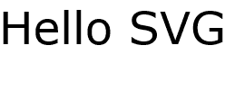
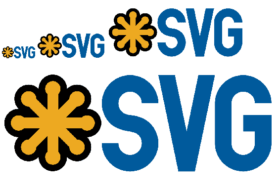
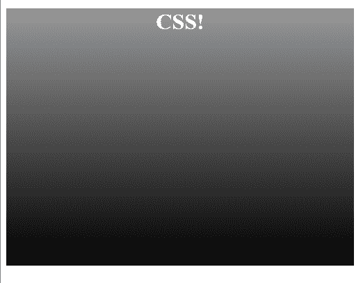
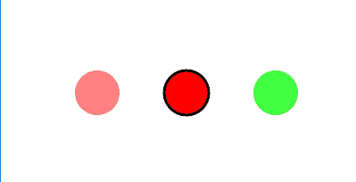

# 一、可伸缩矢量图形简介

**可伸缩矢量图形**(**SVG**)是现代 web 开发中最强大的组件之一。 如果使用得当，它可以解决与图像和用户界面的设计、开发和传递相关的常见问题

SVG 是一种基于 xml 的标记语言，用于定义图像。 SVG 之于图像，就像 HTML 之于文本。

SVG 非常灵活。 它可以作为独立的图像实现，并作为图像的`src`或作为 CSS(如 PNG、GIF 或 JPG)中的背景图像使用。 它还可以直接嵌入到 HTML 页面中，并使用 CSS 或 JavaScript 进行操作，以创建动画、可视化和交互式图表。

那么，如果 SVG 那么重要，而且可以做这么多事情，为什么它没有得到更广泛的应用呢? 为什么感觉我们只是触及了它的可能性的表面? 为什么它仍然感觉像一个*新*的东西?

问题是，并不是每个人都知道 SVG 所能做的一切，也不是每个知道 SVG 所能做的一切的人都能以最佳方式实现 SVG 解决方案。 本书旨在帮助对使用 SVG 感兴趣的每个人克服这些障碍并掌握这一重要技术。

SVG 在现代 web 开发技术中有着迂回曲折的地位。 SVG 发布于 1999 年(比 XHTML 还要早)，由于当时占主导地位的 Internet Explorer 浏览器缺乏支持，SVG 停滞了 10 年。 这项技术在几年前开始受到 JavaScript 库(如 Raphaël)的青睐，它为旧版本的 IE 添加了编程回退支持，此后这一趋势越来越强。 谢天谢地，形势已经完全扭转。 所有现代版本的 Internet Explorer 和 Edge 都支持 SVG，而且所有浏览器制造商都强烈支持该技术，当然包括 Chrome 和 Firefox。

在本章结束时，您将了解 SVG 的多种形式的基础知识。 您将能够使用现有的 SVG 图像，并在 web 页面和 CSS 中使用它们，您将很好地迈向掌握 SVG 的希望之乡。

本章将涵盖以下主题:

*   介绍基本 SVG 语法和矢量图形
*   使用 SVG 作为图像的`src`文件的原因和方法
*   基本使用 SVG 作为 CSS 背景图像
*   直接在文档中嵌入 SVG 的好处和区别
*   对 Modernizr 和特征检测的简要介绍

# 创建一个简单的 SVG 图像

如果您对 HTML 很熟悉，那么 SVG 文档的基础知识也会很熟悉。 因此，让我们先解开这个谜团，看看一个简单的 SVG 文档。

下面的代码示例展示了 SVG 的基本结构。 第一个元素是标准的`xml`声明，表示应该将以下内容解析为 XML 文档。 第二个元素是乐趣开始的地方。 它定义了根 SVG 元素(与 HTML 文档中存在根 HTML 元素的方式相同)。 `height`和`width`定义了文件的内在维度。 ****XML****Name*S*pace**(**xmlns**)是对定义当前 XML 元素的模式的引用。 你将在下一章更详细地了解`viewBox`。 SVG 元素上还可以有许多其他属性。 通过这本书，你会学到更多。**

 **在第一个示例中，在 SVG 元素之后，有一个 SVG`text`元素。 与 SVG 元素一样，`text`元素具有许多可能的属性，您将在阅读本书时了解这些属性。 在本例中，有四个属性与元素的显示相关。 `x`和`y`属性将文本元素的左上角的位置表示为坐标平面上的点。 `font-family`映射到相同名称的熟悉的 CSS 属性，并定义应该用于显示文本的特定字体。 `font-size`也映射到相同名称的公共 CSS 属性。

The attributes that accept *length values* (in this example `width`, `height`, and `font-size`) are provided without a unit (for example, `px`, `em`, and `%`.) When these values are presented as attributes, the unit is optional. If no unit is provided, the values are specified as being user units in the user space. You'll learn more about the way that values are calculated in SVG throughout the book. For now, just remember that, in practice, user units will be equivalent to pixels.   

最后是`text`元素的内容，即简单的消息 Hello SVG:

```html
<?xml version="1.0" encoding="UTF-8"?>
<svg width="250" height="100" viewBox="0 0 250 100" version="1.1" xmlns=”http://www.w3.org/2000/svg”>
<text x="0" y="50" font-family="Verdana" font-size="50">
    Hello SVG
  </text>
</svg>
```

保存为`1-1-hello-world.svg`并在浏览器中打开，之前的标记呈现如下截图:



现在您已经看到了 SVG 文档的最基本示例，接下来让我们以各种方式了解 SVG 图像和元素的基本用法。

# 使用 SVG 作为内容图像

在本节中，您将了解 SVG 图像的最基本用法，使用它的方式与使用 JPG、PNG 或 GIF 作为`img`元素的`src`相同。 如果您曾经使用过 HTML，那么您就会知道如何做到这一点，因为它只是一个图像元素，但是您应该开始考虑使用 SVG 的*和*的所有不同方式，这是一个很大的问题。

看看下面的代码示例，`img`元素没有什么特别之处。 有一个`src`指向 SVG 图像，`height`和`width`定义图像的尺寸，还有一个`alt`属性为屏幕阅读器和其他图像可能无法显示的情况提供图像的文本表示:

```html
<!doctype html>
<html lang="en">
    <head>
        <meta charset="utf-8">
        <title>Mastering SVG - Inserting an SVG Image into an HTML
         Document</title>
    </head>
    <body>
      
    </body>
</html>
```

在浏览器中运行上述代码会显示以下内容:


One thing that might be a slight problem is that not all web servers, by default, set the correct MIME type for SVG. If the MIME type is set incorrectly, some browsers will not display the SVG image correctly. As one common example, Microsoft's IIS may need a specific configuration setting changed ([https://docs.microsoft.com/en-us/iis/manage/managing-your-configuration-settings/adding-ie-9-mime-types-to-iis](https://docs.microsoft.com/en-us/iis/manage/managing-your-configuration-settings/adding-ie-9-mime-types-to-iis)) to properly serve SVG images. The correct MIME type is `image/svg+xml.`

# 图的代码

在了解其他基本实现之前，有必要更深入地看一看前面的截图。 它不像第一个示例那样仅仅是文本(毕竟，您可以用 HTML 完成)，它显示了在画布上对角排列的四个圆圈。 让我们看看该图像的来源并学习 SVG 中的第一个可视元素`circle`元素。

下面的代码示例展示了实际的`circle`。 它还展示了标记属性值的简单更改如何创建有趣的可视化模式。 其中有五个`circle`元素。 这些都利用了四个新属性。 `cx`和`cy`表示元素在坐标平面上的中心*x*和中心*y*坐标。 表示圆的半径。 定义了填充`circle`的颜色。 `fill`接受任何有效的 CSS 颜色值([https://developer.mozilla.org/en-US/docs/Web/CSS/color_value](https://developer.mozilla.org/en-US/docs/Web/CSS/color_value))。 在本例中,我们使用一个红色**,**绿色**、**蓝色**,****α**(**RGBA)值与变化填补这一纯红色。 前几个值保持不变，而第四个值 alpha 每次从`.125`翻倍到`1`(完全不透明)。 同样，`cx`，`cy`，和`r`每次翻倍。 这将产生您前面看到的模式。 这不是最精致的 SVG 图像，但它确实向你展示了基本的 SVG 元素是多么容易使用和理解:******

```html
<?xml version="1.0" encoding="UTF-8"?>
<svg width="250" height="250" viewBox="0 0 250 250" version="1.1" >
       <circle cx="12.5" cy="12.5" r="6.25" fill="rgba(255,0,0,.125)">
       </circle>
       <circle cx="25" cy="25" r="12.5" fill="rgba(255,0,0,.25)">
       </circle>
       <circle cx="50" cy="50" r="25" fill="rgba(255,0,0,.5)"></circle>
       <circle cx="100" cy="100" r="50" fill="rgba(255,0,0,.75)">
       </circle>
       <circle cx="200" cy="200" r="100" fill="rgba(255,0,0,1)">
       </circle>
</svg>
```

# 可伸缩+矢量图形

现在您已经看到了一个使用 SVG 创建图形的示例，花点时间解释一下 SVG 中的*VG*，以及为什么这样可以调用文件格式。

对于光栅(位图)文件格式，您可能熟悉 JPG、PNG 或 GIF 等格式。 您可以将图像数据看作是逐像素存储的，因此图像中的每个点都存储在文件中，并由浏览器或图形程序逐像素、逐行读出。 图像的大小和质量受到创建时的大小和质量的限制。

There are optimizations for all the bitmapped file formats that limit the actual amount of data stored. For example, GIFs use the LZ77 algorithm to collapse redundant pixels down to a backpointer and reference pixel. Imagine if your image has `100` pixels of pure black in a row. The algorithm will search through the image for a sequence of same-bytes and when a sequence is encountered, the algorithm will search backwards through the document to find the first instance of that pattern. It will then replace all those pixels with instructions (a backpointer) on how many characters back to search and how many pixels to copy to fill in the number of same-bytes. In this case, it would be `100` (pixels to search) and `1` (pixels to copy).

另一方面，矢量图形由矢量和控制点定义。 为了明显地简化，您可以将向量图形看作是描述直线形状的一组数字。 它们可能是一组特定的点，也可能是一组关于如何创建特定类型的对象的指令(如前面的圆)。 `circle`元素并不存储组成圆的每个像素。 它存储用于创建圆的*参数*。

为什么这很酷? 一个原因是，因为它只是一组定义形状的指令，您可以向内或向外缩放，而渲染引擎将相应地计算新值。 因此，矢量图形可以在不损失保真度的情况下无限缩放。

如果这些都让你感到困惑，不要担心。 你使用它们的次数越多，你就越熟悉矢量图形的工作方式。 同时，下面的一组例子和图表将有助于说明两者的区别。 首先，看一下下面的标记。 它表示四个图像，使用完全相同的 SVG 图像作为源。 图像表示 SVG 标志。 尺寸设置为图像的自然大小，然后是`2x`，`4x`，`8x`，图像的自然大小:

```html
      
      
      
      
```

在浏览器中呈现的标记产生以下结果。 注意，直到`8x`，也就是原来的尺寸，它都是脆的:



现在，看看相同的标记，这次使用的是 png。 它遵循相同的模式:

```html
      
      
      
      
```

但现在，看看结果。 请注意，在自然级别上，SVG 和 PNG 之间没有区别。 PNG 中的像素足够匹配 SVG 版本中向量定义的行。 另外，注意图像如何随着图像变大而逐渐变差。 浏览器无法从位图格式中获得更多信息(更多像素)来填充更大尺寸的细节。 它只是将像素放大，但结果却很糟糕(尤其是在`8x`级别):


# 在 CSS 中使用 SVG

SVG 的一种常见用法是在 CSS 中作为背景图像。 在**响应式网页设计**(**RWD**)中，这种方法在文件大小和可伸缩性方面都有好处。 在当今的多设备、多形式因素的世界中，在各种设备大小和分辨率(包括高像素密度设备)下提供高质量图像的能力是很重要的。 虽然有光栅显示图像优化解决方案(在`picture`的形式元素和`srcset`和`sizes`属性),你可以使用媒体查询在 CSS 呈现不同的图像或图像大小,所有设备的能力做一个图像是巨大的。 CSS 中的 SVG 使我们能够轻松地做到这一点

虽然您将在[第 5 章](05.html)、*中了解 SVG 和 CSS 的交集，但是现在让我们看一个基本的示例来激发您的兴趣。*

下面的页面有一个带有类标题的`div`标记。 这里唯一需要注意的是，在`background`属性的`url`值中引用了一个 SVG 文件:

```html
<!doctype html>
<html lang="en">
    <head>
        <meta charset="utf-8">
        <title>Mastering SVG- Using SVG images in CSS</title>
        <style type="text/css">
            .header {
                color: #ffffff;
                background: url(1-3-gradient.svg) repeat-x;
                width: 500px;
                height: 40px;
                text-align: center;
            }
        </style>
    </head>
    <body>
      <div class="header"><h1>CSS!</h1></div>
    </body>
</html>
```

这段代码在浏览器中运行时会产生以下结果。 这个简单的示例与任何其他 CSS 实现没有什么不同，它将缩放到每英寸显示的最高点，而不会损失梯度中的平滑度。 这可以简单地通过使用 SVG 实现:


# 在 SVG 梯度

随着您继续学习 SVG 的基本用法，我将继续探讨编写 SVG 本身的新概念。 我将介绍的下一个特性是定义(`defs`)部分、`gradient`元素和`rect`元素。

下面的示例显示了前一个示例中的 SVG 元素的源。 根元素`svg`之外的所有内容都与前面的示例不同。

首先是`defs`元素。 是一个组织元素，用于保存文档中稍后将使用的图形对象的定义。 我们立即遇到了`linearGradient`元素，它定义了(你猜对了!)一个线性梯度。 `x1`、`x2`、`y1`、`y2`定义了梯度的*梯度向量*。 你将在[第二章](05.html)，*中学习更多关于 SVG 和 CSS*，但是现在，只需要知道它定义了梯度的方向。 默认的左边是`0`，右边是`1`。 将`x2`设置为`0`和`y2`设置为`1`将从水平的从左到右的渐变变为垂直的从上到下的渐变。

渐变的外观实际上定义为子`stop`元素。 每个都有两个属性，`offset`和`stop-color`。 偏移量接受百分数或`0`到`1`之间的数字，表示梯度停止点在梯度向量的总和上的位置。 这个例子最简单:一种颜色在`0%`，另一种在`100%`。 `stop-color`接受任何有效的颜色值:

```html
<svg width="10" height="40" viewBox="0 0 10 40" version="1.1" >
 <defs>
 <linearGradient id="gradient" x1="0" x2="0" y1="0" y2="1">
 <stop offset="0%" stop-color="#999999"/>
 <stop offset="100%" stop-color="#000000"/>
 </linearGradient>
 </defs>
 <rect x="0" y="0" width="10" height="40" fill="url(#gradient)"/>
</svg>
```

因为这些只是关于如何渲染梯度的说明，在这种情况下，可以拉伸和移动背景图像，保真度为零。 浏览器将计算新的值，并呈现一个新的，完美的渐变。

下面的例子展示了对 CSS 的一个调整，将头部扩展为浏览器高度的一半(使用`vh`单元)，并强制头部背景图像填充可用空间(`background: size: contain`):

```html
<!doctype html>
<html lang="en">
 <head>
   <meta charset="utf-8">
   <title>Mastering SVG- Using SVG images in CSS</title>
   <style type="text/css">
  .header {
   color: #ffffff;
   background: url(1-3-gradient.svg) repeat-x;
   width: 500px;
   height: 50vh;
   text-align: center;
   background-size: contain;
  }
  </style>
 </head>
 <body>
   <div class="header"><h1>CSS!</h1></div>
 </body>
</html>
```

正如你在下面的截图中看到的，相同的背景图像处理的大小与飞行的颜色。 对于可以使用 SVG 完成的其他任何事情，这都是真的(您将了解到)。



# 直接将 SVG 嵌入到 HTML 文档中

在我看来，SVG 最令人兴奋的用法是作为 HTML 文档中的内联元素。 虽然您将了解 SVG 图像作为一种单独的文件格式，以及 SVG 图像可用于开发现代 web 应用的所有方法，但本书的大部分内容将向您展示如何与嵌入到文档中的 SVG 元素进行交互。 这一点很重要，因为无法对外部引用的 SVG 文件中的单个元素进行动画或操作; 这只有在 SVG 元素可以直接(通过页面上的**文档对象模型**(**DOM**))时才可能。

下面的例子展示了一个简单的内联 SVG 图像，带有三个圆圈，并展示了使用内联 SVG 时最强大的工具之一:CSS! 可以使用 CSS 对 SVG 元素设置样式，就像对普通 HTML 元素设置样式一样。 这打开了一个充满可能性的世界。 这里使用的属性对您来说可能是新的，因为它们是特定于 SVG 的，但是就像您习惯使用的`background-color`或`border`属性一样，您可以使用 CSS 调整 SVG 元素的基本外观。 在下一个示例中，CSS 为所有圆定义默认的`fill`颜色，将`border`添加到第二个圆，然后更改第三个圆的`fill`颜色。 如果你还没有设计使用 CSS 操作 SVG 元素的方法，请放心，在阅读了[第 5 章](05.html)，*使用 SVG 和 CSS*后，你会有很多想法:

```html
<!doctype html>
<html lang="en">
    <head>
        <meta charset="utf-8">
        <title>Mastering SVG - Using SVG images in CSS</title>
        <style type="text/css">
            circle {
              fill: rgba(255,0,0,1);
            }
            .first {
              opacity: .5;
            }
            .second {
              stroke-width: 3px;
              stroke: #000000;
            }
            .third {
              fill: rgba(0,255,0,.75);
            }
        </style>
    </head>
    <body>
      <svg width="400" height="250" viewBox="0 0 400 250" version="1.1"
       >
        <circle cx="100" cy="100" r="25" class="first"></circle>
        <circle cx="200" cy="100" r="25" class="second"></circle>
        <circle cx="300" cy="100" r="25" class="third"></circle>
        </svg>
    </body>
</html>
```

打开浏览器会显示所有 CSS 的结果:



# 特征检测和 Modernizr

虽然目前全球 web([https://caniuse.com/#search=svg](https://caniuse.com/#search=svg))对 SVG 的总体支持非常高，但并不统一，仍然有不支持 SVG 的浏览器。 这就是功能检测库 Modernizr 的用处所在。 如果您的用户基础很广，或者您正在使用较新的(甚至是实验性的)特性，那么您可以使用 Modernizr 来检测浏览器与重要特性的兼容性，并相应地调整代码。

有两种方式。 一个是 Modernizr 可以放置在 HTML 元素上的类。 另一个是全局 Modernizr 对象，它以*布尔*的形式包含所有测试的结果。 在我们继续之前，我将向您展示这两种工具的实例。

Modernizr 项目提供数百个测试。 由于某些测试非常昂贵(就计算所需的资源而言，在使用 Modernizr 时，您希望只使用应用所需的测试。 在本例中，我创建了一个特定的 Modernizr 构建，它只测试多个 SVG 特性。 当添加到 HTML 页面时，该文件将向 HTML 元素添加类，表明对各种 SVG 特性的支持

下面是 Microsoft Edge 中 HTML 元素的输出。 `no-smil`类表示 Edge 不支持**同步多媒体集成语言**(**SMIL**)，但是支持我们测试的所有其他内容:

```html
<html class=" svg svgclippaths svgforeignobject svgfilters
 no-smil inlinesvg svgasimg" lang="en">
```

输出从最新的 Chrome 版本表明支持所有测试功能:

```html
<htmlclass=" svg svgclippaths svgforeignobject svgfilters smil 
 inlinesvg svgasimg" lang="en" >
```

最后是 Internet Explorer 8 (IE8)，它完全不支持 SVG:

```html
<HTML class=" no-svg no-svgclippaths no-svgforeignobject no-svgfilters 
 no-smil no-inlinesvg no-svgasimg" lang="en">
```

使用这些类可以让你，作为一个简单的例子，为 CSS 背景图片在 IE8 中提供一个 PNG`fallback`函数:

```html
<!doctype html>
<html lang="en">
    <head>
        <meta charset="utf-8">
        <title>Mastering SVG- Modernizr</title>
        <style type="text/css">
            .header {
                color: #ffffff;
                background: url(1-3-gradient.svg) repeat-x;
                width: 500px;
                height: 40px;
                text-align: center;
            }
            .no-svg .header {
                background: url(1-3-gradient.png) repeat-x;
              }
        </style>
    </head>
    <body>
      <div class="header"><h1>CSS!</h1></div>
    </body>
</html>
```

如前所述，Modernizr 还公开了一个全局的 Modernizr JavaScript 对象，其中每个测试都是布尔值。 下面的例子展示了如何访问这个布尔值，并在代码中使用一个`if`语句，具体取决于是否支持 SVG:

```html
<!doctype html>
<html lang="en">
    <head>
        <meta charset="utf-8">
        <title>Mastering SVG- Monderizr JavaScript Object</title>
        <script src="modernizr-custom.js"></script>
      </head>
    <body>
      <script>
        if (Modernizr.svg){
          // do things with SVG
        } else {
          //create a non-SVG fallback
        }
      </script>
    </body>
</html>
```

总的来说，本书的其余部分将不关注旧浏览器的`fallbacks`，但是如果您正在一个需要支持广泛的浏览器和设备的环境中工作，那么知道它们是可用的是很有用的。

# 总结

在本章中，我们了解了 SVG 的基础知识，包括几个 SVG 特定的元素，如`circle`、`text`，以及用于生成 SVG 渐变的元素。 我们还学习了在 HTML 文档中使用 SVG 以及在 CSS 中作为背景图像的几种方法。

我们还学习了 Modernizr 特性检测库，以及如何使用它为不支持 SVG 或特定 SVG 特性的浏览器创建`fallbacks`。

在[第 2 章](02.html)、*开始编写 SVG*中，您将了解更多 SVG 特性，扩展您编写 SVG 文档的知识。********