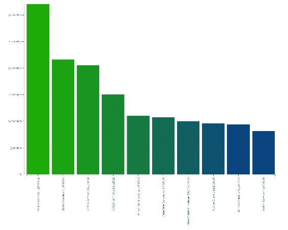
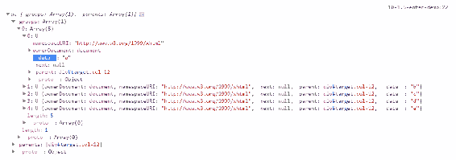
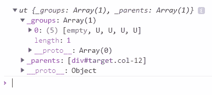
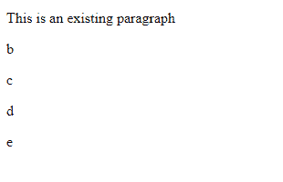
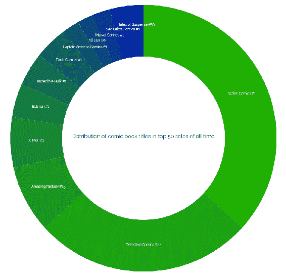

# 十、使用 D3.js

ahis 章节将向您介绍**Data-Drive Documents**(**D3**)，一个强大的可视化库，也是世界上最受欢迎的开源项目之一。 有趣的是，虽然 D3 的数据操作功能非常重要，但它只是处理 SVG 的最强大的库之一，仅此而已。 即使在上下文的`helper`排序在前面的章节中,我们讨论了图书馆,它有很多非常有用的特性使用 SVG 文档,包括许多复制的东西`Snap.svg`和 SVG.js 提供更多的不止于此。

然而 D3 还不止于此。 它超越了 SVG 创作和实用工具特性集，并提供了一套丰富的工具来进行数据操作和后续生成数据可视化。 更重要的是，D3 使用了与你在整本书中所使用的相同的网络标准，并将其与健壮的 API 结合起来，为 SVG 和数据提供了一个真正的游乐场。

D3 诞生于一个更早的可视化库 Protovis([http://mbostock.github.io/protovis/](http://mbostock.github.io/protovis/))，从 2010 年代早期就开始了，并一直处于项目最初的开发者 Mike Bostock 的监视之下。 该项目正在积极开发中，并提供了丰富的文档和可供学习的优秀示例。

一旦你掌握了窍门，它也会带来很多乐趣。 这是本书中介绍的最后一种用于直接使用 SVG 的新技术，因此很高兴在本书的这一阶段结束时取得了突出的效果。

让我们找点乐子吧。

在本章中，我们将学习几个主题，包括:

*   如何安装 D3 和如何做基本的 SVG 操作与库
*   如何使用刻度和函数来帮助定义图表的*x*和*y*轴的 D3 柱状图
*   如何使用`d3-fetch`实用程序来获取和解析 JSON 和 CSV 数据
*   如何使用`enter`和`exit`选择操作基于数据集更改的 SVG DOM
*   如何使用 D3 中的`arc`和`pie`函数在 D3 中实现一个甜甜圈图
*   如何实现和弦图; 具有多个组件的复杂可视化

# 从 D3 开始

D3 API 需要一些时间来适应。 本章中的例子将努力阐明一些基本概念，并随着我们进一步深入展示 D3 提供的一些最好的。

在我们做这些之前，你需要把 D3 放到你的页面上。 为此，你可以使用`npm`将其安装到你的项目文件夹中:

```html
npm install d3
```

一旦你安装了它，你可以使用一个脚本标签从你的文档链接到最小化的 D3 源代码:

```html
<script src="node_modules/d3/dist/d3.min.js"></script>
```

如果你不喜欢使用`npm`，也可以直接从[d3js.org](https://d3js.org/)链接到它:

```html
<script src="https://d3js.org/d3.v5.js"></script>
```

此外，如果你想要一个本地副本，你可以从 GitHub([https://github.com/d3/d3)](https://github.com/d3/d3)克隆项目，或者从[d3js.org](https://d3js.org/)下载项目，然后以任何你喜欢的方式组织你的文件。

一旦安装了项目，就可以开始研究 D3 API 了。

下面的示例展示了如何使用 D3 实现一个简单的条形图。 在这本书中，你已经看到了一些用于生成条形图的概念，但这里的不同之处在于 D3 会为你做这件事。 D3 知道所有的可视化，所以它将为您生成所需的指标。

这幅图将比较历史上最畅销的十本漫画书。 它将举例说明的数据([https://itsalljustcomics.com/all-time-record-comic-book-sales/](https://itsalljustcomics.com/all-time-record-comic-book-sales/))如下:

| **标题/问题#/等级** | **销售日期** | **销售价格** |

| 动作漫画 1 9.0 | 2014/08/24 | $3207852.00 |
| 动作漫画 1 9.0 | 2011/11/30 | $2161000.00 |
| 动作漫画 1 8.5 | 2018/06/13 | $2052000.00 |
| 动作漫画 1 8.5 | 2010/03/29 | $1500000.00 |
| 6 .奇幻奇想 15 | 2011/03/09 | $1100000.00 |
| 侦探漫画 27 8.0 | 2010/02/25 | $1075000.00 |
| 动作漫画堪萨斯城 8.0 | 2010/02/22 | $1000000.00 |
| 动作漫画 1 5.5 | 2016/08/04 | $956000.00 |
| 全明星漫画 8 | 2017/08/27 | $936223.00 |
| 动作漫画 1 5.0 | 2018/03/20 | $815000.00 |

可视化的最终结果如下图所示:



All JavaScript code in this chapter is written to take advantage of ES6 features, such as arrow functions, const, and let.

接下来的标记非常简单。 我们再次包括 Bootstrap 的简单布局任务和`Raleway`，我们的字体选择在这本书。 然后我们为文本元素设置一些基本的 CSS 样式，并设置一个简单的容器来保存可视化。 在那之后，我们包括三个文件:`d3.min.js`，主 D3 文件`d3-fetch.min.js`，从 D3 获取工具([https://developer.mozilla.org/en-US/docs/Web/API/Fetch_API)](https://developer.mozilla.org/en-US/docs/Web/API/Fetch_API))，以及我们的可视化文件`bar.js`:

```html
<!doctype html>
<html lang="en">

<head>
 <meta charset="utf-8">
 <title>Mastering SVG- D3 Bar Chart</title>
 <link rel="stylesheet" 
   href="https://maxcdn.bootstrapcdn.com/bootstrap/4.0.0/css/bootstrap.
    min.css" integrity="sha384-
    Gn5384xqQ1aoWXA+058RXPxPg6fy4IWvTNh0E263XmFcJlSAwiGgFAW/dAiS6JXm"
    crossorigin="anonymous">
 <link href="https://fonts.googleapis.com/css?family=Raleway" 
    rel="stylesheet">
 <style type="text/css">
  text {
   font-family: Raleway;
   font-size: 1em;
  }
 </style>
</head>

<body>
 <div class="container">
  <div class="row">
   <div class="col-12" id="target">

   </div>
  </div>
 </div>
 <script src="node_modules/d3/dist/d3.min.js"></script>
 <script src="node_modules/d3-fetch/dist/d3-fetch.min.js"></script>
 <script src="_assets/js/bar.js"></script>
</body>
</html>
```

由于这里的 JavaScript 很复杂，并且引入了许多新概念，所以我将分别介绍每个块。 如果您想一次性查看整个文件，请查看下载的源代码中的完整文件。

请看`bar.js`，它由一个在屏幕上绘制整个可视化的函数组成。 函数集的开始几个常量使用整个可视化:`width`,`height`,`chartHeight`(用于设置图表的大小本身的大小和整体 SVG),和一个`margin`常量用来确保有足够的保证金将整个可视化的 SVG 元素:

```html
function bar() {
  const width = 960,
    height = 800,
    chartHeight = 600,
    margin = 30;
```

在此之后，我们开始直接与 D3 打交道。 D3 允许您访问和操作现有的 SVG 元素，并且，就像本书中的 D3 演示一样，生成一个 D3 增强的 SVG 元素并将其附加到 DOM 中。

在本例中，我们使用 D3 的查询选择器实用工具`d3.select`来选择`#target`元素，然后将一个新的 SVG 元素追加到其中。 然后，我们使用越来越熟悉的命名函数`attr`来设置 SVG 元素的`height`和`width`。 一旦 SVG 元素出现在文档中，我们就添加一个新的`g`元素，并立即通过*x*和*y*轴上的`margin`对其进行翻译。

链式 D3 方法的行为类似于 jQuery 或其他使用这种模式的库，因此变量`svg`是链中最后一个元素(即新添加的`g`)的一个支持 D3 的引用。 与该变量相互作用的任何事物都将从该`g`元素的上下文中开始:

```html
 let svg = d3.select("#target").append("svg")
    .attr("width", width)
    .attr("height", height)
    .append("g")
    .attr("transform", `translate(${margin},${margin})`);
```

接下来，我们使用一些方法来设置*x*和*y*轴的刻度，然后实际生成*x*和*y*轴。 这就是 D3 真正的亮点所在。 做这项工作并非不可能。 这通常是简单的数学。 只是没有人想要一直编写这些函数，而 D3 通过一套完整的缩放函数([https://github.com/d3/d3-scale](https://github.com/d3/d3-scale))使它变得简单。

变量`x`保存着`scaleBand`方法调用的返回值。 `scaleBand`允许您将数字刻度分成*波段*分量，我们将使用它来创建条形图的水平间距。 初始调用与两个随后的调用相连接，每个调用都将我们特定的可视化信息告知 band。 `range`方法调用将*x*缩放范围设置为`10`像素到计算出的上限(`width`减去两个水平边距)。 `paddingInner `设置带子的内垫。 这个属性允许我们在列之间创建一些空间。

变量 T0 是作为线性尺度创建的。 线性尺度是两个值之间连续的、规则的尺度。 这个特定刻度的值是通过调用`range`设置的，其中`chartHeight`和`0`作为范围值。

接下来，我们使用新创建的`x`和`y`量表调用两个方便方法`axisLeft`和`axisBottom`。 这些方法为刻度提供人类可读的参考标记。 创建`xAxis`，然后传入刚刚创建的`x`刻度，将`xAxis`与`x`刻度的值连接起来。 `y`轴的生成方式完全相同:

```html
 let x = d3.scaleBand()
    .range([10, (width - margin.left - margin.right)])
    .paddingInner(0.1);
  let y = d3.scaleLinear()
    .range([chartHeight, 0]);
  let xAxis = d3.axisBottom()
    .scale(x);
  let yAxis = d3.axisLeft()
    .scale(y);

```

然后，我们使用另一种比例方法`scaleOrdinal`来创建离散数据值和相应的一组颜色之间的映射:

```html
 let color = d3.scaleOrdinal()
    .range([
      "#1fb003",
      "#1CA212",
      "#199522",
      "#178732",
      "#147A41",
      "#126C51",
      "#0F5F61",
      "#0C5170",
      "#0A4480",
      "#073690"
    ]);

```

该方法的其余部分使用来自`d3-fetch`和`d3.json`的实用程序访问数据文件，然后通过`callback`获取请求，处理数据并生成我们的可视化。

`callback`方法首先调用`x`和`y`轴上的`domain`。

对于顺序刻度，`xAxis`和`domain`接受一个数组，并将刻度的域设置为数组中特定的一组值。 这里，我们使用`map`返回的`data`来创建一个`title`属性的集合，作为`xAxis`中使用的值。

对于线性比例尺，调用`domain`将连续比例尺限制为特定的值集。 在本例中，我们将缩放值设置为最小值`0`，并将返回数组中最大值的`d3.max`的返回值设置为最大值。

接下来，我们开始操作 SVG 元素来创建实际的可视化。

第一组链式方法附加一个新的 SVG 组元素`g`，并向其添加一对类`x`和`axis`，然后将其转换为点(`0`，`chartHeight`)。 这就把这一组放在图表的底部，这正是您希望*x*-轴的图例所在的位置。

然后使用`d3.call`函数调用`xAxis`并生成*x*-轴。 `d3.call`是一个实用方法，它允许您在选择上调用函数，然后返回修改后的选择。 这允许您以支持链接的方式将某些功能封装在可重用的功能中。 在这里，我们调用`xAxis`，即前面创建的配置的`axisBottom`方法，以便创建*x*-轴——包含组成*x*-轴的所有元素。 不做任何其他事情，*x*-轴现在看起来如下所示:


如您所见，对于某些值，这种布局可能没问题，但对于我们的目的，它不是功能性的。 由于标题的长度，我们需要调整标签以使其清晰。 把它们旋转 90 度。

为此，我们将更多的方法链接到当前的链上。 首先，我们`select`当前选择的所有`text`子节点。 这些都是我们刚刚用`xAxis`创建的`text`元素。 一旦我们有了这个选择，我们就对文本元素应用-90 度的转换。 这将把`text`重新定位为垂直。 接下来，我们调整`dx`和`dy`属性，使文本整齐地对齐。

接下来，我们添加一个新的`g`元素。

Using these groups is not strictly necessary, but they help to organize the generated code for debugging and allow you to more easily create selections that are easy to manipulate. This is what groups are for.  

这个新的`g`元素将保持*y*轴。 *y*-轴的创建方式与*x*-轴类似——尽管这是一个更简单的过程，因为不需要操作文本元素。 对于*y*轴来说，水平文本布局很好。 在这个调用中，我们将类添加到`g`、`y`和`axis`元素中，然后调用`yAxis`，这将生成组成*y*轴的所有元素。

这个`callback`函数中的最后一个方法链演示了在 D3 中工作时的一个常见模式。 第一个呼叫是`d3.selectAll`。 `selectAll`将访问*所有与所提供的选择器匹配的*元素。 这个返回值在 D3 中称为*选择*。 选择可以是 DOM 元素列表，在本例中，也可以是与数据项匹配的占位符元素数组。 因此，在这个上下文中，empty 是可以的，因为我们将通过操作选择并根据接收到的数据向其添加元素的过程。

我们将说明`enter`和相关方法,`exit`,更深入地在下一节中,但简而言之,如果你选择元素少于点数据集的数量,然后这些额外的数据存储在称为*的输入选择【5】。 调用`enter`允许我们进入并操纵这个输入选择。 在本例中，我们向 SVG 元素添加了许多`rect`元素。*

这些`rect`元素的操作方式如下:

*   它的`fill`是参照`color`刻度的成员设置的。
*   `x`属性是基于`x`刻度的成员创建的。
*   使用`x-bandwidth`计算`width`，这是一种方法，它取`x`刻度中的成员，并基于该刻度计算宽度，包括任何定义的填充。
*   `y`属性是基于之前创建的`y`比例创建的
*   通过从`chartHeight`中减去该数据点的*y*刻度值来计算`height`。 这实际上是将框从`y`值挂到了图表的底部。

所有这些属性结合起来创建可视化的核心:

```html
  d3.json("data/top-ten.json").then((data) => {
    x.domain(data.map((d) => {
      return d.title;
    }));
    y.domain([0, d3.max(data,(d) => {
      return d.price;
    })]);
    svg.append("g")
      .attr("class", "x axis")
      .attr("transform", `translate(0, ${chartHeight})`)
      .call(xAxis)
      .selectAll("text")
      .style("text-anchor", "end")
      .attr("transform", "rotate(-90)")
      .attr("dx", -10)
      .attr("dy", -5);
    svg.append("g")
      .attr("class", "y axis")
      .call(yAxis);
    svg.selectAll("rect")
      .data(data)
      .enter().append("rect")
      .style("fill", (d) => {
        return color(d.price);
      })
      .attr("x", (d) => {
        return x(d.title); })
      .attr("width", () => {
        return x.bandwidth();
      })
      .attr("y", (d) => {
        return y(d.price);
      })
      .attr("height", (d) => {
        return chartHeight - y(d.price);
      });
  });
}
bar();
```

文件的最后一行简单地调用`bar()`来创建可视化。

# D3 的进出

正如我在上一节中提到的，我想简单快速地看一下`enter`和相关的方法`exit`。 这些方法对于处理动态数据集很重要。 通过这些方法，您可以进行任意选择，将其与数据混合，然后使用 D3 的工具对其进行操作，以创建可视化。

在本节中，您将看到三个示例。 第一个示例展示了使用`enter`的示例，说明了在一个完全空的选择中调用该方法。 第二个例子演示了使用现有元素对一个选择调用`enter`。 第三个例子说明了`exit`的工作原理。

在第一个例子中，我们选择`#target`元素，然后以`p`作为参数调用`selectAll`。 因为`#target`元素中没有段落，所以这是一个空选择。 调用`data`将空选择绑定到我们的数据上。 对绑定选择调用`enter`允许我们基于每个数据点操作选择。

如果在此时注销`d3.select("#target").selectAll("p").data(data).enter()`的返回值，它将如下截图所示，显示一个包含五个元素的数组，其中原始数据存储为内部的`__data__`属性:



接下来，我们简单地`append`为每个数据点在文档中添加一个段落，并使用`text`方法将表示数据的文本节点插入到文档中:

```html
<!doctype html>
<html lang="en">

<head>
  <meta charset="utf-8">
  <title>Mastering SVG- D3 Enter</title>
</head>

<body>
  <div class="container">
    <div class="row">
      <div class="col-12" id="target">

      </div>
    </div>
  </div>
  <script src="node_modules/d3/dist/d3.min.js"></script>
  <script src="node_modules/d3-fetch/dist/d3-fetch.min.js"></script>
  <script>
    function enter() {
      const data = ["a", "b", "c", "d", "e"];
      d3.select("#target")
        .selectAll("p")
        .data(data)
        .enter().append("p")
        .text((d) => d);
    }
    enter();

  </script>
</body>

</html>
```

在浏览器中运行代码会得到以下输出:


下一个例子与此类似，除了它在`#target div`中有一个段落元素。 因为存在一个现有的`p`元素，所以对选择调用`d3.select("#target").selectAll("p").data(data).enter()`会产生以下输出。 如您所见，`_groups`数组有五个相同的成员，但是第一个条目(即与`selection`中现有成员对应的条目)是空的。 这是因为它不是 enter 选择的一部分(因为它对应于现有的*元素):*



这个例子的其他内容与前面使用`enter`的例子相同:

```html
<!doctype html>
<html lang="en">

<head>
  <meta charset="utf-8">
  <title>Mastering SVG- D3 Enter with existing content</title>
</head>

<body>
  <div class="container">
    <div class="row">
      <div class="col-12" id="target">
        <p>This is an existing paragraph</p>

      </div>
    </div>
  </div>
  <script src="node_modules/d3/dist/d3.min.js"></script>
  <script src="node_modules/d3-fetch/dist/d3-fetch.min.js"></script>
  <script>
    function enter() {
      const data = ["a", "b", "c", "d", "e"];
      d3.select("#target")
        .selectAll("p")
        .data(data)
        .enter()
        .append("p")
        .text((d) => d);
    }
    enter();

  </script>
</body>

</html>
```

因为我们在这个例子中只更新了 enter 选择，所以在浏览器中运行前面的代码会产生以下输出:



要更新*整个*选择，您只需要在更新输入选择之前操作原始选择:

```html
      const data = ["a", "b", "c", "d", "e"];
      d3.select("#target")
        .selectAll("p")
        .data(data)
        .text((d) => d)
        .enter()
        .append("p")
        .text((d) => d);
```

选择`exit`可以清理不再有数据关联的元素。 下面的示例展示了这是如何工作的。

`render`函数最初经过一些我们已经看到的模式。 该函数对`#target div`的子元素`p`调用`selectAll`，向其加载数据，输入 enter 选择，并添加一系列带有正确数据的段落元素。

接下来我们重复这个过程，不再调用`enter`，而是调用`exit`，然后立即调用`remove`。 `exit`选择返回选择中不对应于数据点*的任何元素。* `remove`从文档中删除这些元素。 第一次运行时，没有删除任何元素，因为数据刚刚加载。 选择中的所有元素都使用适当的数据填充。

有趣的事情发生在`setTimeout`。 在这个`callback`函数中，如果仍然有数据数组的成员，则调用`data.pop()`。 `pop`从数组中移除最后一个元素，然后调用`render`，在`1`之后递归调用。 当函数再次运行时，我们到达退出选择，在那里我们调用`exit.remove`，有*是*数据和选择之间的不匹配。 第一次递归调用时，有五个段落，但只有四个数据点。 因为第五段没有与之相关的数据点，所以将其从文档中删除。

这个过程不断重复，直到没有数据点或段落剩下，并且停止递归调用:

```html
<!doctype html>
<html lang="en">

<head>
  <meta charset="utf-8">
  <title>Mastering SVG- D3 Exit</title>
</head>

<body>
  <div class="container">
    <div class="row">
      <div class="col-12" id="target">

      </div>
    </div>
  </div>
  <script src="node_modules/d3/dist/d3.min.js"></script>
  <script>
      const data = ["a", "b", "c", "d", "e"];
      function render(){
        d3.select("#target")
          .selectAll("p")
          .data(data)
          .enter()
          .append("p")
          .text((d) => d );
        d3.select("#target")
          .selectAll("p")
          .data(data)
          .exit()
          .remove();
        if (data.length) {
          setTimeout(()=>{
            data.pop();
            render();
          }
          ,1000);
        }
      }
    render();
  </script>
</body>

</html>
```

希望这些简单的例子(处理最简单的元素，一个简单的段落)足以说明这个非常强大的模式如何帮助处理数据集。

现在我们已经看了这两种方法，让我们回到一些更有趣的东西，用一个新的，稍微复杂一点的可视化。

# 使用 D3 实现一个甜甜圈图

下一个示例演示了另一个基本数据可视化:在本例中，是一个甜甜圈图。 这个可视化图比饼状图稍微复杂一些，它展示了 D3 的一些新特性。 完成后，可视化将如下截图所示。

它代表了单个漫画书(通过标题和发行号来参考)在历史上销量最高的 50 本漫画书(公开销售，在写作时)中的发行情况。 有一些漫画在排行榜上占据了主导地位，下面的图表将展示哪些漫画在排行榜上占据了主导地位:



数据看起来像下面的 CSV:

```html
title,numbers
"Action Comics #1",18
"All Star #8", 1
"Amazing Fantasy #15",4
"Batman #1",2
"Captain America Comics #1", 1
"Detective Comics #27",13
"Flash Comics #1", 2
"Incredible Hulk #1", 2
"Marvel Comics #1", 1
"Sensation Comics #1", 1
"Tales of Suspense #39", 1
"X-Men #1", 3
```

HTML 文件非常简单。 它同样包括`Raleway`、Bootstrap、`d3-fetch`和 D3。 它包含了我们在本书中几个示例中使用的相同标记，然后包含了我们的`donut.js`文件，其中发生了所有有趣的事情:

```html
<!doctype html>
<html lang="en">

<head>
    <meta charset="utf-8">
    <title>Mastering SVG- D3 Chord Diagram</title>
    <link rel="stylesheet" 
href="https://maxcdn.bootstrapcdn.com/bootstrap/4.0.0/css/bootstrap.min.css" integrity="sha384-Gn5384xqQ1aoWXA+058RXPxPg6fy4IWvTNh0E263XmFcJlSAwiGgFAW/dAiS6JXm"
        crossorigin="anonymous">
    <link href="https://fonts.googleapis.com/css?family=Raleway" 
     rel="stylesheet">
    <style type="text/css">
        text {
            font-family: Raleway;
            font-size: .8em;
            text-anchor: middle;
            fill: #fff;
        }
        text.legend{
            font-size: 1.25em;
            fill: #000;
        }
    </style>
</head>

<body>
    <div class="container">
        <div class="row">
            <div class="col-12" id="target">

            </div>
        </div>
    </div>

    <script src="node_modules/d3/dist/d3.min.js"></script>
    <script src="node_modules/d3-fetch/dist/d3-fetch.min.js"></script>
    <script src="_assets/js/donut.js"></script>

</body>

</html>
```

查看`donut.js`，有很多内容正在进行，因此我们将再次一节一节地浏览该文件。 如果你想看到整个文件，请查看完整的源代码。

该文件首先为可视化的`height`、`width`和`radius`设置几个常量。 然后我们创建一个颜色比例，步骤通过 13 个深浅的蓝色和绿色:

```html
const width = 1000,
  height = 1000,
  radius = Math.min(width, height) / 2;

const color = d3.scaleOrdinal()
  .domain(d3.range(13))
  .range([
    "#1fb003",
    "#1CA212",
    "#199522",
    "#178732",
    "#147A41",
    "#126C51",
    "#0F5F61",
    "#0C5170",
    "#0A4480",
    "#073690",
    "#05299F",
    "#021BAF",
    "#000EBF"
  ]);
```

接下来的两个方法调用只是为以后的可视化进行设置。 在这一点上，我们没有任何数据来处理，但是我们仍然可以创建一些加载的 D3 工具来处理到达的数据。 第一个常量`arc`将允许我们使用`outerRadius`绘制弧，该弧接近 SVG 元素的边缘，而`outerRadius`处有`innerRadius 200`像素。 这样就产生了一个 190 像素的圆环。

接下来我们调用`d3.ie`，这是一个获取数据并返回`arc`s 的方法，这些数据代表饼图或甜甜圈图的正确比例数据切片。 我们还没有数据，但我们将方法设置为知道在创建`arc`s 时使用数据对象的`numbers`属性:

```html
const arc = d3.arc()
  .outerRadius(radius - 10)
  .innerRadius(radius - 200);

const pie = d3.pie()
  .value((d) => {
    return d.numbers;
  });
```

接下来，我们开始实现一些 SVG。 到目前为止，第一个调用对您来说应该是常见的。 我们调用`d3.select`来获取`#target`元素，然后将 SVG 元素追加到 DOM 中。 然后使用`attr`设置`height`和`width`，然后将一个组`g`元素添加到 SVG 文档中。 然后将`g`转换到 SVG 元素的中心，将其转换为 SVG 元素的一半宽度和一半高度。

接下来，我们向包含可视化小图例的`g`元素添加一个新的`text`元素:

```html
let svg = d3.select("#target").append("svg")
  .attr("width", width)
  .attr("height", height)
  .append("g")
  .attr("transform", `translate(${width / 2},${height / 2})`);

svg.append("text")
  .text("Distribution of comic book titles in top 50 sales of all time.")
  .attr("class","legend");

```

现在我们已经完成了所有的设置，现在是处理一些数据并绘制可视化的时候了。 我们开始使用来自`d3-fetch`、`d3.csv`的另一种方法来获取包含我们的数据的 CSV 文件，并在 D3 解析后使用它。

在`callback`内部，有现在熟悉的 D3 模式。 首先，有一个对`svg.selectAll("arc")`的调用，此时返回一个空选择。 然后调用`data`，传入`pie(data).``pie`接收数据并返回我们将用于甜甜圈图的开始和结束角度。 接下来进入 enter 选择并为选择的每个成员添加`g`元素。 我们还没有绘制任何东西，但我们已经为每个数据点设置了组，并计算了应用于数据集的起始和结束角度。

下一节将演示如何使用 D3。

现在，我们已经得到了调用`pie`生成的角度，并将其附加到一些空的`g`元素上。 在接下来的调用中，我们附加一个`path`元素，并且通过对之前创建的`arc`方法的调用，我们用绘制可视化所需的完整`arc`填充`d`属性。 这就是全部。

对于图表本身，现在所剩下的就是通过返回我们之前创建的颜色比例的值来填充圆弧的填充。 这是根据数据的索引来选择的。 这些数据是根据其在漫画书名中的排名排序的。 这创建了我们运行这个可视化时看到的漂亮的渐变。 如果你停在这里，你实际上会有一个视觉效果。 它不会有任何文本关联，但你会有一个漂亮的甜甜圈图表。 这就是 D3 的力量。

也就是说，我们应该添加一些标签，让我们看看它是如何工作的。 最初的模式是您应该开始熟悉的模式。 我们调用`selectAll(".label")`，用数据加载它(由另一个调用`pie`操作以获得相同的开始和结束角度)，然后在输入选择中操作它。 在输入选择中，我们添加一个`text`元素，然后执行几个步骤将文本放置在整个可视化中有用的位置。

第一步是使用`arc.centroid`方法将位于`arc`中心的文本元素翻译出来。 再一次，这是 D3 多么有用的一个很好的例子。 一个小电话就可以让你进入一个复杂形状的几何中心。 这适用于大多数文本元素。 我们几乎完成了。

我们只需要在两个特定的情况下调整文本。 如果没有下一个调用，文本在可视化的最后几个元素中以不吸引人的方式重叠，如下截图所示:


为了调整这两个重叠元素的位置，我们需要找出它们是哪一个。 我们知道它们是最后两个，而且它们将接近圆的末端。 这里的角度是用弧度来衡量的(360 度是 2PI 或 6.28 弧度左右)。 使用一个切片的粗略简写(0.125 弧度在我们的可视化中大致表示一个切片)，我们从完整的圆往回工作以测试最后两个切片，并使用`dy`属性稍微调整它们。 第一个按`.6em`调整。 下一个，也是最后一个，text 元素由`1.5em`调整。 这意味着每个标签都是清晰的。

最后一个调用实际上是通过调用`text`和数据的`title`作为参数将文本添加到元素中:

```html
d3.csv("data/top-fifty-comics-data.csv").then((data) => {
  let g = svg.selectAll(".arc")
    .data(pie(data))
    .enter()
    .append("g");

  g.append("path")
    .attr("d", arc)
    .style("fill", (d) => {
      return color(d.index);
    });

  svg.selectAll(".label")
    .data(pie(data))
    .enter()
    .append("text")
    .attr("class", "text")
    .attr("transform", (d) => {
      return `translate(${arc.centroid(d)})`;
    })
    .attr("dy", (d) => {
      if (d.startAngle > 6.0 && d.startAngle < 6.125) {
        return "-.6em";
      } else if (d.startAngle > 6.125) {
        return "-1.5em";
      }
    })
    .text((d) => {
      return d.data.title;
    });

});
```

现在我们已经做了两个标准图表，现在来做一个更有趣的，和弦图。 最后一个例子将说明 D3 的更多特性。 它会很有趣。

# 在 D3 中实现一个和弦图

最终的可视化在数据和编码方面都更加复杂。 该可视化基于几年前发布的数据，这些数据是 Hubway 数据可视化挑战([http://hubwaydatachallenge.org/](http://hubwaydatachallenge.org/))的一部分。 这是一个大型数据集，代表了波士顿 Hubway 自行车共享项目(现在被称为“蓝色自行车”)的每一次出行，包括出发地和到站。 这个可视化显示了前 10 个最受欢迎的站点之间的关系，说明了前 10 个站点之间发生的旅行次数。 这是有趣的看到哪些主要的中心说明公共交通网络中潜在的漏洞(很多人正在旅行交通枢纽之间像北站和南站)或可能被游客去看风景在波士顿(许多南站旅行返回到南站)。

最终的视觉效果是这样的。 每个`arc`代表一个出发站，两个站之间的缎带表示两个站之间的相对重量。 当它离开`arc`时，条形图的宽度表示旅行的次数。 `arc`的颜色归车站所有，这两个车站之间产生了更多的旅行:


与其他 D3 示例一样，用于此可视化的 HTML 非常简单。 我们在头部有`Raleway`和 Bootstrap。 然后在顶部有一个 CSS 块，用于添加一些文本样式，以及一个小定义，用于为小刻度添加描边颜色，以显示沿圆周外边缘的刻度数字。

此外，还有一个带有描述可视化的图例的`H1`。 然后我们只包括 D3 主文件和可视化文件。 所有重要的事情都发生在`chord.js`:

```html
<!doctype html>
<html lang="en">

<head>
    <meta charset="utf-8">
    <title>Mastering SVG- D3 Chord Diagram</title>
    <link rel="stylesheet" 
href="https://maxcdn.bootstrapcdn.com/bootstrap/4.0.0/css/bootstrap.min.css" integrity="sha384-Gn5384xqQ1aoWXA+058RXPxPg6fy4IWvTNh0E263XmFcJlSAwiGgFAW/dAiS6JXm"
        crossorigin="anonymous">
    <link href="https://fonts.googleapis.com/css?family=Raleway" rel="stylesheet">
    <style type="text/css">
    h1 {
        font-family: Raleway;
    }
    text {
        font-family: Raleway;
        font-size: 1em;
    }
    text.tick {
        font-size: .8em;
        fill: #999;
    }
    .group-tick line {
        stroke: #999;
    }
    </style>
</head>

<body>
    <div class="container-fluid">
        <div class="row">
            <div class="col-12" id="target">
                <h1>Trip connections between the top 10 Hubway 
                    departure stations. Data from the
                    <a href="http://hubwaydatachallenge.org/">Hubway 
                     Data Visualization Challenge</a>
                </h1>

            </div>
        </div>
    </div>

    <script src="node_modules/d3/dist/d3.min.js"></script>
    <script src="_assets/js/chord.js"></script>

</body>

</html>
```

让我们从数据开始看看`chord.js`。 文件的顶部为整个可视化提供了硬编码的数据。 这是一个更大的数据集的精馏，在这种可视化的原始版本中，需要编写大量代码以创建可视化所需的特定格式的数据。 生成这些数据的代码可以在 GitHub 上找到，还有本书的其他源代码。

弦图需要一个*方阵*。 这是一个数组的数组，其中数组中的成员总数与子数组中的成员总数匹配，您可以在它们之间进行映射。 在我们的示例中，父数组表示一个*出发*站，而子数组的值表示到每个*到达*站的总行程。 子数组的下标与父数组的下标匹配。 出发站也可以是到达站。

`names``const`保存每个出发站的名称，与`matrix`数组中出发站的索引匹配:

```html
function drawChord() {
  const names = [
    "South Station",
    "TD Garden",
    "Boston Public Library",
    "Boylston St. at Arlington St",
    "Back Bay / South End Station",
    "Charles Circle",
    "Kenmore Sq / Comm Av",
    "Beacon St / Mass Av",
    "Lewis Wharf",
    "Newbury St / Hereford S"
  ];
  const matrix = [
    [2689, 508, 1170, 189, 1007, 187, 745, 248, 263, 2311],
    [1064, 121, 830, 323, 2473, 393, 453, 312, 533, 599],
    [506, 296, 813, 530, 988, 540, 1936, 578, 747, 268],
    [706, 311, 1568, 526, 1273, 371, 618, 694, 481, 227],
    [178, 701, 277, 176, 663, 227, 379, 284, 330, 111],
    [550, 270, 548, 445, 196, 769, 868, 317, 1477, 195],
    [344, 141, 468, 955, 172, 346, 502, 388, 415, 97],
    [333, 207, 455, 545, 196, 1322, 618, 254, 659, 62],
    [655, 120, 301, 90, 2368, 108, 226, 99, 229, 875],
    [270, 221, 625, 436, 239, 278, 548, 1158, 320, 90]
  ];
```

现在我们已经整理好了数据，让我们开始看看如何生成实际的可视化。 前五个代码块都是用于设置的。 一般来说，D3 就是这样做的，这个比其他的要复杂一些所以需要更多的设置。

第一个块只涉及为可视化所需的各种指标创建常量。 `width`和`height`在所有 D3 例子中都很常见。 `radius`是一个计算值，它表示一个圆的完整半径，该半径将适合由高度和宽度创建的正方形。 const 用于计算可视化的实际圆的`outerRadius`。 然后用`outerRadius`计算`innerRadius`。

接下来，我们将开始与 D3 直接合作。 第一个调用是`d3.chord`，其结果存储在 const`chord`中。 `chord`是一个加载的方法，它会用我们的设置生成一个和弦图。 第一个设置,`padAngle`,`radians`参数指示`arc`年代之间的空间,这样一个复杂的可视化,很高兴有一个小空间之间的`arc`年代为了带来一些清晰的单独的部分。 第二个设置指示是否要对子组进行排序。 在我们的例子中，我们确实需要这样做，所以我们传入`d3.descending`作为预定义的排序。

下一个变量`arc`用我们计算的`innerRadius`和`outerRadius`加载一个`d3.arc`实例，就像甜甜圈图一样。 一旦你开始把这些东西看作可以组合在一起的组件，可能性就会出现。

接下来，我们将创建一个 D3`ribbon`的实例，其中`innerRadius`作为唯一的配置设置，作为参数传递给`radius`方法。 该方法与`chord`方法一起用于创建可视化的核心，将连接缎带的两端连接起来，在我们的示例中，这是出发站和到达站。

最后，我们创建了一个`color`比例尺，将各个车站映射成一组彩虹颜色:

```html
const width = 1200,
    height = 1200,
    radius = Math.min(width, height) / 2,
    padding = 200,
    outerRadius = radius - padding,
    innerRadius = outerRadius - 25;

  const chord = d3.chord()
    .padAngle(0.025)
    .sortSubgroups(d3.descending);

  const arc = d3.arc()
    .innerRadius(innerRadius)
    .outerRadius(outerRadius);

  const ribbon = d3.ribbon()
    .radius(innerRadius);

  const color = d3.scaleOrdinal()
    .domain(d3.range(9))
    .range([
      "#e6194b",
      "#ffe119",
      "#0082c8",
      "#f58231",
      "#911eb4",
      "#46f0f0",
      "#f032e6",
      "#d2f53c",
      "#808000",
      "#008080"
    ]);
```

现在我们已经设置了所有这些，现在是在屏幕上实现可视化的时候了。 第一个块现在应该很熟悉了。 在其中，我们选择`#target`元素，添加一个 SVG 元素，然后设置其`width`和`height`。

下一个块也应该很熟悉。 在其中，我们将`g`组添加到 SVG 元素，然后将其转换到屏幕中心。 这里有趣的一点是对`datum`的调用，它是一种非常类似于`data`的方法，只是它沿着树一路传播数据。 在这里，我们传入我们的实例`chord`和`matrix`，并且`chord`方法返回用于数据可视化的构建块。

本节的最后一个块创建组，用于保存弧段、路径和组刻度。 我们进入`enter`选择，并为`matrix`的每个条目附加一个子元素`g`:

```html
  const svg = d3.select("#target")
    .append("svg")
    .attr("height", height)
    .attr("width", width);

  const g = svg.append("g")
    .attr("transform", `translate(${width / 2},${height / 2})`)
    .datum(chord(matrix));

  const group = g.append("g")
    .attr("class", "groups")
    .selectAll("g")
    .data((chords) => chords.groups)
    .enter()
    .append("g");
```

至此，我们已经完成了设置的*所有*。 现在，是时候在屏幕上绘制一些元素了。

添加到可视化的第一个部分是`arc`s。这个模式在甜甜圈图表中很熟悉。 这是完全相同的模式; 这里只是一个更大的可视化的一部分。

The `group` variable is *already part of an* Enter selection so both this and the next section, where we add the legends, are already operating on the full dataset. 

首先，我们添加一个`path`，并将`path`的`d`属性设置为调用`arc`的结果。 这将返回切片开始和结束的角度。 然后我们给它一个`fill`和`stroke`。 `stroke`提供了我们对 D3 的另一个实用程序的初步了解。 D3。 color([https://github.com/d3/d3-color](https://github.com/d3/d3-color))提供了几种与颜色一起工作的选择。 这里，我们使用`d3.color.darker`来返回为`arc`选择的稍暗的颜色，以便给它足够的对比度来显示边缘。 最后，我们添加了两个事件处理程序，允许用户将鼠标悬停在该站点的弧线上，并淡出所有其他站点的弧线和缎带。 这将允许他们检查这个特定的站点的连接，而不受任何其他站点的干扰。 我们稍后会详细讨论这个特性。

接下来我们加入丝带。 这是与`arc`非常相似的模式。 我们从核心`g`组开始，并向其添加一个新组，添加一个类缎带。 然后我们调用`selectAll("path")`来得到一个选择，调用`data`来应用和弦数据，然后我们进入`enter`选择来构建缎带。 对于数据集的每个成员，我们附加一个新的`path`，并通过调用`ribbon`设置路径的`d`属性。 `ribbon`的返回值创建一条路径，将`arc`一侧的两个角连接到`arc`另一侧的两个角。 在那之后，我们以与弧线相同的方式设置`stroke`和`fill`，所以一切都匹配:

```html
  group.append("path")
    .attr("d", arc)
    .style("fill", (d) => color(d.index))
    .style("stroke", (d) => d3.color(color(d.index)).darker())
    .on("mouseover", fade(.1))
    .on("mouseout", fade(1));

  g.append("g")
    .attr("class", "ribbons")
    .selectAll("path")
    .data((chords) => chords)
    .enter()
    .append("path")
    .attr("d", ribbon)
    .style("fill", (d) => color(d.source.index))
        .style("stroke", (d) => {
      return d3.color(color(d.source.index)).darker();
    });
```

此时，可视化被绘制到屏幕上。 但我们还是可以做得更好，所以我们就这么做吧。

下一节为每个站点添加小标签。 和前面一样，我们已经在一个输入选择中，所以我们已经在正确的数据集上操作。 该链中的第一个调用是`each`，它允许我们在选择的每个成员上运行一个函数。 传入的`callback`函数向数据集添加了一个新属性`angle`。 `angle`的计算方法是将`arc`的起始角和结束角相加，除以 2，得到`arc`的中间位置。 我们将在下一次调用中使用这个角度来放置标签。

我们为甜甜圈图表所做的标签位于`arc`之上。 对于我们建立的和弦图和很长的文本标签来说，这看起来不太好，所以我们要把标签移出圆圈。 我们用三角函数来做。

下面的图表显示了这是如何工作的。 所有这些`text`元素都在 SVG 元素中心的组中。 我们希望将它们移动到它们的新位置，与它们所标记的弧线的中部一致的圆外。 要做到这一点，我们使用我们计算的`d.angle`性质，并使用它作为直角三角形的斜边(最长的边)。 一旦我们知道了这个角，我们就可以计算正弦(对边长度与斜边长度之比)和余弦(邻边长度与斜边长度之比)。 一旦我们有了这些比率，我们只需将它们乘以`outerRadius`(加上一些额外的像素以给它一些空间)，就可以得到三角形的邻边和对边的长度。 我们使用这些值作为将文本元素转换到新位置所需的*x*和*y*。

这个技巧在任何时候都会派上用场:


下一节根据文本元素在`arc`上的位置调整`text-anchor`属性。 如果超过一半(在一个圆有两个π弧度,所以`Math.PI`相当于大半圈),然后我们需要设置`text-anchor``end`为了平衡的标签右边的圆。 如果我们不以这种方式调整文本锚，可视化左侧的文本元素将与右侧的弧线重叠。

最后，我们添加文本本身:

```html
group.append("text")
    .each((d) => d.angle = (d.startAngle + d.endAngle) / 2)
    .attr("text-anchor", (d) => {
      if (d.angle > Math.PI) {
        return "end";
      }
    })
    .attr("transform", (d) => {
      const y = Math.sin(d.angle) * (outerRadius + 10),
        x = Math.cos(d.angle) * (outerRadius + 20);
      return `translate(${y},${(-x)})`;
    })
    .text((d) => {
      return names[d.index];
    });
```

我们将为此可视化执行的最后一个 SVG 元素是将组 ticks 和 tick 标签添加到外部边缘。 这将使我们能够以一种友好的方式，以成千上万的方式显示可视化的规模。

我们首先创建一个新的 const`groupTick`，它根据调用`groupTicks`方法返回的数据建立一个新的输入选择。 `groupTick`从链中获取现有数据，并返回一个新操作的数据集，表示每 1,000 个单位对应一个新的滴答。 这些新的`groupTick`数据条目有一个新的角度，对应于 tick 在圆弧上的正确位置，并有一个对原始数据`value`的引用。 返回`groupTick`数据后，我们进入选择，追加一个新组并添加一个类`group-tick`。 然后将元素旋转到可视的外边缘，并将其转换为`outerRadius`上的一个点。

完成之后，我们在每一次标记时添加一个 6 像素长的灰色`line`。 记住，在这个新链中，`groupTick`仍然处于输入选择中，因此即使我们打破了之前的链，我们仍然可以对每个数据点进行操作。

最后,我们又进入选择`filter`数据,防止空数据,然后测试值是否能被 5000 整除,没有剩余使用取模运算符(或其他)([https://developer.mozilla.org/en-US/docs/Web/JavaScript/Reference/Operators/Arithmetic_Operators Remainder_()](https://developer.mozilla.org/en-US/docs/Web/JavaScript/Reference/Operators/Arithmetic_Operators#Remainder_()))。 如果它能被 5000 整除，我们需要添加一些文本来表明我们已经达到了 5000 次。 如下所示。 调整`x`属性，使其远离`outerRadius`。 调整`dy`属性，将文本元素向上移动一点，以便更好地与滴线对齐。

如果角度超过圆的中点，则转换`text`元素。 再次，我们对`Math.PI`进行测试，然后，如果它超过了中点，我们将文本`rotate`180 度，然后将其翻译为负 16 像素，以使其很好地适合于`outerRadius`的边缘。 我们还进行了相同的测试，以查看`text`元素是否超过了圆的中点，如果超过了中点，则更改`text-anchor`属性，将文本的右边缘固定到圆的边缘。 最后，我们将类`ticks`添加到`text`元素中，并使用`d3.formatPrefix`添加实际文本。 `d3.formatPrefix`格式化数字以使其更友好地表示值。 `d3.formatPrefix`返回一个函数，该函数根据提供的格式化参数格式化数字。

在本例中，我们希望使用 SI(单位制)前缀([https://en.wikipedia.org/wiki/Metric_prefix#List_of_SI_prefixes](https://en.wikipedia.org/wiki/Metric_prefix#List_of_SI_prefixes))格式化数字，这将把`5000`转换为`5k`:

```html
  const groupTick = group.selectAll(".group-tick")
    .data((d) => groupTicks(d, 1000))
    .enter()
    .append("g")
    .attr("class", "group-tick")
    .attr("transform", (d) => {
      return `rotate(${(d.angle * 180 / Math.PI - 90)}) translate(${outerRadius},0)`;
    });

  groupTick.append("line")
    .attr("x2", 6);

  groupTick
    .filter((d) => d.value && !(d.value % 5000))
    .append("text")
    .attr("x", 8)
    .attr("dy", ".35em")
    .attr("transform", (d) => {
      if (d.angle > Math.PI) {
        return "rotate(180) translate(-16)";
      }
    })
    .style("text-anchor", (d) => {
      if (d.angle > Math.PI) {
        return "end";
      }
    })
    .attr("class", "tick")
    .text((d) => d3.formatPrefix(",.0", 1000)(d.value));

  function groupTicks(d, step) {
    let k = (d.endAngle - d.startAngle) / d.value;
    return d3.range(0, d.value, step).map((value) => {
      return {
        value: value,
        angle: value * k + d.startAngle
      };
    });
  }
```

最后的代码是前面提到的`fade`方法。 这个函数选择所有与 CSS 选择器匹配的元素。 `.ribbons path`过滤掉任何与当前选择相关的元素，并将其`opacity`设置为所提供的`opacity`参数:

```html
  function fade(opacity) {
    return function(g, i) {
      svg.selectAll(".ribbons path")
        .filter((d)=> {
          return d.source.index !== i && d.target.index !== i;
        })
        .transition()
        .style("opacity", opacity);
    };
  }
```

效果如下截图所示:


到这里，和弦图就完成了。 这不是你在 D3 中看到的最复杂的可视化，但它很好。 再加上甜甜圈图和条形图，这三者结合起来说明了 D3 的许多重要特征。

# 总结

本章将向您介绍 D3 的世界。 虽然这一章很深入，但它只是触及了 D3 所提供内容的表面。 希望你能利用在这里学到的知识，在未来的岁月里继续尝试。 这是一个值得掌握的工具。

在这本书中，我们只剩下一个简短的章节，我们将讨论一些优化 SVG 在 web 上服务的方法。 至少应该了解一些这方面的知识，特别是当您在站点或应用程序中大量使用 SVG 时。