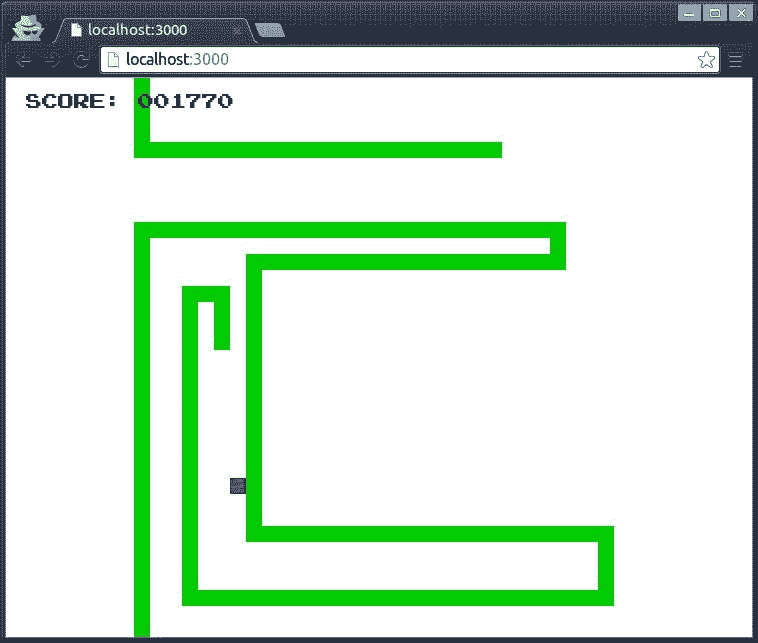
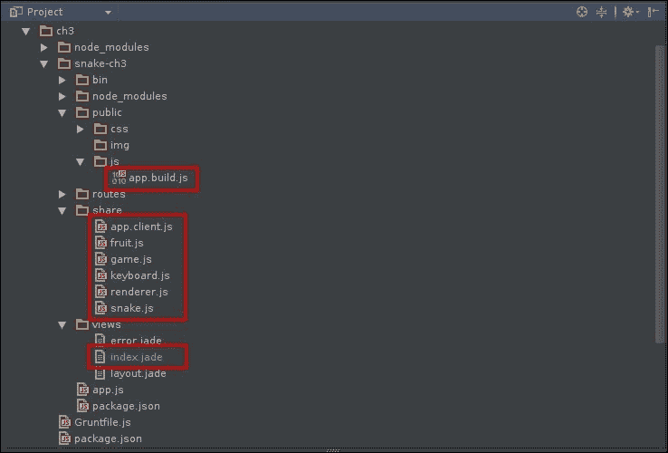
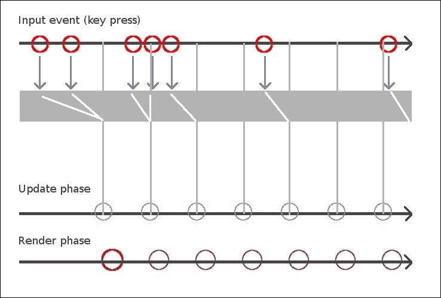
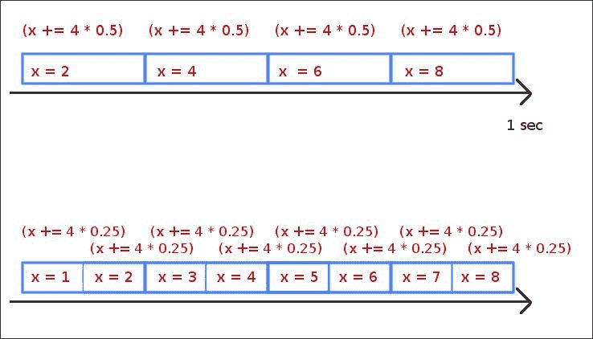
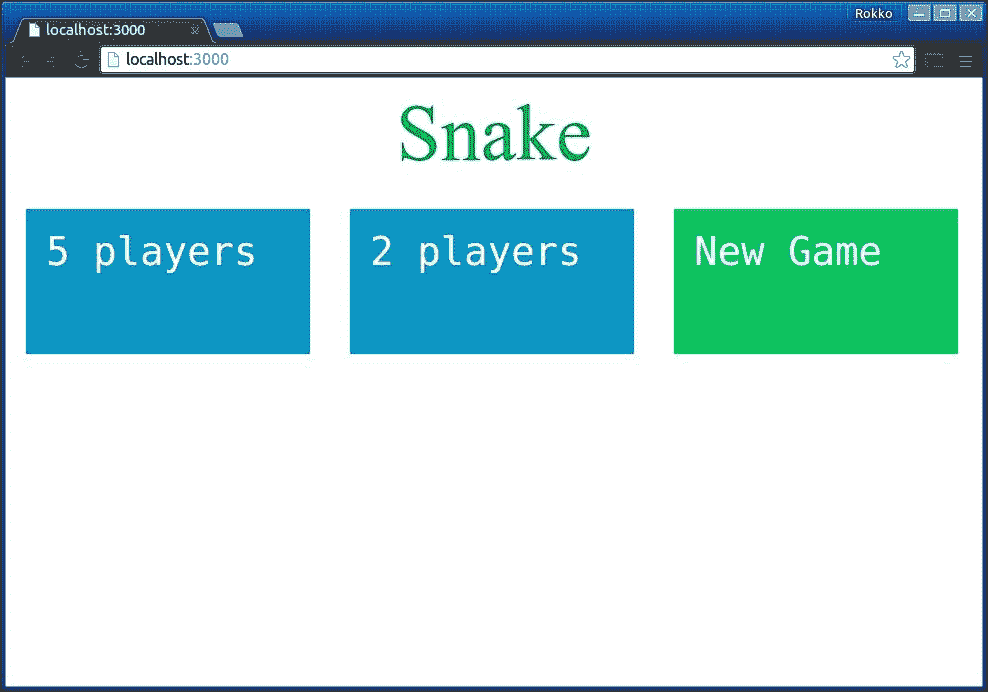

# 三、实时贪食蛇

在覆盖了介绍性材料之后，现在是时候让橡胶上路了。本章将带领你完成单人游戏升级为多人游戏的过程。

与我们在[第 1 章](1.html#aid-DB7S2 "Chapter 1. Getting Started with Multiplayer Game Programming")、*多人游戏编程入门*中开发的游戏不同，这款游戏将需要实时进行，而不是以回合为基础，这给桌面带来了一整套挑战。一旦我们解决了与在两个或更多玩家之间同步实时游戏世界相关的基本问题，我们将研究其他基本的、更复杂的概念。

在本章中，我们将讨论以下原则和概念:

*   修复多人游戏的游戏循环
*   实现权威服务器
*   大厅和房间系统
*   匹配算法
*   使用 **Socket.io** 进行套接字编程

# 游戏开发的 Hello world

当然，你在学习编程的时候一定写过一个 *hello world* 程序。在游戏开发中，我会说经典的 *hello world* 游戏每个开发者都应该从是蛇开始。概念很简单:在屏幕上移动一个块，收集特殊的块，使你的块延伸成一系列连接的块，类似于蛇的运动。如果你把蛇头伸进它的身体，你就输了。



这个实现只允许蛇向上、向下、向左或向右移动。一旦你指定了蛇移动的方向，它就会继续朝那个方向移动，直到你朝不同的方向移动它。作为一个额外的好处，这个特殊的实现允许你环绕屏幕——也就是说，如果你移动到屏幕的一侧之外，蛇将出现在另一侧。

抓住一个红色的方块会让蛇多长一个方块，让你的分数增加 10 分。运行蛇到它自己停止游戏循环，打印一个简单的游戏结束信息。

为了简化这个初始版本，没有任何附加屏幕，包括一个主入口屏幕。游戏在完全加载后就开始了。当我们在这个单人游戏版本的基础上进行构建时，我们将添加所需的屏幕，这将使多个玩家加入游戏变得更加直观和用户友好。

## 设置游戏

这个游戏的初始单人版本的目标是通过使用我们可以建立的最基本的模型，用尽可能少的代码行来制作一个可玩的游戏。因此，许多额外的细节留给你作为练习。

为了准备下一步，我们将向游戏中添加服务器端组件，我们已经使用 Node.js 编写了游戏的第一个版本，并使用 Browserify 将其导出到浏览器，如[第 2 章](2.html#aid-J2B81 "Chapter 2. Setting Up the Environment")、*设置环境*中所述。

### package.json

为了与让一切尽可能简单的主题保持一致，我们将使用一个`package.json`文件，该文件只需要 **Express** 框架来帮助我们路由，并使用 Grunt 插件来帮助我们使用浏览器自动构建和导出我们的模块:

```html
// ch3/package.json
{
    "name": "snake-ch3",
    "dependencies": {
        "express": "*",
        "express-generator": "*"
    },
    "devDependencies": {
        "grunt": "~0.4.5",
        "grunt-browserify": "~3.4.0",
        "grunt-contrib-uglify": "~0.8.0",
        "grunt-contrib-watch": "~0.6.1"
    }
}
```

### 注

**Express.js** 是 Node.js 的一个 web 框架，它允许我们非常快速地设置整个 web 服务器来托管和服务我们的游戏。(参考[http://expressjs.com/](http://expressjs.com/)。)虽然 Express 在我们的项目中起着主要作用，因为它路由用户对适当文件的请求，但理解它是如何工作的并不是本章或本书其余部分的先决条件。我们将涵盖足够多的绝对基础知识，让您开始使用这个强大的框架。

有了所有这些，我们使用快速命令行工具来构建项目。

```html
npm install
express snake-ch3
cd snake-ch3
npm install

```

在执行了前面的命令序列之后，我们已经用所有 Express 的缺省值设置了我们的样板 Node.js 服务器，对于我们的目的来说，这将会很好地工作。如果任何事情因为任何原因出错，将会有足够的错误消息来帮助你理解为什么以及问题是什么。假设在您输入前面的命令后一切似乎都很好，现在您可以通过使用以下命令启动您的服务器来测试项目:

```html
npm start

```

这将在端口`3000`上启动服务器，您可以在`http://localhost:3000/`上将其加载到您选择的现代浏览器上。



项目结构现在看起来像前面截图中的结构，除了包含在红色框中的文件不会由快速生成器生成。我们将手工创建和编辑这些文件，正如您将在接下来的几节中看到的。

### 指数.翡翠

默认情况下，Express 将创建一个显示欢迎消息的索引文件。因为我们现在只需要一个屏幕来显示游戏，所以我们只需要为自己的目的编辑这个文件:

```html
// ch3/snake-ch3/views/index.jade
extends layout

block content
  div#gameArea
    p#scoreA SCORE: <span>000000</span>
    p#gameOver.animated.pulse.hidden Game Over
    canvas#gameCanvas
    div#statsPanel
  script(src='/js/app.build.js')
```

如果你仔细看，你会看到 HTML 标记。如果你不熟悉快递默认使用的玉石模板语言，不用担心。我们在模板中所做的是创建一个`<p>`元素，我们将在其中显示当前的分数，一个用于游戏结束消息，以及一个画布元素，我们将使用它来渲染游戏。我们还包括主脚本文件，它是咕噜任务的输出，该任务连接了我们所有的文件，并对它们运行 Browserify，以便我们可以在浏览器中加载它。由于`index.jade`是我们在这本书里唯一能看到的翡翠，我们就不再深入了。欲了解更多关于翡翠如何工作以及它能做什么的信息，请访问其位于[http://www.jade-lang.com](http://www.jade-lang.com)的网站。

## 游戏模块

有了前面的结构，我们现在只需要几个实现游戏的类。我们将在五个类中这样做，以便我们在实现游戏服务器时可以重用的单个逻辑。

### Game.js

下面是我们将如何实现我们的`game.js`文件:

```html
// ch3/snake-ch3/share/game.js
var Game = function (fps) {
    this.fps = fps;
    this.delay = 1000 / this.fps;
    this.lastTime = 0;
    this.raf = 0;

    this.onUpdate = function (delta) {
    };
    this.onRender = function () {
    };
};

Game.prototype.update = function (delta) {
    this.onUpdate(delta);
};

Game.prototype.render = function () {
    this.onRender();
};

Game.prototype.loop = function (now) {
    this.raf = requestAnimationFrame(this.loop.bind(this));

    var delta = now - this.lastTime;
    if (delta >= this.delay) {
        this.update(delta);
        this.render();
        this.lastTime = now;
    }
};

Game.prototype.start = function () {
    if (this.raf < 1) {
        this.loop(0);
    }
};

Game.prototype.stop = function () {
    if (this.raf > 0) {
        cancelAnimationFrame(this.raf);
        this.raf = 0;
    }
};

module.exports = Game;
```

这个模块是我们项目的基石。它定义了一个非常简单的界面，抽象出一个简单的游戏循环。当我们实现这个类时，我们需要做的就是定义`update()`和`render()`方法。

你会注意到`requestAnimationFrame`的使用，这是浏览器定义的一个特殊功能，帮助我们渲染游戏。由于游戏服务器不会渲染游戏，也不会有它可用的功能，当我们开始在服务器上工作时，我们需要适应这一点。我们将在下一节更多地讨论帧速率独立性。

### 蛇. js

我们将把下面的代码添加到我们的文件中:

```html
// ch3/snake-ch3/share/snake.js
var keys = require('./keyboard.js');
var EventEmitter = require('events').EventEmitter;
var util = require('util');

var Snake = function (id, x, y, color_hex, width, height) {
    this.id = id;
    this.color = color_hex;
    this.head = {x: x, y: y};
    this.pieces = [this.head];
    this.width = width || 16;
    this.height = height || 16;
    this.readyToGrow = false;
    this.input = {};
};

Snake.events = {
    POWER_UP: 'Snake:powerup',
    COLLISION: 'Snake:collision'
};

util.inherits(Snake, EventEmitter);

Snake.prototype.setKey = function (key) {
    this.input[keys.UP] = false;
    this.input[keys.DOWN] = false;
    this.input[keys.LEFT] = false;
    this.input[keys.RIGHT] = false;
    this.input[key] = true;
};

Snake.prototype.update = function (delta) {
    if (this.readyToGrow) {
        this.pieces.push({x: -10, y: -10});
        this.readyToGrow = false;
    }

    for (var len = this.pieces.length, i = len - 1; i > 0; i--) {
        this.pieces[i].x = this.pieces[i - 1].x;
        this.pieces[i].y = this.pieces[i - 1].y;
    }

    if (this.input[keys.LEFT]) {
        this.head.x += -1;
    } else if (this.input[keys.RIGHT]) {
        this.head.x += 1;
    } else if (this.input[keys.UP]) {
        this.head.y += -1;
    } else if (this.input[keys.DOWN]) {
        this.head.y += 1;
    }
};

Snake.prototype.checkCollision = function(){
    var collide = this.pieces.some(function(piece, i){
        return i > 0 && piece.x === this.head.x && piece.y === this.head.y;
    }, this);

    if (collide) {
        this.emit(Snake.events.COLLISION, {id: this.id, point: this.head, timestamp: performance.now()});
    }
};

Snake.prototype.grow = function() {
    this.readyToGrow = true;
    this.emit(Snake.events.POWER_UP, {id: this.id, size: this.pieces.length, timestamp: performance.now()});
};

module.exports = Snake;
```

snake 类扩展了 Node 的`EventEmitter`类，这样它就可以向主应用发出事件。通过这种方式，我们可以隔离类的特定行为，并根据我们的选择将其从任何响应蛇的具体实现中分离出来。

我们还创建了一个主应用可以用来控制蛇的简单界面。同样，由于这个版本的直接目标是让游戏在浏览器中运行，我们将使用浏览器特定的功能，在这种情况下是`window.performance.now()`，当我们需要时，我们将使用与 Node.js 兼容的模块来替换它。

## 其他支持模块

还有三个其他类(即`fruit.js`、`keyboard.js`和`renderer.js`)仅仅包装画布和画布上下文对象，一个帮助我们引用键盘输入的 JavaScript 等价枚举，以及一个简单的点，我们将使用它来表示蛇将要吃的小球。为了简洁，我们将省略这些类的代码。

### app.client.js

下面是我们的`app.client.js`模块应该是什么样子:

```html
// ch3/snake-ch3/share/app.client.js
game.onUpdate = function (delta) {
    var now = performance.now();

    // Check if there's no fruits left to be eaten. If so, create a new one.
    if (fruits.length < 1) {
        fruitDelta = now - lastFruit;

        // If there's been enough time without a fruit for the snakes,
        // create a new one at a random position, and place it in the world
        if (fruitDelta >= fruitDelay) {
            fruits[0] = new Fruit(
              parseInt(Math.random() * renderer.canvas.width / BLOCK_WIDTH / 2, 10),
              parseInt(Math.random() * renderer.canvas.width / BLOCK_HEIGHT / 2, 10),
              '#c00', BLOCK_WIDTH, BLOCK_HEIGHT
         );
        }
    }

    player.update(delta);
    player.checkCollision();

    // Check if the snake has gone outside the game board.
    // If so, wrap it around to the other side
    if (player.head.x < 0) {
        player.head.x = parseInt(renderer.canvas.width / player.width, 10);
    }

    if (player.head.x > parseInt(renderer.canvas.width / player.width, 10)) {
        player.head.x = 0;
    }

    if (player.head.y < 0) {
        player.head.y = parseInt(renderer.canvas.height / player.height, 10);
    }

    if (player.head.y > parseInt(renderer.canvas.height / player.height, 10)) {
        player.head.y = 0;
    }

    // Check if there's a fruit to be eaten. If so, check if the snake has just
    // eaten it. If so, grow the player that ate it.
    if (fruits.length > 0) {
        if (player.head.x === fruits[0].x && player.head.y === fruits[0].y) {
            fruits = [];
            player.grow();
            lastFruit = now;
        }
    }
};

game.onRender = function () {
    ctx.clearRect(0, 0, renderer.canvas.width, renderer.canvas.height);

    ctx.fillStyle = player.color;
    player.pieces.forEach(function(piece){
        ctx.fillRect(
           piece.x * player.width,
           piece.y * player.height,
           player.width,
           player.height
        );
    });

    fruits.forEach(function(fruit){
        ctx.fillStyle = fruit.color;
        ctx.fillRect(
           fruit.x * fruit.width,
           fruit.y * fruit.height,
           fruit.width,
           fruit.height
        );
    });
};
```

`app.client`模块的第一部分是游戏的具体实现，导入所有需要的类和模块，实例化游戏循环和玩家类。接下来(如前所述)，我们实现两个游戏循环生命周期方法，即`update`和`render`方法。当我们添加多人游戏功能时，我们需要对这两种方法进行的唯一改变是更新和渲染一系列蛇，而不是一个单独的蛇。

因为每个玩家的实际更新被委托给`snake`类本身，所以游戏循环对于该方法内部的操作没有问题。事实上，游戏循环甚至不关心`update`方法的输出，我们将在后面看到。这里的关键是游戏循环的`update`方法允许游戏中的每个实体在更新阶段更新自己。

类似地，在渲染阶段，游戏循环只关心渲染它想要渲染的每个实体的当前状态。虽然我们也可以委托蛇和其他视觉实体的渲染，但为了简单起见，我们将把具体的渲染留在游戏循环中。

最后，在`app.client`模块的最后，我们连接到我们关心的传入事件。这里，我们监听由`snake`对象创建的游戏事件。`Snake.events.POWER_UP`和`Snake.events.COLLISION`自定义事件让我们执行回调函数，分别在蛇消耗一个小球和与自己碰撞时做出响应。

接下来，我们绑定到键盘并监听按键事件。由于我们实现的游戏机制，我们不关心任何没有被按下的键，所以这就是为什么我们没有为这些事件注册任何侦听器。这个特定的代码块是以后重构的一个很好的候选对象，因为客户端接收这种输入的方式将与服务器不同。例如，客户端仍将使用与输入相同的键盘事件直接从用户处获取输入，但服务器将从用户处接收该输入，用户将通过套接字连接将其状态通知服务器:

```html
// whenever we receive a POWER_UP event from the game, we
// update the player's score and display its value inside scoreWidget.
player.on(Snake.events.POWER_UP, function(event){
    var score = event.size * 10;
    scoreWidgets.filter(function( widget){
        return widget.id === event.id;
    })
        .pop()
        .el.textContent = '000000'.slice(0, - (score + '').length) + score + '';
});

// whenever we receive a COLLISION event from the game, we
// stop the game and display a game over message to the player.
player.on(Snake.events.COLLISION, function(event){
    scoreWidgets.filter(function(widget){
        return widget.id === event.id;
    })
        .pop()
        .el.parentElement.classList.add('gameOver');

    game.stop();
    setTimeout(function(){
        ctx.fillStyle = '#f00';
        ctx.fillRect(event.point.x * player.width, event.point.y * player.height, player.width, player.height);
    }, 0);

    setTimeout(function(){
        gameOver.classList.remove('hidden');
    }, 100);
});

document.body.addEventListener('keydown', function (e) {
    var key = e.keyCode;

    switch (key) {
        case keys.ESC:
            game.stop();
            break;
        case keys.SPACEBAR:
            game.start();
            break;
        case keys.LEFT:
        case keys.RIGHT:
        case keys.UP:
        case keys.DOWN:
            player.setKey(key);
            break;
        case keys.D:
            console.log(player.pieces);
            break;
    }
});
```

# 游戏循环

众所周知，游戏循环是任何实时游戏的核心。虽然游戏循环提供了一个相当简单的功能，现在让我们考虑一下让游戏服务器和客户端一起运行的一些含义。

## 帧率无关

游戏循环的目的无非是确保游戏以一致、有序的方式运行。例如，如果我们在更新之前绘制当前游戏状态，玩家可能会发现当他们与其交互时，游戏稍微不同步，因为当前显示将比玩家期望的至少落后一帧。

此外，在 JavaScript 的基于事件的输入系统中尤其如此，如果我们在每次收到用户输入时更新游戏，我们可能会在不同的时间更新游戏的不同部分，使体验更加不同步。

因此，我们设置了一个游戏循环，以确保在处理和缓存任何输入之后，直到游戏循环的下一个`tick`之前，我们可以在游戏步骤的`update`阶段应用输入，然后呈现更新的结果:



这个问题最明显的解决方案是在你的游戏中模拟输入空间；然后，在`update`阶段对此进行查询并做出相应的响应。在其他编程环境中，我们可以简单地直接查询输入设备。由于 JavaScript 改为公开事件，我们无法询问运行时当前是否按了左键。

接下来，我们需要更新游戏，这在大多数情况下意味着我们将移动一点点东西。在更新了一些帧之后，我们在每次迭代中更新的这些小运动将结合起来创建一个平滑的运动。实际上，一旦游戏循环完成了一个循环，我们需要做的是为下一个循环再次调用游戏循环:

```html
while (true) {
   update();
   render();
}
```

虽然大多数其他编程语言中的传统游戏循环可能看起来像前面的代码片段，但我们不能在 JavaScript 中这样做，因为 While 循环会阻塞 JavaScript 的单线程，导致浏览器锁定:

```html
function tick() {
   setTimeout(tick, 0.016);
   update();
   render();
}
```

JavaScript 中更合适的方法是使用其中一个计时器函数(或者`setTimeout`或者`setInterval`)来调用游戏步骤方法。虽然这种解决方案实际上是可行的，但与 While 循环的想法不同，我们可能会遇到这样的问题，例如游戏消耗了太多的 CPU(以及移动设备的电池寿命)，尤其是当循环在游戏未运行时继续执行时。如果 JavaScript 忙于其他事情，并且`tick`函数不能像我们希望的那样经常被调用，我们也可能遇到计时器方法的问题。

### 注

你可能会奇怪，为什么我们在`tick`方法的开始调用`setTimeout`和`requestAnimationFrame`，而不是在我们实际执行了方法内部的代码之后的结尾。

这样做的原因是，调用这两个函数中的任何一个都只是安排`callback`函数在下一个事件循环中运行。调用`setTimeout`或`requestAnimationFrame`会立即将执行返回到调用它的函数中的下一个命令，然后函数的其余部分执行完毕。

一旦函数返回，JavaScript 将执行事件循环中的下一段代码，这段代码是在过去某个时间添加到循环中的。换句话说，如果 JavaScript 在我们执行游戏`tick`方法时检测到用户输入，或者发生了其他事件，这些事件将被添加到队列中，并在我们的 tick 方法返回后进行处理。因此，如果我们等到 tick 方法结束时用事件循环再次调度它，我们可能会发现 tick 方法在处理其他回调之前排队等待(这样它就可以再次在 CPU 上转弯)。

通过提前调度`tick`方法，我们可以确保它在完成当前执行后尽快再次被调用，即使在当前执行过程中触发了其他事件，并且其他代码被放在事件循环中。

最后，用 JavaScript 编写游戏循环最合适的方法是使用最近的`window.requireAnimationFrame`函数:

```html
function tick(timestamp) {
   var rafId = requestAnimationFrame(tick);
   update();
   render();
}
```

`RequestAnimationFrame`是在浏览器中实现的一个方便的函数，我们可以在浏览器执行下一次重画之前，用它来请求浏览器调用我们的回调函数。由于浏览器的内部工作不在 JavaScript 的范围之内，所以刷新速率现在是在操作系统级别，这要精确得多。此外，由于浏览器知道何时需要重新绘制，并且比 JavaScript 更接近显示设备，因此它可以进行许多我们自己无法进行的优化。

调用`requestAnimationFrame`将返回一个整数值，该整数值将映射到回调列表中提供的函数。我们可以使用这个 ID 号来取消我们的回调在浏览器确定它应该有时被触发。这是一种暂停游戏循环执行的简便方法，而无需在回调开始时使用条件语句，条件语句通常在大多数情况下会被评估为 false(或者我们希望如此)。

最后，我们提供给`RequestAnimationFrame`的回调函数将以`DOMHighResTimeStamp`类型的形式被传递一个时间戳值。该时间戳表示在给定周期内用`RequestAnimationFrame`注册的回调被触发的时间。我们可以使用这个值来计算自上一帧以来的增量时间，从而打破时空连续体中的游戏循环，我们接下来将讨论这一点。

## 基于时间的游戏循环

现在，我们有了一种有效的方法来尽可能快地更新我们的游戏，我们只需要控制更新的速度。一种选择是确保游戏循环不会再次执行，直到至少一段时间过去。这样我们就不会比我们知道必须更新的次数更多地更新。另一个选项是计算上一次更新花费的时间，并将该数字发送到更新函数中，以便它可以相对于该时间差移动所有内容:



如上图所示，如果我们在一个浏览器或设备中更新游戏的速度是原来的两倍，那么更新一帧所花费的时间(也称为**增量时间**)也将是原来的一半。使用这个增量作为物理更新中的一个因素，我们可以使每次更新相对于更新单个帧所花费的时间。换句话说，在一整秒的过程中，我们可以在每次更新较大的地方更新游戏几次，或者我们在同一秒内更新游戏多次，但是每次更新会小得多。在第二个结束时，我们仍然会移动相同的距离。

## 多个游戏循环

在不同的 CPU 上平稳一致地运行一个游戏本身就是一种胜利。现在我们已经过了这个阶段，让我们考虑一下如何在客户端和服务器之间实现它。

在浏览器上，我们可以使用`requestAnimationFrame`为用户运行游戏，如前所述。然而在服务器上却没有`requestAnimationFrame`。更糟糕的是，我们不能以每秒 60 次的速度通过网络向所有参与者发送更新。理论上，我们可以很好地做到这一点——也许在服务器变热和融化之前的几秒钟。换句话说，在同一台服务器上为每一个游戏每秒运行 60 次更新会给服务器带来巨大的负载。因此，我们需要减缓在服务器上的更新速度。

不过，首先。既然 Node.js 中没有`requestAnimationFrame`，我们就知道不能用了。然而，由于游戏服务器的游戏循环的具体实现是独立于游戏客户端的，我们可以选择 Node 提供的另一种计时器机制。

其次，我们需要在服务器中运行第二个计时器，以便它可以以慢得多的速度向客户端发送更新。如果我们试图以每秒 60 帧的速度向每个客户端发送更新，我们很可能会很快使服务器过载，性能会下降。

客户端更新问题的解决方案是以较慢但一致的速度发送更新，允许服务器以我们可以扩展的方式成为游戏状态的最终权威。在服务器更新之间，如果游戏需要更快的更新，我们可以让游戏客户端以最好的方式更新自己；然后，一旦它从服务器接收到信息，如果需要，我们可以修复客户端状态。

Node.js 中有两个常用的定时器功能，作为`setTimeout()`的更高分辨率替代品。这是`setImmediate()`和`process.nextTick()`。您希望使用这两个功能中的一个来代替`setTimeout()`的原因是`setTimeout()`不保证您指定的延迟，也不保证事件的执行顺序。

为了获得更好的选择，我们可以使用`setImmediate`来安排一个回调，在当前位于事件队列中的每个事件之后运行。我们也可以使用`process.nextTick`，它将调度回调在当前代码块完成执行后立即运行。

虽然`process.nextTick`看起来是两者之间更好的选择，但请记住，它不会给中央处理器执行事件队列中其他代码的机会(或允许中央处理器休息)，导致执行消耗 100%的中央处理器。因此，对于 Node.js 游戏模拟中游戏循环的特定用例，您最好使用`setImmediate`。

如前所述，游戏服务器中会运行两个计时器或循环。第一个是物理更新循环，它将使用`setImmediate`尝试以满 60 fps 的速度高效运行。第二个是客户端同步循环，它不需要运行得那么快。

客户端同步循环的目的是权威地告诉客户端游戏的真实状态，以便每个客户端都可以更新自己。如果我们试图让服务器在每一帧调整每个客户端，我们将会有一个非常慢的游戏和一个非常慢的服务器。一个简单的、广泛使用的解决方案是每秒只同步客户端几次。同时，每个客户端都可以在本地玩游戏，然后在服务器更新其状态时进行任何必要的更正。

# 实现权威服务器

我们将对这个服务器使用的策略是为了两个不同的目的运行两个游戏循环。第一个循环是物理更新，我们将以接近客户端循环的频率运行。第二个循环，我们称之为客户端同步循环，以较慢的速度运行，在每个节拍，它会将整个游戏状态发送给每个连接的客户端。

在这一点上，我们将只关注让服务器像我们描述的那样工作。客户端的当前实现将继续像以前一样工作，在本地管理整个游戏逻辑。客户端从服务器接收的任何数据(使用游戏同步循环)都将只被呈现。在本书的后面，我们将讨论客户端预测的概念，我们将使用来自游戏同步循环的输入作为游戏逻辑的实际输入，而不仅仅是盲目地渲染它。

## 游戏服务器界面

从游戏客户端的当前实现来看，首先要改变的是打破输入和输出点，以便它们可以与中间的套接字层通信。我们可以将此视为一个编程接口，指定服务器和客户端将如何通信。

为此，让我们在项目中创建一个简单的模块作为穷人的枚举，因为枚举在 JavaScript 中是不可用的。虽然这个模块中的数据不是不可变的，但它会给我们带来优势，因为集成开发环境会自动建议值，在我们键入错误时纠正我们，并将我们所有的意图放在一个地方。按照惯例，任何以单词*服务器*开头的事件都代表服务器的动作。例如，名为`server_newRoom`的事件要求服务器创建一个新房间:

```html
// ch3/snake-ch3/share/events.js

module.exports = {
    server_spawnFruit: 'server:spawnFruit',
    server_newRoom: 'server:newRoom',
    server_startRoom: 'server:startRoom',
    server_joinRoom: 'server:joinRoom',
    server_listRooms: 'server:listRooms',
    server_setPlayerKey: 'server:setPlayerKey',

    client_newFruit: 'client:newFruit',
    client_roomJoined: 'client:roomJoined',
    client_roomsList: 'client:roomsList',
    client_playerState: 'client:playerState'
};
```

现在，我们使用在这个模块中定义的字符串值来注册回调，并在客户机和服务器之间以一致和可预测的方式向套接字发出事件。例如，当我们发出一个名为`modules.exports.server_spawnFruit`的事件时，我们知道其意图是服务器要接收的消息具有`spawnFruit`的动作名称。此外，您会注意到我们将使用`socket.io`来抽象客户端和服务器之间的套接字通信。如果您现在对`socket.io`感兴趣，请直接跳到本章末尾，阅读 *Socket.io* 部分。

```html
var gameEvents = require('./share/events.js');

socket.on(gameEvents.server_spawnFruit, function(data){
   var pos = game.spawnFruit(data.roomId, data.maxWidth, data.maxHeight);

   socket.emit(gameEvents.client_newFruit, pos);
});
```

在给定的例子中，我们首先将我们的模块包含到一个`gameEvents`变量中。然后，每当套接字接收到`server_spawnFruit`事件时，我们就注册一个回调函数。据推测，这段代码在一些服务器代码中，如键名开头的 server 关键字所示。这个回调函数接受客户端创建的数据参数(无论是谁在套接字的另一端发送命令)。该数据对象包含特定调用所需的数据，以便为游戏生成新的水果对象。

接下来，我们使用输入到 socket 事件中的数据来执行一些任务(在这种情况下，我们生成一个随机位置，在这个位置上可以在游戏世界中添加一个水果)。有了这些数据，我们向客户端发出一个 socket 命令，发送我们刚刚生成的位置。

## 更新游戏客户端

在客户端代码中首先要改变的是添加不同的屏幕。至少，我们需要两个不同的屏幕。其中一个屏幕将是我们到目前为止实现的游戏板。另一个是大厅，我们稍后会更详细地讨论。简而言之，大厅是玩家在加入特定房间之前去的地方，我们稍后也会讨论这个问题。



进入大厅后，玩家可以选择加入现有房间，或者创建并加入一个没有玩家的新房间。

在一个完美的世界里，你的游戏引擎将为多个屏幕提供强大的支持。由于我们正在编写的示例游戏不是在这样的游戏引擎中编写的，我们将只使用基本的 HTML 和 CSS，并将每个屏幕以及任何支持道具和小部件编写在最初提供的同一 HTML 文件中:

```html
// ch3/snake-ch3/views/index.jade

extends layout

block content
  div#lobby
    h1 Snake
    div#roomList

 div#main.hidden
    div#gameArea
      p#scoreA SCORE: <span>000000</span>
      p#gameOver.animated.pulse.hidden Game Over
      canvas#gameCanvas
      div#statsPanel

  script(src='/js/socket.io.js')
  script(src='/js/app.build.js')
```

在前一个模板中只有三个代码块。首先，我们有一个 ID 为`lobby`的`div`元素，在这个元素中我们动态地添加了一个可用游戏房间的列表。接下来是一个 ID 为`main`的`div`元素，最初的等级为`hidden`，所以这个屏幕最初是不可见的。最后，我们包括`socket.io`库以及我们的应用。

绑定到该 HTML 结构的最简单方法是创建引用每个所需节点的模块范围的全局变量。一旦这些引用到位，我们就可以附加必要的事件侦听器，以便玩家可以与界面交互:

```html
// ch3/snake-ch3/share/app.client.js

var roomList = document.getElementById('roomList');
var screens = {
    main: document.getElementById('main'),
    lobby: document.getElementById('lobby')
};

// …

socket.on(gameEvents.client_roomsList, function (rooms) {
    rooms.map(function (room) {
        var roomWidget = document.createElement('div');
        roomWidget.textContent = room.players.length + ' player';
        roomWidget.textContent += (room.players.length > 1 ? 's' : '');

        roomWidget.addEventListener('click', function () {
            socket.emit(gameEvents.server_joinRoom, {
                    roomId: room.roomId,
                    playerId: player.id,
                    playerX: player.head.x,
                    playerY: player.head.y,
                    playerColor: player.color
                }
            );
        });

        roomList.appendChild(roomWidget);
    });

    var roomWidget = document.createElement('div');
    roomWidget.classList.add('newRoomWidget');
    roomWidget.textContent = 'New Game';

    roomWidget.addEventListener('click', function () {
        socket.emit(gameEvents.server_newRoom, {
            id: player.id,
            x: player.head.x,
            y: player.head.y,
            color: player.color,
            maxWidth: window.innerWidth,
            maxHeight: window.innerHeight
        });
    });

    roomList.appendChild(roomWidget);
});

socket.on(gameEvents.client_roomJoined, function (data) {
    // ...
    screens.lobby.classList.add('hidden');
    screens.main.classList.remove('hidden');
});
```

因为最初的游戏屏幕是大厅，并且大厅的标记已经可见，所以我们不做任何其他事情来设置它。我们只需注册一个套接字回调，当我们收到一个可用房间列表时调用，并为每个房间创建单独的带有事件侦听器的 HTML 节点，当我们准备好时，将它们附加到 DOM 中。

在一个不同的套接字回调函数中，这次是与`roomJoined`自定义事件相关联的函数，我们首先使大厅屏幕不可见，然后使主屏幕可见。我们通过添加和删除一个名为 hidden 的 CSS 类来实现这一点，它的定义如下面的代码片段所示:

```html
// ch3/snake-ch3/public/css/style.css

.hidden {
    display: none;
}
```

# 了解游戏循环

我们需要对原始游戏代码进行的下一组更改在`game`类中。大家会记得，这个类定义了一个基本的游戏生命周期，公开了`update`和`render`这两个函数，谁用谁就实现。

由于在这个类中定义的游戏循环的核心(在`Game.prototype.loop`中找到)使用`window.requestAnimationFrame`，我们需要摆脱那个调用，因为它在 Node.js(或浏览器之外的任何其他环境)中不可用。

一种常用的技术是将浏览器和服务器特定的功能封装在一个定制模块中，这种技术允许我们灵活地编写一个在浏览器和服务器中都使用的模块。

使用 Browserify，我们可以编写两个独立的模块来包装特定于环境的功能，但在代码中只引用一个模块。通过配置 Browserify 属性，我们可以告诉它每当看到自定义包装器模块的`require`语句时，就编译一个不同的模块。为了简单起见，我们在这里只提到了这一功能，但在本书中我们不会涉及它。相反，我们将编写一个组件，在运行时自动检测它所处的环境并做出相应的响应。

```html
// ch3/snake-ch3/share/tick.js
var tick = function () {
    var ticks = 0;
    var timer;

    if (typeof requestAnimationFrame === 'undefined') {
        timer = function (cb) {
            setTimeout(function () {
                cb(++ticks);
            }, 0);
        }
    } else {
        timer = window.requestAnimationFrame;
    }

    return function (cb) {
        return timer(cb);
    }
};

module.exports = tick();
```

tick 组件由返回两个函数之一的函数组成，具体取决于`window.requestAnimationFrame`的可用性。这种模式起初可能看起来有些混乱，但它提供的好处是，它只检测环境一次，然后在每次初始设置后都生成特定于环境的功能。

注意，我们从这个模块导出的是对`tick`的调用，而不仅仅是引用。这样，当需要模块时，最终在客户端代码中被引用的是`tick`返回的函数。在浏览器中，这将是对`window.requestAnimationFrame`的引用，在节点中，这将是一个调用`setTimeout`的函数，通过传递一个递增的数字给它，类似于浏览器版本的 tick。

## 游戏客户端的游戏循环

现在抽象的游戏循环类已经准备好在任何环境中使用，让我们看看如何重构现有的客户端实现，以便它可以由连接到权威服务器的套接字驱动。

请注意，我们不再决定何时应该产生新的水果。我们在客户端检查的只是我们如何移动玩家的角色。我们可以让服务器告诉我们蛇在每一帧的位置，但是这会使应用过载。我们也可以只在服务器同步其状态时渲染主蛇，但这将使整个游戏看起来非常慢。

相反，我们所做的只是在这里复制整个逻辑，并在同步时忽略服务器对它的评论。稍后，我们将讨论客户预测；此时，我们将在这里添加一些逻辑来纠正服务器与我们同步时发现的任何差异。

```html
// ch3/snake-ch3/share/app.client.js

game.onUpdate = function (delta) {
    // The client no longer checks if the player has eaten a fruit.
    // This task has now become the server's jurisdiction.
    player.update(delta);
    player.checkCollision();

    if (player.head.x < 0) {
        player.head.x = parseInt(renderer.canvas.width / player.width, 10);
    }

    if (player.head.x > parseInt(renderer.canvas.width / player.width, 10)) {
        player.head.x = 0;
    }

    if (player.head.y < 0) {
        player.head.y = parseInt(renderer.canvas.height / player.height, 10);
    }

    if (player.head.y > parseInt(renderer.canvas.height / player.height, 10)) {
        player.head.y = 0;
    }

    if (fruits.length > 0) {
        if (player.head.x === fruits[0].x && player.head.y === fruits[0].y) {
            fruits = [];
            player.grow();
        }
    }
};
```

## 游戏服务器的游戏循环

这就是事情变得令人兴奋的地方。在我们为服务器端代码实现游戏循环之前，我们首先需要实现一个应用编程接口，客户端将使用它来查询服务器并发出其他命令。

在这个项目中使用`express`的好处之一是它与`Socket.io`配合得非常好。在不抢本章后面专门介绍 Socket.io 的部分风头的情况下，我们的主服务器脚本是这样的:

```html
// ch3/snake-ch3/app.js

// …

var io = require('socket.io')();
var gameEvents = require('./share/events.js');
var game = require('./server/app.js');

var app = express();
app.io = io;

// …

io.on('connection', function(socket){
    // when a client requests a new room, create one, and assign
    // that client to this new room immediately.
    socket.on(gameEvents.server_newRoom, function(data){
        var roomId = game.newRoom(data.maxWidth, data.maxHeight);
        game.joinRoom(roomId, this, data.id, data.x, data.y, data.color);
    });

    // when a client requests to join an existing room, assign that
    // client to the room whose roomId is provided.
    socket.on(gameEvents.server_joinRoom, function(data){
        game.joinRoom(data.roomId, this, data.playerId, data.playerX, data.playerY, data.playerColor);
    });

    // when a client wishes to know what all the available rooms are,
    // send back a list of roomIds, along with how many active players
    // are in each room.
    socket.on(gameEvents.server_listRooms, function(){
        var rooms = game.listRooms();
        socket.emit(gameEvents.client_roomsList, rooms);
    });
});
```

添加到默认的 Express `app.js`脚本，我们导入`Socket.io`，我们之前定义的游戏事件模块，以及我们将在本章剩余部分讨论的游戏应用。

接下来，在我们完成设置 Express 之后，我们设置与客户端的套接字通信。第一步是等待连接建立，这将使我们能够访问绑定到单个客户端的单个套接字。

一旦我们有了一个实时套接字，我们就通过为每个事件注册自定义事件侦听器来配置我们关心的所有事件。您会注意到，前面提到的一些示例事件侦听器也向发出请求的套接字发出事件，而其他的只是调用游戏对象上的方法。这两种场景的区别在于，当我们只需要与单个客户端(请求客户端)对话时，我们直接从事件侦听器联系该套接字。然而，在某些情况下，我们可能希望与连接到同一房间的所有插座通话。在这种情况下，我们必须让游戏对象提醒所有玩家它需要什么，因为它将知道谁是属于给定房间的所有客户端。

# 大堂和房间系统

游戏室和大厅的概念是多人游戏的核心。为了理解它是如何工作的，可以把游戏服务器想象成人们为了一起玩游戏而去的建筑。

在进入建筑之前，玩家可以站在建筑前欣赏外墙的美丽。在我们的比喻中，盯着建筑物的正面就相当于被介绍游戏的闪屏迎接。

在进入建筑物时，玩家可能会看到或可能看不到一些选项，可以从中做出选择，例如他或她可能想要去的可用楼层的列表。在某些游戏中，您可以选择要玩的游戏类型以及难度级别。把这想象成乘电梯到一个特定的楼层。

最后，你到达一个大厅。类似于现实生活中大厅的工作方式，在多人游戏中，大厅是一个特殊的房间，多个玩家在进入特定的房间进行游戏之前会去这个房间。在大厅里，你可以看到有哪些房间，然后选择一个加入。

一旦你决定了你想加入哪个房间，你现在可以进入那个房间，和其他玩家一起参加一个现有的游戏。或者，你可以加入一个空房间，等待其他人在那里加入你。

通常，多人游戏中从来没有空房间。每个房间里至少有一个玩家，每个玩家一次可以属于一个房间。一旦所有玩家离开房间，游戏服务器将删除房间并释放相关资源。

## 实施大堂

有了对游说的基本理解，我们可以通过多种方式来实现它。一般来说，大厅实际上是一个特殊的房间，所有玩家在最终进入一个他们将玩特定游戏的房间之前都会加入其中。

实现这一点的一种方法是将服务器中的所有套接字连接作为一个数组进行跟踪。实际上，插座阵列就是你的大厅。一旦玩家连接到大厅(换句话说，一旦玩家连接到您的服务器)，他或她就可以与其他玩家通信，并可能成为大厅中其他玩家之间对话的观察参与者。

就我们而言，大堂简单而中肯。游戏开始后，玩家会被自动分配到大厅。进入大厅后，玩家向服务器查询可用房间的列表。从那里，玩家可以发出一个 socket 命令来加入一个现有的房间或创建一个新的房间:

```html
// ch3/snake-ch3/server/app.js

var Game = require('./../share/game.js');
var gameEvents = require('./../share/events.js');
var Room = require('./room.js');

// ...

/** @type {Array.<Room>} */
var rooms = [];

module.exports = {
    newRoom: function(maxWidth, maxHeight){
        var room = new Room(FPS, maxWidth, maxHeight);
        rooms.push(room);
        return rooms.length - 1;
    },

    listRooms: function(){
        return rooms.map(function(room, index) {
            return {
                roomId: index,
                players: room.players.map(function(player){
                    return {
                        id: player.snake.id,
                        x: player.snake.head.x,
                        y: player.snake.head.y,
                        color: player.snake.color
                    };
                })
            };
        });
    },

    joinRoom: function(roomId, socket, playerId, playerX, playerY, playerColor) {
        var room = rooms[roomId];
        var snake = new Snake(playerId, playerX, playerY, playerColor, 1, 1);
        room.join(snake, socket);

        socket.emit(gameEvents.client_roomJoined, {roomId: roomId});
    },
};
```

请记住，我们的主服务器脚本公开了一个套接字可以用来与游戏服务器通信的接口。前面提到的脚本是接口与之通信的后端服务。连接到服务器的实际套接字存储在 Socket.io 中并由其管理

可用房间列表被实现为一组`Room`对象，我们将在下一节中详细讨论。请注意，每个房间至少需要两件东西。首先，一个房间需要一种方法来分组玩家，并与这些相同的玩家一起运行游戏。其次，一个房间需要一种方法，让客户端和服务器都能够唯一地识别每个房间。

单独识别房间的两种简单方法是确保每个房间对象都有一个标识属性，该属性需要在整个游戏空间中是唯一的，或者我们可以使用存储房间的数组索引。

为了简单起见，我们选择了第二种。请记住，如果我们删除一个房间并将其从房间数组中拼接出来，一些玩家的房间标识现在可能指向了错误的房间。

例如，假设阵列中有三个房间，因此房间的房间标识分别为 0、1 和 2。假设每个房间都有几个玩家参与其中的游戏。最后，假设 ID 0 房间的所有玩家都离开了游戏。如果我们将第一个房间从数组中拼接出来(存储在索引 0 处)，那么曾经是数组中第二个元素的房间(以前存储在索引 1 处)将向下移动到数组的前面(索引 0 处)。数组中的第三个元素也会改变，将存储在索引 1 而不是索引 2。因此，曾经分别在房间 1 和 2 中的玩家现在将用那些相同的房间 id 向游戏服务器报告，但是服务器将第一个房间报告为第二个房间，并且第二个房间将不存在。因此，我们必须避免通过将空房间从房间阵列中拼接出来来删除它们。请记住，JavaScript 可以表示的最大整数是 2^53(它等于 9，007，199，254，740，992)，因此如果我们简单地在 rooms 数组的末尾添加新的 rooms，我们就不会用完数组中的槽。

## 实施房间

游戏室是实现游戏类并运行游戏循环的模块。这个模块看起来非常类似于客户端游戏，因为它引用了玩家和水果对象，并在每个游戏点更新游戏状态。

您将注意到的一个区别是，服务器中没有渲染阶段。此外，房间将需要公开一些方法，以便服务器应用可以根据需要对其进行管理。由于每个房间都引用了其中的所有玩家，并且服务器中的每个玩家都由一个插座表示，因此该房间可以联系与其连接的每个玩家:

```html
// ch3/snake-ch3/server/room.js

var Game = require('./../share/game.js');
var Snake = require('./../share/snake.js');
var Fruit = require('./../share/fruit.js');
var keys = require('./../share/keyboard.js');
var gameEvents = require('./../share/events.js');

/** @type {Game} game */
var game = null, gameUpdateRate = 1, gameUpdates = 0;
var players = [], fruits = [], fruitColor = '#c00';
var fruitDelay = 1500, lastFruit = 0, fruitDelta = 0;

var Room = function (fps, worldWidth, worldHeight) {
    var self = this;
    game = new Game(fps);

    game.onUpdate = function (delta) {
        var now = process.hrtime()[1];
        if (fruits.length < 1) {
            fruitDelta = now - lastFruit;

            if (fruitDelta >= fruitDelay) {
                var pos = {
                    x: parseInt(Math.random() * worldWidth, 10),
                    y: parseInt(Math.random() * worldHeight, 10)
                };

                self.addFruit(pos);
                players.map(function(player){
                    player.socket.emit(gameEvents.client_newFruit, pos);
                });
            }
        }

        players.map(function (player) {
            player.snake.update(delta);
            player.snake.checkCollision();

            if (player.snake.head.x < 0) {
                player.snake.head.x = worldWidth;
            }

            if (player.snake.head.x > worldWidth) {
                player.snake.head.x = 0;
            }

            if (player.snake.head.y < 0) {
                player.snake.head.y = worldHeight;
            }

            if (player.snake.head.y > worldHeight) {
                player.snake.head.y = 0;
            }

            if (fruits.length > 0) {
                if (player.snake.head.x === fruits[0].x
                    && player.snake.head.y === fruits[0].y) {
                    fruits = [];
                    player.snake.grow();
                }
            }
        });

        if (++gameUpdates % gameUpdateRate === 0) {
            gameUpdates = 0;
            var data = players.map(function(player){
                return player.snake;
            });
            players.map(function(player){
                player.socket.emit(gameEvents.client_playerState, data);
            });

            lastFruit = now;
        }
    };
};

Room.prototype.start = function () {
    game.start();
};

Room.prototype.addFruit = function (pos) {
    fruits[0] = new Fruit(pos.x, pos.y, fruitColor, 1, 1);
};

Room.prototype.join = function (snake, socket) {
    if (players.indexOf(snake.id) < 0) {
        players.push({
            snake: snake,
            socket: socket
        });
    }
};

Room.prototype.getPlayers = function(){
    return players;
};

module.exports = Room;
```

请注意，players 数组包含一个对象文字列表，其中包含对 snake 对象以及实际套接字的引用。这样，两个资源就在同一个逻辑位置上。每当我们需要 ping 房间里的每个玩家时，我们可以简单地映射玩家的阵列，然后通过`player.socket.emit`访问插座。

此外，请注意，同步循环放在主游戏循环中，但我们只在经过一定数量的帧时触发同步循环中的逻辑。目标是每隔一段时间只同步所有客户端。

# 在游戏室内匹配玩家

在我们将各种概念分解成简单的基础之后，您将会看到实现每个模块并不像最初听起来那么复杂。玩家匹配就是这样一个例子。

有不同的方法可以让你在游戏室中匹配玩家。虽然我们的示例游戏没有进行任何复杂的匹配(我们允许玩家盲目匹配自己)，但您应该知道这里有更多的选项。

以下是一些关于如何将玩家匹配到同一个游戏世界的想法。请记住，有第三方服务，如谷歌的播放服务应用编程接口，您可以使用来帮助您完成这些任务。

## 邀请朋友进入你的世界

最吸引人的匹配玩家的方法之一是利用当今世界的社交层面。通过与社交网络服务集成(或使用由玩家填充的自己的社交网络)，您可以让玩家选择邀请朋友与他们一起玩。

虽然这可能是一种有趣的体验，但不言而喻，为了玩游戏，两个玩家必须同时在线。通常，这意味着当玩家向他或她的朋友发送邀请时，会向朋友发送一封包含邀请信息的电子邮件。每当朋友加入游戏室，两个玩家都准备好了，乐趣就可以开始了。

这种技术的一种变体是只显示可用的朋友(即已经在线并且在大厅或游戏室的朋友)。这种玩法可以立即开始，也可以在朋友退出当前游戏后立即开始。

## 自动匹配

或许，你没有社交网络可以利用，又或许，玩家不在乎对手是谁。当你希望玩家能够快速进入并玩游戏时，自动匹配是一个很好的选择。

有更具体的方法来自动匹配玩家(例如，根据玩家的技能或一些其他标准自动匹配玩家)，但在其最基本的形式中，您需要为第一个玩家创建一个私人房间(所谓的私人房间，我的意思是没有列出供任何玩家加入的房间——只有游戏服务器知道)，然后等待匹配的玩家加入该房间。

## 基于技能的匹配

另一种常见的将玩家匹配到同一个游戏室的方法是根据玩家的技能水平将他们分组。跟踪玩家技能水平的方式可以通过至少三种方式来确定，即询问用户他或她的技能水平，在单个会话中监控他们，或者在多个会话中保存玩家的信息。

第一个选项最容易实现。一种常见的方法是显示一个菜单，其中有三个或更多选项，要求玩家从这些选项中进行选择，如业余、高级和摇滚明星。基于这个选择，你将尝试匹配同一组的其他玩家。

这种方法的一个可能的好处是，没有游戏历史的新玩家(从服务器的角度来看)可以立即开始玩更高级的玩家。另一方面，同样的功能可以被认为是该方法的一个缺点，因为真正的高级玩家可能只希望与同样熟练的玩家一起玩，可能会因为与声称拥有比他们真正有资格拥有的技能水平更高的贫困玩家进行匹配而感到沮丧。

第二种选择是在同一个等级开始每个人(或者随机分配第一个技能等级给进来的玩家)。然后，随着越来越多的游戏被玩，该应用可以跟踪每个玩家的输赢以及关于每个玩家的其他元数据，以允许您将每个玩家提升到当前的技能水平。

例如，玩家可以在初学者的房间开始游戏。赢了两场，一场都没输，然后你可以把这个玩家放在高级房间。在玩家额外打了两三场比赛，并且在他们的腰带下又赢了两三场之后，你现在可以认为该玩家处于超高级水平。

这种方法的明显缺点是，它假设单个玩家将保持登录足够长的时间来玩多个游戏。根据您设计的游戏类型，大多数玩家甚至不会登录来完成一次游戏。

然而，如果你的游戏是这种方法的一个很好的候选(一个游戏不会持续超过几分钟)，那么这种匹配技术会非常有效，因为你不需要编写任何长期的持久性逻辑或者需要验证用户。

最后，您可以通过将玩家的信息保存在某种形式的后端数据库中来跟踪玩家的技能水平。在大多数情况下，这将要求玩家拥有个人账户，这将需要在游戏开始前进行身份验证。

同样，在某些情况下，您可能希望使用现有的第三方服务来验证玩家，并可能将您生成的关于他们的信息保存在服务本身中。

虽然这可以变得非常复杂和引人入胜，但基本概念很简单——计算某种分数，可以用来推断玩家的技能水平，并将这些信息存储在某个地方，以便以后检索。从这个角度来看，您可以通过使用 HTML5 的本地存储 API 在本地存储玩家的当前技能水平来实现这种持久性。这样做的主要缺点是这些数据会被卡在玩家的机器上，所以如果玩家使用不同的机器(或者清除他们的本地存储数据)，你将无法访问这些数据。

# Socket.io

在[第 1 章](1.html#aid-DB7S2 "Chapter 1. Getting Started with Multiplayer Game Programming")*多人游戏编程入门*中，我们使用原生 HTML5 套接字实现了第一个演示游戏。尽管网络套接字仍然非常棒，但不幸的是，它们仍然严重依赖于玩家使用的特定浏览器。

今天，每一个现代浏览器都附带了网络套接字的完整实现，尤其是在世界似乎正在融合的移动设备上。然而，对于一个可能的例外，即用户的浏览器不太支持网络套接字，但支持画布(或你的游戏使用的任何其他 HTML5 应用编程接口)，Socket.io 来拯救。

简而言之，Socket.io 是一个开源库，它提供了一个超越 Socket 的抽象层次。不仅如此，Socket.io 还使得实现前端套接字客户端将使用的后端服务变得非常容易。

实现服务器端代码就像指定连接的端口，然后实现您感兴趣的事件的回调一样简单。

现在，这本书对于那些想要掌握 Socket.io 各个方面的人来说并不是一个全面的指南，对于图书馆提供的许多功能也不会有太多的描述。然而，您可能会发现知道 Socket.io 提供了惊人的客户端支持非常有用。换句话说，如果使用套接字的浏览器没有实现 WebSockets 规范，那么 Socket.io 将退回到其他一些可以用来与服务器异步通信的技术。虽然其中一些技术对于实时游戏来说可能太慢了(例如，如果浏览器不支持其他功能，Socket.io 最终将回退到使用 HTML iFrames 与服务器通信)，但了解该库的功能有多强大还是很好的。

## 安装插座

我们将通过 NPM 将 Socket.io 引入我们的项目。请务必保持接近本书中使用的版本(1.3.5)，因为一些方法或配置可能会有所不同。

```html
npm install socket.io --save
npm install socket.io-client –save

```

同样，由于我们使用 Express 框架来简化创建 Node.js 服务器的工作，我们将把 Socket.io 与 Express 集成在一起。

```html
// ch3/snake-ch3/app.js

var express = require('express');
var io = require('socket.io')();

// ...

var app = express();
app.io = io;

// ...

io.on('connection', function(socket){
        console.log('New client connected. Socket ready!');
    });
});
```

我们需要做的第一件事是`require` Socket.io 和 Express 以及服务器脚本的所有其他依赖项。然后，我们利用 JavaScript 的动态特性，将 Socket.io 添加到 Express 实例中。我们这样做是因为 Socket.io 还没有完全设置好，因为我们需要访问 Express 使用的 HTTP 服务器。在我们的例子中，就像现在的标准一样，我们使用快速版本 4.9.0 和快速生成器，它在`<project-name>/bin/www`下生成一个文件，低级服务器设置在下进行。这是我们将 Socket.io 集成到 Express 中的地方，方法是将 Express 使用的相同服务器附加到我们的 Socket.io 实例中。

```html
// ch3/snake-ch3/bin/www

#!/usr/bin/env node
var debug = require('debug')('snake-ch3');
var app = require('../app');

app.set('port', process.env.PORT || 3000);

var server = app.listen(app.get('port'), function() {
  debug('Express server listening on port ' + server.address().port);
});

app.io.attach(server);
```

## 客户端套接字 io

最后一步是在我们的客户端 JavaScript 中使用 Socket . io 库。在这里，只有两个简单的步骤，如果你曾经做过任何 JavaScript 编程，你现在肯定已经习惯了。

首先，我们将客户端库复制到我们的公共目录中，这样我们就可以将它包含到我们的客户端代码中。为此，将`ch3/snake-ch3/node_modules/socket.io-client/socket.io.js`文件复制到`ch3/snake-ch3/public/js/socket.io.js`中。接下来，使用脚本标签将库包含在您的 HTML 文件中。

要开始在客户端代码中使用套接字，您所需要做的就是通过要求它与运行服务器的域一起实例化它。

```html
// ch3/snake-ch3/share/app.client.js

var socket = require('socket.io-client')(window.location.origin);

// …

socket.on('connect', function () {
    socket.emit(gameEvents.server_listRooms);
});
```

现在，套接字将立即异步尝试连接到您的服务器。一旦它这样做了，连接事件将被触发，相应的回调也将被触发，您将知道套接字已经准备好被使用了。从此你可以开始向插座的另一端发射事件。

# 总结

希望这一章让你对多人游戏开发的独特方面感到兴奋。我们拿了一个现有的单人蛇游戏，把它分成了一个权威的服务器组件和一个套接字驱动的前端组件。我们使用 Socket.io 将游戏客户端和服务器连接在一起，与 Express 实现了非常无缝的集成。我们还讨论了游戏大厅和游戏室的概念，以及将玩家匹配到同一个游戏世界的方法。

在下一章中，我们将通过增加客户端预测和校正以及输入插值来减少网络延迟，从而改进我们的 Snake 游戏。我们还将修复游戏服务器的游戏循环，以实现更流畅、更高效的游戏。