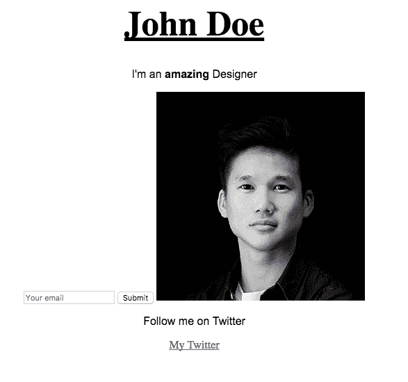
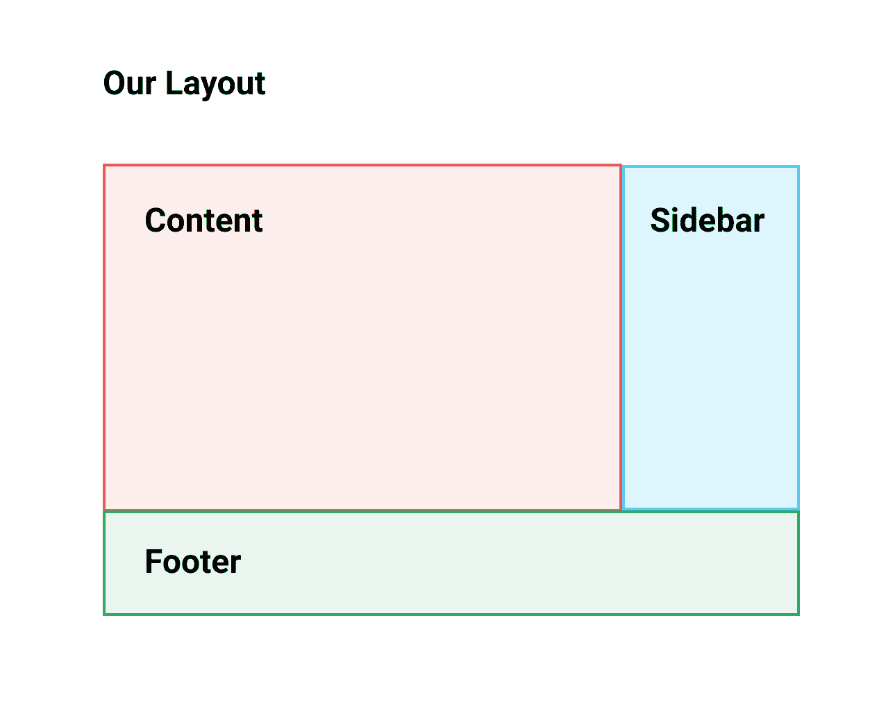
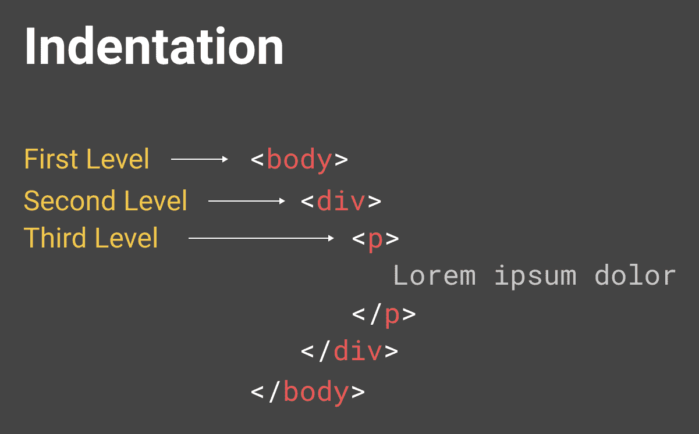
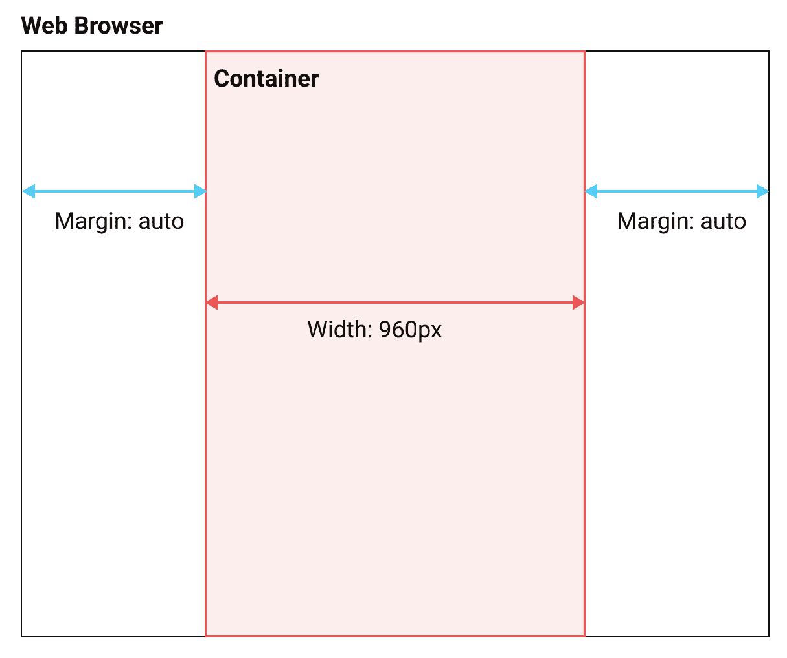
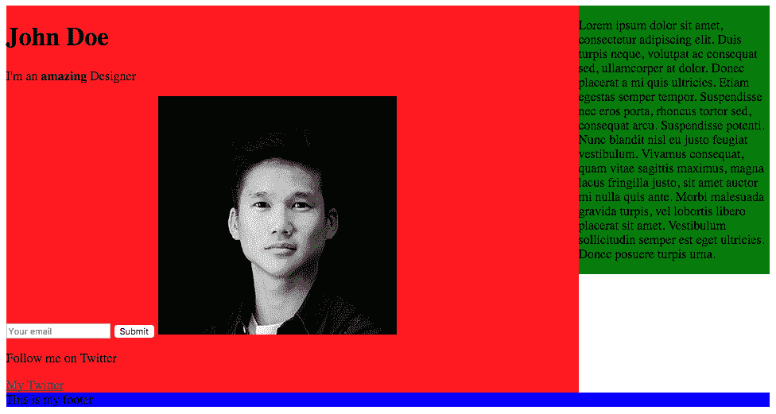

# 学习 CSS3

**层叠样式表**(**CSS**)允许您控制 HTML 内容的样式，更改颜色、字体、布局等。 这很容易理解，在这一章中，我们将处理以下主题:

*   CSS 的使用方法
*   CSS 格式化
*   父元素和子元素
*   类和 id
*   CSS 盒模型
*   CSS 布局和分隔器

# 使用 CSS 的不同方式

有三种使用 CSS 的方法:

*   在带有`style`属性的 HTML 标签中(不推荐使用此方法，但您仍然可以使用它):

```html
<p style'"font-size:12px"></p>
```

*   在带有标签`<style>`的 HTML 文档的`<head>`部分中:

```html
<style>
  p {
    font-size:12px;
  } 
</style>
```

*   CSS 代码也可以放到一个外部文件中，用标签`<link>`链接到 HTML 文档。 文件扩展名将被保存为`.css`文件:

```html
<link rel="stylesheet" href="css/style.css">
```

对于这个例子，我们将使用第二种选择，但当我们开始建立自己的网站时，我们将学习第三种选择。

让我们从在`<head>`部分添加`<style>`标签开始:

```html
<head> <!--This is our head tag where we put our title and script and all infos relative to our page.-->
  <title>My Page Title</title>
  <style>

  </style>
 </head>
```

# CSS 格式化

现在我们准备放入 CSS, CSS 中的格式如何?

CSS 很容易理解:

*   **选择器**:这是您选择要添加样式到哪些 HTML 元素的地方。 在本例中，我们选择了所有的`<h1>`元素。
*   **花括号**:其中的所有样式都将应用于选择器所选择的 HTML 元素
*   属性**属性**:属性控制 HTML 元素样式的一个方面，例如文本对齐、颜色、宽度、背景等等。
*   **Value**:该值指向该属性。 在本例中，文本对齐值可以是左对齐、右对齐、居中对齐或右对齐。
*   分号**:分号**必须应用在属性的末尾。

在同一个`<style>`标签中可以有多个样式。 让我们把所有的`h1`和`p`标签放在中间。

你应该拥有以下内容:

```html
<style>
 h1 {
  text-align: center;
 }
 p {
  text-align: center;
 }
</style>
```

# 父元素和子元素

如果你想将所有文本居中，而不仅仅是`<h1>`和`<p>`，该怎么办? 有一个简单的方法可以达到这个目的。 您必须理解父元素和子元素。 基本上，如果您为一个父元素设置样式，那么所有的子元素都将具有相同的样式，除非您为子元素指定了特定的样式。 下面是我们的例子:

```html
<body> <!--This is our parent element -->
  <h1>John Doe</h1>
  <p>I'm an <b>amazing</b> Designer</p>
  <input type="email" placeholder="Your email">
  <input type="submit">
  
  <a href="http://twitter.com/philippehong">My Twitter</a>
</body>
```

`<body>`标记是其内部每个元素的父元素，其中包括`<h1>`、`<p>`、`<input>`、``和`<a>`元素。

让我们删除前面的样式，并将`<body>`元素改为`text-align: center;`:

```html
<style>
  body {
    text-align: center;
  }
</style>
```

让我们保存 HTML 文档并在 Chrome 中重新加载页面。 注意，每个元素都有属性`text-align: center;`。

# 类和 id

我们了解了如何使用 CSS 选择 HTML 标记，但是，大多数情况下，您将拥有多个相同的 HTML 标记，例如`<p>`或`<a>`。 我们如何区分它们，以便我们只能选择和样式一个特定的? 这里是类和 id。 它们用于选择一个特定的 HTML 标签，你已经放置了一个属性`id`或`class`，例如:

```html
<div id="header"></div>
<p class="big"></p>
```

为了在 CSS 中选择这个 ID`header`，我们需要写入一个哈希(`#`)字符，后面跟着元素的 ID，在本例中是`header`:

```html
#header {
  margin-left: 10px;
}
```

要选择一个类，我们需要写一个句号(`.`)字符，后跟类的名称:

```html
.big {
  font-size:20px;
}
```

那么 id 和类之间的区别是什么呢? 唯一的区别是，id 在 HTML 文档中只能使用一次，而 class 可以使用多次。 我们还需要知道以下几点:

**For IDs:**

*   每个元素只能有一个 ID
*   每个页面只能有一个具有该 ID 的元素

**上课:**

*   可以在多个元素上使用同一个类
*   可以在同一个元素上使用多个类

例如，我们可以有以下内容:

```html
<div id="header" class="big red blue"></div>
```

这意味着`<div>`元素具有 ID`header`和类`big`、`red`和`blue`。

现在让我们在文档中添加一些类和 id:

```html
<body> <!--This is our parent element -->

  <h1 id="my-name">John Doe</h1>
   <p class="text">I'm an <b>amazing</b> Designer</p>
   <input class="form" type="email" placeholder="Your email">
   <input class="button" type="submit">
   
   <a class="link" href="http://twitter.com/philippehong">My Twitter</a>

</body>

```

如您所见，我添加了一些非常简单的 id 和类，以便您能够理解它是如何工作的。 我们将详细介绍使用 id 和类时的最佳实践。

现在我们已经有了 id 和类，让我们为 CSS 添加一些样式。 为此，让我们选择第一个 ID`my-name`，并使其变大并加下划线。 为此，我们将使用 CSS 属性`font-size`和`text-decoration`:

```html
<style>
  body {
    text-align: center;
  }
  #my-name{
    font-size: 50px;
    text-decoration: underline;
  }
</style>
```

现在让我们为一些类设置样式。 在这个例子中，让我们在 HTML 文档中添加另一个`<p>`标签，就在链接之前，如下所示:

```html
<body> <!--This is where all our content will go-->

  <h1 id="my-name">John Doe</h1>
  <p class="text">I'm an <b>amazing</b> Designer</p>
  <input class="form" type="email" placeholder="Your email">
  <input class="button" type="submit">
  
  <p class="text">Follow me on Twitter</p> <!--Added text-->
  <a class="link" href="http://twitter.com/philippehong">My Twitter</a>

</body>
```

现在我们有了同一个类的两个元素，让我们看看当我们想通过添加`font-family`属性来样式化类`text`时会发生什么:

```html
<style>
  body {
    text-align: center;
  }
  #my-name{
    font-size: 50px;
    text-decoration: underline;
  }
  .text {
    font-family: Arial;
  }
</style>
```

保存 HTML 文档并刷新浏览器。 这是你应该看到的:



这应该改变元素的字体类`text`。 您可以看到两个元素都发生了变化。

# CSS 盒模型

所有 HTML 元素都可以看作是方框。 CSS 框模型允许我们定义元素之间的空间。 无论您想添加边框、设置边距，还是在元素之间添加填充，您都需要理解框模型。 理解这一部分将对您实现设计有很大帮助。

# 这些盒子

盒子模型包含四个属性:

*   **内容**:文字、图片等
*   **Padding**:内容周围的透明区域，在盒子内部
*   **页边距**:空格之间的距离
*   **边框**:围绕着填充和内容

看看下面的图表来更好地理解:


CSS 框模型可以如上图所示描述。

盒子模型还可以让我们设置元素的高度和宽度。 通过以下方式设置内容的宽度或高度:

```html
Width: 200px;
```

内容的宽度为`200px`。

现在，标准框模型的烦人之处在于，你只能设置内容的宽度和高度，而不能设置整个框本身，这意味着 padding、margin 和 border 将被添加到我们指定的宽度和高度。 这很烦人:


Box Sizing with the property content-box

幸运的是，我们可以通过使用`box-sizing `属性来解决这个问题:

```html
box-sizing: border-box; 
```

通过将`box-sizing`设置为`border-box`，我们现在将设置整个盒子的宽度和高度:


Box Sizing with the property border-box

# 块和内联

关于盒子模型还有最后一件事。 在 HTML 中，我们称之为块元素和内联元素。

**块元素**:它使用浏览器的全宽，并且总是以新行开始。 你可以把它们看作需要一个接一个堆起来的方块。 标题和段落是块元素的一些例子。

块级元素的例子:

*   `<div>`
*   `<h1> - <h6>`
*   `<p>`
*   `<form>`


Block elements are represented in red boxes

**内联元素**:内联元素不从新行开始，只占用必要的宽度。 看看这个蓝色元素的例子:


Inline elements are represented in blue boxes

下面是一些内联元素的例子:

*   `<span>`
*   `<a>`
*   ``

# CSS 布局和分隔符

现在我们理解了框模型的工作原理，我们可以尝试为我们的 HTML 页面构建一个简单的布局，如下图所示:



我们的布局将有一个容器，右侧有一个侧边栏，底部有一个页脚。 这是很多网站的基本布局。

这个布局将在页面居中的容器中。 废话不多说，让我们开始吧!

# 的基本布局

要创建基本布局，我们将使用`<div>`元素。 元素是最常用的 HTML 元素。 `<div>`代表“划分”，我们通过创建放置内容的方框，简单地用它将页面划分为几个部分。

让我们清除您的`<style>`节中的 CSS 并从头开始。

我们首先添加一个`<div>`元素来包装我们创建的所有内容，然后添加一个类`container`:

```html
   <div class="container">
     <h1 id="my-name">John Doe</h1>
     <p class="text">I'm an <b>amazing</b> Designer</p>
     <input class="form" type="email" placeholder="Your email">
     <input class="button" type="submit">
     
     <p class="text">Follow me on Twitter</p> <!--Added text-->
     <a class="link" href="http://twitter.com/philippehong">My Twitter</a>
   </div> 
```

# 格式化和缩进 HTML

您可以在我的 HTML 文档中看到，我的代码是缩进的。 代码缩进适用于每一种语言，使其更易于阅读和结构。 缩进的基本方法是使用*Tab*键将内容向右移动一步:



这是一个基本的结构和缩进，你应该有。

# 我们班的样式

让我们从样式化刚刚创建的`container`类开始。 为此，让我们转到我们的`<style>`部分并添加以下内容:

```html
<style>
  .container {
    width: 960px; 
  } 
</style>
```

这会将`width`属性设置为`<div>`，将类`container`设置为`960px`。

我们希望容器位于页面的中间。 为此，我们需要添加一个`margin`属性，如下所示:

```html
<style>
  .container {
    width: 960px;
    margin-left: auto;
    margin-right: auto;
  }
</style>
```

添加`margin-left: auto;`和`margin-right: auto;`意味着根据元素的上下文自动调整左右边距，在本例中是浏览器窗口:



有很多方法可以让 CSS 的元素居中; 这是第一个。 我们将在接下来的章节中查看其他几种方法。

现在让我们按照我们想要做的布局中定义的方式创建我们的`content`元素。

在我们的`<div class = "container">`里面，让我们加上`<div class = "content">`。 再次，让我们将内容移动到这个`div`中，如下所示:

```html
<body> <!--This is where all our content will go-->
 <div class="container">
   <div class="content">
     <h1 id="my-name">John Doe</h1>
     <p class="text">I'm an <b>amazing</b> Designer</p>
     <input class="form" type="email" placeholder="Your email">
     <input class="button" type="submit">
     
     <p class="text">Follow me on Twitter</p> <!--Added text-->
     <a class="link" href="http://twitter.com/philippehong">My Twitter</a>
   </div>
 </div>
</body>
```

接下来，添加我们的`sidebar`。 在我们的`<div class= "content">`之后，加上`div`与全班同学`sidebar`。

在我们的`sidebar`中，添加一个`<p>`元素来创建一些内容:

```html
<div class="sidebar">
   <p>Lorem ipsum dolor sit amet, consectetur adipiscing elit. Duis turpis neque, volutpat ac consequat sed, ullamcorper at dolor. Donec placerat a mi quis ultricies. Etiam egestas semper tempor. Suspendisse nec eros porta, rhoncus tortor sed, consequat arcu. Suspendisse potenti. Nunc blandit nisl eu justo feugiat vestibulum. Vivamus consequat, quam vitae sagittis maximus, magna lacus fringilla justo, sit amet auctor mi nulla quis ante. Morbi malesuada gravida turpis, vel lobortis libero placerat sit amet. Vestibulum sollicitudin semper est eget ultricies. Donec posuere turpis urna.
  </p>
</div>
```

You can find some dummy text by going to the website [https://www.lipsum.com/](https://www.lipsum.com/).

最后，让我们在`sidebar`元素之后添加`footer`元素:

```html
<div class="footer">
  <p>This is my footer</p>
</div>
```

我们的 HTML 文档现在应该如下所示:

```html
<html> <!--This is our HTML main tag-->
 <head> <!--This is our head tag where we put our title and script and all infos relative to our page.-->
  <title>My Page Title</title>
  <style>
    .container {
      width: 960px;
      margin-left: auto;
      margin-right: auto;
    }
  </style>
 </head>
 <body> <!--This is where all our content will go-->
   <div class="container">
     <div class="content">
       <h1 id="my-name">John Doe</h1>
       <p class="text">I'm an <b>amazing</b> Designer</p>
       <input class="form" type="email" placeholder="Your email">
       <input class="button" type="submit">
       
       <p class="text">Follow me on Twitter</p> <!--Added text-->
       <a class="link" href="http://twitter.com/philippehong">My Twitter</a>
     </div>
     <div class="sidebar">
       <p>Lorem ipsum dolor sit amet, consectetur adipiscing elit. Duis turpis neque, volutpat ac consequat sed, ullamcorper at dolor. Donec placerat a mi quis ultricies. Etiam egestas semper tempor. Suspendisse nec eros porta, rhoncus tortor sed, consequat arcu. Suspendisse potenti. Nunc blandit nisl eu justo feugiat vestibulum. Vivamus consequat, quam vitae sagittis maximus, magna lacus fringilla justo, sit amet auctor mi nulla quis ante. Morbi malesuada gravida turpis, vel lobortis libero placerat sit amet. Vestibulum sollicitudin semper est eget ultricies. Donec posuere turpis urna.</p>
     </div>
     <div class="footer">
       <p>This is my footer</p>
     </div>
   </div>
 </body>
</html>

```

现在，为了这节课的目的，让我们给每个元素添加一些背景色，看看布局是如何工作的。 要做到这一点，让我们进入样式部分，为每个类添加一个`background-color`属性，如下所示:

```html
<style>
  .container {
    width: 960px;
    margin-left: auto;
    margin-right: auto;
  }
  .content {
    background-color: red;
  }
  .sidebar {
    background-color: green;
  }
  .footer {
    background-color: blue;
  }
</style>

```

现在我们将保存我们的 HTML 文档，并刷新我们的浏览器，看看它是什么样子:


我们的网页很难看，但它确实显示了布局是如何放在一起的。 让我们添加更多的 CSS 属性，使它看起来像我们想要的样子。

我们希望`.content`元素为总宽度(960px)的`75%`，而侧边栏为`25%`。 我们可以做一些数学运算，计算 960 的`75%`，但是，在 CSS 中，你也可以通过百分比设置`width`:

```html
.content {
  background-color: red;
  width: 75%;
}
.sidebar {
  background-color: green;
  width: 25%;
}

```

现在我们将保存我们的 HTML 文档，并刷新我们的浏览器，看看它是什么样子:


如您所见，我们的元素的宽度属性为`75%`和`25%`。 现在要将`sidebar`移动到内容旁边，我们需要使用 CSS 属性`float`。 使用`float`，可以将元素推到左边或右边，允许其他元素环绕它。 让我们这样做:

```html
.content {
  background-color: red;
  width: 75%;
  float: left;
}
.sidebar {
  background-color: green;
  width: 25%;
  float: right;
}

```

让我们保存我们的 HTML 文档，并刷新我们的浏览器，看看它的外观:


我们的内容和`sidebar`现在并排在一起，但问题是我们的`footer`在右边，因为它拥有`sidebar`右边的属性`float`。 为了避免这种情况，我们需要使用`clear`属性，它对应于`float`属性。 我们将属性设置为 both，这意味着右和左:

```html
.footer {
  background-color: blue;
  clear: both;
} 
```

保存并刷新文档。



现在我们的布局已经完全用 CSS 编码了。

# 总结

我们终于有了我们的布局。 同样，这节课并不是要做一些漂亮的事情，而是帮助您理解如何使用 CSS 正确布局页面。 在下一章中，我们将通过创建和样式化我们的网站来深入研究 HTML 和 CSS——多么令人兴奋!