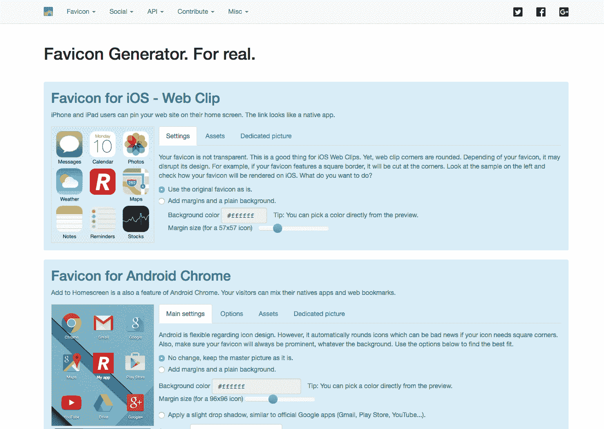
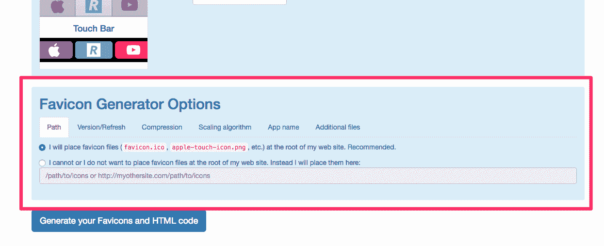
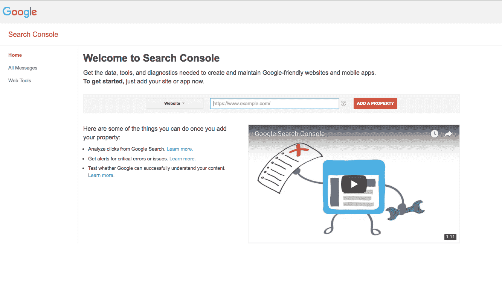

# 优化和发布我们的网站

欢迎来到创建我们网站的最后一部分; 我们走过了这么长的一段路。 我们的网站看起来超级棒，有一些很酷的动画。 在本章中，我们将优化我们的网站:

*   创建和实现一个图标，我们的网站
*   学习如何优化我们的图像
*   学习一些 SEO 基础知识
*   我们一步步地在网上发布我们的网站

让我们开始吧!

# 创建一个标识

Favicons 是那些你在浏览器标签页和书签栏上看到的小图标。 它们是任何网站身份的一部分，并让用户认识您的网站:


Favicon of the Dribbble website

不要跳过这一步。 有一个非常简单的在线工具可以做到这一点。 我们只需要一个图像作为我们的图标，所以现在让我们做这个。 让我们转到[https://realfavicongenerator.net/](https://realfavicongenerator.net/)，这是图标生成器。 这样，我们就可以为浏览器创建图标，甚至可以根据浏览器运行的不同操作系统来设计图标。 我们只需要选择我们的图像。 在本例中，我们将使用 assets 文件夹中提供的徽标，并找到图像`Logo_Square.png`。 点击选择网站上的图标图片并上传 logo。

这是我们所拥有的:



它为我们提供了一系列 iOS、Android 和 Windows 手机的图标，但这并不是真正重要的。 真正重要的是页面底部的内容:



我们现在要点击第二个选项，因为我们想要选择一个路径来放置图标，因为我们不希望它们在主项目文件夹的根目录下。 网站建议我们把 favicon 放在根目录下，但我们会指定一个不同的路径，因为会有很多图片，我们想要保持它的组织性。 让我们在`img`文件夹中创建一个文件夹，并将其命名为`icons`。 然后，我们将编辑网站上输入的值，并img/icons`作为我们刚刚创建的文件夹。 现在，让我们生成图标! 首先，我们需要点击*生成你的 Favicons 和 HTML 代码*，这将把我们带到另一个页面，然后我们可以点击 Favicon 包来下载它。 还提供了一个代码片段，我们可以复制和粘贴它。

这段代码将被插入我们网站的`<head>`标签中，就在`<!-- Place favicon.ico in the root directory -->`之后。

现在你可以移除 Boilerplate 提供的三行代码:

```html
<link rel="manifest" href="site.webmanifest">
<link rel="apple-touch-icon" href="icon.png">
<!-- Place favicon.ico in the root directory -->
```

我们的`head`部分现在应该是这样的:

```html
<head>
        <meta charset="utf-8">
        <meta http-equiv="x-ua-compatible" content="ie=edge">
        <title></title>
        <meta name="description" content="">
        <meta name="viewport" content="width=device-width, initial-scale=1">

        <link rel="apple-touch-icon" sizes="180x180" hrefimg/icons/apple-touch-icon.png">
        <link rel="icon" type="image/png" sizes="32x32" hrefimg/icons/favicon-32x32.png">
        <link rel="icon" type="image/png" sizes="16x16" hrefimg/icons/favicon-16x16.png">
        <link rel="manifest" hrefimg/icons/site.webmanifest">
        <link rel="mask-icon" hrefimg/icons/safari-pinned-tab.svg" color="#5bbad5">
        <link rel="shortcut icon" hrefimg/icons/favicon.ico">
        <meta name="msapplication-TileColor" content="#da532c">
        <meta name="msapplication-config" contentimg/icons/browserconfig.xml">
        <meta name="theme-color" content="#ffffff">

        <link href="https://fonts.googleapis.com/css?family=Roboto:400,700" rel="stylesheet">
        <link rel="stylesheet" href="fonts/font.css"> <!-- Font face CSS link -->
        <link rel="stylesheet" href="css/normalize.css">
        <link rel="stylesheet" href="css/animate.css">
        <link rel="stylesheet" href="css/main.css">
        <link rel="stylesheet" href="css/styles.css">
    </head>
```

最后一步是将我们下载的文件复制到我们的`icons`文件夹。 做得好! 让我们跳到下一节，在那里我们将看到如何优化我们的网站的性能。

# 网站性能优化

没人喜欢慢的网站; 我们都知道这一点。 除此之外，页面速度也会对用户的参与度产生影响，因为没有人愿意等待网站加载完毕。 我们添加了一些插件和大量图片。 现在，让我们开始优化我们的网站，让我们的用户更喜欢我们的网站使用一些技术，加快上传时间。 我们可以做两件非常基本的事情，一是优化大量图片，二是缩小 CSS 和 jQuery 代码。 做一下。

# 优化图片

我们首先要优化的是我们的图像，这是因为图像通常是我们网页中最重要的内容。 我们的一些图像相当重，例如我们的英雄图像，它超过 480KB。 所有这些图片，再加上我们下载网站的时候，都要花很长时间。 想象一下，一个用智能手机上网速度很慢的人试图下载这个网站。 这将花费他们一辈子的时间。 所以，让我们减小文件大小。 作为第一步，我们可以减少实际图像的大小。

我使用了一个名为[TinyJPG](https://tinyjpg.com/)的工具来压缩较重的图像。 我发现它比草图或 Photoshop 的集成优化更强大:


Tinyjpg.com 

你所要做的就是拖放你想要压缩的图像。 让我们用大小为 480KB 的`hero-image`测试一下:


hero-image.jpg after compression

在这里，你可以看到，压缩`hero-image.jpg`后，它现在几乎是一半的大小! 不可思议,不是吗? 现在我们要做的是压缩尽可能多的文件，以减少它们的大小。

# 优化我们的代码

我们可以做的另一件事是缩小 CSS 和 jQuery 代码。 通过删除不必要的空白并优化代码，这基本上减少了 CSS 和 jQuery 文件的大小。 然而，缩小的代码使人类很难阅读，所以我们应该只在我们准备启动一个网站的时候缩小代码。 我使用的一个工具是 Minifier([https://www.minifier.org/](https://www.minifier.org/))。 我们可以简单地将代码粘贴到里面:


Minifier.org 

当我们有大量的代码需要压缩时，这种技术实际上更重要; 否则，我们将不能节省太多的空间。 在我们的例子中，我们没有那么多代码，所以可能没有必要这么做。

如果你想消除代码的缩小，有另一个网站:[http://unminify.com/。](http://unminify.com/)

现在，让我们在下一节讨论一些非常基本的搜索引擎优化。

# 基本的搜索引擎优化改进

**搜索引擎优化**(**SEO**)是一个非常热门的话题。 这是因为它是如此重要，你的网站可以被你的用户使用搜索引擎发现，如谷歌。

# 什么是搜索引擎优化?

基本上，搜索引擎优化或 SEO 使用一些技术来改善和推广网站，以增加网站从搜索引擎接收的访问量。 搜索引擎优化有很多方面，但我们将只覆盖非常基本的让我们的网站搜索引擎准备好。

# 元数据描述

首先，也是最重要的，我们需要为我们的网站命名。 这是 SEO 和用户了解网站最重要的事情。

在 HTML 的顶部，有一个我们要填充的`<title>`标签。 在这个例子中，我们将添加`Racing Club - Motor Racing Club for passionate`:

```html
<title>Racing Club - Motor Racing Club for passionate</title> 
```

其次，让我们来谈谈`meta description`标签。 这个标签是一个网站的简短描述，它通常用于在搜索结果页面上描述一个网站，就像我们可以在这里看到 Dribbble 的网站的例子:


Search result of the term "Dribbble"

```html
<meta name="description" content="Shots from popular and up and coming designers in the Dribbble community, your best resource to discover and connect with designers worldwide." />
```

这些文字对网页本身的访问者是不可见的，但它可以帮助你为你的网站做广告，从搜索结果中吸引用户到你的网站。 因此，它是搜索营销的一个极其重要的部分。 我们应该使用重要的关键字来制作一个引人注目的元描述，但不要超过 160 个字符。

现在，让我们在网页上这样做; 再没有比这更容易的了。 我们只使用带有`name="description"`属性的`meta`标记，然后使用带有我们想要的描述的`content`属性。 我们想要添加一些关于赛车俱乐部的内容，所以我们将添加如下内容:`"A Racing Club by passionates to passionate. Monthly events in Australia-wide. Buy your ticket now."`。 在我们的 HTML 中，我们已经预先添加了一个`meta`，所以我们只需要把描述放在里面:

```html
<meta name="description" content="A Racing Club by passionates to passionate. Monthly events in Australia-wide. Buy your ticket now.">
```

你可以在你的 HTML 顶部看到一行:

```html
<meta charset="utf-8">
```

这是用来声明网站的字符编码，但不包括排名，所以与 SEO 无关。 这是我们应该包括在我们做的每一个网站，尽管。

# 有效的 HTML

我们应该始终编写有效的 HTML 代码。 有效的 HTML 代码是遵循官方 HTML 规则并且没有 bug 的代码。 有效的 HTML 是谷歌的首选，因为它使网站更有可能在我们没有测试过的浏览器上工作。 它看起来更专业，而且更便于访问，例如，让屏幕阅读器更容易为盲人用户阅读网站。 有一个官方工具用于检查我们是否有有效的 HTML 代码，它被称为 W3 标记验证器([https://validator.w3.org/](https://validator.w3.org/))。 我们要用它来测试我们的网站。 要做到这一点，我们只需使用命令或*Ctrl*+*A*复制整个代码，然后复制它。 在网站上，验证器。 在 w3 中，我们将使用 Validate by Direct Input 选项，并在单击 Check 之前将所有代码粘贴到这里。 这需要一点时间，但它告诉我们代码中有 8 个错误。

在报告中，我们可以看到以下建议:


W3 validator report

其中一个建议是，我们应该试着按照报告的建议去做，但是，你仍然可以按照现在的样子来创建网站。

起初，它说:

This document appears to be written in English but the HTML start tag has an empty lang attribute. Consider using lang="en" (or variant) instead.

事实上，建议您指定您的网站的语言，以便搜索引擎可以识别它，并在必要时能够翻译它。 让我们在`lang`属性中添加`en`值(用于英语):

```html
<html class="no-js" lang="en">
```

其次，它建议我们删除我们实现的 iframe 上的一些属性，但也删除 iframe 之前的`<a>`标记。 让我们这样做。

最后，它说:

除非在某些条件下，img 元素必须具有 alt 属性。

属性`alt`是可选属性。 它用来描述图片在加载或浏览器是否不能正确渲染图片。 它也服务于谷歌搜索图像时，所以它是非常重要的。

让我们为所有图像添加一个`alt`属性，例如:

```html

```

现在让我们再次检查我们的代码:


Successful verification on W3 Markup Checker

做得好; 我们的代码现在被验证了!

# 关键字

接下来要考虑的是 c*内容是王*。 在你的网站上有好的内容是非常重要的，即使你的网站在搜索结果中名列前茅。 如果你的内容不是很好，你的用户不想读它，那么它就没有任何价值，即使你的排名很高。 此外，如果可以的话，继续提供新的内容，这样你的访问者就会想要回来看更多的内容。 接下来你需要做的是在内容中策略性地放置关键词。 这是在搜索排名中表现良好的关键，因为关键字是用户实际使用来找到你的。 但是,请注意, 不要过度使用关键字，因为搜索引擎认为这是垃圾关键词，他们可能会惩罚你。 在标题、元描述标签、标题和链接中使用关键字。

# 链接

另一件重要的事情是让其他网站链接到你。 这些链接被称为反向链接，就像你网站的推荐信。 搜索引擎部分根据指向网站的链接数量和质量对网站进行排名。 这是 SEO 的一个关键因素，因此你应该有一个策略来增加反向链接到你的网站的数量和质量。 事实上，在互联网上有很多关于 SEO 的信息。 如果你感兴趣，在网上查一些书或信息; 这是一个充满激情的话题。

这就是优化。 让我们继续下一节，在那里我们将学习如何在互联网上发布我们的网站。

# 启动我们的网站

我们的网站已经准备好与全世界分享了。 我们走过了这么长的路，现在我们快要走到终点了。 发布我们的网站非常容易。 我们只需要遵循这三个步骤。

# 购买域名

首先，我们需要选择和购买一个域名。 对于我们的网站，可以是[www.racingclub.com](http://www.racingclub.com)。 然后，我们需要购买网络托管; 把它想象成互联网上的一个文件夹，我们把所有的文件都放在那里。 为了确保我们的网站顺利运行，我们需要适量的带宽。 这是我们在一段时间内允许的数据传输量。

一旦我们有了这两样东西，我们只需要把我们的网站上传到我们的网络空间，然后我们就可以开始了。 有许多域名注册公司和网站托管公司。 当然，我不会告诉你应该选择哪一个。 我所能告诉你的是，我已经使用[namecheap.com](http://namecheap.com)注册域名和购买网络主机。 那里的服务总是很好，但我不能说它是最好的主机，因为我还没有尝试过其他服务器。

您可以在购买域名之前，先到 Namecheap*网站查看您的域名是否可用。 这是非常简单和直接的:*

 *

一旦有了域，就需要一个主机。 我建议使用相同的提供商提供主机和域，这样更容易管理。

当您购买主机时，您可以选择使用您购买的域名或您自己的一个:


Buying hosting with Namecheap

一旦你买了托管和联系你的领域,你会收到几封电子邮件确认你的购买,但是,更重要的是,您连接到服务器的所有凭证,以及你们的**文件传输协议(FTP**)。 这是一种用于将文件传输到服务器的协议。 为了上传我们的文件，我们需要一个使用这个协议的工具。 我总是使用*FileZilla*。 它简单且开源，可以完成这项工作。 下一步是下载 FileZilla([https://filezilla-project.org/](https://filezilla-project.org/)):****

 **

FileZilla website

单击“下载 FileZilla Client”，完成 FileZilla 的安装。

一旦你在 FileZilla 上，点击文件|网站管理器:


FileZilla  new website

现在我们需要添加一个新站点，但是我们需要找到 Namecheap 发送给我们的凭据。 打开你的邮箱，查找 SFTP 细节，它应该是这样的:


Namecheap SFTP credentials

看看这些 SFTP 详细信息的描述，以便你输入正确的信息:

*   **主机**:服务器地址
*   **端口**:端口
*   **Protocol**:需要在 SFTP 上设置
*   **登录类型**:正常
*   **用户名**和**密码**:按提示输入

点击连接。

现在你会看到一堆文件夹，有各种各样的名称。 不要为他们担心; 寻找`public_html`，因为这将是您的`public`文件夹。 一旦进入，您可以删除默认设置的文件。

现在转到`Web Project`并选择要放入 FileZilla 中的所有文件。 B*e 小心;* 所有文件，包括隐藏文件，都需要上传。 如果你使用的是 Windows 系统，你就不需要担心这个问题，但对于 Mac 用户来说，隐藏的文件在文件前会显示一个点。 显示隐藏文件，简单地使用快捷键*Shift*+*CMD*+*。* 显示我们隐藏的文件:


Showing hidden files in macOS

现在将所有文件拖放到 FileZilla 中。 它会自动将它们上传到你的服务器。 一旦完成，您的网站现在是正式在线!

这将是不同的每个主机提供商，但一般来说，这是相同的过程。 FileZilla 是一个很棒的工具，可以用于每一个使用 FTP 或 SFTP 传输文件的主机。

# 谷歌分析

现在我们的网站上线了，我们仍然可以继续工作，因为发布并不是故事的结束。 您需要覆盖的唯一一件事就是站点维护。 这意味着你应该跟踪网站的成功并监控用户的行为。 我们怎么做呢? 我们使用一个非常强大的工具，叫做谷歌分析。 有了这个软件，你将能够监控统计数据，如访问你的网站收到的数量，访客停留的时间，每个访客的平均页面浏览量，和许多其他有用的统计数据:


Google Analytics website

然后，利用这些数据，你可以对网站进行调整，使其变得更好。 我现在将安装谷歌分析在我刚刚上传的网站上向你展示它是多么容易。 首先，您需要为谷歌 Analytics 创建一个帐户，但如果您已经有一个谷歌帐户，这很容易。 一旦你有你的谷歌分析帐户创建，你需要创建一个帐户，以获得跟踪代码:


New account in Google analytics

在我们的例子中，它是一个网站，我将其命名为`Racing Club`。 然后，我们需要把这个链接到我们的网站。 输入所有必要的信息，然后点击 Get Tracking ID:


Google Analytics tracking code

谷歌现在提供给你一个代码粘贴到你的网站。 这是一个基本的 JavaScript 代码，因此您可以在所有脚本之后粘贴它。

在我们的 HTML 样板中，有一个位置留给我们的谷歌分析代码。 只需用谷歌提供的代码替换代码:

```html
<script src="js/vendor/modernizr-3.5.0.min.js"></script>
        <script src="https://code.jquery.com/jquery-3.2.1.min.js" integrity="sha256-hwg4gsxgFZhOsEEamdOYGBf13FyQuiTwlAQgxVSNgt4=" crossorigin="anonymous"></script>
        <script>window.jQuery || document.write('<script src="js/vendor/jquery-3.2.1.min.js"><\/script>')</script>
        <script src="js/vendor/jquery.waypoints.min.js"></script>
        <script src="js/vendor/instafeed.min.js"></script>
        <script src="js/plugins.js"></script>
        <script src="js/main.js"></script>

        <!-- Global site tag (gtag.js) - Google Analytics -->
        <script async src="https://www.googletagmanager.com/gtag/js?id=YOUR GOOGLE ANALYTICS CODE"></script>
        <script>
          window.dataLayer = window.dataLayer || [];
          function gtag(){dataLayer.push(arguments);}
          gtag('js', new Date());

          gtag('config', 'YOUR GOOGLE ANALYTICS CODE');
        </script>

```

现在，最后一步是使用 FileZilla 将更新后的文件上传到服务器。 只需拖放`index.html`(不要忘记保存!)，你就完成了!

这是一个非常快速的介绍谷歌分析，但该工具是非常强大的，可以设置跟踪您的网站上的一切。 这是一个很长的旅程，但我们做到了。 你现在可以在互联网上打开一个网页，看到我们共同创建的网站。 现在你可以自己做所有这些了。 神奇,不是吗?

# 谷歌搜索控制台

当一切都做了，你可以通过告诉谷歌看你的网站和爬行它与他们的机器人完成你的发射。 要做到这一点，我们需要将 URL 添加到谷歌数据库，我们将通过使用谷歌搜索控制台([https://www.google.com/webmasters/tools/](https://www.google.com/webmasters/tools/)):



Google Search Console

只需输入你的域名，验证你拥有这个域名，你就万事俱备了。

# 总结

做得很好。 本章我们已经讲了不少内容。 在本章中，我们介绍了我们网站的启动过程。 通过创建图标、压缩图像、缩小 CSS 和 JS 文件，我们还成功地用 W3 标记验证器验证了 HTML。 接下来是购买我们的域名和上传我们的文件到我们的服务器。 我们通过整合谷歌分析和提交我们的网站到谷歌搜索完成了这一章。 我们可以这样说，这是一个非常浓缩的章节!

在下一章中，我们将学习 Bootstrap 是什么以及为什么开发者喜欢它。 我们还将学习它的组件，我们将学习如何使用 Bootstrap 网格，以及，最后，Bootstrap 如何使用媒体查询。

让我们跳到下一章吧!***