# 用 Bootstrap 建立一个网站

我们刚刚看到了 Bootstrap 的强大。 有了我们可以重用的组件和元素的广泛列表，它可以使我们的开发阶段变得非常简单，这就是为什么开发人员喜欢它。 在本章中，我们将讨论如何使用 Bootstrap 框架建立我们的网站，使用以下步骤:

*   学习如何在项目中设置 Bootstrap
*   创建和样式我们的导航栏
*   继续英雄部分
*   创建并样式化 Blog 部分
*   创建和样式化 About 部分
*   最后是页脚

我们将从头开始这个项目，并创建我们之前创建的相同的页面，以比较初始技术和 Bootstrap 技术。 让我们开始吧!

# 安装 Bootstrap

我们需要做的第一件事是下载 Bootstrap。 有很多方法可以下载。 让我们进入下载页面查看一下。 点击主页上的下载按钮。 现在你可以看看下载最新版本 Bootstrap 的不同方法:

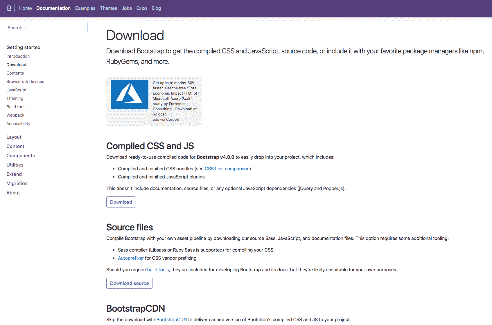

Downloading Bootstrap

第一种方法是下载 Bootstrap 的编译版本。 您的版本将取决于您何时参加这门课程，但始终采用最新版本的 Bootstrap。

您也可以下载带有所有文件的 Bootstrap 源版本，但是，大多数情况下，您只需要编译后的文件，因为启动和运行 Bootstrap 更快捷、更容易。

如果你向下滚动一点，你会注意到 BoostrapCDN。 Bootstrap还提供了一个 C****用分发网络**(**CDN)将托管 Bootstrap 在服务器的最新版本,所以你只能粘贴 URL,而无需主机服务器上的文件。 这很好，因为您的用户不需要再次下载文件，因为它可能已经通过使用 Bootstrap 访问另一个网站下载了文件。****

 **# 建立我们的项目

首先，我们创建一个名为`Racing Club Bootstrap`的文件夹。 在 Atom 中，我们将打开一个新窗口，点击 Add Project Folder… ，找到`Racing Club Bootstrap`。

在内部，让我们创建我们的`index.html`文件。 点击创建新的(*Ctrl + N*或*Cmd*+*【显示】N),并保存它,这样我们可以命名文件`index.html`。*

 *完成之后，让我们前往 Bootstrap 网站([http://getbootstrap.com/docs/4.0/getting-started/introduction/](http://getbootstrap.com/docs/4.0/getting-started/introduction/))，特别是介绍部分。

在本节中，Bootstrap 为你提供了一个模板来启动你的项目:

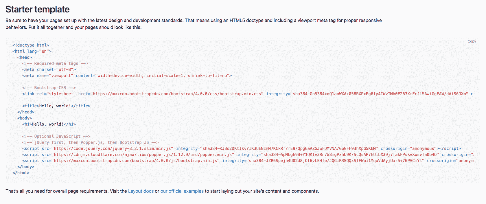

The Starter template

复制提供的代码并将其粘贴到您的`index.html`文件中。 我们可以从模板中删除`<h1>Hello, world!</h1>`。

我们已经准备好开始了，但是我们还想编写我们自己的 CSS。 为此，我们创建一个名为`css`的文件夹和一个名为`styles.css`的 CSS 文件。

要快速做到这一点，你可以右键单击 Atom 左边的栏，然后点击新建文件夹，如下图所示:


Create a folder in Atom

当您创建一个 CSS 文件时，您总是需要将它链接到您的 HTML 文件，否则它将无法工作。 如果你记得链接它，你将不得不添加以下代码:

```html
<link rel="stylesheet" href="css/styles.css">
```

现在我们已经创建了 CSS 文件并将其链接到 HTML 文件，最后需要做的是复制我们在上一个项目中创建的`img`和`fonts`文件夹。 这更容易，因为我们将重新创建相同的页面。 只需复制并粘贴这些文件夹到我们的新项目。

不要忘记将字体 CSS 链接到 HTML。 在您的`styles.css`之前添加它:

```html
<link rel="stylesheet" href="fonts/font.css">
```

安装谷歌字体 Roboto:

```html
<link href="https://fonts.googleapis.com/css?family=Roboto:400,700" rel="stylesheet">
```

既然我们都准备好了，让我们开始吧。

# Bootstrap navbar 

我们首先要创建的是 Bootstrap`navbar`。 Bootstrap 中的`navbar`是 Bootstrap 框架中最容易识别的特性之一，因为它的工作原理。 所以，举个例子来说明它是如何工作的，如果我们导航到 Bootstrap 网站，然后到文档标签，我们有所有的导航元素在屏幕的顶部:

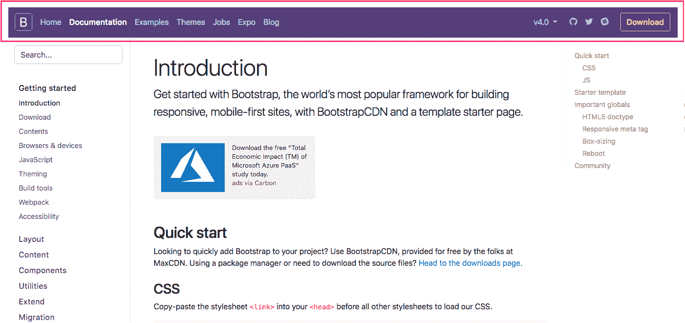

The Bootstrap navigation

如果我们缩小浏览器，我们可以看到导航也缩小了。 然后，当它点击小屏幕时，我们会看到这个汉堡菜单，如果我们点击它，它会显示其中的导航元素:


The Bootstrap mobile navigation

# 编写 Bootstrap 导航

现在让我们转到 Bootstrap 网站组件的`navbar`部分。 在这里，您可以找到使用 Bootstrap 构建导航所需的所有文档。

现在让我们回到我们的 HTML 文件，并编写以下代码:

```html
<nav class="navbar navbar-expand-lg fixed-top ">

</nav>
```

上述代码的具体内容如下:

1.  我们从内容主体中添加`<nav>`元素开始，所有`<nav>`元素都需要一个`navbar`类。
2.  然后，我们添加了新的扩展类`navbar-expand-lg`。 这实际上告诉浏览器何时折叠`navbar`以及何时展开它。
3.  因此，在这种情况下，当它点击大屏幕时，它将展开并显示桌面版本。 如果我们想在中屏幕上扩展，那么我们只需要将`lg`更改为`md`，或者对于较小屏幕，更改为`sm`。
4.  然后，我们添加了定位类，并且，因为我们希望这个`navbar`固定在屏幕顶部，以便当用户滚动时，导航始终可见，所以我们只添加了类`fixed-top`。

接下来，让我们添加一些导航选项:

```html
<nav class="navbar navbar-expand-lg fixed-top ">
      <div class="collapse navbar-collapse" id="navigation-bar">

      </div>
    </nav>
```

在这段代码中，我们简单地标识了以下内容:

1.  我们给`collapse`班加了一个`div`。 这只是告诉浏览器，这个`div`及其所有内容将是一个可折叠的元素。
2.  然后，我们添加了一个类`navbar-collapse`。
3.  最后，我们添加了一个将稍后链接到切换按钮的`id="navigation-bar"`。

现在我们需要添加导航列表，列表中有`<ul>`和`<li>`，每个链接中有`<a>`:

```html
<nav class="navbar navbar-expand-lg fixed-top ">
      <div class="collapse navbar-collapse" id="navigation-bar">
        <ul class="navbar-nav">
          <li class="nav-item"><a class="nav-link" href="upcoming.html">Upcoming events</a></li>
          <li class="nav-item"><a class="nav-link" href="past.html">Past events</a></li>
          <li class="nav-item"><a class="nav-link" href="faq.html">FAQ</a></li>
          <li class="nav-item"><a class="nav-link" href="about.html">About us</a></li>
          <li class="nav-item"><a class="nav-link" href="blog.html">Blog</a></li>
          <li class="nav-item"><a class="nav-link" href="contact.html">Contact</a></li>
        </ul>
      </div>
    </nav>
```

为了使导航正常工作，我们将需要`<ul>`上的`.navbar-nav`类和`<li>`上的`nav-item`类。 最后，我们需要在`<a>`标签上添加一个`.nav-link`类。

现在让我们在浏览器中查看我们的列表:


Work in progress on our navigation

我们有 Bootstrap 导航，但是如果你把页面缩小到一个移动视图，你会注意到导航消失了。 这是因为我们还没有包含 toggle 按钮，所以现在让我们添加它。

回到我们的`index.html`，我们可以在我们创建的`div`之上添加按钮。 让我们创建一个按钮标签，并赋予它`.navbar-toggler`类和说明，如下所示:

```html
<button type="button" class="navbar-toggler" data-toggle="collapse" data-target="#navigation-bar">

</button>
```

`data-target`属性是链接前面的导航选项的方式，也就是`#navigation-bar`ID。

现在我们需要在这个按钮中添加汉堡包菜单。 为此，我们可以使用`≡`HTML 代码，这是一个三栏图标的 HTML 代码。 有许多 HTML 符号可供您使用。 你可以谷歌 HTML 符号，这将为你提供大量的例子和符号。

让我们添加一个带有`.navbar-toggler-icon`类和内部 HTML 符号的`span`标签:

```html
<button type="button" class="navbar-toggler" data-toggle="collapse" data-target="#navigation-bar">
 <span class="navbar-toggler-icon">≡</span>
</button>
```

现在，如果我们保存并检查它，我们可以在手机屏幕上看到我们的菜单图标，如果我们点击它，菜单就会正确显示:

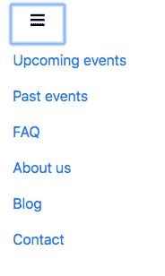

Mobile navigation. 

现在让我们在我们的`navbar`中添加徽标。 通常 logo 是一个链接，所以让我们在`.navbar-brand`类中添加一个`<a>`标签。

我们不希望 logo 在移动视图中折叠，所以我们将在`<button>`之前添加`<a>`:

```html
<nav class="navbar navbar-expand-lg fixed-top ">

      <a class="navbar-brand" href="#"></a>

      <button type="button" class="navbar-toggler" data-toggle="collapse" data-target="#navigation-bar">
        <span class="navbar-toggler-icon">☰</span>
      </button>

      <div class="collapse navbar-collapse" id="navigation-bar">
        <ul class="navbar-nav">
          <li class="nav-item"><a class="nav-link" href="upcoming.html">Upcoming events</a></li>
          <li class="nav-item"><a class="nav-link" href="past.html">Past events</a></li>
          <li class="nav-item"><a class="nav-link" href="faq.html">FAQ</a></li>
          <li class="nav-item"><a class="nav-link" href="about.html">About us</a></li>
          <li class="nav-item"><a class="nav-link" href="blog.html">Blog</a></li>
          <li class="nav-item"><a class="nav-link" href="contact.html">Contact</a></li>
        </ul>
      </div>

    </nav>
```

在这个`<a>`中，我们添加了以下内容:

1.  A 类`.navbar-brand`
2.  一个与我们的标志相连的`img`标签
3.  在这个`img`中，我们添加了一个`.img-fluid`类，使图像响应

我们的标志已经设置好了，但还没有完成。 我们需要添加右侧导航。 要做到这一点，我们只需要在我们的`<ul class="navbar-nav">`之后添加另一个`<ul>`:

```html
<div class="collapse navbar-collapse" id="navigation-bar">
        <ul class="navbar-nav">
          <li class="nav-item"><a class="nav-link" href="upcoming.html">Upcoming events</a></li>
          <li class="nav-item"><a class="nav-link" href="past.html">Past events</a></li>
          <li class="nav-item"><a class="nav-link" href="faq.html">FAQ</a></li>
          <li class="nav-item"><a class="nav-link" href="about.html">About us</a></li>
          <li class="nav-item"><a class="nav-link" href="blog.html">Blog</a></li>
          <li class="nav-item"><a class="nav-link" href="contact.html">Contact</a></li>
        </ul>

        <ul class="navbar-nav ml-auto">
 <li class="nav-item"><a class="nav-link" href="login.html">Login</a></li>
 <li class="nav-item"><span class="nav-link"><iframe src="https://www.facebook.com/plugins/like.php?href=http%3A%2F%2Ffacebook.com%2Fphilippehongcreative&width=51&layout=button&action=like&size=small&show_faces=false&share=false&height=65&appId=235448876515718" width="51" height="20" style="border:none;overflow:hidden"></iframe></span></li>
 </ul>
      </div>
```

我们添加了`.ml-auto`类来将第二个导航向右移动。 这代表`margin-left`automatic。 它填充了导航栏左侧的边距，这将有效地将其移到右侧。 如果你想要相反的效果，你只需添加`.mr-auto`类。

现在让我们来看看我们的导航:


Bootstrap navigation

我们的导航看起来很棒，我们有导航栏所需的所有元素。 接下来，我们将添加一些样式。

# 样式化导航栏

对 Bootstrap 组件进行样式化相当简单。 我们唯一需要做的就是覆盖 Bootstrap CSS。 然而，我们不想覆盖 Bootstrap CSS 文件本身; 我们唯一想做的事情是添加额外的 CSS 属性，将覆盖原来的 Bootstrap CSS。 我们预先创建了一个名为`styles.css`的 CSS 文件，并且由于这个文件在 HTML 文档中按照顺序链接在 Bootstrap CSS 文件之后，所以我们编写的每个具有相同属性和类的 CSS 都会覆盖原来的 Bootstrap CSS:

```html
<link rel="stylesheet" href="https://maxcdn.bootstrapcdn.com/bootstrap/4.0.0/css/bootstrap.min.css" integrity="sha384-Gn5384xqQ1aoWXA+058RXPxPg6fy4IWvTNh0E263XmFcJlSAwiGgFAW/dAiS6JXm" crossorigin="anonymous">
<link rel="stylesheet" href="css/styles.css">
```

我们需要针对正确的 CSS 类来覆盖它。 如果你还记得，我们使用谷歌 Chrome 的检查器来检查元素和它们的 CSS。 要打开检查器(或开发人员工具)，右键单击该元素并单击检查:


The Inspect element on Chrome

现在我们可以看到开发人员面板，那里有很多信息。 您可以检查可用的不同面板。 当鼠标悬停在 HTML 中的一个元素上时，你可以看到它显示在网页本身上:


The Google Chrome Inspector

当您想要修复任何 CSS 样式问题或查看 HTML 时，这是非常有用的。 现在让我们修复 CSS。

使用检查器，我们可以看到，`.navbar`类默认有一些填充，但我们想去掉它。

简单地添加以下 CSS 到您的`styles.css`:

```html
.navbar {
  padding: 0;
}
```

保存后，你可以检查我们是否用我们自己的 CSS 覆盖了 bootstrap:


Overwriting the Bootstrap CSS

现在你理解了原则，我们可以快速修复导航:

```html
.navbar {
  padding: 0;
  background-image: linear-gradient(0deg, rgba(0,0,0,0.00) 0%, rgba(0,0,0,0.50) 50%);
}

.navbar-brand {
  padding: 0;
}

.navbar-nav li a {
  color: white;
  text-decoration: none;
  font-family: 'built_titling', Helvetica, sans-serif;
  font-weight: 200;
  font-size: 20px;
  letter-spacing: 4px;
}

.navbar-collapse {
  padding: 10px 15px;
}

@media (min-width: 992px) {
  .navbar-collapse {
    padding: 0;
  }
}

.navbar-toggler-icon {
  color: white;
}
```

前面的代码将正确地样式化`navbar`。 您可以看到，所有东西都是功能性的，无需太多代码行，甚至响应部分也是如此。 这就是 Bootstrap 的力量。 如果我们比较一下使用 jQuery 和所有媒体查询来让导航响应的方法，我们写的代码比第一个项目要少得多。 现在让我们进入英雄部分。

# 样式化英雄部分

现在我们理解了如何使用 Bootstrap，我们可以开始使用 Bootstrap 库中的其他组件:

```html
<!-- HERO SECTION -->

    <div class="hero position-relative overflow-hidden d-flex align-items-center">
      <div class="container">
        <div class="col-md-7 my-auto">
          <p class="lead font-weight-normal">13.05.17</p>
          <h1 class="display-2 font-weight-normal custom-font-title">WAKEFIELD PARK</h1>
          <a class="btn btn-primary" href="#">Book now</a>
        </div>
      </div>
    </div>

<!-- END HERO SECTION -->
```

让我稍微解释一下前面的代码。

*第一*`div`如下:

1.  我们首先设置一个自定义类`.hero`，这样我们就可以在父元素中应用自定义代码。
2.  我们添加 Bootstrap 提供的实用类`.position-relative`和`.overflow-hidden`，这样我们就不必在 CSS 中应用它们。
3.  类`.d-flex`将在`display: flex`上设置显示。
4.  实用程序类`.align-items-center`将对齐子元素，使它们垂直居中。
5.  我们添加了一个自定义字体`.custom-font-title`，这样就可以用自定义字体添加到每个元素中。

然后在`.container`类中应用*第二个*`div`，这样我们就可以应用 Bootstrap 默认的`container`类。

下面的类都是 Bootstrap 库的一部分。 你可以在 Bootstrap 网站上看到它们。

下一部分是自定义我们添加的`.hero`类:

```html
.hero {
  width: 100%;
  height: 700px;
  background-image:
    linear-gradient(to bottom, rgba(0,0,0,0.3) 0%,rgba(0,0,0,0.4) 100%),
    url("img/hero-image.jpg");
  background-repeat: no-repeat;
  background-size: cover;
  background-position: center;
  color: white;
}
```

保存，看看我们有什么:


Preview of the hero section

现在让我们添加最后的润色:

```html
.custom-font-title {
  font-family: 'built_titling', Helvetica, sans-serif;
  font-weight: 400;
}

.btn-primary {
  font-size: 18px;
  letter-spacing: 4.5px;
  background: #BF0000;
  color: white;
  font-family: 'built_titling', Helvetica, sans-serif;
  font-weight: 400;
  padding: 12px 22px;
  border: none;
  outline: none;
  transition: all 0.3s ease;
  border-radius: 0px;
}

.btn-primary:hover {
  background: #A3171B;
}

.btn-primary:active {
  box-shadow: inset 0px 8px 4px rgba(0, 0, 0, 0.25);
  background: #A3171B!important;
  box-shadow: none!important;

}

.btn-primary:focus {
  box-shadow: inset 0px 8px 4px rgba(0, 0, 0, 0.25);
  background: #A3171B;
  box-shadow: none;
}
```

这将覆盖 Bootstrap 的默认样式的标题和主按钮:

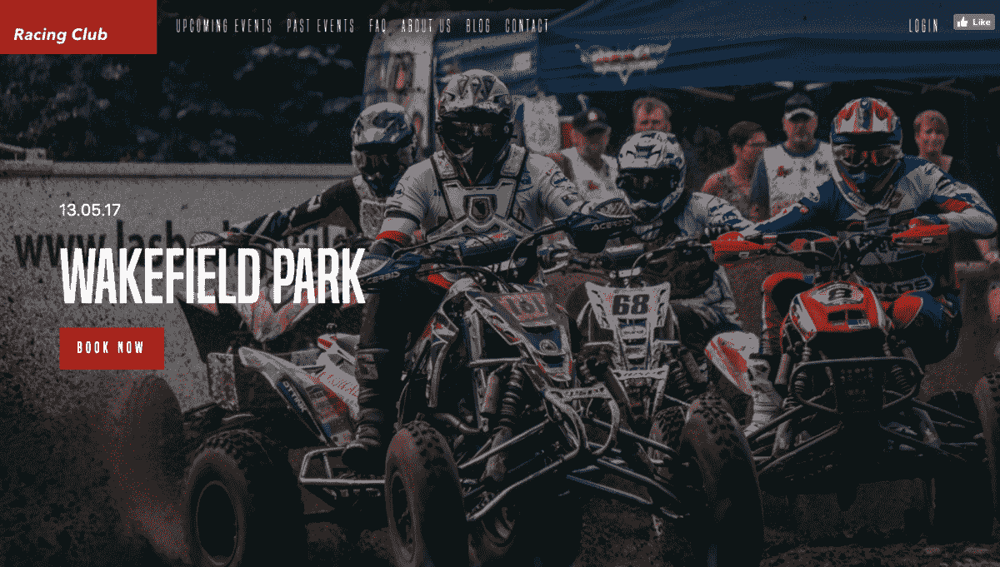

Our final hero section

现在让我们开始 Blog 部分。

# 样式化 Blog 部分

在我们早期建立的网站中，我们有自己的网格系统。 然而，现在，我们可以简单地使用 Bootstrap 网格，它比我们创建的更好，更实用。

让我们从 HTML 开始:

```html
<div class="blog py-5">
      <div class="container">
        <div class="row">
          <div class="col-md-4">
            <div class="card mb-4">
              
              <div class="card-body">
                <small class="text-muted">09th January 2016</small>
                <h4 class="font-weight-bold">Racing Club Advan Neova Challenge Round 3 Update</h4>
                <p class="card-text">FINAL ROUND: Labour Day Trackday Wakefield Park. Last chance to compete in the Circuit Club Advan Neova Challenge 2016!
There was much anticipation with Jason's big power Evo competing at Round 3, however some suspected engi... </p>
                <a href="#" class="btn btn-outline-primary">Read more</a>
              </div>
            </div>
          </div>
      </div>
    </div>
```

在前面的代码中，您可以注意到有很多`.py-5``.my-5`类。 这些类是间隔类; 它们已经被添加到 Bootstrap 的上一个版本中，所以你可以通过一个简单的类来添加空格。 要了解如何使用它们，请浏览文档的 Utilities 部分中的 Spacing 部分:

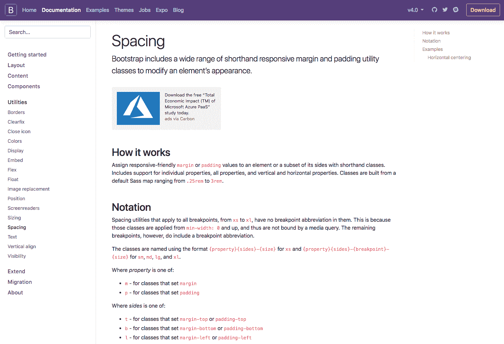

Spacing utilities in Bootstrap

另外，您会注意到我们为每张卡片使用了网格。 刚开始理解网格有点困难，但是一旦理解了它，就会发现它非常强大和有用。 最好的办法就是随便玩玩。 您可以通过检查在[https://getbootstrap.com/docs/4.0/layout/grid/](https://getbootstrap.com/docs/4.0/layout/grid/)中给出的示例来操作网格。

这里，我们添加了`.col-md-4`类，因为我们想要三个具有相同宽度的相同块，因为 Bootstrap 使用的是 12 列系统——12 除以 3 等于 4。 此外，我们使用了`md`属性，以便它只适用于浏览器分辨率大于 768px 的情况。

现在让我们为我们的六篇博文复制六次卡片:

```html
<!-- BLOG SECTION -->

    <div class="blog py-5">
      <div class="container">
        <div class="row">
          <div class="col-md-4">
            <div class="card mb-4">
              
              <div class="card-body">
                <small class="text-muted">09th January 2016</small>
                <h4 class="font-weight-bold">Racing Club Advan Neova Challenge Round 3 Update</h4>
                <p class="card-text">FINAL ROUND: Labour Day Trackday Wakefield Park. Last chance to compete in the Circuit Club Advan Neova Challenge 2016!
There was much anticipation with Jason's big power Evo competing at Round 3, however some suspected engi... </p>
                <a href="#" class="btn btn-outline-primary">Read more</a>
              </div>
            </div>
          </div>
          <div class="col-md-4">
            <div class="card mb-4">
              
              <div class="card-body">
                <small class="text-muted">09th January 2016</small>
                <h4 class="font-weight-bold">Hidden Behind the Scenes</h4>
                <p class="card-text">Originally posted by Narada Kudinar, 23.08.11.
At our Trackdays, we get a variety - owners with their girlfriends, owners with their mates, owners and their mechanics - but there is one combination I am truly at envy with. It's the owners and their Dads. </p>
                <a href="#" class="btn btn-outline-primary">Read more</a>
              </div>
            </div>
          </div>
          <div class="col-md-4">
            <div class="card mb-4">
              
              <div class="card-body">
                <small class="text-muted">04th July 2013</small>
                <h4 class="font-weight-bold">Introducing Advan Trackdays!</h4>
                <p class="card-text">For the first time, Yokohama Advan Tyres are hosting their very own Trackdays, hosted by your's truly! The aim? To thank their loyal customers by providing a bargain event as well as introduce new Advan tyres to those who don't use them yet.. </p>
                <a href="#" class="btn btn-outline-primary">Read more</a>
              </div>
            </div>
          </div>
          <div class="col-md-4">
            <div class="card mb-4">
              
              <div class="card-body">
                <small class="text-muted">03th January 2016</small>
                <h4 class="font-weight-bold">ANZAC Day Spots Running Out!</h4>
                <p class="card-text">FINAL ROUND: Labour Day Trackday Wakefield Park. Last chance to compete in the Circuit Club Advan Neova Challenge 2016!
There was much anticipation with Jason's big power Evo competing at Round 3, however some suspected engi… </p>
                <a href="#" class="btn btn-outline-primary">Read more</a>
              </div>
            </div>
          </div>
          <div class="col-md-4">
            <div class="card mb-4">
              
              <div class="card-body">
                <small class="text-muted">02th January 2016</small>
                <h4 class="font-weight-bold">10 Year Anniversary Details Now Available!</h4>
                <p class="card-text">Originally posted by Narada Kudinar, 23.08.11.
At our Trackdays, we get a variety - owners with their girlfriends, owners with their mates, owners and their mechanics - but there is one combination I am truly at envy with. It's the owners and their Dads.</p>
                <a href="#" class="btn btn-outline-primary">Read more</a>
              </div>
            </div>
          </div>
          <div class="col-md-4">
            <div class="card mb-4">
              
              <div class="card-body">
                <small class="text-muted">01th January 2016</small>
                <h4 class="font-weight-bold">Prepare for EPICNESS</h4>
                <p class="card-text">For the first time, Yokohama Advan Tyres are hosting their very own Trackdays, hosted by your's truly! The aim? To thank their loyal customers by providing a bargain event as well as introduce new Advan tyres to those who don't use them yet... </p>
                <a href="#" class="btn btn-outline-primary">Read more</a>
              </div>
            </div>
          </div>
      </div>
    </div>

    <!-- END BLOG SECTION -->
```

最后一件事是添加 Show more 按钮。 我们还需要水平居中按钮。 为此，我们将使用`.d-flex`flexbox Bootstrap 类与`.align-items-center`类配对:

```html
<div class="row d-flex align-items-center py-5">
    <div class="mx-auto">
        <a href="#" class="btn btn-primary">Show more</a>
    </div>
</div>
```

最后，要使它居中，我们只需要添加`.mx-auto`类，这样左右边距都是自动的。

让我们看看我们现在有什么:

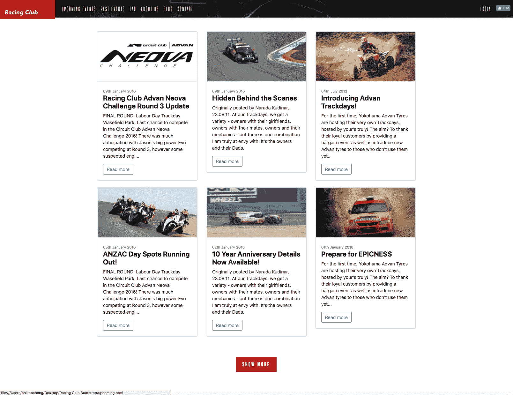

Work in progress – the Blog section

我们有一些非常整洁的东西，没有任何样式。 唯一剩下的事情就是定制卡片和轮廓按钮，我们准备好了:

```html
body {
    font-family: 'Roboto', sans-serif;
}

.btn-outline-primary {
  color: #BF0000;
  background-color: transparent;
  background-image: none;
  border-color: #BF0000;
}

.btn-outline-primary:hover {
  background: #A3171B;
  border-color: #A3171B;
}

.btn-outline-primary:active {
  box-shadow: inset 0px 8px 4px rgba(0, 0, 0, 0.25);
  background: #A3171B!important;
  box-shadow: none!important;
  outline: none;
  border-color: #A3171B!important;

}

.btn-outline-primary:focus {
  box-shadow: inset 0px 8px 4px rgba(0, 0, 0, 0.25);
  background: #A3171B;
  box-shadow: none;
  outline: none;
}

.card {
  border: none;
}
```

下面是设计的最后阶段:

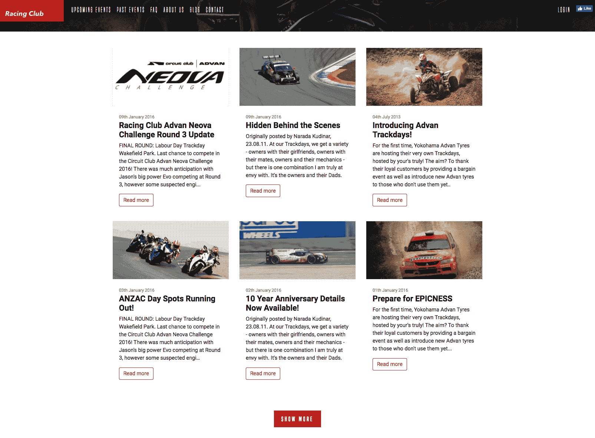

The design finalized in the blog section

这是它; 我们已经完成了博客部分。 让我们开始“ABOUT US”部分。

# 样式化 about 节

这一节非常简单。 我们将像以前一样重用相同的类。 你可以观察以下 HTML 代码:

```html
<!-- ABOUT SECTION -->

    <div class="about position-relative py-5">
      <div class="container">
        <div class="row d-flex align-items-center py-5">
          <div class="col-md-6 my-auto">
            <h1 class="display-1 font-weight-normal custom-font-title text-white">The<br /> Love<br /> of car</h1>
          </div>
          <div class="col-md-6 my-auto">
            <h3 class="font-weight-normal custom-font-title text-white">About us</h3>
            <p class="lead font-weight-normal text-white">Circuit Club was founded in 2003 with one goal in mind, to make motorsport accessible through Trackdays. What started out simply as a bunch of mates with a love of cars and driving fast…</p>
            <a class="btn btn-primary" href="#">Learn more</a>
          </div>
        </div>
      </div>
    </div>

<!-- END ABOUT SECTION -->
```

我们使用的唯一新类是`.text-white`类。 它是 Bootstrap 的一个实用类，可以让你用一些原色给字体上色。 您可以通过[https://getbootstrap.com/docs/4.0/utilities/colors/](https://getbootstrap.com/docs/4.0/utilities/colors/)访问该文档:

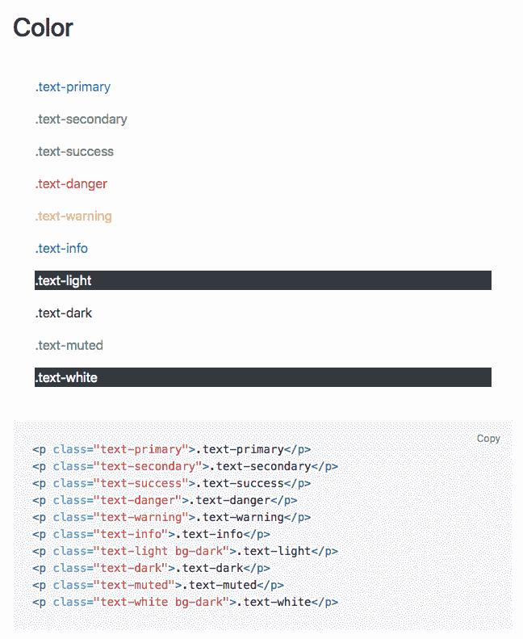

Text color classes in Bootstrap.

对于 CSS，我们只需要在标题上添加一点背景和样式:

```html
.about {
  background-image: url(img/about-us-bg.jpg);
  background-repeat: no-repeat;
  background-size: cover;
}

.about h1.display-1::after {
  content: "";
  display: block;
  background: #BF0000;
  width: 90px;
  height: 2px;
  margin-top: 30px;
}
```

让我们来看看它的样子:

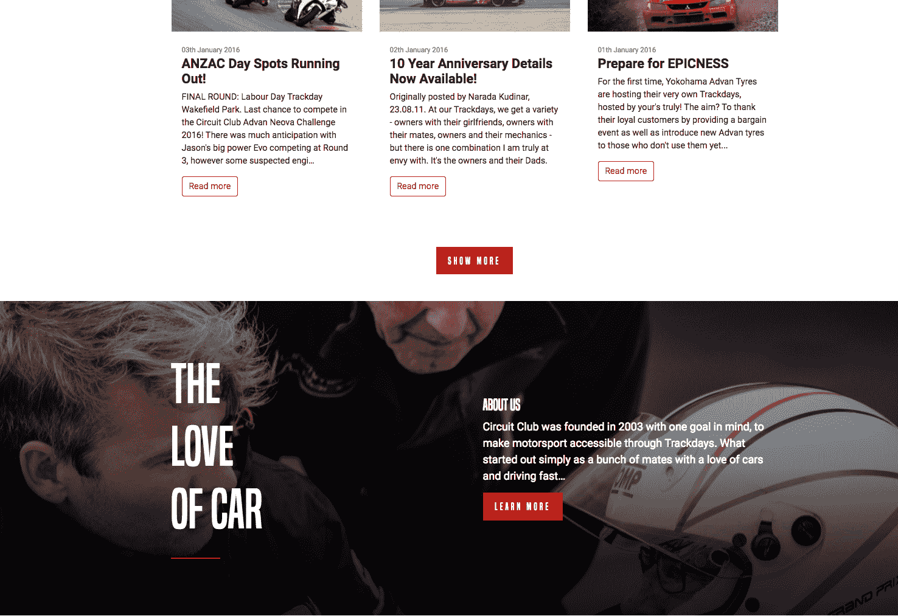

The About Us section

关于我们的部分非常简单; 让我们继续到合伙人部分。

# 样式化伙伴部分

对于 PARTNERS 部分，我们将 HTML 设置为如下所示:

```html
<!-- PARTNERS SECTION -->

    <div class="partners position-relative py-5">
      <div class="container py-5">
        <h3 class="display-3 custom-font-title text-white text-center">PARTNERS</h3>
        <div class="row d-flex justify-content-center py-5">
          <div class="my-auto text-center px-3">
            
            <p class="font-weight-normal text-white">Advan Neova Cup</p>
          </div>
          <div class="my-auto text-center px-3">
            
            <p class="font-weight-normal text-white">JDM Style Tuning</p>
          </div>
        </div>
        <div class="row d-flex align-items-center pb-5">
          <div class="mx-auto">
            <a href="#" class="btn btn-primary">Show more</a>
          </div>
        </div>
      </div>
    </div>

<!-- END PARTNERS SECTION -->
```

在前面的代码中，我们使用类`.justify-content-center`将两个伙伴水平地放在中间。 其他的都很简单。

在 CSS 中，我们唯一要做的就是将背景颜色改为黑色:

```html
.partners {
  background: #000;
}
```

这是完成了! 有多容易? ：

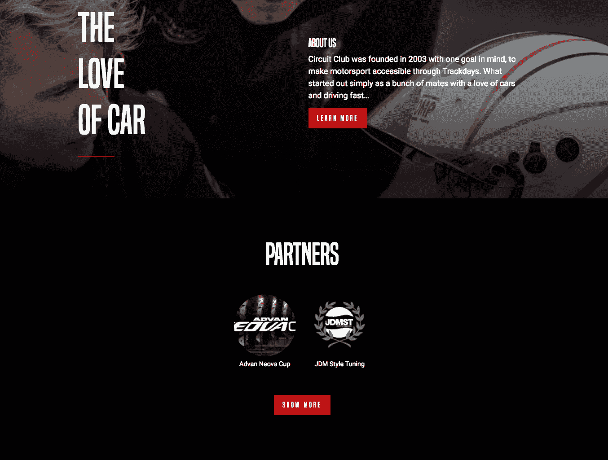

The PARTNERS section

让我们进入最后一步，也就是页脚。

# 样式页脚

对于页脚，事情会变得有点复杂。 HTML 会像这样:

```html
<!-- FOOTER -->
    <nav class="footer">
      <div class="container d-md-flex align-items-center py-md-5">
        <a class="navbar-brand" href="#"></a>
        <ul class="nav d-block d-md-flex pt-5 pt-md-0">
          <li class="nav-item"><a class="nav-link text-white" href="upcoming.html">Upcoming events</a></li>
          <li class="nav-item"><a class="nav-link text-white" href="past.html">Past events</a></li>
          <li class="nav-item"><a class="nav-link text-white" href="faq.html">FAQ</a></li>
          <li class="nav-item"><a class="nav-link text-white" href="about.html">About us</a></li>
          <li class="nav-item"><a class="nav-link text-white" href="blog.html">Blog</a></li>
          <li class="nav-item"><a class="nav-link text-white" href="contact.html">Contact</a></li>
        </ul>

        <ul class="nav ml-auto d-block d-md-flex pb-5 pb-md-0">
          <li class="nav-item"><a class="nav-link text-white" href="login.html">Login</a></li>
          <li class="nav-item"><span class="nav-link"><iframe src="https://www.facebook.com/plugins/like.php?href=http%3A%2F%2Ffacebook.com%2Fphilippehongcreative&width=51&layout=button&action=like&size=small&show_faces=false&share=false&height=65&appId=235448876515718" width="51" height="20" style="border:none;overflow:hidden"></iframe></span></li>
        </ul>
      </div>
    </nav>
    <!-- END FOOTER -->
```

在许多 Bootstrap 类中，有一些响应性实用程序类可以应用，它们总是使用相同的引用:`xs`、`sm`、`md`和`lg`。 例如，对于`.d-flex`类，您可以在需要时应用响应实用程序类。 通过添加`.d-md-flex`，您只能在中等屏幕上应用`display:flex`属性。 这是非常有用的，可以应用到许多 Bootstrap 类。

通过很好地使用类，我们只需要编写以下 CSS:

```html
.footer {
  background: #000;
}

.footer .nav-link {
  text-decoration: none;
  font-family: 'built_titling', Helvetica, sans-serif;
  font-weight: 200;
  font-size: 20px;
  letter-spacing: 4px;
} 
```

这是我们的页脚的样子:

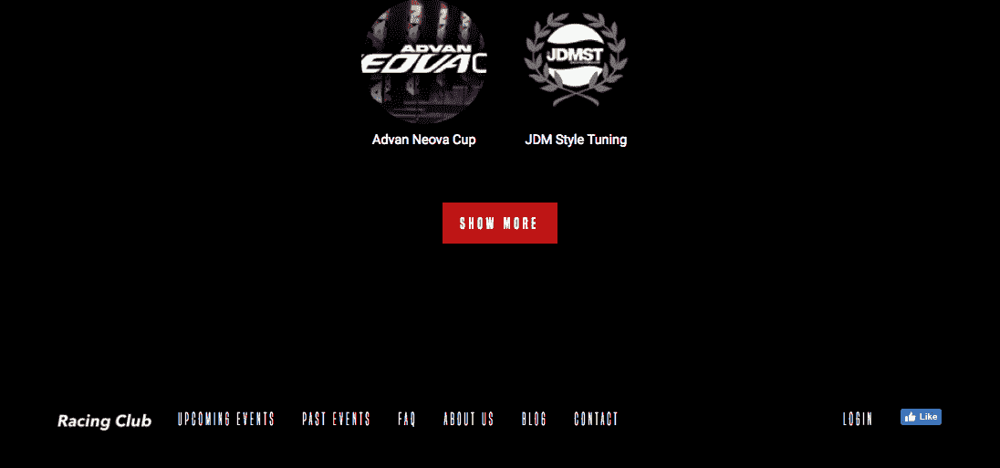

Our footer section

这是充分响应:

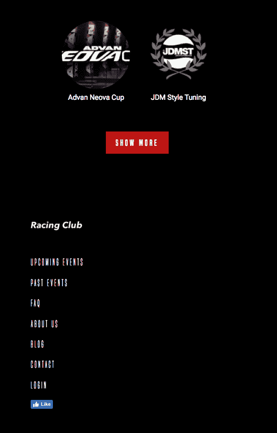

The footer section on mobile

# 总结

您看到了 Bootstrap 如何在开发阶段帮助您。 如果你能掌握 Bootstrap 的使用，你就能轻松有效地启动或实施任何项目。 这就是为什么这么多开发者喜欢 Bootstrap，你也应该喜欢它。

接下来是什么? 接下来，我们将介绍服务器端渲染以及为什么它是新的发展趋势。 我们走吧。***