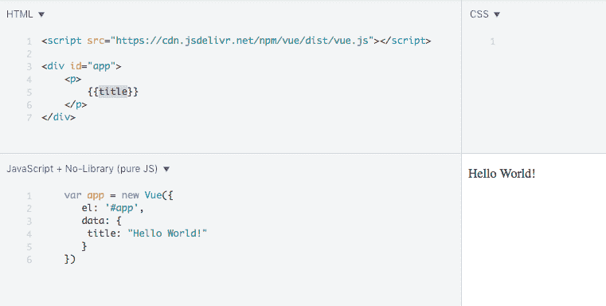
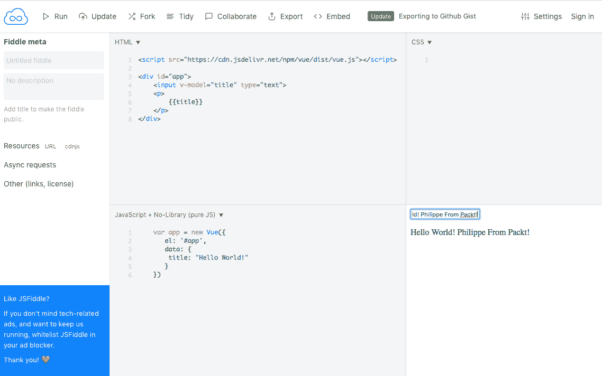
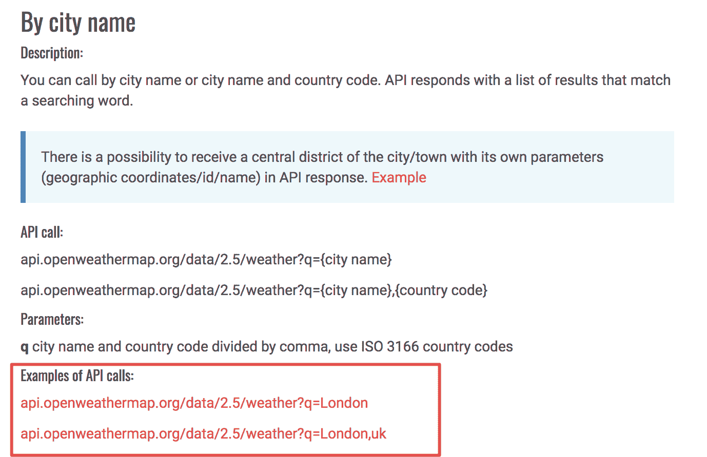

# 客户端呈现介绍

自从网络出现以来，正如我们所了解的，显示 HTML 的传统方法是使用**服务器端渲染**。 后者是伟大的; 网站很简单，不需要太多的互动。 然而，现在已经不是这样了。 在一个网站上有很多应用程序; 你需要消息传递、更新、购物、实时数据同步——终端消费者总是想要更多。

在本章中，你将学到以下内容:

*   什么是服务器端呈现?
*   什么是客户端呈现?
*   两者的优点和缺点
*   VueJS 简介
*   最后，使用 VueJS 创建一个 Weather 应用程序

那么，这个**客户端呈现**是什么? 客户端渲染是一种新型的渲染网站，主要使用 JavaScript 来渲染，而不是使用 PHP、Python 或 Ruby 等服务器端语言。

要理解两者的区别，我们需要了解服务器端呈现是如何工作的。

# 什么是服务器端呈现?

服务器端渲染是渲染网站最常见的方式。 当你访问一个网站时，就会向服务器发出一个请求，然后服务器就会以 HTML 的形式呈现这个网站。 这通常只需要几毫秒的时间，但这取决于很多因素，比如网速、位置和访客数量。

如果您想访问另一个网站，您基本上执行另一个请求服务器与相同的进程再次。 如果你的页面有上千行代码，就像现在很多网站做的那样，这会很烦人。

然而，服务器端呈现对于 SEO 来说很好，因为 HTML 页面可以让机器人抓取，这一点客户端呈现做得不好，至少不像服务器端呈现那么简单。

# 什么是客户端呈现?

另一方面，客户端呈现是用 JavaScript 呈现的。 您得到的不是 HTML 本身，而是一个简单的 HTML 结构，但使用 JavaScript 在浏览器中呈现其余的 HTML。

这是一种新的方法，最近随着 Facebook 和谷歌等公司框架的开发，这种方法获得了很大的吸引力。

主要区别在于，当您单击查看另一个页面时，JavaScript 将呈现该页面，而不是从服务器请求一个新页面。 这是一种更快的加载内容的方式，因为它只加载它需要的内容，而不是整个页面。

它的缺点是非常糟糕的 seo，因为内容是在页面加载到浏览器后才呈现的。 这是可以解决的，但不是一种简单的方法。

# 服务器端和客户端呈现的优缺点

接下来的两部分简要总结了每种方法的优缺点，以便您可以决定在每个项目中使用哪种方法。

# 服务器端呈现

优点:

*   更好的搜索引擎优化，因为搜索引擎可以抓取网站
*   初始页面加载更快
*   适合静态站点

缺点:

*   频繁的服务器请求
*   慢的呈现
*   页面每次都需要重新加载

# 客户端渲染

优点:

*   在初始加载后更快的渲染
*   适用于 web 应用程序
*   对服务器的请求更少

缺点:

*   如果不正确执行的话，SEO 会很糟糕
*   初始加载可能需要更多的时间
*   在大多数情况下需要一个外部库

# 引入到 VueJS

如果我们想要建立一个客户端渲染网站，我们可以使用许多 JavaScript 框架。 ReactJS、AngularJS 和 VueJS 是最知名的框架之一——当你知道谷歌和 Facebook 支持它们时，这并不奇怪。

vujs 是最容易学习的一种。 这就是为什么我们选择从这个开始。 在本书的最后一章，我们将简要介绍 VueJS，以便您了解它是如何工作的，以及它的可能性:


VueJS homepage 

VueJS 允许您创建从 JavaScript 驱动的小部件到现有应用程序的所有内容。 中等规模的应用程序,你控制整个页面通过 JavaScript,因此重新呈现各个部分,使它非常活泼,和一直到建设大型企业级应用程序,单页面应用程序,你的整个网页,多个页面(至少感觉这个用户),由 VueJS 驱动, 它呈现 dom 的重要部分，使它们看起来像是正在加载的不同页面，但最后，JavaScript 处理所有这些。

JavaScript 的原因吗? 由于 JavaScript 是在浏览器中运行的，所以如果您只想重新呈现应用程序的部分内容，则不需要访问任何服务器并等待任何响应。 这使得应用程序非常活跃，感觉很好，并提供了很棒的用户体验。

这就是你可以用 VueJS 做的事情。 现在，为什么你会选择 vujs 而不是，比如说，Angular 2 或 ReactJS，它们你可能知道，也会做类似的事情。 首先，VueJS 非常精简，文件大小也很小。 我们谈论的是核心框架的 16 千字节，压缩在 gzip 中。

这是一个非常专注和切题的框架。 然而，它不仅小，因此提供了快速的加载时间，它在运行时也很快，从一些基准测试来看，它甚至超过了 Angular 2 和 ReactJS。 当然，它总是取决于您的特定应用程序。

我想说，让我们现在就开始研究它，开始使用 VueJS，并构建我们的第一个小应用程序，看看我们如何实际设置它。

# 设置 VueJS

开始使用 VueJS 并创建第一个应用程序实际上非常简单。 我们从官方主页[vuejs.org](http://vuejs.org)开始; 在那里，您会注意到这个漂亮的 Get Started 按钮。 让我们点击它。 它将带您到官方文档，无论如何，这总是值得一看的，但是，在那里，我们想要进入安装。 现在，在这里，你有几个不同的选项，取决于你想使用哪种设置:


The VueJS Installation page

下载 vuejs 有不同的选择—我们可以下载文件或使用提供的 CDN。 对于这个练习，我们将简单地使用 CDN。 只需点击 VueJS 提供的链接，如下:


VueJS CDN

现在，我们不创建新的 HTML 项目，而是转到[jsfiddle.net](https://jsfiddle.net/)。

JSFiddle 是一个在线 web 编辑器，所以你可以简单地创建或测试非常容易:


JSFiddle

简单地从 VueJS 复制并粘贴脚本到 HTML`block`部分:

```html
<script src="https://cdn.jsdelivr.net/npm/vue@2.5.16/dist/VueJS"></script>
```

你可以删除`@2.5.16`，只留下`vue`，这样它总是会获取最新的版本:

```html
<script src="https://cdn.jsdelivr.net/npm/vue/dist/VueJS"></script>
```

现在我们已经导入了 VueJS，我们已经可以使用它的所有特性了。 让我们用它来构建我们的第一个小应用。 为此，我想加一段话，我想说`Hello world`:

```html
<p>
Hello world!
</p>
```

到目前为止，还没有什么有趣的事情发生。 然而，我们想要做的是能够用 VueJS 控制文本。 为此，我们需要创建一个实例。 在 VueJS 中，你只需要在 JavaScript 文件中添加以下代码:

```html
 var app = new Vue({

 })
```

现在，我需要创建一个包含我的应用程序的`div`，因为我们不想让`<p>`标签成为应用程序。我们将添加一个 ID 应用程序:

```html
<div id="app">
    <p>
        Hello world!
    </p>
</div>
```

现在我们需要调用`#app``div`并将其设置为我们应用程序的模板:

```html
var app = new Vue({
    el: '#app',
})
```

现在，要将任何数据放入我们的应用程序，我们需要`data`属性:

```html
var app = new Vue({
       el: '#app',
       data: {
         title: "Hello World!"
       }
    })
```

我们可以叫它`title`。 现在我们需要把它链接到文本上; 要做到这一点，只需删除文本并添加`{{ title }}`或属性名称。

让我们通过点击左上角的 run 按钮来运行 JSFiddle:



The first VueJS instance 

现在，你可能会说这样做没有意义。 它还没有完成。 让我们通过添加一个将链接到`<p>`中显示的文本的输入来扩展我们的 VueJS 应用程序:

```html
<input v-model="title" type="text">
```

我们在输入中添加了一个`v-model`指令; 这将把文本框绑定到 Vue 中的数据属性`title`。

你现在可以尝试添加任何文本; 它将遵循你所写的内容:



The JSFiddle end of the exercise 

现在介绍完毕。 如果在这个步骤中遇到任何问题，您可以在[https://jsfiddle.net/knee8oha/9/](https://jsfiddle.net/knee8oha/9/)访问我的 JSfiddle。

对我来说，最好的学习方法是实践。 所以，让我们一起创建一个应用程序，让你熟悉 VueJS。

# 在 vujs 中创建天气应用程序

在本练习中，我们将构建一个组件，用于在 VueJS 中显示某个位置的天气。 这个组件将创建一个位置搜索文本框; 然后搜索[http://openweathermap.org/](http://openweathermap.org/)，这是一个免费的天气 API，所以我们可以得到基于位置的搜索的信息。

# 珊瑚礁的材料

让我们创建一个简单的 HTML 文件。 在这个练习中，我们不使用 Bootstrap，而是使用另一个库，看看它有多容易。 我们将使用 Vue Material，这是一个基于谷歌 Material 设计的库。 您可以在[https://vuematerial.io/](https://vuematerial.io/)查看:


Vue Material

让我们点击 Getting started 进入他们的安装说明。 幸运的是，它们为 CDN 提供了一个可以使用的模板。 让我们复制他们的模板并粘贴到我们的 HTML 文件:

```html
<!doctype html>
<html>
  <head>
    <meta charset="utf-8">
    <meta content="width=device-width,initial-scale=1,minimal-ui" name="viewport">
    <link rel="stylesheet" href="https://fonts.googleapis.com/css?family=Roboto:300,400,500,700,400italic|Material+Icons">
    <link rel="stylesheet" href="https://unpkg.com/vue-material@beta/dist/vue-material.min.css">
    <link rel="stylesheet" href="https://unpkg.com/vue-material@beta/dist/theme/default.css">
  </head>

  <body>
    <div id="app">
      <!-- Your code here -->
    </div>

    <script src="https://unpkg.com/vue"></script>
    <script src="https://unpkg.com/vue-material@beta"></script>
    <script>
      Vue.use(VueMaterial.default)

      new Vue({
        el: '#app'
      })
    </script>
  </body>
</html> 
```

让我们先给我们的`<head>`部分添加一个标题:

```html
<title>Vue JS Weather App</title>
```

Vue Material 提供了方便的布局，我们可以重复使用。 我们希望应用程序首先是移动的标题。 我们可以使用下面的代码来插入我们的应用程序:

```html
<div id="app">
      <div class="page-container">
        <md-app md-waterfall md-mode="fixed-last">
          <md-app-toolbar class="md-primary">
            <div class="md-toolbar-row">
              <div class="md-toolbar-section-start">
                <span class="md-title">VueJS: Weather</span>
              </div>

              <div class="md-toolbar-section-end">
                <md-button class="md-icon-button">
                  <md-icon>more_vert</md-icon>
                </md-button>
              </div>
            </div>
          </md-app-toolbar>

          <md-app-content>
            <!-- OUR APP HERE -->
          </md-app-content>
        </md-app>
      </div>
    </div>
```

现在，在我们的`<script>`部分，我们想要加载应用程序:

```html
<script>

      Vue.use(VueMaterial.default)
      var weather = {
        el: '#app'
      }
      var app = new Vue(weather)
      app.$mount("#app")

    </script>
```

我们现在有一个应用程序准备使用和完全响应:


Our VueJS app

# 组件

我们将创建的第一个组件是主要天气组件。 我们需要以下三个属性附加到它:

*   数据
*   方法
*   模板

数据数组将需要以下组件的数据点:

*   `weatherLocation`:将存储输入的位置
*   `weatherApi`:这是您的开放天气 API 键[http://openweathermap.org/appid](http://openweathermap.org/appid)
*   `weather`:我们将 API 的结果存储在这个组件中
*   `displayWeather`:如果要显示数据，我们将设置一个值 true 或 false(布尔值)

为了调用 OpenWeather API，我们将为`.get()`使用 Vue 资源方法。 该方法的结果将存储在天气数据点中，然后将`displayWeather`数据点设置为`true`。

# OpenWeather 火

为了能够访问 API，我们需要注册并创建一个帐户。 废话少说，让我们在[http://openweathermap.org/appid](http://openweathermap.org/appid)创建一个帐户:


The OpenWeather signup page

点击 Sign Up 并遵循流程。 最后，您将使用 API 选项卡访问成员仪表板。 你可以复制提供的 API 密钥:


The OpenWeather API

现在让我们看看如何调用 API 并获得结果。 如果我们继续 OpenWeather 提供的文档([http://openweathermap.org/current](http://openweathermap.org/current))，你可以得到一个 API 调用的例子:



API Documentation

URL 是这样组成的:


API Call URL

我们从这个调用中得到的结果是这样的(你可以测试自己):

```html
{"coord":{"lon":-0.13,"lat":51.51},"weather":[{"id":300,"main":"Drizzle","description":"light intensity drizzle","icon":"09d"}],"base":"stations","main":{"temp":280.32,"pressure":1012,"humidity":81,"temp_min":279.15,"temp_max":281.15},"visibility":10000,"wind":{"speed":4.1,"deg":80},"clouds":{"all":90},"dt":1485789600,"sys":{"type":1,"id":5091,"message":0.0103,"country":"GB","sunrise":1485762037,"sunset":1485794875},"id":2643743,"name":"London","cod":200}
```

提供的代码是 JSON 格式的，这是显示数据时通常使用的格式。 代码被缩小了，所以更难阅读。 让我们用一个工具来消除它。 我使用[http://unminify.com/](http://unminify.com/)。 要做到这一点，只需粘贴代码并单击 Unminify:

```html
{
    "coord": {
        "lon": -0.13, "lat": 51.51
    }
    ,
    "weather":[ {
        "id": 300, "main": "Drizzle", "description": "light intensity drizzle", "icon": "09d"
    }
    ],
    "base":"stations",
    "main": {
        "temp": 280.32, "pressure": 1012, "humidity": 81, "temp_min": 279.15, "temp_max": 281.15
    }
    ,
    "visibility":10000,
    "wind": {
        "speed": 4.1, "deg": 80
    }
    ,
    "clouds": {
        "all": 90
    }
    ,
    "dt":1485789600,
    "sys": {
        "type": 1, "id": 5091, "message": 0.0103, "country": "GB", "sunrise": 1485762037, "sunset": 1485794875
    }
    ,
    "id":2643743,
    "name":"London",
    "cod":200
}
```

现在代码更多了，可以看到数据显示为`id`和`value`。 我们想用什么就用什么。 在这个练习中，我们将选取以下数据:

*   平均温度
*   最低温度
*   最大温度
*   对天气的描述
*   日出和日落时间

让我们开始吧。

# API 调用

首先，我们需要创建包含所有内容的 HTML 标记。

让我们在应用程序中创建一个 HTML 标签`<weather>`:

```html
<md-app-content>
            <!-- OUR APP HERE -->
            <weather></weather>
          </md-app-content>
```

在`script`部分，让我们创建第一个 Vue 函数:

```html
Vue.component('weather', {

});
```

如前所述，我们需要数据、方法和模板来显示内容。 让我们从数据开始:

```html
Vue.component('weather', {

    data: function(){
            return {
                weatherLocation: '',
                weatherApi: '05911854df7aa0be884df72549a75fd9',
                weather: [],
                displayWeather: false
            }
```

```html
        },

});
```

该函数将存储以下内容:

*   由用户设置的位置
*   我们的 API 密钥
*   从 API 中取出的数据
*   显示或不显示信息的布尔值集合

接下来，我们需要添加方法，如下所示:

```html
methods: {
            getWeather: function()
            {
                return this.$http.get('http://api.openweathermap.org/data/2.5/weather?q='+ this.weatherLocation +'&appid=' + this.weatherApi).then((response) => {
                    this.weather = response.body;
                    this.displayWeather = true
                }, (response) => {
                    this.weather = [];
                    this.displayWeather = false
                });
            }
        },
```

我们将设置`getWeather`函数，它将做以下事情:

*   使用我们的 API 键和用户通过前面的数据设置的位置调用 API
*   存储从 API 中提取的数据，并将显示信息设置为`true`
*   如果 API 没有应答或内容，则显示信息设置为`false`

最后，模板如下所示:

```html
template: '<div id="weatherApp">' +
                  '<form v-on:submit.prevent="getWeather"><md-field> <md-icon>place</md-icon> <label>Location</label> <md-input type="text" name="weatherLocation" v-model="weatherLocation"></md-input></md-field>' +
                    '<md-button class="md-primary md-raised" type="submit">Search</md-button> '+
                    '</p>' +
                '</form>' +
                '<div v-if="displayWeather" class="container display-weather-section"><md-card><md-card-header><h1>{{ weather.name }}</h1></md-card-header>' +
                '<md-card-content><weather-display v-bind:weatherDisplay="weather.weather[0]"></weather-display>' +
                '<temperature v-bind:temperature="weather.main"></temperature>' +
                '<clouds v-bind:cloud="weather.clouds"></clouds>' +
                '<sun v-bind:sun="weather.sys"></sun>' +
                '</md-card-content></md-card>' +
                '</div></div>'

      });
```

然后，我们将这些信息片段传递给为每个片段创建的模板。 对于天气名称和描述，我们有以下模板:

```html
Vue.component('weather-display', {
        props: ['weatherDisplay'],

        template: '<div id="weatherDisplay">' +
                    '<h2>{{ weatherDisplay.main }}</h2>' +
                    '<p>{{ weatherDisplay.description }}</p>' +
                    '</div>'
      });
```

我们使用`props`属性传递数据，使用`template`属性创建带有值的 HTML。

然后是温度。 我们将显示平均温度、最高温度和最低温度。 我们从 OpenWeather API 获得的数据是 Kelvin 格式的，因此我们需要创建一个函数来转换温度。

要把开尔文转换成摄氏度，你只需要从数字中减去`273.15`:

```html
Vue.component('temperature', {
        props: ['temperature'],

        methods: {
            displayTemp: function( temp )
            {
                return parseFloat(temp - 273.15).toFixed(2);
            }
        },

        template: '<div id="temp">' +
                    '<h2>Temperature</h2>' +
                    '<p>Avg Temp - {{ displayTemp(temperature.temp) }}c</p>' +
                    '<p>Min Temp - {{ displayTemp(temperature.temp_min) }}c</p>' +
                    '<p>Max Temp - {{ displayTemp(temperature.temp_max) }}c</p>' +
                    '</div>'
      });
```

对于`cloud`，我们只需要显示文本:

```html
Vue.component('clouds', {
        props: ['cloud'],

        template: '<div id="cloud">' +
                    '<h2>Clouds</h2>' +
                    '<p>Coverage - {{ cloud.all }}%</p>' +
                    '</div>'
      });
```

最后，我们有日出和日落。 我们从 OpenWeather 获得的格式是时间戳，所以我们需要将其转换为日期时间:

```html
Vue.component('sun', {
        props: ['sun'],

        methods: {
            timestampToDate: function( timestamp ){
                var date = new Date(timestamp*1000);
                return date.toString();
            }
        },

        template: '<div id="sun">' +
                    '<h2>Sun</h2>' +
                    '<p>Sunrise - {{ timestampToDate(sun.sunrise) }}</p>' +
                    '<p>Sunset - {{ timestampToDate(sun.sunset) }}</p>' +
                '</div>'
      });
```

我们的应用程序现在完成了。 让我们来看看它的样子:


Our weather application - The Search bar

然后，我们有我们的结果页面:


Our weather application - The Result page

# 总结

这是对 VueJS 的简要介绍。 这个框架有如此多的可能性，而我只是触及了它的一小部分。 我希望这篇文章能激发您的好奇心，让您更深入地研究 VueJS 或您所选择的任何客户端渲染框架。 在接下来的最后一章中，我将向你展示我每天使用来帮助我工作流程的工具列表。 这些肯定也会对你有帮助。 让我们开始吧!