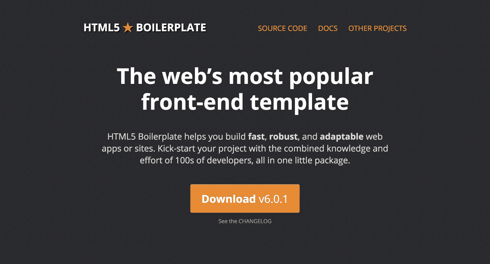
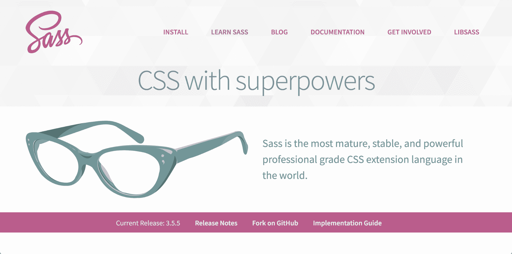
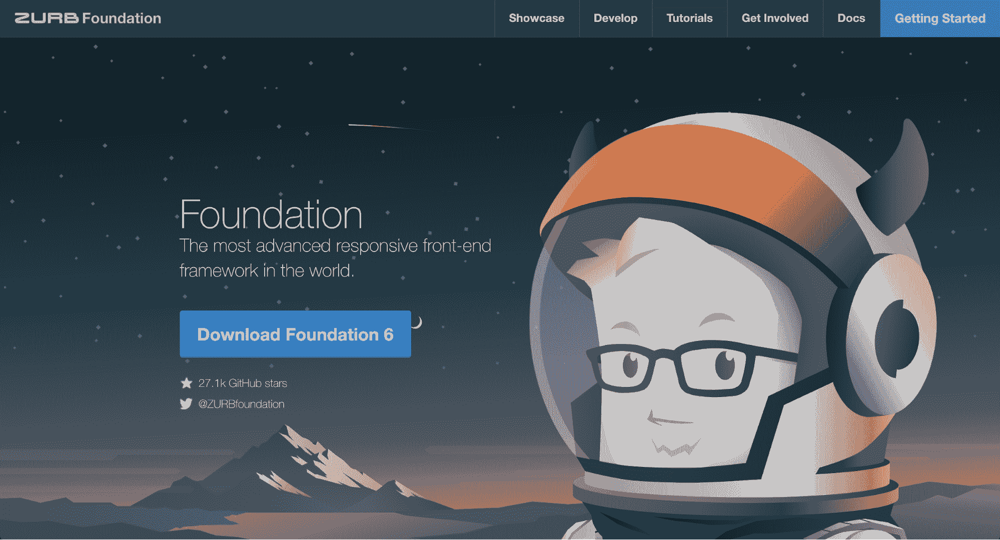
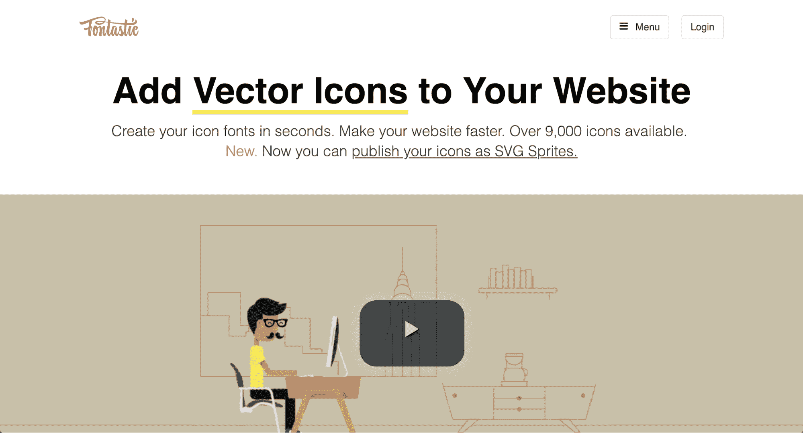
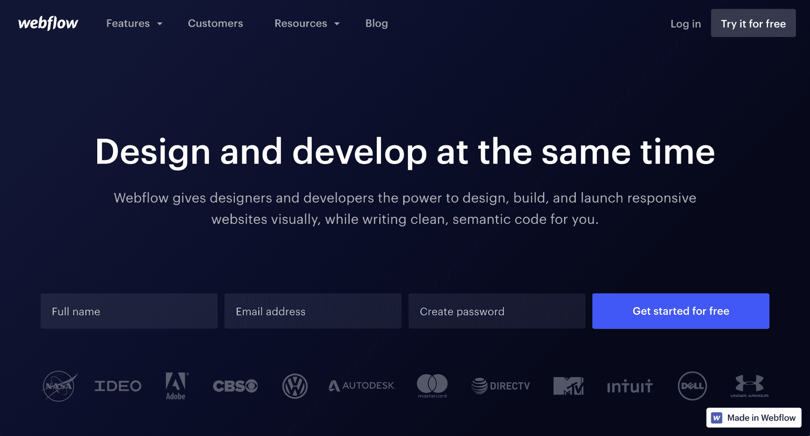
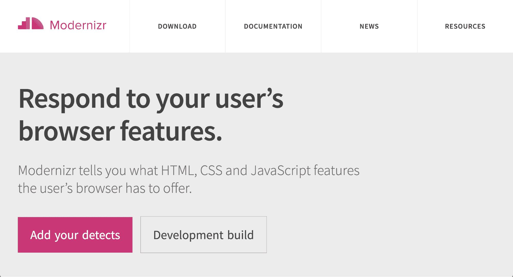
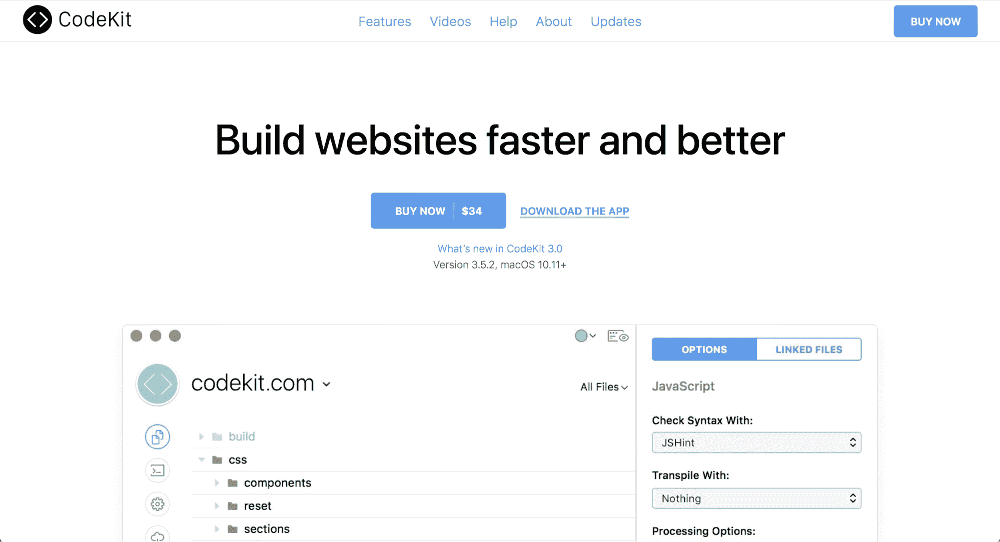
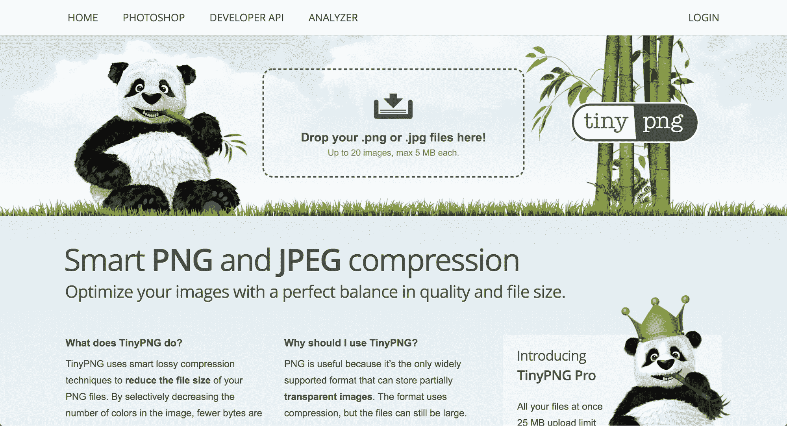

# 十四、有助于您工作流程的工具

一个没有相机的摄影师，一个没有纸和笔的时装设计师，这算什么? 就像他们说的，你的能力取决于你的工具。

在这一章中，我们将回顾一些我最喜欢的工具，它们可以帮助你改善每天的工作流程，如以下:

*   HTML 样板
*   Lorem Ipsum
*   CSS 预处理表示“不”
*   CSS 预处理- Sass
*   ColorZilla
*   基金会
*   Fontastic
*   webflow
*   Modernizr
*   CSS3 发电机
*   git 
*   Codekit 
*   Animate.css
*   TinyPNG
*   Unsplash

让我们开始吧!

# HTML 样板

我们已经在我们的项目中使用了这个工具。 HTML5 Boilerplate 是最常用的前端模板之一。 顾名思义，这个前端模板基于 HTML5。 它是一个库和 hack 的集合，使您能够快速(和有效地)开始您的最新项目。 HTML5 锅炉也许是让你的项目启动和运行的最快的解决方案:

HTML 样板

无论你是想建立网站还是应用程序，你都可以使用 HTML5 Boilerplate 来节省时间而不影响性能。

关于 HTML5 Boilerplate 更好的是它在 GitHub 上的巨大社区支持。 在遇到问题的极少数情况下，您总是可以找到所需的帮助。 虽然 HTML5 Boilerplate 不适用于大型项目，但当你需要立即开始一个较小的项目，并且不想从头开始编写代码时，它是完美的。

# Lorem Ipsum

我们都熟悉 Lorem Ipsum，即使我们不知道它的名字。 设计人员使用它作为在设计项目中模拟文本的方法。

事实上，Lorem Ipsum 的历史比你想象的要长得多。 这不是设计师的新把戏。 在过去的 500 年里，印刷和设计行业一直在使用这个拉丁文本来复制实际文本的外观:

[Lorem Ipsum](http://designerstoolbox.com/designresources/greek/)

然而，你可能会想，为什么是 Lorem Ipsum? 当你可以很容易地复制和粘贴一个短语像*你的文本在这里*一遍又一遍的时候，为什么要使用死语言来填充一个空间?

Lorem Ipsum 不仅仅是一个填充文本，它还提供了一种错觉。 在内容上，就像你在这里读到的一样，是有变化的。 你会有两个字母的单词在九个字母的单词旁边。 没有重复的模式。

但是，当您使用重复的短语作为文本占位符时，它可能会破坏整个项目。 人类的眼睛会被重复的模式分心。 当然，这将把你的注意力从你的整体设计上转移开，并可能导致客户把注意力集中在所有挑剔的事情上，而忽略了项目。

如果你是一个纯粹主义者，你可以使用 Designers Toolbox 的 Lorem Ipsum(希腊文)生成器[(http://designerstoolbox.com/designresources/greek/)](http://designerstoolbox.com/designresources/greek/)在这里。 它非常适合传统的 Lorem Ipsum 文本占位符。 然而，如果想要一个有趣、幽默的转折，可以看看 Bacon Ipsum[(https://baconipsum.com/)](https://baconipsum.com/?paras=5&type=all-meat&start-with-lorem=1)。

# CSS 预处理- LESS

想要用**更精简的样式表**(**LESS**)做更多? 它是 CSS 的语言扩展，也是最流行的 CSS 预处理器之一:

[LESS](http://lesscss.org/)

如果您已经熟悉 CSS，那么开始使用 LESS 对您来说会很容易。 事实上，有了 CSS 的背景知识，你可以在更短的时间内学习到更少的内容，甚至比你阅读本章剩下的部分所花的时间还要少。

那么，为什么要使用 LESS 而不是 CSS 呢? 使用 LESS 的最大原因之一是你可以在你的项目中获得更多的时间。

它的工作原理很像编程语言。 变量可以用带有`@`符号的 LESS 来定义。 然后，您可以存储一个常量值，然后可以在整个样式表中重用它。 这绝对是一个值得一试的工具。

# CSS 预处理- SCSS

LESS 并不是唯一可用的 CSS 扩展。 查看**语法上很棒的样式表**(**SASS**)。 它是一种脚本语言，由两种语法组成:原始的*缩进语法*(给出了`.sass`扩展)和新的 SCSS 语法(给出了`.scss`扩展):

[SCSS](https://sass-lang.com/)

不管你使用的是哪个版本的 CSS 库，SASS 都是兼容的。 此外，与 LESS 类似，SASS 是开源的，并且得到了一个庞大的开发人员社区的支持。 同样地，它也是向后兼容的，因此您可以转换 CSS 文件。

那么，为什么选择 SASS 而不是 LESS 呢? 根据你问的人的不同，SASS 更受欢迎，LESS 更容易使用。 这可以归结为你更喜欢 Ruby 还是 JavaScript。 SASS 是用 Ruby 编写的。 然而，LESS 最初是用 Ruby 编写的，现在已经移植到了 JavaScript。 你需要 NodeJS 运行 LESS。

# ColorZilla

试图找到完美的颜色，但不能完全复制它?

输入 ColorZilla。 这个浏览器插件是一个滴管，一个颜色选择器和一个渐变生成器。 ColorZilla 可在 Chrome 和 Firefox 中使用。 ColorZilla 还提供了一个 CSS 渐变编辑器，你可以从[http://www.colorzilla.com/gradient-editor/](http://www.colorzilla.com/gradient-editor/)直接访问:

[ColorZilla](http://www.colorzilla.com/)

对于平面设计师和网页开发者来说，ColorZilla 是一个救星。 这是一个简单的工具，你会发现自己每天都在使用。 它可以帮助您从浏览器中的任何页面(或图像)获得准确的颜色读数。

# 基金会

由 Zurb 创建的 Foundation 是一个开放源码、响应式前端框架。

Foundation 是高度可定制的。 设计师更喜欢 Foundation，因为它与几乎所有浏览器和设备都兼容，坚持移动优先的原则。 当你需要快速创建一个项目，包括必须在智能手机上运行的应用程序时，Foundation 是一个明智的选择。 您不需要了解或修改后端编码。 它简单地适用于所有类型的项目，从原型到 HTML 电子邮件到工作的网站:

[Foundation](https://foundation.zurb.com)

基金会可以与您选择的任何 CMS 一起工作。

# Fontastic

是否需要快速改变图标的大小或颜色? 在图标上添加阴影或其他设计元素怎么样?

咱们 Fontastic 见面吧。 这个神奇的工具允许设计师快速改变图标，以满足任何项目的独特需求。 你可以通过创建自己的图标字体来做到这一点。 然后，将该字体上传到您的项目中。 一旦上传，你就可以使用 CSS 来定制图标的外观和感觉，而不用费力地操作 Photoshop 中的每个图标:

Fontastic (http://fontastic.me/)

下面是它的工作原理。 前往 Fontastic，从它的 9000 多个图标图像中选择图标。 接下来，为每个图标分配字母(创建字体)。

在这里，您可以在 CSS 的帮助下修改图标。 从改变颜色到调整大小，你都可以通过编码来完成，而不是重新绘制和浪费大量的时间。

# webflow

好消息是，即使你对编码一窍不通，你仍然可以设计和建立网站。

Webflow 正是您所需要的工具。 它一半是设计师，一半是开发人员，完全令人惊叹。 你可以直观地设置你的网站设计，然后 webflow 完成剩下的工作。 它将编码您的网站来生活和功能完美无缺:

webflow (https://webflow.com/)

这里没有模拟和原型。 webflow 创建使用 HTML、CSS 和 JavaScript 的实时且功能齐全的网站。

顺便说一下，我有没有提到它也是有响应的? 这意味着你不必担心最终项目在更小的屏幕上看起来不稳定。

如果你想知道代码的质量，你可以放心，webflow 保证了干净的代码，不会减慢网站访问者的体验。

# Modernizr

Modernizr 是一个小型 JavaScript 库，用于自动检测用户浏览器中的特性和/或技术(如 HTML5)。 这个工具的目的是优化你的网站用户的体验基于他们独特的浏览器。 你可以使用 Modernizr 在你的网站上提供一个愉快的浏览体验，无论浏览器是多么的新或过时:

ModerniZR (https://modernizr.com/)

# CSS3 发电机

当您需要为 CSS 快速创建代码时，您将需要一个 CSS3 Generator。

从文本阴影到渐变，从多列到过渡，你可以用一个简单的 CSS3 生成器做很多事情:

CSS3 Generator (http://css3generator.com/)

好消息是 CSS3 Generators 有很多工具可以帮助您。 通过其中一个工具生成您的 CSS3 代码段，然后将代码直接复制到您的项目中。 编码并不是每个人都适合的，如果您是一个视觉思考者，这个生成器快捷方式对您来说是完美的解决方案。

CSS3 Generator 是我最喜欢的 CSS3 工具之一，因为它快速、干净、易于使用。

# git

下面这些对你来说都是真的吗?

*   您需要一个版本控制系统来跟踪对您的文件所做的任何更改
*   你和很多人一起工作
*   你需要经常远程或离线工作

然后，你需要 git:

git (https://git-scm.com/)

git 是一个开源版本控制系统。 无论你是在一个小项目还是一个大项目中工作，git 都是一个不错的选择。 它的速度和灵活性使它成为一个极好的选择。

下面是 git 的工作原理:

Git 与你的本地副本一起工作，当你离线时可以执行:

1.  每次保存工作时，git 都会创建文件的映像，也称为提交
2.  每次创建这个提交时，它都会链接到您的其他提交，这意味着您的文件上的所有活动都会发生变化
3.  无论何时您(或团队中的其他人)做了更改，您的提交都会创建一个记录
4.  您可以使用它来反转更改并返回到以前的提交

git 的另一个好处是文件的处理方式。 文件以修改、暂存或提交的形式存在。 在修改状态下，您对文件所做的更改只存在于您的本地工作目录中。 然后，您可以将这些新修改的文件放置在舞台上。 当更改成为文件开发的永久部分时，就会进入最后一个阶段。

# CodeKit

CodeKit 是另一个构建网站的工具。 基本上，CodeKit 自动化了许多开发人员的任务，因此构建一个网站不会花费很长时间。 它可以编译任何语言和所有语言，所以 CodeKit 非常容易使用:

CodeKit (https://codekitapp.com/)

我喜欢 CodeKit 的原因很简单，即更改后不需要刷新浏览器。 CodeKit 会自动为您完成这些工作。 支持所有浏览器，支持所有设备。

另一个放弃一切转而使用 CodeKit 的原因? 网站优化就是这么简单。 CodeKit 允许您在一次单击中将图像最小化 70%。 您可以使用它来最小化脚本并减少 HTTP 请求。 这些类型的优化是一些最好的方法来确保一个快速的网站。

CodeKit 的拖放用户界面非常漂亮和友好。

# Animate.css

css 只是为了好玩。 从关注者到缩放出口，你会发现几十个 CSS 动画来美化你的网页设计:

Animate CSS (https://daneden.github.io/animate.css/)

css 被打包在一个小文件中。 你需要的一切都在那个文件里。 从官方网站下载后，您将把样式表放到文档的头部。 从那里，你将把你选择的动画添加到你想要的元素中，并高兴地看着你的想法跳出屏幕(或任何你选择的效果)。 所有这些都记录在 README 文件中[(https://github.com/daneden/animate.css/blob/master/README.md)](https://github.com/daneden/animate.css/blob/master/README.md)。

css 是一个很好的选择，可以为你的 web 项目增加乐趣和兴趣。 由于它是 CSS，所以它是轻量级的，并且与大多数查看屏幕兼容。

# TinyPNG

我最喜欢的一个设计工具是 TinyPNG。 顾名思义，TinyPNG 压缩 PNG 或 JPEG 图像以减少文件大小。 然而，它这样做不会降低你的文件的视觉质量-它就像魔术:

TinyPNG (https://tinypng.com/)

为了实现 web 项目的最大速度，尽可能地减小文件大小是很重要的。 毫无疑问，图像文件通常是网站上最大的文件。 这就是为什么:TinyPNG 是一个惊人的选择-它可以减少你的文件大小(通常是 50%或更多)而不影响视觉效果。 更小的文件大小不仅意味着更快的加载时间，而且还节省了带宽。

TinyPNG 使用起来像闪电一样快，如果你注册了一个专业账号，你可以一次上传 25mb 的内容。 使用免费服务时，你只能使用 20 张图片，每张图片的最大大小为 5mb。

# Unsplash

当你需要一张高质量的照片，但付不起摄影师的钱，或者只是需要一个占位符为一些设计，Unsplash([https://unsplash.com/](https://unsplash.com/))适合你。 它提供由摄影师上传的开放源代码和免费使用的图像:

Unsplash (https://unsplash.com/)

我每天都用它，老实说，它成了我用得最多的网站之一。

# 总结

我希望这些工具能像帮助我一样帮助你。 不要节制地使用它。 设计社区的好处是，每个人都喜欢分享自己的工作，互相帮助。 设计师和开发者是一个开放的社区，这是我们社区的真正精神所在。