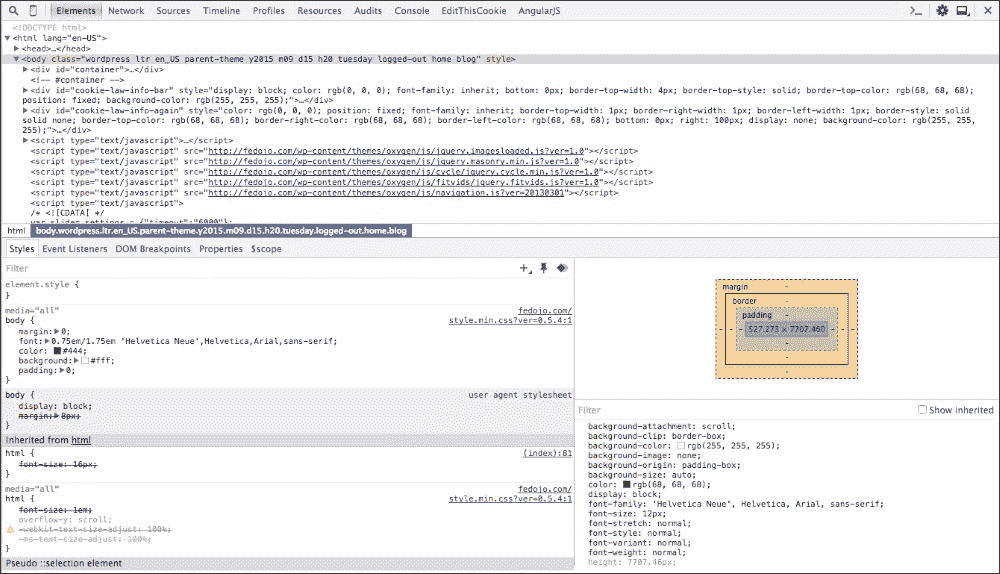
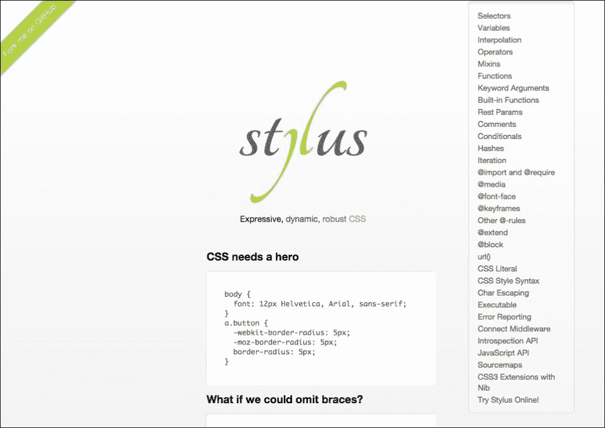
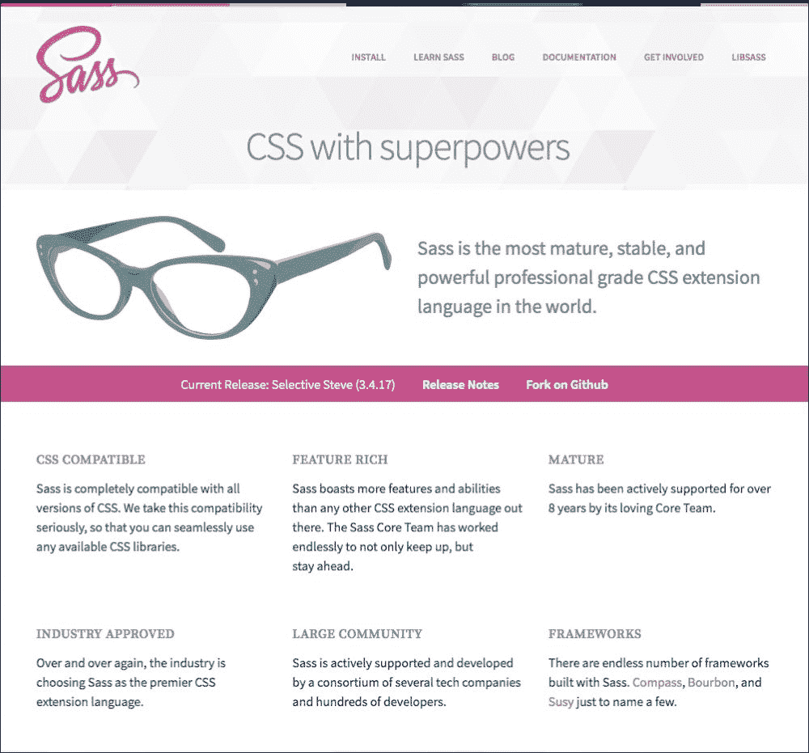
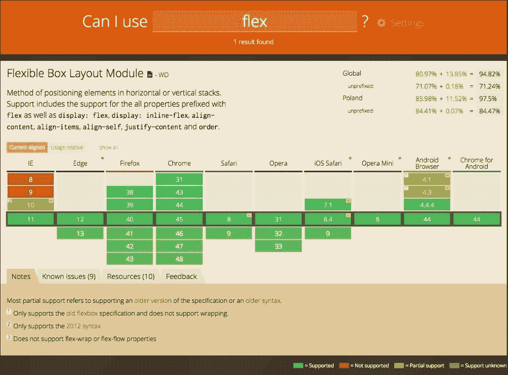

# 第一章。基础和工具

了解每个区域的基础很重要。你需要有基本的信息才能成为专业人士。良好的工具使用几乎和基础一样重要。没有好的工具，你的底子就用不好。

本章是关于有助于构建更好的 CSS 代码的工具。描述了预处理程序的特点，最后介绍了 SASS 的基础知识。在本章中，您可以通过`GULP.js`获得前端开发中可重复流程自动化的基本知识。最后，您可以找到一个文件结构的例子，它将把您的项目分成小的、易于编辑和维护的文件。

在本章中，我们将:

*   了解预处理器的用法。
*   创建一个具有适当结构的 CSS 项目。

# 选择正确的 IDE

构建 CSS 代码相当简单。如果你想开始，你只需要一个简单的文本编辑器，然后开始编写你的代码。如果你想加快这个过程，你需要选择合适的文本编辑器或集成开发环境。目前最受前端开发人员欢迎的编辑器/IDEs 如下:

*   崇高的文本
*   原子
*   web 图形/PHPStorm
*   Eclipse/Aptana
*   括号

你的选择将基于价格和质量。你应该使用你觉得最舒服的编辑器。

## 用片段/Emmet 加速编程过程

当你正在创建一个代码，你有你在所有项目/文件中重复的部分代码。您将需要创建代码片段来帮助您加快编写代码的过程。作为一名前端开发人员，我推荐你先了解一下 **【埃米特】**(之前是 Zen Coding)。这是一个 HTML/CSS 片段的集合，将帮助您更快地构建代码。怎么用？它基本上包含在现代前端编辑器中(崇高文本、原子、括号、网络风暴等)。如果你想检查 Emmet 在 CSS 中是如何工作的，你需要开始某个类的声明，例如`.className`，打开括号(`{}`)并写下例如:

```html
pl
```

然后按下*标签*按钮，将触发埃米特片段。因此，您将获得以下结果:

```html
padding-left
```

以下是最常用的属性和值的示例:

<colgroup class="calibre15"><col class="calibre16"> <col class="calibre16"></colgroup> 
| 

埃米特形式

 | 

结果

 |
| --- | --- |
| `bg` | 背景 |
| `bgc` | 背景颜色 |
| `m` | 边缘 |
| `ml`、`mr`、`mt`、`mb` | 左边距、右边距、上边距、下边距 |
| `ml20px` | 左边距:20px |
| `c` | 颜色 |
| `fl` | 浮动:左侧 |
| `p20px20p` | 填充:20 像素 20% |
| `tac` | 文本对齐:居中 |
| `tdn` | 文字装饰:无 |
| `ttu` | 文本转换:大写 |
| `dib` | 显示:内嵌块 |
| `!` | ！重要的 |

为了更好地了解 Emmet 并获得完整的功能列表，建议查看项目的官方网站，网址为:[http://emmet.io/](http://emmet.io/)。

## 键盘快捷键

你还记得你学过印象最深刻的键盘快捷键 *Ctrl* + *C* 、 *Ctrl* + *V* 吗？每次你想进行复制粘贴一些文本或任何其他元素的操作时，它帮助你节省了大约 2 秒钟。但是在构建代码时自动化一些过程呢？是的，这会很有帮助，你可以用键盘快捷键来做。

您应该在 IDE 中知道的快捷方式如下:

*   复制线
*   删除行
*   动线
*   格式化代码

# 跨浏览器兼容性——应该安装哪些浏览器？

为了测试你的代码，你需要所有的现代网络浏览器。在您的列表中，您应该有以下浏览器:

*   谷歌浏览器(最新版本)
*   Mozilla Firefox(最新版本)
*   Mozilla Firefox 开发者版(最新版本)
*   歌剧(最新版本)
*   Safari(最新版本)
*   微软公司出品的 web 浏览器

互联网浏览器(IE)是前端开发人员生活中最大的问题，因为你的机器上需要一堆 IE，例如 9、10 和 11。名单越来越小，因为过去的名单更长。IE6、7、8、9 等等。现在 IE6、7 和 8 大多不受像 YouTube 和脸书这样的大型网络项目的支持。但是它有时发生在大公司，在这些公司中，操作系统的改变是一个相当复杂的过程。

为了在众多浏览器上轻松测试您的代码，最好使用专门用于此测试的在线工具:

*   [https://crossbrowsertesting.com/](https://crossbrowsertesting.com/)
*   [https://www.browserling.com/](https://www.browserling.com/)
*   [https://www.browserstack.com/](https://www.browserstack.com/)

但是一个简单免费的方法是在你的电脑上创建一个虚拟机，使用你需要的系统和浏览器。要收集需要的 IE 版本，可以参考 [http://modern.ie](http://modern.ie) 。有了`modern.ie`，可以选择自己需要的 IE 版本和自己的虚拟机平台版本(VirtualBox、Parallels、游民、VMware)。

## 如何使用检验员

处理【HTML 和 CSS 代码在没有检查器的今天几乎是不可能的。在这个工具中，您可以看到标记和 CSS。此外，您可以看到箱式模型。这在浏览器中对于 web 开发人员来说也是众所周知的。几年前，每个人都在使用火狐专用的 Firebug。现在，每个现代浏览器都有自己的内置检查器，可以帮助您调试代码。

调用检查器最简单的方法是右键单击一个元素并选择**检查**。在 Chrome 中，你可以用快捷键来完成。在窗口，你必须按下 *F12* 。在 MAC OSX 中，您可以使用*cmd*+*alt*+*I*来调用检查器。



## 快捷键

为了更快地使用你的浏览器，知道一些可以加快速度的组合键是很好的。

<colgroup class="calibre15"><col class="calibre16"> <col class="calibre16"></colgroup> 
| 

组合键

 | 

功能

 |
| --- | --- |
| *ctrl*+*【r】*，*cmd*+*【r】* | 重新加载 |
| *ctrl*+*【shift】*+*【r】*，*【cmd】*+*【shift】+*【r】** | 用缓存重新加载 |
| *cmd* + *I* ， *F12* | 检查员 |
| *ctrl*+*【u】*，*【cmd】*+*【alt】*+*u* | 页面来源 |

# 预处理器–为什么要使用它们？

预处理器是一个程序，它将从其他与 CSS 相似或几乎相同的语法中构建 CSS 代码。预处理器的主要优势如下:

*   代码嵌套
*   使用变量的能力
*   创造混搭的能力
*   运用数学/逻辑运算的能力
*   使用循环和条件的能力
*   多个文件的连接

## 预处理器中的嵌套元素

预处理程序给了你用声明嵌套构建代码的优势。在简单的 CSS 中，您必须编写以下内容:

```html
.class {
  property: value;
}
.class .insideClass {
  property: value;
}
```

在预处理器中，您只需要编写以下内容:

```html
.class {
  property: value;

  .insideClass {
    property: value;
  }
}
```

或在 SASS 中用以下缩进:

```html
.class
  property: value

  .insideClass
    property: value
```

它会简单地编译成代码:

```html
.class {
  property: value;
}
.class .insideClass {
  property: value;
}
```

正确使用嵌套会给你最好的结果。你需要知道好的 CSS 代码。

## 使用变量参数化你的 CSS 代码

在好的 CSS 代码中，不可能在所有浏览器中都使用变量。有时您在少数地方使用相同的值，但是当您收到客户/项目经理/客户经理的更改请求时，您只需要立即更改一些颜色/边距，等等。在 CSS 中，旧版本的 Internet Explorer 不支持变量的使用。CSS 预处理程序可以使用变量。

## 在预处理程序中使用混合蛋白

在经典的编程语言中，你可以使用函数来执行一些数学运算或者做一些其他的事情，比如显示文本。在 CSS 中，你没有这个特性，但是在预处理程序中你可以创建混合。例如，您需要边界半径的前缀(旧的 IE、Opera 版本):

```html
-webkit-border-radius: 50%;
-moz-border-radius: 50%;
border-radius: 50%;
```

您可以创建一个混合(在 SASS 中):

```html
@mixin borderRadius($radius) {
  -webkit-border-radius: $radius;
  -moz-border-radius: $radius;
  border-radius: $radius;
}
```

然后调用它:

```html
@include borderRadius(20px)
```

## 数学运算

在预处理器中，可以使用如下数学运算:

*   添加
*   减法
*   增加
*   区分的

例如，我们可以创建简单的网格系统。例如，您需要 10 列，分辨率为 1000 像素:

```html
$wrapperWidth: 1000px;
$columnsNumber: 10;
$innerPadding: 10px;

$widthOfColumn = $wrapperWidth / $columnsNumber;

.wrapper {
  width: $wrapperWidth;
}

.column {
  width: $widthOfColumn;
  padding: 0 10px;
}
```

## 逻辑运算和循环

没有逻辑运算符对运算和循环的比较，就无法用经典编程语言创建一个好的程序。这同样适用于预处理程序。您需要它们来自动创建类/混合等等。以下是可能的运算符和循环列表。

比较运算符列表如下:

*   `<`:小于
*   `>`:大于
*   `==`:等于
*   `!=`:不等于
*   `<=`:小于或等于
*   `>=`:大于或等于

逻辑运算符列表如下:

*   `and`
*   `or`
*   `not`

循环列表如下:

*   `if`
*   `for`
*   `each`
*   `while`

## 多个文件的连接

在经典 CSS 中，可以将文件导入到一个 CSS 文档中。但是在浏览器中，它仍然会向服务器发出额外的请求。假设您有一个包含以下内容的文件:

```html
@import "typography.css"
@import "blocks.css"
@import "main.css"
@import "single.css"
```

它将生成对 CSS 文件的四个额外请求。有了预处理器，每个`@import`都为你做了一个合并，在这个地方你就有了提到的文件的内容。最后，你有四个文件。

## Less–简短介绍

Less 是一个预处理器，主要用于 Bootstrap 框架。它具有预处理器的所有特性(混合、数学、嵌套和变量)。


好的特性之一是快速调用声明的 mixins。例如，您已经创建了一个类:

```html
.text-settings {
  font-size: 12px;
  font-family: Arial;
  text-align: center;
}
```

然后，您可以将声明的属性及其值添加到 less 文件中声明的其他元素中(它的工作方式类似于 mixin):

```html
p {
  .text-settings;
  color: red;
}
```

您将最终获得以下内容:

```html
p {
  font-size: 12px;
  font-family: Arial;
  text-align: center;
  color: red;
}
```

## 带手写笔的 CSS

手写笔有两个版本的代码(像 SASS):一个带大括号/分号，另一个不带大括号/分号。此外(通过 SASS)，您可以省略冒号。如果它继续发展，并仍然保留其目前的功能，它将是 SASS 的最大竞争对手。



## SASS——最成熟的预处理器

SASS 代表**语法上非常棒的样式表**。最早出现在 2006 年，主要连接 **【轨上红宝石】** ( **RoR** )项目。RoR 使用的敏捷方法对前端开发产生了影响。这是目前最著名的 CSS 预处理器，用于基础框架和 Compass 的结合。推特引导(第四版)框架的新版本也将基于 SASS。



在 SASS 中，你可以用一个类似 CSS 的版本写代码，这个版本叫做 **SCSS** 。这个版本的代码看起来非常类似于 CSS 语法:

```html
a {
  color: #000;

  &:hover {
    color: #f00;
  }
}
```

代码的第二个版本是 SASS。它使用缩进，与前面的代码相同，但用 SASS 编写:

```html
a 
  color: #000;

  &:hover 
         color: #f00;
```

你可以在 mixins 中看到更大的差异。要在 SCSS 调用 mixin，请编写以下内容:

```html
@include nameOfMixin()
```

要在 SASS 中调用混合，请编写以下内容:

```html
+nameOfMixin()
```

如您所见，SASS 是比 SCSS 更短的版本。由于快捷方式和自动化过程，强烈建议在 SCSS 使用 SASS 写得少-得到更多。

就我个人而言，我使用的是 SASS。为什么呢？第一个原因是它的结构。它看起来非常类似于 Jade(一个 HTML 预处理器)。两者都是基于缩进的，很容易程式化 Jade 代码。第二个原因是函数的较短版本(尤其是 mixins)。第三个原因是它的可读性。有时候，当你的代码变大时，在 SCSS 的嵌套看起来就像一团乱麻。例如，如果你想把一个嵌套类改变成任何其他元素，你必须改变你的`{}`。在 SASS 中，您只是在处理缩进。

## 短比较

我一直在和 Less 和 SASS 一起工作。为什么我最后选择了 SASS？因为以下原因:

*   这是一个成熟的预处理器
*   它有非常好的数学运算
*   它有扩展(指南针，波旁威士忌)

推荐使用指南针，因为:

*   它收集了许多现代混音
*   它创造了精灵

大多数预处理程序都有相同的选项，您选择其中一个的原因是您自己的偏好。在这本书里，我将使用 SASS 和 Compass。在下表中，您可以找到一个简短的比较:

<colgroup class="calibre15"><col class="calibre16"> <col class="calibre16"> <col class="calibre16"> <col class="calibre16"></colgroup> 
|   | 

较少的

 | 

唱针

 | 

厚颜无耻

 |
| --- | --- | --- | --- |
| 变量 | 是 | 是 | 是 |
| 嵌套 | 是 | 是 | 是 |
| 混入类 | 是 | 是 | 是 |
| 数学 | 是 | 是 | 是 |
| mixins 的其他集合 | 不 | 不 | 是(指南针/波旁威士忌) |

# SASS 基金会

使用 SASS 预处理器真的很简单。您可以通过两种方式使用它:SCSS 和 SASS 本身。使用 SASS 预处理器真的很简单。您可以通过两种方式使用它:SCSS 和 SASS。SCSS 语法看起来像扩展的 CSS。您可以使用新的大括号嵌套您的定义。SASS 语法基于缩进(例如类似于 Python 语言)。

## 变量–在哪里以及如何使用

使用变量是 SASS 的本质特征，这在大多数现代浏览器使用的 CSS 中几乎是不可能的。变量可以用于您想要参数化的每个元素，例如颜色、边距、填充和字体。

要在 SASS 中定义变量，只需要用`$`符号来做，并在后面加上变量的名称。

在 SCSS:

```html
$color_blue: blue;
```

用法:

```html
.className {
  color: $color_blue;
}
```

## 简单混合–在哪里以及如何使用(@混合，包含)

正如上一节提到的，变量可以用来参数化代码。第二个众所周知的特性是添加一些预定义的代码块，您可以用一些较短的版本来调用。

在 SCSS，您可以这样预定义它:

```html
@mixin animateAll($time) {
  -webkit-transition: all $time ease-in-out;
  -moz-transition: all $time ease-in-out ;
  -o-transition: all $time ease-in-out;
  transition: all $time ease-in-out;
}
```

然后调用:

```html
@include animateAll(5s)
```

在 SASS 版本中:

```html
=animateAll($time)
  -webkit-transition: all $time ease-in-out
  -moz-transition: all $time ease-in-out
  -o-transition: all $time ease-in-out
  transition: all $time ease-in-out
```

并用以下命令调用:

```html
+animateAll(5s)
```

示例:

SASS:

```html
.animatedElement
  +animateAll(5s)
```

已编译的 CSS:

```html
.animatedElement {
    -webkit-transition: all 5s ease-in-out;
    -moz-transition: all 5s ease-in-out;
    -o-transition: all 5s ease-in-out;
    transition: all 5s ease-in-out;
}
```

## 扩展类(@extend)

在 SASS 代码中`@extend`是什么意思？例如，您有一部分代码以所有字体重复出现:

```html
.font-small {
  font-family: Arial;
  font-size: 12px;
  font-weight: normal;
}
```

而你不想在下一个选择器中重复这部分代码。您将使用 SASS 编写:

```html
.font-small-red {
  @extend .font-small;
  color: red;
}
```

它将生成如下所示的代码:

```html
.font-small, .font-small-red {
    font-family: Arial;
    font-size: 12px;
    font-weight: normal;
}

.font-small-red {
    color: red;
}
```

这个 SASS 特性非常适合构建优化的代码。记住在你的项目中使用它，这将会产生更多的代码。

## 导入文件(@import)

在 CSS 中，你可以用`@import`将 CSS 文件导入到一个根文件中。例如:

```html
@import "typography.css"
@import "grid.css"
```

在 SASS 中，您可以使用自动合并选项将 SASS/SCSS 文件导入到一个文件中。例如，如果您有两个要包含在一个 SASS 文件中的文件，您需要编写以下代码:

```html
@import "typography"
@import "grid"
```

正如您在前面的代码中看到的，您不需要将文件的扩展名添加到`import`中，因为它会自动加载 SASS 或 SCSS 文件。唯一需要记住的是，在这个例子中只有一个名为`typography`的文件。

让我们看看它在真实代码中的表现。假设我们有两个文件，`_typography.sass`和`_grid.sass`。

文件`_grid.sass`:

```html
.grid-1of2
  float: left
  width: 50%

.grid-1of4
  float: left
  width: 25%

.grid-1of5
  float: left
  width: 20%
```

文件`_typography.sass`:

```html
body
  font-size: 12px

h1, h2, h3, h4, h5, h6
  font:
    family: Arial

h1
  font:
    size: 36px

h2
  font:
    size: 32px

h3
  font:
    size: 28px

h4
  font:
    size: 24px

h5
  font:
    size: 20px

h6
  font:
    size: 16px
```

现在让我们创建一个`style.sass`文件:

```html
@import _typography
@import _grid
```

编译`style.sass`后，会看到一个`style.css`文件:

```html
body {
    font-size: 12px;
}

h1, h2, h3, h4, h5, h6 {
    font-family: Arial;
}

h1 {
    font-size: 36px;
}

h2 {
    font-size: 32px;
}

h3 {
    font-size: 28px;
}

h4 {
    font-size: 24px;
}

h5 {
    font-size: 20px;
}

h6 {
    font-size: 16px;
}

.grid-1of2 {
    float: left;
    width: 50%;
}

.grid-1of4 {
    float: left;
    width: 25%;
}

.grid-1of5 {
    float: left;
    width: 2%;
}
```

如您所见，两个文件被合并到一个 CSS 中，因此，此外，我们对代码进行了一个小的优化，因为我们减少了对服务器的请求数量。在三个文件的情况下，我们有三个请求(`style.css`，然后是`typography.css`，和`grid.css`)。现在只有一个请求。

## 在 SASS 中使用&

有时，在嵌套中，您将需要使用您当前正在描述的选择器的名称。作为对问题的最佳描述，您需要首先描述一个链接:

```html
a {
  color: #000;
}
```

然后:

```html
a:hover {
  color: #f00;
}
```

在 SCSS，你可以用`&`来做:

```html
a {
  color: #000;

&:hover {
    color: #f00;
  }
}
```

在 SASS 中:

```html
a
  color: #000

  &:hover
    color: #f00
```

您可以用这个元素解决其他问题，比如组合名称:

```html
.classname {}

.classname_inside {}
```

在 SCSS:

```html
.classname {
  &_inside {

  }
}
```

在 SASS 中:

```html
.classname
  &_inside
```

这个选项从 SASS 3.5 开始就有可能了。这将非常有助于在边界元方法中创建代码构建。

## 罗盘特征

Compass 是一个非常有用的 SASS 框架，尤其是当你正在处理一大堆图标/可重用图像的时候。您需要做的是在项目中的一个文件夹中收集所有图像。例如`yourfolder/envelope.png`和`yourfloder/star.png`。

然后在您的 SASS 代码中:

```html
@import "compass/utilities/sprites"
@import "yourfolder/*.png"
@include all-yourfolder-sprites
```

然后在代码中，您可以使用图像作为示例:

```html
.simple-class-envelope
  @extend .yourfolder-envelope

.simple-class-star
  @extend .yourfolder-star
```

它会给你的类添加一个代码:

```html
.simple-class-envelope {
  background-image: url('spriteurl.png');
  background-position: -100px -200px;
}
```

其中`-100px`和`-200px`是精灵中偏移的例子。

# 简单自动化(带大口)

每次我们在编译项目文件(例如，Compass、Jade、图像优化等等)的时候，我们都在思考如何自动化和加速这个过程。第一个想法——一些终端代码片段和编译调用程序。但是我们可以用`grunt.js`和`gulp.js`。什么是咕噜和大口？简而言之——任务跑者。您可以定义一个任务列表，您可以一直重复它，将它们分组到某个逻辑结构中，然后运行。

在大多数项目中，您可以使用它们来自动化 SASS/Compass 编译过程。

我假设您已经安装了 Node.js、Ruby、sass 和 Compass。如果没有，我建议你先这样做。要安装所有列出的软件，您需要访问:

*   [https://nodejs.org/en/](https://nodejs.org/en/) 安装 Node.js
*   [https://www.ruby-lang.org/en/](https://www.ruby-lang.org/en/)安装红宝石
*   [http://sass-lang.com/](http://sass-lang.com/)安装 SASS
*   [http://compass-style.org/](http://compass-style.org/)安装指南针
*   [http://gulpjs.com/](http://gulpjs.com/)在您的机器上安装全球通用的大口

在这些页面上，您可以找到如何安装所有这些软件的指南和教程。

然后你需要为你的项目创建一个基本的结构。最好创建文件夹:

*   `src`:在这个文件夹里我们会保存我们的源文件
*   `dist`:在这个文件夹中，我们将保存我们的编译文件

在`src`文件夹中，请创建一个`css`文件夹，它将保存我们的 SASS 文件。

然后在`root`文件夹中，运行以下命令行:

```html
npm init
npm install gulp-compass gulp --save-dev

```

在`gulpfile.js`中添加以下代码行:

```html
var gulp = require('gulp'),
    compass = require('gulp-compass');

gulp.task('compass', function () {
    return gulp.src('src/styles/main.sass')
        .pipe(compass({
            sass: 'src/styles',
            image: 'src/images',
            css: 'dist/css',
            sourcemap: true,
            style: 'compressed'
        }));
});

gulp.task('default', function () {
    gulp.watch('src/css/**/*.sass', ['compass']);
});
```

现在，您可以在命令行中使用以下命令运行您的自动化程序:

```html
gulp

```

这将从您的`gulpfile.js`运行`default`任务，这将为位于`src/css`文件夹中的扩展名为`.sass`的文件添加一个观察器。每次你改变这个位置的任何文件，你的任务`compass`就会运行。这意味着它将运行`compass`任务和为我们创建一个源图。我们可以使用默认的`compass`命令，但是`gulp.js`是现代前端开发人员工作流程的一部分。在接下来的章节中，我们将为这个自动装置添加新的功能。

让我们更深入地分析一下代码:

```html
gulp.task('default', function () {
    gulp.watch('src/css/**/*.sass', ['compass']);
});
```

前面的代码定义了默认任务。它附加了一个观察器，检查 sass 文件的`src/css/**/*.sass`位置。这意味着`src/css`文件夹和任何后续文件夹中的每个文件，例如`src/css/folder/file.sass`，都将有一个观察器。当该位置的文件发生变化时，数组`[compass]`中定义的任务将运行。我们的`task compass`是数组中唯一的元素，但是它当然可以扩展(我们将在接下来的章节中进行扩展)。

现在我们来分析一下`task compass`:

```html
gulp.task('compass', function () {
    return gulp.src('src/styles/main.sass')
        .pipe(compass({
            sass: 'src/styles',
            image: 'src/images',
            css: 'dist/css',
            sourcemap: true,
            style: 'compressed'
      }));
});
```

它将编译`gulp.src('src/styles/main.sass)`文件并将编译后的文件保存在`pipe` ( `gulp.dest('style.css')`)中。`compass`任务在`pipe`中定义:

```html
.pipe(compass({
            sass: 'src/styles',
            image: 'src/images',
            css: 'dist/css',
            sourcemap: true,
            style: 'compressed'
      }))
```

该任务的第一行定义了 SASS 文件的源文件夹。第二行定义了图像文件夹。第三行设置 CSS 文件的目标。第四行设置为生成文件的源映射(为了更容易调试)。第五行定义保存的 CSS 文件的样式；在这种情况下，它将被压缩(这意味着它将为生产代码做好准备)。

# Pixelperfect 布局工具

在普通工作流程中，图形设计师创建网站/应用程序的设计。然后，接下来是 HTML/CSS 编码。开发过程结束后，项目处于**质量保证** ( **质量保证**)阶段。有时它只关注项目的功能方面，但是在良好的工作流程中，它检查图形设计阶段。在质量保证过程中，设计师参与其中，他/她会发现你代码中所有不好的像素。如何检查 pixelperfect 项目中的所有细节？

问题是关于移动项目。在浏览器中需要灵活时，如何检查是否还是像素完美？你需要在描述的范围内制作。例如，您必须为网页创建 HTML/CSS，该网页有三个视图:移动视图、平板视图和桌面视图。你将需要插件，这将帮助你建立像素完美的布局。

## 像素效果插件

Pixelperfect 插件将帮助你在浏览器中比较的设计和你的 HTML/CSS。这个插件在火狐和 Chrome 上都有。要使用它，你需要制作一个你的设计截图，并将其添加到一个插件中。然后你可以设置图像的位置和不透明度。这个插件是前端开发人员用来创建像素完美的 HTML 布局的最多的插件之一。


## 测量插件

这个插件将帮助你保持元素、字体等之间适当的距离。正如你在下面的截图中看到的，它看起来就像是你网页上的一把尺子。它很容易使用——只需点击浏览器中的插件图标，然后点击网站(它将启动标尺)，并将光标移动到您想知道距离的地方，瞧！


# 检查兼容性

某些 CSS 特性并不能在所有浏览器中工作。一些新属性需要特定于浏览器的前缀(如`-ms`、`-o`、`-webkit`)才能在所有现代浏览器中正常工作。但是如何检查您是否可以在项目中使用一些属性呢？当然可以自己查，不过最简单的方法是在[http://caniuse.com/](http://caniuse.com/)上查。你可以打开这个网页，查看可以使用哪些属性。



# 代码中的良好假设

当你正在创建 CSS 代码时，你必须记住最初的假设，这些假设将帮助你保持代码清晰易读。这些假设如下:

*   命名约定——您需要记住，您的代码需要是类的确切名称。
*   使用注释，但不是在所有地方，只在需要的地方。是的，但是当他们需要的时候？当你有一些异常或者你有一些浏览器的快速修复时，它们是特别需要的。通过注释，您可以描述代码块，这些代码块描述视图，例如页脚/页眉或任何其他元素。
*   Try to keep code which is readable and logical. But how does unlogical code look like? Look at the following two examples:

    示例 1 如下:

    ```html
    .classname {
      font-size: 12px;
      color: red;
      font-weight: bold;
      text-align: center;
      margin: 10px;
      padding-left: 2px;
      text-transform: uppercase;
    }
    ```

    示例 2 如下:

    ```html
    .classname {
      margin: 10px;
      padding-left: 2px;

      font-size: 12px;
      font-weight: bold;
      text-align: center;
      text-transform: uppercase;

      color: red;
    }
    ```

哪个代码比较好看？是的，当然，第二个例子，因为它有分组声明。首先是盒子模型的描述，然后是字体和文本行为，最后是颜色。您可以尝试将其保存在另一个层次结构中，这样对您来说会更易读。

在 SASS 中使用示例 2:

```html
.classname
  margin: 10px
  padding:
    left: 2px
  font:
    size: 12px
    weight: bold
  text:
    align: center
    transform: uppercase
  color: red
```

不是更短更符合逻辑吗？

*   创建适当的选择器(这将在本章后面描述)。
*   为你的文件创建一个弹性结构。

# 创建合适的选择器

CSS 编码器的主要问题是创建合适的选择器。关于选择者优先顺序的知识是强制性的。它将帮助您在代码中省略`!important`语句，并帮助您创建更小、更易读的文件。

## 使用身份证

在 CSS 中使用 IDs 是相当不好的行为。HTML 的基础说一个 ID 是唯一的，应该在一个 HTML 代码中只使用一次。在 CSS 中省略标识是很好的，并且只有当它是样式化某些元素的唯一方法时才使用它们:

```html
#id_name {
  property: value;
}
```

在 CSS 代码中使用 ID 是不好的行为，因为基于 ID 的选择器比基于类的选择器更强。当您看到代码的某个部分前面仍然有另一个选择器时，这在遗留代码中是令人困惑的，因为它是在基于标识的父级选择器中添加的，如下所示:

```html
#someID .class {
    /* your code */
}
```

在你的项目中省略这个问题是很好的。首先，要三思，在这个地方，基于 ID 的选择器是不是一个好主意，以及它是否不能被任何其他“更弱”的选择器所取代。

## 使用类

类是 HTML/CSS 编码者最好的朋友。它们是可重用的元素，您可以定义它们，然后在 HTML 代码中任意重用，例如:

```html
.class_name {
  property: value;
}
```

## 分组选择器

您可以分组和嵌套选择器。首先，让我们嵌套它们:

```html
.class_wrapper .class_nested {
  property: value;
}
```

然后让我们把它们分组:

```html
.class_wrapper_one,
.class_wrapper_two {
  property: value;
}
```

## 有趣的选择器

在 CSS 代码中，你需要成为选择器专家。制作与 DOM 结构中特定元素相匹配的右选择器是一项非常重要的技能。让我们提供一点关于选择器的基础知识。

### 相邻兄弟组合+

CSS 中的加号可以用在选择器中，在选择器中，您需要在加号左侧的元素之后选择一个元素，例如:

```html
p + a {
  property: value;
}
```

该选择器将返回`a`，就在`p`选择器之后，如下例所示:

```html
<p>Text</p>
<a>Text</a>
```

但是在下面的情况下它不起作用:

```html
<p>Text</p>
<h1>Text</h1>
<a>Text</a>
```

### 子组合符“>”

通过选择器中的元素(`>`)，您可以将每个元素匹配到元素中。让我们分析以下示例:

```html
p >a {
    property: value;
}
```

该选择器将返回所有属于`<p>`元素但没有更深嵌套的`<a>`元素，例如:

```html
<p>
<a>text</a>
</p>
```

但这在以下情况下不起作用:

```html
<p>
<span>
<a>text</a>
</span>
</p>
```

### 相邻同胞组合~

通过`~,`，您可以创建一个选择器来匹配 DOM 结构中的每个并行元素，例如:

```html
p ~ a {
    color: pink;
}
```

该选择器将在以下情况下工作:

```html
<p></p>
<a></a>
```

以及:

```html
<p>Text</p>
<span>Text</span>
<a>Text</a>
```

### 通过属性获取元素

有时无法基于元素、类和标识创建选择器。因此，这是您需要搜索任何其他可能性来创建正确的选择器的时刻。可以通过元素的属性(`data`、`href`等)来获取元素:

```html
[attribute] {
    property: value;
}
```

它将返回以下内容:

```html
<p attribute>text</p>
```

并且还将返回以下内容:

```html
<p attribute="1">text</p>
```

### 具有精确值的属性[attribute=“值”]

在真实的 CSS/HTML 代码中，有这样的例子，当你需要一个基于具有精确值的属性的选择器时，比如输入类型为文本，或者当元素数据属性被设置为某个值时。可以使用类似于以下示例代码的选择器:

```html
input[type="text"] {
    background: #0000ff;
}
```

将匹配:

```html
<input type="text">
```

### 以【attribute^="value】开头的属性

当您想要将元素与以某个特定字符串开头的属性相匹配时，这个选择器非常有用。我们来看一个例子:

```html
<div class="container">
    <div class="grid-1of4">Grid 2</div>
    <div class="grid-1of2">Grid 1</div>
    <div class="grid-1of4">Grid 3</div>
</div>
```

SASS 代码:

```html
.grid-1of2
width: 50%
  background: blue

.grid-1of4
width: 25%
  background: green

[class^="grid"]
  float: left
```

已编译的 CSS:

```html
.grid-1of2 {
    width: 50%;
    background: blue;
}

.grid-1of4 {
    width: 25%;
    background: green;
}

[class^="grid"] {
    float: left;
}
```

让我们在 SASS 代码中分析这个片段:

```html
[class^="grid"]
  float: left
```

这个选择器会将每个有属性的元素与这个属性开头的`grid`字匹配。在我们的案例中，这将匹配:`.grid-1of2`和`.grid-1of4`。当然，我们可以用 SASS 做到这一点:

```html
.grid-1of2, .grid-1of4
float: left
```

并以编译后的代码获取它:

```html
.grid-1of2, .grid-1of4 {
    float: left;
}
```

但是让我们假设我们有大约`10`或者可能`40`类，如下所示:

```html
.grid-2of4
  width: 50%

.grid-3of4
  width: 75%

.grid-1of5
  width: 20%

.grid-2of5
  width: 40%
.grid-3of5
  width: 60%

.grid-4of5
  width: 80%
```

在编译的 CSS 中:

```html
.grid-2of4 {
    width: 50%;
}

.grid-3of4 {
    width: 75%;
}

.grid-1of5 {
    width: 20%;
}

.grid-2of5 {
    width: 40%;
}

.grid-3of5 {
    width: 60%;
}

.grid-4of5 {
    width: 80%;
}
```

现在我们想对这些元素应用一个`float: left`，比如:

```html
.grid-1of2, .grid-1of4, .grid-2of4, .grid-3of4, .grid-1of5, .grid-2of5, .grid-3of5, .grid-4of5
  float: left
```

在 CSS 中:

```html
.grid-1of2, .grid-1of4, .grid-2of4, .grid-3of4, .grid-1of5, .grid-2of5, .grid-3of5, .grid-4of5 {
    float: left;
}
```

使用基于`[attribute^="value"]`的选择器将所有元素与以网格字符串开头的类进行匹配会更容易一些:

```html
[class^="grid"]
  float: left
```

## 空格分隔的属性值[属性~=“值”]

使用这个选择器，您可以匹配“属性”列表中包含被描述为“值”的字符串的所有元素。我们来分析一下下面的例子。

HTML:

```html
<div class="container">
    <div data-style="green font10">Element green font10</div>
    <div data-style="black font24">Element black font24</div>
    <div data-style="blue font17">Element blue font17</div>
</div>
```

现在在 SASS 中:

```html
[data-style~="green"]
  color: green

[data-style~="black"]
  color: black

[data-style~="blue"]
  color: blue

[data-style~="font10"]
  font:
    size: 10px

[data-style~="font17"]
  font:
    size: 17px

[data-style~="font24"]
  font:
    size: 24px
```

已编译的 CSS:

```html
[data-style~="green"] {
    color: green;
}

[data-style~="black"] {
    color: black;
}

[data-style~="blue"] {
    color: blue;
}

[data-style~="font10"] {
    font-size: 10px;
}

[data-style~="font17"] {
    font-size: 17px;
}

[data-style~="font24"] {
    font-size: 24px;
}
```

浏览器中的效果如下:

![Whitespace separated attribute values [attribute~="value"]](img/00009.jpeg)

## 以[attribute$="value"]结尾的属性值

在前面的一节中，我们有一个基于属性开头的选择器的例子。但是如果我们需要一个属性结尾呢？该功能附带一个基于模式`[attribute$="value"]`的选择器。让我们检查以下示例代码:

```html
<div class="container">
    <a href="/contact-form">Contact form</a><br>
    <a href="/contact">Contact page</a><br>
    <a href="/recommendation-form">Recommendation form</a>
</div>
```

SASS:

```html
[href$="form"]
  color: yellowgreen
font:
    weight: bold
```

已编译的 CSS:

```html
[href$="form"] {
  color: yellowgreen;
  font-weight: bold; 
}
```

浏览器中的效果如下:

![Attribute values ending with [attribute$="value"]](img/00010.jpeg)

使用选择器`[href$="form"],`我们匹配了所有属性`href`以字符串`form`结尾的元素。

## 包含字符串的属性[属性*=“值”]

有了这个选择器，你可以在任何地方的值中匹配每个包含字符串的元素。让我们分析下面的示例代码。

HTML:

```html
<div class="container">
    <a href="/contact-form">Contact form</a><br>
    <a href="/form-contact">Contact form</a><br>
    <a href="/rocommendation-form">Recommendation form</a><br>
    <a href="/rocommendation-and-contact-form">Recommendation and contact form</a>
</div>
```

SASS:

```html
[href*="contact"]
  color: yellowgreen
  font:
    weight: bold
```

已编译的 CSS:

```html
[href*="contact"] {
    color: yellowgreen;
    font-weight: bold;
}
```

在浏览器中，我们将看到:

![Attributes containing strings [attribute*="value"]](img/00011.jpeg)

使用选择器`[href*="contact"]`，我们匹配了属性`href`值中包含`contact`字符串的每个元素。

## 使用！在 CSS 中很重要

哈哈 CSS 中的神奇字，在一些特殊情况下可以看到。有了`!important`，你甚至可以在你的 HTML 中覆盖 JavaScript 添加的内联代码。

怎么用？很简单:

```html
element {
    property: value !important;
}
```

记住正确使用它，并在你真正需要的情况下使用它。不要在你的代码中过度使用它，因为它在将来会有很大的影响，尤其是当有人阅读你的代码并试图调试它的时候。

# 准备你的项目

开始你的项目并计划它是最重要的过程之一。您需要创建一个简单的策略来保存变量和混合，并创建一个合适的文件结构。本章介绍在规划文件结构和项目中文件的部分化时最常见的问题。

## 文件结构

当你开始一个项目时，最重要的是对它的过程做一个好的计划。首先，您需要单独设置:

*   字体
*   变量
*   混入类

然后你需要将你的项目分成几部分。您需要为所有站点的可重复元素创建文件:

*   页眉
*   页脚
*   形式

然后您将需要准备下一个部分化——样式和元素的特定视图，例如:

*   查看主页
*   查看博客
*   查看单篇文章
*   查看联系人页面

## 如何在项目中保持变量

你能在变量中保留什么？是的，这确实是个好问题:

*   颜色(字体、背景和元素)
*   全局字体大小(如 H1-H6、p 等)
*   网格分隔器
*   全局填充/边距

## 如何以及在哪里保存 mixins(本地和全局)

在这个文件中，你可以收集你最常用的混音。我把它分为本地和全球。在全局混合中，我收集了我在所有项目中使用最多的混合。

在本地 mixin 中，我建议收集那些您将只在这个项目中使用的 mixin:

*   专用梯度
*   字体样式包括字体系列大小等等
*   悬停/活动状态等等

## 将排版样式保存在单独的文件中

该文件专用于所有最重要的文本元素:

*   `h1` - `h6`
*   `p`
*   `a`
*   `strong`
*   `span`

此外，您可以添加如下类:

*   `.h1` - `h6`
*   `.red .blue`(或你知道会在你的文本中重复的任何其他内容)
*   `.small`、`.large`

为什么要用`.h1` - `.h6`这样的类？

是的，这是一个很明显的问题。有时你不能重复`h1` - `h6`元素，但是，例如，在博客上，你需要使它们与`h1`的字体样式相同。这是这种样式的最佳用法，例如(HTML 结构):

```html
<h1> Main title</h1>
<h2>Subtitle</h2>
<p>... Text block ... </p>

<h2>Second subtitle</h2>
<p>... Text block ... </p>

<p class="h2">Something important</p>
<p>... Text block ... </p>

<p class="h1">Something important</p>
<p>... Text block ... </p>
```

## 特定元素的视图

在下面列出的文件中，您可以收集在某些特定视图中可见的所有元素。例如，在博客结构中，您可以查看单个帖子或页面视图。因此，您需要创建文件:

```html
_view_singlepost.sass
_view_singlepage.sass
_view_contactpage.sass
```

### 类型

**下载示例代码**

你可以从你在[http://www.packtpub.com](http://www.packtpub.com)的账户下载这本书的示例代码文件。如果您在其他地方购买了这本书，您可以访问[http://www.packtpub.com/support](http://www.packtpub.com/support)并注册，以便将文件直接通过电子邮件发送给您。

您可以按照以下步骤下载代码文件:

*   使用您的电子邮件地址和密码登录或注册我们的网站。
*   将鼠标指针悬停在顶部的 **SUPPORT** 选项卡上。
*   点击**代码下载&勘误表**。
*   在**搜索**框中输入图书名称。
*   选择要下载代码文件的书籍。
*   从您购买这本书的下拉菜单中选择。
*   点击**代码下载**。

您也可以通过点击 Packt 出版网站图书网页上的**代码文件**按钮来下载代码文件。可以通过在**搜索**框中输入图书名称来访问该页面。请注意，您需要登录您的 Packt 帐户。

下载文件后，请确保使用最新版本的解压缩文件夹:

*   视窗系统的 WinRAR / 7-Zip
*   zipeg/izp/un ARX for MAC
*   适用于 Linux 的 7-Zip / PeaZip

# 总结

在本章中，您收集了关于现代 CSS 工作流基础的信息。我们从选择一个集成开发环境开始，然后通过使用代码片段、预处理程序和过程自动化来加快过程。

在下一章中，我们将重点介绍 CSS 理论的基础知识、盒子模型、位置以及 CSS 中的显示模式。