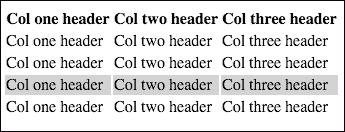
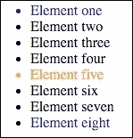
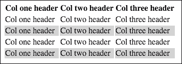
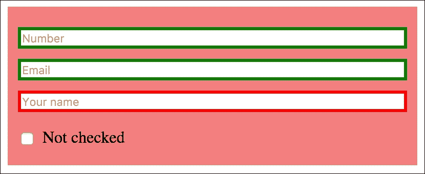
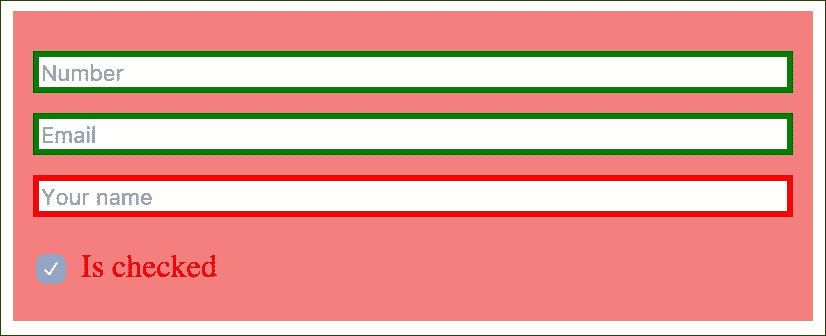
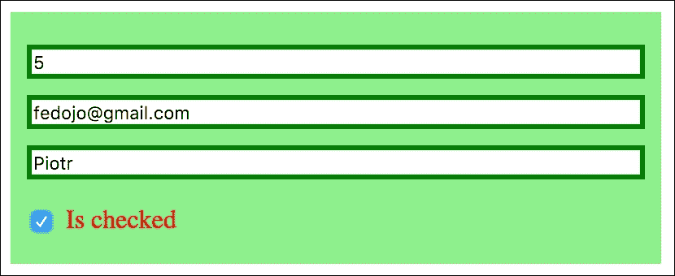
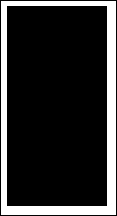
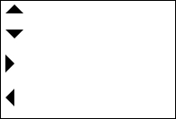

# 第三章。伪元素和伪类的掌握

使用 CSS 在网站上添加简单的交互是众所周知的，因为伪类是可用的。了解如何在网站上使用该功能非常重要。伪元素可以在浏览器中使用，例如 Internet Explorer 8/9 +，并且可以帮助处理网页上一些可重复的元素，这些元素在大多数情况下是用空的`spans`和`divs`添加的，例如，图形细节，例如按钮中的箭头、三角形等。使用伪元素，您可以添加这些元素，而无需创建 DOM 元素。

绘制图元是一项非常重要的技能，尤其是当您将图元与可以添加图元的伪元素相链接时。添加三角形或一些其他特定元素可能是一个非常重要的功能，因为您不必将这些图形元素作为背景或`img`元素进行剪切。

本章将掌握伪元素、伪类以及 CSS 代码中原语的绘制。最后，在每个部分中，您可以将这些元素组合成实用且可重用的代码。

在本章中，我们将:

*   学习使用伪类
*   学习使用伪元素
*   学习如何绘制图元
*   在 SASS 中创建大量可重用的混合

# 伪班

伪类是在 CSS 中用来描述元素，特定动作后的行为。伪类支持的操作如下:

*   鼠标悬停
*   鼠标点击/触摸
*   输入焦点

伪类的另一个用途是匹配特定容器中的元素，这些元素由该容器中的顺序描述:

*   第一个孩子，最后一个孩子
*   有孩子吗
*   任何类型的子级

你可以在链接上看到的伪类最重要的特性是(`<a>`元素带有`href`属性)。

## 如何才能勾选:活动、:悬停状态？

只要将鼠标指针移动到链接上，就可以检查悬停状态。这个属性最简单的用法可以用下面的代码来检查:

HTML:

```html
<a href="#"> Title of link</a>
```

SASS:

```html
a
  color: #000
  background: #fff

a:hover
  color: #fff
  background: #000
```

生成的 CSS 代码:

```html
a {
    color: #000;
    background: #fff;
}

a:hover {
    color: #fff;
    background: #000;
}
```

使用前面的代码，每当您将鼠标悬停在链接上时，链接的颜色和背景都会改变。

## 用法–多级菜单

多级菜单是悬停状态下使用最多的动作。下拉菜单可以用简单的 HTML 和 CSS 开发。你几乎可以在每个网站上看到它。了解如何构建它可以成为更复杂解决方案的基础。让我们构建一个多级导航，并基于以下内容:

HTML 代码:

```html
<ul>
    <li>
        <a href="#">Level one - item one</a>
        <ul>
            <li><a href="#">Level two - item one</a></li>
            <li><a href="#">Level two - item two</a></li>
            <li><a href="#">Level two - item three</a></li>
            <li><a href="#">Level two - item four</a></li>
        </ul>
    </li>
    <li>
        <a href="#">Level two - item one</a>
        <ul>
            <li><a href="#">Level two - item one</a></li>
            <li><a href="#">Level two - item two</a></li>
            <li><a href="#">Level two - item three</a></li>
            <li><a href="#">Level two - item four</a></li>
        </ul>
    </li>
    <li>
        <a href="#">Level one - item three</a>
        <ul>
            <li><a href="#">Level three - item one</a></li>
            <li><a href="#">Level three - item two</a></li>
            <li><a href="#">Level three - item three</a></li>
            <li><a href="#">Level three - item four</a></li>
        </ul>
    </li>
<ul>
```

SASS 代码:

```html
ul
  list-style: none
  padding: 0

ul > li
  float: left
  display: inline-block
  position: relative
  margin-right: 10px

  &:hover
    ul
      display: block
      width: 200px

ul ul
  display: none
  position: absolute
  left: 0

  li
    display: block
```

已编译的 CSS:

```html
ul {
    list-style: none;
    padding: 0;
}

ul >li {
    float: left;
    display: inline-block;
    position: relative;
    margin-right: 10px;
}

ul >li:hover ul {
    display: block;
    width: 200px;
}

ul ul {
    display: none;
    position: absolute;
    left: 0;
}

ul ul li {
    display: block;
}
```

没有悬停在任何元素上的效果可以在下面的截图中看到:


悬停在第二个元素上后:


## 用法–CSS 悬停行

简而言之 HTML 表格，很容易读懂所有内容。但是如果你有很多数据(尤其是金融网站上的数据)被分配在很多行和列中，很容易使表格不可读。有几种方法可以简化阅读过程。最简单的方法是为所有行添加悬停操作。每次指向一行，就会改变背景颜色。让我们使用下面的 HTML 代码:

```html
<table>
    <thead>
    <tr>
        <th> Col one header</th>
        <th> Col two header</th>
        <th> Col three header</th>
    </tr>
    </thead>
    <tbody>
    <tr>
        <td> Col one header</td>
        <td> Col two header</td>
        <td> Col three header</td>
    </tr>
    <tr>
        <td> Col one header</td>
        <td> Col two header</td>
        <td> Col three header</td>
    </tr>
    <tr>
        <td> Col one header</td>
        <td> Col two header</td>
        <td> Col three header</td>
    </tr>
    <tr>
        <td> Col one header</td>
        <td> Col two header</td>
        <td> Col three header</td>
    </tr>
    </tbody>
</table>
```

我们假设的行数(`tbody`中的`tr`元素)几乎是无限的。这会给我们带来一张很长的桌子。为了便于阅读，我们可以为每行添加一个悬停操作，如下所示:

SASS:

```html
tbody
  tr:hover
    background: #d3d3d3
```

已编译的 CSS:

```html
tbody tr:hover {
    background: #d3d3d3;
}
```

每次将鼠标悬停在每一行上，都可以看到如下截图所示的效果(灰色行悬停在上方):



# 伪类的用法

新的伪类正在为 CSS/HTML 编码者打开新的视野。像`first-child`、`last-child`和`nth-child`这样的大部分功能都添加了 JavaScript 代码。例如，使用 jQuery 代码，您可以获得一个列表元素，并向第一个/最后一个/第 n 个元素添加特定的类，然后为了正确地创建选择器，您可以添加一个 CSS 代码。

但是当浏览器本身支持时，最好使用 CSS。让我们收集一下关于这个特性的基础知识。

## 如何使用:第一个孩子，:最后一个孩子，:第 n 个孩子()

这些伪元素的简短介绍如下:

*   `:first-child`:这个指向的元素是其父元素的第一个子元素
*   `:last-child`:这个指向的元素是其父元素的最后一个子元素
*   `:nth-child()`:这个指向与`()`中包裹的图案相匹配的元素

检查其工作方式的最简单方法是创建一个包含新元素的无序列表:

```html
<ul>
    <li>Element one</li>
   <li>Element two</li>
   <li>Element three</li>
   <li>Element four</li>
   <li>Element five</li>
   <li>Element six</li>
   <li>Element seven</li>
   <li>Element eight</li>
</ul>
```

让我们假设我们需要风格化列表的元素。我们需要添加的第一个样式只与列表的第一个元素相关。最简单的方法是向这个元素添加一个特定的类，如下所示:

```html
<li class="first_element>Element one</li>
```

然后为它添加一个特定的 CSS/SASS 代码:

SASS 代码:

```html
.first_element
  color: #f00
```

已编译的 CSS:

```html
.first_element {
    color: #f00;
}
```

使用新的伪类:

```html
li:first-child
  color: #00f
```

或者:

```html
li:nth-child(1)
  color: #00f
```

编译为:

```html
li:first-child {
    color: #00f;
}

li:nth-child(1) {
    color: #00f;
}
```

我们需要追加的第二种样式是为最后一个元素设置蓝色文本颜色。最简单的方法是更改 HTML 代码:

```html
<li class="last_element">Element eight</li>
```

然后为其添加特定的 CSS/SASS 代码:

```html
.last_element
  color: #00f
```

编译为:

```html
.last_element {
  color: #00f;
}
```

使用新的伪类:

```html
li:last-child
  color: #00f
```

编译为:

```html
li:last-child {
  color: #00f; 
}
```

在这种情况下，我们不关心列表中元素的计数。列表的最后一个元素将总是具有前面的 CSS 代码。

为第八个元素添加样式，如下所示:

```html
li:nth-child(8)
  color: #00f
```

已编译:

```html
li:nth-child(8) {
  color: #00f; 
}
```

在这种情况下，我们关心计数元素。列表的第八个元素将总是具有前面的 CSS 代码。

假设我们想让第五个元素变成橙色。最简单的方法是更改 HTML 代码:

```html
<li class="fifth_element">Element five</li>
```

然后追加 CSS 代码:

```html
.fifth_element
  color: orange
```

使用伪类，我们可以这样绘制 SASS:

```html
li:nth-child(5)
  color: orange
```

浏览器中的代码:



## 用法–造型表

实用例子最适合学习。我们可以使用伪类的所有属性的最可重复的情况是表。让我们获取以下 HTML 代码:

```html
<table>
    <thead>
    <tr>
        <th> Col one header</th>
        <th> Col two header</th>
        <th> Col three header</th>
    </tr>
    </thead>
    <tbody>
    <tr>
        <td> Col one content</td>
        <td> Col two content</td>
        <td> Col three content</td>
    </tr>
    <tr>
        <td> Col one content</td>
        <td> Col two content</td>
        <td> Col three content</td>
    </tr>
    <tr>
        <td> Col one content</td>
        <td> Col two content</td>
        <td> Col three content</td>
    </tr>
    <tr>
        <td> Col one content</td>
        <td> Col two content</td>
        <td> Col three content</td>
    </tr>
    </tbody>
</table>
```

让我们为桌子做斑马造型；这使得阅读表格变得更加容易:

```html
tbody
  tr:nth-child(2n)
    background: #d3d3d3
```

已编译的 CSS:

```html
tbody tr:nth-child(2n) {
    background: #d3d3d3;
}
```

这种样式将在表格中每隔一个元素添加一个灰色背景，如下图所示:



## 探索:第 n 个子参数

作为基于`:nth-child`的选择器的参数，您可以使用以下任一选项:

*   **偶数**:这将匹配所有偶数元素
*   **奇数**:这将匹配所有奇数元素

此外，您可以使用*和+b* 参数，例如:

*   **3n+1** :这将匹配具有索引的元素(从 1 开始计数):1、4、7、10、…
*   **–n+5**:这将匹配从 1 到 5 的元素
*   **2n+4** :这将匹配元素:4、6、8、10、12、…

## 如何使用:第 n 个-最后一个-孩子

这个伪类的工作原理类似于`nth-child`。不同的是`nth-child`在列表的开头开始工作，`nth-last-child`在列表的末尾开始工作:

*   **偶数**:这将匹配从最后一个元素开始的所有偶数元素
*   **奇数**:这将匹配从最后一个元素开始的所有奇数元素

您可以使用*和+b* 参数，就像我们在`nth-child`中使用的一样:

*   **3n+1** :这将匹配具有索引的元素(从最后一个元素开始计数):1，4，7，10，…
*   **–n+5**:这将匹配最后五个元素
*   **2n+4** :这将匹配元素:4、6、8、10、12、……(从最后一个元素开始计算)

## 如何使用:第一个类型、最后一个类型、第 n 个类型和第 n 个最后一个类型

这些伪类与容器中的元素相关，其中聚集了一些元素。它的工作原理类似于的第 n 个子机制。为了更好地理解，让我们从下面的 HTML 代码开始:

```html
<div class="parent">
    <span>First span</span><br/>
    <strong>First strong</strong><br/>
    <span>Second span</span><br/>
    <strong>Second strong</strong><br/>
    <span>Third span</span><br/>
    <strong>Third strong</strong><br/>
    <span>Fourth span</span><br/>
    <strong>Fourth strong</strong><br/>
    <span>Fifth span</span>
</div>
```

SASS 代码:

```html
.parent
  span
    &:first-of-type
      color: red

    &:last-of-type
      color: red

  strong
    &:nth-of-type(2)
      color: pink

    &:nth-last-of-type(2)
      color: magenta
```

编译成 CSS:

```html
.parent span:first-of-type {
    color: red;
}

.parent span:last-of-type {
    color: red;
}

.parent strong:nth-of-type(2) {
    color: pink;
}

.parent strong:nth-last-of-type(2) {
    color: magenta;
}
```

让我们带来一些解释:

*   **。父跨度:第一类**:这个将匹配`.parent div (<div class="parent">)`中的第一个元素，也就是`span`
*   **。父跨度:最后一个类型**:这个将匹配`.parent`中的最后一个元素，也就是`span`
*   **。母强:第 n 型(2)** :这个会搭配第二个元素，就是`strong`
*   **.parent strong:nth-last-of-type(2)**: This will match the second element counting from the last element, *which is strong* as shown in the following screenshot:

    

## 空元素，带有:空伪类

有时你需要处理列表，其中你需要用一个 CSS 代码块处理空元素，用另一个代码块处理内容元素。最简单的方法是在元素中添加一个*空的*类，你可以在不干扰 HTML 代码的情况下完成。让我们获取 HTML 代码:

```html
<ul>
    <li class="box">Black text</li>
    <li class="box"></li>
    <li class="box">Black text</li>
    <li class="box"></li>
    <li class="box"></li>
    <li class="box">Black text</li>
    <li class="box"></li>
</ul>
```

和 SASS 代码:

```html
ul
  list-style: none

.box
  background: white
  color: black
  text-align: center
  height: 100px
  width: 100px
  float: left

.box:empty
  color: black
  background: black
```

编译成 CSS:

```html
ul {
    list-style: none;
}

.box {
    background: white;
    color: black;
    text-align: center;
    height: 100px;
    width: 100px;
    float: left;
}

.box:empty {
    color: black;
    background: black;
}
```

这将在浏览器中向我们显示以下视图:


分析前面的代码很容易。所有空元素(没有子元素)都有黑色背景。所有带有子元素的元素都有白色背景和黑色文本。

# 用伪类支持表单样式

您可以支持表单与 CSS 代码的验证和简单交互。在接下来的部分中，您将看到如何使用 CSS 选择器进行简单的验证和简单的输入交互。通过正确的 CSS 代码，您还可以检查是否需要或禁用了任何元素。让我们看看这是如何做到的。

## 有效和无效的验证

早先验证是用 JavaScript 代码完成的。有了合适的 CSS 代码，你只能用好的选择器来完成。让我们用 HTML 和 CSS 代码来检查一下:

HTML 代码:

```html
<form class="simple_validation">
    <input type="number" min="5" max="10" placeholder="Number">
    <input type="email" placeholder="Email">
    <input type="text" required placeholder="Your name"/>
</form>
```

SASS 代码:

```html
.simple_validation
  padding: 10px
  width: 400px
  box-sizing: border-box

  &:valid
    background: lightgreen

  &:invalid
    background: lightcoral

  input
    display: block
    margin: 10px 0
    width: 100%
    box-sizing: border-box

    &:valid
      border: 3px solid green

    &:invalid
      border: 3px solid red
```

已编译的 CSS:

```html
.simple_validation {
    padding: 10px;
    width: 400px;
    box-sizing: border-box;
}

.simple_validation:valid {
    background: lightgreen;
}

.simple_validation:invalid {
    background: lightcoral;
}

.simple_validation input {
    display: block;
    margin: 10px 0;
    width: 100%;
    box-sizing: border-box;
}

.simple_validation input:valid {
    border: 3px solid green;
}

.simple_validation input:invalid {
    border: 3px solid red;
}
```

在前面的例子中，你可以检查有效和无效的伪类是如何工作的。每次将电子邮件输入到不是电子邮件地址的电子邮件字符串中时，输入会有一个红色边框，表单的背景会将其颜色更改为浅红色(`lightcoral`)。数字输入的情况也是如此，需要在 5 到 10 的范围内。另外，对于输入文字的输入，需要增加属性。如果没有输入，它有一个`:invalid`伪类。

## 添加输入状态:焦点、选中、禁用

焦点伪类与当前接收焦点的输入相关。请记住，这可以由用户用鼠标指针和键盘通过*标签*键来完成。选中的伪类与输入类型复选框和单选按钮相关，并匹配状态更改为选中的元素。为了展示它是如何工作的，让我们修改上一节中使用的 HTML 代码:

HTML 代码:

```html
<form class="simple_validation">
    <input type="number" min="5" max="10" placeholder="Number">
    <input type="email" placeholder="Email">
    <input type="text" required placeholder="Your name"/>

    <input type="checkbox" id="newsletter"></input>
    <label for="newsletter">checked</label>
</form>
```

SASS 代码:

```html
.simple_validation
  padding: 10px
  width: 400px
  box-sizing: border-box

  &:valid
    background: lightgreen

  &:invalid
    background: lightcoral

  label
    display: inline-block

    &:before
      content: 'Not '

  input
    display: block
    margin: 10px 0
    width: 100%
    box-sizing: border-box

    &:valid
      border: 3px solid green

    &:invalid
      border: 3px solid red

    &:focus
      background: orange
      color: red
      border: 3px solid orange

    &[type="checkbox"]
      display: inline-block
      width: 20px

      &:checked
        & + label
          color: red

          &:before
            content: 'Is '
```

已编译的 CSS:

```html
.simple_validation {
    padding: 10px;
    width: 400px;
    box-sizing: border-box;
}

.simple_validation:valid {
    background: lightgreen;
}

.simple_validation:invalid {
    background: lightcoral;
}

.simple_validation label {
    display: inline-block;
}

.simple_validation label:before {
    content: "Not ";
}

.simple_validation input {
    display: block;
    margin: 10px 0;
    width: 100%;
    box-sizing: border-box;
}

.simple_validation input:valid {
    border: 3px solid green;
}

.simple_validation input:invalid {
    border: 3px solid red;
}

.simple_validation input:focus {
    background: orange;
    color: red;
    border: 3px solid orange;
}

.simple_validation input[type="checkbox"] {
    display: inline-block;
    width: 20px;
}

.simple_validation input[type="checkbox"]:checked + label {
    color: red;
}

.simple_validation input[type="checkbox"]:checked + label:before {
    content: "Is ";
}
```

前面的示例为表单增加了更多的交互性。第一个新功能是将聚焦元素的颜色更改为红色，将其背景/边框更改为橙色。第二个特性是与复选框相关的交互。将其状态更改为选中后，它会更改`:before`元素(这将在下一节中更好地描述)。在初始化时，`:before`元素被设置为`"Not"`。用 HTML 代码给出完全`"Not checked"`。勾选复选框后，`before`元素变为`"Is"`，显示等于`"Is checked"`的完整字符串。

让我们检查一下它在浏览器中的外观。以下屏幕截图出现在页面的开头:



勾选复选框后，将出现以下第一条:



标签的 before 元素有一个可见的变化，如下面的截图所示，它也显示了输入的焦点:


经验证的表格如下:



## 附加方面–为占位符着色

是的当然！您需要将占位符风格化。您可以这样做，但是该属性还带有前缀:

对于互联网浏览器:

```html
:-ms-input-placeholder
```

对于 Firefox:

```html
:-moz-placeholder
```

对于 WebKit 浏览器:

```html
::-webkit-input-placeholder
```

# 用 CSS 绘制图元

绘制图元是图形基础中最简单也是最主要的情况。在 CSS 中，它可以用于常见的情况，例如向按钮或任何其他 DOM 元素添加细节。让我们学习在 CSS 中绘制图元的基础知识。

## 如何绘制矩形/正方形

在 CSS 中最容易画的图元是矩形。让我们使用以下代码绘制一个简单的矩形:

HTML 代码:

```html
<div class="rectangle"></div>
```

SASS 代码:

```html
.rectangle
width: 100px
height: 200px
background: black
```

已编译的 CSS:

```html
.rectangle {
    width: 100px;
    height: 200px;
    background: black;
}
```

这将在浏览器中绘制一个矩形，如下所示:



要绘制方块，我们需要创建以下代码:

HTML 代码:

```html
<div class="square"></div>
```

SASS 代码:

```html
.square
width: 100px
height: 100px
background: black
```

已编译的 CSS:

```html
.square {
    width: 100px;
    height: 100px;
    background: black;
}
```

正方形和矩形的可重用混合:

```html
=rectangle($w, $h, $c)
  width: $w
  height: $h
  background: $c

=square($w, $c)
  width: $w
  height: $w
  background: $c
```

## 如何画圆

画一个圆很简单。该方法基于边框半径和一个简单的矩形，如下例所示:

HTML 代码:

```html
<div class="circle"></div>
```

SASS 代码:

```html
.circle
    width: 100px
    height: 100px
    border-radius: 50%
    background: black
```

已编译的 CSS:

```html
.circle {
    width: 100px;
    height: 100px;
    border-radius: 50%;
    background: black;
}
```

在浏览器中，您将看到以下内容:


SASS 混合:

```html
=circle($size, $color)
  width: $size
  height: $size
  border-radius: 50%
  background: $color
```

## 怎么画戒指

画圈很类似画圆。图案是一样的，但是有一个合适的边框。让我们从最初的环形标记开始:

HTML 代码:

```html
<div class="ring"></div>
```

SASS 代码:

```html
.ring
  width: 100px
  height: 100px
  border-radius: 50%
  border: 2px solid black
  background: none
```

已编译的 CSS:

```html
.ring {
    width: 100px;
    height: 100px;
    border-radius: 50%;
    border: 2px solid black;
    background: none;
}
```

在浏览器中，您将看到以下内容:


SASS 混合:

```html
=ring($size, $color, $width)
  width: $size
height: $size
border-radius: 50%
  border: $width solid $color
background: none
```

## 如何用 CSS 画一个三角形

绘制三角形是基于一个带有边框的技巧:

HTML 代码:

```html
<div class="triangle-up"></div><br>
<div class="triangle-down"></div><br>
<div class="triangle-left"></div><br>
<div class="triangle-right"></div>
```

`br`元素仅用于显示不同行中的所有元素。

SASS 代码:

```html
.triangle-up
    width: 0 
    height: 0
    border-left: 10px solid transparent 
    border-right: 10px solid transparent
    border-bottom: 10px solid black

.triangle-down 
    width: 0 
    height: 0 
    border-left: 10px solid transparent
    border-right: 10px solid transparent
    border-top: 10px solid black

.triangle-left 
    width: 0 
    height: 0
    border-top: 10px solid transparent 
    border-bottom: 10px solid transparent
    border-left: 10px solid black 

.triangle-right 
    width: 0
    height: 0
    border-top: 10px solid transparent
    border-bottom: 10px solid transparent
    border-right: 10px solid black
```

已编译的 CSS:

```html
.triangle-up {
    width: 0;
    height: 0;
    border-left: 10px solid transparent;
    border-right: 10px solid transparent;
    border-bottom: 10px solid black;
}

.triangle-down {
    width: 0;
    height: 0;
    border-left: 10px solid transparent;
    border-right: 10px solid transparent;
    border-top: 10px solid black;
}

.triangle-left {
    width: 0;
    height: 0;
    border-top: 10px solid transparent;
    border-bottom: 10px solid transparent;
    border-left: 10px solid black;
}

.triangle-right {
    width: 0;
    height: 0;
    border-top: 10px solid transparent;
    border-bottom: 10px solid transparent;
    border-right: 10px solid black;
}
```

在浏览器中，您会看到以下内容:



SASS 混合:

```html
=triangleRight($width, $height, $color)
  width: 0
  height: 0
  border-style: solid
  border-width: $height/2 0 $height/2 $width
  border-color: transparent transparent transparent $color

=triangleLeft($width, $height, $color)
  width: 0
  height: 0
  border-style: solid
  border-width: $height/2 $width $height/2 0
  border-color: transparent $color transparent transparent

=triangleTop($width, $height, $color)
  width: 0
  height: 0
  border-style: solid
  border-width: 0 $width/2 $height $width/2
  border-color: transparent transparent $color transparent

=triangleBottom($width, $height, $color)
  width: 0
  height: 0
  border-style: solid
  border-width: $height $width/2 0 $width/2
  border-color: $color transparent transparent transparent
```

# 伪元素

使用伪元素，省略需要特定 HTML 代码的可重复代码元素真的很重要。伪元素的主要目的是减少 HTML 代码中的 DOM 元素。

## 什么是:之前；之后？

`:before`和`:after`是伪元素，可以添加到 HTML 元素中。元素作为内嵌元素添加到选定元素中。要获得`before`和`after`伪元素的基础，可以绘制如下 HTML 代码:

```html
<a>Element</a>
```

并追加 SASS 代码，如下所示:

```html
a
  border: 1px solid #000

  &:before
    content: 'before'
    color: orange

  &:after
    content: 'after'
    color: orange
```

已编译的 CSS:

```html
a {
    border: 1px solid #000;
}

a:before {
    content: "before";
    color: orange;
}

a:after {
    content: "after";
    color: orange;
}
```

前面代码的输出如下:


## 哪里可以用:之前；之后？

让我们假设一个任务，在这个任务中，我们需要对列表中的每个元素应用文本末尾的一些文本。例如，我们有一个如下所示的列表:

```html
<ul>
    <li>Mike</li>
    <li>Ravi</li>
    <li>Adam</li>
    <li>Greg</li>
    <li>Anna</li>
</ul>
```

我们需要补充的是，每个人都是前端开发人员:

```html
ul
  li
&:before
content: "My name is "
      color: #f00

&:after
content: ". I'm Front End Developer"
      color: #f00
```

已编译的 CSS:

```html
ul li:before {
    content: "My name is ";
    color: #f00;
}

ul li:after {
    content: ". I'm Front End Developer";
    color: #f00;
}
```

在浏览器中，您会看到以下内容:


让我们使我们之前的代码可重用，让我们创建一个右边有箭头的按钮。HTML 代码如下所示:

```html
<a href="#">Button</a>
```

让我们将之前创建的用于三角形创建的 mixin 重用到以下 SASS 代码的最后一行中的 CSS 代码中:

```html
=triangleRight($width, $height, $color)
  width: 0
  height: 0
  border-style: solid
  border-width: $height/2 0 $height/2 $width
  border-color: transparent transparent transparent $color

a
  display: inline-block
  border: 1px solid #000
    radius: 5px
  padding: 10px 40px 10px 10px
  position: relative
  text-decoration: none
  color: #000

  &:after
    display: block
    position: absolute
    right: 10px
    top: 50%
    margin-top: -5px
    content: ''
    +triangleRight(10px, 10px, #000)
```

已编译的 CSS:

```html
a {
    display: inline-block;
    border: 1px solid #000;
    border-radius: 5px;
    padding: 10px 40px 10px 10px;
    position: relative;
    text-decoration: none;
    color: #000;
}

a:after {
    display: block;
    position: absolute;
    right: 10px;
    top: 50%;
    margin-top: -5px;
    content: "";
    width: 0;
    height: 0;
    border-style: solid;
    border-width: 5px 0 5px 10px;
    border-color: transparent transparent transparent #000;
}
```

它会在浏览器中给我们以下结果:


## 第一个字母和第一行–简单的文本操作

在网页上，在某些情况下，您需要在文本的第一行和第一个字母上添加样式。对于 CSS，你必须使用合适的选择器来做到这一点。让我们使用下面的 HTML 代码:

```html
<p>Paragraph lorem ipsm Lorem ipsum dolor sit amet, consectetur adipisicing elit. Totam nisi soluta doloribus ducimus repellat dolorum quas atque, tempora quae, incidunt at eius eaque sit, culpa eum ut corporis repudiandae.</p>
```

在 SASS 文件中:

```html
p
  &:first-letter
    color: orange
    font:
      weight: bold
      size: 20px

  &:first-line
    color: pink
```

已编译的 CSS:

```html
p:first-letter {
    color: orange;
    font-weight: bold;
    font-size: 20px;
}

p:first-line {
    color: pink;
}
```

前面的代码将文本第一行的颜色改为粉色。第一个字母将更改为`orange`颜色、`bold`和`20px`大小。

## 如何改变选择颜色？用法::选择

公司有自己的调色板。有时您需要自定义页面上选择的颜色。这是可能的与`:selection`伪元素:

SASS 代码:

```html
::-moz-selection,
::selection
background: red
color: white
```

已编译的 CSS:

```html
::-moz-selection,
::selection {
    background: red;
    color: white;
}
```

有了前面的代码，每次你在页面上选择一个东西，这个选择就会改变它的颜色为`red`，字体颜色为`white`。

# 总结

在这一章中，您学习了伪类、伪元素以及在 CSS 代码中绘制原语的基础知识。作为前端开发人员，您将经常使用这些 CSS 元素。伪类为您提供了基本的交互性(悬停、活动)并扩展了选择器的可能性(`:nth-child`、`:first-child`、`:last-child`)。有了伪元素，你可以用 CSS 代码扩展 HTML 的可能性(`:before`、`:after`、`:first-letter`、`:first-line`)，还可以设置样式为选择。

在下一章中，您将获得关于媒体查询的基本知识，这是响应网站的基础。