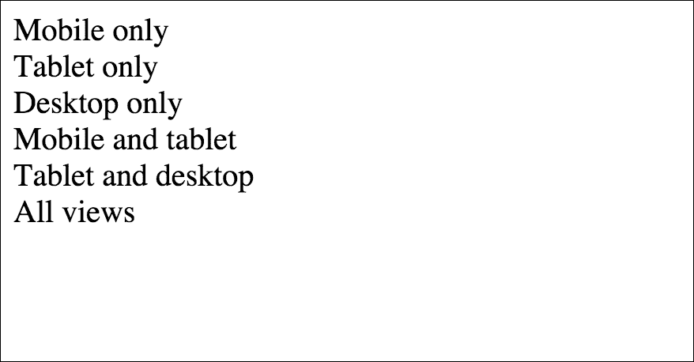
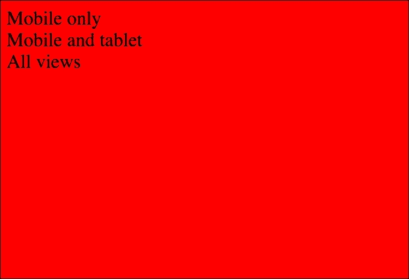
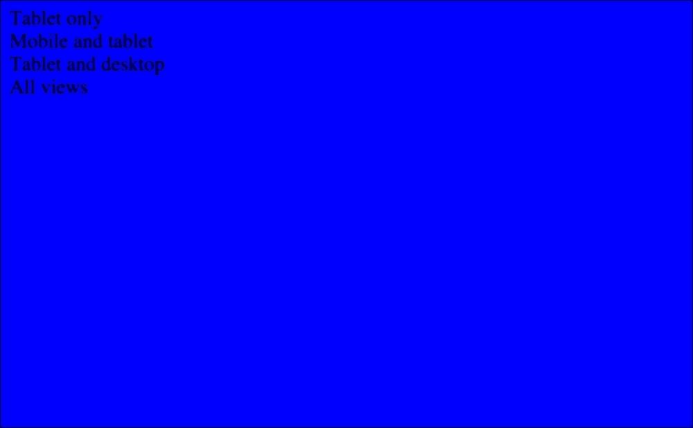
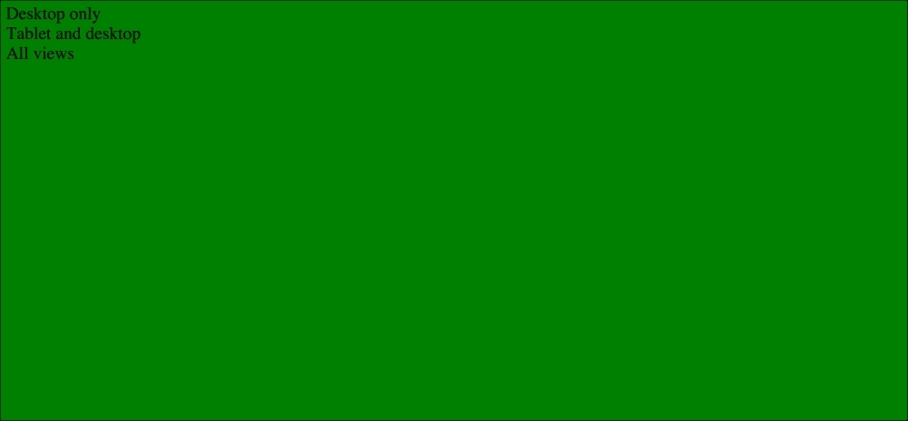

# 第四章。响应网站–为特定设备准备代码

在本章中，您将获得关于 **【响应性网页设计】**(**【RWD】**)以及如何准备项目的知识。它将涵盖现代网站和优化技术的问题。本章将是关于媒体查询的知识基础—如何准备它们以及如何调整特定设备。

在本章中，我们将涵盖以下主题:

*   RWD 方法论
*   使用媒体查询

# 响应型网站的基础

几乎所有现代网站都可以在桌面和移动设备(手机、平板)上显示。适当调整 CSS 和 HTML 代码是创建一个响应性网站的主要假设。基本的响应性网站构建过程是基于代码的调整，一旦完成，网站就会在所有设备上正确显示。现在响应型网站的*响应度*稍微提升了一点。不仅仅是 CSS/HTML/JS 代码的创建和对设计方面的思考，还有对移动设备性能的思考。带有网络浏览器的移动设备现在是人们浏览网站的主要设备。让我们看看创建响应性网站的主要方法。

## 桌面第一方法论

这种方法在过去被用作 CSS 框架中的主要方法。HTML 和 CSS 代码的主要目的是在桌面浏览器中查看网页。然后提供基于桌面代码的移动版本。最后一个过程是调整手机代码。这看起来像是削减了网站的功能，并为一个更小的移动设备调整了桌面视图。

## 移动第一方法论

这种方法论在所有现代 CSS 框架(Twitter bootstrap，Foundation 框架)中都有使用。首先，代码是为移动设备准备的，然后是从平板电脑到桌面屏幕的更大设备的*比例*。这种方法现在更常见，也更好，因为移动设备的代码不必像桌面优先方法那样是 CSS 技巧、HTML 复制和 JS 机制的组合。

哪种方法适合你？这完全取决于项目类型。并不是所有情况下你都从头到尾在做一个项目。有时，您有一些遗留代码，需要根据移动性进行调整。在这种情况下，您总是被迫首先使用桌面方法。在您可以从头开始编写代码的情况下，建议使用移动优先方法。

## 在 HTML 中调整视口

响应性网站的一个重要元素是适当的 HTML 视口元标签。应该在 HTML 文档的头部添加一个视口描述。它描述了网页在移动设备上的行为。有一堆最常用的视口，我们将在后面分析。最常用的是如下所示的视口:

```html
<head>
    <!-- ... -->
    <meta name="viewport" content="width=device-width, initial-scale=1.0">
    <!-- ... -->
</head>
```

意思是每当你在移动设备上打开你的项目，它会有设备的宽度，项目会有一个等于`1`的初始比例。稍微增强一点的视口如下所示:

```html
<head>
    <!-- ... -->
    <meta name="viewport"content="width=device-width, initial-scale=2.0">
    <!-- ... -->
</head>
```

第一个和第二个视口之间的主要区别是最大比例。这意味着在移动设备上双击或捏手势后调用的缩放动作后，它将被缩放，但该缩放的最大范围被设置为`2`。视口的一个更安全的选项如下:

```html
<head>
    <!-- ... -->
    <meta name="viewport"content="width=device-width, initial-scale=1.0, maximum-scale=1">
    <!-- ... -->
</head>
```

为什么更安全？例如，在内容上有一些固定窗口的情况下，它们不会被缩放，也不会给用户带来不好的体验:

```html
<head>
    <!-- ... -->
    <meta name="viewport"content="width=600, initial-scale=1.0">
    <!-- ... -->
</head>
```

此`viewport`设置将缩放网站，使其行为像在桌面上打开的网页，浏览器的设置宽度等于`600`。初始比例如前例设置，等于`1`。

## 选择正确的视口

所以的问题是:推荐哪个`viewport`？这是一个好问题。最好的体验可以通过以下方式保留:

```html
<head>
    <!-- ... -->
    <meta name="viewport"content="width=device-width, initial-scale=1.0, maximum-scale=2.0">
    <!-- ... -->
</head>
```

为什么呢？因为我们正在将网站缩放到设备`width`，并且我们没有停止页面的缩放。但最安全的选择如下:

```html
<head>
    <!-- ... -->
    <meta name="viewport"content="width=device-width, initial-scale=1.0, maximum-scale=1">
    <!-- ... -->
</head>
```

这将防止缩放，这可能是恼人的调整，尤其是在我们有旧的学校类型的模态窗口的旧项目。

## 褶皱之上

这个方法论与你的代码优化是紧密相连的。它也与网页的移动和桌面版本有关。现代网页加载了很多东西:CSS 文件、JS 文件、图像以及视频和声音等媒体文件。这么长的队列，你可以看到，当页面加载的处理时间，例如，10 秒长，你不能看到内容，直到所有的文件都被加载。在信息页面的情况下，您应该首先看到标题和主要内容，但是在如此长的队列中，这几乎是不可能的。

前面提到的折叠方法分离了特定样式的附件，这些附件描述了页面上最重要的元素，如标题、副标题和文本内容。它需要分离这些`style`附件，并将它们内嵌在`head`部分，例如:

```html
<head>
    <!-- ... -->
    <style>
        /* here we have a section for inline most important styles */
    </style>
    <!-- ... -->
    <link rel="stylesheet"type="text/css"href="link_to_rest_of_styles.css">
    <!-- ... -->
</head>
```

这意味着浏览器将首先解析这个内联部分，在漫长的加载过程中，它将首先为读者准备最重要的元素，然后加载页面资源所需的其余元素。

# 媒体查询–您可以在哪里使用

媒体查询是在 CSS 代码中设置的过滤器，帮助描述一堆显示(屏幕、打印)的网站。在媒体查询中，最常用的过滤器是最小/最大宽度、最小/最大高度、最小/最大像素比和最小/最大纵横比。

## 如何建立媒体查询

首先创建一个媒体查询，然后创建更复杂的过滤器，这非常简单。基本媒体查询如下所示:

```html
@media screen and (min-width: 640px)
  .element
    background: #000
```

已编译的 CSS:

```html
@media screen and (min-width: 640px) {
    .element {
        background: #000;
    }
}
```

通过这个媒体查询，您可以过滤最小宽度为 640 像素的屏幕的所有 CSS 声明。让我们尝试使它更复杂，并尝试为特定设备创建更多的媒体查询。

## 媒体查询是如何工作的？

媒体查询是过滤器，如前所述。但是让我们试着在代码和浏览器中看到它。这一简单的章节将向您展示如何针对特定屏幕分辨率调整代码，并将成为创建更高级媒体查询的基础:

```html
<div class="mobile_only">Mobile only</div>
<div class="tablet_only">Tablet only</div>
<div class="desktop_only">Desktop only</div>
<div class="mobile_and_tablet">Mobile and tablet</div>
<div class="tablet_and_desktop">Tablet and desktop</div>
<div class="all">All views</div>
```

代码现在看起来如下(没有任何样式):



现在我们需要做一些方法:

*   移动视图的所有分辨率都是 400 像素宽
*   平板电脑视图的所有分辨率都是 700 像素宽
*   桌面视图是所有分辨率，宽度为 701 像素

现在，基于前面的方法，让我们创建样式和媒体查询:

已编译的 CSS:

```html
.mobile_only,
.tablet_only,
.desktop_only,
.mobile_and_tablet,
.tablet_and_desktop {
    display: none;
}

/* Mobile only */
@media screen and (max-width: 400px) {
body {
        background: red;
    }

    .mobile_only {
        display: block;
    }
}

/* Mobile and tablet */
@media screen and (max-width: 700px) {
    .mobile_and_tablet {
        display: block;
    }
}

/* Tablet only */
@media screen and (min-width: 401px) and (max-width: 700px) {
body {
        background: blue;
    }

    .tablet_only {
        display: block;
    }
}

/* Tablet and desktop */
@media screen and (min-width: 401px) {
    .tablet_and_desktop {
        display: block;
    }
}

/* Desktop only */
@media screen and (min-width: 701px) {
body {
        background: green;
    }

    .desktop_only {
        display: block;
    }
}
```

现在让我们在 350 像素宽的浏览器中查看一下:



在前面的视图中，我们可以看到 CSS 文件中描述的所有元素，并带有以下注释:

*   `/* Mobile only */`
*   `/* Mobile and tablet */`

宽度为 550px 的浏览器输出如下:



在前面的视图中，我们可以看到 CSS 文件中描述的所有元素，并带有以下注释:

*   `/* Tablet only */`
*   `/* Mobile and tablet */`
*   `/* Tablet and desktop */`

850px 宽度浏览器中的输出如下:



在前面的视图中，我们可以看到 CSS 文件中描述的所有元素，并带有以下注释:

*   `/* Tablet and desktop */`
*   `/* Desktop only*/`

前面的代码揭示了媒体查询过滤器是如何准确工作的。如何创建在特定视图中可见的代码，如何为实际项目创建方法？在接下来的项目中，我们将研究我们可以过滤什么，因为媒体查询不仅与设备的宽度有关。开始吧！

## 特定视图/设备的媒体查询

媒体查询可以用于很多不同的情况。如前所述，我们可以对特定的最小和最大宽度使用媒体查询:

```html
@media screen and (min-width: 640px)
@media screen and (max-width: 640px)
```

在前面的媒体查询中，第一个示例用于最小宽度`640`像素的所有分辨率，第二个示例用于最大宽度`640`像素的所有分辨率。前端开发人员处理基本桌面和更大密度屏幕(如视网膜)上的像素比。如何用 CSS 过滤它们？让我们检查这个媒体查询:

```html
@media (-webkit-min-device-pixel-ratio: 2)
```

正如我们所知，视网膜设备的像素比等于`2`。我们还可以用范围构建更复杂的过滤器:

```html
@media screen and (min-width: 640px) and (max-width: 1024px)
```

在这种情况下，我们过滤所有宽度与过滤器最小宽度`640`像素至`1024`像素匹配的分辨率。但是，我们如何编写一个匹配某些特定设备的媒体查询过滤器呢？假设我们想为新一代带视网膜显示的 iPad 编写代码:

```html
@media only screen 
and (min-device-width: 768px) 
and (max-device-width: 1024px) 
and (-webkit-min-device-pixel-ratio: 2)
```

众所周知，移动设备有两种定位:横向和纵向。那么我们如何在媒体查询中匹配这种情况呢？对于纵向视图，请使用以下选项:

```html
@media only screen 
and (min-device-width: 768px) 
and (max-device-width: 1024px) 
and (orientation: portrait) 
and (-webkit-min-device-pixel-ratio: 2)
```

对于横向视图，请使用以下内容:

```html
@media only screen 
and (min-device-width: 768px) 
and (max-device-width: 1024px) 
and (orientation: landscape) 
and (-webkit-min-device-pixel-ratio: 1)
```

通过媒体查询，还可以过滤打印视图。为此，您需要追加如下代码:

```html
@media print
```

## 如何为移动设备选择合适的媒体查询

对于在媒体查询中创建好的过滤器并在其中设置好的范围，您必须首先选择设备和分辨率。然后，您必须根据最流行的分辨率创建适当的媒体查询。过去，设备和标准分辨率的范围较小。所以主要设置如下:

```html
@media (max-width: 768px)
  // Cover small devices
  .element
    font-size: 12px

@media (min-width: 768px) and (max-width: 1024px)
  // Cover medium devices
  .element
    font-size: 14px

@media (min-width: 1024px)
  // Cover large devices
  .element
    font-size: 16px
```

已编译的 CSS:

```html
@media (max-width: 768px) {
    .element {
        font-size: 12px;
    }
}

@media (min-width: 768px) and (max-width: 1024px) {
    .element {
        font-size: 14px;
    }
}

@media (min-width: 1024px) {
    .element {
        font-size: 16px;
    }
}
```

当然，在每个项目中，可以添加一些*特定的*媒体查询异常，这样在质量分析过程之后，CSS 文件中就可以出现更多的过滤器。

现在，方法是在媒体查询的一个步骤中覆盖尽可能多的设备:

```html
@media only screen
  .element
    font-size: 16px
@media only screen and (max-width: 640px)
  // Cover small devices
  .element
    font-size: 12px

@media only screen and (min-width: 641px)
  // Cover devices which resolution is at minimum medium
  .element
    font-size: 14px

@media only screen and (min-width: 641px) and (max-width: 1024px)
  // Cover medium devices
  .element
    font-size: 15px

@media only screen and (min-width: 1025px)
  // Cover  devices which resolution is at minimum large
  .element
    font-size: 16px
```

已编译的 CSS:

```html
@media only screen {
    .element {
        font-size: 16px;
    }
}

@media only screen and (max-width: 640px) {
    .element {
        font-size: 12px;
    }
}

@media only screen and (min-width: 641px) {
    .element {
        font-size: 14px;
    }
}

@media only screen and (min-width: 641px) and (max-width: 1024px) {
    .element {
        font-size: 15px;
    }
}

@media only screen and (min-width: 1025px) {
    .element {
        font-size: 16px;
    }
}
```

为了更好的覆盖和更好的代码编写，让我们在这个媒体查询列表中增加一个`max-width`步骤:

```html
@media only screen and (max-width: 1024px)
    .element
        font-size: 15px
```

已编译的 CSS:

```html
@media only screen and (min-width: 1025px) {
    .element {
        font-size: 16px;
    }
}
```

该媒体查询将同时覆盖中小型设备。目前已知桌面网站分辨率最多的是`1280px`。让我们将此范围添加到媒体查询中:

```html
@media only screen and (min-width: 1025px) and (max-width: 1280px) {} 
@media only screen and (min-width: 1281px) {}
```

媒体查询的 SASS 混合

让我们为 mixins 创建媒体查询，这将有助于我们保持代码清晰。我们知道，我们必须添加显示类型和断点作为参数:

```html
@mixin mq($display, $breakpoint)
@media #{$display} and (#{$breakpoint})
@content
```

现在让我们收集我们的标准断点:

```html
@mixin mq($display, $breakpoint)
  @media #{$display} and #{$breakpoint}
    @content

$mq_small_only: "(max-width: 640px)"
$mq_medium_only: "(min-width: 641px) and (max-width: 1024px)"
$mq_small_and_medium: "(max-width: 1024px)"

+mq("screen", $mq_small_only)
  .slider
    width: 100%
    height: 300px

+mq("screen", $mq_medium_only)
  .slider
    width: 100%
    height: 400px

+mq("screen", $mq_small_and_medium)
  .slider
    max-width: 1200px
    width: 100%
```

已编译的 CSS:

```html
@media screen and (max-width: 640px) {
    .slider {
        width: 100%;
        height: 300px;
    }
}

@media screen and (min-width: 641px) and (max-width: 1024px) {
    .slider {
        width: 100%;
        height: 400px;
    }
}

@media screen and (max-width: 1024px) {
    .slider {
        max-width: 1200px;
        width: 100%;
    }
}
```

前面的代码是三个步骤的选择，但是您可以添加另一个作为练习，以涵盖上一节中的所有步骤。

# 使用示例-主导航

让我们想象我们想要解决与导航相关的经典问题。在大多数情况下，它在桌面视图中是内联的，但在移动视图中，它被更改为元素下的列表元素。让我们从 HTML 开始:

```html
<nav class="main-navigation">
    <ul>
        <li>
            <a href="#">First element</a>
        </li>
        <li>
            <a href="#">Second element</a>
        </li>
        <li>
            <a href="#"> Third element</a>
        </li>
    </ul>
</nav>
```

在 SASS 代码中，我们将使用以前创建的 mixins 进行媒体查询和清除修复。以下是完整的 SASS 文件:

```html
@mixin mq($display, $breakpoint)
@media #{$display} and #{$breakpoint}
@content

$mq_small_only: "(max-width: 640px)"
$mq_medium_only: "(min-width: 641px) and (max-width: 1024px)"
$mq_small_and_medium: "(max-width: 1024px)"

=clear fix
  &:after
    content: " "
    visibility: hidden
    display: block
    height: 0
    clear: both

body
  padding: 0
  margin: 0

.main-navigation
  ul
    +clearfix /* This will prevent problems of cleared float */
    list-style: none
    padding: 0
    background: greenyellow
    border:
      bottom: 1px solid darkgreen

  li
    float: left
    display: block

  a
    padding: 10px
    width: 100%
    display: block
    background: greenyellow
    text-decoration: none
    color: darkgreen

    &:hover
      background: darkgreen
      color: greenyellow

+mq("screen", $mq_small_and_medium)
  .main-navigation
    ul
      list-style: none
      border: none

    li
      float: none
      width: 100%

    a
      border:
        bottom: 1px solid darkgreen
```

已编译的 CSS:

```html
body {
    padding: 0;
    margin: 0;
}

.main-navigation ul {
    list-style: none;
    padding: 0;
    background: greenyellow;
    border-bottom: 1px solid darkgreen;
}

.main-navigation ul:after {
    content: "";
    visibility: hidden;
    display: block;
    height: 0;
    clear: both;
}

.main-navigation li {
    float: left;
    display: block;
}

.main-navigation a {
    padding: 10px;
    width: 100%;
    display: block;
    background: greenyellow;
    text-decoration: none;
    color: darkgreen;
}

.main-navigation a:hover {
    background: darkgreen;
    color: greenyellow;
}

@media screen and (max-width: 1024px) {
    .main-navigation ul {
        list-style: none;
        border: none;
    }

    .main-navigation li {
        float: none;
        width: 100%;
    }

    .main-navigation a {
        border-bottom: 1px solid darkgreen;
    }
}
```


前面的截图是在全局 CSS 相关的桌面视图中制作的。下一张截图与`@media`屏幕和(最大宽度:`1024px`)相关。如您所见，我们改变了导航的显示方法，并为触摸设备提供了更多灵活性。导航中越大的项目越容易点击(在本例中，按钮越长):


# 总结

在本章中，您学习了创建响应性网站的主要方法，以及移动和桌面首先意味着什么。然后，我们用响应性网站的基本性能扩展了知识。最后，您获得了关于媒体查询以及如何创建它们以覆盖所有特定显示类型的基本知识。在下一章中，您将获得关于 CSS 代码中图像的知识。

在下一章中，您还将获得关于 CSS 背景和您可以使用的新功能的知识。我们将重复图像，剪切图像，并将它们放入容器中。让我们来看看我们能用背景做什么。