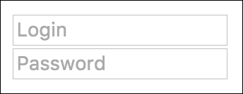
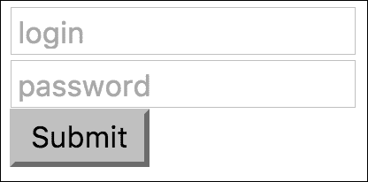
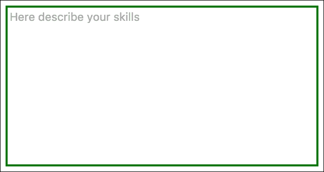
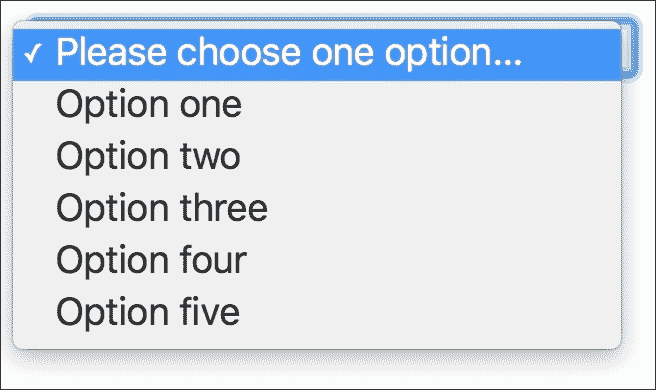

# 第六章。造型形式

设计表单是最具挑战性的任务之一，尤其是当表单需要创建为桌面和移动时。为什么呢？

在本章中，我们将涵盖以下主题:

*   如何创建一个易于造型的良好结构
*   使用表单选择器
*   如何设计表单
*   表单中的 CSS 有哪些可能，哪些不可以

# 表格–最常见的问题

你知道有没有没用 HTML/CSS 构建过任何表单的前端开发者？你认识喜欢做这项工作的人吗？是啊……调整起来并不简单，但是你需要学会理解你可以用 HTML/CSS 做什么，以及你需要在哪里使用 JavaScript 代码来让它变得更容易甚至可能。

最常见的限制如下:

*   不允许使用伪元素`:before`和`:after`，因为输入没有内容(`:before`和`:after`出现在内容之前或之后)
*   使用全局输入样式并不好，因为输入类型很多(文本、密码、提交)
*   所选框中显示元素的样式根本不可能(有时使用一些 JavaScript 插件来启用附加结构更容易，这对于样式来说更容易)

# 形态——启用超能力

如前所述，在输入中，没有办法使用`:before`和`:after`伪元素。但是一个快速的技巧是将它包装在一些其他元素中，这将在下面的部分中得到更好的描述。它总是有助于保留一些标签和输入组，并允许附加`:before`和`:after`伪元素。

例如，以下面的裸露的 HTML 表单代码为例:

```html
<form>
    <input type="text" placeholder="Login"/>
    <input type="password" placeholder="Password"/>
</form>
```

现在您只需要添加包装元素:

```html
<form>
    <div class="inputKeeper">
        <input type="text" placeholder="Login"/>
    </div>
    <div class="inputKeeper">
        <input type="password" placeholder="Password"/>
    </div>
</form>
```

区别在哪里？很容易看出来。第一个表单输出如下:


第二种形式如下:



## 如何进行简单输入

样式输入基于选择器`<input> <select> <textarea>`。但是`<input>`类型有问题。它将收集所有类型:

```html
<input type="text">
<input type="submit">
<input type="password">
<input type="checkbox">
```

对于密码输入:

```html
input[type="password"]
For submit input:
input[type="submit"]
```

让我们把这些输入集合成一个大多出现在网站登录表单上的输入。

HTML 代码:

```html
<form>
    <input type="text" placeholder="login"/>
    <input type="password" placeholder="password"/>
    <input type="submit" />
</form>
```

在浏览器中，它将如下所示:


让我们用包装草皮稍微改变一下结构:

```html
<form>
    <div class="loginWrapper">
        <input type="text" placeholder="login"/>
    </div>
    <div class="passwordWrapper">
        <input type="password" placeholder="password"/>
    </div>
    <div class="submitWrapper">
        <input type="submit" />
    </div>
</form>
```

现在，我们有了一个开始样式化的基础代码:



现在我们可以开始创建样式了:

SASS:

```html
*
box-sizing: border-box

form
width: 300px

input
margin-bottom: 5px
width: 100%

input[type="text"]
  border: 2px solid blue

input[type="password"]
  border: 2px solid green

input[type="submit"]
  background: #000
color: #fff
width: 100%
```

生成的 CSS:

```html
* {
    box-sizing: border-box;
}

form {
    width: 300px;
}

input {
    margin-bottom: 5px;
    width: 100%;
}

input[type="text"] {
    border: 2px solid blue;
}

input[type="password"] {
    border: 2px solid green;
}

input[type="submit"] {
    background: #000;
    color: #fff;
    width: 100%;
}
```

现在，在了解了适当的选择器并添加了基本的 CSS 之后，我们的表单看起来如下:


我们来看看**提交**按钮。我们需要移除它的边界。在这个迭代中，让我们添加一些伪元素。让我们更新我们的 SASS 代码如下:

```html
=ring($size, $color, $width)
  width: $size
height: $size
border-radius: 50%
  border: $width solid $color
background: none

=triangleRight($width, $height, $color)
  width: 0
  height: 0
  border-style: solid
  border-width: $height/2 0 $height/2 $width
  border-color: transparent transparent transparent $color

*
  box-sizing: border-box

form
  width: 300px

input
  margin-bottom: 5px
  width: 100%

input[type="text"]
  border: 2px solid blue

input[type="password"]
  border: 2px solid green

input[type="submit"]
  background: #000
  color: #fff
  width: 100%

.loginWrapper,
.passwordWrapper,
.submitWrapper
  position: relative

  &:after
    content: ''
    display: inline-block
    position: absolute
    top: 50%
    right: 10px

.loginWrapper,
.passwordWrapper
  &:after
    margin-top: -6px
    right: 10px
    +ring(4px, #000, 2px)

.submitWrapper
  &:after
    margin-top: -3px
    right: 10px
    +triangleRight(6px, 6px, #fff)
```

生成的 CSS:

```html
* {
    box-sizing: border-box;
}

form {
    width: 300px;
}

input {
    margin-bottom: 5px;
    width: 100%;
}

input[type="text"] {
    border: 2px solid blue;
}

input[type="password"] {
    border: 2px solid green;
}

input[type="submit"] {
    background: #000;
    color: #fff;
    width: 100%;
}

.loginWrapper,
.passwordWrapper,
.submitWrapper {
    position: relative;
}

.loginWrapper:after,
.passwordWrapper:after,
.submitWrapper:after {
    content: "";
    display: inline-block;
    position: absolute;
    top: 50%;
    right: 10px;
}

.loginWrapper:after,
.passwordWrapper:after {
    margin-top: -6px;
    right: 10px;
    width: 4px;
    height: 4px;
    border-radius: 50%;
    border: 2px solid #000;
    background: none;
}

.submitWrapper:after {
    margin-top: -3px;
    right: 10px;
    width: 0;
    height: 0;
    border-style: solid;
    border-width: 3px 0 3px 6px;
    border-color: transparent transparent transparent #fff;
}
```

结果输出如下:


可以看到，我们省略了`:before`和`:after`伪元素的问题。

## 不要忘记占位符

有了 HTML5，我们在所有浏览器的占位符属性中都有支持。这给了我们一个机会来添加以下描述:

```html
::-webkit-input-placeholder
  color: red

::-moz-placeholder
  color: red

::-ms-input-placeholder
  color: red
```

已编译的 CSS:

```html
::-webkit-input-placeholder {
    color: red;
}

::-moz-placeholder {
    color: red;
}

::-ms-input-placeholder {
    color: red;
}
```

产生的输出如下:


## 基于输入[type="text"]和标签的复杂表单

所以让我们从复杂而有弹性的造型开始。让我们假设我们需要创建一个带有标签和输入的表单，其中标签总是在左边，输入正在调整大小。让我们带来 HTML 结构:

```html
<form class="" action="index.html" method="post">
    <fieldset>
        <legend>Personal data</legend>

        <div class="fieldKeeper">
            <label for="input_name">Your name</label>
            <input id="input_name" type="text" name="name" value="">
        </div>

        <div class="fieldKeeper">
            <label for="input_surname">Your surname</label>
            <input id="input_surname" type="text" name="name" value="">
        </div>

        <div class="fieldKeeper">
            <label for="input_address">Address</label>
            <input id="input_address" type="text" name="name" value="">
        </div>
    </fieldset>

    <fieldset>
        <legend>Login data</legend>
        <div class="fieldKeeper">
            <label for="input_login">Login</label>
            <input id="input_login" type="text" name="name" value="" placeholder="Your login">
        </div>

        <div class="fieldKeeper">
            <label for="input_password">Password</label>
            <input id="input_password" type="password" name="password" value="" placeholder="Password">
        </div>

        <div class="fieldKeeper">
            <label for="input_password_confirm">Confirm password</label>
            <input id="input_password_confirm" type="password" name="confirm_password" value="" placeholder="Confirmed password">
        </div>
    </fieldset>
</form>
```

在浏览器中前面的代码看起来如下:

![Complex form based on input[type="text"] and labels](img/00082.jpeg)

如您所见，它现在的行为几乎像它应该做的那样，但是它的输入不是 100%的宽度。当您将其更改为 100%时，标签将在输入上移动。因此，我们可以做的是将输入包装在一个额外的`div`中，并使用带有填充和绝对/相对位置的技巧。我们先把 HTML 代码改成`fieldset`:

```html
<fieldset>
    <legend>Login data</legend>
    <div class="fieldKeeper">
        <label for="input_login">Login</label>
        <div class="inputKeeper">
            <input id="input_login" type="text" name="name" value="" placeholder="Your login">
        </div>
    </div>

    <div class="fieldKeeper">
        <label for="input_password">Password</label>
        <div class="inputKeeper">
            <input id="input_password" type="password" name="password" value="" placeholder="Password">
        </div>
    </div>

    <div class="fieldKeeper">
        <label for="input_password_confirm">Confirm password</label>
        <div class="inputKeeper">
           <input id="input_password_confirm" type="password" name="confirm_password" value=""
                   placeholder="Confirmed password">
        </div>
    </div>
</fieldset>
```

仅在第一个`fieldset`中进行此更改后，您将看到代码在添加和不添加`inputKeeper` `div`时的行为。让我们使用下面的 SASS 代码:

```html
.fieldKeeper
  position: relative

fieldset
  width: auto
  border: 2px solid green

legend
  text-transform: uppercase
  font:
    size: 10px
    weight: bold

label
  position: absolute
  width: 200px
  display: inline-block
  left: 0
  font:
    size: 12px

.inputKeeper
  padding:
    left: 200px

input
  width: 100%
```

已编译的 CSS:

```html
.fieldKeeper {
    position: relative;
}

fieldset {
    width: auto;
    border: 2px solid green;
}

legend {
    text-transform: uppercase;
    font-size: 10px;
    font-weight: bold;
}

label {
    position: absolute;
    width: 200px;
    display: inline-block;
    left: 0;
    font-size: 12px;
}

.inputKeeper {
    padding-left: 200px;
}

input {
    width: 100%;
}
```

现在，您可以在浏览器中看到如下内容:

![Complex form based on input[type="text"] and labels](img/00083.jpeg)

在更大的屏幕上，您将看到以下内容:

![Complex form based on input[type="text"] and labels](img/00084.jpeg)

正如我们所看到的，标签的绝对位置没有额外的包装导致了在输入上覆盖标签的问题。一个额外的包装器给了我们一个添加填充的机会。代替这个填充，我们可以推送一个绝对位置的标签。将包装器附加到第二部分后，它在浏览器中应该如下所示:

![Complex form based on input[type="text"] and labels](img/00085.jpeg)

## 如何设置文本区域的样式

`textarea`的样式相当简单，与文本输入的样式非常相似。区别之一是调整`textarea`大小的机会。这与`input[type="text"]`文本区相同，它可以有一个占位符，以便您可以为其添加样式。让我们准备简单的 HTML 代码，对文本区域进行简短的调查:

```html
<textarea placeholder="Here describe your skills"></textarea>
```

现在在浏览器中，您将看到以下内容:


请记住不要在开始和结束标签之间添加任何空格或行尾，因为它将被视为`textarea`的内容。这将导致占位符出现问题。

和 SASS 代码:

```html
textarea
  width: 300px
  height: 150px
  resize: none
  border: 2px solid green
```

已编译的 CSS:

```html
textarea {
    width: 300px;
    height: 150px;
    resize: none;
    border: 2px solid green;
}
```

在浏览器中，您将看到以下内容:



当属性的值调整大小时，可以使用以下选项:

*   `none`:这将禁用两个轴的大小调整
*   `vertical`:这将启用垂直调整大小并阻止水平调整大小
*   `horizontal`:这将启用水平调整大小并阻止垂直调整大小
*   `both`:这可以在两个轴上调整大小

## 选择样式(下拉)

地狱耶…`select`(下拉)的造型没有想象的那么简单。在大多数情况下，你会需要使用一些 JavaScript 插件来使它更容易。但是你能用简单的 CSS/HTML 代码做什么呢？让我们获取以下代码:

```html
<select>
    <option>Please choose one option...</option>
    <option>Option one</option>
    <option>Option two</option>
    <option>Option three</option>
    <option>Option four</option>
    <option>Option five</option>
</select>
```

前面的代码将生成一个如下所示的无样式选择框:


在聚焦动作之后，它给出以下输出:



我们现在能用它做什么？让我们试着增加更多的味道。首先，让我们把它包装成额外的元素:

```html
<div class="selectWrapper">
    <select>
        <option>Please choose one option...</option>
        <option>Option one</option>
        <option>Option two</option>
        <option>Option three</option>
        <option>Option four</option>
        <option>Option five</option>
    </select>
</div>
```

现在让我们添加一个 SASS 代码:

```html
=triangleBottom($width, $height, $color)
  width: 0
  height: 0
  border-style: solid
  border-width: $height $width/2 0 $width/2
  border-color: $color transparent transparent transparent

.selectWrapper
  width: 300px
  border: 2px solid green
  overflow: hidden
  position: relative

  &:after
    content: ''
    position: absolute
    +triangleBottom(10px, 6px, red)
    right: 5px
    margin-top: -3px
    top: 50%

select
  background: #fff
  color: black
  font:
    size: 14px
  border: none
  width: 105%
```

已编译的 CSS:

```html
.selectWrapper {
    width: 300px;
    border: 2px solid green;
    overflow: hidden;
    position: relative;
}

.selectWrapper:after {
    content: "";
    position: absolute;
    width: 0;
    height: 0;
    border-style: solid;
    border-width: 6px 5px 0 5px;
    border-color: red transparent transparent transparent;
    right: 5px;
    margin-top: -3px;
    top: 50%;
}

select {
    background: #fff;
    color: black;
    font-size: 14px;
    border: none;
    width: 105%;
}
```


正如你所看到的，这种方法相当棘手。我们选择了比容器稍宽一点的地方来移出原生控件。然后我们在容器中添加了一个隐藏的溢出。另外，我们添加了 after 元素来添加一个三角形。

# 总结

在本章中，您获得了关于造型形式的知识。处理所有这些都非常棘手，但是正如您所看到的，总有一些解决方案(例如，使用额外的包装器)可以做到这一点。我建议您创建一个简单的框架来处理表单。它让你做好充分的准备来设计表单。

在下一章中，我们将尝试用 CSS 解决最可重复的经典问题，例如元素的中心化、处理显示类型等等。这将是一个展示旧的学校和新的学校方法可能与新的 CSS 功能。