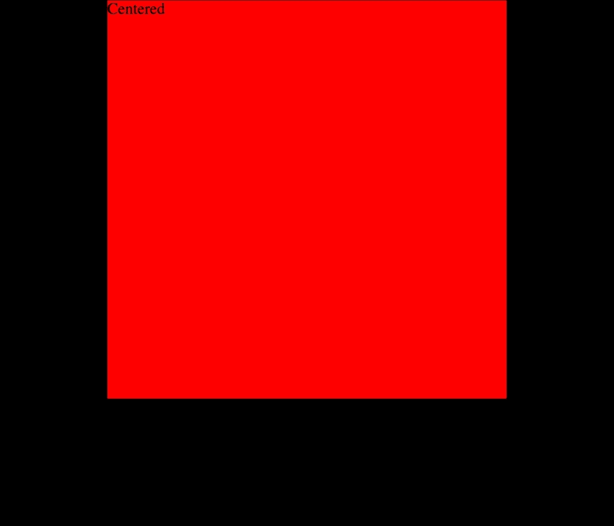
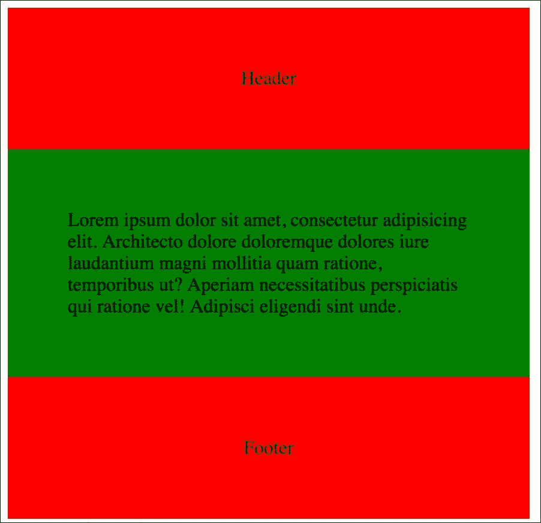
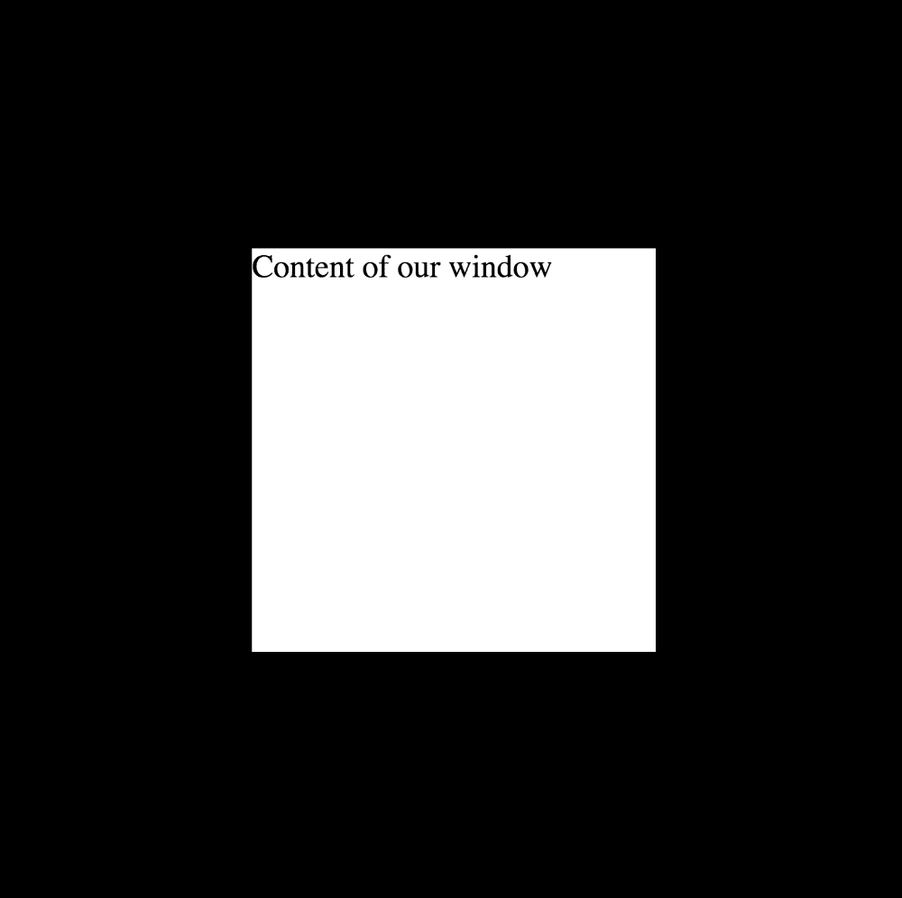
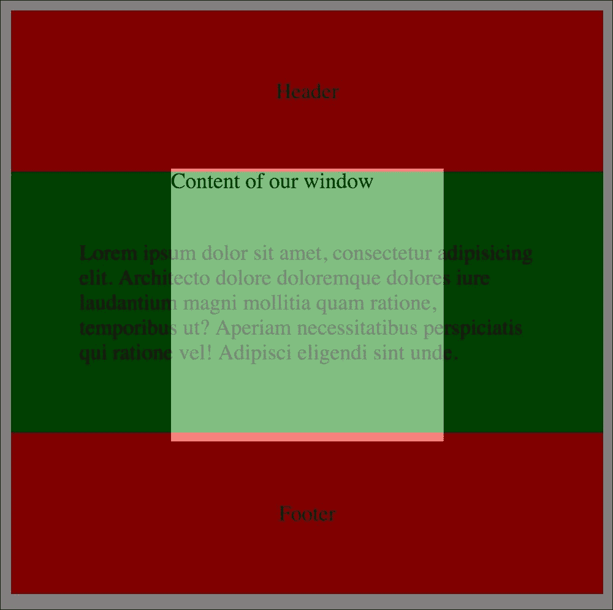
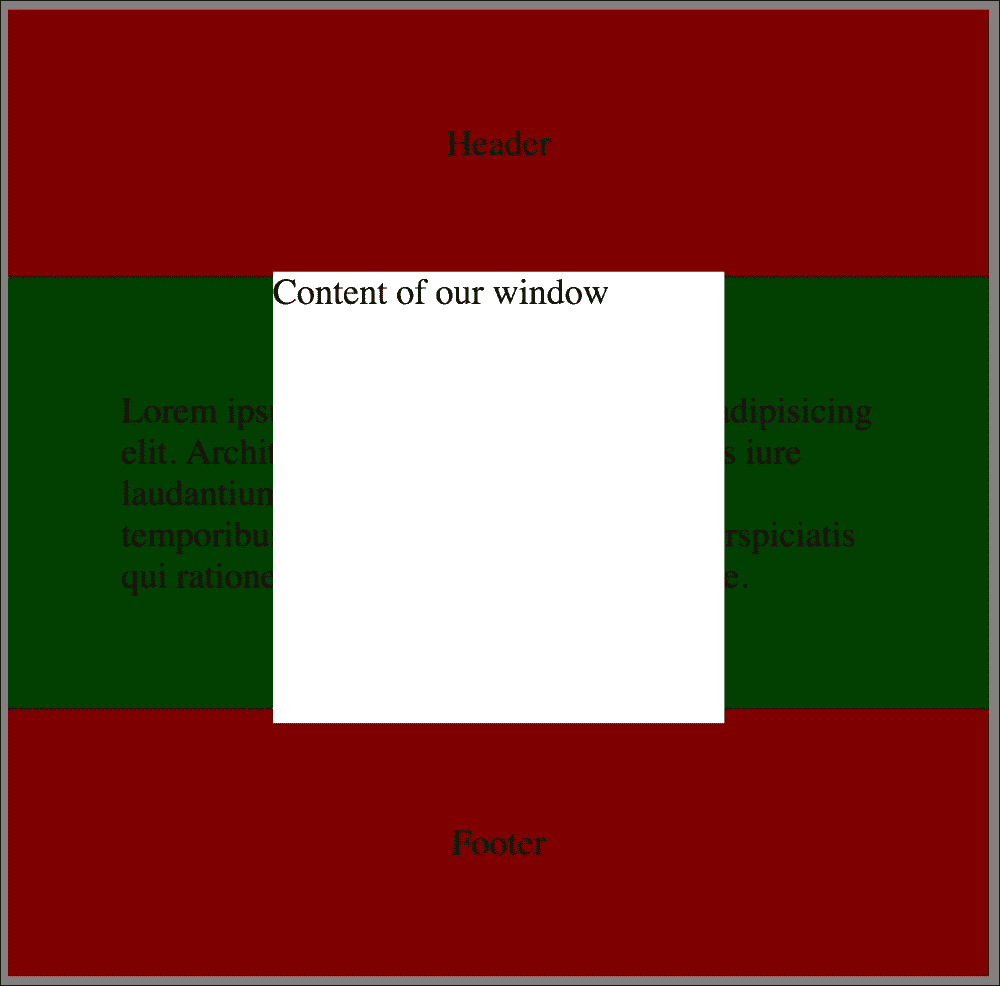

# 七、解决经典问题

作为一名前端开发人员，您总是在处理经典的 CSS 问题。最常见和最容易重复的问题是轴和不透明度的中心元素。使用当前的 CSS，你可以做得很简单，但是你需要有一个基础来知道如何做。关于浏览器以前版本的后退的知识可以用在其他一些进一步的技术中。这就是它们被添加到本章的原因。

在本章中，我们将:

*   了解如何在两个轴上居中元素
*   了解如何处理不透明度
*   收集前面的技巧，创建一个类似于时尚灯箱效果的效果

# 定心元件

对中元素是从第一个 CSS 版本开始就知道的一个方面。页面上总有一些元素需要在某个容器或浏览器中垂直或水平居中。将一些元素居中的最简单方法是将元素追加到表格元素中，并在 HTML 中添加垂直对齐和水平对齐属性:

```html
<td valign="middle" align="center>  </td>
```

但是在现代 CSS 中如何做到这一点呢？对中有两种:

*   水平的
*   垂直的

让我们解决这个问题。

## 内嵌元素–水平居中

让我们假设我们有一个需要居中的文本。很简单。我们只需要加上`text-align: center`就可以了。在我们将要实现的示例中，我们的容器的背景被设置为`red`，元素的背景被设置为`white`，以查看它是如何工作的。

让我们从这个 HTML 代码开始:

```html
<p class="container">
    <span class="element">Centered</span>
</p>
```

和 SASS 代码:

```html
.container
  background: red
  padding: 20px

.element
  background: white
```

CSS:

```html
.container {
    background: red;
    padding: 20px;
}

.element {
    background: white;
}
```

我们将在浏览器中看到如下内容:


如前所述，要将置于盒子的中心，我们需要将`text-align: center`添加到容器中:

SASS:

```html
.container
  text-align: center
  background: red
  padding: 20px

.element
  background: white
```

现在在浏览器中，我们可以看到以下内容:


让我们假设我们有两个块元素，我们想要像前面的例子一样调整它们。我们需要做什么？我们需要将显示类型更改为`inline`或`inline-block`。让我们稍微改变一下 HTML 代码:

```html
<div class="container">
    <div class="element">Centered</div>
</div>
```

现在有了之前添加的SASS 代码，我们的示例将表现得类似于下面的截图:


正如我们在前面的截图中看到的，block 元素承担了所有可能的权重。我们需要做的是修改 SASS 代码:

```html
.container
  text-align: center
  background: red
  padding: 20px

.element
  background: white
  display: inline-block
```

CSS:

```html
.container {
    text-align: center;
    background: red;
    padding: 20px;
}

.element {
    background: white;
    display: inline-block;
}
```

现在在浏览器中，我们可以看到以下内容:


## 块元素–在两个轴上居中

让我们从上一章的代码开始，这将是我们 CSS 样式的基础。这是`container`中的元素:

```html
<div class="container">
    <div class="element">Centered</div>
</div>
```

添加了带有颜色的 SASS 代码，以便更好地了解问题:

```html
.container
  background: black

.element
  width: 400px
  height: 400px
  background: red
```

CSS:

```html
.container {
    background: black;
}

.element {
    width: 400px;
    height: 400px;
    background: red;
}
```

首先，浏览器中的代码如下所示:


正如我们在前面的截图中所看到的，我们的带有`Centered`内容的容器现在在黑色容器的左侧。让我们假设这是页面的容器，需要将居中并贴在页面顶部:

```html
.container
  background: black
  height: 800px

.element
  width: 400px
  height: 400px
  background: red
  margin: 0 auto
```

已编译:

```html
.container {
    background: black;
    height: 800px;
}

.element {
    width: 400px;
    height: 400px;
    background: red;
    margin: 0 auto;
}
```

最重要的一行是粗体字。这使得我们的容器居中，如下图所示:



那么我们能做些什么来使它在两个轴上居中呢？老派的方式，已知元素的宽度和高度，就是把容器相对位置加到元素绝对位置。元素需要从顶部向左移动 50%。然后，我们需要使用负边距将已知高度一半的元素移到顶部和左侧:

```html
.container
  position: relative

.element
  position: absolute
  width: 100px
  height: 100px
  left: 50%
  right: 50%
  margin-left: -50px
  margin-top: -50px
```

CSS:

```html
.container {
    position: relative;
}

.element {
    position: absolute;
    width: 100px;
    height: 100px;
    left: 50%;
    right: 50%;
    margin-left: -50px;
    margin-top: -50px;
}
```

输出如下:


正如你在前面的截图中看到的，元素在两个轴上都是居中的。最大的问题是元素的静态宽度和高度。是的，当然有一种方法可以添加一个 JavaScript 代码来实现，但是最好使用原生的 CSS 函数。所以让我们试着用`transform`属性来做。

## 在居中时使用变换

在上一节中，我们一直在尝试解决元素对中的问题。让我们用转换声明来扩展它。我们将在下一章深入研究 transform，以了解它如何与旋转和缩放一起工作，但是在这一章中，我们需要添加以下代码:

```html
.container
  position: relative

.element
  position: absolute
  left: 50%
  right: 50%
  transform: translate(-50%, -50%)
```

前面代码的最后一行产生了与前面部分相同的效果，定义了负的左边距和上边距。这段代码最好的特点是，我们可以在不知道宽度和高度的情况下到处添加它。在下一章中，我们将学习 flexbox，它可以用于元素的居中。

# 处理不透明度

不透明性经常出现在项目中。例如，当您在页面或类似灯箱的图库上创建一些模型窗口时。它用在主窗口(覆盖元素)下添加的层上，在大多数情况下，主窗口在 JavaScript 中添加了一个`onclick`事件监听器，点击后会隐藏窗口。你如何创造这种效果？过去是怎么做的？让我们从一个简单的 HTML 代码开始:

```html
<header> Header </header>
<main> Lorem ipsum dolor sit amet, consectetur adipisicing elit. Architecto dolore doloremque dolores iure laudantium magni mollitia quam ratione, temporibus ut? Aperiam necessitatibus perspiciatis qui ratione vel! Adipisci eligendi sint unde. </main>
<footer> Footer </footer>
```

SASS:

```html
header, footer, main
  padding: 50px
  text-align: center

header, footer
  background: red

main
  background: green
```

已编译:

```html
header, footer, main {
    padding: 50px;
    text-align: center;
}

header, footer {
    background: red;
}

main {
    background: green;
}
```

现在看起来如下:



我们需要做的是在实际可见的容器上添加一个不透明的层。让我们在当前添加的代码之后追加这段代码:

```html
<div class="window_container">
    <div class="window">Content of our window</div>
</div>
```

我们现在需要做的是将容器位置改为`fixed`，将元素的位置改为`absolute`。让我们添加更多的代码来添加更多的样式，以便更好地查看我们工作的效果:

```html
.window_container
  position: fixed
  width: 100%
  height: 100%
  top: 0
  left: 0
  background: black

.window
  position: absolute
  width: 200px
  height: 200px
  background: white
  top: 50%
  left: 50%
  -webkit-transform: translate(-50%, -50%)
  -moz-transform: translate(-50%, -50%)
  -ms-transform: translate(-50%, -50%)
  -o-transform: translate(-50%, -50%)
  transform: translate(-50%, -50%)
```

已编译:

```html
.window_container {
    position: fixed;
    width: 100%;
    height: 100%;
    top: 0;
    left: 0;
    background: black;
}

.window {
    position: absolute;
    width: 200px;
    height: 200px;
    background: white;
    top: 50%;
    left: 50%;
    -webkit-transform: translate(-50%, -50%);
    -moz-transform: translate(-50%, -50%);
    -ms-transform: translate(-50%, -50%);
    -o-transform: translate(-50%, -50%);
    transform: translate(-50%, -50%);
}
```

在浏览器中，我们将看到黑色容器上的白色居中块，如下所示:



前面的代码将成为下一节的基础，在这里我们将看到`opacity`和`rgba`的区别。

## 不透明度与 RGBA–差异以及我们可以在哪里使用它们

让我们试试来制作。`window_container`之前添加到 HTML/SASS 结构中的元素应该是透明的。最简单的方法就是添加`opacity` : `.5`。因此，让我们尝试将以下代码添加到我们当前的 SASS 代码中:

```html
.window_container
  opacity: .5
  position: fixed
  width: 100%
  height: 100%
  top: 0
  left: 0
  background: black
```

CSS:

```html
.window_container {
    opacity: 0.5;
    position: fixed;
    width: 100%;
    height: 100%;
    top: 0;
    left: 0;
    background: black;
}
```

浏览器中的效果如下图所示:



正如我们在前面的截图中看到的，不透明度是由我们`.window_container`内部的元素继承的。这不是我们想要的方式，所以我们必须改变 CSS (SASS)或 HTML 代码。如果我们想改变 HTML 代码，我们可以这样做:

```html
<div class="window_container"> </div>
<div class="window">Content of our window</div>
```

并且在窗口描述中将改变 SASS 代码。我们将只改变位置到`fixed`:

```html
.window
  position: fixed
```

浏览器中的效果如下:



从前面的截图中我们可以看到，在浏览器中，效果是达到了，但是我们的 HTML 结构有点混乱。我们在 HTML 代码中并行添加了两个元素，它们与一个元素相关。让我们回到章节开始的代码，其中`.window`在`.window_container`中。这是我们将使用`rgba`的地方。确保负责该窗口的 HTML 代码如下所示:

```html
<div class="window_container">
    <div class="window">Content of our window</div>
</div>
```

我们需要做的是改变`window_container`背景颜色的定义，并追加我们的`rgba`。众所周知，我们可以用几种方式定义元素的颜色:

*   添加颜色名称(`black`、`white`、`red`，...)
*   十六进制颜色定义(`#ff00ff`，`#fff`...)
*   基于绿蓝的 RGB ( `rgb(0,0,0)`、`rgb(255,255,255)`)
*   基于饱和度的饱和度
*   基于 R(ed)G(reen)B(lue) + alpha 通道的 RGBA ( `rgb(0,0,0, .4)`、`rgb(255,255,255, .7)`)
*   基于 H(ue) S(饱和度)L(饱和度)+α通道的 HSLA ( `hsl(100, 90%, 50%, .8)`)

在我们的案例中，我们将使用`rgba`。`window_container`的最终 SASS 代码如下:

```html
.window_container
  position: fixed
  width: 100%
  height: 100%
  top: 0
  left: 0
  background: rgba(0,0,0,.5)

.window
  position: fixed
  width: 200px
  height: 200px
  background: white
  top: 50%
  left: 50%
  -webkit-transform: translate(-50%, -50%)
  -moz-transform: translate(-50%, -50%)
  -ms-transform: translate(-50%, -50%)
  -o-transform: translate(-50%, -50%)
  transform: translate(-50%, -50%)
```

已编译:

```html
.window_container {
    position: fixed;
    width: 100%;
    height: 100%;
    top: 0;
    left: 0;
    background: rgba(0, 0, 0, 0.5);
}

.window {
    position: fixed;
    width: 200px;
    height: 200px;
    background: white;
    top: 50%;
    left: 50%;
    -webkit-transform: translate(-50%, -50%);
    -moz-transform: translate(-50%, -50%);
    -ms-transform: translate(-50%, -50%);
    -o-transform: translate(-50%, -50%);
    transform: translate(-50%, -50%);
}
```

如您所见，`opacity`声明被移除。颜色被定义为 RGBA。其余代码同。浏览器中的代码如下所示:


## 过去的不透明度——旧 IE 版本的退路

旧浏览器的回退是以类似的方式完成的，当你想使用边框半径时——你需要使用图像。最后是怎么做到的？当在图形软件中剪切图形时，覆盖层被剪切为一个小的透明图像，例如，每 1px per 1px。然后添加为背景，在 *x* 和 *y* 轴重复。

```html
/* FALLBACK */
.window_container
  background-image: url(<1x1.png>)
  background-repeat: repeat
```

# 总结

在本章中，您了解了 CSS 中最著名的经典问题:居中和不透明。您解决了这个问题，并了解了解决方案的利弊。此外，您还学习了如何在旧浏览器中解决不透明度问题。

在下一章中，您将了解现代 CSS 方面，如 flexbox 渐变、阴影、变换和数据属性。您还将了解一些技巧，可以使用此功能将其应用到代码中。让我们进入下一章。