# 八、Flexbox变换的使用

CSS 还在开发中。每年，作为前端开发人员，您都需要关注当前的趋势和您可以为元素设置的新属性。当然，有很多限制，但在某些情况下，这些限制是不存在的，例如，在新浏览器或选定的移动应用中，或者因为设置的要求。在本章中，我们将涵盖以下主题:

*   flex box(flex box)的缩写形式
*   转换属性

# Flexbox

Flexbox 是当前 CSS 项目中使用的最响亮、最现代的布局方法之一。使用 flexbox，您可以为网页创建一个结构，它比基于浮动框的项目更有弹性。为什么呢？我们将在本章中进行检查和调查。你需要记住的是，Internet Explorer 从第 11 版开始就支持 flexbox 了。

让我们看看flexbox 的基础知识:

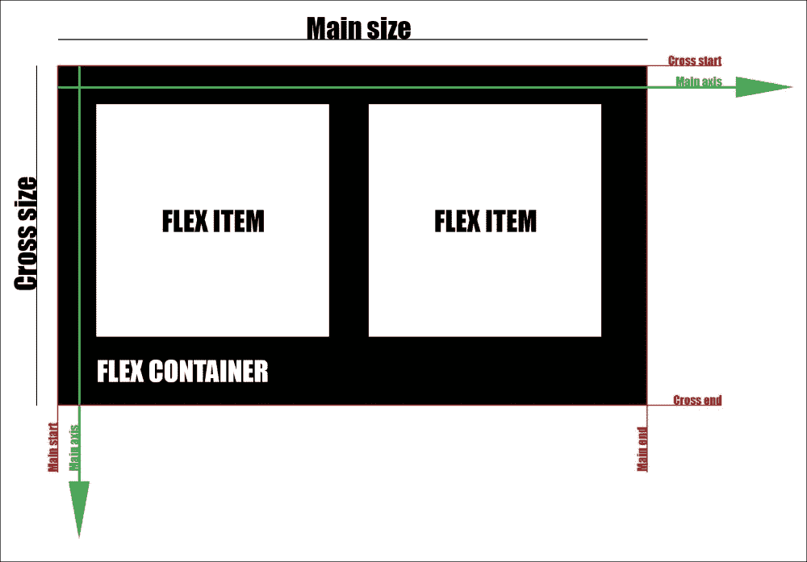

从上一张截图中可以看到，有一个与 flexbox 相关的新字典:

*   **主轴**(绿色箭头)
*   **主启动**(红线)
*   **主端**(红线)
*   **主尺寸**(黑线)
*   **横轴**(绿色箭头)
*   **十字开始**(红线)
*   **十字结束**(红线)
*   **十字尺寸**(黑线)

flexbox 的初始化非常简单。您只需要将以下代码添加到您的容器中:

```html
.flexContainer
  display: -webkit-box
  display: -moz-box
  display: -ms-flexbox
  display: -webkit-flex
  display: flex
```

编译后的代码是:

```html
.flexContainer {

    display: -webkit-box;

    display: -moz-box;

    display: -ms-flexbox;

    display: -webkit-flex;

    display: flex;

}
```

flexbox 的用法为了跨浏览器兼容还是需要前缀的。这是创建可重用混合的一个很好的理由:

```html
=displayFlex

  display: -webkit-box

  display: -moz-box

  display: -ms-flexbox

  display: -webkit-flex

  display: flex
```

现在我们可以创建相同的`.flexContainer`，如下所示:

```html
.flexContainer

  +displayFlex
```

编译后的代码是:

```html
.flexContainer {

    display: -webkit-box;

    display: -moz-box;

    display: -ms-flexbox;

    display: -webkit-flex;

    display: flex;

}
```

让我们在容器中创建几个元素:

```html
<div class="flexContainer">

    <div class="flexElement">Element 1</div>

    <div class="flexElement">Element 2</div>

    <div class="flexElement">Element 3</div>

</div>
```

让我们稍微修饰一下我们的 CSS 代码，看看 flexbox 是如何工作的:

```html
=displayFlex

  display: -webkit-box

  display: -moz-box

  display: -ms-flexbox

  display: -webkit-flex

  display: flex

.flexContainer

  +displayFlex

  background: red
```

编译后的代码是:

```html
.flexContainer {

    display: -webkit-box;

    display: -moz-box;

    display: -ms-flexbox;

    display: -webkit-flex;

    display: flex;

    background: red;

}
```

现在我们将在浏览器中看到以下视图:


您可以从前面的截图中看到，容器在浏览器中没有达到最大可能的高度，但它确实达到了最大宽度。里面的元素都飘到了左边。现在让我们稍微修改一下 SASS 代码:

```html
.flexContainer

  +displayFlex

  height: 100%

  background: red

.blue

  background: blue

.green

  background: green

.yellow

  background: yellow
```

编译后的代码是:

```html
.flexContainer {

    display: -webkit-box;

    display: -moz-box;

    display: -ms-flexbox;

    display: -webkit-flex;

    display: flex;

    height: 100%;

    background: red;

}

.blue {

    background: blue;

}

.green {

    background: green;

}

.yellow {

    background: yellow;

}
```

让我们在 HTML 代码中添加一个颜色类:

```html
<div class="flexContainer">

    <div class="flexElement blue">Element 1</div>

    <div class="flexElement green">Element 2</div>

    <div class="flexElement yellow">Element 3</div>

</div>
```

而在浏览器中，你会看到如下:


正如您在前面的截图中所看到的，容器有一个完整的宽度和高度，元素内部的行为类似于内联元素，但是完整的高度是从容器继承的。这是因为名为`align-item`的属性，其默认值为**拉伸**。让我们深入了解一下这个属性的值。

## 弹性框属性对齐-项目

这是我们可以添加到`flexContainer`的属性之一。它有一些我们可以设置的值。现在，我们知道默认拉伸值的行为。让我们研究一下其他可能的值。在所有值之前，让我们稍微更改一下 HTML 和 CSS 代码，以便更好地查看所有行为。

让我们修改 HTML 代码如下:

```html
<div class="flexContainer">

    <div class="flexElement blue h200px">Element 1</div>

    <div class="flexElement green h300px">Element 2</div>

    <div class="flexElement yellow h100px">Element 3</div>

</div>
```

让我们附加下面的 SASS 代码:

```html
.h100px

  height: 100px

.h200px

  height: 200px

.h300px

  height: 300px
```

CSS 文件是:

```html
.h100px {

    height: 100px;

}

.h200px {

    height: 200px;

}

.h300px {

    height: 300px;

}
```

可以使用的不同挠曲值如下:

*   `stretch` (default)

    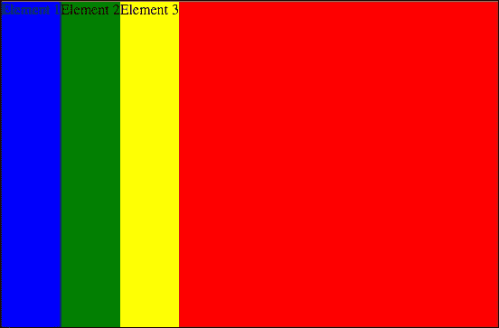

    ### 类型

    对于此值拉伸，您需要移除添加盒子高度的类(`h100px`、`h200px`、`h300px`)。

*   `flex-start`

    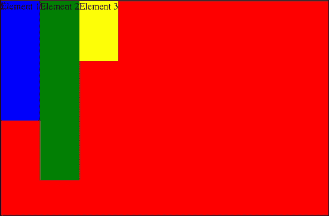

*   `flex-end`

    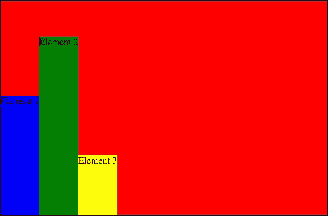

*   `center`

    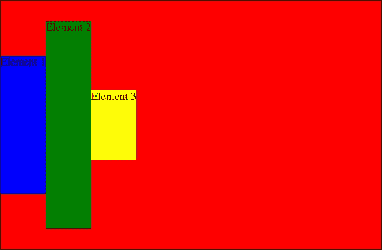

*   `baseline`

在这种情况下，为了更好地理解这种行为，让我们更改代码，看看基线是如何指定的:

```html
<div class="flexContainer">
    <div class="flexElement blue h200px">Element 1</div>
    <div class="flexElement green h300px">Element 2 Lorem ipsum dolor sit amet, consectetur adipisicing elit. Possimus necessitatibus est quis sequi, sapiente quos corporis, dignissimos libero quibusdam beatae ipsam quaerat? Excepturi magni voluptas dicta inventore necessitatibus omnis officia.</div>
    <div class="flexElement yellow h100px">Element 3</div>
</div>
```

在 SASS 中，代码可以写成:

```html
.h100px
  height: 100px
  font-size: 30px
  margin-top: 20px

.h200px
  height: 200px
  font-size: 20px

.h300px
  height: 300px
  font-size: 8px
```

CSS 代码将是:

```html
.h100px {
    height: 100px;
    font-size: 30px;
    margin-top: 20px;
}

.h200px {
    height: 200px;
    font-size: 20px;
}

.h300px {
    height: 300px;
    font-size: 8px;
}
```

前面代码的输出如下:


框从顶部开始的位置是从框中第一行文本指定的基线开始设置的。有目的地为描述为`h100px`框的框添加了一个顶部边距，以查看基线是否从该组子框中的任何一个框开始计算。

好吧。但是当我们添加一个没有文本内容的框时，这个例子会如何表现呢？让我们修改 HTML 代码如下:

```html
<div class="flexContainer">
    <div class="flexElement blue h200px">Element 1</div>
    <div class="flexElement yellow h100px w100px"></div>
    <div class="flexElement green h300px">Element 2 Lorem ipsum dolor sit amet, consectetur adipisicing elit. Possimus necessitatibus est quis sequi, sapiente quos corporis, dignissimos libero quibusdam beatae ipsam quaerat? Excepturi magni voluptas dicta inventore necessitatibus omnis officia.</div>
    <div class="flexElement yellow h100px">Element 3</div>
</div>
```

让我们在 SASS 代码中添加`w100px`类:

```html
.w100px
  width: 100px

CSS:
.w100px {
    width: 100px;
}
```

前面代码的输出如下:

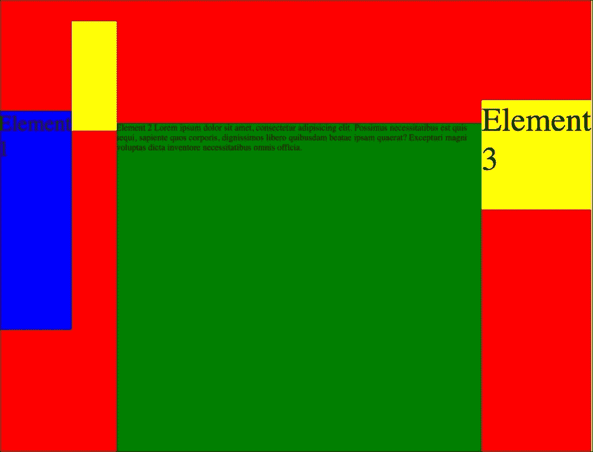

我们可以看到在前面的截图中，基线是由黄色空框的底线指定的。

## 弹性盒属性弹性包装

我们可以为 flex 容器设置的下一个属性之一是`flex-wrap`。该属性与盒子包装有关。我们可以将`nowrap`、`wrap`和`wrap-reverse`设置为数值。他们表现如何？

*   `nowrap` (default)

    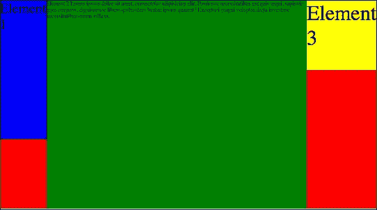

*   `wrap`

    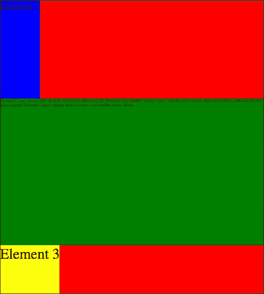

*   `wrap-reverse`

    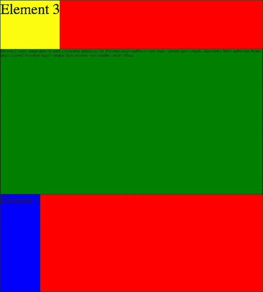

如你所见，和`wrap`的工作方式相同，但有一个简单的区别:`wrap-reverse`正在改变弹性项目的顺序。

## 弹性框属性调整内容

`justify-content`属性也与容器相关:

*   `flex-start`

    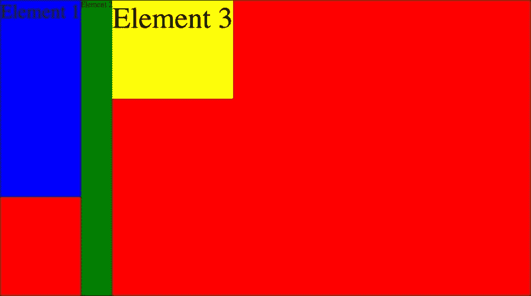

*   `flex-end`

    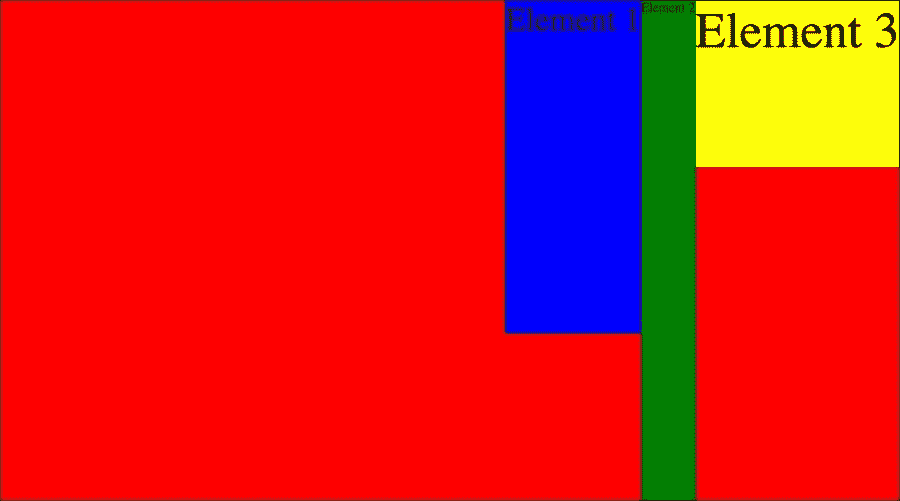

*   `center`

    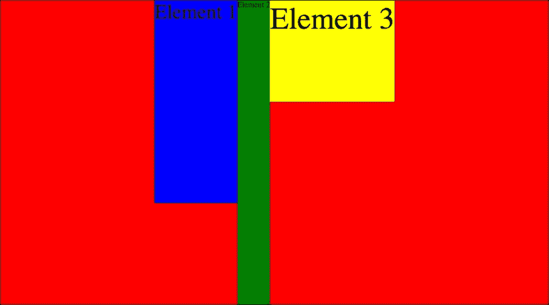

*   `space-between`

    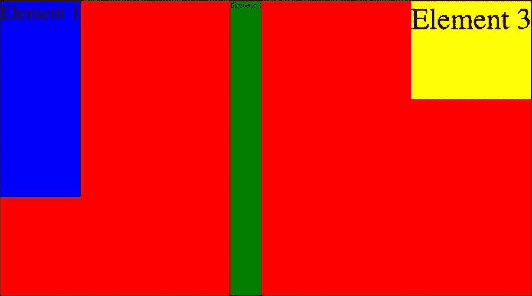

*   `space-around`

    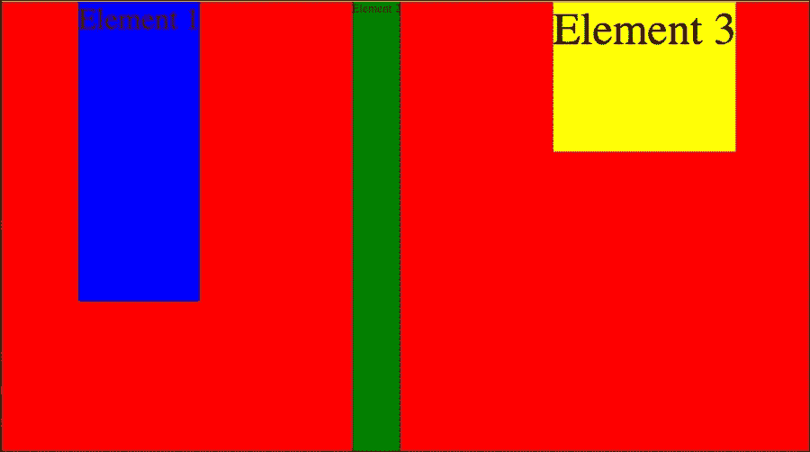

## Flexbox 属性对齐-内容

项的对齐与`flexContainer`有关。您需要记住，当您至少有两行项目时，效果将是可见的。因此，让我们更改以下示例代码:

HTML:

```html
<div class="flexContainer">
    <div class="flexElement blue h100px">Element 1</div>
    <div class="flexElement green h200px">Element 2</div>
    <div class="flexElement blue h100px">Element 3</div>
    <div class="flexElement green h200px">Element 4</div>
    <div class="flexElement blue h100px">Element 5</div>
    <div class="flexElement green h200px">Element 6</div>
</div>
```

SASS 代码是:

```html
=displayFlex
  display: -webkit-box
  display: -moz-box
  display: -ms-flexbox
  display: -webkit-flex
  display: flex

.flexContainer
  height: 600px
  width: 900px
  +displayFlex
  flex-wrap: wrap
  background: red

.blue
  background: blue

.green
  background: green

.yellow
  background: yellow

.h100px
  height: 100px
  font-size: 30px
  margin-top: 20px

.h200px
  height: 200px
  font-size: 20px

.h300px
  height: 300px
  font-size: 8px

.w100px
  width: 100px

.flexElement
  width: 300px
```

CSS 代码为:

```html
.flexContainer {
    height: 600px;
    width: 900px;
    display: -webkit-box;
    display: -moz-box;
    display: -ms-flexbox;
    display: -webkit-flex;
    display: flex;
    flex-wrap: wrap;
    background: red;
}

.blue {
    background: blue;
}

.green {
    background: green;
}

.yellow {
    background: yellow;
}

.h100px {
    height: 100px;
    font-size: 30px;
    margin-top: 20px;
}

.h200px {
    height: 200px;
    font-size: 20px;
}

.h300px {
    height: 300px;
    font-size: 8px;
}

.w100px {
    width: 100px;
}

.flexElement {
    width: 300px;
}
```

*   `flex-start`

    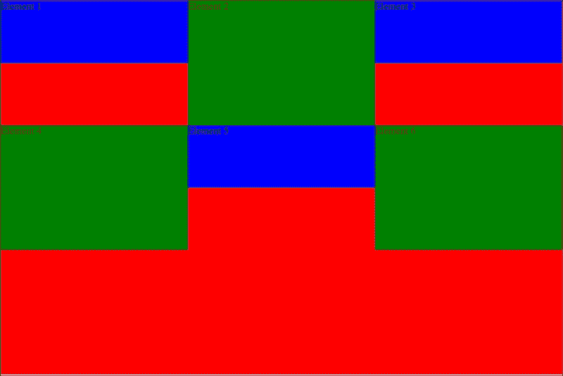

*   `flex-end`

    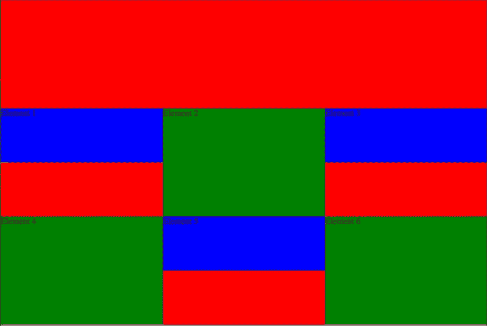

*   `center`

    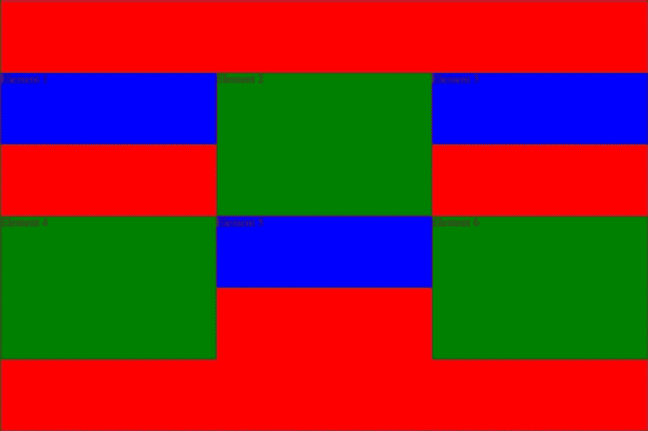

*   `space-between`

    

*   `space-around`

    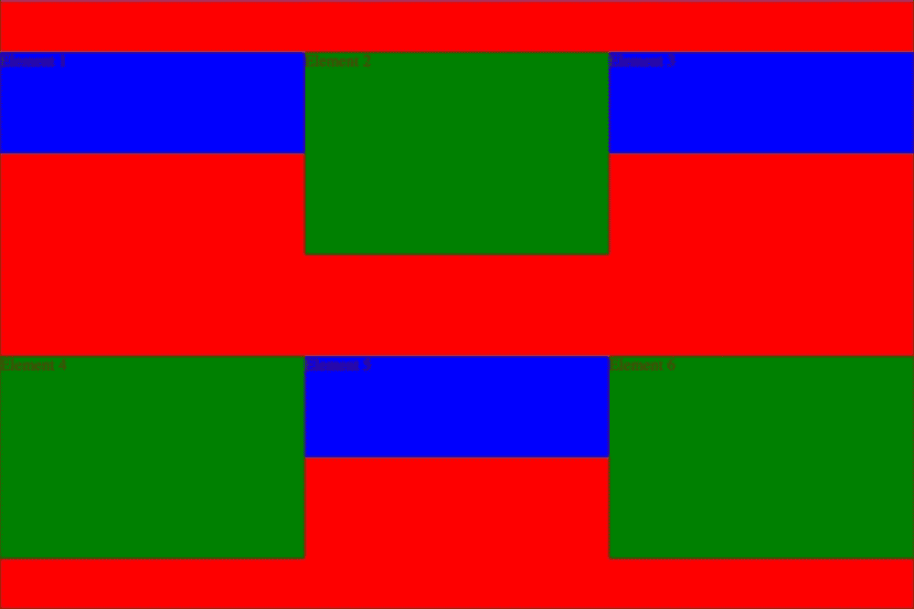

*   `stretch`

    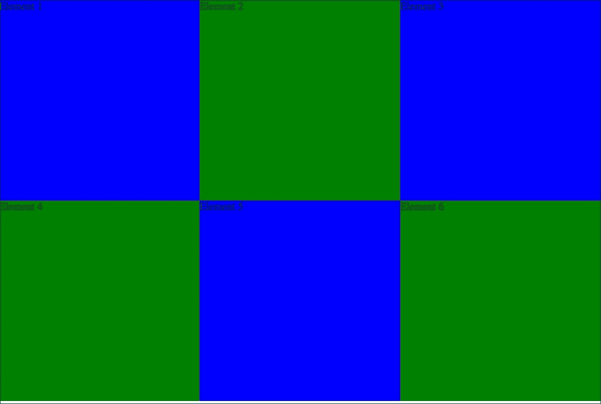

在最后一个的例子中，所有与身高相关的职业都被移除了:`h100px`、`h200px`。

## 伸缩箱属性伸缩方向

柔轮箱不同的属性如下:

*   `row`

    

*   `row-reverse`

    

*   `column`

    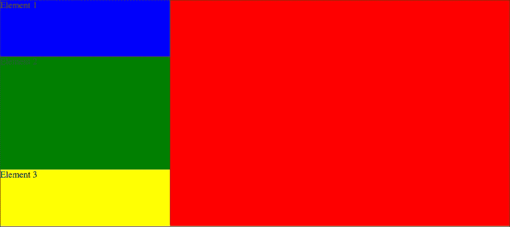

*   `column-reverse`

    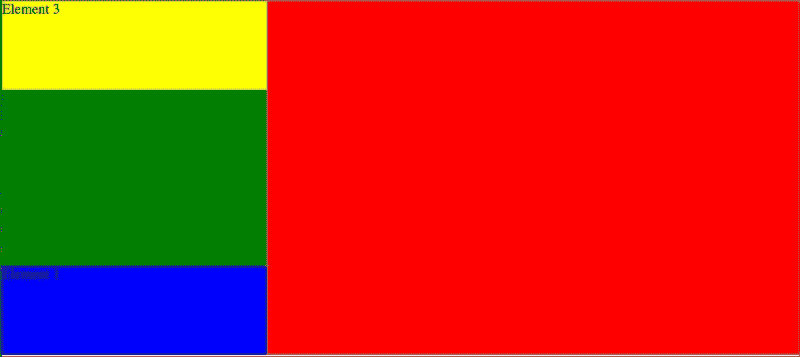

您可以添加到收藏中的有用的混音如下:

```html
=displayFlex
  display: -webkit-box
  display: -moz-box
  display: -ms-flexbox
  display: -webkit-flex
  display: flex

=flexOrder($number)
  -webkit-box-ordinal-group: $number
  -moz-box-ordinal-group: $number
  -ms-flex-order: $number
  -webkit-order: $number
  order: $number
```

## 弹性框的使用–创建页面结构

当你开始做一个项目时，你是把准备好的布局作为一个图形文件，你需要让它在浏览器中可用并具有交互性。让我们从目前最广为人知的结构开始:

```html
<div class="flexContainer">
    <header>Header</header>
    <aside>Side menu</aside>
    <main>Content</main>
    <footer>Footer - Copyright fedojo.com</footer>
</div>
```

所以我们想把顶部的页眉从右边的左主和底部的页脚中去掉:

```html
.flexContainer
  +displayFlex
  -webkit-flex-flow: row wrap
  flex-flow: row wrap

  & > *
    padding: 10px
    flex: 1 100%

  header
    background: red

  footer
    background: lightblue

  main
    background: yellow
    flex: 3 1 auto

  aside
    background: green
    flex:  0 0 auto
```

CSS 文件是:

```html
.flexContainer {
    display: -webkit-box;
    display: -moz-box;
    display: -ms-flexbox;
    display: -webkit-flex;
    display: flex;
    -webkit-flex-flow: row wrap;
    flex-flow: row wrap;
}

.flexContainer > * {
    padding: 10px;
    flex: 1 100%;
}

.flexContainer header {
    background: red;
}

.flexContainer footer {
    background: lightblue;
}

.flexContainer main {
    background: yellow;
    flex: 3 auto;
}

.flexContainer aside {
    background: green;
    flex: 1 auto;
}
```

浏览器中的效果如下:


当您希望将边栏宽度更改为静态值时，您可以在侧面菜单的 SASS 声明中追加一个小的更改:

```html
aside
  background: green
  flex:  0 0 auto
  width: 100px
```

它将出现在 CSS 中:

```html
.flexContainer aside {
    background: green;
    flex: 0 auto;
    width: 100px;
}
```

这将保持左侧列的静态宽度。

## flexbox 的使用–在移动/平板视图中更改盒子的顺序

当您正在为桌面和手机创建 HTML 布局调整时，可能会出现一些需要更改框顺序的可能性。桌面的简单示例如下:

*   第一个元素需要在顶部
*   第二个元素需要在底部

手机的简单示例如下:

*   第二个元素需要在顶部
*   第一个元素需要在底部

让我们使用下面的 HTML 代码:

```html
<div class="container">
    <div class="first">First</div>
    <div class="second">Second</div>
</div>
```

让我们创建几行 SASS 代码:

```html
=displayFlex
  display: -webkit-box
  display: -moz-box
  display: -ms-flexbox
  display: -webkit-flex
  display: flex

=flexOrder($number)
  -webkit-box-ordinal-group: $number
  -moz-box-ordinal-group: $number
  -ms-flex-order: $number
  -webkit-order: $number
  order: $number

.container > *
  padding: 20px

.first
  background: lightblue

.second
  background: lightcyan

@media screen and (max-width: 600px)

  .container
    +displayFlex
    -webkit-flex-flow: row wrap
    flex-flow: row wrap

    & > *
      width: 100%

    .first
      +flexOrder(2)

    .second
      +flexOrder(1)
```

在 CSS 中:

```html
.container > * {
    padding: 20px;
}

.first {
    background: lightblue;
}

.second {
    background: lightcyan;
}

@media screen and (max-width: 600px) {
    .container {
        display: -webkit-box;
        display: -moz-box;
        display: -ms-flexbox;
        display: -webkit-flex;
        display: flex;
        -webkit-flex-flow: row wrap;
        flex-flow: row wrap;
    }

    .container > * {
        width: 100%;
    }

    .container .first {
        -webkit-box-ordinal-group: 2;
        -moz-box-ordinal-group: 2;
        -ms-flex-order: 2;
        -webkit-order: 2;
        order: 2;
    }

    .container .second {
        -webkit-box-ordinal-group: 1;
        -moz-box-ordinal-group: 1;
        -ms-flex-order: 1;
        -webkit-order: 1;
        order: 1;
    }
}
```

在桌面上，当视口宽度比`600px`宽时，可以看到以下内容:


在小于`600px`的视图上，您可以看到以下内容:


# 更多关于变换

转换对于前端开发人员非常有用，因为基本的图形操作只需要使用 CSS 就可以完成。在以前的 CSS 版本中，它只能用 JavaScript 来实现。在前面的一章中，我们使用`transform`作为容器中的定心元素。现在让我们试着更好地理解它，看看我们还能做些什么:

这个超文本标记语言文件是:

```html
<table>
    <tr>
        <td>no transform</td>
        <td><div class="transform_none">no transform</div></td>
    </tr>
    <tr>
        <td>rotate</td>
        <td><div class="transform_rotate">rotate</div></td>
        <td><div class="transform_rotatex">rotateX</div></td>
        <td><div class="transform_rotatey">rotateY</div></td>
        <td><div class="transform_rotatez">rotateZ</div></td>
    </tr>
    <tr>
        <td>skew</td>
        <td><div class="transform_skew">skew</div></td>
        <td><div class="transform_skewx">skewX</div></td>
        <td><div class="transform_skewy">skewY</div></td>
    </tr>
    <tr>
        <td>scale</td>
        <td><div class="transform_scale">scale</div></td>
        <td><div class="transform_scalex">scaleX</div></td>
        <td><div class="transform_scaley">scaleY</div></td>
        <td><div class="transform_scalez">scaleZ</div></td>
    </tr>
    <tr>
        <td>translate</td>
        <td><div class="transform_translate">translate</div></td>
        <td><div class="transform_translatex">translateX</div></td>
        <td><div class="transform_translatey">translateY</div></td>
        <td><div class="transform_translatez">translateZ</div></td>
    </tr>
    <tr>
        <td>multiple</td>
        <td><div class="transform_multiple01">multiple</div></td>
    </tr>

</table>
```

SASS 文件为:

```html
table
  border-collapse: collapse

  td, th
    border: 1px solid black

div[class^="transform_"]
  width: 100px
  height: 100px
  background: lightblue
  line-height: 100px
  text:
    align: center
    transform: uppercase
  font:
    weight: bold
    size: 10px
  display: inline-block

td
  text-align: center
  vertical-align: middle
  width: 150px
  height: 150px

.transform_
  /* Rotate */
  &rotate
    transform: rotate(25deg)

  &rotatex
    transform: rotateX(25deg)

  &rotatey
    transform: rotateY(25deg)

  &rotatez
    transform: rotateZ(25deg)

  /* Skew */
  &skew
    transform: skew(10deg, 10deg)

  &skewx
    transform: skewX(10deg)

  &skewy
    transform: skewY(10deg)

  /* Scale */
  &scalex
    transform: scaleX(1.2)

  &scale
    transform: scale(1.2)

  &scaley
    transform: scaleY(1.2)

  /* Translate */
  &translate
    transform: translate(10px, 10px)

  &translatex
    transform: translate(10%)

  &translatey
    transform: translate(10%)

  &translatez
    transform: translate(10%)

  /* Multiple */
  &multiple01
    transform: rotateX(25deg) translate(10px, 10px) skewX(10deg)
```

CSS 文件是:

```html
table {
    border-collapse: collapse;
}

table td, table th {
    border: 1px solid black;
}

div[class^="transform_"] {
    width: 100px;
    height: 100px;
    background: lightblue;
    line-height: 100px;
    text-align: center;
    text-transform: uppercase;
    font-weight: bold;
    font-size: 10px;
    display: inline-block;
}

td {
    text-align: center;
    vertical-align: middle;
    width: 150px;
    height: 150px;
}

.transform_ {
    /* Rotate */
    /* Skew */
    /* Scale */
    /* Translate */
    /* Multiple */
}

.transform_rotate {
    transform: rotate(25deg);
}

.transform_rotatex {
    transform: rotateX(25deg);
}

.transform_rotatey {
    transform: rotateY(25deg);
}

.transform_rotatez {
    transform: rotateZ(25deg);
}

.transform_skew {
    transform: skew(10deg, 10deg);
}

.transform_skewx {
    transform: skewX(10deg);
}

.transform_skewy {
    transform: skewY(10deg);
}

.transform_scalex {
    transform: scaleX(1.2);
}

.transform_scale {
    transform: scale(1.2);
}

.transform_scaley {
    transform: scaleY(1.2);
}

.transform_translate {
    transform: translate(10px, 10px);
}

.transform_translatex {
    transform: translate(10%);
}

.transform_translatey {
    transform: translate(10%);
}

.transform_translatez {
    transform: translate(10%);
}

.transform_multiple01 {
    transform: rotateX(25deg) translate(10px, 10px) skewX(10deg);
}
```

浏览器中的效果如下:

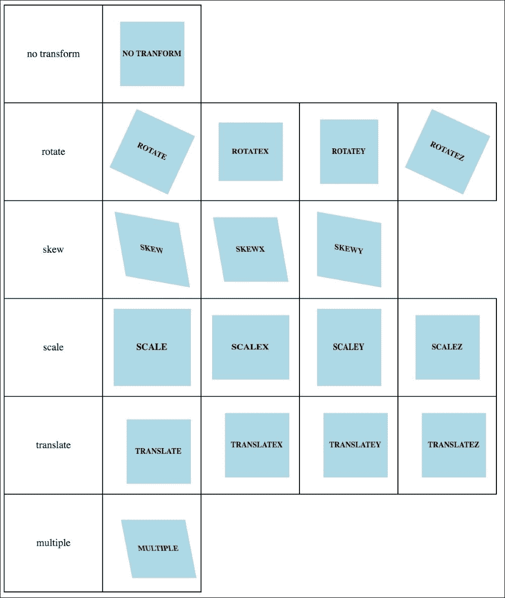

在前面的示例中，浏览器的示例视图中有一堆可能的转换。在第一行，可以看到没有任何变换的元素。在接下来的每一行中，您可以检查以下内容:

*   **旋转**
*   **歪斜**
*   **刻度**
*   **平移**
*   **倍数**

变换的重要方面是可以在每种变换类型中使用的单位:

*   `rotate`:度，例如`rotate(20deg, 40deg).`
*   `skew`:度，例如`skew(30deg, 50deg).`
*   `scale`:数字，其中 1 = 100%，例如`scale(1.5, 1.5).`
*   `translate`:与宽度相关的单位，比如像素百分比，例如`translate(50%, 50%)`。重要信息:百分比与变换对象的尺寸有关。

在前一张截图的最后一行，有一个示例展示了如何将转换链接在一行中。当您需要追加多个转换时，可以使用此示例。

# 总结

在本章中，您了解了现代 CSS 的主要特性。您学习了 flexbox 的工作原理以及如何在项目中使用它。您分析了可以在项目中使用的二维变换。这一章是对新的 CSS 特性的介绍，将帮助你理解各种可能性。

在下一章中，我们将关注渐变、阴影和动画。我们将创建一个线性和径向的渐变框和文本阴影，并获得关于`calc`函数的知识。