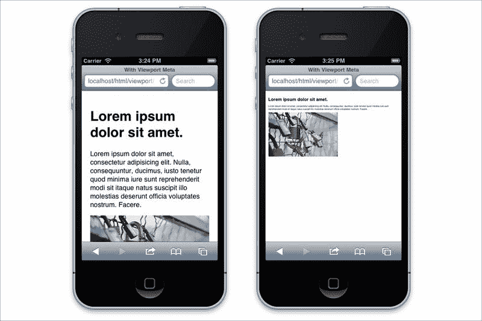
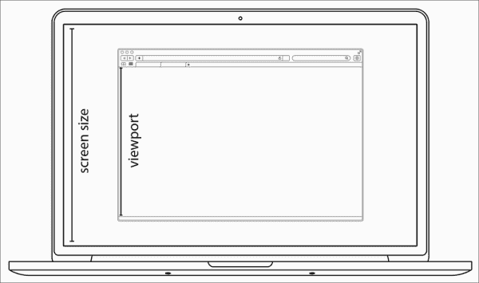
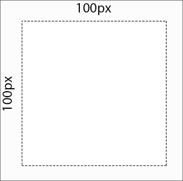
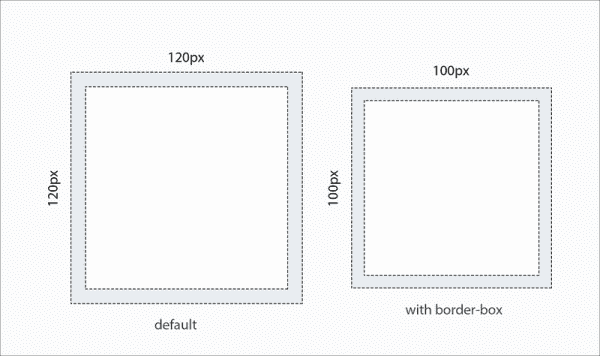

# 一、响应式网页设计

*我还记得，当我还是个孩子的时候，一部手机只有很小的单色屏幕。 那时我们能做的就是打电话，发短信，玩一个简单的游戏。 今天，移动设备在许多方面都取得了巨大的进步。*

*新的移动设备拥有不同的屏幕尺寸; 有些甚至带有更高的 DPI 或分辨率。 现在大多数新的移动设备都配备了触摸屏，让我们可以通过点击或滑动手指方便地与设备交互。 屏幕方向可以在纵向和横向之间切换。 与旧设备相比，该软件的功能也更强。 特别是移动浏览器，现在能够呈现和显示网页，与桌面电脑的浏览器一样好。*

*此外，手机用户的数量在过去几年里呈爆炸式增长。 我们现在可以看到很多人花费无数的时间面对他们的移动设备，手机，或平板电脑，做一些事情，如运行他们的业务或简单的互联网浏览。 在未来几年里，移动用户的数量很可能会增长，甚至可能超过桌面用户的总数。*

*也就是说，手机改变了网络，改变了人们使用互联网和享受网站的方式。 移动设备的这些进步和移动互联网使用的不断增加，促使人们对建立可访问且能在不同环境下良好运行的网站的新模式提出了疑问。 这就是**响应式网页设计**的作用所在。*

在本章中，我们将涵盖以下主题:

*   浏览响应式网页设计、视口元标签和 CSS3 媒体查询的基础知识
*   在接下来的章节中，我们将使用响应式框架来构建响应式网站

# 响应式网页设计

响应式网页设计是网页设计和开发社区中讨论最多的话题之一。 所以，我相信你们很多人在一定程度上听说过它。

Ethan Marcotte 是创造了“响应式网页设计”这一术语的人。 他建议在他的文章中*响应网页设计*([http://alistapart.com/article/responsive-web-design/),网络应该无缝地调整和适应环境,用户浏览网站,而不是解决它专门为特定平台。 换句话说，网站应该是响应性的，它应该是在任何屏幕尺寸，无论它是在哪个平台上浏览。](http://alistapart.com/article/responsive-web-design/)

以 Time 网站([http://time.com/](http://time.com/))为例。 这个网页很适合大屏幕的桌面浏览器，也适合可视区域有限的移动浏览器。 布局会随着视口大小的改变而改变。 如下截图所示，在移动浏览器中，标题的背景颜色为深灰色，图像按比例缩小，点击栏出现在 Time 隐藏最新新闻、杂志和视频部分的地方:


建立响应式网站有两个组件，即**视口元标签**和**媒体****查询**。

## 视口元标签

在 iPhone 等智能手机成为主流之前，每个网站的宽度都在 1000px 左右或者 980 px 左右，并且被放大以适应手机屏幕，最终导致网站无法阅读。 因此，创建了`<meta name="viewport">`。

简而言之，viewport`meta`标签用于定义网页规模及其在浏览器中的可见区域(viewport)。 下面的代码是一个 viewport 元标签的例子:

```html
<meta name="viewport" content="width=device-width, initial-scale=1">
```

前面的视口`meta`标签规范定义了跟随设备的网页视口宽度。 它还定义了第一次打开网页时的网页比例为 1:1，在某种程度上，网页内容的大小和尺寸应该是持久的; 它们不应该被放大或缩小。

为了理解 viewport 元标签对网页布局的影响，我创建了两个网页进行比较; 一个添加了视口元标签，另一个没有。 你可以从下面的截图中看到区别:



上图中显示的第一个网站使用了与前面代码示例中完全相同的规范，并带有视口元标签。 正如我们指定的`width=device-width`，浏览器承认网站视口与设备屏幕大小相同，因此它不会挤压网页以适应整个屏幕。 标题和段落将保持原来的大小。

在第二个网站的例子中，由于我们没有添加视口`meta`标签，浏览器认为该网页应该全部显示。 因此，浏览器迫使整个网站缩小，以适应整个屏幕区域，使标题和文本完全无法阅读。

### 一个字在屏幕大小和视口

你可能在许多网页设计论坛或博客上发现，视口和屏幕大小经常互换。 但事实上，它们是两种不同的东西。

屏幕大小为设备实际的屏幕大小。 例如，一个 13 英寸的笔记本电脑通常有 1280*800 像素的屏幕。 视窗，另一方面，描述了浏览器中显示网站的可视区域。 下图说明了这一点:



## 媒体查询

CSS 中的媒体类型模块使我们能够针对特定的媒体设置样式规则。 如果您以前创建过打印样式表，那么您肯定熟悉媒体类型的概念。 CSS3 引入了一种新的媒体类型，称为媒体查询，它允许我们在 viewport 宽度的指定范围内应用样式，也称为断点。

下面是一个简单的例子; 当网站的视口大小为`480px`或更低时，我们将网站的`p`字体大小从`16px`减小到`14px`。

```html
p { 
font-size: 16px;
}
@media screen and (max-width: 480px) {
p {
    font-size: 14px;
}
} 
```

下面的图表说明了上述代码:


我们还可以使用`and`操作符组合多个视口宽度范围。 按照前面的例子，当视口大小在`480px`和`320px`之间时，我们可以按照以下方式将`p`字体大小设置为`14px`:

```html
@media screen and (min-width: 320px) and (max-width: 480px) {
p {
font-size: 11px;
  }
}
```

### 注意事项

**视口和媒体查询**

我们将处理窗口meta 标签和媒体在构建响应查询网站[模块 2](part0087.html#2IV0U1-db71610abfe249d1a7f65c5cb7ebb0eb "Part 2. Module 2"),*响应网页设计与 HTML5 和 CSS3*,覆盖这两个在更多的细节。

# 响应式框架

建立一个响应式网站是一项非常繁琐的工作。 当构建响应式网站时，有许多度量方法需要考虑，其中之一就是创建响应式网格。

网格帮助我们建立正确对齐的网站。 如果你用过 960。 gs (http://960.gs/),这是一个流行的 CSS 框架,你就会经历是多么容易组织 web 页面布局通过添加预设课程,如`grid_1`或`push_1`,在元素。

然而,960 年。 gs 网格设置在一个固定的单元，即像素(`px`)，这在创建响应式网站时是不适用的。 我们需要一个框架与网格设置百分比(`%`)单位，以建立响应性网站; 我们需要一个响应性框架。

响应式框架提供了构建响应式网站的构件。 一般来说，它包括用于组装响应式网格的类、用于排版和表单输入的基本样式，以及一些用于解决各种浏览器问题的样式。 一些框架甚至更进一步，使用一系列样式来创建通用的设计模式和 web 用户界面，如按钮、导航栏和图像滑块。 这些预定义的样式允许我们开发响应性网站更快，更少的麻烦。 下面是一些其他的原因，为什么使用响应式框架是建立响应式网站的一个良好的选择:

*   **浏览器兼容性**:保证网页在不同浏览器上的一致性是非常痛苦的，比开发网站本身更痛苦。 然而，使用一个框架，我们可以最小化解决浏览器兼容性问题的工作。 在公开发布之前，框架开发人员很可能已经在各种桌面浏览器和移动浏览器上测试了该框架，并使用了最受限制的环境。
*   **文档**:一般来说，框架还提供了全面的文档，这些文档记录了使用框架的各个部分。 文档将非常有助于入门用户开始研究框架。 当我们和一个团队一起工作时，这也是一个很大的优势。 我们可以参考文档，使每个人都在同一页上，并遵循编写规范的标准代码。
*   **社区和扩展**:一些流行的框架(如 Bootstrap 和 Foundation)有一个活跃的社区，帮助解决框架中的 bug 并扩展功能。 在这种情况下，jQuery UI Bootstrap([http://jquery-ui-bootstrap.github.io/jquery-ui-bootstrap/](http://jquery-ui-bootstrap.github.io/jquery-ui-bootstrap/))可能是一个的好例子。 jQuery UI Bootstrap 是一个 jQuery UI 小部件的风格集合，以匹配 Bootstrap 的原始主题的感觉和外观。 现在很容易找到基于这些框架的免费 WordPress 和 Joomla 主题。

通过本模块的课程，我们将通过使用三个不同的响应框架，即响应式框架来构建三个响应式网站。 gs、Bootstrap 和 Foundation。

## 有求必应。 gs 框架

响应。 gs([http://responsive.gs/](http://responsive.gs/))是一个轻量级的响应式框架，它在压缩时只有 1kb 大小。 响应。 gs 是基于 940 像素的宽度，并在三个栅格变体，即 12、16 和 24 列。 更重要的是,响应。 gs 与 box-sizing polyfill 一起提供，它在 Internet Explorer 6、7 和 8 中支持CSS3 box-sizing，并使其在这些浏览器中具有良好的外观。

### 注意事项

Polyfill 是一段代码，它支持某些 web 特性和功能，而这些特性和功能并不是浏览器自带的。 通常，它针对的是旧版本的 Internet Explorer。 例如,可以使用 HTML5Shiv([https://github.com/aFarkas/html5shiv)新的 HTML5 元素,如`<header>`、`<footer>`,`<nav>`,是公认的在 Internet Explorer 6 中,7 和 8。](https://github.com/aFarkas/html5shiv)

### 一个关于 CSS 字框的模型

HTML 元素被归类为块级元素，它们本质上是通过 CSS 用内容的宽度、高度、边距、填充和边框绘制的框。 在 CSS3 之前，我们在指定框时面临约束。 例如，当我们指定一个宽度和高度为`100px`的`<div>`标签时，如下所示:

```html
div { 
  width: 100px;
  height: 100px;
}
```

浏览器将`div`渲染为`100px`方框，如下图所示:



然而，这只会在填充和边框没有被添加进去的情况下才为真。 因为一个盒子有四条边，一个 10px(`padding: 10px;`)的填充实际上会增加 20px 的宽度和高度，每边 10px，如下图所示:


当它占用页面空间时，元素的页边距空间被保留在元素外部，而不是作为元素本身的部分; 因此，如果我们给一个元素一个背景色，那么边缘区域将不会使用这个颜色。

### CSS3 盒装尺寸

CSS3 引入了一个名为`box-sizing`的新属性，它允许我们指定浏览器应该如何计算CSS 框模型。 我们可以在`box-sizing`属性中应用几个值。

<colgroup class="calibre17"><col class="calibre18"> <col class="calibre18"></colgroup> 
| 

价值

 | 

描述

 |
| --- | --- |
| `content-box` | 这是框模型的默认值。 这个值指定 padding 和 border-box 在指定内容宽度和高度之外的厚度，就像我们在前一节中演示的那样。 |
| `border-box` | 该值将执行与内容框相反的操作; 它包括填充和边框框作为框的宽度和高度。 |
| `padding-box` | 在编写这个模块时，这个值是实验性的，最近才添加。 这个值指定框的尺寸。 |

在本模块中的每个项目中，我们将使用`border-box`值，以便我们可以轻松地确定网站的方框尺寸。 让我们以前面的例子来理解这一点，但这次我们将把`box-sizing`模型设置为`border-box`。 如上表所述，`border-box`值将保留框的宽度和高度为`100px`，而不考虑填充和边框的增加。 下图显示了两个不同值`content-box`(默认值)和`border-box`的输出之间的比较:



在本模块中，我们将使用响应式。 g，并在接下来的两章中探索更多，以构建一个简单的响应式博客。

## Bootstrap 框架

Bootstrap([http://getbootstrap.com/](http://getbootstrap.com/))最初由 Mark Otto([http://markdotto.com/](http://markdotto.com/))构建，最初只打算用于 Twitter 的内部使用。 简而言之，Bootstrap 随后向公众免费推出。

### 注意事项

Bootstrap 一直与 Twitter 联系在一起，但由于作者已经离开 Twitter, Bootstrap 本身的增长超出了他的预期，Bootstrap 现在拥有了自己的品牌[http://blog.getbootstrap.com/2012/09/29/onward/](http://blog.getbootstrap.com/2012/09/29/onward/)。

如果您参考最初的开发，那么响应特性还没有添加。 由于创建响应式网站的需求日益增长，它随后被添加到版本 2 中。

与 responveg .gs 相比，Bootstrap 还提供了更多的新增功能。 它包含了预设的用户界面样式，其中包括网站上常用的用户界面，如按钮、导航条、分页和表单，所以当开始一个新项目时，你不必从头开始创建它们。 除此之外，Bootstrap 还提供了一些自定义 jQuery 插件，如图像滑块、旋转木马、弹出窗口和模态框。

您可以通过多种方式使用和自定义 Bootstrap。 你可以直接定制引导主题及其组件直接通过 CSS 样式表,引导定制和下载页面(http://getbootstrap.com/customize/),或引导少变量和 mixin,用于生成样式表。

在这个模块中,我们将进入引导在[第五章](5.html#1AT9A2-db71610abfe249d1a7f65c5cb7ebb0eb "Chapter 5. Developing a Portfolio Website with Bootstrap"),*发展与引导的一个投资组合的网站*,[第六章](6.html#1JFUC2-db71610abfe249d1a7f65c5cb7ebb0eb "Chapter 6. Polishing the Responsive Portfolio Website with LESS"),*抛光响应组合网站*,建立响应组合的网站。

## Foundation框架

Foundation([http://foundation.zurb.com/](http://foundation.zurb.com/))是由美国加州设计机构 ZURB 创建的一个框架。 与 Bootstrap 类似，Foundation 不仅仅是一个响应性强的 CSS 框架; 它附带了预置的网格、组件和一些 jQuery 插件来呈现交互特性。

一些知名的品牌，如McAfee([http://www.mcafee.com/common/privacy/english/slide.html](http://www.mcafee.com/common/privacy/english/slide.html))，是计算机防病毒领域最受尊敬的品牌之一，他们已经使用 Foundation 建立了自己的网站。

Foundation 样式表由 Sass(一种基于 ruby 的 CSS 预处理程序)提供支持。 我们将在本模块的最后两章中更多地讨论 Sass 以及 Foundation 特性; 其中，我们将开发一个响应网站的创业公司。

### 提示

很多人抱怨响应式框架中的代码太过了; 作为一个框架，如 Bootstrap 被广泛使用，它必须覆盖每一个设计场景，因此，它带有一些额外的风格，你可能不需要你的网站。 幸运的是，我们可以通过使用正确的工具(如 CSS 预处理程序)和遵循适当的工作流轻松地减少这个问题。

坦率地说，没有完美的解决方案; 当然，使用框架并不适合所有人。 这一切都归结于你的需求，你的网站的需求，特别是你的客户的需求和预算。 实际上，您必须权衡这些因素以决定是否使用响应式框架。 Jem Kremer 在她的文章*响应式设计框架:仅仅因为你可以，你应该?* ([http://www.smashingmagazine.com/2014/02/19/responsive-design-frameworks-just-because-you-can-should-you/](http://www.smashingmagazine.com/2014/02/19/responsive-design-frameworks-just-because-you-can-should-you/))

## CSS 预处理器简介

Bootstrap和 Foundation 都使用 CSS 预处理程序来生成它们的样式表。 Bootstrap 使用LESS([http://lesscss.org/](http://lesscss.org/))-尽管对 Sass 的官方支持最近刚刚发布。 相反，Foundation 使用Sass 作为生成样式表的唯一方法([http://sass-lang.com/](http://sass-lang.com/))。

CSS 预处理器并不是一门全新的语言。 如果你已经知道 CSS，你应该立即习惯 CSS 预处理器。 CSS 预处理器通过允许使用诸如变量、函数和操作等编程特性来扩展 CSS。

下面是一个使用 LESS 语法编写 CSS 的例子:

```html
@color: #f3f3f3;

body {
  background-color: @color;
}
p {
  color: darken(@color, 50%);
}
```

当前面的代码编译时，它接受我们定义的`@color`变量，并将其值放入输出，如下所示:

```html
body {
  background-color: #f3f3f3;
}
p {
  color: #737373;
}
```

该变量在整个样式表中是可重用的，这使我们能够保持样式一致性，并使样式表更易于维护。

我们要使用和探索 CSS 预处理器,少,Sass 进一步构建响应过程中网站的引导([第五章](5.html#1AT9A2-db71610abfe249d1a7f65c5cb7ebb0eb "Chapter 5. Developing a Portfolio Website with Bootstrap"),*发展与引导的一个投资组合的网站*和[第六章](6.html#1JFUC2-db71610abfe249d1a7f65c5cb7ebb0eb "Chapter 6. Polishing the Responsive Portfolio Website with LESS"),*抛光组合网站少【显示】)和基础([第七章](7.html#1T1401-db71610abfe249d1a7f65c5cb7ebb0eb "Chapter 7. A Responsive Website for Business with Foundation"), *一个有Foundation的企业响应式网站*，[第八章](8.html#23MNU2-db71610abfe249d1a7f65c5cb7ebb0eb "Chapter 8. Extending Foundation")，*扩展Foundation*。*

## 拥有一个英雄-深入研究响应式网页设计

我们在这里讨论的响应式网页设计，虽然很重要，但仅仅是冰山一角。 关于响应式网页设计的内容比我们在前几节中介绍的要多得多。 我建议你花点时间去了解和消除任何关于响应式网页设计的顾虑，包括概念、技术和一些限制。

以下是一些可供参考的最佳建议:

*   Ethan marcotte 的*响应式网页设计*文章([http://alistapart.com/article/responsive-web-design](http://alistapart.com/article/responsive-web-design))就是这一切的起点
*   另一个很好的起点是 Rachel Shillcock 的*响应式网页设计*([http://webdesign.tutsplus.com/articles/responsive-web-design--webdesign-15155](http://webdesign.tutsplus.com/articles/responsive-web-design--webdesign-15155))
*   *不要忘记 Viewport Meta 标签*by Ian Yates([http://webdesign.tutsplus.com/articles/quick-tip-dont-forget-the-viewport-meta-tag--webdesign-5972](http://webdesign.tutsplus.com/articles/quick-tip-dont-forget-the-viewport-meta-tag--webdesign-5972))
*   *如何使用 CSS3 媒体查询创建一个移动版网站*的雷切尔·安德鲁(http://www.smashingmagazine.com/2010/07/19/how-to-use-css3-media-queries-to-create-a-mobile-version-of-your-website/)
*   读关于未来的响应图像使用 HTML5 标准图片元素*响应图像做对的:<图【T5 指南】srcset 由埃里克·波蒂斯所写的*([http://www.smashingmagazine.com/2014/05/14/responsive-images-done-right-guide-picture-srcset/](http://www.smashingmagazine.com/2014/05/14/responsive-images-done-right-guide-picture-srcset/))
*   使数据表响应([http://css-tricks.com/responsive-data-table-roundup/](http://css-tricks.com/responsive-data-table-roundup/))的方法综述

## Pop Quiz -响应式网页设计的主要组件

Q1。 在 Ethan Marcotte 的文章中，我们已经在这一章中提到了两次，他提到了创建响应式网站的主要技术成分。 这些主要组成部分是什么?

1.  Viewport Meta 标签和 CSS3 媒体查询。
2.  流体网格、灵活的图像和媒体查询。
3.  响应图像、断点和填充。

Q2。 什么是视口?

1.  设备的屏幕大小。
2.  呈现网页的区域。
3.  用于设置网页视口大小的元标记。

第三季。 其中哪一个是声明 CSS3 媒体查询的正确方法?

1.  `@media (max-width: 320px) { p{ font-size:11px; }}`
2.  `@media screen and (max-device-ratio: 320px) { div{ color:white; }}`
3.  `<link rel="stylesheet" media="(max-width: 320px)" href="core.css" />`

# 响应式网页设计灵感来源

现在，在我们进入下一章并开始建立响应式网站之前，花一些时间寻找响应式网站的想法和灵感可能是一个好主意; 看看它们是如何构建的，以及在桌面浏览器和移动浏览器上布局是如何组织的。

网站经常需要重新设计以保持新鲜感。 因此，与其制作一堆网站截图，这可能在接下来的几个月里因为重新设计而不再相关，我们最好直接去管理网站的网站，以下是的地方:

*   MediaQueries([http://mediaqueri.es/](http://mediaqueri.es/))
*   [http://www.awwwards.com/websites/responsive-design/](http://www.awwwards.com/websites/responsive-design/)
*   CSS奖项([http://www.cssawards.net/structure/responsive/](http://www.cssawards.net/structure/responsive/))
*   WebDesignServed([http://www.webdesignserved.com/](http://www.webdesignserved.com/))
*   BootstrapExpo([http://expo.getbootstrap.com/](http://expo.getbootstrap.com/))
*   Zurb响应式([http://zurb.com/responsive](http://zurb.com/responsive))

# 总结

在这一章,我们看在短【T3 背后的故事】响应 web 设计以及视窗 meta 标签和 CSS3 媒体查询,这制定响应网站。 本章还总结了我们将使用以下框架来完成三个项目:响应式。 gs、Bootstrap 和 Foundation。

使用一个框架是一种更容易和更快的方法来让响应性网站建立和运行，而不是从头开始构建所有东西。 唉，正如前面提到的，使用框架也有一些负面的方面。 如果做得不好，最终结果可能全是错的。 网站可能会塞满不必要的样式和 JavaScript，最终导致网站加载缓慢，难以维护。

我们需要建立正确的工具; 他们不仅会促进项目，而且还会帮助我们使网站更容易维护，这是我们在下一章要做的。