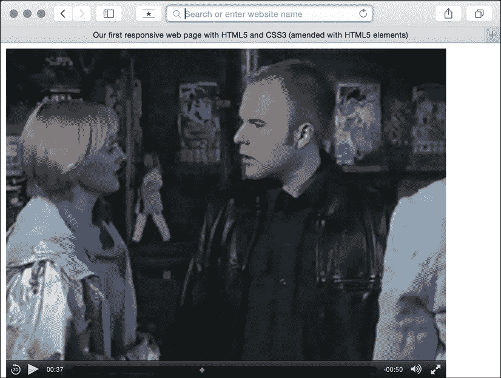
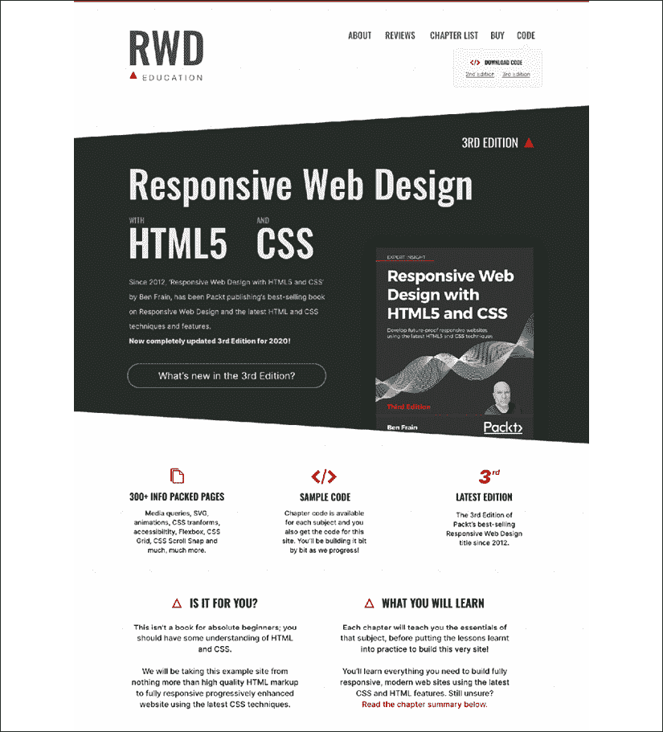

# 二、编写 HTML 标记

HTML 代表超文本标记语言。 它是一种语言，允许内容以一种更容易被技术理解的方式进行标记，然后再被人类理解。

你可以在没有 CSS 或 JavaScript 的情况下在 web 上创建内容。 但是没有 HTML 就不能有内容。

这是一个常见的误解，认为 HTML 是编写网页和应用程序最容易的部分。 编写 HTML 常常被认为是任何人都可以轻松完成的事情，因而被忽略不计。 我的经验告诉我 HTML 很容易出错。

还要考虑到，对于那些没有视力或视力受损的用户来说，编写 HTML 的方式可以将内容从混乱的、无法使用的混乱变成有意义的、有用的和令人愉快的体验。 由于其他原因而依赖辅助技术的视力正常的用户也可以更容易地欣赏网页，如果他们被正确标记的话。

编写高质量的 HTML 并不是响应式网页设计的特定需求。 这比那重要得多。 这是一个先决条件，你想让所有的网络用户都能访问。

因此，本章将讨论 HTML 标记的编写。 我们将考虑 HTML 的词汇表、语义，或者更简洁地说，我们可以使用 HTML 的元素来描述标记中的内容的方式。

HTML 被认为是一种生活标准。 几年前，最新版本通常被称为 HTML5，这是一个帮助识别现代 web 技术和方法的流行词。 这就是为什么这本书被命名为“响应式 Web 设计与 HTML5 和 CSS”而不是简单的“响应式 Web 设计与 HTML 和 CSS”。 回到 2012 年，你可以通过使用 HTML5 和 CSS3 更容易地强调你的技术是现代的。 当我在 2020 年写这篇文章时，这种区别就不那么重要了。 阅读生活水平，请点击:[http://www.w3.org/TR/html5/](http://www.w3.org/TR/html5/)。

本章的主题包括:

*   正确启动 HTML 页面
*   HTML5 标记的宽容性
*   分割、分组和文本级元素
*   使用 HTML 元素
*   WCAG 可访问性一致性和 WAI-ARIA 用于更可访问的 web 应用程序
*   嵌入的媒体
*   响应视频和 iframes

HTML 还提供了处理表单和用户输入的特定工具。 这组特性大大减轻了 JavaScript 等对资源要求较高的技术(如表单验证)的负担。 然而，我们将在*第 10 章*，*中分别讨论 HTML 表单的 HTML5 和 CSS*征服表单。

HTML 页面的基本结构是这样的:

```html
<!DOCTYPE html>
<html lang="en">
<head>
    <meta charset="utf-8" />
    <title>Web Page Structure</title>
</head>
<body></body>
</html> 
```

在编写 HTML 时，通常要在一系列标记或元素中“标记”或编写内容。 HTML 中的大多数元素都有一个开始和结束标记。 一些，像前面的元例子，是无效的，因此是“自关闭的”。

只有有限数量的自闭或空元素，定义在这里:[https://html.spec.whatwg.org/multipage/syntax.html#void-elements](https://html.spec.whatwg.org/multipage/syntax.html#void-elements)。

它们被称为空元素，因为它们没有内容。 目前空白标签`area`,`base`,`br`,`col`,`embed`,`hr`,`img`,`input`、【显示】,`meta`,`param`,`source`,【病人】和`wbr`。

为了说明 HTML 标记的开始和结束特性，最合适的方法是在一段文本的开头加上`<p>`，在末尾加上`</p>`。 注意结束标记上的正斜杠，因为这是开始标记和结束标记之间的区别。

虽然我们将要讨论`head`部分，即开始`<head>`和结束`</head>`标记之间的内容，但是要注意，大部分 HTML 编写工作是在`body`部分完成的。

# 正确地开始 HTML 页面

我们将从起点开始，这似乎是一个合理的起点。 让我们考虑 HTML 页面的开头元素，并确保完全理解所有重要的组件部分。

就像 web 上的许多事情一样，记住`head`部分中每个内容的确切语法并不是特别重要。 然而，理解每一样东西的用途是很重要的。 我通常每次都复制粘贴开始代码，或者将其保存在一个文本片段中，我建议您也这样做。

HTML 页面的前几行应该看起来像这样:

```html
<!DOCTYPE html>
<html lang="en">
<head>
    <meta charset="utf-8" /> 
```

## doctype

那么，这里有什么? 首先，我们用 HTML5 的 Doctype 声明打开我们的文档:

```html
<!DOCTYPE html> 
```

如果你喜欢小写字母，那么`<!doctype html>`同样不错。 没什么区别。

## html 标记和 lang 属性

在Doctype 声明之后，我们打开`html`标签; 我们文档的第一个也是根标记。 我们还使用`lang`属性来指定文档的语言，然后打开`<head>`部分:

```html
<html lang="en">
<head> 
```

**指定替换语言**

根据 W3C 规范([http://www.w3.org/TR/html5/dom.html the-lang-and-xml: lang 属性](http://www.w3.org/TR/html5/dom.html#the-lang-and-xml:lang-attributes)),`lang`属性指定的主要语言元素的内容和对任何包含文本的元素的属性。 您可以想象这对于屏幕阅读器等辅助技术是多么有用。 如果你不是用英语写页面，你最好指定正确的语言代码。 例如，对于日语，HTML 标记是`<html lang="ja">`。

要获得完整的语言列表，请查看[http://www.iana.org/assignments/language-subtag-registry](http://www.iana.org/assignments/language-subtag-registry)。

## 字符编码

最后，我们指定字符编码，用简单的术语告诉浏览器如何解析其中包含的信息。 因为`meta`标签是一个空元素，所以它不需要关闭标签:

```html
<meta charset="utf-8" /> 
```

除非有充分的理由指定，否则字符集的值总是`utf-8`。

# HTML5 标记的宽容性

如果您对如何编写 HTML 标记非常认真，通常会在大多数情况下使用小写，将属性值用直引号括起来(不是花括号!)，并为链接的脚本和样式表声明一种类型。 例如，也许你链接到一个像这样的样式表:

```html
<link href="CSS/main.css" rel="stylesheet" type="text/css" /> 
```

事实上，HTML5 并不需要这么精确。 它也很高兴看到这个:

```html
<link href=CSS/main.css rel=stylesheet > 
```

你注意到了吗? 标记的末尾没有正斜杠，属性值周围没有引号，也没有类型声明。 然而，容易上手的 HTML5 却不在乎这些。 第二个例子和第一个例子一样有效。

这种更宽松的语法适用于整个文档，而不仅仅是链接的资产。 例如，像这样指定一个`div`，如果你喜欢:

```html
<div id=wrapper> 
```

这是非常有效的 HTML5。 这同样适用于插入图像:

```html
 
```

这也是有效的 HTML5。 没有结束标记/斜杠，没有引号(尽管如果值中有空格，仍然需要引号)，大小写字符混合使用。 您甚至可以省略一些东西，比如开始的`<head>`标记，页面仍然有效!

想要一个通往优秀 HTML5 代码的快捷方式? 考虑 HTML5 样板([http://html5boilerplate.com/](http://html5boilerplate.com/))。 这是一个预先制作的最佳实践 HTML5 文件。 您还可以自定义构建模板以匹配您的特定需求。

## HTML 标记的一种合理方法

就我个人而言，我喜欢非常严格地编写标记。 这意味着关闭标记，引用属性值，并坚持一致的字母大小写。 有人可能会说，抛弃这些实践可以节省一些字节的数据，但这正是工具的作用(如果需要，任何不必要的字符/数据都可以删除)。 我希望我的标记尽可能清晰，我鼓励其他人也这样做。 我的观点是，编写代码时，清晰应该胜过简洁。

因此，在编写 HTML 文档时，我认为你可以编写干净、清晰的代码，同时还能享受 HTML5 带来的经济效益。 为了举例说明，对于 CSS 链接，我将使用以下方法:

```html
<link href="CSS/main.css" rel="stylesheet" /> 
```

我在元素的末尾保留了正斜杠和引号，但是省略了`type`属性。 这里要说明的是，你可以找到一个让自己满意的水平。 HTML5 不会对你大吼大叫，不会在类面前标记你的标记，不会因为你没有验证而让你站在角落里。 无论您想如何编写标记都可以。 不，我在开玩笑，我不能让它走-我想让你知道，如果你写你的代码没有引用属性值和关闭你的标签，我将默默地评判你!

尽管 HTML5 的语法比较松散，但检查标记是否有效总是值得的。 检查标记的有效性可以捕获基本的人为错误，比如缺少或不匹配的标记、图像上缺少`alt`属性、不正确嵌套的元素等等。 创建 W3C 验证器的原因就是:[http://validator.w3.org/](http://validator.w3.org/)。

我已经受够了斥责那些靠偷懒赚钱的作家。 让我们看看 HTML5 的更多好处。

## 向强大的

`<a>`标记可以说是HTML 中最重要和最具定义性的标记。 锚标记是一种标记，用于将用户所浏览的文档链接到 internet 上其他地方的另一个文档，或同一文档中的另一个点。

您可以在这里阅读`<a>`元件的规范:[https://www.w3.org/TR/html52/textlevel-semantics.html#the-a-element](https://www.w3.org/TR/html52/textlevel-semantics.html#the-a-element)。

HTML5 的一个好处是我们可以将多个元素包装在一个`<a>`标签中。 以前，如果您想验证标记，就必须将每个元素包装在自己的`<a>`标记中。 例如，看看下面的代码:

```html
<h2><a href="index.html">The home page</a></h2>
<p><a href="index.html">This paragraph also links to the home page</a></p>
<a href="index.html"></a> 
```

现在，我们可以抛弃所有单独的`<a>`标签，取而代之的是包装组，如下代码所示:

```html
<a href="index.html">
  <h2>The home page</h2>
  <p>This paragraph also links to the home page</p>
  
</a> 
```

唯一的限制要记住`<a>`标签,可以理解的是,你不能用一个`<a>`标签内另一个`<a>`标签或其他互动元素(如`button`),你不能包装在一个`<a>`标签。

这并不是说你的身体做不到。 我怀疑您的文本编辑器是否会为此与您争吵，但如果您这样做了，那么在浏览器中没有按照预期工作也不要感到惊讶!

# HTML5 中的新语义元素

我的字典把语义学定义为“语言学和逻辑学中与意义有关的分支。” 就我们的目的而言，语义是赋予标记意义的过程。 为什么这很重要?

大多数网站遵循相当标准的结构约定; 典型的区域包括页眉、页脚、边栏、导航栏等等。 作为 web 作者，我们通常会命名`div`元素，以便更清楚地指定这些区域(例如`<div class="Header">`)。 然而，就代码本身而言，任何用户代理(包括 web 浏览器、屏幕阅读器或搜索引擎爬虫)解析该内容都不能确定每个`div`元素的目的是什么。 HTML5 用新的语义元素解决了这个问题。

对于 HTML5 元素的完整列表，让你自己(非常)舒服地将你的浏览器指向这里:[http://www.w3.org/TR/html5/semantics.html#semantics](http://www.w3.org/TR/html5/semantics.html#semantics)。

我们不会在这里涵盖所有的新元素，仅仅是那些我认为在日常的响应式网页设计中最有益或最有趣的元素。 在了解了这些元素并了解了它们的预期用途之后，我们将查看一些内容示例，并考虑如何最好地标记它们。 然后，为了结束这一章，我将给你一个更大的挑战!

就 HTML 规范而言，我们将看到的元素分为三组:

*   section元素，以获得 HTML 页面中最宽的笔画。 这些是用于页眉、页脚和侧边栏区域的元素。
*   对用于包装相关元素的元素进行分组。 想想段落、段落引言和这类内容。
*   文本级语义，这是我们用来指定细节的元素，比如一段粗体或斜体文本或代码。

现在，我们将依次查看这些部分中最有用的部分。

## 

<main>元素</main>

很长一段时间以来，HTML5 都没有划分页面主要内容的元素。 有人认为不属于其他新语义 HTML5 元素的内容将被否定为主要内容。 幸运的是，我们现在有了一种更声明性的方法来对主要内容进行分组:命名恰当的`<main>`标记。 无论您是包装页面的主要内容还是基于 web 的应用程序的主要部分，都应该使用`main`元素将其全部分组。 下面是该规范中特别有用的一行:

> 文档的主要内容区域包括的内容是独一无二的,文档和排除内容重复跨一组文件,如网站导航链接、版权信息、网站标志和标语和搜索表单(除非该文件或应用程序的主要功能是一个搜索表单)。

值得注意的,不应该超过一个`main`在每一页(毕竟,你不能有两个主要的内容),它不应该被用作派生的其他语义 HTML5 元素的子元素,如`article`、`aside`,`header`,`footer`,`nav`或`header`。

阅读[http://www.w3.org/TR/html5/grouping-content.html#the-main-element](http://www.w3.org/TR/html5/grouping-content.html#the-main-element)中`main`元素的官方线。

## 

<section>元素</section>

元素的作用是:定义文档或应用程序的通用部分。 例如，您可以选择围绕您的内容创建部分:一个部分用于联系信息，另一个部分用于新闻提要，以及等等。 重要的是要理解，它不是用于样式化目的。

如果您需要包装一个元素只是为了样式化它，那么您应该像以前一样继续使用`div`。

在处理基于 web 的应用程序时，我倾向于使用`section`作为可视化组件的包装元素。 它提供了一种简单的方法来查看标记中组件的开始和结束。

您还可以通过来判断您是否应该使用`section`，这取决于您要分段的内容是否包含一个自然的标题(例如，`h1`-`h6`)。 如果没有，你最好选择`div`。

要找出W3C 规范中关于`<section>`的内容，请转到以下 URL:[http://www.w3.org/TR/html5/sections.html#the-section-element](http://www.w3.org/TR/html5/sections.html#the-section-element)。

## 

<nav>元素</nav>

元素`<nav>`用于将主要的导航链接包装到同一页面中的其他页面或部分。 因为它是用于主要的导航块，它并不是严格地用于页脚(尽管它可以)和类似的地方，那里的链接组到其他页面是常见的。 如果通常使用无序列表(`<ul>`)和一组列表标记(`<li>`)来标记导航元素，那么最好使用`nav`和许多嵌套的`<a>`标记。

要找出W3C 规范中关于`<nav>`的内容，请转到以下 URL:[http://www.w3.org/TR/html5/sections.html#the-nav-element](http://www.w3.org/TR/html5/sections.html#the-nav-element)。

## 

<article>元素</article>

`<article>`元素和`<section>`元素很容易导致混淆。 我当然必须阅读，并重新阅读每一个规格之前，它沉没。 这里我重申一下规范。 元素`<article>`是，用于包装一个独立的内容块。 在构建一个页面时，询问您打算在`<article>`标记中使用的内容是否可以作为一个整体粘贴到另一个站点上，并且仍然完全有意义。 另一种考虑方法是，您正在考虑包装在`<article>`中的内容实际上会在 RSS 提要中构成一篇单独的文章吗? 应该使用`<article>`元素包装的内容的明显例子是博客文章或新闻故事。 注意，如果要嵌套`<article>`元素，则假定嵌套的`<article>`元素主要是与外层的相关。

您可以在这里阅读`<article>`元件的规范:[http://www.w3.org/TR/html5/sections.html#the-article-element](http://www.w3.org/TR/html5/sections.html#the-article-element)。

## 

<aside>元素</aside>

元素`<aside>`用于与周围内容切线相关的内容。 在实践中，我经常将它用于边栏或内容，作为关于博客文章中相关主题的小提示。 它也被认为适合于拉报价，广告和导航元素组; 基本上，任何与主要内容不直接相关的内容都可以在`aside`中很好地工作。 如果它是一个电子商务网站，我将考虑“购买了该网站的客户也购买了”这样的区域作为首选`<aside>`。

有关 W3C 规范中关于`<aside>`的内容的更多，请访问[http://www.w3.org/TR/html5/sections.html#the-aside-element](http://www.w3.org/TR/html5/sections.html#the-aside-element)。

## 

<header>元素</header>

实际上，`<header>`可以用于站点标题的“报头”区域，也可以作为对其他内容的介绍，例如元素中的介绍部分。 您可以根据需要在同一页面上多次使用它。 例如，您可以在页面上的每个`<section>`内都有一个`<header>`。

以下是 W3C 规范对`<header>`:[http://www.w3.org/TR/html5/sections.html#the-header-element](http://www.w3.org/TR/html5/sections.html#the-header-element)的描述。

## 

<footer>元素</footer>

与`<header>`一样，`<footer>`元素不参与大纲算法(在下一节中详细介绍)，因此也不参与片段内容。 相反，它应该用于包含关于所在部分的信息。 例如，它可能包含到其他文档或版权信息的链接。 与`<header>`一样，如果需要，它可以在一个页面中多次使用。 例如，它既可以用于博客的页脚，也可以用于博客文章中的页脚`<article>`。

然而，规范注意到博客文章作者的联系信息应该用`<address>`元素包装。

元素`<footer>`的 W3C规范可以在这里找到:[http://www.w3.org/TR/html5/sections.html#the-footer-element](http://www.w3.org/TR/html5/sections.html#the-footer-element)。

## HTML5 大纲算法

通常，对于 HTML 文档，标题将以`h1`作为主页标题，然后继续使用较低层次的标题标记作为子标题等。

然而，HTML5 为每个分段容器引入了拥有自己的自包含大纲的能力。 这意味着，就整个文档而言，不需要考虑您处于哪个级别的标题标记。 您可以只专注于您当前工作的分区容器。

为了说明为什么这可能更可取，在博客中，可以将文章标题设置为使用`<h1>`标记，而博客本身的标题也可以设置为`<h1>`标记。 例如，考虑以下结构:

```html
<h1>Ben's site</h1>
<section>
  <h1>Ben's blog</h1>
  <p>All about what I do</p>
</section>
<article>
  <header>
    <h1>A post about something</h1>
    <p>Trust me this is a great read</p>
    <p>No, not really</p>
    <p>See. Told you.</p>
  </header>
</article> 
```

尽管有多个`<h1>`标题，大纲仍然显示如下:

1.  本的网站
2.  本博客的
3.  关于某事的帖子

因此，理论上您不需要跟踪整个文档中需要使用的标题标记。 它应该是可能的使用任何适当水平的标题标签需要在每一段内容和 HTML5 大纲算法将其排序。

你可以使用以下 url 之一的 HTML5 大纲来测试你的文档大纲:

*   [http://gsnedders.html5.org/outliner/](http://gsnedders.html5.org/outliner/)
*   [http://hoyois.github.com/html5outliner/](http://hoyois.github.com/html5outliner/)

然而，现实情况是，搜索引擎等目前还没有使用 HTML5 大纲。 因此，从实用的角度来看，继续从整个文档的角度考虑标题可能更有意义。 这将使您的文档更容易被搜索引擎阅读，也有助于辅助技术推断正确的含义。

## 关于 h1-h6 元素的注释

我最初没有意识到的一点是，不鼓励使用`h1`-`h6`标签来标记标题和副标题。 我说的是这样的事情:

```html
<h1>Scones:</h1>
<h2>The most resplendent of snacks</h2> 
```

以下是来自 HTML5 规范的引用:

> H1-h6 元素不能用于标记副标题，副标题，替代标题和标语，除非打算作为一个新的章节或小节的标题。

这是我们告诉!

那么，我们应该如何编写这样的内容呢? 该规范实际上有一个完整的部分，[http://www.w3.org/TR/html5/common-idioms.html#common-idioms](http://www.w3.org/TR/html5/common-idioms.html#common-idioms)，专门用于此。 就个人而言，我更喜欢旧的`<hgroup>`元素，但不幸的是，它已经被弃用了(更多信息在*Obsolete HTML 特性*一节中)。 因此，为了遵循规范的建议，我们之前的示例可以重写为:

```html
<h1>Scones:</h1>
<p>The most resplendent of snacks</p> 
```

好的，我们已经讨论了 HTML 分段元素的大部分内容。 现在让我们考虑对元素进行分组。

## div 元素

最常见的分组元素是`<div>`。 `<div>`被如此广泛地使用，因为它是无意见的。 它传达了什么。 `div`的唯一隐含意义是它将某物组合在一起。 尽管如此，您经常会看到一个除了一串文本外什么也没有包装的`div`。

你应该只选择`div`作为最后的手段。 当你想不出更好的方法时，它就是你要使用的元素。

HTML 中的元素比以往任何时候都多，因此在我们继续的过程中，我们希望能够了解更多其他元素，它们将更适合您当前使用`div`进行的工作。

## p 元素

元素用于标记段落。 然而，不要认为这意味着它只能在 3-4 行长的文本中使用。 相反，使用它来标记任何不能用其他元素更好地标记的文本。 对于非特定文本，`p`元素肯定比`div`元素更好。

## 引用的元素

`blockquote`用于标记从其他地方引用的文本。 您不必使用任何其他元素来包装文本，但您可以这样做。 对于这个例子，知道我们现在对`p`标记做了什么，如果愿意，我们也可以在`blockquote`中使用它。 下面是使用`blockquote`的简单示例。 首先，在`p`标签中有一段介绍性的文本，然后是`blockquote`:

```html
<p>I did like Ben's book, but he kept going on about scones. For example:</p>
<blockquote>
All this writing about scones in our sample page and there's no image of the beauties! I'm going to add in an image of a scone near the top of the page; a sort of 'hero' image to entice users to read the page.
</blockquote> 
```

在 HTML 规范中，也有一些关于如何以及何时使用块引号的好例子:[https://html.spec.whatwg.org/multipage/grouping-content.html#the-blockquote-element](https://html.spec.whatwg.org/multipage/grouping-content.html#the-blockquote-element)。

## 

<figure>和

<figcaption>元素</figcaption>

</figure>

HTML规范涉及`<figure>`元素:

> .．. 因此可以用来注释插图、图表、照片、代码列表等。

因此，我们使用it 作为元素来显示任何类型的视觉效果，并且伴随的`<figcaption>`提供了添加一些支持视觉效果的文本的方法。 现在,值得指出的是,虽然我们应该提供文本``的`alt`属性标签支持辅助技术或减轻问题如果一个图片加载失败,它不是一个需求`figcaption`提供一个图。 如果您想在图像旁边添加视觉描述，则添加`figcaption`。 下面是我们如何使用它来修改第一章中的部分标记:

```html
<figure class="MoneyShot">
  
  <figcaption class="ImageCaption">
    This image isn't of scones I have made, instead it's a stock photo from Wikipedia
  </figcaption>
</figure> 
```

可以看到元素用于封装这个小的自包含块。 在内部，`<figcaption>`用于为父元素`<figure>`提供标题。

当图像或代码需要在旁边加上一个小标题时(这不适用于内容的主要文本)，它是完美的。

`figure`元件的规范可以在这里找到:[http://www.w3.org/TR/html5/grouping-content.html#the-figure-element](http://www.w3.org/TR/html5/grouping-content.html#the-figure-element)。 `figcaption`的规格如下:[http://www.w3.org/TR/html5/grouping-content.html#the-figcaption-element](http://www.w3.org/TR/html5/grouping-content.html#the-figcaption-element)。

## <details>和<summary>元素</summary></details>

有多少次你想在你的页面上创建一个简单的打开和关闭小部件? 一段摘要文本，点击后会打开一个带有附加信息的面板? 现代 HTML 通过`details`和`summary`元素简化了这个模式。 考虑这个标记(你可以从本章的代码中打开`example3.html`来自己玩):

```html
<details>
  <summary>I ate 15 scones in one day</summary>
  <p>
    Of course I didn't. It would probably kill me if I did. What a way to go.
    Mmmmmm, scones!
  </p>
</details> 
```

在 Chrome 中打开这个，没有添加样式，默认只显示摘要文本:

<figure class="mediaobject"></figure>

图 2.1:

<details>和<summary>试图解决一个共同的问题，但他们的实现是有限的</summary></details>

单击`summary`文本上的任何位置将打开面板。 再次点击它将其关闭。 如果你想默认打开面板，你可以将`open`属性添加到`details`元素:

```html
<details open>
  <summary>I ate 15 scones in one day</summary>
  <p>
    Of course I didn't. It would probably kill me if I did. What a way to go.
    Mmmmmm, scones!
  </p>
</details> 
```

<figure class="mediaobject"></figure>

图 2.2:通过添加 open 属性，默认显示内容

支持的浏览器通常会添加一些默认的样式，以指示可以打开面板。 在 Chrome(以及 Safari)中，这是一个黑暗的披露三角形。 不同的浏览器对于我们如何处理的细节标记都有自己的实现。 由于这通常不是任何 W3C 规范中定义的选择器，因此要在此实例中禁用它，您需要使用一个专有的伪类(注意`-webkit-`前缀):

```html
summary::-webkit-details-marker {
  display: none;
} 
```

当然，您可以使用相同的选择器以不同的方式样式标记。

目前，还没有方法来动画打开和关闭。 没有 JavaScript，当另一个细节/摘要组合打开时，也无法切换其他关闭的细节面板。 我不确定这两种愿望会(或应该)得到满足。 然而，我因此发现这些元素的用处非常有限。 与其将其看作是一个一合一的开/合抽屉解决方案，不如将其看作是一种在语义上更方便的方法，可以在 JavaScript 的帮助下在标准的`div`上使用`display: none;`切换来实现。

## 

<address>元素</address>

`<address>`元素将被显式地用于标记其最近的`<article>`或`<body>`祖先的联系信息。 为了混淆问题，请记住，它不能用于邮政地址或类似地址(除非它们确实是所讨论内容的联系地址)。 相反，邮寄地址和其他任意的联系信息应该用好的`<p>`标签包裹起来。 我不喜欢`<address>`元素。 根据我的经验，用这个元素标记物理地址要有用得多。 不过，希望这对你更有意义。

有关 W3C 规范对`<address>`的描述的更多内容:[http://www.w3.org/TR/html5/sections.html#the-address-element](http://www.w3.org/TR/html5/sections.html#the-address-element)。

我们现在已经讨论了 HTML 的大部分分段元素。 现在我们将转向文本级元素。 这些是用于标记单个单词、字母和符号的元素，以便为意图提供明确的含义。

# HTML 文本级别的语义

在 HTML5 之前，文本级语义元素在规范中被称为内联元素。 因此，如果你熟悉这个描述，请注意我们在这里讨论的是同一件事。

HTML 规范中详细说明文本级语义的部分可以在这里找到:[http://www.w3.org/TR/html5/text-level-semantics.html#text-level-semantics](http://www.w3.org/TR/html5/text-level-semantics.html#text-level-semantics)。

让我们来看看最常见和最有用的文本级元素。

## 元素

元素`span`是的文本级等价于`div`。 当您仅仅为了造型目的而想将文本包裹在元素中时，它是一个完美的元素。

## **元素**

以前，可视化定义在标记中，`<b>`元素表示“加粗”([http://www.w3.org/TR/html4/present/graphics.html#edef-B](http://www.w3.org/TR/html4/present/graphics.html#edef-B))。 然而，规范现在这样描述`<b>`元素:

> b 元素表示的文本为功利目的使人们注意没有传达任何额外的重要性和没有意义的另一种声音或情绪,例如关键词在文档抽象,审查产品名称,可操作的单词在交互文本驱动软件,或把一篇文章。

虽然现在没有给它附加特定的含义，但由于它是文本级别的，所以它不打算被用于包围大型标记组。 用`div`表示。

您还应该注意到，由于在历史上用于加粗文本，如果您希望`<b>`标记中的内容不显示为加粗，那么通常必须在 CSS 中重置`font-weight`。

例如:

```html
b {
    font-weight: normal;
} 
```

## **元素**

如果你想要强调某物的强度、紧迫性或重要性，那么`<strong>`就是适合你的元素。 下面是规范如何定义这些用例:

> 重要性:强元素可以用于标题、标题或段落中，将真正重要的部分与其他可能更详细、更有趣或仅仅是样板的部分区分开来。
> 
> **严肃性**:强元素可用于标记警告或警告通知。
> 
> 紧迫性**Urgency**:强元素可以用来表示用户需要比文档的其他部分更快看到的内容。

您可以在这里阅读`<strong>`的完整规范:

[https://www.w3.org/TR/html52/textlevel-semantics.html#the-strong-element](https://www.w3.org/TR/html52/textlevel-semantics.html#the-strong-element)

## *元素*

我承认，在过去，我经常仅仅将`<em>`用作样式挂钩，以便在我需要的时候提供斜体文本。 我需要修补我的方式HTML 规范告诉我们:

> em 元素表示其内容的强调。

因此，除非您确实想要强调所包含的内容，否则可以考虑使用`<b>`标签，或者在相关的地方使用`<i>`或`span`标签。

## *元素*

HTML5规范将`<i>`描述为:

> 一段以不同的语调或语气表达的文本，或以其他方式与正常的散文相抵消，以显示不同的文本质量。

简单地说，它不是仅仅用来斜体的东西。 例如，我们可以使用它来标记这一行文本中的奇数名称:

```html
<p>However, discussion on the hgroup element is now frustraneous as it's now gone the way of the <i>Raphus cucullatus</i>.</p> 
```

或者，如果你在一个食品订购网络应用程序中标记一个按钮，你可能会这样做:

```html
<button type="button">
    French Fries <i>No Salt Added</i>
</button> 
```

在 HTML 中还有很多其他的文本级语义标签; 要获得完整的概要，请在以下 URL 查看规范的相关部分:[http://www.w3.org/TR/html5/text-level-semantics.html#text-level-semantics](http://www.w3.org/TR/html5/text-level-semantics.html#text-level-semantics)。

# 过时的 HTML 特性

如果您已经编写 HTML 好几年了，您可能会惊讶地发现 HTML的某些部分现在被认为是过时的。 重要的是要意识到 HTML 中有两个阵营的过时特性:符合和不符合。 一致性特性仍然可以工作，但会在验证器中生成警告。 实际上，尽量避免使用它们，但如果你使用它们，它们不会让天塌下来。 不符合标准的特性可能仍然会在某些浏览器中呈现，但也可能不会。 这当然不能保证。

在过时和不一致的特性方面，有相当多的。 我承认，有许多我从来没有使用过，一些我甚至从来没有见过! 你可能也会有类似的反应。 然而，如果你很好奇，你可以在[http://www.w3.org/TR/html5/obsolete.html](http://www.w3.org/TR/html5/obsolete.html)找到过时和不符合标准的特性的完整列表。 您可能偶尔会遇到的明显过时和不符合标准的特性是`strike`、`center`、`font`、`acronym`、`frame`和`frameset`。

还有一些在 HTML5 早期草案中出现的功能现在已经被放弃了。 `hgroup`就是这样一个例子。 元素最初是用来包装标题组的:一个用于标题的`h1`和一个用于副标题的`h2`可能被包装在一个`hgroup`元素中。 然而，关于`hgroup`元素的讨论现在是令人沮丧的，因为它现在已经走了*Raphus cucullatus*的方式。

# 使用 HTML 元素

现在是时候练习使用我们刚才看到的一些元素了。 让我们重温一下第一章中的例子。 如果我们将下面的标记与*第一章*中的原始标记进行比较(记住，您可以从[http://rwd.education](http://rwd.education)下载所有示例)，您可以看到我们所看到的新元素的使用位置:

```html
<article>
  <header class="Header">
    <a href="/" class="LogoWrapper"
      ></a>
    <h1 class="Strap">Scones: the most resplendent of snacks</h1>
  </header>
  <section class="IntroWrapper">
    <p class="IntroText">
      Occasionally maligned and misunderstood; the scone is a quintessentially British classic.
    </p>
    <figure class="MoneyShot">
      
      <figcaption class="ImageCaption">
        Incredible scones, picture from Wikipedia
      </figcaption>
    </figure>
  </section>
  <p>Recipe and serving suggestions follow.</p>
  <section class="Ingredients">
    <h3 class="SubHeader">Ingredients</h3>
  </section>
  <section class="HowToMake">
    <h3 class="SubHeader">Method</h3>
  </section>
  <footer>
    Made for the book,
    <a href="http://rwd.education"
      >'Responsive web design with HTML5 and CSS'</a
    >
    by
    <address><a href="http://benfrain">Ben Frain</a></address>
  </footer>
</article> 
```

我已经移除了内部内容的一部分，所以我们可以专注于结构。 希望您会同意，很容易区分标记的不同部分。 然而，在这一点上，我也想提供一些实用的建议; 如果你不能在每个特定的情况下都选择正确的元素，这并不是世界末日。

例如，我在前面的例子中是否使用了`<section>`或`<div>`并没有什么实际的影响。 如果我们在应该使用`<i>`的时候使用`<em>`，我当然不认为这是反人类罪; W3C 的人不会因为你做出了错误的选择而追捕你，指责你。 只要运用一点常识。 也就是说，如果您可以在相关的时候使用像`<header>`和`<footer>`这样的元素，那么这样做就有内在的可访问性好处。 我当然认为在标记中只使用`div`元素比什么都不使用要好!

# WCAG 可访问性一致性和 WAI-ARIA 用于更可访问的 web 应用程序

自从在 2011/2012 年编写这本书的第一版以来，W3C 已经取得了巨大的进步，使得作者更容易对代码进行必要的调整，使网页更易于访问。

## 网页内容无障碍指南(WCAG)

**Web****内容可访问性指南**(**WCAG**)提供:

> 为网页内容可访问性建立一个单一的共享标准，满足国际上个人、组织和政府的需要

当涉及到更普通的 web 页面(与单页面 web 应用程序等不同)时，集中关注 WCAG 文档是有意义的。 他们提供了许多(大部分是常识)指导方针来确保你的网页内容是可访问的。 每个推荐都由一个一致性级别进行评级:a、AA 或 AAA。有关这些一致性级别的更多，请访问[http://www.w3.org/TR/UNDERSTANDING-WCAG20/conformance.html#uc-levels-head](http://www.w3.org/TR/UNDERSTANDING-WCAG20/conformance.html#uc-levels-head)。

您可能会发现，您已经遵守了许多指导原则，例如为图像提供替代文本。 然而,你可以得到一个简短的纲要指南的[http://www.w3.org/WAI/WCAG20/glance/Overview.html](http://www.w3.org/WAI/WCAG20/glance/Overview.html),然后构建您自己的自定义快速参考列表检查:http://www.w3.org/WAI/WCAG20/quickref/[【5】。](http://www.w3.org/WAI/WCAG20/quickref/)

我鼓励每个人花一两个小时来看看这个列表。 许多指导方针很容易实现，并为用户提供了真正的好处。

## 伟同-ARIA

**Web Accessibility Initiative - Accessible Rich Internet Applications**(**WAI-ARIA**)的目标主要是解决使网页上的动态内容可访问的问题。 它提供了一种描述自定义小部件(web 应用程序中的动态部分)角色、状态和属性的方法，以便辅助技术用户能够识别和使用它们。 例如，如果屏幕上的小部件显示不断更新的股票价格，访问页面的盲人用户如何知道? WAI-ARIA 试图解决这个问题。

如何在 web 应用程序中完全实现 ARIA 超出了本书的范围。 但是，如果您正在构建的是这种类型的项目，请访问[http://www.w3.org/WAI/intro/aria](http://www.w3.org/WAI/intro/aria)以获取更多信息。 相反，让我们回顾一下关于 ARIA 的一些最重要的标题要点。

需要注意的第一个要点是，过去建议像下面这样在页眉和页脚中添加地标角色:`<header role="banner"> A header with ARIA landmark banner role </header>`。 然而，`role="banner"`现在被认为是多余的。 查看所有元素的规范，您将看到一个专用的*Allowed ARIA 角色属性*部分。 下面是来自`<section>`元素的相关引用作为例子:

> 允许的 ARIA 角色属性值:区域角色(默认—不设置)、alert、alertdialog、应用程序、contentinfo、对话框、文档、日志、main、marquee、presentation、search 或 status。

这里的关键部分是“角色(默认值-不设置)”。 这意味着显式地向元素添加 ARIA 角色是没有意义的，因为它是由元素本身隐含的。 现在，规范中的注释清楚地说明了这一点:

> 在大多数情况下，设置与默认隐式 ARIA 语义匹配的 ARIA 角色和/或 ARIA -*属性是不必要的，也不推荐使用，因为浏览器已经设置了这些属性。

因此，帮助辅助技术最简单的方法就是在可能的地方使用正确的元素。 一个`header`元素将比`div class="Header"`更有用。 类似地，如果页面上有一个按钮，则使用`<button>`元素(而不是`span`或其他样式看起来像按钮的元素)。

### 进一步采取咏叹调

如果您想要探索一组可靠的可访问设计模式，可以在这里阅读 W3C 发布的一组:[https://www.w3.org/TR/wai-aria-practices-1.1/examples/#examples_by_props_label](https://www.w3.org/TR/wai-aria-practices-1.1/examples/#examples_by_props_label)。

**使用非可视桌面访问(NVDA)免费测试您的设计**

如果您在 Windows 平台上开发，并且希望在屏幕阅读器上测试 ARIA 增强设计，那么可以使用 NVDA 免费进行测试。 您可以通过以下网址获取:[http://www.nvda-project.org/](http://www.nvda-project.org/)。

谷歌现在还为 Chrome 浏览器提供了免费的无障碍开发工具(跨平台)，非常值得一试。

也有越来越多的工具可以帮助你快速测试自己的设计，以对抗色盲。 例如，[https://michelf.ca/projects/sim-daltonism/](https://michelf.ca/projects/sim-daltonism/)是一个 macOS 应用程序，它允许你切换色盲类型并在浮动调色板中查看预览。

希望本文对 WAI-ARIA 和 WCAG 的简要介绍能够为您提供一些支持辅助技术的背景信息。 也许在您的下一个 HTML 项目中添加辅助技术支持比您想象的要容易。 作为所有可访问性的最终资源，在[http://a11yproject.com/](http://a11yproject.com/)的*A11Y 项目*主页上有大量方便的链接和建议。

# 在 HTML5 中嵌入媒体

对于许多人来说，当苹果拒绝在其 iOS 设备中添加对 Flash 技术的支持时，HTML5 第一次进入他们的词汇表。 作为通过网络浏览器提供视频的首选插件，Flash 已经占据了市场主导地位(有些人会认为这是一种垄断)。 然而，苹果没有使用 Adobe 的专有技术，而是决定依靠 HTML5 来处理富媒体渲染。 虽然 HTML5 在这一领域取得了良好的进展，但苹果对 HTML5 的公众支持给了它很大的帮助，帮助它的媒体工具在更广泛的社区中获得了更大的吸引力。

我们已经讨论过，现在人们倾向于使用 HTML 而不是 HTML5 这个术语，但这个标签在历史上与媒体相关是很重要的。 在 HTML5 之前，将视频和音频添加到标记中是一件很痛苦的事情。 如今，这很容易。

## 在 HTML 中添加视频和音频

视频和音频在 HTML 中很容易。 这里有一个“简单的可以是”的例子，如何链接到一个视频文件在你的页面:

```html
<video src="myVideo.mp4"></video> 
```

HTML允许单个`<video></video>`标记(或`<audio></audio>`用于音频)完成所有繁重的工作。 还可以在开始和结束标记之间插入文本，以便在出现问题时通知用户。 还有一些通常需要添加的附加属性，比如高度和宽度。 让我们把这些:

```html
<video src="myVideo.mp4" width="640" height="480">If you're reading this either the video didn't load or your browser is waaaayyyyyy old!</video> 
```

现在，如果我们将前面的代码片段添加到页面中，并在一些浏览器中查看它，它将出现，但是将没有播放控件。 为了确保显示默认的回放控件，我们需要添加`controls`属性。 为了便于说明，我们还可以添加`autoplay`属性。 然而，我建议在现实世界中不要这样做——每个人都讨厌自动播放的视频! 下面是一个添加了`controls`和`autoplay`属性的示例:

```html
<video src="myVideo.mp4" width="640" height="480" controls autoplay>If you're reading this either the video didn't load or your browser is waaaayyyyyy old!</video> 
```

上述代码片段的结果如下截图所示:

<figure class="mediaobject"></figure>

图 2.3:用最少的代码，我们在页面中插入了一个视频

进一步的属性包括`preload`用于控制媒体的预加载，`loop`用于重复视频，以及`poster`用于定义视频的海报框架，即在视频加载时显示的图像。 要使用属性，只需将其添加到标记。 下面是一个包含所有这些属性的例子:

```html
<video src="myVideo.mp4" width="640" height="480" controls autoplay preload="auto" loop poster="myVideoPoster.png"> If you're reading this either the video didn't load or your browser is waaaayyyyyy old!</video> 
```

### 提供替代媒体来源

`<source>`标签使能够为媒体提供替代来源。 例如，除了提供一个视频的 MP4 版本外，如果我们想提供对一种新格式的支持，我们可以很容易地这样做。 此外，如果用户在浏览器中没有任何合适的回放技术，我们可以提供文件本身的下载链接。 这里有一个例子:

```html
<video width="640" height="480" controls preload="auto" loop poster="myVideoPoster.png">
    <source src="myVideo.sp8" type="video/super8" />
    <source src="myVideo.mp4" type="video/mp4" />
    <p><b>Download Video:</b> MP4 Format: <a href="myVideo.mp4">"MP4"</a></p>
</video> 
```

在这种情况下，我们首先指定名为`super8`的合成视频格式的来源。 浏览器从上到下决定播放什么，所以如果它不支持`super8`，它就会从移动到下一个源，在本例中是`mp4`。 继续下去，如果它不能调和任何列出的来源，就转到下载链接。 属性告诉浏览器资源的 MIME 类型。 如果您没有指定此参数，浏览器将获取内容并尝试播放它。 但是，如果您知道 MIME 类型，则应该将其添加到`type`属性中。 之前的代码示例和样例视频文件(顺便说一下,这是我出现在英国肥皂*【显示】加冕街的时候我的头发,希望和德尼罗主演)在 MP4 格式的`example2`部分章节的代码。*

### 音频和视频标签几乎完全相同

`<audio>`标记的工作原理与`video`标记相同，具有相同的属性(不包括`width`、`height`和`poster`)。 两者之间的主要区别是`<audio>`没有播放可见内容的区域。

## 响应 HTML5 视频和 iframes

我们可爱的 HTML 视频实现的唯一问题是它没有响应。 没错，在一本关于响应式网页设计的书中有一个例子，使用 HTML5 和 CSS 的网页设计没有响应。 幸运的是，对于 HTML 嵌入式视频，修复很容易。 只需在标记中删除任何`height`和`width`属性(例如，删除`width="640" height="480"`)，并在 CSS 中添加以下内容:

```html
video {
  max-width: 100%;
  height: auto;
} 
```

然而，虽然这对我们可能在本地托管的文件工作良好，但它不能解决视频嵌入在 iframe(拿一个 bow YouTube, Vimeo 等)的问题，以下代码将添加一个电影预告片*午夜运行*从 YouTube:

```html
<iframe width="960" height="720" src="https://www.youtube.com/embed/B1_N28DA3gY" frameborder="0" allowfullscreen></iframe> 
```

然而，如果您按原样将其添加到页面中，即使添加先前的 CSS 规则，如果视口宽度小于 960px，内容将开始被剪切。

解决这个问题最简单的方法是使用一个由高卢 CSS 大师 Thierry Koblentz 在这里提出的 CSS 小技巧:[http://alistapart.com/article/creating-intrinsic-ratios-for-video](http://alistapart.com/article/creating-intrinsic-ratios-for-video)。 本质上，他正在为其中包含的视频创建一个具有正确长宽比的盒子。 我不会破坏魔术师自己的解释，去看一看。

如果你觉得懒惰，你甚至不需要计算纵横比并自己插入; 有一个在线服务可以帮你。 只需前往[http://embedresponsively.com/](http://embedresponsively.com/)并粘贴你的 iframe URL。 它会吐出一段简单的代码，您可以将其粘贴到页面中。

例如，我们的*Midnight Run*预告片的结果是这样的(注意`padding-bottom`值定义长宽比):

```html
<style>
  .embed-container {
    position: relative;
    padding-bottom: 56.25%;
    height: 0;
    overflow: hidden;
    max-width: 100%;
    height: auto;
  }
  .embed-container iframe,
  .embed-container object,
  .embed-container embed {
    position: absolute;
    top: 0;
    left: 0;
    width: 100%;
    height: 100%;
  }
</style>
<div class="embed-container">
  <iframe
    src="http://www.youtube.com/embed/B1_N28DA3gY"
    frameborder="0"
    allowfullscreen
  ></iframe>
</div> 
```

这就是所有的有它! 只要把它添加到你的页面，你就完成了:我们现在有一个响应充分的 YouTube 视频(注意:孩子们，不要注意德尼罗先生; 吸烟是坏的)!

# 总结

在这一章中我们已经涵盖了很多内容:从创建验证为 HTML5 的页面的基础知识，到在标记中嵌入富媒体(视频)并确保其响应。 虽然不是专门针对响应式设计，但我们也讨论了如何编写语义丰富且有意义的代码，并考虑了如何确保页面对依赖辅助技术的用户有意义且可用。

## 一个练习

在本章中，我们介绍了大量的 HTML 元素。 我们没有涵盖所有的元素，但我们肯定涵盖了你每天可能需要的所有元素。 我想你已经准备好做点练习，看看你理解了多少。 这里是一个截图的网站设计用于创建这本书的网站:

<figure class="mediaobject"></figure>

图 2.4:为这本书设计的网站

如果您有一台 Mac，并且您更愿意查看原始的 Sketch 文件，那么下载代码中将其包含为`RWD3e_design.sketch`。

看一下设计，尝试为它创建一个 HTML 页面。 考虑标题部分和你在那里需要什么。 考虑内容使用的语言和可能需要的元标记。 然后再想想视觉效果本身。 创建导航部分最好的元素是什么? 或者是书图片下面的每一小部分? 还有那个**下载代码**框; 你知道该怎么标记吗?

您可以通过访问现场站点[https://rwd.education](https://rwd.education)看到我所做的选择，但是为了您自己好，在您自己尝试之前不要偷看!