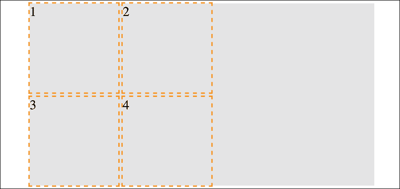
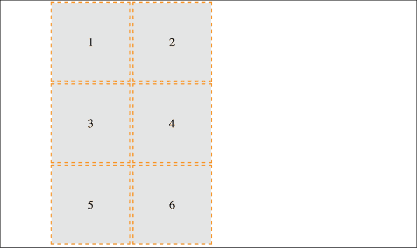
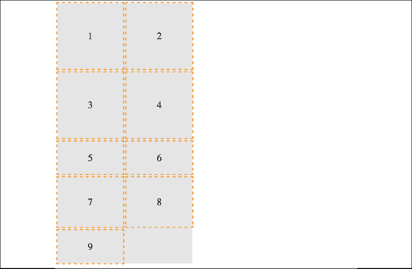
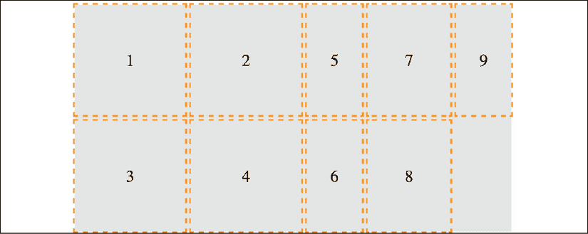
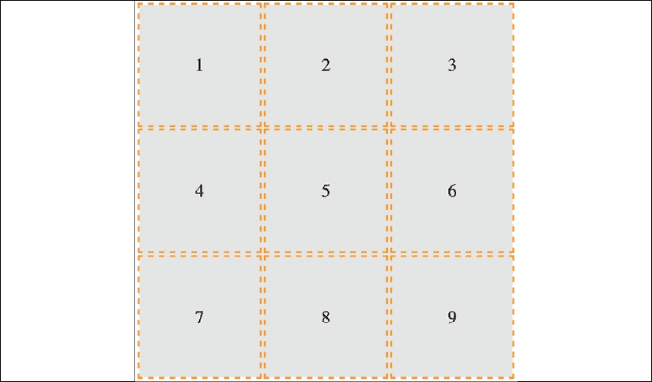
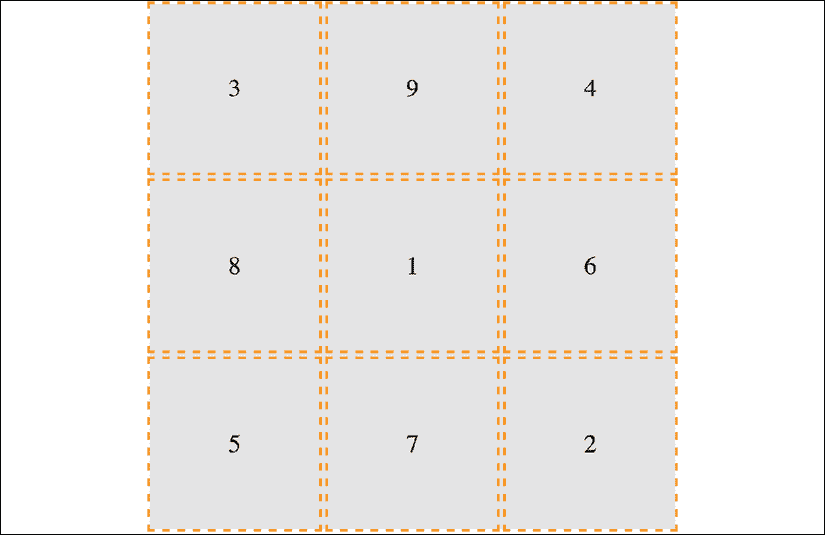
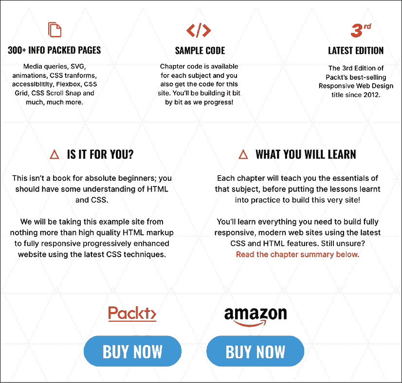
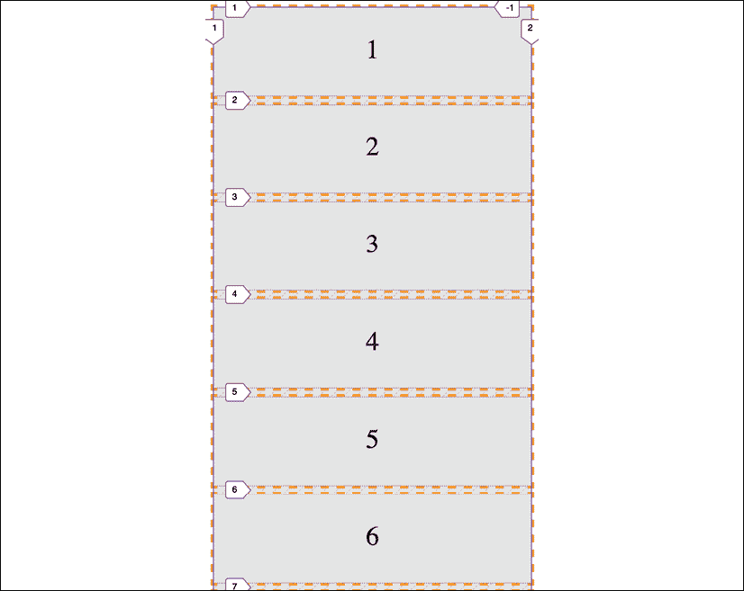

# 五、使用 CSS 网格布局

毫无疑问，CSS 布局最大的“游戏规则改变者”是 Grid。

我们现在有了一个布局系统，它可以用更少的代码和更大的可预测性实现我们以前做过的所有事情，还可以实现我们以前根本做不到的事情!

我甚至认为网格是革命性的，而不是进化的。 有一些全新的概念需要理解，在过去的 CSS 中没有真正的前身。 因此，预计需要一段时间来适应使用它。

但相信我，这是值得的。 我们走吧!

在本章中，我们将学习以下内容:

*   什么是 CSS 网格和它解决的问题
*   处理网格布局时需要理解的基本概念
*   Grid-specific 术语
*   如何建立一个网格
*   如何在网格中定位项目
*   如何用最少的代码创建强大的响应模式
*   如何理解和编写网格速记语法

这一章的末尾,你也将负责一个小练习中使用的一些技术我们已经学会重构的一部分的布局网站 https://rwd.education 我们一直在关注在之前的章节。

# 什么是 CSS 网格和它解决的问题

CSS Grid 是一个二维布局系统。 我们在上一章讨论过 Flexbox，它关注的是每次以单一维度/方向布局的项目。 Flexbox 容器要么将内容排成一行，要么将它们排成一列。 它不能方便地将物品横放和横放; 这就是网格的目的。

我应该在一开始就指出，在构建项目时，您不需要在 Flexbox 或 Grid 之间进行选择。 它们不是相互排斥的。 我通常使用这两种方法，甚至在一个单独的可视组件中。

完全清楚地说，当您采用 Grid 时，您不必放弃任何其他显示方法。 例如，一个 Grid 将非常乐意地允许一个 Flexbox 在其中。 同样地，用 Grid 编码的接口的一部分可以非常愉快地存在于 Flexbox、标准块或内联块中。

所以有时候使用 Grid 是最合适的选择，有时候使用 Flexbox 或其他布局方法是最合适的。

事实上，我们已经用 CSS 创建网格布局很多年了。 我们只是在 CSS 中还没有一个特定的网格布局机制来做这件事。 我们使用了块、浮动、表格和许多其他巧妙的技术来解决我们在 CSS 中没有合适的网格布局系统的问题。 现在，谢天谢地，我们做到了。

使用 CSS Grid，我们可以创建几乎无限排列的网格，并将子元素放置在我们想要它们的任何位置，而不管它们的源顺序。 更重要的是，Grid 甚至为何时添加额外的项做了准备，并根据内容的需要调整自己。 这可能听起来有些夸张，所以我们不要浪费更多的文字了。 让我们开始吧。

## 网格的基本语法

在最简单的术语中，要使用 Grid，我们需要告诉浏览器:

*   我们的网格应该有多少行和列
*   这些行和列应该如何调整大小
*   我们想把网格的项目放在哪里
*   当网格的大小发生变化或向网格中添加更多项时，应该发生什么

因此，将其与浏览器联系起来只是一个理解术语的问题。

## 特定于网格的概念和术语

首先要理解的概念是“显性”和“隐性”道具放置。 在 CSS 中使用列和行定义的网格是显式网格; 它是您显式定义的项目的布局。 与此同时，隐式网格是当您没有预见到的附加项也被添加到网格时发生的项的网格放置。 这些新项的位置由显式网格的布局隐含。

下一个经常让人们感到困惑的概念是网格线在网格项的两边。 在中间的位，在线之间，被称为网格“轨道”。 两条不同方向的轨道相交的地方形成“网格区”。

一个关键的要点是，当您在网格中放置项目时，您可以引用网格线(因此，这意味着网格区域)或网格区域本身(如果命名的话)。

理论上，一个电网可以拥有的轨道数量是没有限制的。 然而，浏览器可以自由地截断网格。 如果您设置的值超出了浏览器的限制，网格将被截断到该限制。 实际上，我无法想象达到浏览器的极限是一种可能的情况，但我在这里提到它是为了完整性。

# 设置网格

下面是对 W3C 规范([https://www.w3.org/TR/css-grid-1/#explicit-grids](https://www.w3.org/TR/css-grid-1/#explicit-grids))的显式网格部分的介绍。 值得再读几遍，因为它包含了理解网格如何工作的重要信息:

> 网格-模板-行、网格-模板-列和网格-模板-区域这三个属性一起定义了网格容器的显式网格。 最终的网格可能会因为网格项被放置在显式网格之外而变得更大; 在这种情况下，隐式轨道将被创建，这些隐式轨道将由网格-自动行和网格-自动列属性大小。
> 
> 显式网格的大小由网格-模板-区域定义的行/列的数量和网格-模板-行/网格-模板-列定义的行/列的数量决定。
> 
> 任何由 grid-template-areas 定义但不由 grid-template-rows/grid-template-columns 定义的行/列的大小都从 grid-auto-rows/grid-auto-columns 属性中获取。 如果这些属性没有定义任何显式轨迹，显式网格仍然在每个轴中包含一个网格线。
> 
> 网格布局属性中的数字索引从显式网格的边计数。 正索引从开始端计数(从 1 开始计算最开始显式的行)，而负索引从结束端计数(从-1 开始计算最结束显式的行)。
> 
> grid 和 grid-template 是允许使用速记方法同时设置所有三个显式网格属性(grid-template-行、grid-template-列和 grid-template-区域)的属性。 网格速记法还重置了控制隐式网格的属性，而网格-模板属性保持不变。

现在，我意识到当您完全没有使用 Grid 时，它可能会非常令人生畏，并且规范中引用的部分现在可能看起来完全不透明。 希望当你读完这一章并亲自体验了 Grid 后，你会觉得它更有意义。

同样，不要担心前面的文字是否有意义。 让我们从一个非常简单的示例开始我们的 Grid 之旅。 首先，世界上最简单的网格布局:四个数字框。 它在浏览器中看起来是这样的:

<figure class="mediaobject"></figure>

图 5.1:第一个网格; 尽可能简单

这里是标记:

```html
<div class="my-first-grid">
  <div class="grid-item-1">1</div>
  <div class="grid-item-2">2</div>
  <div class="grid-item-3">3</div>
  <div class="grid-item-4">4</div>
</div> 
```

我想让您考虑的第一件事是，对于 Grid，标记模式是一个包含元素，也就是网格，网格的元素是直接子元素。 按照对内容最有意义的顺序编写网格子元素的标记; 网格可以将它们可视化地放置在您需要的任何地方。 这是相关的 CSS:

```html
.my-first-grid {
  display: grid;
  grid-gap: 10px;
  grid-template-rows: 200px 200px;
  grid-template-columns: 200px 200px;
  background-color: #e4e4e4;
}
.grid-item-1 {
  grid-row: 1;
  grid-column: 1;
}
.grid-item-2 {
  grid-row: 1;
  grid-column: 2;
}
.grid-item-3 {
  grid-row: 2;
  grid-column: 1;
}
.grid-item-4 {
  grid-row: 2;
  grid-column: 2;
}
[class^='grid-item'] {
  outline: 3px dashed #f90;
  font-size: 30px;
  color: #333;
} 
```

该 CSS 中需要关注的部分是特定于网格的属性。 我添加了一些轮廓和背景，使它更容易看到网格的位置和网格项目的大小和形状。

我们使用`display: grid`将容器设置为一个网格，然后使用`grid-template-rows: 200px 200px`设置两行，每行高 200px，使用`grid-template-columns: 200px 200px`设置网格有两个 200px 宽的列。

对于网格的子元素，我们使用`grid-row`和一个数字告诉 grid 将项目放在哪一行，使用`grid-column`告诉 grid 将项目放在哪一列。

默认情况下，网格的子元素保持其标准布局类型。 虽然我们的网格项属于我们的网格，但在本例中，由于它们都是`div`元素，它们仍然被计算为`display: block`。 当我们开始尝试对齐网格项时，理解这一点很重要。

您可以使用`example_05-01`代码示例中的第一个示例。

让我们使用我们在上一章学到的对齐属性来尝试让我们的网格项目居中:

```html
.my-first-grid {
  display: grid;
  grid-gap: 10px;
  grid-template-rows: 200px 200px;
  grid-template-columns: 200px 200px;
  background-color: #e4e4e4;
  align-items: center;
  justify-content: center;
} 
```

当我第一次开始使用 Grid 并尝试这样做时，我希望看到数字完美地集中在各自的网格轨道上。 然而，事实并非如此:

<figure class="mediaobject"></figure>

图 5.2:如果你不设置宽度，Grid 会占用可用空间

如果我们想想我们所做的，这是有道理的。 我们做了一个两列两行网格，每一列 200px，并要求项目垂直和水平居中。 因为我们使用了`grid`而不是`inline-grid`，所以网格填充了整个页面的宽度，尽管我们的网格项并不需要所有的空间。

让我们调整这个，使网格的宽度仅与其内容相同。 此外，让我们将项目放在各自的网格项目中。 要做到这一点，我们可以让项目本身要么 Flexbox 或 Grid。 因为这是一个关于网格的章节，让我们尝试使用它:

```html
.my-first-grid {
  display: inline-grid;
  grid-gap: 10px;
  grid-template-rows: 200px 200px;
  grid-template-columns: 200px 200px;
  background-color: #e4e4e4;
}
[class^='grid-item'] {
  display: grid;
  align-items: center;
  justify-content: center;
  outline: 3px dashed #f90;
  font-size: 30px;
  color: #333;
} 
```

如果带有帽子符号的选择器没有意义，不要担心。 我们将在*第 6 章*，*CSS 选择器，排版，颜色模式，以及更多*中介绍。

我们将容器切换为`inline-grid`，将所有网格项设置为`display: grid`，并使用对齐属性`justify-content`和`align-items`。

这就产生了这个结果:

<figure class="mediaobject"></figure>

图 5.3:通过使子元素伸缩或网格化，我们可以将其内容居中

这个示例在代码示例`example_05-02`中。 作为练习，尝试将网格元素的位置移动到不同的行和列。

好的，已经取得了一点进展。 让我们继续讨论显式和隐式条目放置的话题。

## 显式和隐式

在本章的前面，我们讨论了显式网格和隐式网格的区别; 一个显式的网格是当设置网格时在 CSS 中定义的结构。 当在网格中放置的内容比您准备的要多时，“隐式”网格就会生效。

让我们通过扩展前面的例子再看一遍。

让我们加入另一项，看看会发生什么:

```html
<div class="my-first-grid">
  <div class="grid-item-1">1</div>
  <div class="grid-item-2">2</div>
  <div class="grid-item-3">3</div>
  <div class="grid-item-4">4</div>
  <div class="grid-item-5">5</div>
</div> 
```

加上这个，这就是我们在浏览器中得到的:

<figure class="mediaobject"></figure>

图 5.4:网格添加了我们的项目，但没有按照我们希望的比例

这是有用的; 网格创建了隐式网格线为我们的新项目创建隐式轨道。 现在，我们没有告诉它如何处理多余的东西，所以它做了最好的猜测。 然而，我们可以通过以下属性来控制 Grid 如何隐式地处理项:`grid-auto-rows`和`grid-auto-columns`。

### grid-auto-rows 和 grid-auto-columns

让我们使用`grid-auto-rows`和`grid-auto-columns`来创建与相同大小的网格项:

```html
.my-first-grid {
  display: inline-grid;
  grid-gap: 10px;
  grid-template-rows: 200px 200px;
  grid-template-columns: 200px 200px;
  grid-auto-rows: 200px;
  grid-auto-columns: 200px;
  background-color: #e4e4e4;
} 
```

现在，不需要编写任何额外的 CSS，当将额外的项目放入网格中，它们将获得我们定义的 200px × 200px 的大小。 这里，我们在 DOM 中添加了另一个项目，总共有 6 个:

<figure class="mediaobject"></figure>

图 5.5:通过一些自动设置，额外的元素可以以更合适的大小添加

你甚至可以制作图案，使第一项是一种尺寸，下一项是另一种尺寸。 这个模式被重复:

```html
.my-first-grid {
  display: inline-grid;
  grid-gap: 10px;
  grid-template-rows: 200px 200px;
  grid-template-columns: 200px 200px;
  grid-auto-rows: 100px 150px;
  grid-auto-columns: 100px 150px;
  background-color: #e4e4e4;
} 
```

<figure class="mediaobject"></figure>

图 5.6:您可以为任何自动添加的行或列指定大小调整模式

您能看到 item 5 如何使用我们在`grid-auto-rows`属性的值中定义的模式吗? 首先，它的高度是 100px，然后是 150px，然后回到 100px。

到目前为止，您可以看到网格项在页面中垂直向下流动。 您可以很容易地切换到这个页面的流动代替! 您可以在`example_05-03`中使用这些代码。

### grid-auto-flow

`grid-auto-flow`属性允许您定义任何隐式添加的项目在网格中流动的方向。 当您希望网格添加额外列以容纳额外项时，请使用`column`值;当您希望网格添加额外行时，请使用`row`值。

让我们通过添加`grid-auto-flow: column`来修改我们的示例，使条目在页面中流动，而不是向下流动:

<figure class="mediaobject"></figure>

图 5.7:切换网格以水平添加额外项目

还有一个额外的`dense`关键字可以添加到`grid-auto-flow: column dense`或`grid-auto-flow: row dense`中——我们很快就会看到它。

# 放置和调整网格项的大小

到目前为止，我们添加到网格中的每一项都占据了一个网格区域。 现在我们将开始一个新的示例(您可以在代码中找到它为`example_05-04`)。 这个网格将有 20 个网格项; 这些只是随机的食物和它们在容器中的来源顺序作为数字。 然而，在 CSS 中有相当多的新东西需要检查。 在我们一步一步地浏览每一个新内容之前，先看看代码和截图，看看在阅读之前你能理解多少内容。

值得一提的是，我故意在值中混淆了空格的使用。 您可以编写`grid-row: 6 / span 2`或`grid-row: 6/span 2`—两者都是有效的。 只要选择你喜欢的。

以下是标记:

```html
<div class="container">
  <div class="grid-item1">1\. tofu</div>
  <div class="grid-item2">2\. egg plant</div>
  <div class="grid-item3">3\. onion</div>
  <div class="grid-item4">4\. carrots</div>
  <div class="grid-item5">5\. swede</div>
  <div class="grid-item6">6\. scones</div>
  <div class="grid-item7">7\. cucumber</div>
  <div class="grid-item8">8\. carrot</div>
  <div class="grid-item9">9\. yam</div>
  <div class="grid-item10">10\. sweet potato</div>
  <div class="grid-item11">11\. peas</div>
  <div class="grid-item12">12\. beans</div>
  <div class="grid-item13">13\. lentil</div>
  <div class="grid-item14">14\. tomato</div>
  <div class="grid-item15">15\. butternut squash</div>
  <div class="grid-item16">16\. ham</div>
  <div class="grid-item17">17\. pizza</div>
  <div class="grid-item18">18\. pasta</div>
  <div class="grid-item19">19\. cheese</div>
  <div class="grid-item20">20\. milk</div>
</div> 
```

这是 CSS:

```html
.container {
  font-size: 28px;
  font-family: sans-serif;
  display: grid;
  gap: 30px;
  background-color: #ddd;
  grid-template-columns: repeat(4, 1fr);
  grid-auto-rows: 100px;
  grid-auto-flow: row;
}
[class^='grid-item'] {
  outline: 1px #f90 dashed;
  display: grid;
  background-color: goldenrod;
  align-items: center;
  justify-content: center;
}
.grid-item3 {
  grid-column: 2/-1;
}
.grid-item6 {
  grid-row: 3/6;
  grid-column: 3 / 5;
}
.grid-item17 {
  grid-row: 6 / span 2;
  grid-column: 2/3;
}
.grid-item4 {
  grid-row: 4 / 7;
} 
```

而是我们在浏览器中得到的:

<figure class="mediaobject"></figure>

图 5.8:任意大小的网格项

我们在这里介绍了一些新事物。 让我们依次介绍。

## 差距

我已经在前面的一些代码示例中的中使用了`gap`，但是我没有解释它。 原谅我! `gap`属性允许您指定网格轨道之间的间隙。 它实际上是`row-gap`和`column-gap`的简写。 就像指定带有两个值的边距一样，第一个值应用于顶部和底部(行)，第二个值应用于左侧和右侧(列)。 如果您指定单个值，就像我们所做的那样，它会同时应用于两个值。

您可能会看到使用了`grid-gap`而不是`gap`。 这是因为，在被修改之前，该属性最初被称为`grid-gap`，而且许多浏览器最初只支持`grid-gap`。 如果您想要最广泛的浏览器支持，您可以安全地使用`grid-gap`。

## 重复

如果你用创建一个有 30 个相同列的网格，那么要写`auto`30 次会有点累人，例如`grid-template-columns: auto auto auto auto auto auto...`; 事实上，写这个我都烦了!

谢天谢地，网格规范的编写者为我们提供了`repeat()`。 正如您可能已经猜到的，`repeat()`函数提供了一种方便的方法，可以消除任意数量项目的需求。 在我们的示例中，我们使用它创建了四个列，宽度都是`1fr`:

```html
repeat(4, 1fr); 
```

该语法的格式是，在括号内，第一个值是您希望某项重复的次数，第二个值是每个项的宽度。

别担心，我等下会解释`fr`单位; 现在，只需要知道您可以轻松地创建多个列/行。 你想要 15 列，全部 100px 宽吗? 就像`repeat(15, 100px)`一样简单。

## fr 单位

`fr`单位表示“柔性长度”，表示“柔性分数”。 用来沟通多少任何我们想要的免费空间吞噬,就像`flex-grow`单位我们覆盖 Flexbox*第四章*,*流体布局,Flexbox,响应图像*。

规范并没有这么说，但是当我考虑布局时，我将`fr`概念化为代表“空闲空间”。 在我们的示例中，我们创建了四个列，每个列占用可用空闲空间的一部分。

## 在网格中放置项目

在此示例之前，我们已经将定位到单个网格区域中的每个网格项。 然而，在这里，我们用数值的方式为某些网格项分配了列或行的跨度。

让我们以`grid-item3`为例:

```html
.grid-item3 {
  grid-column: 2/-1;
} 
```

这里，`grid-column`属性被设置为从第二个网格线开始，在-1 网格线结束。 `-1`一开始看起来很奇怪，但它是一个非常聪明的语法的一部分。

第一个数字是起始点，它用斜杠与端点分开。 正的数从开始的一边开始计数——在我们的列例中是左边，而负数从结束的一边开始计数——在这个例子中是右边。 所以，`-1`基本上就是最后一条网格线。 所以，这个简洁的语法就是:“从第 2 行开始，一直到最后。”

我故意在其他一些示例中在数字周围留下了混乱的空格，以表明您可以保留空格或省略它——无论如何都没有戏剧性。

这里也有一个跨行跨越的例子。 再看一遍这个:

```html
.grid-item4 {
  grid-row: 4 / 7;
} 
```

这个说"从第 4 行开始，到第 7 行结束"

## 跨度

现在来看看 CSS 的`.grid-item17`:

```html
.grid-item17 {
  grid-row: 6 / span 2;
  grid-column: 2/3;
} 
```

您能看到我们如何用`grid-row`的值做了一些不同的事情吗?

当放置网格项时，不必规定一个明确的开始点和结束点，您可以给出一个或另一个，然后告诉该项从那个点开始向前或向后跨越若干行/列。 在我们的例子中，我们告诉项目从网格第 6 行开始并跨出 2 行。

我觉得往回走有点让人困惑，但那可能就是我! 但为了说明这一点，我们可以通过将该行更改为`grid-row: span 2 / 8`来实现示例中的相同视觉效果。 在本例中，我们确定的点是端点，所以我们告诉网格使该项从网格第 8 行开始并从那里张成 2。

## 密集的

还记得我们在讨论`grid-auto-flow`时提到的`dense`关键词吗? 这是一个绝佳的机会来展示它的作用。 我将把`grid-auto-flow`属性的值修改为`grid-auto-flow: row dense;`。 下面是它在浏览器中的作用:

<figure class="mediaobject"></figure>

图 5.9:“密集”关键字重新排列网格项，以消除缺口

你能看到这些空白是如何被填补的吗? 这就是`dense`为你做的。 然而，尽管这可能看起来更美观，但也有代价。 之所以给条目编号，是因为我想向您强调一下，使用`dense`可以让网格算法在视觉上将内容从源顺序移动到任何可用空间。

# 指定网格线

网格允许作者以多种方式使用网格。 例如，如果您更愿意使用单词而不是数字，则可以命名网格线。 考虑一个 3 列 3 行网格。

你可以在这本书的代码中找到这个例子`example_05-05`。

<figure class="mediaobject"></figure>

图 5.10:我们将使用命名网格线来重新排列元素

这是我们的标记:

```html
<div class="my-first-grid">
  <div class="grid-item-1">1</div>
  <div class="grid-item-2">2</div>
  <div class="grid-item-3">3</div>
  <div class="grid-item-4">4</div>
  <div class="grid-item-5">5</div>
  <div class="grid-item-6">6</div>
  <div class="grid-item-7">7</div>
  <div class="grid-item-8">8</div>
  <div class="grid-item-9">9</div>
</div> 
```

我们用这个规则设置网格。 注意方括号里的字:

```html
.my-first-grid {
  display: inline-grid;
  grid-gap: 10px;
  grid-template-columns: [left-start] 200px [left-end center-start] 200px [center-end right-start] 200px [right-end];
  grid-template-rows: 200px 200px 200px;
  background-color: #e4e4e4;
} 
```

我们在方括号内所做的是为网格线指定一个名称。 在本例中，我们将第一列网格线命名为`left-start`，并将第一列之后的网格线命名为`left-end`。 注意，在中心网格线中，我们分配了两个名称:`left-end`和`center-start`。 我们可以通过用空格分隔名称来做到这一点。 在这种情况下，它是有意义的，因为网格线既是左列的结束，也是中心列的开始。

让我们修改我们的`grid-template-row`并添加一些命名的网格线:

```html
grid-template-rows: [top-start] 200px [top-end middle-start] 200px [middle-end bottom-start] 200px [bottom-end]; 
```

下面是一个示例，说明我们如何使用这些名称来定位网格项而不是数字值。 这只是我们将在下面的图表中看到的前三个项目:

```html
.grid-item-1 {
  grid-column: center-start / center-end;
  grid-row: middle-start / middle-end;
}
.grid-item-2 {
  grid-column: right-start / right-end;
  grid-row: bottom-start / bottom-end;
}
.grid-item-3 {
  grid-column: left-start / left-end;
  grid-row: top-start / middle-start;
} 
```

在示例代码中，我使用这种技术将每个网格项设置为随机位置。 你可以看到以上三个在这个图表中的位置:

<figure class="mediaobject"></figure>

图 5.11:你可以通过命名的网格线轻松地移动物体

在规范术语中，我们分配给网格线的名称称为“自定义标识”。 因为它们只是单词，所以避免使用可能干扰网格关键字的术语。 例如，不要开始将网格线命名为“密集”、“自动匹配”或“跨度”!

当您使用命名网格线时，您可以利用网格有一个额外的精确性。 如果你在你的名字后面加上“-start”和“-end”，就像我们在例子中所做的那样，然后网格自动(是的，我知道，这不是一个真正的单词)使你成为一个命名的网格区域。 等等,什么? 是的，这意味着一旦命名了网格线，就可以使用一行`grid-area`在网格中放置项目。 为了证明这一点，下面是之前以这种方式重写的前三个网格条目规则:

```html
.grid-item-1 {
  grid-area: middle / center;
}
.grid-item-2 {
  grid-area: bottom / right;
}
.grid-item-3 {
  grid-area: top / left;
} 
```

我现在有点超前了，因为我已经介绍了`grid-area`，没有任何解释。 现在让我们来讨论一下。

## grid-template-areas

使用 Grid 的另一种方法是创建网格模板区域，以建立网格的区域。 让我们重新处理之前的示例，我们将完全删除命名的网格线，再次从网格的基本 CSS 开始。

代码中的`example_05-06`:

```html
.my-first-grid {
  display: inline-grid;
  grid-gap: 10px;
  grid-template-columns: 200px 200px 200px;
  grid-template-rows: 200px 200px 200px;
  background-color: #e4e4e4;
}
[class^='grid-item'] {
  display: grid;
  align-items: center;
  justify-content: center;
  outline: 3px dashed #f90;
  font-size: 30px;
  color: #333;
} 
```

现在，我们将像这样定义网格模板区域，并将其添加到`.my-first-grid`规则中:

```html
grid-template-areas:
  'one two three'
  'four five six'
  'seven eight nine'; 
```

使用`grid-template-areas`，我们可以非常简单地定义行和列。 行是用引号(双引号或单引号)定义的，每个列的名称在里面用空格分隔。 网格中的每一行只是另一对引号，其中包含自定义锯齿。

您可以使用数字作为每个网格区域的开始，但是当您引用它们时，您需要“转义”它们。 例如，如果我们的一个区域被命名为“9”，那么它就必须像这样引用:`grid-area: "\39;"`。 我发现这太麻烦了，所以我建议对每个区域使用字符串，或者至少用一个 alpha 字符开始每个自定义标识。

这意味着我们可以像这样用`grid-area`定位我们的项目:

```html
.grid-item-1 {
  grid-area: five;
}
.grid-item-2 {
  grid-area: nine;
}
.grid-item-3 {
  grid-area: one;
} 
```

诚然，这是一个简单的示例，但希望您可以想象一个更有用的场景:可能是一个带有标题、左侧边栏区域、主要内容区域和页脚的博客布局。 你可以这样定义必要的`grid-template-areas`:

```html
grid-template-areas:
  'header header header header header header'
  'side side main main main main'
  'side side footer footer footer footer'; 
```

由于规范(相关部分的链接如下)指出任何空白字符都不能产生标记，如果你愿意，你可以选择用制表符分隔列，以帮助可视化地排列列:

[https://www.w3.org/TR/css-grid-1/#valdef-grid-template-areas-string](https://www.w3.org/TR/css-grid-1/#valdef-grid-template-areas-string)。

当你写网格模板区域时，缩进不重要，回车也不重要; 如果您愿意，您可以将每一行放在一个空格分隔的长列表中。 只要每个区域的名称在引号内，每个引号之间有一个空格，并且每组引号之间有一个空格，就可以了。

# 运用你所学到的知识

作为一个练习，考虑一下[https://rwd.education](https://rwd.education)网站的这一部分:

<figure class="mediaobject"></figure>

图 5.12:你能用你的网格知识来布局这个部分吗?

如果你在`Start`文件夹中找到本章的代码，你会看到，目前这些部分是，一个在另一个下面。 尝试使用 Grid 修改该部分的代码。 也许你可以考虑如何在屏幕空间有限的情况下轻松地让它显示一个或两个这样的部分，以及在屏幕空间允许的情况下让它显示前面截图所示的布局。

已经有一个工作草案的 CSS 网格布局模块 2。 它带来的主要好处是能够拥有子网格:网格中的网格可以继承其父网格的轨道大小。 您可以在这里阅读当前的规范:[https://www.w3.org/TR/css-grid-2/](https://www.w3.org/TR/css-grid-2/)。

现在让我们继续讨论一些更高级的 Grid 技术。

## auto-fit 和自动

`auto-fit`和`auto-fill`是“repeat-to-fill”关键字，用于描述对 Grid 的重复。

感谢相似的名字,我不禁觉得`auto-fit`和`auto-fill`关键词几乎保证 confuse-just`cover`和`contain`做背景图像大小(我们支付他们在*第七章*,【显示】惊人的美学与 CSS)。

这样做的结果是，我必须经常检查哪个是哪个。 值得庆幸的是，为了对我们两个都有好处，我们现在将阐明它们的作用，以及为什么您可能想要使用它们。

让我从为什么开始，因为这涵盖了这两个关键字。 如果我告诉您，在`auto-fill`或`auto-fit`的帮助下，我们可以创建一个完全响应的网格，它根据视口的可用大小来添加/删除列，而不需要进行媒体查询，那会怎么样呢?

引人注目的,对吧?

考虑一个 9 列网格，其中每列至少 300px 宽。 以一种略微前后颠倒的方式，我想先向你展示解决方案:

```html
grid-template-columns: repeat(auto-fit, minmax(300px, 1fr)); 
```

下面是它在浏览器中提供给你的一个较小的 viewport:

<figure class="mediaobject"></figure>

图 5.13:使用 Grid 的一行可以得到一个移动布局…

同样的在更宽的屏幕上:

<figure class="mediaobject"></figure>

图 5.14:还有一个更宽视图的布局!

很方便的,对吧?

让我们在这个一行代码中分解所有的魔力。

和前面一样，我们使用`grid-template-columns`来设置网格的列。 我们使用`repeat()`函数来建立一个重复的列模式; 然而，我们将网格告知`auto-fit`，而不是传递一些列的。 我们可能也用过`auto-fill`，但我们一会儿就会知道它们之间的区别。 目前，我们已经告诉浏览器重复创建自动匹配的列，并使用`minmax`函数定义这些列的宽度。

## 极大极小()函数

现在，如果您是 Grid 的新手，很可能以前没有使用过`minmax()`。 它是一个 CSS 函数，允许您为浏览器设置一个范围。 您指定最小大小和最大大小，然后它根据可用空间计算介于两者之间的值。 在我们的示例中，我们将`minmax()`的最小大小设置为 300px，最大大小设置为 1`fr`(请记住，将`fr`视为“空闲空间”可能会有帮助)。

在处理`minmax()`时，如果您指定的最大值小于最小值，那么最大值将被忽略，而最小值将是计算值。

有了这个设置，网格的“自动匹配”列的宽度至少为 300px，并且不超过其内容的大小加上剩余空间的 1fr 份额。

实际上，这提供了一种响应性布局，可以让我们的网格根据可用的视口宽度自行调整大小。

为了更容易地显示`auto-fit`和`auto-fill`之间的差异，让我们将一行代码修改为最小 100px:

```html
grid-template-columns: repeat(auto-fit, minmax(100px, 1fr)); 
```

这给了我们一个宽视口的布局:

<figure class="mediaobject"></figure>

图 5.15:使用 auto-fit 将我们的内容放入可用的空间中

请注意列如何跨越整个页面的宽度。 现在我们将改为`auto-fill`:

```html
grid-template-columns: repeat(auto-fill, minmax(100px, 1fr)); 
```

这是它产生的结果:

<figure class="mediaobject"></figure>

图 5.16:使用自动填充，任何空闲空间都用不可见的列填充

注意到末尾的空格了吗? 那里发生了什么事?

理解这种差异的关键在于是否折叠了备用列。

当浏览器在`auto-fit`和`auto-fill`中创建网格时，它们最初的布局是相同的。 然而，当使用`auto-fit`时，任何多余的列，在布局了内容后，将被折叠，留下空间，以便在行中的项目之间均匀分布。 在我们的例子中，因为每个条目的最大大小也是 1fr 单位，所以每个条目都占据了相同比例的空闲空间。 这会产生跨整个空间宽度的列。

然而，使用`auto-fill`，一旦项目(在我们的示例中是 100px 宽)被布局，如果有任何额外的空间，额外的空列将不会折叠。 它们仍然在原地，被填满，随后空间就不能被网格项目吞噬了。 结果是我们在最后得到了空间。

在某些情况下，一个比另一个更合适; 只要意识到你可以做到任何一种。

在一些屏幕截图中，您可以看到网格线所在位置的指示器。 这些都是从 Firefox Grid 工具中获取的，该工具是其开发工具的一部分。 当我在 2020 年初写这篇文章时，我认为 Firefox 已经拥有了处理网格的最好的开发工具。

# 简写语法

有两种可以用于 Grid 的简写语法:一种相对简单，另一种不那么简单。 第一个您可能会发现最实用的是`grid-template`。

虽然简写语法可能很好，但我的建议是每次编写网格的一个属性，至少一开始是这样。 当您足够自信地将每个属性和值单独写出来成为一件苦差事时，花点时间学习速记变体。

有了这个建议，让我们看看这两种速记方法。

## 网格模板速记

这允许您在一行中设置、`grid-template-columns`和`grid-template-areas`。

例如，对于一个有两个 200px 行和三个 300px 列的网格，我们可以这样写:

```html
grid-template: 200px 200px / 300px 300px 300px; 
```

或者，如果你更喜欢使用`repeat`函数，你可以这样写:

```html
grid-template: repeat(2, 200px) / repeat(3, 300px); 
```

正斜杠前的部分处理行和列后的位。 如果你喜欢，你也可以在那里添加`grid-template-areas`:

```html
grid-template:
  [rows-top] 'a a a' 200px
  'b b b' 200px [rows-bottom]
  / 300px 300px 300px; 
```

在浏览器中计算得到:

```html
grid-template-rows: [rows-top] 200px 200px [rows-bottom];
grid-template-columns: 300px 300px 300px;
grid-template-areas: 'a a a' 'b b b'; 
```

就我个人而言，我发现一旦您开始将模板区域放入值中，它就开始变得有点过于复杂。 不管怎样，有些人喜欢速记，你应该意识到这是可能的。

然而，我们现在要把它提升一个层次，处理一下`grid`速记。

## 网格速记

另一种简写语法`grid`允许在一行中定义一个网格。

使用这个属性,您可以设置属性控制网格的明确的部分:`grid-template-rows`,`grid-template-columns`,`grid-template-areas`,以及属性控制网格的隐式部分:`grid-auto-rows`,`grid-auto-columns`和【5】。

在编写`grid`简写时要记住的一个基本的概念是，网格只能隐式地使用行或列增长，而不能同时使用行和列。 起初，这可能看起来很奇怪，但如果您仔细想想，一个可以同时添加行和列的网格如何隐式地布局项目呢? 它将如何决定是添加行还是添加列?

因此，记住这一点，我们可以努力将我们的头脑围绕在`grid`速记上。

`grid`这个缩写不适合胆小的人，所以如果在你掌握它之前它就把你吐了几次，不要气馁。 我认为自己对 CSS 相当熟悉(我知道，您也希望如此，对吧?)，但是我花了几个小时而不是几分钟才对`grid`速记语法的作用有信心。

我希望你知道你的巴克斯-诺尔形式，因为这里是如何描述的属性在规范:

```html
<'grid-template-rows'> / [ auto-flow && dense? ] <'grid-auto-columns'>? [ auto-flow && dense? ] <'grid-auto-rows'>? / <'grid-template-columns'> 
```

简单,是吧?

我当然是在开玩笑。 在这一点上，当试图理解一个规范时，我倾向于搜索这篇关于理解 CSS 规范的文章:[https://www.smashingmagazine.com/2016/05/understanding-the-css-property-value-syntax/](https://www.smashingmagazine.com/2016/05/understanding-the-css-property-value-syntax/)。

在重读了之后，我将尽我最大的努力将这部分规范提炼成更人性化的东西。 这意味着，`grid`速记法可以接受三种不同语法集中的任何一种作为其值。

### 网格速记值——选项一

如果您正在使用`grid-template`，那么您将使用相同的值。 例如，这是一个有两个 100px 行和三个 200px 列的网格:

```html
grid: 100px 100px / 200px 200px 200px; 
```

就像前面的`grid-template`例子一样，如果你愿意，你也可以使用`grid-template-areas`。

### 网格速记值——选项二

显式网格行的一组长度，然后用斜杠分隔，这是您希望如何处理隐式列的定义。 可以用`auto-flow`来设置`grid-auto-rows`，也可以通过添加`dense`来设置`grid-auto-flow`。 或者，如果您想设置`grid-template-columns`，您也可以为列的宽度添加一个长度值。

唷，要计算的东西太多了。 看一些例子。

因此，对于一个有两个显式的 100px 行和任意数量显式的 75px 列的网格:

```html
grid: 100px 100px / repeat(auto-fill, 75px); 
```

使用这个网格，如果有太多的项，它们将溢出到默认大小为`auto`的隐式行中。

在浏览器中，这种速记将计算为以下内容:

```html
grid-template-rows: 100px 100px;
grid-template-columns: repeat(auto-fill, 75px);
grid-template-areas: none;
grid-auto-flow: initial;
grid-auto-rows: initial;
grid-auto-columns: initial; 
```

让我们试试另一个。 假设我们想要布局一个只有一行，高 100px，但有任意数量列的网格，可能会超出容器的一侧:

```html
grid: 100px / auto-flow; 
```

该规则的计算结果如下:

```html
grid-template-rows: 100px;
grid-template-columns: initial;
grid-template-areas: initial;
grid-auto-flow: column;
grid-auto-rows: initial;
grid-auto-columns: initial; 
```

同样值得知道的是，当您使用`grid`速记法时，您正在将它处理的所有值重新设置到它们的初始状态。 如果查看浏览器的开发工具中样式的计算值，就可以看到这一点。

### 网格速记值——选项三

您可以传递给`grid`的最后一个语法实际上与选项 2 相反。 这一次，设置`grid-auto-flow`来处理隐式行(使用可选的`dense`)，并使用可选的`grid-auto-rows`值来表示行大小。 然后，在斜杠之后，我们处理`grid-template-columns`。

使用这种类型的值，我们可以让网格在需要时按行布局，而不是像前面的选项那样按列布局。 这里有一些例子。

如何创建一个需要的 100 像素行和 5 列占用 1fr 的网格?

```html
grid: auto-flow 100px / repeat(5, 1fr); 
```

计算结果是:

```html
grid-template-rows: initial;
grid-template-columns: repeat(5, 1fr);
grid-template-areas: initial;
grid-auto-flow: row;
grid-auto-rows: 100px;
grid-auto-columns: initial; 
```

或者，如果一个网格创建一个单独的列，并根据内容的需要创建 100 像素的行，那会怎么样呢?

```html
grid: auto-flow 100px / auto; 
```

计算结果是:

```html
grid-template-rows: initial;
grid-template-columns: auto;
grid-template-areas: initial;
grid-auto-flow: row;
grid-auto-rows: 100px;
grid-auto-columns: initial; 
```

您可以看到，`grid`速记非常强大，但是，可以说，不是特别直观。 对有些人来说，用速记更可取。 对一些人来说，这令人恼火。 没有对或错，只有对你来说是对还是错。

# 总结

如果你是一个网页上的新手，你几乎有一个优势，当涉及到学习 CSS 网格; 如果你愿意，你可以称之为“初学者的心态”。 对于那些多年来一直使用其他技术进行布局的人来说，在某种程度上，困难之处在于如何用 CSS 撤销你已经知道的布局。

读完本章后，您应该对使用 Grid 可以实现什么以及如何使用它有一些了解。

此外，如果你以任何方式成功地完成了这些练习，你应该祝贺自己; 当您第一次开始使用 Grid 时，需要考虑很多问题。 如果你第一次努力就完成了某件事，你做得令人钦佩。

在这一点上，我还将重申，Grid 首先是棘手的。 它带来了很多可能性，但也有不少新的术语和概念。 在你第一次使用它的时候，你可能需要运行几次。 但我保证，一旦你有能力，它会为你的投资带来丰厚的回报。

最后两章涵盖了相当广泛的主题:如何用最现代的技术做布局，以及如何处理响应性图像。 下一章将更加注重细节。 很多可爱的小技巧和技巧都可以通过 CSS 实现; 它是一个名副其实的 CSS 大杂烩。 翻开那一页，让我们继续到*第六章*，*CSS 选择器，排版，颜色模式，以及更多*。