# 10

# 用 HTML5 和 CSS 征服表单

在 HTML5 之前，在表单中添加日期选择器、占位符文本和范围滑动器总是需要 JavaScript。 同样，也没有一种简单的方法来帮助用户在特定的输入字段中输入我们希望他们输入的数据类型，例如，我们是否希望用户输入电话号码、电子邮件地址或 url。

好消息是 HTML5 在很大程度上解决了这些常见问题。

本章有两个主要目的。 首先，理解 HTML5 表单特性，其次，理解我们如何使用最新的 CSS 特性为多种设备更简单地布局表单。 在本章中，我们将学习如何:

*   轻松地将占位符文本添加到相关的表单输入字段中
*   必要时禁用表单字段的自动完成功能
*   将某些字段设置为提交之前必须的
*   请指定不同的输入类型，如电子邮件、电话号码和 URL
*   创建数字范围滑块，方便选择值
*   将日期和颜色选择器放置到窗体中
*   使用正则表达式定义允许的表单值
*   使用 Flexbox 样式表单
*   改变脱字符号颜色

# HTML5 表单

我认为掌握 HTML5 表单最简单的方法是通过一个示例表单。 就像白天的电视烹饪节目一样，我早做了一个! 有必要简单介绍一下。 两个事实:首先，我喜欢电影。 其次，我对什么是好电影，什么不是很有主见。

每年，当宣布奥斯卡提名时，我都忍不住觉得奥斯卡“提名”的是错误的电影。 因此，我们将从 HTML5 形式开始，让影迷发泄他们对奥斯卡提名的持续歪曲的失望。

它由几个`fieldset`元素组成，在这些元素中我们包含了大量 HTML5 表单输入类型和属性。 除了标准的表单输入字段和文本区域外，我们还为许多字段提供了数字微调器、范围滑动器和占位符文本。

这里是它看起来没有风格应用在 Chrome:

<figure class="mediaobject">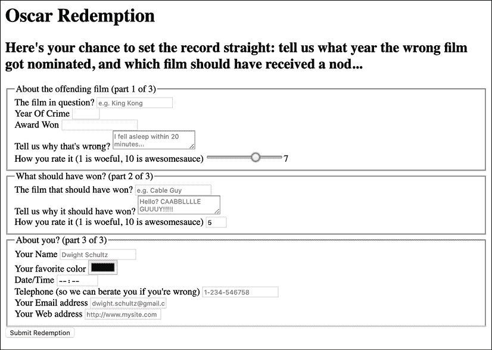</figure>

图 10.1:没有样式的基本表单

如果我们“关注”第一个字段并开始输入文本，占位符文本将被删除。 如果我们在不输入任何内容的情况下模糊焦点(通过再次单击输入框外)，占位符文本将重新出现。 如果我们提交表格(不输入任何内容)，会发生以下情况:

<figure class="mediaobject"></figure>

图 10.2:一个来自必需字段的标准浏览器警告

好消息是所有这些用户界面元素，包括前面提到的滑块、占位符文本、旋转器和输入验证，都是由浏览器通过 HTML5 本地处理的，而不是 JavaScript。 现在，表单验证并不是完全跨浏览器兼容的，但是我们很快就会讲到。 首先，让我们了解 HTML5 与表单相关的所有新功能，并使这一切成为可能。 一旦我们理解了所有的机制，我们就可以开始设计它。

## 理解 HTML5 表单的组件部分

在我们的 HTML5 形式中有很多内容，所以让我们将其分解。 表单的三个部分都包装在一个字段集中，字段集在语义上分组了相关的表单字段集，还有一个图例，它提供了字段集的文本说明:

```html
<fieldset>
  <legend>About the offending film (part 1 of 3)</legend>
  <div>
    <label for="film">The film in question?</label>
    <input
      id="film"
      name="film"
      type="text"
      placeholder="e.g. King Kong"
      required
      aria-required="true"
    />
  </div>
</fieldset> 
```

你可以看到`input`从先前的代码片段,每个表单的元素也被包裹在一个`div``label`与每个`input`关联(我们可以包装的`input``label`元素如果我们想)。 到目前为止，一切正常。 然而，在第一个`input`中，我们偶然发现了第一个 HTML5 表单功能。 在`id`、`name`、`type`的共同属性之后，我们有`placeholder`。

## 占位符属性

顾名思义，`placeholder`属性提供了一种提供提示或一些占位符数据的方法，以指示我们期望的输入类型。 一个明显的例子是搜索框中的单词“Search”。

在表单字段中需要占位符文本是一种非常普遍的需求，因此创建 HTML5 的人员决定它应该是 HTML 的标准特性。 要为`input`添加占位符文本，只需添加`placeholder`属性。 它的值将显示在输入中，直到字段获得焦点。 当它失去焦点时，如果没有输入值，它将重新显示占位符文本。

在我们的例子中，`placeholder`属性是这样填写的:

```html
placeholder="e.g. King Kong" 
```

### 样式化占位符文本

您可以使用`:placeholder-shown`伪选择器样式化`placeholder`属性:

您应该知道，这个选择器已经经过了多次迭代，因此要确保设置了一个前缀工具，以便为浏览器中的旧实现提供回退选择器。

```html
input:placeholder-shown {
  color: #333;
} 
```

您还可以更改占位符文本的文本大小; 它不需要和这些值相等。 与以往一样，要注意可访问性。 您不希望使用小于 10px 的文本大小。

当谈到颜色可访问性时，确保使用适当的对比度。 如果你还没有检查可接受对比水平的工具，我建议你收藏[https://webaim.org/resources/contrastchecker/](https://webaim.org/resources/contrastchecker/)。

## 使用插入符号-color 属性样式化输入插入符号

插入符号，在我们这里的上下文中，指的是输入区域中的插入点。 您可能认为通常会闪烁的垂直线是“光标”，但在 CSS 中它的命名故意与其他游标(例如由鼠标输入产生的游标)不同。

顺便说一下，它的发音通常像你最喜欢的橙色蔬菜“胡萝卜”，但取决于你的口音，你可能需要改变你的发音为“carrit”，就像我们在英国必须做的那样，这没问题，只要女王听不见你!

`caret-color`属性是最近才添加到 CSS 中的。 它允许我们改变输入插入点光标的颜色; 插入符号。

假设我们想要一个橙色的输入插入点; 我们可以这样设计:

```html
.my-Input {
  caret-color: #f90;
} 
```

遗憾的是，除了颜色，我们无法真正控制插入符号的显示方式。 例如，我们不能改变形状、厚度或眨眼频率和样式。 希望在这本书的下一版中，这一切都将成为可能!

如果您不知道，有一个名为`contenteditable`的属性可以使日常元素(如`div`或`span`的内容可编辑。 你也可以在这些情况下使用`:caret-color`。

## 所需的属性

`required`是一个布尔属性，“布尔”表示它只有两种可能性。 在这种情况下，您要么包含它，要么不包含它。

当它出现时，就像这样:

```html
<input type="text" value="" placeholder="hal@2001.com" required /> 
```

这意味着在提交表单之前，需要向这个输入添加一个值。

如果在没有输入包含必要值的情况下尝试提交表单，则会显示一条警告消息。 根据所使用的浏览器和输入类型，消息本身在内容和样式上都有所不同。

我们已经看到了`required`域浏览器消息在 Chrome 中的样子。 下面的截图显示了 Firefox 中的相同消息:

<figure class="mediaobject">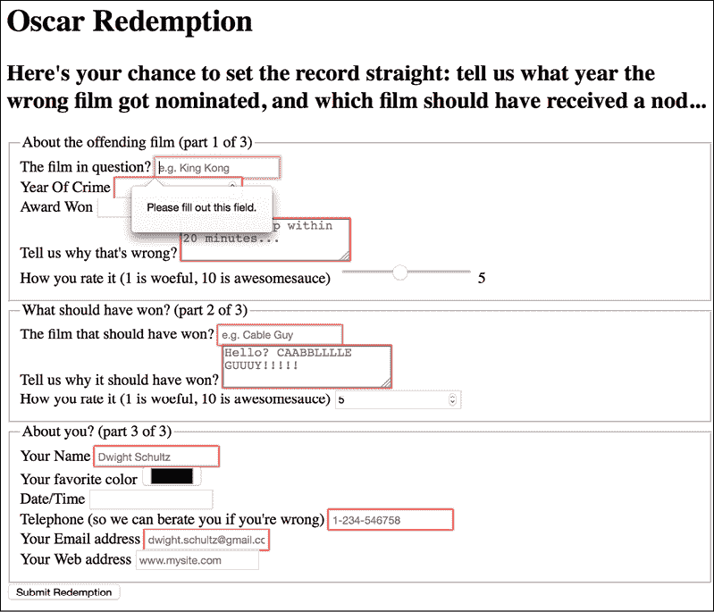</figure>

图 10.3:在 Firefox 中提交表单时没有完成必要的字段的错误

可以将`required`值与多种输入类型一起使用，以确保输入值。 值得注意的例外是`range`、`color`、`button`和`hidden`输入类型，因为它们几乎总是具有默认值。

## 自动对焦属性

HTML5`autofocus`属性允许表单在页面加载时聚焦字段，以便用户输入。 下面的代码是一个输入字段包装在`div`中，并在末尾添加`autofocus`属性的示例:

```html
<div>
  <label for="search">Search the site...</label>
  <input
    id="search"
    name="search"
    type="search"
    placeholder="Wyatt Earp"
    autofocus
  />
</div> 
```

用`autofocus`小心踏面; 很容易给用户带来糟糕的体验。

例如，每页只添加一个`autofocus`是很重要的。 如果有多个字段添加了`autofocus`，在 Safari 中，最后添加`autofocus`的字段将聚焦于页面加载。 然而，Firefox 和 Chrome 做了相反的事情，用第一个自动聚焦的字段聚焦。

同样值得考虑的是，有些用户在网页加载后使用空格键来快速跳过内容。 在表单具有自动聚焦输入字段的页面上，它阻止了这种功能; 相反，它向聚焦的输入字段添加了一个空格。 这很容易让用户感到沮丧。

此外，辅助技术的用户将立即被传送到页面上的一个他们无法控制的位置——这不是最好的用户体验!

如果使用`autofocus`属性，请确保在一个表单中只使用一次，并确保理解其中的含义。

## 自动完成属性

默认情况下，大多数浏览器通过在可能的情况下自动补全表单字段的值来帮助用户输入。

虽然用户可以在浏览器中打开或关闭这个首选项，但我们现在还可以向浏览器表明，何时不希望表单或字段允许使用`autocomplete`属性自动完成。 这不仅对敏感数据(例如银行账号)很有用，而且对于希望确保用户注意并手动输入内容的情况也很有用。

例如，对于我完成的许多表单，如果需要一个电话号码，我就输入一个“欺骗”电话号码。 我知道我不是唯一一个这样做的人(不是每个人吗?)，但我可以确保用户不会通过在相关输入字段上将`autocomplete`属性的值设置为`off`来输入自动完成的欺骗数字。 下面是将`autocomplete`属性设置为`off`的字段的代码示例:

```html
<div>
  <label for="tel">Telephone (so we can berate you if you're wrong)</label>
  <input
    id="tel"
    name="tel"
    type="tel"
    placeholder="1-234-546758"
    autocomplete="off"
    required
  />
</div> 
```

在整个字段集上一次性停止自动完成是不可能的，但你可以在整个表单上停止自动完成。 只需将`autocomplete`属性添加到`form`元素本身。 这里有一个例子:

```html
<form id="redemption" method="post" autocomplete="off">
  <!-- content -->
</form> 
```

## 列表属性和相关的数据列表元素

当用户开始在字段中输入值时，这个`list`属性和相关的`datalist`元素允许向用户呈现大量的选择。 下面的是与相关的`datalist`一起使用的`list`属性的代码示例，全部包装在`div`中:

```html
<div>
  <label for="awardWon">Award Won</label>
  <input id="awardWon" name="awardWon" type="text" list="awards" />
  <datalist id="awards">
    <select>
      <option value="Best Picture"></option>
      <option value="Best Director"></option>
      <option value="Best Adapted Screenplay"></option>
      <option value="Best Original Screenplay"></option>
    </select>
  </datalist>
</div> 
```

`datalist`包含`input`可能的值列表。 要将`datalist`连接到`input`，您必须将`input`上的`list`属性的值设置为`datalist`的`id`。

在我们的示例中，我们将`awards`的`id`添加到`datalist`元素中，然后将`input`上的`list`属性的值设置为该值。

虽然用`<select>`元素包装选项并不是严格必要的，但当应用脚本为尚未实现该特性的浏览器添加可比的功能时，它是有帮助的。

连接了`list`和`datalist`后，输入字段最初看起来仍然只是一个普通的文本输入字段。 然而，当键入输入时，在其下方会出现一个选择框，其中包含来自`datalist`的匹配结果。 在下面的截图中，我们可以看到`list`在运行(Firefox)。

在本例中，由于“B”出现在`datalist`中的所有选项中，所有的值都显示出来供用户选择:

<figure class="mediaobject"></figure>

图 10.4:数据列表元素显示匹配的可能选择

但是，当输入“D”时，只出现匹配的建议，如下图所示:

<figure class="mediaobject"></figure>

图 10.5:数据列表根据输入进行缩小

`list`和`datalist`并不阻止用户在输入框中输入不同的文本，但是提供了另一种很好的方式来添加通用功能，并仅通过 HTML5 标记增强用户。

对`list`和`datalist`的支持在过去是相当粗略的。 在不受支持的情况下，`input`将表现得像一个标准输入。 如果您必须支持较旧的浏览器，并且需要确定它们将看到什么，请确保在[http://caniuse.com/#search=datalist](http://caniuse.com/#search=datalist)检查支持。

您可以在这里阅读`datalist`的规范:[http://www.w3.org/TR/html5/forms.html#the-datalist-element](http://www.w3.org/TR/html5/forms.html#the-datalist-element)。

当我们开始这一章时，我提到有几种方法可以向用户提示，并根据设备的不同帮助用户输入适当的数据。 我们可以通过 HTML5 输入类型做到这一点。 让我告诉你怎么做。

# HTML5 的输入类型

HTML5 增加了数量的额外`input`类型。 这是一个很好的补充，因为当它们受到支持时，它们提供了很好的额外功能，当不受支持时，它们仍然表现得像标准文本类型输入。 让我们来看看它们。

## 电子邮件输入类型

您可以将`input`设置为`email`类型，如下所示:

```html
type="email" 
```

支持的浏览器将期望用户输入匹配电子邮件地址的语法。 在下面的代码示例中，`type="email"`与`required`和`placeholder`一起使用:

```html
<div>
  <label for="email">Your Email address</label>
  <input
    type="email"
    id="email"
    name="email"
    placeholder="dwight.schultz@gmail.com"
    required
  />
</div> 
```

当与`required`一起使用时，尝试输入一个不符合标准的值将会生成一个警告消息:

<figure class="mediaobject"></figure>

图 10.6:输入错误数据时出现错误

也许最有用的是，大多数触屏设备(Android、iPhone 等)会根据这个输入类型改变呈现给用户的软件键盘。 下面的截图显示了 iPad 上的软件键盘是如何在用`type="email"`聚焦输入时显示的。 请注意，为了方便完成电子邮件地址，添加了“@”符号:

<figure class="mediaobject">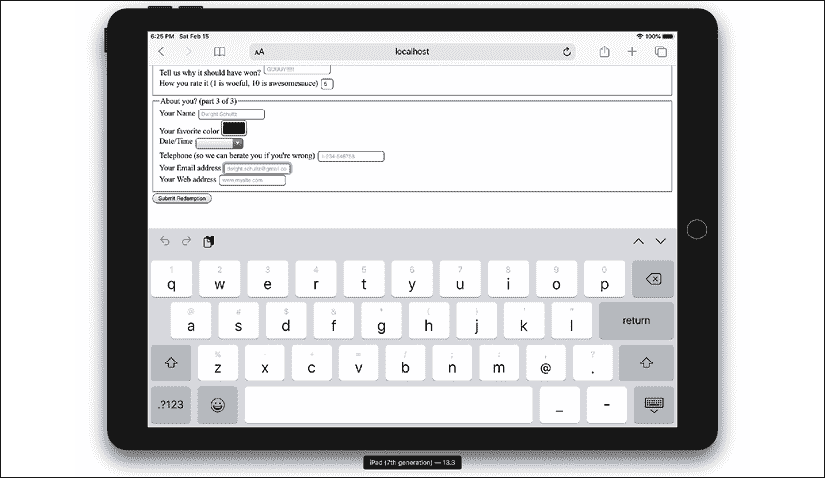</figure>

图 10.7:软件键盘通常会适应输入类型

## 数字输入类型

您可以设置一个输入字段，以期望一个如下所示的数字:

```html
type="number" 
```

如果将输入类型设置为`number`，浏览器有时还会添加一些名为“spinner”控件的 UI 组件。 这些是用户界面的微小部分，允许用户轻松地向上或向下点击来改变值输入。

下面是一个代码示例:

```html
<div>
  <label for="yearOfCrime">Year Of Crime</label>
  <input
    id="yearOfCrime"
    name="yearOfCrime"
    type="number"
    min="1929"
    max="2015"
    required
  />
</div> 
```

下面的截图显示了它在 Chrome 浏览器中的样子，完整的“旋转器”:

<figure class="mediaobject"></figure>

图 10.8:在桌面浏览器上，数字输入显示了“微调器”

下面是`type="number"`如何在 iPad 上显示软件键盘。 注意默认情况下所有数字键的显示方式:

<figure class="mediaobject">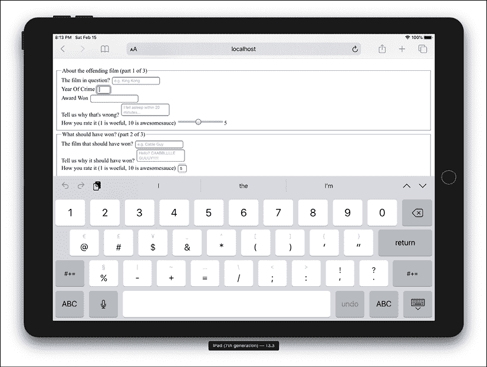</figure>

图 10.9:软件键盘默认显示数字输入

如果不输入不同浏览器实现的数字会发生什么? 例如，在提交表单之前，Firefox 什么都不做，这时它会显示一个警告。 另一方面，Safari 什么也不做，只是让表单被提交。

### 使用 min 和 max 来创建数字范围

你会注意到在前面的代码示例中，我们设置了最小和最大允许范围:

```html
type="number" min="1929" max="2015" 
```

超出这个范围的数字应该得到特殊对待。

然而，您可能不会惊讶于`min`和`max`范围的浏览器实现是多种多样的。 例如，Chrome 和 Firefox 显示一个警告，而 Safari 什么也不做。

### 改变步长增量

您可以使用`step`属性改变各种输入类型的微调控件的步骤增量(粒度)。 例如，每次步骤 10 个单元:

```html
<input type="number" step="10" /> 
```

## url 输入类型

你可以设置一个输入字段来期望一个这样的 URL:

```html
type="url" 
```

如您所料，`url`输入类型用于 URL 值。 与`tel`和`email`输入类型类似，它的行为几乎与标准文本输入相同。 然而，一些浏览器在提交不正确的值时向提供的警告消息添加特定的信息。 下面是包含`placeholder`属性的代码示例:

```html
<div>
  <label for="web">Your Web address</label>
  <input id="web" name="web" type="url" placeholder="http://www.mysite.com" />
</div> 
```

下面的截图显示了在 Chrome 中提交一个错误输入的 URL 字段时会发生什么:

<figure class="mediaobject">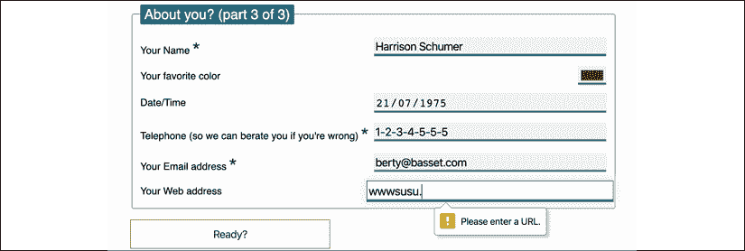</figure>

图 10.10:当输入与类型不匹配时，Chrome 将显示一个警告

像`type="email"`一样，触屏设备经常基于这种输入类型修改软件键盘。 下面的屏幕截图显示了 iPad 的软件键盘在输入类型设置为`url`时的变化情况:

<figure class="mediaobject">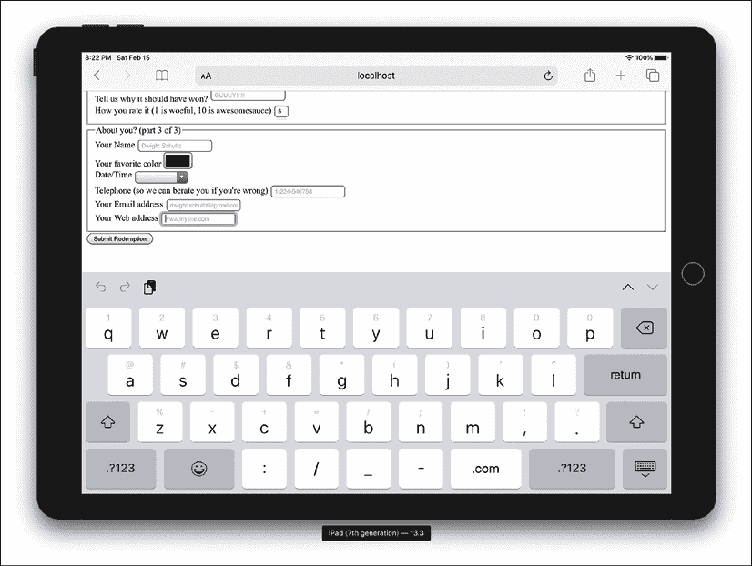</figure>

图 10.11:适应 url 输入的软件键盘

注意到“。com”键了吗? 因为我们使用了`url`输入类型，所以软件键盘提供了一个键来方便地实现顶级域补全。

在 iOS 上，如果你不想访问。com 网站，你可以按住这个按钮来访问其他一些流行的顶级域名。

## 电话输入类型

您可以设置一个输入字段来期望一个电话号码类型的值，像这样:

```html
type="tel" 
```

这里有一个更完整的例子:

```html
<div>
  <label for="tel">Telephone (so we can berate you if you're wrong)</label>
  <input
    id="tel"
    name="tel"
    type="tel"
    placeholder="1-234-546758"
    autocomplete="off"
    required
  />
</div> 
```

浏览器很少对`tel`输入类型进行验证。 当输入不正确的值时，它们无法提供适当的警告消息。

然而，更好的消息是，与`email`和`url`输入类型一样，触屏设备通常周到地使用经过修改的软件键盘来适应这类输入，以便轻松完成; 下面是用 iPad(运行 iOS 13.3)访问时的`tel`输入类型:

<figure class="mediaobject"></figure>

图 10.12:适应电话输入的软件键盘

注意到键盘区域缺少字母字符了吗? 这使得用户可以更快地以正确的格式输入值。

如果 iOS Safari 中电话号码的默认蓝色让您在使用`tel`输入时感到不快，您可以使用以下选择器`a[href^=tel] { color: inherit; }`对其进行修改。 这将把它们设置为父元素的颜色。

## 搜索输入类型

你可以设置一个输入作为一个搜索类型，像这样:

```html
type="search" 
```

`search`输入类型的工作方式类似于标准文本输入。 这里有一个例子:

```html
<div>
  <label for="search">Search the site...</label>
  <input id="search" name="search" type="search" placeholder="Wyatt Earp">
</div> 
```

与之前的许多输入类型一样，软件键盘(比如移动设备上的键盘)通常提供更适合的键盘。

## 模式输入属性

你可以设置一个输入来期望一个特定的模式输入，像这样:

```html
pattern="" 
```

注意，不是输入类型。 然而，它是一种与浏览器通信的方法，我们期望输入某个模式。

`pattern`属性允许您通过正则表达式指定应该在给定输入字段中允许的数据语法。

**学习正则表达式**

如果您以前从未遇到过正则表达式，我建议从这里开始:[http://en.wikipedia.org/wiki/Regular_expressions](http://en.wikipedia.org/wiki/Regular_expressions)。 正则表达式作为一种匹配字符串的方法在许多编程语言中使用。 虽然这种格式一开始令人生畏，但它们非常强大和灵活。 例如，您可以构建一个正则表达式来匹配密码格式，或者选择一个特定样式的 CSS 类命名模式。 为了帮助构建自己的正则表达式模式并直观地了解它们是如何工作的，我建议从基于浏览器的工具(如[http://www.regexr.com/](http://www.regexr.com/)开始。

下面的代码就是一个例子:

```html
<div>
  <label for="name">Your Name (first and last)</label>
  <input
    id="name"
    name="name"
    pattern="^([\D]{2,30}\s+)+([a-zA-Z]{2,30})$"
    placeholder="Dwight Schultz"
    required
  />
</div> 
```

这就是我对这本书的承诺，我在互联网上搜索了整整 458 秒，以找到一个符合基本的姓和名语法(抱歉，仅限西方语言)的正则表达式。 这并不是防弹的，但应该确保输入的值不是一个数字(抱歉，“R2D2”，你将不得不在其他地方登记你的电影投诉)，并且是由至少两个 2 到 30 个字符之间的空格分隔值组成。

通过在`pattern`属性中输入正则表达式值，它使支持的浏览器期望匹配的输入语法。 然后，当与所需的属性一起使用时，不正确的条目在支持浏览器时将得到以下处理。 在这个例子中，我尝试在提交表单时不提供姓氏:

<figure class="mediaobject">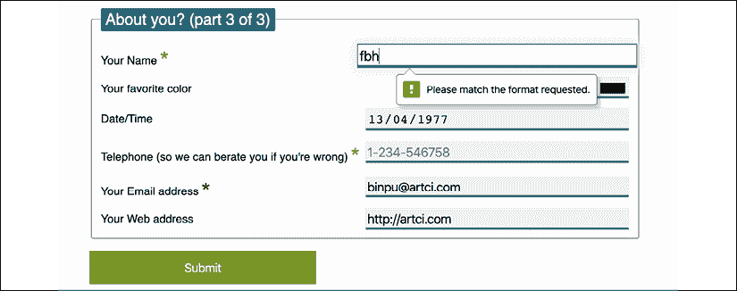</figure>

图 10.13:模式类型提供了一个模糊的警告，但允许您创建定制的需求

## 颜色类型输入

要设置输入字段来接收十六进制颜色值?

```html
input type="color" 
```

输入类型`color`调用主机操作系统的颜色选择器，允许用户选择十六进制值的颜色值。 下面的代码是一个示例:

```html
<div>
  <label for="color">Your favorite color</label>
  <input id="color" name="color" type="color" />
</div> 
```

老实说，这不是我在实践中需要的类型，但不难想象在某些场景中它会非常方便。

## 日期和时间

如果你曾经在网上买过一场活动的门票，你很有可能使用过这样或那样的日期选择器。 新的`date`和`time`输入类型背后的思想是为了浏览器能够为这种情况提供一致的用户界面。

可悲的是,在 2020 年写这篇文章时,很难建议使用本地日期和时间的输入类型的支持是完全缺席 iOS 和 Mac 上 Safari。这不是一个完全无用的情况下,对于所有 HTML5 的输入类型不支持输入将会表现得像一个正常的输入框。 但是，如果这些浏览器上有任何用户(很有可能您就是这样)，那么很可能需要 JavaScript 解决方案来提供任何类型的一致体验。

无论如何，希望这些浏览器能很快得到支持，让我们考虑一下`date`和`time`输入类型的核心功能。

### 日期输入类型

下面的代码就是一个例子:

```html
<input id="date" type="date" name="date" /> 
```

下面是在支持浏览器中生成的 UI:

<figure class="mediaobject">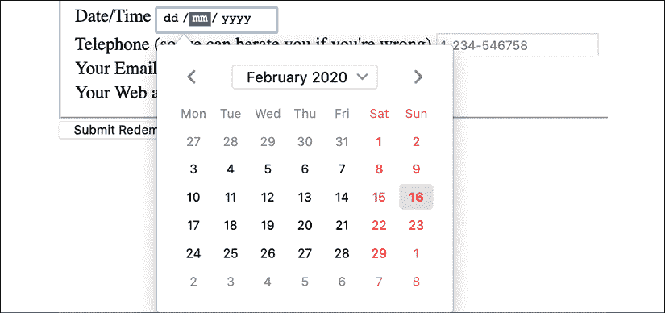</figure>

图 10.14:浏览器提供的日期选择界面

有各种不同的日期和时间输入类型可供选择。 下面是对其他项目的简要概述。

### 月输入类型

下面的代码就是一个例子:

```html
<input id="month" type="month" name="month" /> 
```

该界面允许用户选择单个月份，并设置输入值为年份和月份; 例如,“2012 - 06 年。” 下面是 iOS 显示的用户界面截图:

<figure class="mediaobject">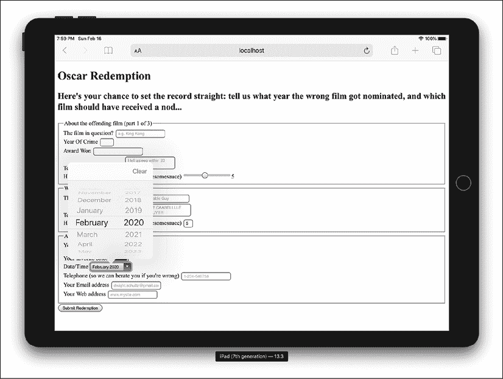</figure>

图 10.15:记住，不同的操作系统通常有自己的 UI 来实现相同的目标

### 周输入类型

下面的代码是一个示例:

```html
<input id="week" type="week" name="week" /> 
```

当使用`week`输入类型时，选择器允许用户选择年内的单个星期，并提供“2012-W47”格式的输入。

下面的截图显示了它在 Chrome 和 Microsoft Edge 中的样子，这两者都是相同的代码，目前只有浏览器支持它:

<figure class="mediaobject">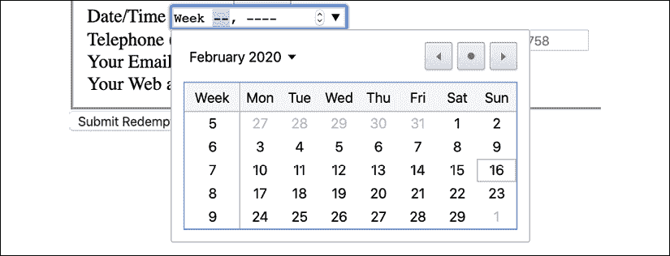</figure>

图 10.16:在支持浏览器的情况下，周输入类型有自己的数据选择器样式

## 时间输入类型

下面的代码是一个示例:

```html
<input id="time" type="time" name="time" /> 
```

输入类型`time`允许 24 小时格式的值; 例如,“23:50。”

在支持浏览器方面，它像标准输入一样显示，但带有额外的微调控件，而且它只允许相关的时间值。

触摸设备显示自己的 UI。 以下是它在 iOS 上的表现:

<figure class="mediaobject">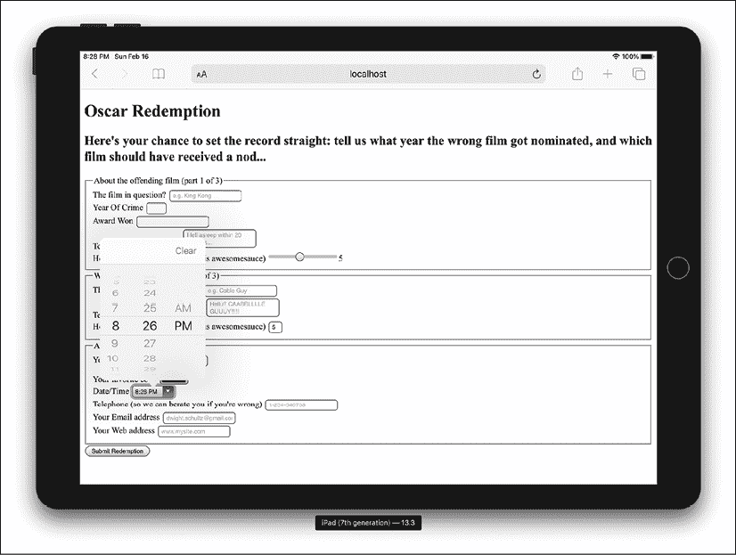</figure>

图 10.17:时间输入类型在支持浏览器时产生特定的界面片段

## 范围输入类型

range input类型创建一个滑块界面元素。 这里有一个例子:

```html
<input type="range" min="1" max="10" value="5" /> 
```

下面的截图显示了它在 Firefox 中的样子:

<figure class="mediaobject"></figure>

图 10.18:范围滑块默认不显示数值

默认范围是 0 到 100。 但是，通过指定`min`和`max`值，在我们的示例中，我们将其限制在 1 到 10 之间。

我在使用`range`输入类型时遇到的一个大问题是，当前值永远不会显示给用户。 虽然范围滑块只用于模糊的数字选择，但我经常希望在值变化时显示它。 目前，HTML5 还无法做到这一点。 然而，如果您必须显示滑块的当前值，可以使用一些简单的 JavaScript 轻松实现。 将前面的示例修改为以下代码:

```html
<input
  id="howYouRateIt"
  name="howYouRateIt"
  type="range"
  min="1"
  max="10"
  value="5"
  onchange="showValue(this.value)"
/>
<span id="range">5</span> 
```

我们添加了两个东西，一个`onchange`属性，还有一个`range`的`id`元素。 现在，我们将添加以下一小段 JavaScript:

```html
<script>
  function showValue(newValue)
  {
    document.getElementById("range").innerHTML=newValue;
  }
</script> 
```

它所做的就是获取范围滑块的当前值，并在元素中以`range`的`id`(我们的`span`标记)显示它。 然后，您可以使用您认为合适的任何 CSS 来更改值的外观。 一旦我们开始对表单进行样式化，我们马上就会这样做。

还有一些与表单相关的特性是 HTML5 的新特性。 您可以在这里阅读完整的规格:[http://www.w3.org/TR/html5/forms.html](http://www.w3.org/TR/html5/forms.html)。

**如何解决不支持的浏览器**

根据构建的表单类型和需要的浏览器支持类型，您可能会发现[https://github.com/Modernizr/Modernizr/wiki/HTML5-Cross-Browser-Polyfills#web-forms](https://github.com/Modernizr/Modernizr/wiki/HTML5-Cross-Browser-Polyfills#web-forms)很有用。 它是一个 JavaScript 库列表，可以用来为浏览器添加对我们刚才看到的许多特性的支持。

# 使用 CSS 样式化 HTML5 表单

我们现在已经构建了基于 HTML5 的表单，但我们需要让它在不同视口尺寸下更具视觉吸引力。 通过应用我们在前几章中学到的一些技巧，我认为我们可以显著地改善我们形体的美感。

您可以在`example_10-02`查看样式表单，并且记住，如果您还没有示例代码，您可以在[http://rwd.education](http://rwd.education)获取它。

在这个示例中，我还包含了样式表的两个版本:`styles.css`是包含供应商前缀(通过 Autoprefixer 添加)的版本，`styles-unprefixed.css`是原始编写的 CSS。 如果您想了解如何应用任何东西，后者可能更容易查看。

下面是应用了基本样式的表单在一个小视口中的样子:

<figure class="mediaobject">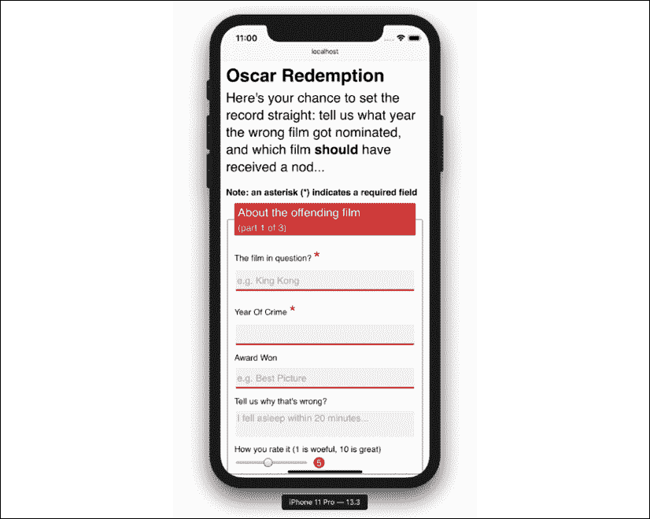</figure>

图 10.19:应用了基本样式的移动表单

而在这里是一个更大的视口:

<figure class="mediaobject">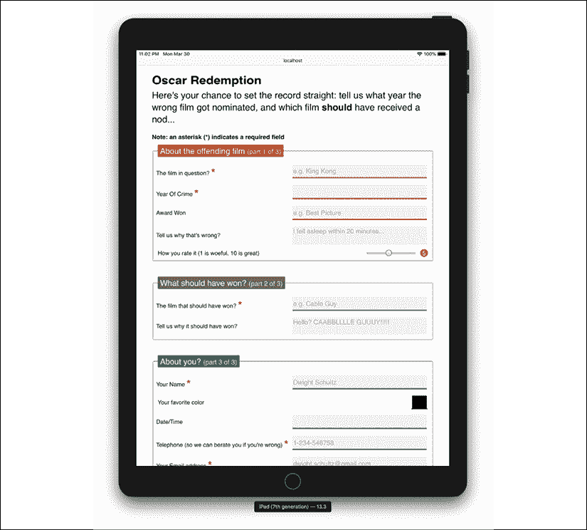</figure>

图 10.20:我们同样的表单为更宽的视图设计

如果你观察 CSS，你会发现我们在前面章节中看到的许多技术都得到了应用。 例如，Flexbox(*第 4 章*)用于为元素创建均匀间距和灵活性。 使用了转换和转换(*第 9 章*)，以便聚焦的输入字段增长，ready/submit 按钮在获得焦点时垂直翻转。 盒子阴影和渐变(*第七章*)被用来强调形体的不同区域。 媒体查询(*第 3 章*)被用来为不同的视口大小切换 Flexbox 方向，而最近的 CSS 选择器(*第 6 章*)被用来否定选择器。

我们在这里不再详细讨论这些技术。 相反，我们将关注几个特性。 首先，如何直观地显示必需的字段(对于奖励积分，显示已输入的值)，其次，当一个字段获得用户关注时，如何创建一个“填充”效果。

## 表示必填字段

我们可以仅使用 CSS 向用户指示所需的输入字段。 例如:

```html
input:required {
  /* styles */
} 
```

使用该选择器，我们可以向必需字段添加边框或大纲，或者在字段内添加`background-image`。 基本上，前途无量! 我们还可以使用一个特定的选择器来瞄准需要的输入字段，但只在它获得焦点时才使用。 例如:

```html
input:focus:required {
  /* styles */
} 
```

然而，这会将样式应用到`input`本身。 如果我们想要修改相关的`label`元素的样式，该怎么办? 我决定在标签的一侧用一个小星号表示必需的字段。 但这带来了一个问题。 一般来说,CSS 只有让我们影响变化对元素如果他们的孩子一个元素,该元素本身,或一般或相邻元素的接收“状态”(我说的状态,我说的是`hover`,`focus`,`active`,`checked`,等等)。 在下面的例子中，我使用的是`hover`，但这对于触屏设备来说显然是有问题的:

```html
.item:hover .item-child {
} 
```

使用前面的选择器，当项目被悬停在`item-child`上时，样式将被应用到:

```html
.item:hover ~ .item-general-sibling {
} 
```

在这个选择器中，当项目被悬停在上面时，如果它和`item`处于相同的 DOM 级别，样式将被应用到`item-general-sibling`，并遵循它:

```html
.item:hover + .item-adjacent-sibling {
} 
```

在这里，当悬停项目时，如果`item-adjacent-sibling`是`item`的相邻兄弟元素(就在 DOM 中`item-adjacent-sibling`的后面)，样式就会应用到它。

那么，回到我们的问题上来。 如果我们有一个像这样带有标签和字段的表单，`label`在`input`之上(为了给我们提供必要的基本布局)，它会让我们有点卡住:

```html
<div class="form-Input_Wrapper">
  <label for="film">The film in question?</label>
  <input
    id="film"
    name="film"
    type="text"
    placeholder="e.g. King Kong"
    required
  />
</div> 
```

在这种情况下，仅使用 CSS，无法根据是否需要`input`来更改`label`的样式(因为它位于标记中的`label`之后)。 我们可以切换标记中这两个元素的顺序，但这样就会在输入下面出现标签。

然而，你还记得吗，Flexbox 和 Grid 都让我们能够轻松地从视觉上逆转元素的顺序(如果你还没有这样做，请阅读*第 4 章*和*第 5 章*中的所有内容)?

这允许我们使用以下标记:

```html
<div class="form-Input_Wrapper">
  <input
    id="film"
    name="film"
    type="text"
    placeholder="e.g. King Kong"
    required
  />
  <label for="film">The film in question?</label>
</div> 
```

然后简单地将`flex-direction: row-reverse`或`flex-direction: column-reverse`应用于父级。 这些声明颠倒了其子元素的视觉顺序，允许上面标签(更小的视图)或输入向左(更大的视图)的美感。

现在，我们可以实际提供一些必需字段的指示，以及它们何时接收了输入。

多亏了我们修改的标记，相邻的兄弟选择器现在使这成为可能:

```html
input:required + label:after {
} 
```

这个选择器本质上是说，对于带有必需属性的输入后面的每个标签，应用所包含的规则。 下面是该部分的 CSS:

```html
input:required + label:after {
  content: '*';
  font-size: 2.1em;
  position: relative;
  top: 6px;
  display: inline-flex;
  margin-left: 0.2ch;
  transition: color 1s;
}
input:required:invalid + label:after {
  color: red;
}
input:required:valid + label:after {
  color: green;
} 
```

然后，如果您将焦点放在必需的输入上并输入相关的值，星号将颜色更改为绿色。 这是一种微妙但有益的接触。

## 创建一个背景填充效果

回到*第七章*，*惊艳的 CSS 美学*，我们学习了如何生成线性和径向梯度作为背景图像。 遗憾的是，它不可能在两个背景图像之间转换(这是有意义的，因为浏览器有效地栅格化声明为图像)。 但是，我们可以在相关属性的值之间进行转换，比如`background-position`和`background-size`。 我们将使用此功能在`input`或`textarea`接收焦点时创建填充效果。

以下是添加到`input`中的属性和值:

```html
input:not([type='range']),
textarea {
  min-height: 40px;
  padding: 2px;
  font-size: 17px;
  border: 1px solid #ebebeb;
  outline: none;
  transition: transform 0.4s, box-shadow 0.4s, background-position 0.2s;
  background: radial-gradient(400px circle, #fff 99%, transparent 99%), #f1f1f1;
  background-position: -400px 90px, 0 0;
  background-repeat: no-repeat, no-repeat;
  border-radius: 0;
  position: relative;
}
input:not([type='range']):focus,
textarea:focus {
  background-position: 0 0, 0 0;
} 
```

在第一个规则中，一个纯白色径向梯度正在生成，但定位在视野之外。 后面的背景颜色(`radial-gradient`之后的十六进制值)没有偏移，因此提供了一个默认颜色。 当`input`获得焦点时，`radial-gradient`上的`background-position`被设置回默认值，因为我们在`background-image`上有`transition`设置，所以我们在两者之间有一个很好的过渡。 这样的视觉结果是，当聚焦时，输入被不同的颜色“填充”。

# 总结

在本章中，我们学习了如何使用一系列新的 HTML5 表单属性。 它们使我们能够使表单更可用，因此它们捕获的数据也更相关。

我们还使用了一些技巧，我们在这本书中学到的，以重新设计我们的形式，并使其布局响应的设备的约束，它是使用。

我们的响应式 HTML5 和 CSS 之旅已经接近尾声。 虽然我们在一起的时间里聊了很多，但我意识到我不可能把你遇到的每一种情况的所有信息都告诉你。 因此，在本书的最后一章中，我想从更高的层面来看待响应式网页设计，并尝试联系一些可靠的最佳实践，以使您的下一个/第一个响应式项目在正确的基础上。