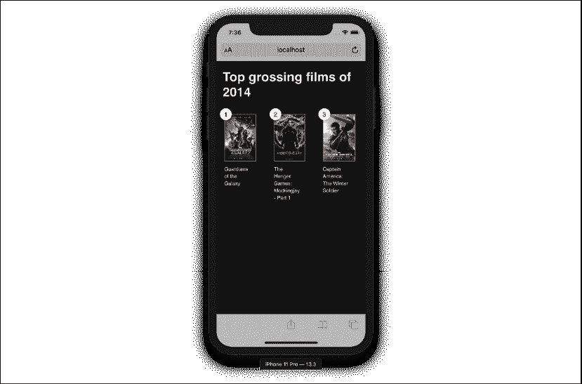
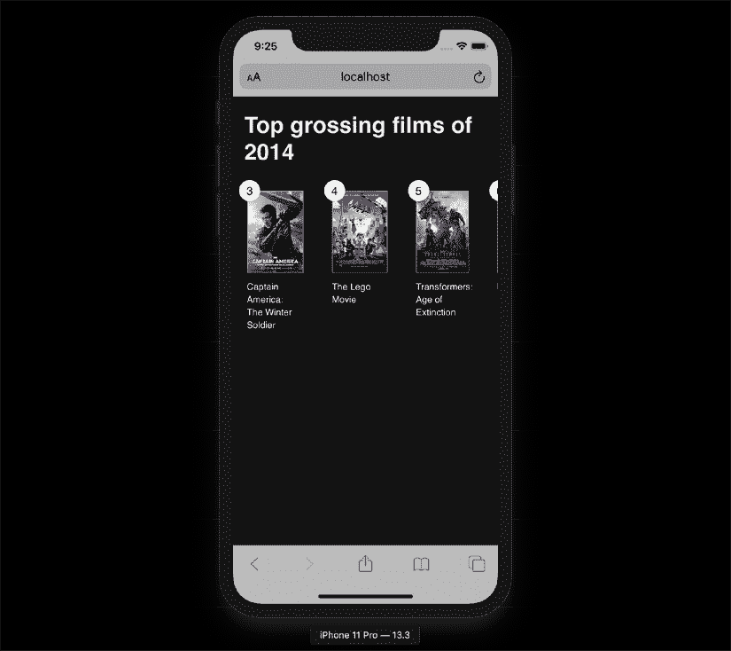
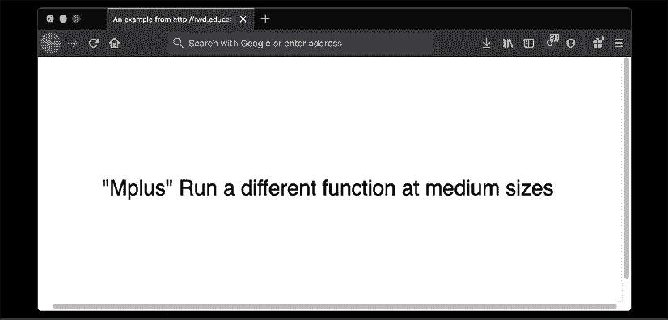
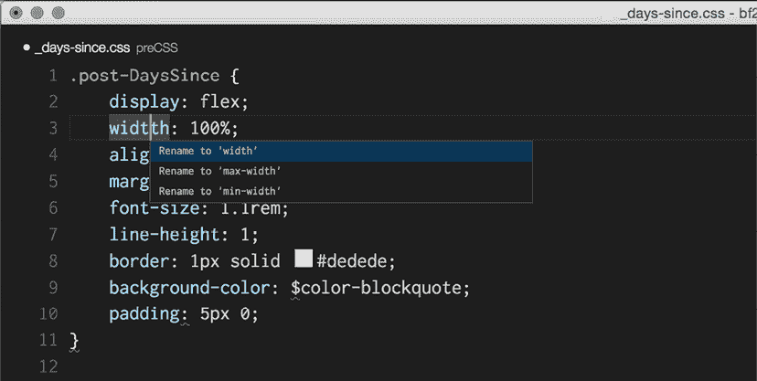
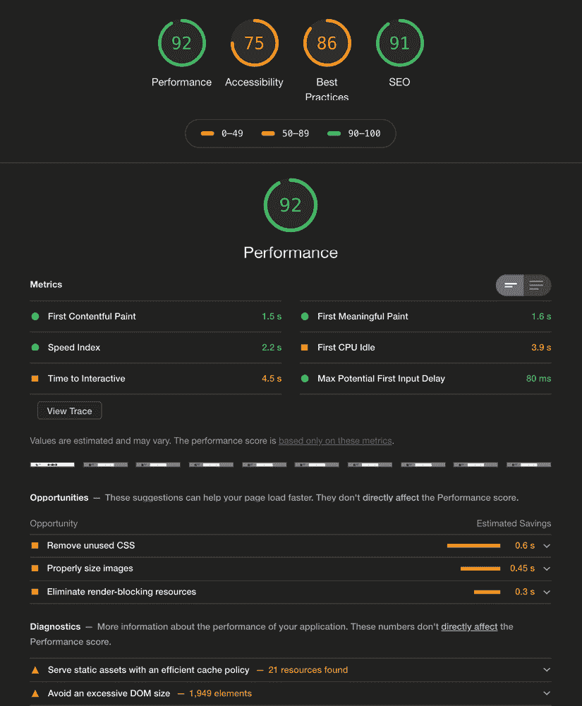

# 十一、附加技巧和最终建议

在我最喜欢的故事和电影中，通常会有这样一个场景:一位导师向英雄传递有价值的建议和一些魔法物品。 你知道这些东西会很有用; 你只是不知道什么时候，怎么做。

好吧，我想在最后一章扮演导师的角色——除此之外，我的头发已经褪了，我也不具备英雄角色的长相。 我希望你，我的好徒弟，能再占用我一点时间让我在你开始你的追寻之前，给你最后几句忠告。

这一章一半是哲学思考和指导，一半是不相关的技巧和技巧。 我希望，在你的探险中，这些技巧将被证明是有用的。

以下是我们将要介绍的一些建议:

*   分割长 url
*   删除文本
*   创建水平滚动面板
*   使用 CSS 滚动快照
*   使用 CSS 滚动行为平滑滚动
*   将 CSS 断点通信到 JavaScript

以下是我们的建议:

*   在浏览器中获取设计
*   真实设备测试
*   拥抱渐进增强
*   定义一个浏览器支持矩阵
*   在生产中避免使用 CSS 框架
*   使用最简单的解决方案
*   在不同的视图中隐藏、显示和加载内容
*   验证器和检查工具
*   性能
*   下一个大事件

好了，现在注意了，007…

在我的日常工作中，我发现我经常使用一些 CSS 特性，而其他的几乎从不使用。 我认为分享那些我最经常使用的，特别是那些在响应式项目中反复出现的，可能会很有用。

这些没有特别的顺序。 没有什么比其他更重要。 如果你需要的话，随时都可以。

# 分割长 url

有多少次你不得不在一个很小的空间中添加一个大的 URL，然后，嗯，失望? 看看`example_11-04`。 这个问题也可以在下面的截图中看到; 注意，URL 已经超出了它所分配的空间:

<figure class="mediaobject"></figure>

图 11.1:长 url 可能会出现问题

用一个简单的 CSS 声明就可以很容易地解决这个问题，碰巧的是，它也可以在早至 5.5 的 Internet Explorer 的老版本中工作! 添加:

```html
word-wrap: break-word; 
```

到包含元素，它会产生以下效果:

<figure class="mediaobject"></figure>

图 11.2:使用 break-word，我们可以驯服长 url

嘿，很快，长的 URL 现在完美地封装了!

# 删除文本

有时，您会遇到这样的情况:如果空间有限，您宁愿将文本截断而不愿将换行。 我们被训练用省略号“…”来识别它。

这在 CSS 中很简单，尽管有点冗长。

考虑这个标记(你可以在`example_11-03`中查看这个例子):

```html
<p class="truncate">
  OK, listen up, I've figured out the key eternal happiness. All you need to do is eat lots of scones.
</p> 
```

然而，我们实际上想要截断文本为 520px 宽，所以它看起来像这样:

<figure class="mediaobject"></figure>

图 11.3:当保持垂直高度不变至关重要时，截断是方便的

这里的 CSS 使之发生:

```html
.truncate {
  width: 520px;
  overflow: hidden;
  text-overflow: ellipsis;
  white-space: nowrap;
} 
```

这些属性中的每一个都需要进行截断。

您可以在这里阅读`text-overflow`属性的规范:[https://drafts.csswg.org/css-overflow-3/#text-overflow](https://drafts.csswg.org/css-overflow-3/#text-overflow)。

当内容的宽度超过定义的`width`时，它将被截断。 `width`也可以设置为一个百分比，例如，如果它在一个灵活的容器中，则可以设置为 100%。

我们设置`overflow: hidden`以确保隐藏超出盒子的任何内容。

当内容溢出时，`text-overflow: ellipsis`在正确的位置创建省略号符号，以表示溢出内容。 如果愿意，可以将其设置为`clip`。 在这种情况下，内容只是在它溢出的地方被剪切，可能是中间字符。

需要使用`white-space: nowrap`属性/值对来确保内容不会被包装到周围的元素中，这是它默认的做法。

尽管有一个规范:[https://drafts.csswg.org/css-overflow-3/#propdef--webkit-line-clamp](https://drafts.csswg.org/css-overflow-3/#propdef--webkit-line-clamp)，但仍然没有一个可靠的跨浏览器的方法来进行多行截断。 现在，你可以使用`-webkit-line-clamp`。 然而，我不建议这样做，因为它仅仅是出于兼容性的原因而得到支持，一旦“真正的”版本被广泛实现，它就可能被取代。

# 创建水平滚动面板

当我说水平滚动面板时，希望你们知道我的意思。 水平滚动面板在 iOS App 和谷歌 Play Store 中很常见，用于显示相关内容(电影、专辑等)的面板。 当有足够的水平空间时，所有的项目都是可见的。 然而，当空间有限时(想想移动设备)，面板可以从一边滚动到另一边。

我创建了一个滚动面板，上面是 2014 年最卖座的 10 部电影。 你会记得这个场景从*第 6 章*，并且它对年份没有意义; 我刚选了一个!

在运行 iOS 13.3 的 iPhone 上是这样的:

<figure class="mediaobject"></figure>

图 11.4:水平滚动面板

标记模式如下所示; 注意，为了简洁起见，我只显示列表中的第一项:

```html
<nav class="Scroll_Wrapper">
  <figure class="Item">
    
    <figcaption class="Caption">Guardians of the Galaxy</figcaption>
  </figure>
</nav> 
```

您可以在`example_11_02`中找到完整的代码。

通常，如果您在容器中添加越来越多的项，它将被包装到下一行。 这种技术的关键是`white-space`属性，它实际上从 CSS 2.1([http://www.w3.org/TR/CSS2/text.html#white-space-prop](http://www.w3.org/TR/CSS2/text.html#white-space-prop))就出现了。 此外，我们刚才还用它来截断文本。 通过将其设置为`nowrap`，我们可以防止内容包装。

要使滚动工作，我们只需要一个比其内容总和更窄的包装器，并将其设置为在*x*轴中自动溢出。 这样，如果有足够的空间，它就不会滚动，但如果没有，它就会滚动。

简单来说，我们需要这个 CSS:

```html
.Scroll_Wrapper {
  width: 100%;
  white-space: nowrap;
  overflow-x: auto;
  overflow-y: hidden;
}
.Item {
  display: inline-flex;
} 
```

我们在这里对包装元素的子项目使用`inline-flex`，但它也可以是`inline`、`inline-block`或`inline-table`。

为了让界面看起来更美观，我们可以隐藏滚动条。

不幸的是，要做到这一点，我们需要应用一些不同的声明来覆盖不同的浏览器实现。 有一个是针对非常老的 Internet Explorer 的，一个是针对 Chrome、Safari 和 Microsoft Edge 的，还有一个是在一个新的规范草案中标准化的，这就是 Firefox 的实现。 现在更新的`.Scroll_Wrapper`规则看起来像这样:

```html
.Scroll_Wrapper {
  width: 100%;
  white-space: nowrap;
  overflow-x: auto;
  overflow-y: hidden;
  /*Remove the scrollbars in supporting versions of older IE*/
  -ms-overflow-style: none;
  /* Hide scrollbar in Firefox */
  scrollbar-width: none;
}
/*Stops the scrollbar appearing in Safari, Chrome and MS Edge browsers*/
.Scroll_Wrapper::-webkit-scrollbar {
  display: none;
} 
```

CSS 滚动条模块级别 1 的标准草案可以在[https://drafts.csswg.org/css-scrollbars-1/](https://drafts.csswg.org/css-scrollbars-1/)找到。

剩下的代码只是美感，与滚动没有直接关系。 然而，这是一个我们可以用网格重新创建的模式。

## 水平滚动面板与网格

在玩 Grid 的时候，我意识到用 CSS Grid 也可以很容易地制作一个水平滚动面板。 让我们假设我们想要利用 Grid。 我们可以保留现有的模式，并逐步增强网格:

```html
@supports (display: grid) {
  .Scroll_Wrapper {
    display: grid;
    grid-auto-flow: column;
    max-width: min-content;
    grid-template-rows: auto;
  }
} 
```

在本例中，我们将包装元素设置为网格，并让它根据需要自动流到任意多的列中。 设置`max-width: min-content`是关键，否则，当有更多可用空间时，列就会增长，在本例中，这不是我们想要的。

是的，既然我们已经走了这么远，我们也可以通过添加 CSS 滚动 Snap 到混合中来“锦上添花”!

# CSS 快速滚动

CSS 滚动快照将内容滚动到容器中预定义的点。 同样，它是一种用户界面模式，在本地应用程序、应用商店和 carousel 之类的界面中很常见，但过去需要 JavaScript 来实现。

自 2014 年以来，浏览器中出现了不同的 CSS 滚动快照实现和名称。 然而，一个稳定的规范和兼容的实现的出现是需要时间的。 您可以在[https://www.w3.org/TR/css-scroll-snap-1/](https://www.w3.org/TR/css-scroll-snap-1/)上阅读官方规范。

让我们使用 CSS 滚动抓拍来添加滚动抓拍功能到我们的横向“2014 年最卖座电影”容器。

## scroll-snap-type 属性

首先，我们为滚动容器定义`scroll-snap-type`。 在这里，我们可以决定容器是否要在`x`、`y`或`both`轴上滚动快照。

这个属性还允许定义所应用的滚动抓取的严格程度。 `mandatory`值是我一直选择的值，除非我正在重置滚动快照，此时您可以使用`none`。 `none`将恢复滚动快照，使其行为与标准滚动容器类似。

`mandatory`所做的是确保如果一个项目在容器内部分滚动(例如，左侧离开视口一定数量)，那么它将被“快速”进入或退出视图。

还有一个`proximity`值。 这样做的结果是将捕捉留给浏览器来决定。

理解为什么您可能偶尔需要使用`proximity`是很重要的。 假设旋转木马中的物品总是比视口大。 因为，使用`mandatory`，它总是会折断，您可能在推进滚动面板时遇到麻烦。 将其设置为`proximity`意味着内容将保持可访问性，因为浏览器将决定应该留下多少空间来容纳滚动。

尽管如此，在我们的实例中，因为我们知道单元格的宽度不会超过视口的宽度，所以我们将应用`mandatory`来获得一致的体验。

因此，我们的容器将用这个额外的块进行修改。 注意，我们将它包装在一个特性查询中:

```html
@supports (scroll-snap-type: x mandatory) {
  .Scroll_Wrapper {
    scroll-snap-type: x mandatory;
  }
} 
```

现在，如果您刷新浏览器并尝试滚动面板，您可能会感到失望。 本身没有任何作用。 现在我们需要将`scroll-snap-align`属性应用于子项。

## scroll-snap-align 属性

`scroll-snap-align`属性控制滚动捕捉容器内的项目将被捕捉到的位置。 的选项是:

*   `none`重置项目
*   将物品夹紧到滚动夹紧区域的开始
*   将物品夹到滚动夹块区域的末端
*   将物品夹紧到滚动夹紧区域的中心

因此，在我们的功能查询中，让我们添加`.Item`并将其设置为捕捉`start`:

```html
@supports (scroll-snap-type: x mandatory) {
  .Scroll_Wrapper {
    scroll-snap-type: x mandatory;
  }
  .Item {
    scroll-snap-align: start;
  }
} 
```

现在，如果你滚动，你会看到项目在它们的容器中折断。 然而，有一个小问题。 当项目开始抓拍时，我们把数字放在每个胶片的左上角，它被切断了。 你自己看:

<figure class="mediaobject"></figure>

图 11.5:我们需要修正在左边被截断的数字

## scroll-padding 属性

幸运的是，规范的作者已经考虑到了这种可能性。 在容器上，我们可以添加一些填充到滚动snap 区域。 这意味着，当浏览器决定将项目捕捉到何处时，会考虑到这个距离。 它被添加到这里的`.Scroll_Wrapper`:

```html
@supports (scroll-snap-type: x mandatory) {
  .Scroll_Wrapper {
    scroll-snap-type: x mandatory;
    scroll-padding: 0 20px;
  }
  .Item {
    scroll-snap-align: start;
  }
} 
```

现在，当我们滚动的时候，它会考虑到填充，因为它会让我们的滚动停止:

<figure class="mediaobject"></figure>

图 11.6:应用滚动填充解决了我们的问题

**滚动快照停止属性**

默认情况下，过多的滚动动作会使一些条目越过滚动捕捉点。 使用`scroll-snap-stop`，应该可以让浏览器在每个快照点停止。 只有两个值可以选择:`normal`，这是浏览器默认的操作; 或`always`，以确保不会跳过滚动快照点。

坏消息是，在我写这篇文章的时候，`scroll-snap-stop`只支持 Chrome 和 Edge。 因此，在将其添加到项目之前，请检查浏览器支持，并好奇为什么它不能像预期的那样工作!

CSS 滚动快照是一个非常令人满意的功能! 只需几行代码，我们就可以在 CSS 中实现所实现的功能。 最棒的是，我们可以把它作为一种增强。 如果用户的浏览器支持它，那就太好了。 如果没有，也没什么大不了的。

## 使用 CSS 滚动行为平滑滚动

HTML 最古老的功能之一是锚定到文档中的不同点的能力。 您在页面上设置一个链接，而不是将用户发送到另一个页面，而是立即将用户带到同一页面的不同位置。

通常，这样的功能在*y*轴上，或者在页面的下方。 然而，它在*x*轴水平方向上也同样有效。

从历史上看，跳到锚环总是有点不和谐。 当用户被立即传送到页面上的新点时，没有向用户传达刚刚发生的事情的可视性。 多年来，人们在 JavaScript 的帮助下，通过有效地动画滚动动作，解决了这个常见问题。

现在 CSS 为我们提供了一个更简单的选择:`scroll-behavior`属性。

我将添加“开始”和“结束”锚点到我们刚刚创建的滚动面板的两端，并在滚动面板下方添加两个链接。 正如您可能想象的那样，默认情况下，单击“结束”立即将面板滚动到结束。 但是，如果我们将`scroll-behavior: smooth`添加到滚动面板中，我们将获得一个非常平滑的滚动行为。 好了!

可悲的是，这是图像无法传达的东西。 然而，如果您打开`example_11-02`，那么您可以自己玩它。

# 链接 CSS 断点到 JavaScript

通常情况下，基于 web 的任何交互都会涉及到 JavaScript。 当你在开发一个响应性的项目时，你可能会想要在不同的视口大小上做不同的事情。 不仅在 CSS 中，在 JavaScript 中也是如此。

让我们假设当我们到达 CSS 中的某个断点时，我们想要调用某个 JavaScript 函数(记住“断点”是用来定义响应式设计中应该发生显著变化的点的术语)。 让我们假设断点为 47.5rem(根字体大小为 16px，相当于 760px)，我们只希望以该大小运行函数。 有一个叫做`matchMedia`的 JavaScript API，它允许你在 JavaScript 中进行测试，就像在 CSS 中一样。 显而易见的解决方案是使用它并创建一个类似于媒体查询的测试。

然而，当我们改变视口大小时，这仍然意味着要在两个地方更新和更改这些值。

谢天谢地，还有更好的办法。 我第一次看到这个技巧是在 Jeremy Keith 的网站上:[http://adactio.com/journal/5429/](http://adactio.com/journal/5429/)。

您可以在`example_10-01`找到完整的代码。 然而，其基本思想是，在 CSS 中，我们插入一些可以被 JavaScript 轻松阅读和理解的内容。

在 CSS 中考虑这一点:

```html
@media (min-width: 20rem) {
  body::after {
    content: 'Splus';
    font-size: 0;
  }
}
@media (min-width: 47.5rem) {
  body::after {
    content: 'Mplus';
    font-size: 0;
  }
}
@media (min-width: 62.5rem) {
  body::after {
    content: 'Lplus';
    font-size: 0;
  }
} 
```

对于我们想要与 JavaScript 通信的每个断点，我们使用`after`伪元素(您也可以使用`before`，因为两者都一样好)，并将该伪元素的内容设置为断点的名称。 在我们的示例中，我将`'Splus'`用于小屏幕和更大屏幕，`'Mplus'`用于中屏幕和更大屏幕，`'Lplus'`用于大屏幕和更大屏幕。 您可以使用任何对您有意义的名称，并在它对您有意义时更改值(例如，不同的方向、不同的高度、不同的宽度等等)。

记住，`::before`和`::after`伪元素作为影子 DOM 元素插入到 DOM 中。 `::before`伪元素作为其父元素的第一个子元素插入，`::after`作为最后一个子元素插入。

有了这个 CSS 集，我们可以浏览 DOM 树并看到我们的`::after`伪元素:

<figure class="mediaobject"></figure>

图 11.7:我们可以使用伪元素与 JavaScript 通信

然后，在我们的 JavaScript 中，我们可以读取这个值。 首先，我们把这个值赋给一个变量:

```html
var size = window
  .getComputedStyle(document.body, ':after')
  .getPropertyValue('content'); 
```

一旦我们有了它，我们就可以用它做点什么。 为了证明这个概念，我做了一个简单的自调用函数(自调用只是意味着它在浏览器解析它时被执行)，在页面加载时将媒体查询标签写入主体; 这可能是一个不同的值，取决于视口的大小:

```html
var size = window
  .getComputedStyle(document.body, ':after')
  .getPropertyValue('content');
(function alertSize() {
  if (size.indexOf('Splus') != -1) {
    document.body.textContent =
      size + ' I will run functions for small screens';
  }
  if (size.indexOf('Mplus') != -1) {
    document.body.textContent =
      size + ' Run a different function at medium sizes';
  }
  if (size.indexOf('Lplus') != -1) {
    document.body.textContent =
      size + ' I will run functions for LARGE screens';
  }
})(); 
```

因此，当你打开这个例子时，根据你的屏幕大小，你会看到如下内容:

<figure class="mediaobject"></figure>

图 11.8:JavaScript 可以从 CSS 读取值

希望您能找到更多关于此技术的有趣用例。 我想你会发现用这种方法处理这个问题大有益处。 您将永远不会有 CSS 媒体查询和依赖宽度的 JavaScript 函数不再同步的危险。

你也可以使用 CSS 解决这个问题自定义属性,我们看着在第六章*,*CSS 选择器,排版,颜色模式,*,但我倾向于坚持这种老方法,因为这意味着它仍然适用在浏览器 Internet Explorer 11 日,缺乏支持 CSS 自定义属性。*

 *请注意，对于单页的[https://rwd.education](https://rwd.education)网站，我已经尝试使用了本书中提到的所有技术。 希望，如果你想看到一些技术在一起，建议不要太放纵，去那里看看。

我们已经到了奖励技巧部分的最后一节。 希望您在您的武器库中还有一些更方便的技巧，可以用于您开始的下一个项目。

所有剩下的，在我们这一章的最后一部分，以及这本书(请不要哭，你将开始我)，是对我来说提供我认为是任何响应性网络项目最重要的考虑。 在这里。

# 尽快在浏览器中获取设计

我所做的 web 工作响应性越好，我就越觉得在一个 T0 浏览器环境中尽快启动并运行设计就越重要。 如果你既是设计人员又是开发人员，那么事情就简单多了。 一旦你在视觉上对你需要的东西有了足够的感觉，你就可以得到它的原型，并在浏览器环境中进一步开发这个想法。

如果你主要是一名开发人员，那么这将极大地帮助设计过程，以便让设计在浏览器中存活和呼吸。 毫无疑问，我所从事的每个项目都会因为在浏览器中构建的设计而以某种方式进行修改。 这并不是最初平面设计的失败，而是意识到设计只是实现理念的一步的结果。 看到它在浏览器中工作就更近了一步。

有许多问题只能通过在浏览器中查看设计来解决。 那么所有的设备和浏览器窗口大小呢? 那么当用户打开菜单时发生的交互性呢? 入门动画应该持续多长时间? 它是不是太了? 这些设计决策只有在浏览器中实现时才能做出。

# 真实设备测试

如果可以的话，开始建立一个旧设备(手机/平板电脑)的“设备实验室”来查看你的工作。 拥有多种多样的设备是非常有益的。 它不仅让你感觉设计是如何在不同设备上工作的，而且它还在过程的早期暴露了布局/渲染特性。 毕竟，没有人愿意相信他们完成了一个项目，却被告知它在某个环境中不能正常工作。 尽早测试，经常测试! 购买额外的设备不需要花费地球。 例如，你可以在 eBay 上购买旧的手机和平板电脑，或者在它们升级时从朋友或亲戚那里购买。

使用 BrowserSync 这样的工具来同步你的工作

将 BrowserSync 整合到您的工作流中，最节省时间的工具之一就是 BrowserSync。 一旦配置完成，当您保存您的工作时，任何对 CSS 等内容的更改都被注入到浏览器中，而无需您不断刷新屏幕。 如果这还不够好，那么在同一 Wi-Fi 上查看相同 URL 的其他浏览器也会刷新。 这节省了选择每个测试设备并在每次更改时单击刷新。 它甚至同步滚动和点击。 强烈推荐:[http://browsersync.io](http://browsersync.io)。

# 拥抱渐进增强

在前面的章节中，我们已经讨论了渐进增强的概念。 这是一种我在实践中发现非常有用的开发方法，我认为它值得重复。 渐进式增强的基本思想是，所有前端代码(HTML、CSS 或 JavaScript)都是从最低公分母开始的。 然后，逐步增强代码以适应更强大的设备和浏览器。 这可能看起来很简单，但如果你习惯了另一种方法，然后设计最佳的体验，然后找到一种方法让它在较小的设备/浏览器上运行，你会发现渐进增强是一种更简单的方法。

想象一下一个低功耗、功能不佳的设备。 它没有 JavaScript，没有 Flexbox 支持，也没有 CSS3/CSS4 支持。 在这种情况下，你能做什么来提供可用的体验? 最重要的是，您应该编写有意义的、准确描述内容的 HTML5 标记。 如果您正在构建基于文本和内容的网站，这是一个更简单的任务。 在这种情况下，集中精力正确地使用`main`、`header`、`footer`、`article`、`section`和`aside`等元素。 它不仅可以帮助您识别代码的不同部分，而且还可以为用户提供更大的可访问性，而不需要额外的成本。

如果您正在构建基于 web 的应用程序或可视化 UI 组件(旋转木马、选项卡、手风琴等)，则需要考虑如何将可视化模式提取为可访问的标记。

好的标记之所以如此重要，是因为它为所有用户提供了基本的体验。 使用 HTML 可以实现的功能越多，就越不需要使用 CSS 和 JavaScript 来支持旧浏览器。 没有人，我真的是说，没有人喜欢编写代码来支持旧浏览器。

为了进一步阅读和更好的实践例子，我推荐下面两篇文章。 他们提供的洞察力如何处理相当复杂的交互 HTML 和 CSS 的构造:[http://www.cssmojo.com/use-radio-buttons-for-single-option/ http://www.cssmojo.com/how-to-style-a-carousel/](http://www.cssmojo.com/how-to-style-a-carousel/)和。

以这种方式思考绝非易事。 然而，这是一种很可能为您提供良好服务的方法，以尽可能少地支持出现问题的浏览器。 现在，关于浏览器……

## 定义一个浏览器支持矩阵

了解 web 项目需要预先支持的浏览器和设备对开发成功的响应式 web 设计至关重要。 我们已经考虑了为什么渐进的增强在这方面如此有用。 如果操作正确，这意味着您的大部分站点即使在最古老的浏览器上也能正常运行。

然而，有时你也需要以更高的先决条件开始你的经验。 也许您正在处理一个需要 JavaScript 的项目，这种情况并不少见。 在这种情况下，您仍然可以逐步增强，但您只是从不同的起点进行增强。

无论你的起点是什么，关键是确定你的起点是什么。 然后，也只有到那时，您才能定义并同意您打算支持的不同浏览器和设备将获得什么样的视觉和功能体验。

## 功能奇偶性，而不是视觉奇偶性

让任何网站在每个浏览器中看起来和工作都是一样的，这既不现实，也不受欢迎。 除了特定浏览器特有的特性外，还有一些基本的功能考虑事项。 例如，我们必须考虑触控目标按钮和触控屏幕上与基于鼠标的设备无关的链接。

因此，作为一个响应式 web 开发人员，你的部分职责是告诉你负责的人(你的老板、客户或股东)“支持旧浏览器”并不意味着它“在旧浏览器中看起来是一样的”。 我倾向于运行的一行是，支持矩阵中的所有浏览器都将获得功能上的奇偶性，而不是视觉上的奇偶性。 这意味着，如果您有一个结帐构建，所有用户将能够通过结帐和购买商品。 对于使用更现代的浏览器的用户，可能会有更多的视觉和交互功能，但核心任务将是所有人都能完成的。

## 选择要支持的浏览器

通常，当我们谈论支持哪些浏览器时，我们谈论的是我们需要看多远。 以下是根据具体情况考虑的几种可能性。

如果它是一个现有的网站，看看访问者统计(例如，谷歌 Analytics 或类似的)。 有了一些数字，你可以做一些粗略的计算。 例如，如果支持浏览器 X 的成本小于支持浏览器 X 所产生的价值，那么就支持浏览器 X!

此外，如果统计数据中有浏览器的用户比例低于 10%，那么请回顾过去并考虑任何趋势。 在过去的 3 个月、6 个月和 12 个月里，使用情况有什么变化? 如果它目前是 6%，并且在过去 12 个月里已经减半，那么你就有更有说服力的理由考虑将该浏览器排除在特定增强功能之外。

如果是一个新项目，并且没有统计数据，我通常选择“前 2”策略。 这将是当前版本，加上每个浏览器的前两个版本。 例如，如果 Safari 13 是当前的版本，那么可以为该版本加上 Safari 12 和 Safari 11(前两个版本)提供增强功能。 对于“常青”浏览器来说，这种选择更容易，“常青”浏览器是指那些在快速发布周期中不断更新的浏览器(例如 Firefox、Chrome 和 Microsoft Edge)。

## 分层用户体验

让我们假设你的股东受过良好的教育，并参与其中。 我们还假设您有一组清晰的浏览器，希望为它们添加增强的体验。 现在我们可以开始对体验进行分层。 我喜欢保持简单，因此，在可能的情况下，我选择定义一个简单的“基础”层和一个更“增强”的层。

在这里，基本体验是站点的最小可行版本，而增强版本是功能最齐全、最美观的版本。 你可能需要在你的层中适应更大的粒度，例如，与浏览器特性相关的体验分叉; 例如，支持网格或滚动 Snap。 无论层是如何定义的，都要确保定义了它们以及您期望为每个层提供什么。 然后你可以开始编写这些层。 这就是我们在*第 6 章*，*CSS 选择器，排版，颜色模式，以及更多*中提到的功能查询等技术，将派上用场。

# 在生产中避免使用 CSS 框架

有大量的免费 CSS 框架，旨在帮助快速原型化和构建响应式网站。 最常见的两个例子是 Bootstrap([http://getbootstrap.com](http://getbootstrap.com))和 Foundation([http://foundation.zurb.com/](http://foundation.zurb.com/))。 虽然它们是很棒的项目，特别是对于学习如何构建响应式可视化模式来说，我认为在生产中应该避免使用它们。

我曾与许多开发人员交谈过，他们在开始所有项目时都使用这些框架之一，然后修改它们以满足自己的需求。 这种方法对于快速创建原型(例如，演示与客户的互动)非常有利，但我认为对于你打算投入生产的项目来说，这种方法是错误的。

首先，从技术角度来看，使用框架可能会导致项目拥有比实际需要更多的代码。 其次，从美学的角度来看，由于这些框架的流行，您的项目很可能最终看起来与无数其他项目非常相似。

最后，如果您只是将代码复制粘贴到项目中并根据需要进行调整，那么您不可能完全理解“底层”发生了什么。 只有通过定义和解决问题，才能掌握放入项目中的代码。

# 隐藏、显示和跨视图加载内容

响应式网页设计中一个常用的格言是，如果你的没有在较小的视窗中显示内容，那么你也不应该在较大的视窗中显示内容。

这意味着用户应该能够在每种视口大小下完成所有相同的目标(如购买产品、阅读文章或完成界面任务)。 这是常识。 毕竟，作为用户，我们都有过这样的经历:去一个网站完成一个目标，却无法完成，因为我们使用的是一个更小的屏幕。

这也意味着随着屏幕空间变得更加丰富，我们不应该强迫自己添加额外内容来填充空间(游戏邦注:例如小工具、广告或链接)。 如果用户可以在较小的屏幕上不使用这些附加功能，那么他们在较大的屏幕上也可以处理得很好。

从广义上说，我认为前面的格言是合理的建议。 这至少会让设计师和开发者更彻底地质疑他们在屏幕上显示的内容。 然而，在网页设计中，也会有例外。

我尽可能不为不同的视图加载新的标记，但是，有时这是必要的。 一些复杂的用户界面需要在更大的视图上使用不同的标记和设计。 在这种情况下，通常使用 JavaScript 将标记的一个区域替换为另一个区域。 这不是理想的方案，但有时是最实际的。

出于同样的原因，我认为在 CSS 中隐藏标记部分直到它们合适为止是完全合理的。 我在考虑头球之类的事情。 在 Grid 得到很好的支持之前，我曾不止一次地浪费大量时间，试图弄清楚如何将一个移动头布局转换为一个大屏幕的不同布局，而所有这些都是使用相同的标记。 这是愚蠢的! 实用的解决方案是同时拥有这两部分标记，并使用媒体查询适当地隐藏它们。 当差异只是少数元素和相关样式时，在其他地方几乎总是有更合理的节省。

当你编写越来越复杂的响应式网页设计时，这些都是你可能会面临的选择，你需要使用自己的判断，在任何给定的情况下，什么是最好的选择。 但是，如果您使用`display: none`切换标记的可见性来实现您的目标，也不是什么大问题。

# 验证器和检查工具

一般来说，编写 HTML 和 CSS 是相当宽容的。 您可能会不正确地嵌套一些奇怪的东西，偶尔漏掉引号或自关闭标记，并且并不总是注意到问题。 尽管如此，几乎每周，我都设法用错误的标记迷惑自己。 有时候，这是一个失误，比如不小心输入了一个错误的字符。 其他时候，它是小学生错误，比如在`span`中嵌套`div`(无效标记作为`span`是内联元素，而`div`是块级元素，这会导致不可预测的结果)。 幸运的是，有一些很棒的工具可以帮助解决这个问题。 最坏的情况是，如果您遇到了一个奇怪的问题，请转到[http://validator.w3.org/](http://validator.w3.org/)并将您的标记粘贴到那里。 它会指出任何错误和行号，帮助您轻松地修复事情:

<figure class="mediaobject"></figure>

图 11.9:跳过 HTML 验证，后果自负!

更好的是，为您的 HTML、CSS 和 JavaScript 安装和配置“linting”工具。 或者，选择一个内置了一些完整性检查的文本编辑器。 然后，问题区域会在您的代码中标记出来。 下面是一个简单的 CSS 拼写错误的例子，由微软的 Visual Studio 代码编辑器标记:

<figure class="mediaobject"></figure>

图 11.10:使用工具来避免基本的问题

像小丑一样，我笨拙地输入了“宽度”而不是“宽度”。 编辑已经发现了这个事实，并指出了我的方法的错误并提供了一些明智的选择。 在可能的情况下使用这些工具。 除了跟踪代码中的简单语法错误，还有更好的方法来利用您的时间。

# 性能

考虑响应式网页设计的性能和美学同样重要。 然而，性能呈现出某种移动的目标。 例如，浏览器更新和改进了它们处理资产的方式，新技术被发现，取代了现有的“最佳实践”，技术最终得到了足够的浏览器支持，可以被广泛采用。 这样的例子不胜枚举。

然而，有一些基本的实现细节是非常可靠的建议。 这些都是:

*   尽量减少页重。 如果你能把图像压缩到原始大小的一小部分，你就应该这么做。 这应该始终是优化的首要任务。 与压缩和缩小所有 CSS 和 JavaScript 相比，压缩一张图片可以节省两倍的文件大小。
*   推迟不必要的资产。 如果可以加载任何额外的 CSS 和 JavaScript，直到页面呈现完毕，就可以大大减少加载时间。
*   确保页面尽快可用，这通常是完成上述所有要点的副产品。

## 性能工具

有很好的工具可用来度量和优化性能。 我个人最喜欢的是[http://webpagetest.org](http://webpagetest.org)。 最简单的是，您可以选择一个 URL 并单击**START TEST**。 它将向您显示页面的完整分析，但更有用的是，如果您选择可视的比较选项，它将显示加载页面的“幻灯带”视图，允许您集中精力更快地完成呈现的页面。 以下是 BBC 主页“幻灯”视图的例子:

<figure class="mediaobject"></figure>

图 11.11:将页面加载视为幻灯片可以真正地讲述性能的故事

浏览器开发工具中内置的性能工具也越来越强大。 灯塔是谷歌 Chrome 开发工具的一部分，你可以从**审计**选项卡运行。 把它指向一个地点，它会给你一个可以改进的细分:

<figure class="mediaobject"></figure>

图 11.12:灯塔工具不仅告诉你可以改进什么，还告诉你如何去做

这是非常有用的，因为每个建议都有到附加文档的链接，因此您可以阅读更多关于问题和解决问题的潜在方法的内容。

无论何时，当您试图优化性能时，请确保在开始之前进行度量(否则，您将无法理解您的性能工作的有效性)。 然后修改，测试，重复。

# 下一个大事件

关于前端 web 开发的一个有趣的事情是事物变化很快。 总有新的东西要学习，网络社区总是在寻找更好、更快、更有效的方法来解决问题。

例如,当写作这本书的第一版,响应图像(`srcset`和`picture`元素,详细的*第四章*,*流体布局,Flexbox,和响应图像*)根本不存在。 那时，我们不得不使用聪明的第三方工作区来为不同的视口大小提供更合适的图像。 现在，通用需求已被合理化为 W3C 标准，并已在不同浏览器中实现。

类似地，就在几年前，Flexbox 还只是规范作者眼中的一个亮点。 即使当规范发展时，它仍然很难实现，直到一个叫做 Andrey Sitnik 的超级聪明的开发人员和他在 Evil Martians([https://evilmartians.com/](https://evilmartians.com/))的同事创建 Autoprefixer。 这是一个允许我们编写单一语法的工具，并将我们的 CSS 处理成可以在多个实现中运行的代码，就像魔法一样。

互联网的进步几乎没有减弱的迹象。 即使是现在，像 WebAssembly 或 WASM(通常被称为 WASM)这样的东西也获得了越来越多的关注。 WebAssembly 是一种让 web 代码运行速度更接近编译语言的方法。 简而言之，它会让网络上的东西感觉快很多。 浏览器制造商 Mozilla 的开发人员 Lin Clark 在这里有一个非常容易访问的关于 WebAssembly 的系列文章:[https://hacks.mozilla.org/2017/02/a-cartoon-intro-to-webassembly/](https://hacks.mozilla.org/2017/02/a-cartoon-intro-to-webassembly/)。

我们在*第 5 章*，*Layout with CSS Grid*中已经深入讨论了 CSS Grid，它的第 2 级版本将允许子网格。 我们在*第 6 章*、*CSS 选择器、字体、颜色模式以及更多*中看到的可变字体，将变得越来越普遍，所以期待在这个领域中也会出现有趣的事情。

简而言之，期待改变，并拥抱它!

# 总结

当我们结束我们的时间在一起，你的卑微的作者希望有相关的所有技术和工具，你将需要开始建立你的下一个网站或 web 应用程序响应。

我相信，通过对现有的工作流程和实践进行一些潜在的修改，在接近 web 项目时稍微做些预见性，就有可能采用现代技术，提供快速、灵活、可访问和可维护的网站，无论使用什么设备访问它们，它们都可以看起来令人难以置信。

在这段时间里，我们讨论了大量的信息:技术、技术、性能优化、规范、工作流、工具等等。 我不指望任何人读一本书就能全部消化。 因此，下次当你需要记住这个或那个语法时，或者当你回想起我们讨论过的与响应相关的主题时，我希望你能重温一下这些页面。 我就在这里等你。

在那之前，我祝你在你的响应式网页设计任务中好运。

下次再见。*