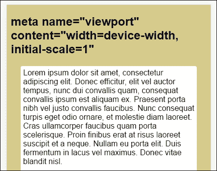
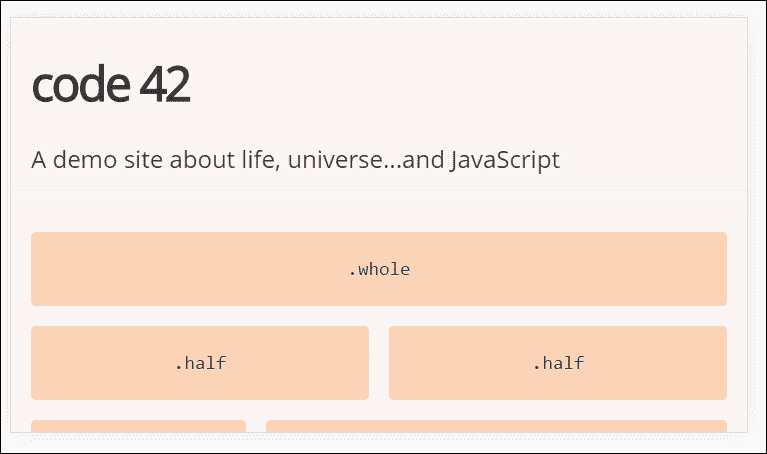
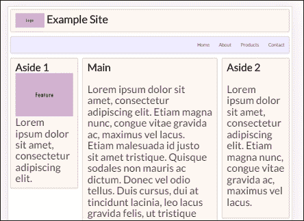
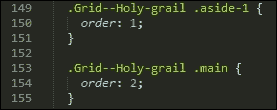

# 第二章。 创建流体布局

我们通过响应式设计的要点的旅程的一个关键部分是在页面上布局内容——在 Internet 的早期，这是一个简单的过程!

随着可以访问互联网的移动设备(以及非 pc 设备)的出现，内容布局变得越来越重要; 例如，我们有多少图像，或者我们包含内容 X，或者显示摘要? 这些只是我们可能会问自己的一些问题。 这表明，它可以打开一个真正的蠕虫罐头!

为了简化这个过程，我们可以使用网格或基于流体的布局。 在本章的整个过程中，我们将更详细地看看如何使用它们; 我们将从设置可用的视口开始，并将其直接带到未来的基于网格的布局。

在本章中，我们将涵盖以下主题:

*   介绍网格布局和理解不同的类型
*   设置可用的视窗以供使用
*   探索使用网格布局的好处和机制
*   实现一个预构建的网格布局
*   探索基于网格的模板布局的未来

好奇吗? 让我们开始吧!

### 注意事项

注意，这些练习是为 Windows 平台设计的，因为这是作者选择的平台; 如果您使用不同的平台，请根据需要修改。

# 引入灵活的网格布局

多年来，设计师们构建了不同类型的布局; 它们可能像一个名片站点一样简单，直接延伸到内容管理系统(如 WordPress 或 Joomla)的主题。 通过不同设备访问互联网的迅速兴起意味着我们不能再创建绑定到特定设备或大小的布局——我们必须灵活!

为了实现这种灵活性，我们需要在设计过程中进行一些改变——首先是我们应该创建的布局类型。 其中的一个关键部分是使用百分比值来定义我们的布局; 我们不需要从头开始创建一些东西，我们可以使用一个已经尝试和测试过的预定义网格系统，作为未来设计的基础。

具有讽刺意味的是，有很多网格系统都在争夺我们的注意力，所以没有多余的废话，让我们从探索不同类型的布局开始，以及它们与响应式设计的比较。

# 了解不同的布局类型

多年来，网页设计师一直面临的一个问题是他们的网站应该使用的布局类型——它应该是流动的，固定的宽度，具有弹性的好处，还是利用这些布局的优点的混合版本?

我们选择使用的布局类型当然取决于客户的需求——使其成为流动布局意味着我们实际上离使其响应性更近了一步; 不同之处在于后者使用媒体查询来允许调整不同设备的内容大小，而不仅仅是普通桌面!

为了理解这些差异，以及响应式布局的比较，让我们依次快速地看一看:

*   **固定宽度布局**:这些被约束为固定宽度; 合适的大小是 960px 左右，因为这可以平均地分成列，没有余数。 缺点是固定宽度假设了可用的视口区域，如果屏幕太小或太大，就会导致大量滚动，影响用户体验。
*   **流体布局**:我们使用百分比单位代替静态值; 这意味着无论浏览器窗口的大小如何，我们的网站都会相应地调整。 这一举消除了围绕固定布局的问题。

*   **弹性布局**:它们类似于流动布局，但约束是通过使用 em 或 rem 单位的字体或字体大小来衡量的; 这些是基于定义的字体大小，所以 16px 是 1 rem, 32px 是 2 rem，以此类推。 这些布局允许良好的可读性，每行 45-70 个字符; 字体大小会自动调整。 在某些情况下，我们可能仍然会看到滚动条出现，或者如果我们缩放页面内容，会遇到一些奇怪的效果。
*   **混合布局**:混合两种或两种以上不同布局类型; 这允许我们为一些元素选择静态宽度，而其他元素保持弹性或流体。

相比之下，响应式布局则更进一步，使用媒体查询不仅可以让我们的设计自动调整大小，还可以在多个设备上呈现不同的内容视图。

但是，我们如何设置可用空间，并确保我们的内容能够适当地放大或缩小? 很简单——我们可以通过在标记中添加 viewport 指令来做到这一点; 让我们去探索需要什么来允许我们的视口调整大小所需的。

# 设置可用的视口

当在不同设备上浏览一个网站时，我们当然希望它自动调整到可用的设备宽度，而不损失*体验*; 不幸的是，并不是每个站点都能正确或成功地做到这一点!

为了理解为什么这很重要，让我们假设我们的网站在桌面版本(在这张截图中属于 1280+组)和移动版本的 418-768 组:


让我们的网站响应的第一阶段是添加 viewport 指令; 没有它，我们很可能在调整我们的网站时，以类似的效果结束:


明白我的意思吗? 它看起来很糟糕——文本被切断了，我们必须向右滑动……呃! 与此形成鲜明对比的是，添加一行代码可能会产生戏剧性的效果:



我们的例子使用谷歌 Chrome 设置来模拟 iPhone 6 Plus。 恢复示例中正常状态所需的代码可以添加到代码的`<head>`中:

```html
<meta name="viewport" content="width=device-width, initial-scale=1"> 

```

一旦设置好，我们可以立即看到差异。 当然，我们的样本不会赢得任何时尚奖项，但这也不是我们的目标! 然而，它确实显示了文本的大小已被缩小以适应屏幕，我们在文本周围设置了适当的边框——作为显示器，这一切看起来都更令人愉悦。

### 注意事项

要查看实际发生了什么，请尝试从本书附带的代码下载中运行`viewport.html`演示; 你需要在浏览器的设备/响应模式下运行它; 删除第 5 行，并将其重新添加回去查看差异。

这个指令中的 content 属性支持使用许多不同值中的任意一个:

<colgroup><col> <col></colgroup> 
| **属性** | **描述** |
| `width` | 设备的虚拟视口的宽度。 |
| `device-width` | 设备屏幕的物理宽度。 |
| `height` | 设备的虚拟视口的高度。 |
| `device-height` | 设备屏幕的物理高度。 |
| `initial-scale` | 访问页面时的初始缩放; 设置 1.0 不会缩放。 |
| `minimum-scale` | 访客可以在页面上缩放的最小数量; 设置 1.0 不会缩放。 |
| `maximum-scale` | 访问者可以缩放页面的最大数量; 设置 1.0 不会缩放。 |
| `user-scalable` | 允许设备放大和缩小(是)或保持固定(否)。 |

当前版本的 MS Edge 并不能很好地使用视口标签; 值得注意的是，需要在代码中指定`@-ms-viewport`，以确保我们的视口宽度的行为与其他浏览器相同。

## 根据经验平衡视口

你会注意到，在这一节的开头，我把“体验”这个词斜体了——这里的关键点是，在响应式设计中，体验不必在所有设备上都是相同的; 它必须是有用的，让我们的访客作为一个组织与我们互动。 换句话说，如果我们为一家剧院工作，我们可能会将我们的移动服务限制为简单的订票，而让主桌面站点管理其他一切。

这是完全正确的; 在限制一个网站的同时，手机票务可能被一些人认为是非常限制性的。 这个概念在技术上仍然是合理的，只要用户体验是可以接受的。

值得注意的是，我们可以使用`width=<value>`设置特定的宽度。 如果我们需要一定的宽度来显示内容，这就很好; 例如，如果方向从纵向(320px)改变为横向(360px)，那么视口的内容将自动缩放，以反映这些变化。 然而，如果我们将设备宽度设置为最大值，这意味着不需要缩放，浏览器应该调整其中的内容以适应。

## 考虑视口单元

响应式设计的一个关键部分是，从使用像素值转向使用 em 或 rem 单位。 在我们的例子中(以及本章前面的视口演示)，我们同时使用像素和 rem 单元。 虽然这工作得很好，但是我们仍然依赖于父元素。 相反，我们应该考虑使用一种替代方法来处理视图。 它们是:

*   **vw**:视口宽度
*   **vh**:视口高度
*   **vmax**:视口高度和宽度的最大值
*   **vmin**:视口高度和宽度的最小值

作为一个度量单位，这些等同于已设置的视口区域的 1%; 不过，它们的美妙之处在于，它们删除了任何依赖元素，并根据当前视口大小进行计算。 目前浏览器对它们的支持非常好:


来源:[http://caniuse.com/#search=vh](http://caniuse.com/#search=vh)

撇开最近版本的 Internet Explorer 的一些小问题不提，这是一个有用的选项，它结合了单位的易用性和使用百分比的灵活性，在我们的设计中。

让我们继续——我们已经介绍了灵活的网格，并探索了如何设置视口对正确显示内容至关重要。 现在，我们应该继续探索将网格系统整合到我们的布局中所带来的好处，并深入探讨响应式设计中网格系统如何作为一种原则工作的内部原理。

# 探索灵活网格布局的好处

现在我们已经把网格布局作为响应式设计的原则介绍给大家了，这是一个很好的机会来探索为什么我们应该使用它们。 从头开始创建布局是很耗时的，需要进行大量测试; 使用网格布局有一些真正的好处:

*   **栅格简化了设计**:我们可以专注于提供内容，而不是试图开发众所周知的轮子; 基础设施已经由开发人员和其他用户进行了测试。
*   **它们提供了视觉上吸引人的设计**:许多人喜欢将内容显示在列中，因此网格布局很好地利用了这个概念来组织页面上的内容。
*   **网格当然可以适应不同大小的视图**:它们使用的系统使得在多个设备上显示单个代码库变得更容易，这减少了开发人员维护和网站管理员管理所需的工作。
*   **栅格有助于广告的显示**:谷歌已经被认为喜欢显示真实内容的网站，而不是那些它认为网站的唯一目的是广告生成; 我们可以使用网格来定义特定的广告区域，而不会妨碍自然的内容。

总之，熟悉网格布局是有意义的; 当然，人们倾向于使用现有的库。 这并没有什么错，但要真正从使用它们中获得好处，最好了解一些关于网格布局机制的基本知识，以及这如何有助于我们的网站建设。

让我们先快速看一下如何计算每个元素的宽度，这是创建任何网格布局的重要部分。

# 理解网格布局的机制

到目前为止，我们探索了响应式设计的一个关键要素，即如何设置可用的屏幕状态(或视口)——就像有人曾经说的，*是时候了……*

绝对是时候让我们继续探索网格是如何运作的了! 网格背后的技巧没有什么特别的; 归结起来就是使用一个公式来帮助定义我们布局中使用的每个元素的比例:

*目标÷上下文=结果*

让我们假设有一个两列的布局，容器(或上下文)的宽度为 960px(我将使用像素值纯粹是为了说明所涉及的数学)。

为了创建我们的布局，我们将使用我们在[第一章](1.html "Chapter 1. Introducing Responsive Web Design")，*介绍响应式网页设计*中提到的黄金比例; 回顾一下，我们使用 1.618 比每 1 像素。 因此，如果我们的布局宽度为 960px，我们将 960 乘以 0.618(差值)，得到 593px(四舍五入到最接近的整数)。 然后，我们只需将 960 减去 593，就得到了边列的 367px。 简单，当你知道如何…!

在这个阶段，我们可以将这些转换成百分比; `593px`变成`61.77%`，边栏变成`38.23%`。 让我们把它翻译成一些 CSS 示例，值四舍五入到小数点后两位:

```html
section, aside {
   margin: 1.00%;    /*  10px ÷ 960px = 0.010416 */
}

section {
   float: left;
   width: 61.77%;    /* 593px ÷ 960px = 0.617708 */
}

aside {
   float: right;
   width: 38.23%;    /* 367px ÷ 960px = 0.382291 */
}
```

这里，我们的目标是`aside`(或子元素)，上下文作为容器; 在本例中，我们将其设置为 960px。 该节形成第二个目标; 在这两种情况下，我们都根据上下文分割了目标以得到结果。 由于我们的结果数字需要表示为百分比，我们可以简单地将每个百分比乘以 100 来得到我们需要的数字。

你们中间善于观察的人会注意到`margin: 1.00%`的存在。 我们必须给我们留出足够的空间，所以最终的数字将需要改变。 我们将保持切片宽度为`61.77%`，因此我们的边距需要降至`34.23%`，以保持 100%的宽度(这允许两个子元素的每边都有两个边距)。

如果我们将其进行到最后，我们可能会得到类似于这张截图的内容，作为示例布局:


好了，我们继续。 我觉得是时候来个演示了! 在我们开始写代码之前，有几个指针我们应该快速看一下:

*   虽然我们只是粗略地了解了网格布局的工作原理，但我们还有很多可以做的; 这完全取决于您的站点需要多少列，这些列的宽度应该相等，还是应该与其他列合并，容器的大小，等等。
*   网上有几十种网格布局框架。 在开始从头开始设计和创建自己的游戏之前，先看看哪些游戏是可行的; 这会节省你很多时间!
*   保持简单; 不要试图让你的布局过于复杂。 你可能会读到开发人员称赞 flexbox 的优点，或者你必须以某种形式使用 JavaScript 或 jQuery; 对于一个简单的布局，它是不必要的。 是的，我们可以使用框大小等属性，但基于 flexbox 的网格系统可能会因为使用 CSS 而变得过于臃肿。

考虑到这一点，我们是时候开始制作 demo 了。 在我们开始之前，有一些东西我们需要覆盖，因为它将成为贯穿本书的一个反复出现的主题:

我们将避免使用 JavaScript 或下载库来创建我们的演示。 是的，你没听错。 我们将尝试只使用简单的 HTML5 或 CSS3 来构建响应元素!

原因很简单——我认为作为开发人员，我们已经变得懒惰了，而且有时候回归基本是好的，并且真正体会到有时候简单反而更好。 你可能听说过一些歌手想要回到他们的根或者他们的起点; 我们只是将同样的原则应用到我们的响应式开发中。 这确实意味着我们不能总是使用功能最丰富或最新的版本，但这并不总是一件坏事，对吧?

# 实现预构建的网格布局

我们已经接触了创建网格的基本知识; 从零开始创建这些工具确实很耗时，所以在网上已经有这么多可用的工具，最好使用预构建的版本，除非您的需求非常大，无法找到适合您的版本! 花时间研究一下可用的网格是值得的，因为没有两个网格是相同的。

作为一个可用的示例，并证明我们不需要网格所能提供的所有附加功能，让我们看一个网格示例，以 Gridism 的形式。 我们可以在下面的截图中看到我们的下一个演示完成后的样子:



虽然这个库已经存在了两到三年，但它的简单性证明了我们不需要实现一个复杂的解决方案来创建简单布局的基础。 CSS 中的 flexbox 属性非常适合创建网格，但它的灵活性增加了一层不必要的复杂性; 相反，我们将使用`box-sizing`属性，它也可以正常工作。

它是由 Cody Chapple 创建的，它没有使用 flexbox(后面还会用到)，但确实使用了 box-sizing 作为网格中的一个属性。 图书馆可以下载从 https://github.com/cobyism/gridism/blob/master/gridism.css(或安装使用 Bower),但它只包含一个文件,我们可以简单地将内容复制到一个文本文件并保存它(还是我们之前的目的不是下载内容)。

### 注意事项

演示将使用来自 Gridism 站点的原始示例，但是 CSS 已经重新设计以使其跟上时代，并删除了一些不必要的代码。 为了方便，我们将在整个演示中使用谷歌 Chrome。

让我们开始:

1.  从本书附带的代码下载中，继续下载一份`gridism.html`，以及`normalize.css`、`gridism.css`和`style.css`。 将 HTML 标记保存在项目区域的根目录下，并将两个 CSS 文件保存在 CSS 子文件夹中。
2.  尝试运行在浏览器中`gridism.html`,然后使其设备或响应模式(按**Ctrl + Shift*+*我***【显示】Ctrl + Shift*+*【病人】)。 我们应该看到类似于本练习开始时显示的屏幕截图。***
**   The screenshot at the start of this section was taken in Google Chrome, set to emulate an iPhone 6 Plus in landscape mode. Now use the orientation tool in Chrome:

    

    *   要将方向更改为纵向:*

 *

注意到网格是如何自动重新排列的吗? 这里的技巧不是在`style.css`文件中，而是在`gridism.css`中; 如果我们在文本编辑器中打开它，并在第 50 行或第 61 行附近寻找这个代码块，它将是这样的:


我们可以看到，库很好地使用了百分比值来为每个块分配宽度。 真正的关键不在于宽度集，而在于容器的大小; 对于 gridism，默认设置为`978px`。 因此，例如，如果我们要设置单元格宽度为`.one-third`，则需要`736px`的`33.3332%`或`245.33px`。 然后，我们通过对每个网格单元格应用 box-sizing 属性来确保所有网格单元格具有正确的尺寸。

看到多简单了吗? 不需要计算百分比，我们只需指定需要的列类型的名称，这取决于我们需要它的宽度:


等一下。 为什么屏幕截图显示的是`215.33`，而不是`245.33`?

啊哈，这是我们需要注意的; 当使用像 Gridism 这样的网格系统时，计算是基于我们的视口的全宽度。 任何需要的填充将包括在我们的列的宽度计算，所以我们可能需要一个比我们预期的稍大的列! 这表明，即使我们的网格系统没有现有系统的所有现代化设备，只要我们仔细规划，我们仍然可以产生一个可用的网格。

好了，我们继续。 我们谈到了一个事实，许多网格使用 flexbox 来帮助控制它们的外观; 这是一个很好的选项，但可能需要设置很多额外的属性，否则对于简单的布局来说，这些属性是不必要的。 经过仔细的规划，我们完全有可能避免使用它，但如果我们处理的是一个包含许多不同元素的复杂布局，那么在某些情况下使用它会避免很多麻烦! 记住这一点，让我们快速了解一下它如何更详细地工作的基础知识。

# 探索 flexbox 的使用

那么，什么是 flexbox?

它是一个模块，旨在提供一种更有效的方式来布局和分配容器中物品周围的空间，特别是在它们的大小还不知道的情况下。 我们可以设置许多属性，以确保每个道具能够最佳地利用其周围的可用空间，即使它的大小发生了变化。

在撰写本文时，这是 W3C 候选推荐标准; 这意味着在 2016 年底成为浏览器标准之前，它实际上是最后一次调用。 这应该是一种形式，因为大多数浏览器已经支持它作为一个标准:


来源:[http://caniuse.com/#search=flexbox](http://caniuse.com/#search=flexbox)

要完全理解它是如何工作的超出了本书的范围，但为了帮助入门，我们可以运行一个快速的演示，并探索一些主要功能:

1.  从本书附带的代码下载中，继续并提取`flexbox.html`和`flexbox.css`的副本; 将 HTML 标记存储在项目区域的根目录中，将 CSS 样式表存储在项目区域的`css`子文件夹中。
2.  尝试在浏览器中预览`flexbox.html`。 为此，我们需要启用浏览器的响应模式(或设备模式，取决于浏览器); 如果一切顺利，我们应该会看到类似以下截图的内容:



该演示是基于 Irina Kramer 创作的一支笔，它可以在[https://codepen.io/irinakramer/pen/jcLlp](https://codepen.io/irinakramer/pen/jcLlp); 出于演示的目的，我们将重点关注从那支笔中提取的示例布局。

乍一看，这个演示看起来非常简单。 它当然需要一些颜色方面的帮助，但这不是我们目前感兴趣的。 如果我们深入挖掘代码，我们可以看到 flexbox 已经被整合到不同的地方; 让我们更详细地探索它的使用。

## 仔细看看

仔细观察我们的代码，我们会发现其中很大一部分使用了标准属性，这在任何站点上都可以找到。 我们感兴趣的代码从第 50 行开始; 为了理解它的作用，我们首先需要了解 flex 布局的基本概念:


来源:W3C

简而言之，项目的布局遵循主轴(从主开始到主端)或交叉轴(从交叉开始到交叉端):

<colgroup><col> <col></colgroup> 
| **属性** | 【实验目的】 |
| `main axis` | 伸缩项目沿着主轴布置; 这取决于挠曲方向特性。 |
| `main-start &#124;  main-end` | 放置在容器内(水平)的伸缩项的起始点和结束点。 |
| `main size` | 伸缩项目的宽度或高度(以主维度为准)是项目的主尺寸。 main size 属性可以是项目的高度或宽度大小。 |
| `cross axis` | 垂直于主轴的轴。 它的方向取决于主轴的方向。 |
| `cross-start &#124; cross-end` | 填充项目并将其放入容器(垂直)的伸缩线的起始点和结束点。 |
| `cross size` | 这是伸缩项目的宽度或高度，在交叉维度中。 |

记住这一点，让我们研究一些在我们的代码中使用的 flexbox 术语; 最初的几个样式是适用于任何站点的标准规则。 我们感兴趣的代码开始于`29`行。

如果我们向下滚动到这一行，我们会遇到这样的情况:


我们的第一个属性`display: flex`定义了包含伸缩项的容器; 这里，我们将它设置为按行显示项目，并从左到右换行。 如果在我们的布局中有许多列(这里的意思是不止 2 或 3 列)，那么我们可以使用`align-items`和`justify-content`来确保每一列均匀地分布在行中，而不考虑每一列的宽度。

定义了`.grid`之后，我们需要对网格单元格或存放内容的容器进行样式化。 我们可以应用几个属性; 我们使用的是`flex`，它是`flex-grow`、`flex-shrink`和`flex-basis`的简写。 在我们的例子中，建议使用简写版本，因为这将自动设置其他值; 我们将`flex-grow`设置为`1`，这表示它应该增长多少，相对于同一容器中的其他灵活项。

下一个重要的属性是`.nav`规则。 这里，我们再次使用了 flex-flow，但这一次我们也证明了内容; 后者控制每一行的物品包装方式(在本例中，是在行尾):


我们最后一个特别感兴趣的代码块是这一节，在大屏幕媒体查询:



order 属性简单地指定了伸缩容器中每个条目的顺序; 在本例中，我们有`.aside-1`和`.aside-2`分别位于位置 1 和 2(不在 shot 中)，而`.main`位于中间的位置 2。

### 注意事项

根据我们的需求，我们可以设置更多的属性。 看看原始笔上的源代码。 网上有很多关于 flexbox 的参考资料——作为开始，看看 Chris Coyier 的指南，可以在[http://bit.ly/1xEYMhF](http://bit.ly/1xEYMhF)找到。

让我们继续。 我们已经探索了一些可能的例子，但使用 flexbox 至少有一个缺点。 该技术工作得很好，但在站点中实现时可能会增加相当多的代码和复杂性。

现在是时候寻找一些更简单的使用方法了，这并不需要太多的努力去实现; 输入 CSS 网格模板! 这仍然是一项早期技术，只有很少的浏览器支持，但是已经很容易实现了。 让我们深入了解更多细节。

# 探访未来

想象一下，我们将 flexbox 作为一种创建网格布局的技术，但它的设计意味着更简单的一维布局; 如果布局很复杂，它的效果就不那么好了! 有没有一个更好的答案，是专门为这项工作设计的?

幸运的是有; 当然，我指的是一种相对较新的技术，叫做 CSS 网格布局。 目前对此的支持很少，但这种情况可能会改变。 简而言之，它提供了一种在浏览器中创建网格的更简单的方法，没有我们在 flexbox 中看到的过多选项。

使用 CSS Grid Layout 作为一种技术的缺点是，对它的支持还没有达到主流; IE11/Edge 支持，但仅在`-ms-`前缀下。 Opera, Firefox 和 Chrome 都提供了支持，但都需要一个标志来启用查看结果:


来源:[CanIUse.com](http://caniuse.com/)

先不考虑支持的问题，很容易理解为什么 CSS Grid Layout 会成为一种技术。 整个概念的设计是为了简化我们如何引用单元格、行和列; 如果我们与 flexbox 比较，使用 CSS Grid Layout 应用样式比使用 flexbox 更直接。

### 注意事项

如果你想了解更多关于 CSS 网格布局的知识，那就在网上看看吧。 Chris House 的这篇文章解释得很好:[http://bit.ly/2bMGlDp](http://bit.ly/2bMGlDp)。

为了比较，让我们构建一个简单的演示来演示网格布局中的一些图像。

## 实现一个基本的画廊网格

在我们的下一个演示中，我们将使用由开发人员 Rachel Andrew 创建的示例，在[http://codepen.io/rachelandrew/full/LGpONE/](http://codepen.io/rachelandrew/full/LGpONE/); 我们将用 Flickr 上的图片替换这些图片，这些图片描绘的是我最喜欢的欧洲城市布鲁日。 不，这与蕾丝无关，在你问之前:美味的食物、美酒、美妙的氛围、美味的巧克力…… 我不知道你还能要求什么?

但我离题了。 在我们开始创建代码之前，有几点我们必须牢记:

*   这个演示是最先进的，它不能在所有浏览器中工作，而且对某些浏览器来说，它需要在浏览器中启用支持。 注意，这是完全可以启用标志，但要确保你得到正确的一个:


*   我们必须重新启动谷歌 Chrome 在步骤 1，所以确保你只有旗帜页面显示在开始的演示。

废话少说，让我们开始我们的演示:

1.  我们将首先启用支持在谷歌 Chrome CSS 网格布局。 为此，浏览到`chrome://flags`并搜索**Experimental Web Platform features**。 点击启用按钮来激活它，然后点击页面底部的蓝色**Relaunch Now**按钮来重新启动谷歌 Chrome。
2.  启用了支持后，继续从本书附带的代码下载中提取`gridtemplate.html`的副本; 将其保存到项目区域的根目录中。
3.  在一个新的文本文件中，添加以下样式。 我们将通过他们在块，从一些初始样式为我们的图像和标签:
4.  接下来是设置容器所需的规则; 注意，与网格相关的惟一样式是`box-sizing`，我们将其设置为`border-box`:

    ```html
            .wrapper { 
              list-style: none; 
              margin: 0; 
              padding: 0; 
            } 

            .wrapper li { 
              box-sizing: border-box; 
              padding: 1em; 
              min-width: 1%; 
            } 

    ```

5.  真正的魔术开始发生在一组媒体查询; 首先将 wrapper 赋值为网格容器，然后设置网格的列和行布局:

    ```html
            @media screen and (min-width: 500px) { 
              .wrapper { 
                display: grid; 
                grid-template-columns: 1fr 1fr; 
              } 

              .wrapper li:nth-child(1) { 
                grid-column: 1 / 3; 
              } 
            } 

    ```

6.  在第二个查询中，我们为网格包装器和列表项设置了各自的样式，这次设置为 640px 或更大:
7.  将文件保存为`gridtemplate.css`，保存在项目区域的`css`子文件夹中。
8.  尝试在浏览器中预览结果; 如果一切顺利，我们应该会看到如下截图所示的结果:


好的,理所当然。 这可能不是你所期望的样式，但这个演示不是让它看起来漂亮，而是基本的网格效果。 尽管如此，还是有一些重要的概念值得理解，所以让我们深入研究并更详细地探索演示中发生了什么。

## 探索发生了什么

在本章的前面，我们探索了如何使用 flexbox 来创建网格布局; 如果我们比较 CSS 样式，很容易看到，在平衡上，我们需要提供更多的样式时，使用 flexbox 比使用 CSS 网格布局。

我们在核心样式中使用的唯一样式属性是`box-sizing`，我们将其设置为`border-box`。 在这一点上没有使用其他任何东西——所有我们的 CSS 网格布局样式都是在两个媒体查询中设置的。

我们的第一个媒体查询将`.wrapper`类设置为网格容器。 注意，我们只需要设置它一次，因为它将级联到更大的`500px`或更大的视图。

一旦分配了网格容器，我们就为模板指定网格列——分配的`1fr`值表示网格中围绕每个单元格内容(即`fr`单元)的空闲空白部分。 然后我们通过在两个媒体查询中指定`grid-row`或`grid-column`来结束——这些值定义网格项目在网格中的位置; 这两个术语分别是`grid-row-start`、`grid-row-end`、`grid-column-start`和`grid-column-end`的简称。

### 注意事项

有关如何在创建网格中使用这些术语的更详细解释，请参阅 Mozilla 开发人员网络的文章[https://developer.mozilla.org/en-US/docs/Web/CSS/CSS_Grid_Layout](https://developer.mozilla.org/en-US/docs/Web/CSS/CSS_Grid_Layout)。

# 更进一步

学习一门新技术就像穿上新衣服; 在某个时候，我们会觉得这些衣服已经不适合我们穿了，或者它们不再具有当初购买时吸引我们的吸引力。

在这种情况下，我们需要在更高级的东西或附加功能上取得进展，否则我们的开发将会停滞不前! 值得庆幸的是，网上确实有很多可供我们探索的选择——人们可能会认为选择太多了，从哪里开始呢?

响应式框架(Bootstrap 或 Unsemantic)是一个很好的起点; 这些都是为了提高可用性和帮助加快开发过程。 引入这些框架的目的是为各种移动功能和布局的快速原型提供网格或基础，从而让设计师和开发人员更好地利用他们的开发时间。

这只是可以帮助你的部分内容，让我们简要介绍一些可能作为起点的想法:

*   **Bootstrap**可以从[http://getbootstrap.com/](http://getbootstrap.com/)下载，这个经验丰富的网格系统最初是由 Facebook 创建的，之后才成为独立的产品。
*   如果你想探索一些不仅仅是框架的东西，那么**响应式网格系统**可能是一个选择; 它可以从[http://www.responsivegridsystem.com/](http://www.responsivegridsystem.com/)获得，对于那些使用 CSS 预处理器的人来说，SASS 版本是可用的。
*   与其简单地下载一个框架，不如在线生成一个呢? 为此，尝试**Responsify。 将**([http://responsify.it](http://responsify.it/))和 Gridpak.com([http://gridpak.com](http://gridpak.com/))作为可能的竞争者。
*   我们在早期使用了 Gridfy 形式的最小网格系统，如果这个不符合你的喜好，还有其他可用的系统。 例如，可以从[http://ionicabizau.github.io/gridly/example/](http://ionicabizau.github.io/gridly/example/)下载 Gridly。
*   值得注意的是，并不是每个 Grid 系统都可以作为独立的组件库的一部分使用。 一个很好的例子是**Formstone**; 其网格系统可从[https://formstone.it/components/grid/](https://formstone.it/components/grid/)获得。 对于那些使用 Less CSS 预处理程序的人来说，这个网格附带了一个可以与该工具一起使用的版本。
*   继续关注组件库的主题，为什么不看看**Metro UI**? 这个库，可以从[http://metroui.org.ua/grid.html](http://metroui.org.ua/grid.html)，甚至有来自微软的支持; 它确实需要 jQuery !
*   你们有些人可能听说过 960。 gs 网格系统，它是几年前可用的-它已经被**非语义**所取代，它可以从[http://unsemantic.com/](http://unsemantic.com/)获得。
*   我们介绍了 flex 作为一种创建基于网格的布局的技术的使用; 作为一个起点，为什么不看看 PureCSS 库呢? 可以通过[http://purecss.io](http://purecss.io/)获得; 这是一个很好的例子，使用 flexbox 产生干净的布局，而没有太多的麻烦。

作为开发者，这是响应式设计的一个领域，我们有很多选择; 开源软件的好处在于，如果我们选择的框架不正确，那么我们总是可以尝试另一个! 为了帮助我们做出决定，我们可以问自己以下几个问题:

*   你需要一个兼容 CSS 预处理器的版本吗? 虽然预处理 CSS 是标准 CSS 的一个超集，但也有一些网格系统是由预处理技术(如 SASS 或 PostCSS)专门构建的。 这比试图将完成的 CSS 转换成可以由我们的处理器编译的东西要容易。

*   你的网站有多复杂? 它是一个单页的*名片*事件，还是实质上更复杂的事情? 显然，用复杂的网格安排来给一个简单的站点增加负担是没有意义的; 同样，如果我们要构建一个复杂的网站，那么我们选择的网格系统必须达到标准。
*   浏览器支持有问题吗? 如果我们可以放弃对一些旧浏览器(特别是 IE8 以下的浏览器)的支持，那么选择仅支持 css 的选项比依赖于使用 jQuery 的选项更可取。 同样的原则适用于如果我们已经需要使用更多的外部资源。 如果使用 CSS 就足够了，就不需要添加插件了。
*   你的网站需要使用 UI 组件，需要使用一个主题库风格? 如果是，检查库; 它可能已经有一个我们可以使用的网格系统。

这里的关键是，我们不应该简单地选择第一个可用的选项，而是仔细考虑什么是可用的，并在可能的情况下选择满足我们需求的选项。 当然，任何样式都可以被重写——这里的技巧是选择正确的样式，这样重写对于我们的站点来说是最小的或者不需要的。

# 总结

构建任何网站的布局网格是其成功的关键; 传统上，我们可能会先做这个，但在响应式设计的世界里，内容是第一位的! 在本章的课程中，我们已经介绍了一些主题来帮助你开始学习，所以让我们花点时间来回顾一下我们所学到的内容。

我们首先介绍了灵活的网格布局，并提到我们可能必须改变我们的设计过程，以促进创建响应式网格。 然后我们继续探索我们可以使用的不同类型的布局，以及响应布局与这些不同类型的比较。

接下来，我们开始布局中最重要的部分:可用的视口; 这控制在任何一点上有多少是可见的。 我们讨论了在代码中设置 viewport 指令的必要性，以便正确显示内容; 我们研究了不提供指令如何对内容的外观产生负面影响! 此外，我们还介绍了一些我们可以使用的附加属性和价值单元，以及根据用户体验平衡视口大小。

然后，我们开始探索灵活的网格布局的好处，然后再看他们如何工作的更详细; 然后，我们使用从 Internet 上获得的预先构建的网格系统创建了一个简单的演示。

接着，我们研究了使用 flexbox 作为一项技术; 在剖析使用 flexbox 的一些问题之前，我们通过一个简单的演示来探讨它。 然后我们看到了一个替代方案是如何进行的。 我们通过一个演示来探索如何在今天激活它，以及一旦它成为主流标准，为它开发解决方案将更加简单。

现在我们已经有了布局，是时候继续前进了。 我们需要开始添加内容! 假设默认情况下会添加文本，那么媒体呢? 我们如何让它响应? 我们将在下一章中回答这些问题，当我们看看如何在我们的页面中添加响应媒体时。*