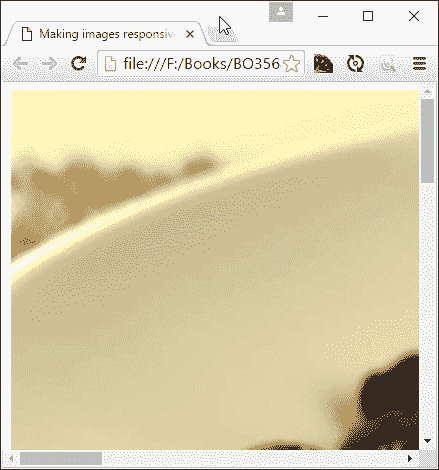
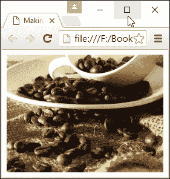
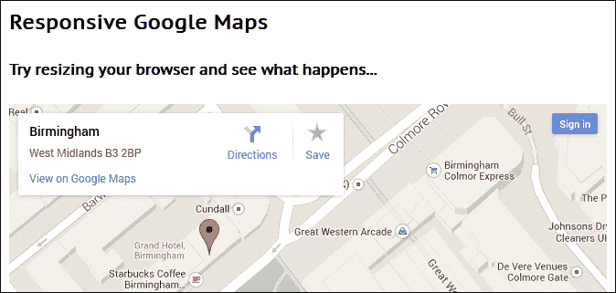
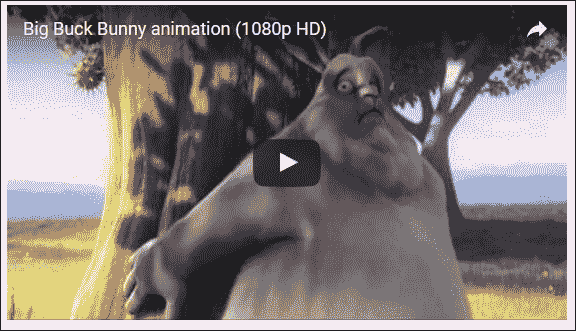
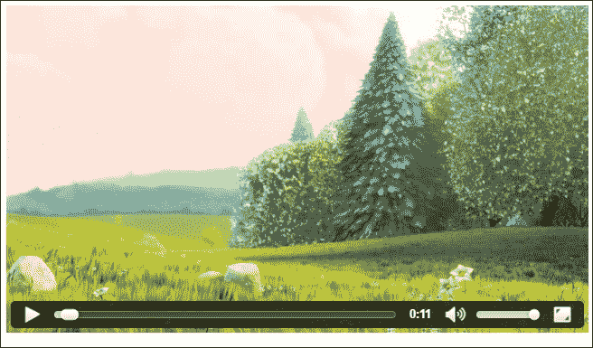
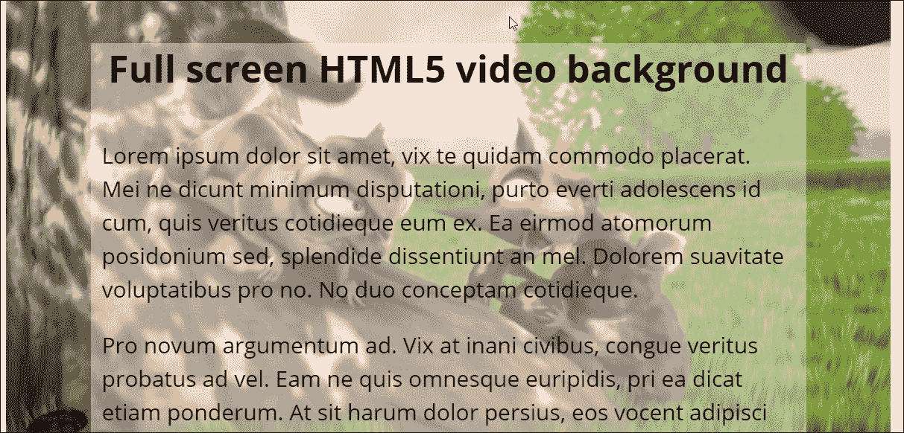

# 三、添加响应式媒体

一幅画胜过千言万语……

任何网站的关键元素都是视觉内容; 毕竟，如果不添加一些颜色，文本会变得非常重复和枯燥!

添加媒体不仅可以为网站增添色彩，还可以作为向潜在客户展示产品外观或如何使用产品的重要工具。 事实上，仅仅因为能够看到产品被展示，销售额就会上升。 随着移动设备的出现，更重要的是我们不仅要添加媒体，还要确保它在一系列不同的设备上运行良好。

在本章的整个过程中，我们将探索不同的方式添加媒体到我们的页面，并看到它是多么容易的响应任何变化，在可用的屏幕尺寸。 在本章中，我们将涵盖以下主题:

*   了解使用`<picture>`添加图像的基础知识
*   探索添加图像的替代方案
*   使视频和音频内容具有响应性
*   调整文本以自动适应屏幕

好奇吗? 让我们开始!

# 媒体响应

我们的旅程通过增加响应能力的基础到目前为止已经触及到我们如何使我们的布局自动响应变化; 现在是我们对媒体做同样事情的时候了!

如果你的第一想法是我们需要很多额外的功能来让媒体响应，那么我很抱歉让你失望了; 这要容易得多，而且不需要额外的软件来完成! 是的，我们所需要的只是一个文本编辑器和一个浏览器; 我将使用我最喜欢的编辑器 Sublime Text，但您可以使用任何适合您的编辑器。

在本章的过程中，我们将轮流看看图像，视频，音频和文本，我们将看到如何通过一些简单的改变，我们可以使每一个响应。 让我们开始我们的旅程，首先看看如何使图像内容具有响应性。

## 创建流体图像

人们常说:*图像胜过千言万语*。 我们可以用媒体表达比语言更多的东西。 对于销售产品的网站来说尤其如此; 清晰、清晰的图像显然比劣质的图像能画出更好的画面!

当构建响应性网站时，我们需要我们的图像自动调整大小。 要了解为什么这很重要，请从本书附带的代码下载副本中提取`coffee.html`并在浏览器中运行它。 尝试调整窗口的大小。 我们应该看到类似的情况:



看起来不太好，是吧? 撇开我对大自然中最好的豆饮料的偏爱不谈，我们不能有不适当调整大小的图片，所以让我们来看看是什么让这一切发生的:

1.  继续，提取一个`coffee.html`的副本并将其保存到我们的项目区域。
2.  我们还需要我们的图像，它在`img`文件夹中; 在我们的项目区域的`img`文件夹中保存一个副本。
3.  在一个新的文本文件中，添加以下代码，将其保存为`coffee.css`:
4.  回复到`coffee.html`。 你会看到第 6 行被注释掉了; 删除注释标签。
5.  保存文件，然后在浏览器中预览。 如果一切正常，我们仍然会看到与之前相同的图像，但这一次尝试调整大小。

这一次，我们的图像自动增长或缩小，取决于我们的浏览器窗口的大小:



虽然我们的图像确实更适合，但在使用这种方法时，有几点我们应该注意:

*   在处理响应性图像时，有时你可能会看到`!important`被设置为与`height`属性对应的属性; 这并不是必需的，除非您在站点中设置的图像大小在以后可能会被覆盖
*   我们将`max-width` 设置为`100%` 作为最小值; 你可能还需要设置一个`width`值，以确保你的图像不会变得太大而破坏你的布局

这是一种很容易使用的技巧，尽管有一个缺点可能会让我们绊倒它是什么? 如果我们使用高质量的图像，它的文件将是巨大的——我们不能期望移动设备的用户下载它，对吗?

不过不要担心——有一个很棒的替代方案很快就在浏览器中流行起来; 我们可以使用`<picture>`元素来控制显示的内容，这取决于可用窗口的大小。 让我们深入了解一下。

## 实现<图片>元素

简而言之，响应式图像是在页面上以最佳形式显示的图像，这取决于您的网站所使用的设备。 这可能意味着几件事:

*   您希望根据用户的物理屏幕大小显示一个单独的图像资产。 这可能是 13.5 英寸的笔记本电脑或 5 英寸的手机屏幕。
*   您希望根据设备的分辨率或使用设备-像素比率(即设备像素与 CSS 像素的比率)显示一个单独的图像。
*   如果浏览器支持指定的图像格式(例如 WebP)，则需要显示它。

传统上,我们可能会使用简单的脚本要做到这一点,但这是潜在的风险下载多个图像或根本没有,如果脚本加载图像加载后,或如果我们不指定任何图片在我们的 HTML 和希望照顾加载图片的脚本。

我们显然需要一种更好的方法来管理响应性图像! HTML5 的一个相对较新的标签`<picture>`非常适合这项工作。 我们可以以三种不同的方式使用它，这取决于我们是要调整现有图像的大小，显示更大的图像，还是显示图像的高分辨率版本。 建议的方法是:

1.  属性
2.  属性
3.  `picture`元素

我们将详细探讨这三种方法; 在使用`<picture>`元素之前，让我们从在标准``标记中实现`srcset`属性开始。

### 使用 srcset 属性

使用`<picture>`元素的一个关键好处是，使用 srcset 属性选择多个图像中的任意一张，这取决于我们是希望在不同的视图中显示更高分辨率的版本，还是相同图像的不同大小。

浏览器对这一功能的支持非常好，只有 Opera Mini 和 IE11 不愿意加入:


来源:[http://caniuse.com/#search=srcset](http://caniuse.com/#search=srcset)

为了使用这个`srcset`属性，我们需要充分利用不同的图像，然后指定在适当的触发点应该显示什么，如本例所示，基于定义`device-pixel`比例:

```html
 

```

这里，`src`属性作为不支持`srcset`的浏览器的回退映像(尽管现在的支持非常好!) `srcset`属性允许我们指定使用不同的图像，基于设备像素比或可用的视口:

```html
 

```

在本例中，我们的后备方案是`default.png`; 但是，如果正在使用的浏览器支持`srcset`，那么它将在`256w`显示`small.png`，在`511w`显示`med.png`。 但是，如果我们想根据可用的视口改变大小并使用不同的图像，那么我们必须添加一个额外的属性`sizes`。 配置它非常简单，因此让我们暂停一下，看看这在实践中意味着什么。

### 探索大小属性

当在响应性站点添加图片作为内容的一部分时，图片可能会占元素宽度的 100%，但内容本身并不总是占窗口宽度的 100% ! 例如，我们可以将每个图像元素设置为 100%宽度(这样它们就会填充它们的父容器)，但屏幕上的整体内容只填充可用屏幕宽度的 50%。

为了克服这个问题，我们需要知道要使用的各种图像的 url，以及每个图像资源的宽度; 我们无法从页面布局中的标准标记中得到这个，因为在应用 CSS 之前，图像就已经开始下载了。

相反，我们可以简单地使用`srcset`属性和合适的宽度描述符在 HTML 代码中设置合适的宽度。 这对一些人来说有点争议，因为它开始模糊 HTML 标记和 CSS 表示层之间的界限。 撇开这些不谈，让我们来看一个如何设置代码的例子:

```html
 

```

在这个摘录中，我们默认设置 50%或视口宽度的一半; 然后，浏览器可以根据可用的宽度选择要显示的适当图像。

### 操作 HTML5<图片>元素

我们已经介绍了使图像响应的两个关键部分，但要将它们结合在一起，我们可以使用 HTML5`<picture>`元素，它在大多数浏览器中得到了良好的支持:


来源:[http://caniuse.com/#search=picture](http://caniuse.com/#search=picture)

元素使用以下语法:

```html
<picture>
   <source media="(min-width: 60rem)" sizes="(max-width: 500px) 50vw, 10vw"
   src="high-res-image-2x.png 145w ">
   <source media="(min-width: 35rem)" src="med-res-image.png">
   <source src="low-res-image.png">
   
   <p>Text to display</p>
</picture>
```

在这个摘录中，我们将`<picture>`元素中可以使用的所有属性捆绑在一起; 在本例中，我们指定了媒体查询(一个`60rem`和另一个`35rem`)，如果我们的视口只有 50%或更少(由代码中的`50vw`值指示)，我们显示正常图像; 如果它更高，则显示高清晰图像(通过使用`100vw`值指定)。

### 注意事项

我们将在本章后面的*探索发生了什么*中更详细地探讨这是如何工作的。

### 把它们放在一起

现在我们已经看到了所有这三个元素的使用情况，让我们将它们放在一起并创建一个简单的演示，它可以根据可用的视口自动调整要使用的图像。 为了简单起见，我们将只关注图像，但没有什么阻止我们将其进一步开发成一个完整大小的页面!

让我们开始吧。 对于这个演示，我强烈建议使用谷歌 Chrome，如果你有它安装; 它的设备模式是完美的任务!

1.  从本书附带的代码下载副本中，提取这四张风景图片的副本，并将它们保存到项目区域根目录下的`img`文件夹中。
2.  接下来，启动文本编辑器，并添加以下代码:
3.  将其保存为`pictureelement.html`，放在项目文件夹的根目录下。
4.  继续并在谷歌 Chrome(或其他浏览器，如果喜欢的话)中预览文件的结果。 确保你打开了浏览器的设备/响应模式。

如果一切正常，我们应该看到图像在两个相似的版本之间翻转; 为了区分哪个是哪个，我在一张图片上加上了**高分辨率图片**，在另一张图片上加上了**中分辨率图片**:


这是相同的图像，但这次使用的是中分辨率版本:


虽然这个演示从表面上看很简单，但它具有欺骗性。 我们可以构造一些复杂的语句，这些语句可以根据许多标准自动选择图像! 理解这个演示如何工作是很重要的，这是将它用于复杂示例的基础。 让我们花一点时间来更详细地探讨它。

### 探索发生了什么

如果我们看一下我们的图片元素演示，最初使用的代码可能看起来很复杂，但实际上比看起来要简单! 它的关键是理解每个部分的`<source>`语句以及它们之间的相互作用。 让我们来解决第一个问题:

```html
  <picture> 
    <source media="(min-width: 800px)" sizes="(max-width: 1000px) 100vw" 
    srcset="img/high-res-image.png 738w"> 
    ... 
  </picture> 

```

在本例中，我们指定`high-res-image.png`作为源图像; 只有当我们的浏览器窗口显示最小宽度`800px`时才会显示。 图像的大小将达到最大值`1000px`或`100vw`，后者相当于可用视口空间的 100%宽度。 图像的`738w`就是代码中指定的图像的宽度(1w 单位等于 1px，所以我们的图像是 738px 宽)。

移动到第二个来源声明中,我们找到了类似的设置,但这一次媒体查询`799px`的最大宽度是有限的,而图像的大小去`600px`或完整的视窗的宽度,根据当前的大小:

```html
<picture> 
  ... 
    <source media="(max-width: 799px)" sizes="(max-width: 600px) 100vw" 
    srcset="img/med-res-image.png 738w"> 
     
  </picture> 

```

为了结束`<picture>`元素，我们指定`fallback-image.png`作为那些还没有在 HTML5 中支持该元素的浏览器的后备方案。

### 注意事项

我们只是触及了`<picture>`元素的可能性的表面; 要了解更多细节，请查看响应图像社区组维护的站点，托管在[https://responsiveimages.org/](https://responsiveimages.org/)。

## 创建一个真实的示例

我们已经用一些有用的技术探索了图像响应背后的理论; 我们该实际点了! 我们下一个演示的基础是看看如何使用谷歌 Maps 制作响应式地图。

响应式地图，我听到你问? 当然这应该是自动的，对吗? 不，它没有，这使得它在移动设备上的使用有点尴尬。 幸运的是，我们可以很容易地解决这个问题; 伟大的事情是，它只需要一点额外的 CSS:

1.  让我们先浏览[http://maps.google.com](http://maps.google.com/)，然后输入我们所选地点的邮政编码; 在这个例子中，我将使用 Packt 的英国办公室，即 B3 2PB。
2.  Click on the cog, then select **Share and embed** map, as shown in this screenshot:

    

3.  在出现的对话框中，切换到 Embed map 选项卡，然后复制以`<iframe src=...`开头的文本字段的内容。
4.  在本书附带的代码下载副本中，在您喜欢的文本编辑器中提取一个副本`googlemaps.html`，并在 google-maps div 标签之间添加`<iframe>`代码。
5.  接下来，将以下 CSS 样式添加到一个新文件中，将其保存为`googlemaps.css`:

```html
        #container { margin: 0 auto; padding: 5px; max-width: 40rem; } 
        .google-maps { position: relative; padding-bottom: 60%;overflow: 
        hidden; } 
        .google-maps iframe { position: absolute; top: 0; left: 0; width:
        100% !important; height: 100% !important; }    

```

如果一切顺利，我们将看到一张谷歌地图上伯明翰的图像，相应地标记了帕克特的办公室:



此时，尝试调整浏览器窗口的大小。 你会看到地图会自动调整大小; 我们添加的 CSS 样式覆盖了谷歌 Maps 中使用的标准样式，以使我们的地图响应性好，并且可以从任何我们想要使用的设备访问。

## 更进一步

在本章的整个过程中，我们遵循了只使用浏览器和文本编辑器来构建代码的原则。 当然，这包括不下载任何创建示例的核心内容(除了媒体和内容)。

但有时这种方法是不够的，我们可能会发现我们需要利用额外的支持来完成工作。 我们最重要的问题应该总是检查我们是否真的需要它，而不是我们只是懒惰! 如果在回答这个问题时，我们确实发现需要额外的帮助，那么有一些来源你可以尝试，以帮助进一步发展:

*   这是不言而喻的，但总有一天我们需要借助 jQuery([http://www.jquery.com](http://www.jquery.com/))来帮助我们进行开发。 响应式设计的现状是，我们只需要 jQuery 来简化 DOM 中的元素引用，而不是让图像或内容响应式设计!
*   响应图像站点位于[https://responsiveimages.org/](https://responsiveimages.org/)。 我们在`<picture>`演示的最后简要地介绍了它，但有必要再次指出它。 这是一个有用的材料纲要，有助于理解和使用`<picture>`元素。
*   开发者 Scott Jehl 为`<picture>`创建了一个 polyfill，以扩展对那些本地不支持`<picture>`的浏览器的支持; 您可以从[https://scottjehl.github.io/picturefill/](https://scottjehl.github.io/picturefill/)下载。
*   你需要一个响应式旋转木马吗? 网上有很多，但我发现 ResponsiveSlides 很好用，可以从[http://responsiveslides.com/](http://responsiveslides.com/)下载。 当然，这个项目已经有几年的历史了，但是这个插件让事情变得很好很简单，这和本书的主题非常一致!
*   响应能力的一个很好的例子就是使用 SVG 图像格式。 这些是有效的基于向量的图像，我们可以使用 CSS 操作; 不过，关键的好处是 SVG 图像可以自动增大或缩小，而不会损失质量。 浏览器对该格式的支持非常出色，尽管 IE(和 Edge)在使用这些浏览器时都有一些需要注意的问题(更多细节请参见[http://caniuse.com/#feat=svg](http://caniuse.com/#feat=svg))。
*   另一个方法是使用响应式图标。 一个很好的例子是 FontAwesome 库，可以从[http://fontawesome.io/](http://fontawesome.io/)获得。 它们同样会调整大小。 在这种情况下，它们将完美地用于较小的图像，如信用卡图标或电子商务网站的购物篮。

*   更进一步，对 WebP 图像格式的支持怎么样? 是的，这是一个还没有获得大量支持，因为它在撰写本文时仅限于 Chrome 和 Opera。 然而，当与`<picture>`元素一起使用时，它展示了一个很好的技巧:

```html
        <picture> 
            <source type="image/webp" srcset="retina-image.webp 2x, 
            image.webp 1x" /> 
             
        </picture> 

```

*   在我们的例子中，浏览器将检查是否支持 WebP，如果它能支持它，它将以 WebP 格式显示适当的图像，这取决于所使用的设备上支持的设备像素比。 如果 WebP 不被支持，那么它将回到使用 JPEG(尽管这同样可以是另一种格式，如 PNG)。

一旦我们习惯了使用响应性图像，并且希望不再只使用 HTML5 和 CSS3，我们当然可以做一些事情。 值得注意的是，这里没有列出许多在线运行的项目。

主要原因是对响应图像的年龄支持在一段时间内是不完善的，这意味着许多项目似乎帮助提供响应图像的支持。 对`<picture>`和相关元素的支持一直在变好，这降低了这些老项目的吸引力; 值得考虑的是，使用它们是否明智，或者不使用它们的影响是否可以通过更改用户体验来减轻。

好了，我们继续; 我想是时候变得活泼一点了! 好吧，这对于我们下一个话题来说是个糟糕的开场白，因为我们要探索如何让视频响应。 在接下来的几页中，我们将看到，尽管一些相同的原则适用于这里，但在前进的道路上仍有一些颠簸，这可能会影响我们的旅程。

# 视频响应

柔性视频比图像更复杂。 HTML5`<video>`就像图像一样保持它的长宽比，因此我们可以应用相同的 CSS 原则来让它具有响应性:

```html
   video {
      max-width: 100%;
      height: auto !important;
   }
```

直到最近，HTML5 视频一直存在问题，这主要是由于对运行 HTML 视频所需的编解码器的分离支持。 制作 HTML5 视频所需的 CSS 非常简单，但直接使用它带来了一些挑战:

*   托管视频是带宽密集型和昂贵的
*   除了视频外，流媒体还需要复杂的硬件支持
*   在不同的格式和平台上维护一致的外观并不容易

对许多人来说，更好的选择是通过 YouTube 等第三方服务托管视频。 有一个警告，他们会控制你的视频内容; 如果这不是一个问题，我们可以让他们担心带宽问题，并提供一致的外观和感觉; 我们只需要让它适合页面! 这需要更多的 CSS 样式来使它工作，所以让我们来探讨一下涉及到什么。

## 嵌入外部托管视频

为了嵌入这些视频，我们需要使用 iframes，不幸的是，它默认不保持长宽比; 我们可以用 Thierry Koblentz 的 CSS 解决方案来解决这个问题。

为了讨论的目的，让我们假设我们有一个 YouTube 视频，例如这一个，标题为*大巴克兔*，由搅拌机基金会:



(c) Blender 粉底|[www.bigbuckbunny.org](http://www.bigbuckbunny.org)

看起来不错，不是吗? 当然，我们不能马上分辨出这是一个 YouTube 视频，但下面的截图清楚地显示它是:


抓住; 这看起来不太对，不是吗? 截图是在谷歌中拍摄的，但设置为模拟 Galaxy S5 手机的屏幕状态，但它清楚地显示视频没有响应。

要查看实际情况，请从伴随本书的代码下载中提取一个`youtube.html`副本，然后在浏览器中运行它。 激活浏览器的响应模式(或设备模式，取决于浏览器)，并将屏幕大小调整为 360px * 640px。 你很快就会看到它的大小调整得不好!

我们如何解决这个问题?

诀窍是创建一个具有适当长宽比的盒子，比如 4:3 或 16:9(通过 0 高度和底部填充%)，然后调整视频，并通过绝对相对于盒子的定位将其在盒子内拉伸至盒子的尺寸。 底部的填充物作为宽度，帮助维持长宽比。 让我们修改代码来解决这个问题:

1.  在`youtube.html`中，在`<head>`部分中添加此链接:

    ```html
            <link rel="stylesheet" type="text/css" href="css/youtube.css"> 

    ```

2.  进一步，修改代码如下:

    ```html
     <div class="video-box-wrapper">
              <iframe width="560" height="315" 
              src="https://www.youtube.com/embed/XSGBVzeBUbk" frameborder="0" 
              allowfullscreen></iframe> 
            </div>

    ```

3.  Save the file. Switch to a new file, then add the following code and save it as `youtube.css` within the `css` subfolder of our project area:

    ```html
            .video-box-wrapper { 
              padding-bottom: 5.25%; height: 0; position: relative;padding-top: 
              1.875rem; overflow: hidden; } 

            .video-box-wrapper iframe,  
            .video-box-wrapper object,  
            .video-box-wrapper embed { position: absolute; left: 0; top: 0; 
            width: 100%; height: 100%; } 

    ```

    ### 注意事项

    注释设置词`height: 0`确保元素出现在 DOM 中，以便旧的浏览器可以正确格式化内部框。

4.  保存文件，还原到您的浏览器，并重新启用它的响应(或设备)模式(如果它还没有打开)。
5.  Try previewing the results now; if all is well, we should see something akin to this. It uses the same Galaxy S5 size settings, but this time zoomed in to 150% for clarity:

    

这个看起来好多了! 通过一些简单的造型，我们拥有了两个世界的最佳效果; 当我们专注于让我们的视频在多个设备上可用时，我们可以让 YouTube 做所有的繁重工作。 我们使用的 CSS 强制将所有视频内容设置为`.video-box-wrapper`容器的全宽，而`.video-box-wrapper`容器又相对于其正常位置进行定位。 然后我们在底部添加`56.25%`以保持经典的 16:9 长宽比，并在顶部提供一点额外的填充，这样它就不会看起来离开屏幕!

### 注意事项

**问题**:我们是如何到达 56.25%的? 这只是 9 除以 16(长宽比)，即 0.5625 或 56.25%。

不过，有时我们不得不自己主持视频; 这可能是为了控制可见性或防止播放广告，如果我们是在外部托管它。 为了实现这一点，我们可以使用当前的 HTML5`<video>`元素在页面上呈现内容; 让我们看看这是如何工作的。

## 介绍新的 HTML5 视频元素

如果无法在外部资源上托管视频，那么我们必须在本地托管; 为此，我们可以使用原生 HTML5 视频标签，它看起来像这样:

```html
<video controls> 
  <source src="video/bigbuckbunny.webm" type="video/webm"> 
  <source src="video/bigbuckbunny.mp4" type="video/mp4">  
</video> 

```

过去，对 HTML5 元素的编解码器支持被划分到各个平台上; 2015 年，Firefox 在所有平台的浏览器中添加了对 H.264 的支持，这对 HTML5 视频支持的合理化起到了很大的作用。 目前，对这两种格式(MP4 和 WebM)的支持很好，但并不是所有浏览器都支持 100%的 MP4 格式——这张截图显示了当前桌面和移动浏览器的 MP4 格式的播放状态:


来源:CanIuse.com

相比之下，对 WebM 格式的支持就不那么完整了:


来源:CanIuse.com

实际上，我们唯一需要担心的格式是 MP4; 如果需要，我们可以使用 WebM 格式。 如果我们这样做，那么它必须位于`<source>`列表的首位; 否则，浏览器将选择第一个可用的支持格式(在本例中是 MP4)，而不使用 WebM!

### 提示

在继续之前，我强烈建议你安装谷歌 Chrome 或 Firefox - WebM 视频将工作在 IE9 或以上，但不能没有添加对格式的编解码器支持!

既然已经介绍过了，让我们继续并将其付诸实践，通过一个简单的演示来说明`<video>`元素如何实际工作。

## 嵌入 HTML5 视频内容

如果我们的要求是我们必须自己主持一个视频，那么使用 HTML5 标准标签来实现它是非常容易的; 它包括在`<video>`标签中设置任意数量的不同源，这样我们就可以使用该浏览器支持的格式播放相同的视频。 让我们来看看我们是如何做到的:

1.  我们首先从本书附带的代码下载中提取以下内容的副本——`video`文件夹和`html5video.html`。 将它们保存到项目文件夹的根目录中。
2.  在一个新文件中，继续添加这些样式; 将文件保存为`html5video.css`，在项目区域的`css`子文件夹中:

    ```html
            video { 
               max-width: 100%; 
               /* just in case, to force correct aspect ratio */ 
               height: auto !important; 
            } 

    ```

3.  尝试在浏览器中预览结果。 如果一切顺利，我们应该会看到类似的情况(截图来自 Chrome):



结果看起来很完美——问题是，我们的哪个版本的视频正在被使用? 一种方法是右键单击视频，而它仍在播放，然后点击**保存视频为…** 。 如果一切正常，我们会看到一个**另存为**对话框打开，如果我们使用 FireFox、Chrome 或 Opera，可以保存 WebM 格式; 否则将是 MP4(如果使用 IE)。

### 探索发生了什么

然而，真正的问题不在于它是如何运作的，而在于它是否有反应?

答案是肯定的; 我们对 HTML5`<video>`标签的使用意味着我们可以选择任意数量的不同视频格式; 浏览器只会选择它能够播放的第一款游戏。 顺序是至关重要的:

```html
<video controls> 
    <source src="video/bigbuckbunny.webm" type="video/webm"> 
    <source src="video/bigbuckbunny.mp4" type="video/mp4"> 
</video> 

```

如果我们把它调换一下，把 MP4 放在第一位，那么 WebM 将会在几乎所有的浏览器中被忽略，因为几乎所有的浏览器都可以播放 MP4 !

真正神奇的不是使用特定的视频格式，而是我们创建的 CSS 规则:

```html
video { 
   max-width: 100%; 
   /* just in case, to force correct aspect ratio */ 
   height: auto !important; 
} 

```

我们使用百分比值意味着当窗口调整大小时，它会自动向上或向下缩放; 视频的最大尺寸是由视频的尺寸限制的，而不是屏幕上的其他元素。 当然，我们可以决定将视频托管在父容器中; 视频将填充该容器，但父站点可能只延伸到站点的一部分。

## 构建一个实例

如果你花时间在互联网上，你可能会遇到开发者没有使用图像作为背景，而是使用*视频*的网站。

这并不是一个全新的概念; 它已经存在好几年了。 如果处理得当，效果会很好。 它是制作全尺寸视频作为响应背景的完美候选。 它的伟大之处在于，我们可以使用纯 CSS 使其具有响应性。 是的，不需要任何 JavaScript。

在下一个演示中，我们将暂停创建内容。 这一次，我们将从本书附带的代码下载中运行这个演示，并在演示的后面更详细地查看代码。 我们将使用视频从大巴克兔项目，创建的 Blender 基金会作为我们的背景; 在此之上，我们将覆盖一个简单的示例文本块，该文本块是使用 Lorem Ipsum 生成器生成的。

要查看实际情况，请从本书附带的代码下载副本中运行`fullscreen .html`演示。 如果一切正常，您将看到视频播放背后的一个简单的`<div>`文本:



如果我们更详细地看看我们的代码，我们可以看到使用中的 video 元素; 它被设置为自动播放，带有静音和海报(或占位符)图像设置。 然而，真正的魔力在于 CSS 样式，所以让我们更详细地探讨这个问题。

### 探索发生了什么

让我们的视频工作的技巧就在这段代码中。 我们需要将两个媒体查询设置为 16:9 长宽比(一个是最小长宽比，另一个是最大长宽比)，以便我们的视频在屏幕上正确显示:


当调整它的大小时，它将显示空白。 我们通过设置负边距来解决这个问题，这使得视口更宽，并允许我们在屏幕上居中:


需要注意的关键点是`height`、`top`、`left`和`width`所使用的值; 虽然这些看起来很极端，但当使用`16/9`纵横比设置观看内容时，需要它们来帮助将视频居中。

完美! 我们的视频播放得很好。 我们看内容不太困难。 一切应该都很好吧? 嗯，是也不是; 背景视频等概念并非没有风险; 很重要的一点是，如果我们不小心，要知道东西可能会掉下来。 让我们暂停一下，考虑一些可能会颠覆我们所熟知的苹果车的潜在陷阱，如果我们在视频中不小心的话。

## 探索风险

在前面的例子中，我们探讨了添加视频作为背景内容的概念。 这是一种时尚，在最近几年开始流行，并提供了一个有趣的效果，这是不同于我们可能看到的标准图像!

但这并不是没有一定的风险; 在添加视频作为背景内容时，我们必须考虑以下几点:

*   可以添加视频，但我们不应该仅仅添加它，因为我们可以使用这种方法添加的任何视频都必须放大网站的整体信息。
*   添加的任何视频都可能被设置为自动播放，但默认情况下声音必须是静音的——如果可能的话，它不应该有任何声音。
*   我们的视频是否符合网站的品牌、基调、调色板等? 建立一个杀手级网站是没有意义的，只会用一个垃圾视频毁掉它。
*   成本是我们必须考虑的因素; 托管视频内容的成本可能很高，因此必须尽可能地压缩它以减小文件大小，并以适用于多种设备(包括移动设备)的合适格式运行。
*   我们的视频不应该太长; 我们必须在太长和不够长之间取得平衡，这样它才不会让人觉得太重复。
*   可访问性是一个关键指标; 它必须有足够高的对比度，以便使文字覆盖易读。
*   我们的视频可能看起来不错，但性能如何呢? 你的客户不会感谢你，如果你制作了一个闪电般快的网站，但减慢它与一个大的，优化得很差的视频作为背景; 他们很可能会用脚投票!
*   我们使用的兼容性技术在 IE8 上不起作用，所以必须包含一个静态占位符作为回退; 如果我们使用的浏览器不支持 HTML5 视频或其属性(如手机自动播放)。

尽管我们有一些明确的建议需要考虑，但这不应该阻止我们使用这种效果; 只要我们做得好，我就是一个敢于打破一切可能的界限的人!

## 使音频响应

问题-我们已经致力于让视频响应，但是音频内容呢?

我们可以将类似原则应用于 HTML5`<audio>`元素; 除了设置特定的宽度，我们可以使用 max-width 并设置一个百分比来控制它在屏幕上显示的宽度。

实现这一点的代码非常简单，现在应该很熟悉了——让我们来看看涉及到什么:

1.  对于这个演示，我们需要使用合适的文件; 不幸的是，出于许可的原因，您在本书附带的代码下载中找不到任何内容! 实现这一目标的一种方法是复制一个 iTunes 文件(通常是`.m4a`格式)，然后使用在线服务，比如 Media。 io([http://media.io/](http://media.io/))将其转换为正确的格式。 在继续这个演示之前，您需要同时转换为 MP3 和 OGG 格式。
2.  假设我们现在有了正确的文件，继续，并从本书附带的代码下载中提取一个`audioelement.html`副本，并将其保存到项目区域的根目录中。
3.  接下来，在我们的项目区域的根，继续并创建一个名为`audio`的新文件夹; 在其中，保存你在第 1 步中创建的音频文件的副本。
4.  在一个新文件中添加以下代码，将其保存为`audioelement.css` 在项目区域根目录的`css`子文件夹中:

    ```html
            audio { 
              max-width: 100%; 
              width: 800px; 
            } 

    ```

5.  尝试在浏览器中预览我们的工作结果——如果一切正常，我们应该会看到类似以下截图的内容:


乍一看，它可能没有什么特别的，但是`<audio>`元素看起来并没有什么特别! 这里的关键是当我们调整浏览器窗口的大小; 我们已经设置了最大宽度值`100%`，但是通过在 width 属性中设置上限`50rem`来约束它。 无论我们调整窗口多少次，音频播放器都将填充整个宽度，但宽度不会超过`50rem`。

### 注意事项

不像`<video>`元素，我们不能仅仅使用 CSS 来调整高度; 这需要用 jQuery 覆盖`<audio>`元素，这超出了本书的范围。

让我们继续，将新发现的知识应用到测试中，以创建一个实际的示例—如何制作一个全屏视频，并自动响应浏览器 viewport 中的更改? 使用这种技术设置视频总是充满争议，但我不是一个回避挑战的人，所以没有更多的废话，让我们深入看看为什么我们必须谨慎地使用全屏视频。

## 更进一步

在本书的整个过程中，我们一直专注于使用 HTML5 和 CSS3 的核心技术; 在许多情况下，这就是我们所需要的一切，但总有一天我们需要使用其他技术来帮助完成任务，因为我们已经超越了使用简单的 CSS 和 HTML 代码的艺术。

值得庆幸的是，在网上有很多选项可以帮助我们做出视频响应，并利用我们的技能。 不用说，尽管我们应该总是问自己，我们需要另一个图书馆是因为现实生活意味着我们不能完成我们的任务不使用它，还是我们只是变得太懒了!

如果我们确实需要下载和使用一个额外的库，有几个不错的选择，包括:

*   **FluidVids**:[http://toddmotto.com/labs/fluidvids](http://toddmotto.com/labs/fluidvids); 这个图书馆有几年的历史了，但可能值得一看。
*   **responvevideo**:可从[http://cbavota.bitbucket.org/responsive-video/](http://cbavota.bitbucket.org/responsive-video/)下载。 这已经存在好几年了，所以可能不太管用。
*   **Embed responresponding**:它托管在[http://embedresponsively.com/](http://embedresponsively.com/)，并将返回任何主要视频托管公司的适当嵌入代码，如 YouTube; 它对启动也有响应!

*   **FitVids.js**:这个插件，可以从[http://fitvidsjs.com](http://fitvidsjs.com/)获得，由 CSS Tricks 的 Chris Coyier 构建，可能值得一看，尽管它至少有 2-3 年没有更新了。
*   **MediaElement.js**:它可以从[http://mediaelementjs.com](http://mediaelementjs.com/)获得，是一个可以同时使用`<video>`和`<audio>`元素的很棒的库; 它允许我们覆盖标准元素，并使用 jQuery 和 CSS 根据我们的需求定制它。 网上有很多这样做的例子，还有关于如何使用 jQuery 为任何玩家实现自定义外观和感觉的教程。

提醒一下——jQuery 的一些视频插件库已经有一段时间没有更新了; 您可能会发现，它们在最新版本的 jQuery 中已经不能正常工作了。 这并不一定是件坏事，因为现在对 HTML5`<video>`和`<audio>`元素的支持非常出色; 这使得许多这样的库超出了需求!

### 注意事项

有些人可能会问为什么我们需要使用 jQuery 对 HTML5 音频或视频播放器进行皮肤化; 许多单独的元素不能使用普通的 CSS 访问，需要 JavaScript 在使用 CSS 样式化它们之前公开这些元素。

唷! 我们几乎已经完成了这一部分的旅程，但在我们进入下一章讨论使用媒体查询之前，还有一个部分是制作响应性内容; 我们网站上的文字呢? 你可能不会马上想到我们会把它与视频和文本联系在一起(至少在让内容做出响应的情况下)，但很快就会明白。

# 使文本适合屏幕

在建设网站的时候，不用说，我们的设计显然必须从某个地方开始——这通常是添加文本。 因此，我们必须同时在响应式设计中考虑到这一点。

现在是一个完美的机会来探索如何使我们的文本流动和填充可用的空间。 虽然文本不是像图像或视频一样的媒体，但它仍然是必须添加到我们的页面上的内容! 考虑到这一点，让我们深入研究如何使文本具有响应性。

## 用 em 单位施胶

当工作在非响应网站，它可能会用像素值引用大小; 这是一种完全可以接受的工作方式。 然而，如果我们开始让我们的网站响应，那么内容将不会很好地调整像素值; 我们必须用别的东西。

有两种选择:em 或 rem 单位。 前者是基于设置基本字体大小，在大多数浏览器中默认为 16px; 在这个例子中，每个规则后面的注释给出了等效像素大小:

```html
h1 { font-size: 2.4em; }      /* 38px */ 
p  { line-height: 1.4em; }    /* 22px */
```

不幸的是，使用 em 单位有一个固有的问题; 如果我们嵌套元素，那么字体大小将是复合的，因为 em 单位是相对于它的父元素计算的。 例如，如果列表元素的字体大小设置为 1.4em (22px)，那么列表中列表项的字体大小将变为 30.8em (1.4 x 22px)。

为了解决这些问题，我们可以使用 rem 值作为替换，这些值是从根元素计算出来的，而不是父元素。 如果您仔细查看为本书创建的许多演示，您会看到演示中使用 rem 单元来定义元素的大小。

## 使用 rem 单位作为替代

rem(或根 em)单位被设置为相对于根，而不是父; 这意味着我们一举消除了复合的任何问题，因为我们的参考点保持不变，并且不受页面上其他元素的影响。

这样做的缺点是 IE7 或 ie8 不支持支持- rem 单位，所以如果我们仍然需要支持这些浏览器，那么我们必须转而使用像素或 em 值。 这当然提出了一个问题:我们是否还应该支持这些浏览器，或者它们对我们站点的使用太少了，以至于不值得更新我们的代码?

如果答案是我们必须支持 IE8 或更低的版本，那么我们可以采取混合的方法; 我们可以在代码中同时设置像素/em 和 rem 值:

```html
.article-body { 
  font-size: 1.125rem;  /* 18 / 16 */ 
  font-size: 18px; 
} 

.caps, figure, footer { 
  font-size: 0.875rem;  /* 14 / 16 */ 
  font-size: 14px; 
} 

```

注意到我们是如何先设置 rem 值的吗? 支持 rem 单位的浏览器将首先使用它们; 那些不需要的可以自动回到使用像素或 em 值。 每个注释中的值都是像素等价物; 例如，如果我们用`18px`除以`16px`(作为所有大小的基值)，我们将得到`1.125`，如文中所示。

## 探索视口单元的使用

如果我们想进一步发展，那么我们可以探索另一种选择; 如何使用视口单元?

它们有效地结合了两个世界的优点; 一个视口单位(或`1vw`)是视口轴的 1%。 因此，如果我们有一个 50 厘米宽的视口，单个`vw`单元将是 0.5 厘米。 我们可以使用与像素、em 或 rem 单位相同的方法来指定大小。 看看这一小段提取物，它让我们看到了它的样子:

```html
h1 { font-size: 5.9vw; } 
h2 { font-size: 3.0vh; } 
p { font-size: 2vmin; } 

```

但是不管 viewport 的大小是多少，字体的大小总是正确的，因为如果 viewport 改变了，它会自动调整大小。

### 提示

要查看一个简单的示例，请浏览到[http://codepen.io/alibby251/pen/xOGrqN](http://codepen.io/alibby251/pen/xOGrqN)并尝试调整浏览器窗口的大小。 看看文本如何自动改变大小，而不损失质量?

## 更进一步

现在，我们已经为文本添加了响应功能; 我们的网站看起来很不错.... 我可以看到一个*但是*即将出现....

目前，支持响应文本(特别是大众或 rem 单位)是优秀的; 在这两个单元上出现问题的浏览器非常少。 然而，当我们需要额外的帮助时，可能会有*到来; 不像图像或视频内容，没有太多可供选择的选项! 两个最好的例子是 FlowType.js，可从[http://simplefocus.com/flowtype/](http://simplefocus.com/flowtype/)获得，FitText.js，可从[http://fittextjs.com/](http://fittextjs.com/)获得。*

 *但问题是这些库已经有 2-3 年没有更新了，所以不太可能与最新版本的 jQuery 兼容。 这是一个很好的指标，说明了多年来响应性文本的发展有多好，我们真的应该直接使用它，而不是依赖于 JavaScript!

# 总结

任何网站的关键部分必须是所使用的媒体; 毕竟，如果没有某种形式的颜色，它会变得无聊! 这对于响应性网站来说也没有什么不同; 在本章的整个过程中，我们已经介绍了一些添加响应媒体的有用技术，所以让我们反思一下我们在本章中所讨论的内容。

我们从让图像流畅开始，这是响应式媒体背后的基本概念; 然后，我们迅速转向使用 HTML5`<picture>`元素，看看它如何根据硬件功能指定不同大小的图像。 我们探讨了一些可用的指针，如果我们认为现有的本地支持是不够的，我们需要从仅仅使用普通的 HTML 和 CSS 发展。

接下来是响应式视频; 我们研究了如何使用简单的 CSS 使外部托管的视频响应。 我们还讨论了在无法选择外部托管的情况下，使 HTML5`<video>`元素响应所需的技术。 我们还探索了 HTML5`<audio>`元素，并了解了如何使用类似的技术使其具有响应性。

然后，我们还讨论了如何让标准文本具有响应性; 在探索不同的技术之前，例如使用 em 或 rem 值，这通常比标准像素单位更好，我们已经在本书的许多演示中介绍了这一点。 然后我们完成了一个使用视口单元的字体大小的快速演示，所以我们可以看到如何在创建响应性文本时得到最好的一切。

Phew-a 很多了! 让我们继续。 现在我们已经有了布局和内容，我们需要考虑如何正确调整它们的大小。 进入媒体查询-这将是我们下一章的主题。*