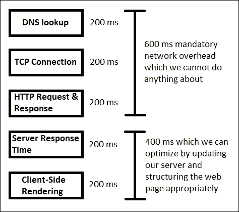
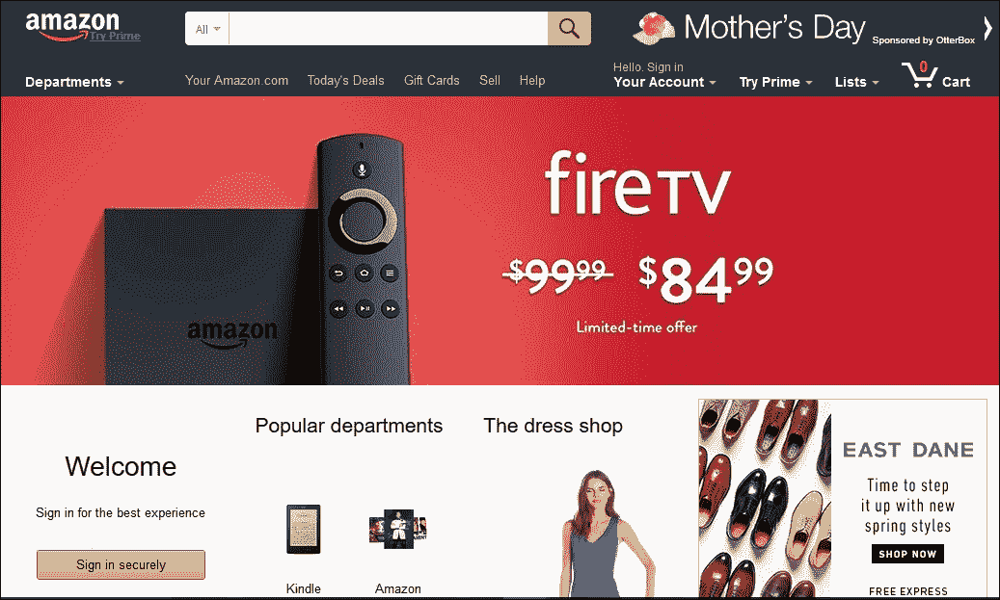
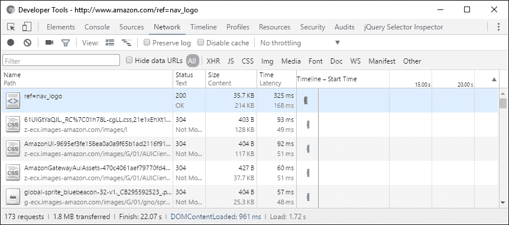

# 五、测试和优化性能

在本书的整个过程中，我们已经探索了响应式网页设计的一些要点，使用 HTML5 和 CSS3，并学习了如何开始修改我们的代码，使内容在不同的设备上响应。

我们应该记住，仅仅建立一个响应性强的网站是不够的，我们还必须测试和优化内容，以便在不同的设备上尽可能高效地工作。 如果我们网站上的页面加载缓慢，那么这显然是一个问题。 在本章的整个过程中，我们将看看一些提示和技巧，我们可以开始使用，以确保我们的网站是足够的响应和内容加载迅速。

在本章中，我们将涵盖以下主题:

*   探索页面加载缓慢的原因
*   优化我们的网站的性能
*   测量站点的性能
*   测试跨浏览器兼容性
*   探索最佳实践

好奇吗? 让我们开始吧!

# 理解速度的重要性

使用不同设备访问互联网意味着速度至关重要——从托管服务器下载内容所需的时间以及用户与网站交互的速度是任何网站成功的关键。

为什么关注我们网站在移动设备或那些屏幕分辨率较低的设备上的性能很重要? 这有几个原因，它们包括以下几点:

*   近 80%的互联网用户拥有智能手机
*   大约 90%的用户通过移动设备上网，48%的用户使用搜索引擎研究新产品
*   如果加载时间超过 5-6 秒，大约有 72%的用户会放弃某个网站
*   移动数字媒体使用时间现在明显高于桌面

如果我们不考虑这些统计数据，那么我们可能会继续建设我们的网站，但如果我们没有充分考虑我们的网站应该在哪里工作，最终客户会失去收入和市场份额。 与此相结合的是性能问题; 如果我们的网站运行缓慢，那么这就会让客户望而却步，从而导致销售损失。

总部位于旧金山的 Kissmetrics 进行的一项研究表明，手机用户在关闭网站之前会等待 6-10 秒，并对其失去信心。 与此同时，Guy Podjarny 对 Mediaqueri.es 网站([http://mediaqueri.es](http://mediaqueri.es))进行的测试表明，我们经常在大屏幕和小屏幕上下载相同的内容; 这是完全没有必要的，因为通过一些简单的改变，我们可以改变内容，以更好地适应桌面 pc 或移动设备!

那么，我们能做什么呢? 好吧，在我们开始探索在哪里进行更改之前，让我们看看为什么站点运行缓慢的一些原因。

# 理解页面加载缓慢的原因

虽然我们可以构建一个跨多个设备运行良好的网站，但如果它运行缓慢，那就不好了! 当然，每个网站的运行方式都不一样，但是有很多因素需要考虑，这些因素会影响页面(和网站)的速度:

*   **不必要的数据下载**:在响应性站点上，我们可能会隐藏在较小设备上没有显示的元素; 在代码中使用`display: none`意味着我们仍然会下载内容，即使我们没有将其显示在屏幕上，这将导致站点速度减慢，带宽占用增加。
*   **在缩小图片之前下载图片**:如果我们没有优化我们的网站，让图片的大小合适，那么我们可能会在移动设备上下载比需要更大的图片。 当然，我们可以通过使用基于百分比的大小值使它们变得流畅，但如果原始图像仍然太大，这就需要服务器和浏览器重新调整它们的大小。
*   **一个在站点上使用的复杂 DOM**:当创建一个响应式站点时，我们需要添加一层额外的代码来管理不同的设备; 这使得 DOM 更加复杂，并降低了站点的速度。 因此，我们必须避免添加任何需要浏览器额外解析时间的不必要元素。
*   **从外部来源下载媒体或提要**:不用说，这些都不在我们的控制之下; 如果我们的网站依赖于它们，那么如果这些外部来源失败，我们的网站的速度将受到影响。
*   **Flash 的使用**:大量使用 Flash 的站点访问速度明显比那些不使用 Flash 的站点慢。 值得考虑的是，我们的网站是否真的需要使用它; Adobe 最近的变化意味着 Flash 作为一项技术正在被淘汰，取而代之的是使用 HTML5 Canvas 或 WebGL 等其他方式的动画。

还有一点需要考虑，我们没有在这个列表中提到; 自从 90 年代中期互联网出现以来，页面的平均大小已经显著增加。 虽然这些数字可能不是 100%准确，但它们仍然让我们清楚地看到事情是如何发生变化的:

*   **1995**:当时的平均页面大小约为 14.1 KB。 其原因可能是它包含大约两到三个嵌入对象，比如图像。 这意味着只需对网站所在的服务器进行两三次呼叫。
*   **2008**:平均页面大小增加到约 498 KB，平均使用约 70 个对象，包括对 CSS、图像和 JavaScript 的更改。 尽管随着宽带可用性的提高，这一点得到了缓和，但并不是每个人都能负担得起快速访问，所以如果我们的网站加载缓慢，我们将失去客户。

但并不是所有的东西都丢失了——我们可以使用一些技巧来帮助优化我们网站的性能。 其中许多同样适用于标准站点和响应站点——让我们更详细地了解一下。

# 优化性能

到目前为止，我们已经探讨了站点运行缓慢的一些原因，以及如果不解决性能问题所面临的后果。 尽管我们可能面临的一些问题可能不容易解决，但我们仍然可以影响有助于提高站点性能的更改。

## 从谷歌开始

分析表明，如果页面加载时间超过 4-5 秒，那么客户通常会用脚投票(也就是说，离开)。 任何超过一秒的延迟都可能导致糟糕的用户体验。

一个伟大的来源，可以帮助我们了解我们的一些问题是在哪里是那个庞然大物，谷歌。 我们可能会批评它无所不能，但它显然知道一些有用的技巧!

谷歌声明我们的页面不必在 4-5 秒内全部加载，但应该在这段时间内可用; 任何优先级较低的内容都可以放在下方或加载到后台。

在一个基本的层面上，谷歌建议我们的服务器响应时间应该小于 200 毫秒-我们还应该探索一些方面，如客户端渲染，以帮助减少加载我们的内容所花费的时间:



尽管其中大部分适用于任何站点，但这对于响应式站点尤其重要，因为管理移动设备的体验需要额外的代码。

谷歌还建议我们应该考虑执行以下任务:

*   最小化呈现内容所需的重定向和往返次数
*   优化 JavaScript 执行和图像大小
*   通过将脚本推到页面底部，避免在页面上方内容中 JavaScript 和 CSS 的外部阻塞
*   减少从一个页面调用的域的数量，这有助于避免移动和桌面客户端之间的重定向

此外，我们可以探索使用其他技巧来帮助提高性能。 这些措施包括:

*   **缓存的使用**:我们可以考虑将其作为一种暂时存储数据的方法，它不会经常更改; 如果内容没有改变，它将有助于减少对服务器的请求数量(并因此减少带宽使用)。 随着 HTML5 的出现，我们甚至可以使用离线的 AppCache 功能。 这还有一个额外的好处，就是如果我们的互联网接入失败，可以让内容离线可用。 类似的技术也存在于本地存储中; 虽然这在默认情况下不能离线使用，但如果需要，可以使用它来缓存更持久的内容。
*   **可伸缩矢量图形(SVGs)的使用**:与 JPEG 或 PNG 图像不同，这些图像可以调整大小而不损失质量，因此是响应式设计的完美之选; 它们的尺寸通常比等效的标准图像要小。 这些并不适合每一个应用程序，因为它们的使用更适合线条绘图或标志。
*   **应用片段缓存**:如果我们生成的动态页面需要服务器资源渲染，但只有一小部分发生了变化，那么应用片段缓存意味着我们可以存储不发生变化的内容的静态版本。 当请求一个页面时，我们发送缓存的内容，并且只应用更新内容所需的更改。 这减少了对数据库后端的调用次数，从而减少了显示内容所需的资源。
*   **优化数据库**:如果我们的网站是一个内容来自不同来源的网站，那么内容会频繁更新; 垃圾数据同样会增加。 我们应该花时间定期清理数据库中的内容，以确保它尽可能小，并尽可能高效地工作。

## 更进一步

如果我们想进一步探索，那么我们可以使用一些更先进的、有侵略性的改变来帮助优化我们的站点。 这些需要更多的工作，所以应该计划为长期的变化:

*   **启用 GZip 压缩**:我们可以使用它来压缩资源，这将使页面加载更快。 然而，这不应该在没有规划的情况下应用于整个站点; 一些元素(如 CSS 或 JavaScript)在开发过程中可以压缩或缩小，因此应用 GZip 压缩不会带来任何好处。
*   **选择主机**:有几十台主机可用; 每一个都将提供不同级别的功能和性能，可以对我们网站的运营产生影响。 花时间选择合适的主机是很重要的; 比较不同的主持人是值得的，看看他们的表现如何，并从其他人那里得到谁在较长时间内表现良好的建议。

### 提示

查看[http://www.whoishostingthis.com](http://www.whoishostingthis.com)有关公司的评论，看看它们与其他公司相比如何。

*   **排除不需要的内容或媒体**:这应该是不言自明的，但我们不应该加载不需要的内容! 理解客户需求是关键; 如果客户坚持提供一切从桌面和移动设备,那么它可能需要带他们在为什么这不是一个好的行动,鼓励他们发现移动设备上提供更少的内容并不一定会导致糟糕的用户体验。
*   **探索内容交付网络(cdn)的使用**:这有助于更快地呈现内容，因为它是从离客户端最近的本地服务器获取的。 内容通常被上传到一个中心点，但随后被复制到世界各地的几个关键服务器; 这减少了在屏幕上渲染内容所花费的距离和时间。
*   **限制 HTTP 请求**:作为开发的一部分，我们应该考虑我们的站点将不得不向服务器发出的 HTTP 请求的数量，并尽可能地减少这些请求。 这种减少将有助于减少网络流量和提高性能，因为我们不需要频繁地访问 DOM，也不需要等待下载内容的时间长。 我们可以使用工具(如创建图像精灵或预处理程序)将多个 CSS 文件合并为一个，以帮助将 HTTP 请求降到最低。

优化网站是需要时间的，但是花费在优化网站上的努力将会带来更多的惠益，并最终增加销售。 问题是，我们不知道我们的网站表现如何，除非我们测试它; 让我们更详细地探索一些工具来帮助衡量我们的站点的运行状况。

# 测试我们网站的性能

我们构建了响应式页面，改进了外观和感觉，还优化了站点的性能。 但在应用程序上线之前，开发人员(或专门的测试人员)有责任测试网站的性能。

有一套我们可以使用的工具:

*   **mobiReady**([http://ready.mobi/](http://ready.mobi/)):此免费工具用于在不同分辨率上并行测试响应性网站的性能。 它根据发送或接收的数据和请求次数等因素给每个页面打 5 分。
*   **Webpagetest**([http://www.webpagetest.org/](http://www.webpagetest.org/)):这个在线工具帮助测试一个网站的性能与我们想要的结果的特定位置和浏览器有关。 我们可以测试一个页面的许多不同因素，比如缓存静态内容、CDN 的有效使用，或者是否启用了 keep alive。
*   **谷歌的 Pagespeed 见解****工具**([https://developers.google.com/speed/pagespeed/insights/):有了这个工具,我们可以做我们的响应速度分析网站在桌面和移动版本的网站。 这个工具为网站的速度和用户体验评分 100 分，提供了一个我们可以修复的指针列表，以及如何修复它们的细节。](https://developers.google.com/speed/pagespeed/insights/)
*   **IntoDns.com**([http://www.intodns.com/](http://www.intodns.com/)):虽然这不是一个性能测试工具，但它可以帮助确定我们的站点的性能是否由于 DNS 问题而受到影响。 它提供了网站和邮件服务器的报告，我们可以用它来解决问题，并最终帮助保持性能在最高效率。
*   **YSlow**([http://yslow.org/](http://yslow.org/)):该书签将所选网站分为三个预定义的规则集或我们定义的自定义规则集。 它根据不同的值数组提供了改进页面性能的建议，比如 DNS 查找、使 AJAX 可缓存、避免 CSS 表达式和配置 etag。

这些是一些有用的工具，可以帮助我们的网站的性能和优化(有更多的在线可用)。 然而，如果我们只关注这些工具，我们就会错过一个机会。 使用浏览器中已有的内容怎么样?

大多数(如果不是所有)浏览器都有某种形式的 DOM 检查器内置在浏览器中，或者作为一个独立的选项。 这些可以提供一些有用的信息，我们可以将这些信息用作外部服务更深入细节的先驱。 为了了解什么是可行的，让我们看看如果我们在 DOM 检查器中对一个网站运行一个简单的检查，我们可以得到什么; 在本例中，我们将使用在线零售的元老——亚马逊; 它的网站遍布世界各地。 我们将执行相同的测试两次:第一次作为桌面浏览器，第二次作为(模拟的)移动版本，使用 Chrome 内置的 DOM 检查器。

## 完成桌面示例

在我们的测试中，我们将从桌面浏览器开始——我们将使用谷歌的 Chrome，因为它有一组很好的工具; 也可以使用其他浏览器，但可能不会得到完全相同的结果。 让我们开始吧，使用 Amazon 作为我们测试的基础:



以下是我们需要做的:

1.  启动 Chrome,然后按***转变***+***Ctrl***+【显示】**我**工具栏显示开发人员。
2.  寻找窗口左上方的红色记录按钮，然后单击它。
3.  回复到 Chrome 的窗口，然后浏览到[http://www.amazon.com](http://www.amazon.com)。 当页面加载完成后，点击红色的 record 按钮停止录制。

此时，我们将有一组可以浏览的结果，类似于下面的摘要:



起初，这些结果可能没有意义，但我们想要的细节在窗口的底部。


这显示了发出的服务器请求的数量、传输的内容量以及最初解析 DOM 所花费的时间(`DOMContentLoaded`); 然后，完全下载内容(通过触发**Finish**和**Load**事件表示)。

### 注意事项

请注意，`DOMContentLoaded`时间仅用于解析文档，不允许其他资源(如脚本、图像或外部样式表)是否已下载。

即使 Amazon 的站点下载了相当数量的内容，他们也很好地利用了我们介绍的一些技巧，以帮助减少带宽占用并提高页面呈现速度。 我们怎么知道呢? 尝试点击屏幕截图中显示的底部两个链接(或者浏览器中显示的资产列表中的链接 4 和 5)。

第一个链接显示了一个缩小的 CSS 样式表; 如果我们更详细地查看它，可以推测其中的一些链接是使用自动化过程生成的。 在一个例子中 PNG 文件名超过 70 个字符! 使用较长的名称会增加有关档案的档案大小; 图像需要准确命名，但文件名长度要合理!

考虑到页面的大小和请求的数量，可以认为这个网站面临着性能问题。 然而，如果我们更仔细地看，我们可以看到很多内容正在后台加载。 这意味着我们仍然能够提供良好的用户体验，优先级高的内容将首先加载，而优先级低的内容将在后台加载。

### 注意事项

要了解更多的设置意味着什么，在 Chrome 的开发者工具栏的网络标签，看看谷歌开发者网站的主要文档，在[http://bit.ly/2ay9H8g](http://bit.ly/2ay9H8g)。

现在让我们改变轨道，专注于在移动设备上浏览同一个网站——这次是 iPhone 6 Plus。

## 在移动设备上查看

我们再次执行相同的测试，但这一次设置 Chrome 模拟 iPhone 6 Plus，然后我们应该看到:


但真正的测试是请求的数量、传输的数据量和加载页面所花费的时间。 这一次，我们的浏览器发出了 103 个请求，从服务器传输了 1.8 MB，并在大约 12 秒内完成了全部下载:


在这里，我们可以清楚地看到，为了给客户提供最好的用户体验，Amazon 巧妙地减少了页面大小和请求的数量。

我们应该不断地监控我们的站点的性能; 通过频繁地添加或更新 CSS3 属性，我们可以开始更新站点，并开始删除对外部库的依赖，这允许我们提高站点的速度，并最终提供更好的用户体验。

# 最佳实践

在本节中，您将学习一些最佳实践和范例，将帮助我们实现 web 开发的实际目标:

*   **砖块优先设计范例**:在构建响应式站点时，在添加额外的功能来管理桌面使用之前，最好以移动设备为基准进行设计。 我们的心态应该是整合满足移动设备用户的最低要求。

今天，我们知道每年移动设备的很大一部分销量已经被智能手机超越。 虽然大部分用户并不经常购买移动设备，但他们仍然拥有能够支持 web 应用程序甚至本地应用程序的设备。 除此之外，还有一些人使用老一代的智能手机。 我们甚至可以添加其他设备，如 kindle 和半联网设备; 如果我们把这些数字加起来，就会得出惊人的总数。

现在，让我们考虑一些案例:

*   他们不会进行研究
*   他们不会读长篇文章

那些使用老式手机的用户可能不得不使用与普通固定电话类似的标准键盘来浏览页面，而不是使用标准键盘。

旧设备屏幕尺寸小，很难提供移动优先的布局; 因此，我们只显示这些用户最基本的内容，而将其他元素从显示或下载中删除，这一点变得更加重要。

# 提供对旧浏览器的支持

另一个最好的做法，以改善我们的网站性能的老设备，这些设备的功能有限，并没有像今天的移动设备一样快。

我们知道，既然我们有互联网，我们就有网页浏览器来显示内容。 我们不应该忘记，还有一些用户仍然在使用较老的移动设备，他们缺乏现代等效设备的功能; 我们可以使用优雅的降级来处理这个问题。

优雅降级是一种策略，用于处理不同浏览器的网页设计。 如果我们使用优雅降级策略构建一个网站，那么它将首先被现代浏览器浏览，然后是旧浏览器，后者的功能较少。 它应该降低这样一种方式，我们的网站仍然看起来很好，就外观和感觉，仍然是功能，但少的功能。

### 注意事项

请注意，优雅降级并不意味着我们告诉用户下载最新的浏览器来查看我们的网站。

但今天的现代设计人员和开发人员不喜欢这种方法。 主要原因是，它经常变成一个需求，我们的用户应该下载最新和更新的浏览器，以查看我们的网站的最佳视图。 我们应该记住，这不是优雅的退化。

如果我们要求用户下载一个现代浏览器，那么这意味着我们使用的是以浏览器为中心的方法。 对于优雅降级，我们应该记住以下几点，这同样适用于渐进式增强:

*   我们应该编写有效且符合标准的 HTML
*   我们应该使用外部样式表
*   我们应该始终在外部链接我们的脚本
*   我们应该始终确保我们的内容能够在没有 CSS 或 JavaScript 的旧浏览器中访问

## 考虑支持哪些特性

在开发响应式站点时，我们应该检查我们的目标浏览器或设备是否支持特定的功能，而不是简单地假设它可以使用。

例如，如果我们要在旧 Android 手机上安装最新的 Chrome 浏览器，我们可能会认为它将支持最新的功能，如 CSS 动画、背景视差效果和 WebGL。

但是，这是真的吗? 如果我们试图操作一个依赖于旧 Android 设备不支持的功能的站点，会发生什么? 最终的结果可能是我们的浏览器失去响应或崩溃; 我们将不得不重新启动它来恢复服务。

Android 用户最近面临着这个问题，其中最明显的问题是谷歌 Talk/Hangout。 随着他们的升级，由于旧设备上的性能问题，最轻量级的聊天服务谷歌变成了一个几乎不可用的应用程序。

通过这种方式，过滤掉那些在小屏幕上不那么有用和不太相关的功能是非常重要的。 利用近距离传感器的应用程序就是一个很好的例子。 这促使制造商将这一功能作为所有新款智能手机的标准功能。

## 让用户选择他们想要的

我们开发了一个吸引眼球的、响应迅速的、动画的、以触摸为导向的网站，但是对于那些网络连接不好或者设备陈旧的用户呢?

如果网站在初始加载或后续页面刷新期间出现挂起，我们该怎么办?

读者当然会对他们应该做什么感到困惑。

这是我们应该做的一件简单的事情。 曾经运行 Gmail 在一个旧设备或缓慢的互联网连接? 如果是，那么你一定已经注意到**加载基本 HTML(用于慢速连接)**，甚至是这个 gem，慢速连接意味着我们可能被迫使用 Gmail 的简单视图，因为慢速互联网连接使得使用标准视图是不可能的:


对于少数习惯于高速电缆或宽带连接的精英来说，他们可能很难相信其他用户没有这种奢侈，而被迫使用基本的观点，就像我们的例子中所发生的那样。 使用此选项加载 Gmail 的基本 GUI 版本，该版本针对较慢的连接进行了优化，并允许用户与站点交互。

这说明了一个很好的观点——如果站点必须使用最新的特性，那么我们应该考虑在应用程序中实现基本或标准模式。 我们从那些拥有所有最新功能和获得所有流量的精选站点发展而来，为用户提供他们在网站上寻找的东西是他们所关心的。

## 我们需要包括整个图书馆吗?

我们应该始终遵循*使用*或*保留*的标准。 跟踪所有正在使用的库和模块是很困难的; 我们必须在使用的库和维护站点速度之间找到一个良好的平衡。

许多框架和库现在都可以自定义其中提供的功能; 例如，我们可能只需要 jQuery 的关键元素(如果我们正在使用它); 我们可以选择在下载库时排除冗余功能。 然而，如果我们仍处于开发阶段，那么我们将需要整个库; 我们可以选择运行应用程序所需的部件，然后将其缩小到生产使用。

# 考虑跨浏览器兼容性

任何开发者都必须牢记的一个问题是，在构建网站时如何保持最大的浏览器兼容性; UI 是否出色并不重要，只要它不能在足够多的浏览器上运行!

任何不支持其目标浏览器市场(即站点用户使用最多的浏览器)的站点都有失去业务和声誉的风险。 这使得我们不仅要测试我们的站点，而且要在多个浏览器上测试它，如果我们要使它具有响应性，这就变得更加重要了。 这种测试是保持客户满意度和市场份额的关键步骤。 我们可以使用许多技术来帮助减少与跨浏览器兼容性相关的问题，在我们考虑一些可用的解决方案之前，让我们更详细地看看我们面临的一些挑战。

## 概述挑战

对任何设计师来说，乌托邦是拥有一个 100%没有漏洞的网站; 但事实是，虽然这一直是开发者的想法，但这是不可能实现的!

为什么? 一个关键的考虑是使用 CSS3(以及现在存在的那些 CSS4 元素); 尽管对 CSS3 属性的支持在不断改进，但要实现每个浏览器对所有 CSS3 属性的一致支持，还有很长的路要走。 同样，老式浏览器也不支持响应式媒体和媒体查询，因此我们必须考虑我们能为这些浏览器提供多少支持。

考虑到可能的解决方案，我们已经接触了三个元素，这是响应性网站的关键考虑因素，围绕它们工作，有许多选项可供我们选择。

我们可以(也应该)考虑使用可以在任何浏览器上运行的基础内容来构建我们的网站; 然后，我们可以通过添加一些可能只适用于某些浏览器、但对整体用户体验并不关键的额外功能，逐步增强体验。 相比之下，我们可以认为，我们是围绕最新的技术和浏览器构建站点的，但随后添加了支持，以便在较旧的浏览器上使用时，允许内容优雅地降级。

我们能解决这些问题吗? 当然，有很多不同的选择。 有一点我们应该考虑，使用 JavaScript 解决方案不一定是最好的解决方案; 有很多技巧和技巧可以帮助我们保持兼容性。 在我们讨论这些之前，让我们花点时间来考虑一下使用 JavaScript 作为解决方案时可用的一些选项:

*   **Adapt.js**:这个脚本不使用媒体查询; 相反，它会根据浏览器窗口大小等值计算要加载哪个 CSS 文件。 该脚本可从[http://adapt.960.gs/](http://adapt.960.gs/)下载。
*   **Modernizr.js**:这个库允许我们选择我们想要支持的元素，比如 HTML5`<video>`元素; 当检测到所选元素正在使用时，Modernizr 为我们提供了一个选项来优雅地降级内容，而不是让我们的站点简单地落入堆中! 该库可从[https://modernizr.com/download](https://modernizr.com/download)获取。
*   **response .js**:这个解决方案使用 JavaScript 为旧浏览器(如 IE6-8)提供断点支持，基于我们在配置页面时指定的大小。 我们可以像使用标准的基于 css 的断点一样使用它，比如将设备宽度设置为 414px，以满足人像模式下的 iPhone 6 Plus。 该库的更多详细信息和下载可从[http://responsejs.com/](http://responsejs.com/)获得。

尽管这些解决方案都能很好地工作，但它们都有一个固有的缺陷——javascript ! 在这个现代时代，大多数浏览器都可能默认打开这个选项，但也有一些情况不是这样; 让我们来探究一下为什么使用 JavaScript 并不总是正确的解决方案。

## 了解 JavaScript 的缺点

在任何响应站点的构建阶段，我们自然需要确定我们想要支持哪些断点。 这将基于统计数据，如谷歌分析。 通常的方法是在 CSS 样式表中使用媒体查询在需要的时候加载元素。 这对于最近的浏览器(任何在过去一年到 18 个月之间的浏览器)都可以很好地工作，但对于较老的浏览器来说，这将是一个问题。

我们可以使用基于 javascript 的解决方案来支持它们:

*   我们提到的所有解决方案都需要 JavaScript——如果关闭了 JavaScript，那么它们显然就无法工作了!
*   有些解决方案使用 AJAX 来获取内容(比如 Adapt.js)。 这可以在获取内容时显示一个简短的闪光。 开发者试图将其最小化，但无论他们如何努力，都无法摆脱它; 它在网站上使用时看起来很奇怪。
*   有些解决方案不能在旧设备上运行，Adapt.js 就是一个很好的例子。
*   如果 JavaScript 被关闭，我们可以使用一个默认的样式表，使用`<no script>`标签; 问题是，我们支持什么屏幕尺寸?
*   使用 JavaScript 将需要服务器加载额外的资源，这将对服务器产生额外的需求; JavaScript 总是被设计为提供额外的功能，当这些功能是站点成功运行的关键时，就不应该使用。

显然，当使用 JavaScript 时，这些缺点会降低选择的吸引力! 我们应该问的两个关键问题是:我们真的需要支持旧的浏览器，比如 IE8，并使用 JavaScript 来支持它们吗?

## 提供 css 解决方案

支持哪种浏览器的问题将会把开发人员和设计人员分开; 一方面，我们会有一些创意人员想要利用最新的功能，而另一些人会说我们必须支持尽可能广泛的浏览器。

后者通常需要在较旧的浏览器中使用 JavaScript; 考虑到这需要从服务器调用额外的资源，在可能的情况下使用 CSS 是有意义的。 为此，我们可以考虑使用相对较新的`@supports`特性(或特性查询，其技术名称)。 这与媒体查询的工作方式类似，允许我们根据浏览器是否支持所选择的样式来设置元素的样式。 这在最近的浏览器中得到了很大的支持(当然 IE 除外，它总是喜欢与众不同!)


然后我们可以在主标记中创建如下代码:

```html
<article class="artwork"> 
   
</article> 

```

当它被支持的时候，使用这样的代码样式:

```html
@supports (mix-blend-mode: overlay) { 
  .artwork img { 
    mix-blend-mode: overlay; 
  } 
} 

```

然而，如果它不被支持，那么我们只需添加一个特性查询来允许它优雅地降级:

```html
@supports not(mix-blend-mode: overlay) { 
  .artwork img { 
    opacity: 0.5; 
  } 
} 

```

这样做的好处在于，我们不需要依赖任何外部库来支持可能的核心功能; 我们可以使用它来支持新的 CSS3 样式和现有的属性。 当然，这意味着我们的样式代码库将增加，但这是缓和的，因为增加的是已经缓存的现有文件，而不是必须从服务器调用额外的新资源!

# 测试站点兼容性

在这个阶段，我们的网站将被优化和测试的性能，但兼容性呢?

尽管大量可用的浏览器保持相对静态(至少对于主流使用的浏览器来说)，但它们提供的功能是不断变化的; 这使得开发人员和设计人员很难处理支持每种浏览器所需的所有细微差别。

此外，广泛的范围使得支持它的成本很高。 在一个理想的世界里，我们会支持所有可用的设备，但这是不可能的; 相反，我们必须使用分析软件来确定我们的站点正在使用哪些设备，因此值得支持。

## 想出一个解决方案

如果我们在 iPhone 6 等设备上测试我们的网站，很有可能它也能在其他苹果设备上运行，比如 ipad。 在三星(Samsung) Galaxy S4 等移动设备上进行测试也是如此; 我们可以使用这一原则来帮助优先支持特定的移动设备，如果它们需要进行比其他设备更多的调整。

但最终，我们必须使用分析软件来确定谁访问我们的网站; 诸如浏览器、来源、操作系统和使用的设备等信息将有助于确定我们的目标用户。 这并不意味着我们完全忽视其他设备; 我们应该努力确保他们与我们的网站工作，但这将不是一个优先发展期间。

需要注意的关键点是，我们不应该试图支持每一种设备; 这是太昂贵的管理，我们永远不会跟上所有的设备出售! 相反，我们可以使用分析软件来确定我们的访问者正在使用哪些设备; 然后我们可以测试一些不同的属性:

*   **屏幕尺寸**:这应该包括各种不同的分辨率的桌面和移动设备。
*   **连接速度**:测试不同的连接速度将帮助我们了解网站的行为，并确定我们可能需要进行更改的机会或弱点。
*   **像素密度**:有些设备支持更高的像素密度，这样可以显示更高分辨率的图像或内容。 在设计网站(尤其是响应性网站)时，我们显然希望将内容放在屏幕上正确的位置。 高分辨率显示器所提供的清晰度使其更容易调整内容在屏幕上的显示方式; 这将使它更容易查看和修复显示 web 内容的任何问题。
*   **交互风格**:通过不同设备查看互联网的能力意味着我们应该考虑我们的访问者如何与网站交互:它是纯粹在台式机上，还是他们使用平板电脑、智能手机或基于游戏的设备? 很有可能前两种方法会在一定程度上被使用，但后一种可能不会被高度使用。

一旦我们确定了应该支持哪些设备，就会有一系列工具可供我们使用，来测试浏览器的兼容性。 这包括物理设备(很理想，但维护起来很昂贵)、模拟器或在线服务(这些服务可以是商业的，也可以是免费的)。 让我们来看看一些可用的选项，以帮助我们测试浏览器兼容性。

## 探索可用的测试工具

当我们计划测试手机或响应式网站时，我们在开始测试前需要考虑一些因素，以帮助提供一个在所有设备和浏览器上看起来一致的网站。 这些因素包括回答以下三个问题:

*   网站看起来好吗?
*   是否存在已知的 bug 或缺陷?
*   我们的网站是否真的有响应性?

为了帮助测试我们的网站，我们可以使用几种可用工具中的任何一种(付费或免费); 需要注意的一点是，我们已经可以很好地了解我们网站的工作情况，只要简单地使用在大多数浏览器中都可用的 Developer 工具栏就可以了!

当然，这不是我们应该绝对依赖的东西，但它提供了一个完美的起点。 当我们已经超出了浏览器所提供的能力时，我们总是可以转向商业选择。 让我们简单看看有哪些:

## Chrome 浏览器浏览

我们可以很容易地模拟移动设备在 Chrome,按***Ctrl***+*【5】【T7 转变】+【显示】**米***; Chrome 浏览器在窗口顶部显示了一个工具栏，允许我们选择不同的设备:


如果我们点击菜单项(当前显示 iPhone 6 Plus)并将其更改为编辑，我们可以添加新设备; 这允许我们设置特定的尺寸，用户代理字符串，以及设备是否支持高分辨率图像:


现在让我们切换一下，看看 Firefox 中可用的选项。

## 在 Firefox 中工作

响应设计视图选项可以使用相同的***Ctrl***+*【5】【T7 转变】+【显示】**米***选择铬; 我们也可以通过导航到**工具**|**Web Developer**|**响应式设计模式**从菜单中访问它。

当该模式在 Firefox 中激活时，我们可以在不同的屏幕大小之间切换:


虽然浏览器可以在一定程度上显示我们的站点的工作情况，但它们只能满足有限范围的视图。 有时，我们需要更进一步，使用商业解决方案同时在多个浏览器上测试我们的站点。 让我们来看看一些商业上可用的选项。

## 探索我们的选择

如果您花了一些时间开发代码，那么很有可能您已经知道了 Browserstack(从[https://www.browserstack.com](https://www.browserstack.com))。 其他选项包括:

*   **GhostLab**:[https://www.vanamco.com/ghostlab/](https://www.vanamco.com/ghostlab/)
*   **Muir**:[http://labs.iqfoundry.com/](http://labs.iqfoundry.com/)
*   **CrossBrowserTesting**:[http://www.crossbrowsertesting.com/](http://www.crossbrowsertesting.com/)

然而，如果我们所需要做的只是检查我们的站点的响应程度，那么我们就不需要使用付费选项。 有一些网站允许我们检查，而不需要安装插件或其他工具:

*   :[http://ami.responsive.is](http://ami.responsive.is)
*   **屏幕查询**:[http://screenqueri.es](http://screenqueri.es)
*   **Cybercrab 的屏幕检查设备**:[http://cybercrab.com/screencheck](http://cybercrab.com/screencheck)
*   **Remy Sharp 的 check site**:[http://responsivepx.com](http://responsivepx.com)

我们也可以使用 bookmarklet 来检查我们的网站在不同设备上的工作情况，可以在[http://codebomber.com/jquery/resizer](http://codebomber.com/jquery/resizer)和[http://responsive.victorcoulon.fr/](http://responsive.victorcoulon.fr/)上尝试一下。 值得注意的是，当前的浏览器已经包含了这个功能，这使得 bookmarklet 作为一个选项的吸引力降低了。

# 遵循最佳实践

我们必须问自己的一个关键问题是，在开发网站时，我们将在多大程度上支持使用特定的浏览器。 解决这个问题的方法是监控分析软件，以确定正在使用的浏览器。

在大多数情况下，它应该显示正在使用的现代浏览器，但仍有有限的旧浏览器实例在使用; 例如，IE6 仍在使用中，尽管截至 2016 年 4 月，其市场份额仅为 0.25%。 这就提出了一个问题:我们应该支持,如果我们的网站监测分析表明,只有一个很小的比例(例如,低于 1%)使用老版本浏览器,然后我们可以决定不支持他们如果所需的努力和资源不证明回来这么小的市场份额。

这就是说，有一些基本的技巧可以帮助我们优化我们的网站:

*   我们应该尽可能避免使用黑客。 条件注释是一个更好的选择，尽管我们应该定期检查并删除不再适用的样式(例如不再适用的供应商前缀)。
*   尝试在代码中使用`<!DOCType html>`。 这将表明浏览器应该遵循 HTML5 规则; 如果浏览器不支持 HTML5，它会自动降级。
*   我们可以使用 W3C 验证服务来检查代码的一致性。 但更好的选择是将其融入开发过程; 我们可以很容易地用 Node.js 做到这一点，所以它可以自动完成。
*   在现代站点的时代，JavaScript 已经成为开发中必不可少的工具。 它太容易诉诸于使用它，而没有真正考虑可用的选项。 如果可能的话，尽量避免使用 JavaScript。 设计它是为了补充现有代码，不应该依赖它来提供核心功能。 CSS 现在的状态是这样的，以前只能在 JavaScript 中实现的样式功能现在可以在 CSS 中实现，并且提供更平滑的引导结果!

# 总结

在这一章中，我们了解了什么是性能，以及如果一个网站的性能不好会产生什么后果。 然后，我们探讨了什么因素可能导致我们的网页加载缓慢。 在本章中，我们还学习了如何利用各种可用的在线工具来衡量网站的性能，并介绍了我们可以采取的步骤，以改善我们的网站性能。 然后我们介绍了一些我们可以遵循的最佳实践与相关的网站性能。

然后，我们继续探讨维护跨浏览器兼容性的重要性，并考虑了一些可用于处理跨浏览器问题的解决方案。 然后，我们讨论了在测试跨浏览器兼容性时所面临的挑战。 除此之外，我们还发现了如何解决这个问题，并设计出一种获得最大产出的策略。 最后，我们看到了一些在线工具，用于测试我们的网站在各种浏览器-设备组合下的兼容性。 我们现在已经到达了我们的旅程的终点，通过创建响应网站的要点。 我们希望您像我们编写这本书一样喜欢阅读这本书，并且它帮助您开始使用简单的 HTML 和 CSS 进行响应式设计。