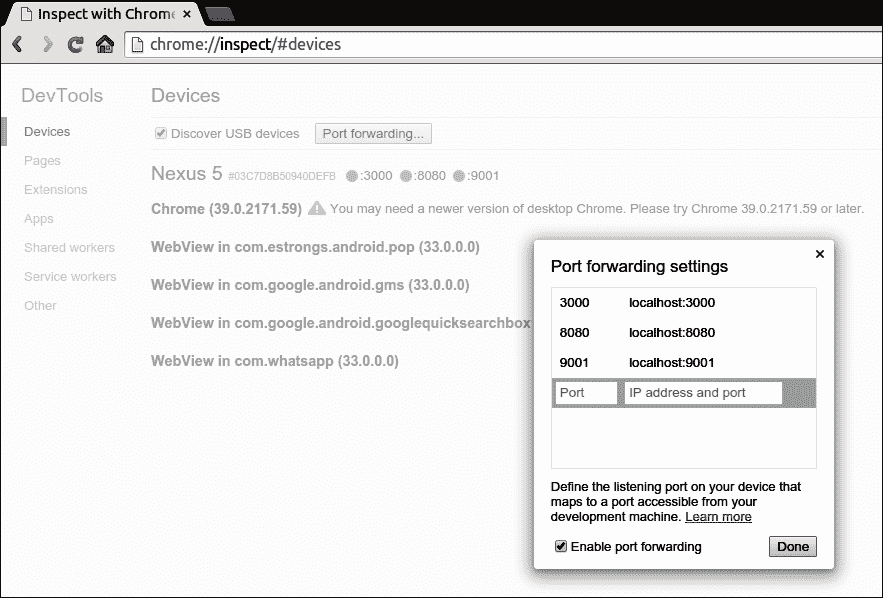
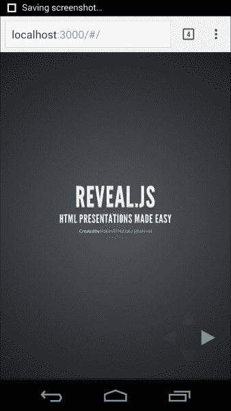

# 第五章。 移动和平板电脑的 WebSockets

WebSockets 在 Web 上工作得很好，性能也很好。 我们已经看到了在 web 上实现 WebSockets 是多么的简单和强大。 随着移动电话的增长，应用程序从桌面转移到移动的需求变得非常重要。 在这一章中，我们将关注 WebSocket 的行为及其在移动设备和平板电脑上的实现。

# 移动设备和 WebSocket

整个世界正转向移动设备; 那我们为什么不能呢? 手机已经变得非常强大，它们可以做电脑所能做的事情。 类似地，浏览器变得非常强大，它们也开始采用 HTML5。 不仅仅是浏览器，甚至应用程序的支持也增加了。 许多应用程序都具有许多特性。 在这里，WebSockets 扮演着重要的角色:每当需要实时数据传输时，WebSockets 就在那里帮助我们。 让我们看几个 WebSockets 有用的例子:

*   聊天应用程序
*   视频会议
*   游戏
*   仪表盘实时数据更新
*   股票应用程序
*   体育分数的应用程序
*   实时数据更新

现在，由于支持 HTML5 的现代浏览器，所有这些应用程序都可以在 Web 上创建，并且与浏览器兼容。

要在移动设备上实现 WebSockets，可以使用一些可用的库。 需要的是在不同的后端技术中提供一致的方式来实现 WebSockets。 有一些图书馆提供这些:

*   推杆式
*   套接字。 IO

## 推动者

push 是一个著名的库，它可以帮助你制作实时应用程序。 你可以在[http://www.pusher.com](http://www.pusher.com)找到。 它是一组库，用于与构建在不同服务器上的不同应用程序集成，例如 Ruby on Rails、Python、PHP 和 Node。 不仅在服务器端，它们还支持基于 javascript 的应用程序以及 iOS 和 Android 设备。

推送程序是一个基于事件的 API，并且实现了一个发布者/订阅者机制。 在这里，订阅者是服务器，发布者是客户端。 订阅者订阅事件，发布者触发订阅者侦听的事件。 为了实现这个功能，发布者和订阅者在内部实现 WebSockets，这基本上提供了实时体验。

push API 的另一个大优势是它有一个后备机制，当 WebSockets 不可用时，例如在一些旧版本的浏览器中，它会使用其他技术(如 Flash)在内部发送数据。 这为这个库提供了优势，因此我们不需要针对不同的浏览器和设备使用不同的实现。

## 插座。 IO

套接字。 IO 是另一个完全基于 JavaScript 的库。 不仅是客户端，它还完全支持 Node.js 服务器。 这个库提供了高性能的实时数据传输，并且在底层使用了 WebSockets。 您可以使用这个 API 创建各种实时协作应用程序。

# 运行移动服务器

直到现在我们在一个本地服务器和应用工作,但手机上运行应用程序,我们需要转变我们的客户端应用程序代码到服务器如此,它将满足应用程序从服务器 URL。 为此，我们将举一个简单的例子:基本上，我们将更改一个已经创建的应用程序。 在[第二章](2.html "Chapter 2. Getting Started with WebSockets")，*WebSockets 入门*中，我们开发了一个用于 Echo 测试的应用程序，它基本上会返回我们发送给服务器的任何内容。 现在让我们看看它在手机上是如何工作的。

首先，我们将修改服务器代码，使其迎合客户端代码。 以下是我们将在服务器端进行的更改:

```html
var express = require('express');

var app = express()

var http = require('http').Server(app);

app.use(express.static(__dirname + '/public'));

app.get('/', function(req, res)
{

  res.sendfile('public/index.html');

});

http.listen(3000, function()
{

  console.log('listening on *:3000');

});

var WebSocketServer = require('ws').Server
  , wss = new WebSocketServer({ port: 9001 });

wss.on('connection', function connection(ws)
{

  ws.on('message', function incoming(message)
  {

    console.log('received: %s', message);

    ws.send(message);

  });

  ws.send('Connected');

});
```

这里我们并没有针对手机做任何具体的事情; 我们刚刚创建了另一个服务器，它为我们提供了主客户机文件。 我们在这里使用了一个`Express.js`服务器，它有助于通过服务器传递内容。 你可以阅读更多关于 Express.js 服务器以及它如何在互联网上工作的信息。 这里，我们主要关注的是创建一个侦听特定端口的服务器。 因此，当任何人点击特定的 URL 时，我们将使客户机应用程序在浏览器上运行。

要安装 Express.js 服务器，我们只需要运行以下命令:

```html
npm install express

```

这个包需要安装在与我们的`server.js`文件相同的目录中。 这很重要，因为我们的服务器将运行并使用这个包，如果没有找到，那么服务器可能不会按照我们想要的方式工作，并抛出错误。

这里，我们监听的是`3000`端口，所以当我们打开`http://localhost:3000`时，它将打开指定的文件。 我们已经在`public`文件夹`index.html`下定义了文件。 因此，将为我们打开的第一个文件是`index.html`文件，我们将看到它的内容。 就像我们在前面的章节中所做的一样，我们也在对客户端代码进行相同的编码，并且实际上没有任何变化。 只有文件的位置发生了改变，其他内容都没有改变。

### 注意事项

确保所有的客户端代码及其相关库都将放在`public`文件夹中，因为我们是从公用文件夹中提取的，如果放置不当，可能会发生错误。

更改完成后，您可以启动服务器，并在浏览器中检查它是否工作。 当您侦听`3000`端口时，只需在浏览器中运行`http://localhost:3000`并确保应用程序正常运行。

## 移动上的本地服务器

完成更改后，我们需要在移动电话上运行本地服务器。 这似乎很难，但实际上并不难。 Chrome 为我们提供了一个很棒的功能，我们可以在移动浏览器上使用本地服务器。 以下是我们需要实现的在移动设备上运行本地服务器的步骤:

1.  在移动/平板设备中启动 USB 调试。
2.  使用 USB 连接您的设备到您的计算机。
3.  打开 Chrome 浏览器，进入`chrome://inspect`。
4.  这将检查连接的设备。
5.  Now the main setting we need to consider is **Port forwarding**. We are using two different ports: `3000` for the client and `9001` for the WebSocket server. Just make sure you add both of them in the **Port forwarding settings**.

    

    ### 提示

    如果您在设置移动设备时仍然遇到问题，请访问[https://developer.chrome.com/devtools/docs/remote-debugging](https://developer.chrome.com/devtools/docs/remote-debugging)。 您将获得关于如何设置您的移动设备的所有细节。

6.  一旦这些设置完成，你就可以开始了。 只需在移动设备上打开 Chrome 浏览器，打开服务器 URL`http://localhost:3000`，就可以看到神奇的效果了。 您将看到与在桌面上看到的相同的输出。

由于 HTML5，我们能够以一种非常简单的方式实现这种输出行为，因为 HTML5 在几乎所有的浏览器中显示一致的行为，并且它正在被大多数浏览器所采用。 这让我们能够使用 HTML5 WebSockets 和让应用在几乎所有地方运行。 在构建应用程序时，我们需要确保它具有响应式设计，因为移动设备有不同的分辨率和屏幕大小。 这是创建应用程序时需要注意的一个主要问题。 但多亏了 HTML5，我们有了媒体查询功能，让我们能够轻松处理这些场景。

### 移动输出

如您所见，应用程序的输出中没有的更改。 这和我们在桌面上看到的完全一样。


# 浏览器支持

HTML5 正被几乎所有的浏览器，甚至是移动和平板设备所采用。 这让我们在几乎所有现代浏览器中使用 WebSocket 应用程序时占了上风。 要查看支持哪些移动浏览器，请访问[http://caniuse.com/#feat=websockets](http://caniuse.com/#feat=websockets)，其中给出了支持 WebSockets 的所有浏览器列表。

# 你自己做吧

现在是时候自己做了:为移动设备创建应用程序和为桌面创建应用程序一样简单。 现在让我们将一些应用程序转换为移动应用程序。

## 场景 1

由于我们已经开发了一个演示分享和绘图应用程序，我们现在将使它们在移动端也可用。

### 提示

这是一项非常简单的任务:正如我们所知，我们只需要更改服务器，以便它提供客户机应用程序，我们就可以了。 我们不需要更改任何其他内容的原因是，我们用于应用程序的库编写得非常好，它们也可以适应移动视图。 试试吧。

这是当你在移动端打开演示共享应用程序时的样子:



## 场景 2

服务器将是相同的，但您可以玩弄客户端应用程序界面，使其响应根据设备屏幕大小，这可以通过使用**Bootstrap**类库实现。 而对于实时数据传输，可以使用 Socket。 IO API，真的很容易使用和实现。

### 提示

**创建一个桌面和移动聊天应用**

为此，您需要创建一个服务器，它只接收消息并将其广播给所有人。 而客户端会很简单，它只会向服务器发送一条消息。 这是非常简单和直接的，但问题是你需要为桌面和移动平台创造它。

请参考以下图片:


## 场景 3

制作一个提问游戏，你可以通过用户界面输入问题及其选项来提问。 另一个人会得到问题并回答它。 一旦收到回复，你马上就会收到。

### 提示

就像聊天应用程序一样，您可以使用相同的 Socket。 发送数据的 IO API。 剩下的一切都很简单——只要用户回答问题，您就可以使用 API 发送它。

# 总结

在本章中，我们已经看到了利用 HTML5 的特性来编写一个独立于设备的应用程序是多么容易。 几乎所有的现代浏览器都支持 WebSockets，这使得我们在开发一致的应用程序方面更加轻松——我们不必为不同的设备编写不同的代码。 我们还看到了 Node.js 如何为不同的设备提供灵活性和强大的支持。 在本章中，我们探索了不同的移动应用程序和一些帮助我们实现 WebSockets 的 api，以及如何设置一个本地服务器来运行应用程序。

在下一章中，我们将看到如何使用现代工具来增强 HTML5 web 应用程序的开发。