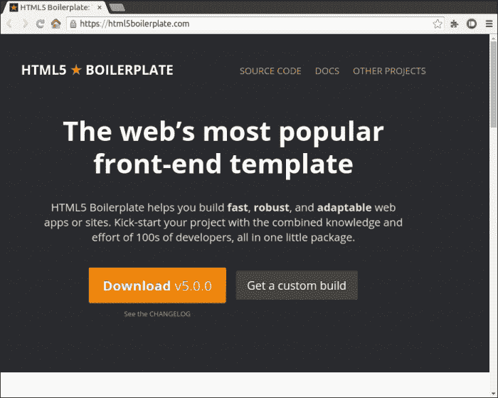
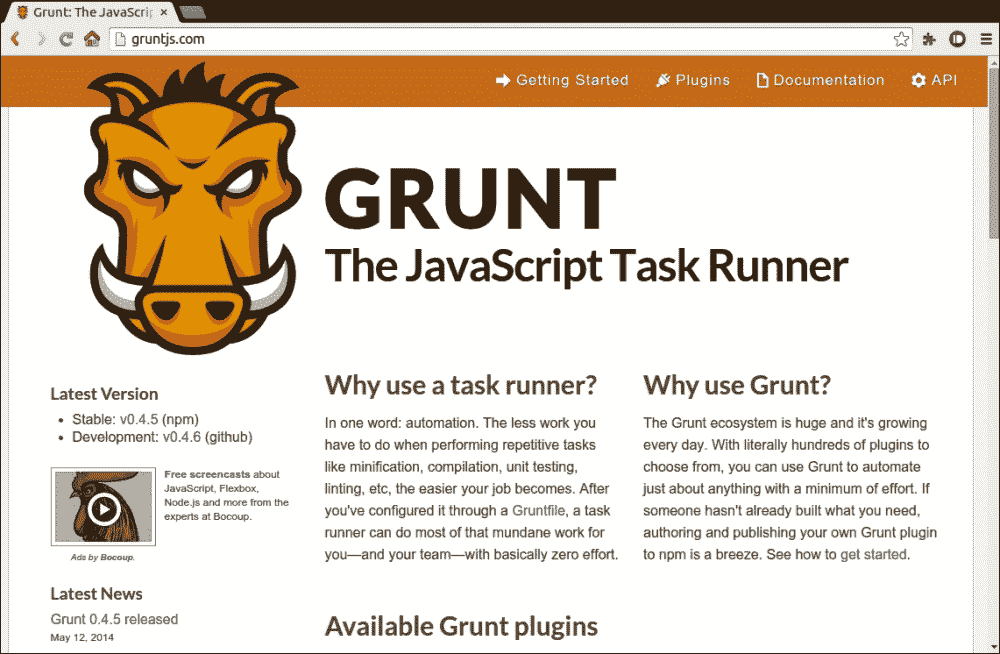
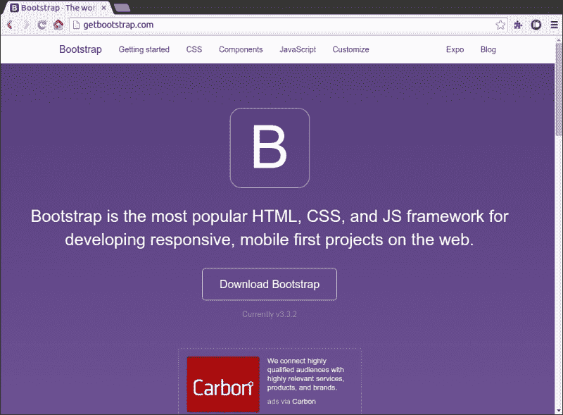
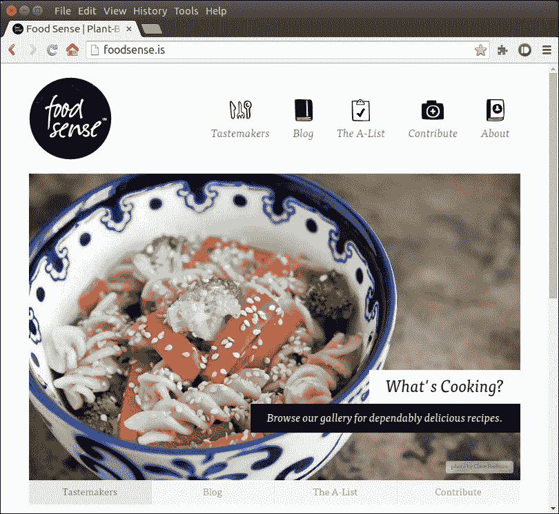
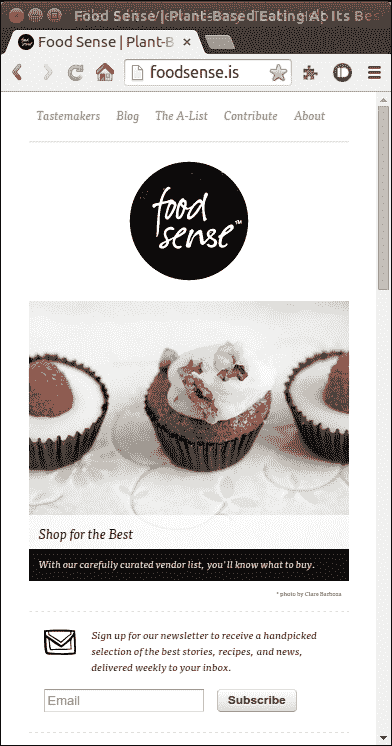

# 六、使用现代工具增强 HTML5 Web 应用开发

HTML5 是一个现代规范，它定义了很多我们在前面的章节中看到的特性。 应用开发中面临的最大问题之一是代码管理:如何构造应用，使其易于阅读、可扩展、可维护等等。 在本章中，我们将看到现代应用开发的现代方法或工具。 一旦我们了解了不同的技术、方法和工具，我们就有能力增强我们的应用能力。

# 现代工具和技术

有许多不同的工具和技术可以使开发过程无缝。 让我们来谈谈让开发者生活得更轻松的一些现代工具和技术:

*   代码编辑器
*   样板
*   包装工具
*   构建工具
*   应用框架
*   现代服务器
*   响应网页设计

## 代码编辑器

在开始编码之前，首先要选择用于编码的编辑器。 有许多可用的编辑器，但最受欢迎的是**Sublime Text**。 它是一个免费使用的工具，对不同的技术有很好的支持。

Sublime 提供的一些功能如下:

*   通过按*Ctrl*+*Shift*+*P*导航到文档中的任意位置
*   独立自由模式
*   伟大的插件 API 基于 Python，你可以试验
*   包控件，它提供了许多不同的包供您选择，并可以使用任何您想要的技术

## 样板

这些只是帮助加速过程的不同的现成模板。 我们都知道模板是什么以及它们的作用，让我们来看看一些样板的例子:

*   我们可以在 Sublime Text 中获得一个样板插件，这在应用开发过程中非常有用。
*   There are some boilerplates that help you create the complete code folder structure; one of them is [https://html5boilerplate.com/](https://html5boilerplate.com/).

    

*   Yeoman is another tool that helps in starting up a project quickly and can be found at [http://yeoman.io/](http://yeoman.io/). It is a very powerful tool; it not only helps in quickly starting applications but also provides workflow for these applications. It is mainly a tool to make you productive during different phases of the development process. It also provides you with a feature to make your own build configuration.

    

## 包装工具

随着应用的大小增加，当存在不同的依赖项时，管理就变得困难了。 在一个有几个不同的人从事同一项目的环境中，我们需要注意版本和依赖关系。 这个问题是由包管理员解决的。 现代技术中最流行的包管理器之一是 NPM。 NPM 为您提供了一种非常简单的方法来维护和安装包。

在前面的章节中，我们在应用中使用了 WebSocket 和 Express.js 包，并且只需要一个命令就可以安装它们。 使用包管理器可以轻松地制作应用的不同模块的包并发布它们。 有许多不同的包可用，我们可以利用它们使我们的应用更好。

Bower 也是提供包管理的非常有用的工具之一。 它基本上为您管理所有的事情，例如使用一个配置文件自行查找、下载和保存依赖项。

## 构建工具

当我们创建一个应用并且代码长度增加时，我们使用构建工具来构建应用，以获得优化、编译、测试和自动化的过程。 构建工具确实有助于为用户提供优化的应用。 自动化是构建工具最大的优势; 它会自己为你做所有的事情。 现在让我们来看看一些很棒的、简单的、现代的 HTML5 和基于 javascript 的应用的构建工具:

*   **Grunt**: The JavaScript task runner ([http://gruntjs.com/](http://gruntjs.com/))

    

*   **Brunch**: HTML5 build tool([http://brunch.io/](http://brunch.io/))

    

## 应用框架

给一个 T0 应用一个合适的结构是在开发过程中实现的关键。 许多应用在增长时失败都是因为它们的结构; 如果地基不好，那么无论你建造多大的建筑，总有一天它会倒塌。 与此类似，我们还必须考虑应用的结构。 有许多不同的框架可供我们使用，其中一些流行的是:

*   AngularJS
*   Ember.js
*   Backbone.js
*   Ext JS

## 现代服务器

对于 web 开发人员来说，服务器一直是一个问题，因为尽管有很多选择，但它们使用的是不同的技术。 学习另一种技术总是一种开销。 然而，Node.js，这是一个 JavaScript 服务器，解决了这个问题。 我们已经看到了它是如何工作的。 Node.js 服务器也有很多不同的包可用，您可以使用它们使您的应用更好。

## 响应式网页设计

UI 一直是任何应用的关键元素。 以前，我们只在电脑上打开应用和网站。 但现在情况正在改变; 手机和平板电脑正在进入市场并占领市场。 现在，许多公司都推出了他们的应用或网站的网络版。 由于这个阶段，开发者也为移动设备制作了相同的网站。 这是一件代价很高的事情，因为它涉及应用的所有生命周期阶段。

然而，在现代 HTML5 技术中，我们无需考虑太多，因为这项技术已经具备了功能:HTML5 中的一些特性可以帮助我们让相同的网站看起来更好或响应更快。 响应式意味着网站根据屏幕大小自行调整。 如果它是一个小屏幕，那么它不只是显示一个缩小版的实际网站; 相反，它以一种用户可读的方式缩放和重新调整所有内容。

再次强调，这需要在不同的地方改变网站，但我们已经建立了不同的图书馆，帮助我们在很短的时间内做出高响应的网站。 最常用的库之一是 Bootstrap。 这个库不仅能让你的网站快速响应，它还提供了一套完整的不同 UI 控件。

响应式 UI 最好的例子之一是网站[http://foodsense.is/](http://foodsense.is/)。 他们在 UI 的每一个细节上都做了很多工作。 如果你打开网站，你不会感觉到差异，但当你开始缩小浏览器窗口的宽度时，你将能够注意到变化。 这些变化是小而有用的:按钮变得更小，但主要内容是完美的。 当你不断缩小宽度，它会不断变化，即使在很小的宽度，也能提供一个完美的可读网站，这基本上显示了网站在移动设备上的样子。

让我们看看当我们改变浏览器的大小时，UI 是如何改变或适应的:

*   **In normal state on the desktop**: There you can see that it is just like any other website—a menu bar, an image slider, some buttons, and a subscribe option.

    

*   **In tablet size**: When we reduce the size of the window to that of a tablet, we can notice the changes. The left menu bar is on top now and the details on the button below the image slider are fewer. So the website just shows what is needed and hides some details as the screen size is smaller.

    

*   **In mobile size**: Now when we reduce the window size to the width of a mobile, we can see the menu is on top followed by the logo and the slider. Basically, the items are vertically stacked, which is the best view for mobile devices. We have seen how the UI changes as we change the width; this is all possible due to the media queries feature in HTML5.

    

## MEAN 堆栈

对于完整的应用开发，最好的工具之一是 MEAN 堆栈。 的意思是代表:

*   M for MongoDB

    

*   E for Express.js framework

    

*   A for AngularJS

    

*   N for Node.js

    

MEAN 栈为我们提供了构建 web 应用的现代技术。 要创建任何应用，我们需要一个服务器、一个数据库和一个客户机框架。 所有这些都在 MEAN 堆栈中考虑，并且彼此无缝集成，帮助开发人员构建大型应用。

在[http://mean.io/](http://mean.io/)有一个库，它提供完整的 MEAN 堆栈，并帮助您管理应用开发。 由于有了打包管理器，使用这些库在加速开发过程中非常容易和有用。

# 总结

本书向我们展示了用于快速应用开发的不同技术。 我们已经看到了 HTML5 的增强; 我们了解了 WebSockets 是如何工作的。 我们开发了一些基于 HTML5 和 WebSockets 的应用。 WebSockets 是最好的通信方法之一，它提供了一些很棒的特性，比如全双工通信，它允许客户端和服务器一起推送数据。 我们了解了如何将基于 node .js 的服务器与 WebSocket 服务器一起非常有用和容易实现。 我们实现并看到了使用 WebSockets 进行全双工通信的不同示例。 我们接触了一些不同的基于 javascript 的库，这些库提供了现成的组件供我们使用。 我们也看到了 WebSockets 在移动设备上的应用，也看到并理解了 HTML5 的不同移动网页设计功能。 最后，我们了解了可以帮助加速应用开发过程的各种工具和技术。 这些技术不仅有帮助，而且还为您的应用提供了新的外观和感觉。 使用包管理器可以轻松地管理依赖关系。 所有这些现代工具，MEAN 堆栈提供的加速开发，以及响应式网页设计将使你能够制作在所有设备上工作的现代应用。